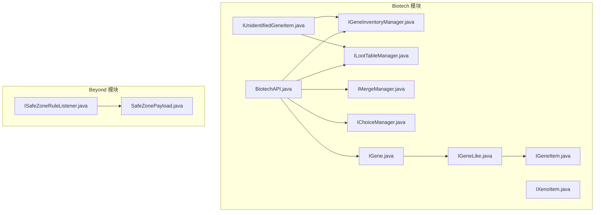
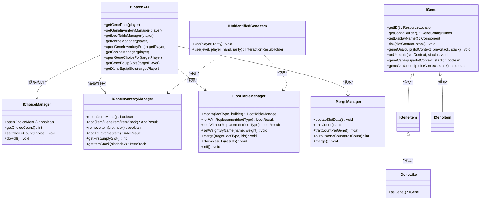
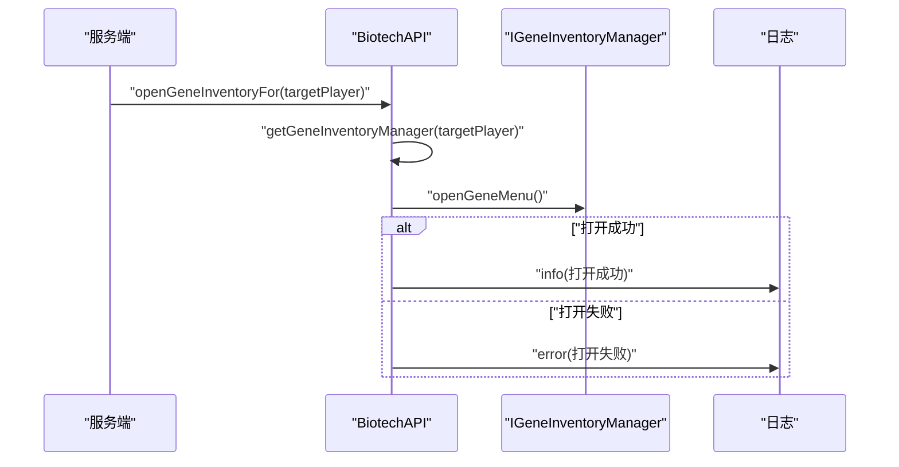
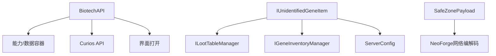

# API参考文档

<cite>
**本文档引用的文件**
- [BiotechAPI.java](file://Biotech/src/main/java/org/biotech/api/BiotechAPI.java)
- [ISafeZoneRuleListener.java](file://Beyond/src/main/java/com/pz/beyond/safeZoneRule/ISafeZoneRuleListener.java)
- [SafeZonePayload.java](file://Beyond/src/main/java/com/pz/beyond/network/SafeZonePayload.java)
- [IGene.java](file://Biotech/src/main/java/org/biotech/api/system/gene/core/IGene.java)
- [IGeneItem.java](file://Biotech/src/main/java/org/biotech/api/system/gene/core/IGeneItem.java)
- [IChoiceManager.java](file://Biotech/src/main/java/org/biotech/api/system/choice/core/IChoiceManager.java)
- [IGeneInventoryManager.java](file://Biotech/src/main/java/org/biotech/api/system/gene/core/manager/IGeneInventoryManager.java)
- [ILootTableManager.java](file://Biotech/src/main/java/org/biotech/api/system/loot/core/ILootTableManager.java)
- [IMergeManager.java](file://Biotech/src/main/java/org/biotech/api/system/merge/core/IMergeManager.java)
- [IGeneLike.java](file://Biotech/src/main/java/org/biotech/api/system/gene/core/IGeneLike.java)
- [IUnidentifiedGeneItem.java](file://Biotech/src/main/java/org/biotech/api/system/gene/core/IUnidentifiedGeneItem.java)
- [IXenoItem.java](file://Biotech/src/main/java/org/biotech/api/system/gene/core/IXenoItem.java)
</cite>

## 目录
1. [简介](#简介)
2. [项目结构](#项目结构)
3. [核心组件](#核心组件)
4. [架构总览](#架构总览)
5. [详细组件分析](#详细组件分析)
6. [依赖分析](#依赖分析)
7. [性能考虑](#性能考虑)
8. [故障排除指南](#故障排除指南)
9. [结论](#结论)
10. [附录](#附录)

## 简介
本文件为“基因猎人”子模块的API参考文档，聚焦于以下核心接口与能力：
- BiotechAPI：提供对玩家基因数据、界面打开、Curios槽位访问等的统一入口。
- ISafeZoneRuleListener：安全区规则监听器接口，用于定义安全区内/外的每tick行为以及伤害、怪物生成等事件处理。
- 自定义网络包 SafeZonePayload：基于NeoForge自定义包协议的数据载体，用于传输安全区中心与半径信息。

同时，文档覆盖Biotech模块中的基因系统核心接口族（如IGene、IGeneItem、IUnidentifiedGeneItem、IXenoItem、IGeneLike），以及与之配套的管理器接口（IChoiceManager、IGeneInventoryManager、ILootTableManager、IMergeManager）。每个API均给出参数说明、返回值描述、使用场景、注意事项与最佳实践，并提供与实际代码实现一致的路径引用与图示。

## 项目结构
本仓库包含多个子模块，其中与API相关的关键位置如下：
- Biotech 模块：提供基因系统API、管理器接口、数据模型与客户端渲染等。
- Beyond 模块：提供安全区规则与网络包等扩展功能。
- GalaxyLib、GameText、GeneHunter、ModFix：通用库与示例模块，不作为本API文档重点。

图表来源
- [BiotechAPI.java:1-92](file://Biotech/src/main/java/org/biotech/api/BiotechAPI.java#L1-L92)
- [ISafeZoneRuleListener.java:1-42](file://Beyond/src/main/java/com/pz/beyond/safeZoneRule/ISafeZoneRuleListener.java#L1-L42)
- [SafeZonePayload.java:1-31](file://Beyond/src/main/java/com/pz/beyond/network/SafeZonePayload.java#L1-L31)
- [IGene.java:1-91](file://Biotech/src/main/java/org/biotech/api/system/gene/core/IGene.java#L1-L91)
- [IGeneLike.java:1-6](file://Biotech/src/main/java/org/biotech/api/system/gene/core/IGeneLike.java#L1-L6)
- [IGeneItem.java:1-8](file://Biotech/src/main/java/org/biotech/api/system/gene/core/IGeneItem.java#L1-L8)
- [IUnidentifiedGeneItem.java:1-138](file://Biotech/src/main/java/org/biotech/api/system/gene/core/IUnidentifiedGeneItem.java#L1-L138)
- [IXenoItem.java:1-13](file://Biotech/src/main/java/org/biotech/api/system/gene/core/IXenoItem.java#L1-L13)
- [IChoiceManager.java:1-22](file://Biotech/src/main/java/org/biotech/api/system/choice/core/IChoiceManager.java#L1-L22)
- [IGeneInventoryManager.java:1-133](file://Biotech/src/main/java/org/biotech/api/system/gene/core/manager/IGeneInventoryManager.java#L1-L133)
- [ILootTableManager.java:1-77](file://Biotech/src/main/java/org/biotech/api/system/loot/core/ILootTableManager.java#L1-L77)
- [IMergeManager.java:1-52](file://Biotech/src/main/java/org/biotech/api/system/merge/core/IMergeManager.java#L1-L52)

章节来源
- [BiotechAPI.java:1-92](file://Biotech/src/main/java/org/biotech/api/BiotechAPI.java#L1-L92)
- [ISafeZoneRuleListener.java:1-42](file://Beyond/src/main/java/com/pz/beyond/safeZoneRule/ISafeZoneRuleListener.java#L1-L42)
- [SafeZonePayload.java:1-31](file://Beyond/src/main/java/com/pz/beyond/network/SafeZonePayload.java#L1-L31)

## 核心组件
本节概述BiotechAPI与Beyond模块中的关键接口，帮助快速定位所需能力。

- BiotechAPI
  - 功能：提供获取玩家基因数据、打开基因界面、访问Curios槽位等统一入口。
  - 关键方法：获取基因数据、获取基因库存管理器、获取战利品表管理器、获取合并管理器、打开他人基因界面、打开基因选择界面、获取Curios基因/异种槽位。
  - 使用场景：服务端对玩家执行UI交互、跨模块读取/写入玩家基因状态。
  - 注意事项：Curios槽位访问依赖Curios API；打开界面时需确保目标玩家在线且具备对应能力。

- ISafeZoneRuleListener
  - 功能：定义安全区内/外每tick行为及伤害、怪物生成等事件回调。
  - 关键方法：onSafeZoneTick、outSideSafeZoneTick、invincible、onMobSpawn。
  - 使用场景：实现安全区内的重生、无敌、禁止刷怪等规则。
  - 注意事项：默认空实现，按需覆写需要的方法。

- SafeZonePayload
  - 功能：自定义网络包，承载安全区中心坐标与半径。
  - 字段：centerX、centerZ、radius。
  - 使用场景：服务端向客户端广播安全区配置或动态更新。
  - 注意事项：遵循NeoForge自定义包协议规范，使用StreamCodec进行编解码。

章节来源
- [BiotechAPI.java:18-92](file://Biotech/src/main/java/org/biotech/api/BiotechAPI.java#L18-L92)
- [ISafeZoneRuleListener.java:8-42](file://Beyond/src/main/java/com/pz/beyond/safeZoneRule/ISafeZoneRuleListener.java#L8-L42)
- [SafeZonePayload.java:10-30](file://Beyond/src/main/java/com/pz/beyond/network/SafeZonePayload.java#L10-L30)

## 架构总览
下图展示了BiotechAPI与各管理器、接口之间的关系，以及与Curios、NeoForge事件系统的集成点。

图表来源
- [BiotechAPI.java:21-92](file://Biotech/src/main/java/org/biotech/api/BiotechAPI.java#L21-L92)
- [IChoiceManager.java:5-22](file://Biotech/src/main/java/org/biotech/api/system/choice/core/IChoiceManager.java#L5-L22)
- [IGeneInventoryManager.java:12-133](file://Biotech/src/main/java/org/biotech/api/system/gene/core/manager/IGeneInventoryManager.java#L12-L133)
- [ILootTableManager.java:14-77](file://Biotech/src/main/java/org/biotech/api/system/loot/core/ILootTableManager.java#L14-L77)
- [IMergeManager.java:13-52](file://Biotech/src/main/java/org/biotech/api/system/merge/core/IMergeManager.java#L13-L52)
- [IGene.java:15-91](file://Biotech/src/main/java/org/biotech/api/system/gene/core/IGene.java#L15-L91)
- [IGeneLike.java:3-5](file://Biotech/src/main/java/org/biotech/api/system/gene/core/IGeneLike.java#L3-L5)
- [IGeneItem.java:5-7](file://Biotech/src/main/java/org/biotech/api/system/gene/core/IGeneItem.java#L5-L7)
- [IUnidentifiedGeneItem.java:23-138](file://Biotech/src/main/java/org/biotech/api/system/gene/core/IUnidentifiedGeneItem.java#L23-L138)
- [IXenoItem.java:9-12](file://Biotech/src/main/java/org/biotech/api/system/gene/core/IXenoItem.java#L9-L12)

## 详细组件分析

### BiotechAPI 接口详解
- 设计原则
  - 单一职责：集中暴露玩家基因相关能力与UI入口。
  - 松耦合：通过能力与数据容器访问，避免直接依赖具体实现。
  - 可扩展：新增能力可通过注册新能力/管理器扩展。
- 公共方法
  - getGeneData(Player): 获取玩家的基因数据容器。
  - getGeneInventoryManager(Player)/getLootTableManager(Player)/getMergeManager(Player): 获取对应管理器能力。
  - openGeneInventoryFor(ServerPlayer): 服务端为目标玩家打开基因库存界面。
  - getChoiceManager(Player)/openGeneChoiceFor(ServerPlayer): 基因选择系统入口。
  - getGeneEquipSlots/getXeneEquipSlots(Player): 通过Curios API获取基因/异种装备槽位。
- 参数与返回
  - Player/targetPlayer：玩家对象；ServerPlayer：仅服务端可用。
  - 返回值：数据容器、管理器实例或Curios的IDynamicStackHandler；若无能力则可能为空。
- 使用示例（路径）
  - 服务端打开他人基因界面：[BiotechAPI.java:47-56](file://Biotech/src/main/java/org/biotech/api/BiotechAPI.java#L47-L56)
  - 获取Curios槽位：[BiotechAPI.java:75-90](file://Biotech/src/main/java/org/biotech/api/BiotechAPI.java#L75-L90)
- 最佳实践
  - 在调用open*方法前检查管理器是否可用，避免空指针。
  - Curios槽位访问需确保Curios已初始化且玩家拥有对应槽位。
  - 服务端操作应通过BiotechAPI提供的静态方法，避免直接访问能力。

章节来源
- [BiotechAPI.java:18-92](file://Biotech/src/main/java/org/biotech/api/BiotechAPI.java#L18-L92)

### ISafeZoneRuleListener 规则监听器接口
- 设计原则
  - 默认空实现：允许按需覆写特定事件回调，减少样板代码。
  - 上下文传递：通过SafeZoneContext携带当前玩家信息。
- 方法说明
  - onSafeZoneTick(SafeZoneContext): 安全区内每tick回调。
  - outSideSafeZoneTick(SafeZoneContext): 安全区外每tick回调。
  - invincible(LivingDamageEvent.Pre): 无敌判定前置事件。
  - onMobSpawn(MobSpawnEvent.PositionCheck): 怪物生成前置事件。
- 使用场景
  - 实现安全区内自动回血、免伤、禁止刷怪等规则。
- 示例（路径）
  - 定义监听器并覆写方法：[ISafeZoneRuleListener.java:13-41](file://Beyond/src/main/java/com/pz/beyond/safeZoneRule/ISafeZoneRuleListener.java#L13-L41)

章节来源
- [ISafeZoneRuleListener.java:8-42](file://Beyond/src/main/java/com/pz/beyond/safeZoneRule/ISafeZoneRuleListener.java#L8-L42)

### 自定义网络包 SafeZonePayload
- 设计原则
  - 轻量数据载体：仅包含安全区几何信息。
  - 符合NeoForge规范：实现CustomPacketPayload并提供StreamCodec。
- 字段
  - centerX、centerZ：安全区中心坐标（整数）。
  - radius：安全区半径（整数）。
- 编解码
  - 类型标识：使用ResourceLocation作为包类型。
  - 流编解码：使用StreamCodec.composite进行组合编解码。
- 使用场景
  - 服务端向客户端推送安全区配置或动态变更。
- 示例（路径）
  - 定义包类型与编解码器：[SafeZonePayload.java:10-30](file://Beyond/src/main/java/com/pz/beyond/network/SafeZonePayload.java#L10-L30)

章节来源
- [SafeZonePayload.java:10-30](file://Beyond/src/main/java/com/pz/beyond/network/SafeZonePayload.java#L10-L30)

### 基因系统接口族
- IGene
  - 能力：提供基因ID、配置构建器、显示名，默认tick/穿戴/脱下/可穿戴判定。
  - 网络编解码：通过ResourceLocation与StreamCodec支持序列化。
  - 扩展：默认方法封装Curios接口，保证与Curios生态兼容。
- IGeneLike
  - 能力：将对象转换为IGene实例。
- IGeneItem / IXenoItem
  - 能力：分别代表基因物品与异种物品，继承ICurioItem以接入Curios。
- IUnidentifiedGeneItem
  - 能力：未鉴定基因的使用流程，包括根据稀有度设置抽取次数、发放词条、消息提示与音效。
  - 依赖：ILootTableManager、IGeneInventoryManager、ServerConfig、AttributeInit等。
- 使用场景
  - 开发者实现自定义基因/异种物品，或扩展未鉴定基因的使用逻辑。

章节来源
- [IGene.java:15-91](file://Biotech/src/main/java/org/biotech/api/system/gene/core/IGene.java#L15-L91)
- [IGeneLike.java:3-5](file://Biotech/src/main/java/org/biotech/api/system/gene/core/IGeneLike.java#L3-L5)
- [IGeneItem.java:5-7](file://Biotech/src/main/java/org/biotech/api/system/gene/core/IGeneItem.java#L5-L7)
- [IXenoItem.java:9-12](file://Biotech/src/main/java/org/biotech/api/system/gene/core/IXenoItem.java#L9-L12)
- [IUnidentifiedGeneItem.java:23-138](file://Biotech/src/main/java/org/biotech/api/system/gene/core/IUnidentifiedGeneItem.java#L23-L138)

### 管理器接口族
- IChoiceManager
  - 能力：打开选择界面、设置/获取选择次数、执行抽取。
- IGeneInventoryManager
  - 能力：打开界面、向背包/收藏槽添加物品、删除、查询空位、获取物品栈。
  - 结果枚举AddResult：SUCCESS/FULL/EMPTY_ITEM/NO_SPACE/INVALID_TYPE，并提供崩溃报告工具。
- ILootTableManager
  - 能力：修改战利品表、不放回/放回抽取、按名称批量设置权重、合并多个战利品表、领取结果。
  - 结果记录LootResult：包含抽取结果与对应战利品类型。
- IMergeManager
  - 能力：槽位数据更新、统计词条数、计算平均词条数、输出异种数量、执行合并。

章节来源
- [IChoiceManager.java:5-22](file://Biotech/src/main/java/org/biotech/api/system/choice/core/IChoiceManager.java#L5-L22)
- [IGeneInventoryManager.java:12-133](file://Biotech/src/main/java/org/biotech/api/system/gene/core/manager/IGeneInventoryManager.java#L12-L133)
- [ILootTableManager.java:14-77](file://Biotech/src/main/java/org/biotech/api/system/loot/core/ILootTableManager.java#L14-L77)
- [IMergeManager.java:13-52](file://Biotech/src/main/java/org/biotech/api/system/merge/core/IMergeManager.java#L13-L52)

### API调用时序示例

#### 服务端打开他人基因界面

图表来源
- [BiotechAPI.java:47-56](file://Biotech/src/main/java/org/biotech/api/BiotechAPI.java#L47-L56)
- [IGeneInventoryManager.java:17-17](file://Biotech/src/main/java/org/biotech/api/system/gene/core/manager/IGeneInventoryManager.java#L17-L17)

#### 未鉴定基因使用流程

图表来源
- [IUnidentifiedGeneItem.java:30-94](file://Biotech/src/main/java/org/biotech/api/system/gene/core/IUnidentifiedGeneItem.java#L30-L94)
- [ILootTableManager.java:22-68](file://Biotech/src/main/java/org/biotech/api/system/loot/core/ILootTableManager.java#L22-L68)

## 依赖分析
- 外部依赖
  - NeoForge事件系统：LivingDamageEvent、MobSpawnEvent等。
  - Curios API：IDynamicStackHandler、ICurioItem、SlotContext等。
  - Minecraft网络编解码：StreamCodec、CustomPacketPayload。
- 内部依赖
  - BiotechAPI依赖能力注册与数据容器（CapInit、AttachInit）。
  - IUnidentifiedGeneItem依赖ServerConfig、LootTypeInit、AttributeInit等。
- 耦合与内聚
  - BiotechAPI作为门面，降低上层对底层实现的耦合。
  - 各管理器接口职责清晰，便于替换与扩展。

图表来源
- [BiotechAPI.java:3-15](file://Biotech/src/main/java/org/biotech/api/BiotechAPI.java#L3-L15)
- [IUnidentifiedGeneItem.java:15-21](file://Biotech/src/main/java/org/biotech/api/system/gene/core/IUnidentifiedGeneItem.java#L15-L21)
- [SafeZonePayload.java:3-8](file://Beyond/src/main/java/com/pz/beyond/network/SafeZonePayload.java#L3-L8)

章节来源
- [BiotechAPI.java:3-15](file://Biotech/src/main/java/org/biotech/api/BiotechAPI.java#L3-L15)
- [IUnidentifiedGeneItem.java:15-21](file://Biotech/src/main/java/org/biotech/api/system/gene/core/IUnidentifiedGeneItem.java#L15-L21)
- [SafeZonePayload.java:3-8](file://Beyond/src/main/java/com/pz/beyond/network/SafeZonePayload.java#L3-L8)

## 性能考虑
- 界面打开与能力访问
  - 建议在服务端调用前先检查管理器是否可用，避免无效调用导致日志噪音。
- Curios槽位访问
  - 槽位访问涉及Optional链式调用，建议缓存结果并在必要时重新获取。
- 战利品抽取
  - 放回抽取可能产生多次随机，建议在服务端批处理并一次性发放结果。
- 合并系统
  - 合并前建议预估输出数量与槽位占用，避免频繁IO与UI刷新。

## 故障排除指南
- 打开界面失败
  - 检查目标玩家是否在线、是否具备对应能力；查看日志中的info/error信息。
  - 参考：[BiotechAPI.java:47-56](file://Biotech/src/main/java/org/biotech/api/BiotechAPI.java#L47-L56)
- Curios槽位为空
  - 确认Curios已正确初始化、玩家拥有对应槽位ID；检查槽位名称常量。
  - 参考：[BiotechAPI.java:72-81](file://Biotech/src/main/java/org/biotech/api/BiotechAPI.java#L72-L81)
- 未鉴定基因无法使用
  - 检查ILootTableManager与IGeneInventoryManager是否可用；确认ServerConfig中的抽取次数配置。
  - 参考：[IUnidentifiedGeneItem.java:30-46](file://Biotech/src/main/java/org/biotech/api/system/gene/core/IUnidentifiedGeneItem.java#L30-L46)
- 网络包未收到
  - 确认包类型标识与StreamCodec一致；检查客户端是否注册了对应处理器。
  - 参考：[SafeZonePayload.java:15-29](file://Beyond/src/main/java/com/pz/beyond/network/SafeZonePayload.java#L15-L29)

章节来源
- [BiotechAPI.java:47-90](file://Biotech/src/main/java/org/biotech/api/BiotechAPI.java#L47-L90)
- [IUnidentifiedGeneItem.java:30-94](file://Biotech/src/main/java/org/biotech/api/system/gene/core/IUnidentifiedGeneItem.java#L30-L94)
- [SafeZonePayload.java:15-30](file://Beyond/src/main/java/com/pz/beyond/network/SafeZonePayload.java#L15-L30)

## 结论
本文档梳理了BiotechAPI与Beyond模块中的关键接口，明确了其设计原则、使用场景与最佳实践。通过统一的门面API与清晰的管理器接口，开发者可以便捷地扩展基因系统、实现安全区规则与自定义网络包。建议在实际开发中遵循接口契约、关注性能与错误处理，并结合日志与崩溃报告进行问题定位。

## 附录
- 版本兼容性与迁移指南
  - NeoForge版本：本API基于NeoForge事件与自定义包协议，请确保运行环境版本兼容。
  - Curios版本：依赖Curios能力与槽位系统，请确保Curios版本与API一致。
  - 迁移建议：当Curios或NeoForge升级时，优先检查StreamCodec与事件回调签名变化；对BiotechAPI的调用保持不变，但需验证能力注册与槽位ID一致性。
- 常用路径速查
  - BiotechAPI：[BiotechAPI.java:21-92](file://Biotech/src/main/java/org/biotech/api/BiotechAPI.java#L21-L92)
  - ISafeZoneRuleListener：[ISafeZoneRuleListener.java:13-41](file://Beyond/src/main/java/com/pz/beyond/safeZoneRule/ISafeZoneRuleListener.java#L13-L41)
  - SafeZonePayload：[SafeZonePayload.java:10-30](file://Beyond/src/main/java/com/pz/beyond/network/SafeZonePayload.java#L10-L30)
  - 基因接口族：[IGene.java:15-91](file://Biotech/src/main/java/org/biotech/api/system/gene/core/IGene.java#L15-L91)、[IGeneLike.java:3-5](file://Biotech/src/main/java/org/biotech/api/system/gene/core/IGeneLike.java#L3-L5)、[IGeneItem.java:5-7](file://Biotech/src/main/java/org/biotech/api/system/gene/core/IGeneItem.java#L5-L7)、[IUnidentifiedGeneItem.java:23-138](file://Biotech/src/main/java/org/biotech/api/system/gene/core/IUnidentifiedGeneItem.java#L23-L138)、[IXenoItem.java:9-12](file://Biotech/src/main/java/org/biotech/api/system/gene/core/IXenoItem.java#L9-L12)
  - 管理器接口族：[IChoiceManager.java:5-22](file://Biotech/src/main/java/org/biotech/api/system/choice/core/IChoiceManager.java#L5-L22)、[IGeneInventoryManager.java:12-133](file://Biotech/src/main/java/org/biotech/api/system/gene/core/manager/IGeneInventoryManager.java#L12-L133)、[ILootTableManager.java:14-77](file://Biotech/src/main/java/org/biotech/api/system/loot/core/ILootTableManager.java#L14-L77)、[IMergeManager.java:13-52](file://Biotech/src/main/java/org/biotech/api/system/merge/core/IMergeManager.java#L13-L52)