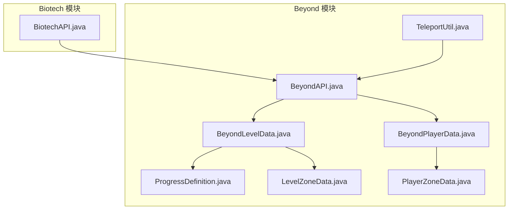

# API参考文档

<cite>
**本文档引用的文件**
- [BiotechAPI.java](file://Biotech/src/main/java/org/biotech/api/BiotechAPI.java)
- [TeleportUtil.java](file://Beyond/src/main/java/com/pz/beyond/api/util/TeleportUtil.java)
- [BeyondAPI.java](file://Beyond/src/main/java/com/pz/beyond/api/BeyondAPI.java)
- [BeyondLevelData.java](file://Beyond/src/main/java/com/pz/beyond/api/system/BeyondLevelData.java)
- [BeyondPlayerData.java](file://Beyond/src/main/java/com/pz/beyond/api/system/BeyondPlayerData.java)
- [ProgressDefinition.java](file://Beyond/src/main/java/com/pz/beyond/api/system/definition/ProgressDefinition.java)
- [LevelZoneData.java](file://Beyond/src/main/java/com/pz/beyond/api/system/zone/LevelZoneData.java)
- [PlayerZoneData.java](file://Beyond/src/main/java/com/pz/beyond/api/system/zone/zones/PlayerZoneData.java)
</cite>

## 更新摘要
**变更内容**
- TeleportUtil进行了重大改进，从基础位置检查演进为复杂的安全传送算法
- 新增MOTION_BLOCKING_NO_LEAVES高度图使用，避免传送位置在树上
- 实现综合安全验证，包括地面稳定性、空间可用性和天空视野检查
- 增强了安全位置搜索算法，支持多层搜索策略和强制安全位置查找
- 保留了原有的结构定位功能，但增强了默认回退机制

## 目录
1. [简介](#简介)
2. [项目结构](#项目结构)
3. [核心组件](#核心组件)
4. [架构总览](#架构总览)
5. [详细组件分析](#详细组件分析)
6. [依赖分析](#依赖分析)
7. [性能考虑](#性能考虑)
8. [故障排除指南](#故障排除指南)
9. [结论](#结论)
10. [附录](#附录)

## 简介
本文件为"基因猎人"子模块的API参考文档，聚焦于以下核心接口与能力：
- BiotechAPI：提供对玩家基因数据、界面打开、Curios槽位访问等的统一入口。
- **简化后的BeyondAPI**：专注于新的数据类访问，提供维度数据和玩家数据的获取能力。
- **重大更新** TeleportUtil：从基础位置检查演进为复杂的安全传送算法，使用MOTION_BLOCKING_NO_LEAVES高度图和综合安全验证。
- **新增** 数据类体系：BeyondLevelData、BeyondPlayerData及其相关定义类构成新的数据访问层。

同时，文档覆盖Biotech模块中的基因系统核心接口族（如IGene、IGeneItem、IUnidentifiedGeneItem、IXenoItem、IGeneLike），以及与之配套的管理器接口（IChoiceManager、IGeneInventoryManager、ILootTableManager、IMergeManager）。每个API均给出参数说明、返回值描述、使用场景、注意事项与最佳实践，并提供与实际代码实现一致的路径引用与图示。

## 项目结构
本仓库包含多个子模块，其中与API相关的关键位置如下：
- Biotech 模块：提供基因系统API、管理器接口、数据模型与客户端渲染等。
- Beyond 模块：提供简化后的API接口和新的数据类体系。
- GalaxyLib、GameText、GeneHunter、ModFix：通用库与示例模块，不作为本API文档重点。



**图表来源**
- [BiotechAPI.java:1-78](file://Biotech/src/main/java/org/biotech/api/BiotechAPI.java#L1-L78)
- [BeyondAPI.java:1-35](file://Beyond/src/main/java/com/pz/beyond/api/BeyondAPI.java#L1-L35)
- [BeyondLevelData.java:1-75](file://Beyond/src/main/java/com/pz/beyond/api/system/BeyondLevelData.java#L1-L75)
- [BeyondPlayerData.java:1-103](file://Beyond/src/main/java/com/pz/beyond/api/system/BeyondPlayerData.java#L1-L103)
- [ProgressDefinition.java:1-85](file://Beyond/src/main/java/com/pz/beyond/api/system/definition/ProgressDefinition.java#L1-L85)
- [LevelZoneData.java:1-83](file://Beyond/src/main/java/com/pz/beyond/api/system/zone/LevelZoneData.java#L1-L83)
- [PlayerZoneData.java:1-64](file://Beyond/src/main/java/com/pz/beyond/api/system/zone/zones/PlayerZoneData.java#L1-L64)
- [TeleportUtil.java:1-227](file://Beyond/src/main/java/com/pz/beyond/api/util/TeleportUtil.java#L1-L227)

## 核心组件
本节概述简化后的BeyondAPI与其他关键接口，帮助快速定位所需能力。

- **简化后的BeyondAPI**
  - 功能：提供维度数据和玩家数据的获取能力，移除了对旧ProgressCatalog、LevelZoneData、ProgressManager的访问方法。
  - 关键方法：getBeyondLevelData(Level)、getBeyondPlayerData(Player)、getBeyondManager()。
  - 使用场景：获取主世界维度数据、玩家Beyond模块数据。
  - 注意事项：仅支持主世界维度，其他维度返回默认数据。

- **重大更新** TeleportUtil
  - 功能：提供复杂的安全传送位置查找和结构定位功能，使用MOTION_BLOCKING_NO_LEAVES高度图和综合安全验证。
  - 关键方法：findSafeTeleportPos、isSafeStandingPosition、getSurfacePos、findNearestStructure。
  - 使用场景：安全传送系统、结构定位、传送目的地验证。
  - 注意事项：需要服务器世界权限，安全位置检查包含多种条件，包括地面稳定性、空间可用性和天空视野检查。

- **新增** 数据类体系
  - BeyondLevelData：主世界维度数据容器，包含进度定义、区域数据和结构数据。
  - BeyondPlayerData：玩家Beyond模块数据，聚合所有Beyond相关数据。
  - ProgressDefinition：关卡数据定义，包含场景和遭遇映射。
  - LevelZoneData：世界区域数据，挂载在Level上。
  - PlayerZoneData：玩家当前所在区域数据。

**章节来源**
- [BeyondAPI.java:15-31](file://Beyond/src/main/java/com/pz/beyond/api/BeyondAPI.java#L15-L31)
- [TeleportUtil.java:17-227](file://Beyond/src/main/java/com/pz/beyond/api/util/TeleportUtil.java#L17-L227)
- [BeyondLevelData.java:30-74](file://Beyond/src/main/java/com/pz/beyond/api/system/BeyondLevelData.java#L30-L74)
- [BeyondPlayerData.java:22-100](file://Beyond/src/main/java/com/pz/beyond/api/system/BeyondPlayerData.java#L22-L100)
- [ProgressDefinition.java:23-84](file://Beyond/src/main/java/com/pz/beyond/api/system/definition/ProgressDefinition.java#L23-L84)
- [LevelZoneData.java:22-83](file://Beyond/src/main/java/com/pz/beyond/api/system/zone/LevelZoneData.java#L22-L83)
- [PlayerZoneData.java:28-63](file://Beyond/src/main/java/com/pz/beyond/api/system/zone/zones/PlayerZoneData.java#L28-L63)

## 架构总览
下图展示了简化后的BeyondAPI与新的数据类体系之间的关系，以及与BiotechAPI的协作关系。**重大更新**的TeleportUtil工具类现在提供了复杂的安全传送算法，而BeyondAPI现在提供了更简洁的维度数据访问能力。

```mermaid
classDiagram
class BeyondAPI {
+getBeyondLevelData(level) BeyondLevelData
+getBeyondPlayerData(player) BeyondPlayerData
+getBeyondManager() BeyondManager
}
class BeyondLevelData {
+dimension ResourceKey~Level~
+progressDefinitions Map~ResourceLocation,ProgressDefinition~
+levelZoneData LevelZoneData
+structureData StructureData
+CODEC Codec~BeyondLevelData~
+STREAM_CODEC StreamCodec~RegistryFriendlyByteBuf,BeyondLevelData~
}
class BeyondPlayerData {
+serverPlayer ServerPlayer
+playerUUID UUID
+playerZoneData PlayerZoneData
+playerLoginData PlayerLoginData
+getPlayer() ServerPlayer
+getPlayerZoneData() PlayerZoneData
+getPlayerLoginData() PlayerLoginData
+CODEC Codec~BeyondPlayerData~
+STREAM_CODEC StreamCodec~RegistryFriendlyByteBuf,BeyondPlayerData~
}
class TeleportUtil {
+findSafeTeleportPos(level, target) BlockPos
+isSafeStandingPosition(level, pos) boolean
+getSurfacePos(level, pos) BlockPos
+findNearestStructure(level, structureTag, searchRadius) BlockPos
+findNearestStructure(level, structureTag, searchRadius, defaultPos) BlockPos
-isValidGround(state) boolean
-ensureSolidGround(level, pos) BlockPos
-isValidGround(state) boolean
-hasOpenSky(level, pos) boolean
-findForcedSafePos(level, center) BlockPos
-isBasicSafePos(level, pos) boolean
}
class BiotechAPI {
+getGeneData(player) GeneData
+getGeneInventoryManager(player) IGeneInventoryManager
+getMergeManager(player) IMergeManager
+openGeneInventoryFor(targetPlayer) void
+getGeneEquipSlots(targetPlayer) IDynamicStackHandler
+getXeneEquipSlots(targetPlayer) IDynamicStackHandler
}
BeyondAPI --> BeyondLevelData : "获取"
BeyondAPI --> BeyondPlayerData : "获取"
BeyondLevelData --> ProgressDefinition : "包含"
BeyondLevelData --> LevelZoneData : "包含"
BeyondLevelData --> StructureData : "包含"
BeyondPlayerData --> PlayerZoneData : "包含"
BeyondPlayerData --> PlayerLoginData : "包含"
TeleportUtil --> BeyondAPI : "使用"
BiotechAPI -.-> BeyondAPI : "协作"
```

**图表来源**
- [BeyondAPI.java:15-31](file://Beyond/src/main/java/com/pz/beyond/api/BeyondAPI.java#L15-L31)
- [BeyondLevelData.java:30-74](file://Beyond/src/main/java/com/pz/beyond/api/system/BeyondLevelData.java#L30-L74)
- [BeyondPlayerData.java:22-100](file://Beyond/src/main/java/com/pz/beyond/api/system/BeyondPlayerData.java#L22-L100)
- [TeleportUtil.java:17-227](file://Beyond/src/main/java/com/pz/beyond/api/util/TeleportUtil.java#L17-L227)
- [BiotechAPI.java:19-78](file://Biotech/src/main/java/org/biotech/api/BiotechAPI.java#L19-L78)

## 详细组件分析

### 简化后的BeyondAPI 接口详解
- 设计原则
  - 简化单一职责：专注于数据类访问，移除复杂的进度管理方法。
  - 类型安全：提供明确的数据类返回类型，避免类型转换。
  - 委托模式：将具体实现委托给数据类和相关管理器。
- 公共方法
  - getBeyondLevelData(Level): 获取维度级别的Beyond数据。
  - getBeyondPlayerData(Player): 获取玩家级别的Beyond数据。
  - getBeyondManager(): 获取Beyond管理器实例。
- 参数与返回
  - Level：世界对象；Player：玩家对象。
  - 返回值：对应的Beyond数据类实例或管理器。
- 使用示例（路径）
  - 获取维度数据：[BeyondAPI.java:19-21](file://Beyond/src/main/java/com/pz/beyond/api/BeyondAPI.java#L19-L21)
  - 获取玩家数据：[BeyondAPI.java:25-27](file://Beyond/src/main/java/com/pz/beyond/api/BeyondAPI.java#L25-L27)
- 最佳实践
  - 在调用前检查返回值的有效性。
  - 使用数据类的属性访问而非直接依赖具体实现。
  - 注意维度限制，仅在主世界使用相关功能。

**章节来源**
- [BeyondAPI.java:15-31](file://Beyond/src/main/java/com/pz/beyond/api/BeyondAPI.java#L15-L31)

### BeyondLevelData 数据类详解
- 设计原则
  - 数据聚合：将所有维度相关数据聚合在一个类中。
  - 序列化支持：提供Codec和StreamCodec支持网络传输和持久化。
  - 主世界限定：明确只存储到主世界的数据。
- 核心属性
  - dimension：维度标识，默认Level.OVERWORLD。
  - progressDefinitions：进度定义映射。
  - levelZoneData：区域数据容器。
  - structureData：结构数据容器。
- 编解码支持
  - CODEC：基于RecordCodecBuilder的序列化支持。
  - STREAM_CODEC：基于StreamCodec的网络传输支持。
- 使用场景
  - 存储和传输维度级别的Beyond数据。
  - 作为BeyondAPI的主要数据载体。

**章节来源**
- [BeyondLevelData.java:30-74](file://Beyond/src/main/java/com/pz/beyond/api/system/BeyondLevelData.java#L30-L74)

### BeyondPlayerData 数据类详解
- 设计原则
  - 延迟初始化：玩家区域数据和登录数据按需创建。
  - 双端支持：同时支持客户端和服务器端使用。
  - 服务器解析：提供服务器端玩家解析功能。
- 核心属性
  - serverPlayer：服务器端玩家引用。
  - playerUUID：玩家唯一标识。
  - playerZoneData：玩家区域数据（延迟初始化）。
  - playerLoginData：玩家登录数据（延迟初始化）。
- 功能方法
  - getPlayer()：获取服务器端玩家实例。
  - getPlayerZoneData()：获取或创建玩家区域数据。
  - getPlayerLoginData()：获取或创建玩家登录数据。
- 编解码支持
  - CODEC和STREAM_CODEC：完整的序列化和网络传输支持。
- 使用场景
  - 存储和传输玩家级别的Beyond数据。
  - 作为玩家状态管理的核心数据容器。

**章节来源**
- [BeyondPlayerData.java:22-100](file://Beyond/src/main/java/com/pz/beyond/api/system/BeyondPlayerData.java#L22-L100)

### TeleportUtil 工具类详解
- 设计原则
  - 安全优先：确保传送位置的安全性和可见性。
  - 复杂算法：实现多层次的安全验证和位置搜索。
  - 结构导向：提供结构定位功能，便于导航。
  - 灵活配置：支持默认返回位置和搜索半径配置。
- 公共方法
  - findSafeTeleportPos(ServerLevel level, BlockPos target): 查找安全的传送位置。
  - isSafeStandingPosition(ServerLevel level, BlockPos pos): 检查位置是否可以安全站立。
  - getSurfacePos(ServerLevel level, BlockPos pos): 获取地表位置（不包含树叶）。
  - findNearestStructure(ServerLevel level, TagKey<Structure> structureTag, int searchRadius): 查找最近的结构位置。
  - findNearestStructure(ServerLevel level, TagKey<Structure> structureTag, int searchRadius, BlockPos defaultPos): 查找最近的结构位置（带默认返回）。
- **重大更新** 安全验证算法
  - 地面稳定性检查：使用isValidGround方法，排除空气、液体、树叶、火等危险方块。
  - 空间可用性检查：确保脚下和头部都是空气或可穿越方块。
  - 天空视野检查：使用hasOpenSky方法，确保位置露天，防止出生在洞里或建筑内部。
  - MOTION_BLOCKING_NO_LEAVES高度图：使用MOTION_BLOCKING_NO_LEAVES避免传送位置在树上。
- 参数与返回
  - level：服务器世界对象。
  - target/pos：目标位置坐标。
  - structureTag：结构标签。
  - searchRadius：搜索半径（区块）。
  - defaultPos：默认返回位置。
  - 返回值：安全位置坐标或结构位置。
- 使用场景
  - 安全传送系统实现。
  - 结构定位和导航功能。
  - 传送目的地验证。
- 最佳实践
  - 在查找安全位置时考虑世界边界。
  - 合理设置搜索半径以平衡性能和准确性。
  - 处理未找到结构的情况，提供合理的默认位置。
  - 利用多层搜索策略：优先目标位置、地表位置、向上向下搜索、强制安全位置查找。

**章节来源**
- [TeleportUtil.java:17-227](file://Beyond/src/main/java/com/pz/beyond/api/util/TeleportUtil.java#L17-L227)

### BiotechAPI 接口详解
- 设计原则
  - 单一职责：集中暴露玩家基因相关能力与UI入口。
  - 松耦合：通过能力与数据容器访问，避免直接依赖具体实现。
  - 可扩展：新增能力可通过注册新能力/管理器扩展。
- 公共方法
  - getGeneData(Player): 获取玩家的基因数据容器。
  - getGeneInventoryManager(Player)/getMergeManager(Player): 获取对应管理器能力。
  - openGeneInventoryFor(ServerPlayer): 服务端为目标玩家打开基因库存界面。
  - getGeneEquipSlots/getXeneEquipSlots(Player): 通过Curios API获取基因/异种装备槽位。
- 参数与返回
  - Player/targetPlayer：玩家对象；ServerPlayer：仅服务端可用。
  - 返回值：数据容器、管理器实例或Curios的IDynamicStackHandler；若无能力则可能为空。
- 使用示例（路径）
  - 服务端打开他人基因界面：[BiotechAPI.java:43-52](file://Biotech/src/main/java/org/biotech/api/BiotechAPI.java#L43-L52)
  - 获取Curios槽位：[BiotechAPI.java:61-76](file://Biotech/src/main/java/org/biotech/api/BiotechAPI.java#L61-L76)
- 最佳实践
  - 在调用open*方法前检查管理器是否可用，避免空指针。
  - Curios槽位访问需确保Curios已初始化且玩家拥有对应槽位。
  - 服务端操作应通过BiotechAPI提供的静态方法，避免直接访问能力。

**章节来源**
- [BiotechAPI.java:19-78](file://Biotech/src/main/java/org/biotech/api/BiotechAPI.java#L19-L78)

## 依赖分析
- 外部依赖
  - NeoForge事件系统：LivingDamageEvent、MobSpawnEvent等。
  - Curios API：IDynamicStackHandler、ICurioItem、SlotContext等。
  - Minecraft网络编解码：StreamCodec、CustomPacketPayload。
  - **新增** Minecraft高度图系统：Heightmap.Types.MOTION_BLOCKING_NO_LEAVES。
  - **新增** Minecraft结构系统：Structure、TagKey等。
- 内部依赖
  - BeyondAPI依赖数据类进行数据访问。
  - **重大更新** TeleportUtil依赖BeyondAPI的维度数据访问。
  - BiotechAPI作为独立模块，不依赖BeyondAPI。
- 耦合与内聚
  - BeyondAPI作为门面，降低上层对底层实现的耦合。
  - 各数据类职责清晰，便于替换与扩展。
  - **重大更新** TeleportUtil采用独立设计，提供复杂的安全传送算法。

**图表来源**
- [BeyondAPI.java:3-10](file://Beyond/src/main/java/com/pz/beyond/api/BeyondAPI.java#L3-L10)
- [TeleportUtil.java:3-9](file://Beyond/src/main/java/com/pz/beyond/api/util/TeleportUtil.java#L3-L9)
- [BeyondLevelData.java:3-17](file://Beyond/src/main/java/com/pz/beyond/api/system/BeyondLevelData.java#L3-L17)
- [BeyondPlayerData.java:3-14](file://Beyond/src/main/java/com/pz/beyond/api/system/BeyondPlayerData.java#L3-L14)

**章节来源**
- [BeyondAPI.java:3-10](file://Beyond/src/main/java/com/pz/beyond/api/BeyondAPI.java#L3-L10)
- [TeleportUtil.java:3-9](file://Beyond/src/main/java/com/pz/beyond/api/util/TeleportUtil.java#L3-L9)
- [BeyondLevelData.java:3-17](file://Beyond/src/main/java/com/pz/beyond/api/system/BeyondLevelData.java#L3-L17)
- [BeyondPlayerData.java:3-14](file://Beyond/src/main/java/com/pz/beyond/api/system/BeyondPlayerData.java#L3-L14)

## 性能考虑
- 简化后的API调用
  - BeyondAPI方法调用简单直接，性能开销极小。
  - 数据类访问通过Level和Player的getData方法实现，性能稳定。
- **重大更新** TeleportUtil算法性能
  - findSafeTeleportPos方法包含多层搜索：目标位置检查、地表位置搜索、向上向下搜索（±20格）、强制安全位置查找、确保固体地面。
  - getSurfacePos方法使用MOTION_BLOCKING_NO_LEAVES高度图，避免树叶检测，提高准确性。
  - isValidGround方法包含多种方块类型检查，但执行时间短。
  - hasOpenSky方法使用canSeeSky进行天空视野检查。
- 数据序列化
  - 数据类的Codec和StreamCodec经过优化，适合频繁的网络传输。
  - 建议在批量操作时合并序列化调用以提高效率。

## 故障排除指南
- BeyondAPI调用失败
  - 检查传入的Level或Player对象是否有效。
  - 确认数据类是否正确注册和初始化。
  - 参考：[BeyondAPI.java:19-27](file://Beyond/src/main/java/com/pz/beyond/api/BeyondAPI.java#L19-L27)
- 数据类访问异常
  - 检查Level和Player的getData方法是否正常工作。
  - 确认数据类的注册是否正确完成。
  - 验证维度限制，确保在主世界使用。
- **重大更新** TeleportUtil传送位置查找失败
  - 检查服务器世界对象是否有效。
  - 验证目标位置坐标是否在世界范围内。
  - 确认MOTION_BLOCKING_NO_LEAVES高度图是否正确工作。
  - 检查isValidGround方法的方块类型判断逻辑。
  - 验证hasOpenSky方法的天空视野检查。
  - 确认结构标签是否正确注册。
- BiotechAPI调用失败
  - 检查目标玩家是否在线、是否具备对应能力；查看日志中的info/error信息。
  - 参考：[BiotechAPI.java:43-76](file://Biotech/src/main/java/org/biotech/api/BiotechAPI.java#L43-L76)

**章节来源**
- [BeyondAPI.java:19-27](file://Beyond/src/main/java/com/pz/beyond/api/BeyondAPI.java#L19-L27)
- [TeleportUtil.java:31-227](file://Beyond/src/main/java/com/pz/beyond/api/util/TeleportUtil.java#L31-L227)
- [BiotechAPI.java:43-76](file://Biotech/src/main/java/org/biotech/api/BiotechAPI.java#L43-L76)

## 结论
本文档梳理了简化后的BeyondAPI与新的数据类体系，明确了其设计原则、使用场景与最佳实践。**简化后的BeyondAPI**移除了对旧ProgressCatalog、LevelZoneData、ProgressManager的访问方法，专注于新的数据类访问，提供了更简洁和类型安全的API接口。**重大更新**的TeleportUtil工具类现在提供了复杂的安全传送算法，使用MOTION_BLOCKING_NO_LEAVES高度图和综合安全验证，包括地面稳定性、空间可用性和天空视野检查等多个层次的安全验证。新的数据类体系（BeyondLevelData、BeyondPlayerData等）构成了完整的数据访问层。通过统一的门面API与清晰的数据类接口，开发者可以便捷地扩展Beyond模块功能。建议在实际开发中遵循接口契约、关注性能与错误处理，并结合日志与调试工具进行问题定位。

## 附录
- 版本兼容性与迁移指南
  - NeoForge版本：本API基于NeoForge事件与自定义包协议，请确保运行环境版本兼容。
  - Curios版本：依赖Curios能力与槽位系统，请确保Curios版本与API一致。
  - **新增** Minecraft版本：TeleportUtil依赖MOTION_BLOCKING_NO_LEAVES高度图和结构系统。
  - 迁移建议：从旧的BeyondAPI调用迁移到新的数据类访问；当Curios或NeoForge升级时，优先检查StreamCodec与事件回调签名变化。
  - **重大更新** 对于TeleportUtil的改进，确保导入正确的MOTION_BLOCKING_NO_LEAVES高度图和结构系统依赖。
- 常用路径速查
  - 简化后的BeyondAPI：[BeyondAPI.java:15-31](file://Beyond/src/main/java/com/pz/beyond/api/BeyondAPI.java#L15-L31)
  - BeyondLevelData：[BeyondLevelData.java:30-74](file://Beyond/src/main/java/com/pz/beyond/api/system/BeyondLevelData.java#L30-L74)
  - BeyondPlayerData：[BeyondPlayerData.java:22-100](file://Beyond/src/main/java/com/pz/beyond/api/system/BeyondPlayerData.java#L22-L100)
  - ProgressDefinition：[ProgressDefinition.java:23-84](file://Beyond/src/main/java/com/pz/beyond/api/system/definition/ProgressDefinition.java#L23-L84)
  - LevelZoneData：[LevelZoneData.java:22-83](file://Beyond/src/main/java/com/pz/beyond/api/system/zone/LevelZoneData.java#L22-L83)
  - PlayerZoneData：[PlayerZoneData.java:28-63](file://Beyond/src/main/java/com/pz/beyond/api/system/zone/zones/PlayerZoneData.java#L28-L63)
  - **重大更新** TeleportUtil：[TeleportUtil.java:17-227](file://Beyond/src/main/java/com/pz/beyond/api/util/TeleportUtil.java#L17-L227)
  - BiotechAPI：[BiotechAPI.java:19-78](file://Biotech/src/main/java/org/biotech/api/BiotechAPI.java#L19-L78)