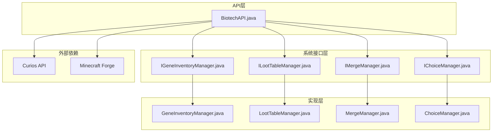
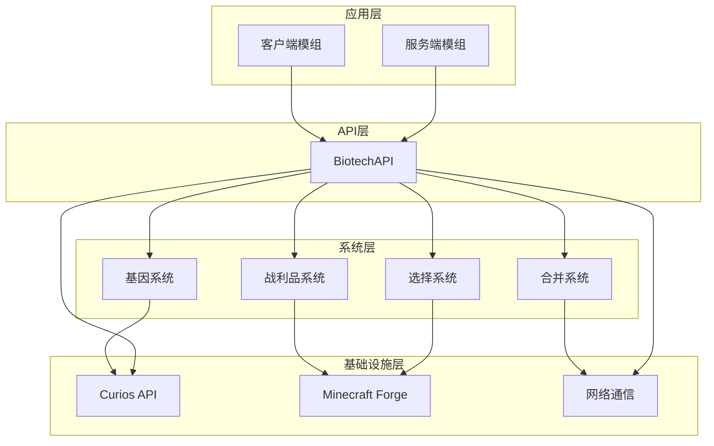
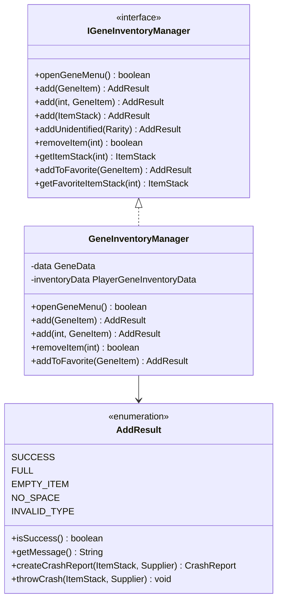
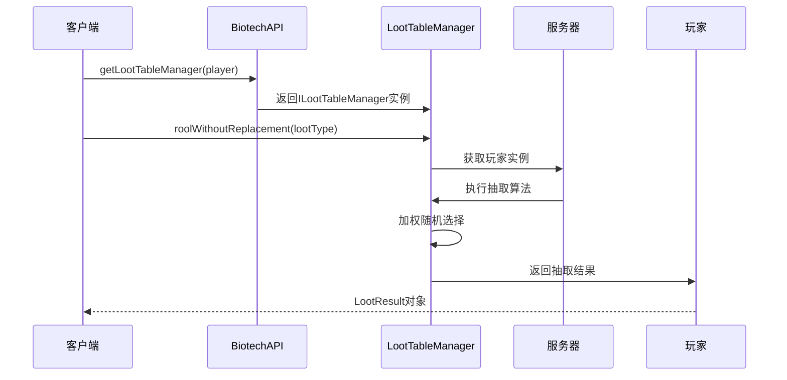
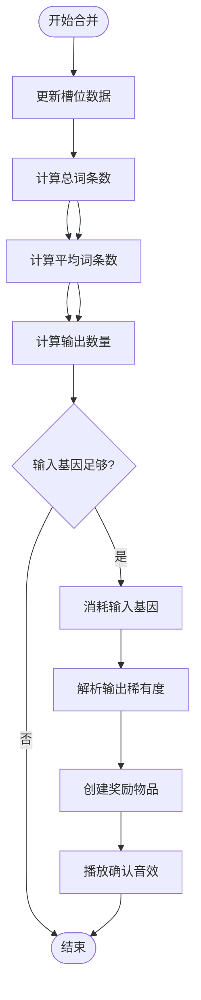
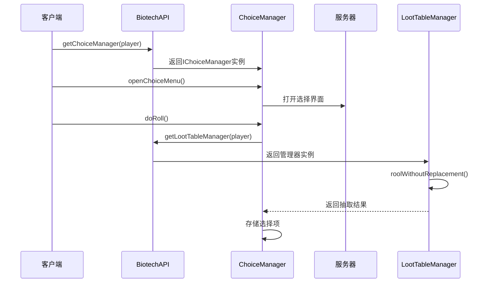
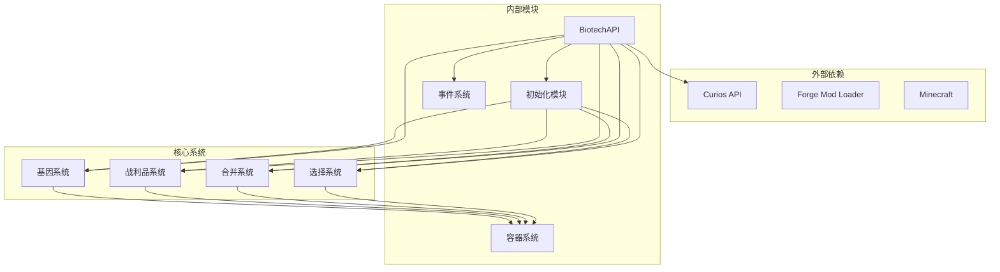

# BiotechAPI核心接口

<cite>
**本文档引用的文件**
- [BiotechAPI.java](file://Biotech/src/main/java/org/biotech/api/BiotechAPI.java)
- [IGeneInventoryManager.java](file://Biotech/src/main/java/org/biotech/api/system/gene/core/manager/IGeneInventoryManager.java)
- [ILootTableManager.java](file://Biotech/src/main/java/org/biotech/api/system/loot/core/ILootTableManager.java)
- [IMergeManager.java](file://Biotech/src/main/java/org/biotech/api/system/merge/core/IMergeManager.java)
- [IChoiceManager.java](file://Biotech/src/main/java/org/biotech/api/system/choice/core/IChoiceManager.java)
- [GeneInventoryManager.java](file://Biotech/src/main/java/org/biotech/api/system/gene/inventory/GeneInventoryManager.java)
- [LootTableManager.java](file://Biotech/src/main/java/org/biotech/api/system/loot/LootTableManager.java)
- [MergeManager.java](file://Biotech/src/main/java/org/biotech/api/system/merge/MergeManager.java)
- [ChoiceManager.java](file://Biotech/src/main/java/org/biotech/api/system/choice/ChoiceManager.java)
</cite>

## 目录
1. [简介](#简介)
2. [项目结构](#项目结构)
3. [核心组件](#核心组件)
4. [架构概览](#架构概览)
5. [详细组件分析](#详细组件分析)
6. [依赖关系分析](#依赖关系分析)
7. [性能考虑](#性能考虑)
8. [故障排除指南](#故障排除指南)
9. [结论](#结论)

## 简介

BiotechAPI是Biotech模组提供的核心API接口，为模组开发者提供了访问和操作基因系统的统一入口。该API封装了基因数据获取、库存管理、战利品表管理、合并系统和选择管理等核心功能，同时集成了Curios API以支持装备槽位管理。

该API设计遵循静态工厂模式，通过BiotechAPI类提供所有公共接口，确保了简洁易用的编程体验。API支持客户端和服务端两种运行环境，能够安全地处理跨网络的基因系统操作。

## 项目结构

BiotechAPI位于org.biotech.api包下，采用模块化设计，将不同功能域的接口和实现分离：

**图表来源**
- [BiotechAPI.java:1-92](file://Biotech/src/main/java/org/biotech/api/BiotechAPI.java#L1-L92)
- [IGeneInventoryManager.java:1-133](file://Biotech/src/main/java/org/biotech/api/system/gene/core/manager/IGeneInventoryManager.java#L1-L133)
- [ILootTableManager.java:1-77](file://Biotech/src/main/java/org/biotech/api/system/loot/core/ILootTableManager.java#L1-L77)

**章节来源**
- [BiotechAPI.java:1-92](file://Biotech/src/main/java/org/biotech/api/BiotechAPI.java#L1-L92)

## 核心组件

BiotechAPI提供以下核心静态方法：

### 基因数据获取方法
- **getGeneData(Player player)**: 获取玩家的基因数据对象
- **参数**: Player类型的玩家实例
- **返回值**: GeneData对象，包含玩家的基因状态信息
- **使用场景**: 访问玩家的基因属性、状态和配置
- **注意事项**: 支持客户端和服务端调用

### 基因库存管理器获取方法
- **getGeneInventoryManager(Player player)**: 获取基因库存管理器
- **参数**: Player类型的玩家实例
- **返回值**: IGeneInventoryManager接口实例
- **使用场景**: 管理玩家的基因背包、收藏夹和槽位操作
- **注意事项**: 返回的是能力对象，需要检查null值

### 战利品表管理器获取方法
- **getLootTableManager(Player player)**: 获取战利品表管理器
- **参数**: Player类型的玩家实例
- **返回值**: ILootTableManager接口实例
- **使用场景**: 修改和查询战利品表、执行抽取操作
- **注意事项**: 主要用于服务端环境

### 合并管理器获取方法
- **getMergeManager(Player player)**: 获取合并管理器
- **参数**: Player类型的玩家实例
- **返回值**: IMergeManager接口实例
- **使用场景**: 执行基因合并操作、计算输出结果
- **注意事项**: 涉及复杂的概率计算和物品消耗

### 基因选择管理器获取方法
- **getChoiceManager(Player player)**: 获取基因选择管理器
- **参数**: Player类型的玩家实例
- **返回值**: IChoiceManager接口实例
- **使用场景**: 打开选择界面、管理选择数量、执行抽取
- **注意事项**: 选择管理器是基于新实现的包装类

### 界面打开方法
- **openGeneInventoryFor(ServerPlayer targetPlayer)**: 为目标玩家打开基因库存界面
- **openGeneChoiceFor(ServerPlayer targetPlayer)**: 为目标玩家打开基因选择界面
- **使用场景**: 服务端操作其他玩家的UI界面
- **注意事项**: 仅适用于ServerPlayer实例

### Curios集成方法
- **getGeneEquipSlots(Player targetPlayer)**: 获取基因装备槽位
- **getXeneEquipSlots(Player targetPlayer)**: 获取Xene装备槽位
- **返回值**: IDynamicStackHandler实例或null
- **使用场景**: 访问Curios装备槽位中的基因物品
- **注意事项**: 依赖Curios API的可用性

**章节来源**
- [BiotechAPI.java:27-90](file://Biotech/src/main/java/org/biotech/api/BiotechAPI.java#L27-L90)

## 架构概览

BiotechAPI采用分层架构设计，实现了清晰的职责分离：

**图表来源**
- [BiotechAPI.java:18-90](file://Biotech/src/main/java/org/biotech/api/BiotechAPI.java#L18-L90)

## 详细组件分析

### 基因库存管理器系统

基因库存管理器负责管理玩家的基因物品存储，提供了完整的库存操作接口：

**图表来源**
- [IGeneInventoryManager.java:12-133](file://Biotech/src/main/java/org/biotech/api/system/gene/core/manager/IGeneInventoryManager.java#L12-L133)
- [GeneInventoryManager.java:18-186](file://Biotech/src/main/java/org/biotech/api/system/gene/inventory/GeneInventoryManager.java#L18-L186)

#### 添加结果枚举详解

AddResult枚举提供了详细的添加操作反馈：

| 结果类型 | 描述 | 使用场景 |
|---------|------|----------|
| SUCCESS | 成功添加物品 | 正常库存操作 |
| FULL | 库存已满 | 需要扩展库存容量 |
| EMPTY_ITEM | 物品为空 | 参数验证失败 |
| NO_SPACE | 无空间放置非堆叠物品 | 处理特殊物品 |
| INVALID_TYPE | 物品类型不允许 | 类型校验失败 |

**章节来源**
- [IGeneInventoryManager.java:79-130](file://Biotech/src/main/java/org/biotech/api/system/gene/core/manager/IGeneInventoryManager.java#L79-L130)

### 战利品表管理系统

战利品表管理器提供了灵活的战利品抽取和修改功能：

**图表来源**
- [LootTableManager.java:55-112](file://Biotech/src/main/java/org/biotech/api/system/loot/LootTableManager.java#L55-L112)
- [ILootTableManager.java:22-42](file://Biotech/src/main/java/org/biotech/api/system/loot/core/ILootTableManager.java#L22-L42)

#### 战利品抽取算法

系统支持两种抽取模式：

1. **不放回抽取** (`roolWithoutReplacement`): 每次抽取后从池中移除，确保同物品不会重复出现
2. **放回抽取** (`rollWithReplacement`): 每次抽取后将物品放回池中，允许重复抽取

**章节来源**
- [ILootTableManager.java:22-42](file://Biotech/src/main/java/org/biotech/api/system/loot/core/ILootTableManager.java#L22-L42)
- [LootTableManager.java:55-112](file://Biotech/src/main/java/org/biotech/api/system/loot/LootTableManager.java#L55-L112)

### 合并管理系统

合并管理器实现了复杂的概率合并算法：

**图表来源**
- [MergeManager.java:37-77](file://Biotech/src/main/java/org/biotech/api/system/merge/MergeManager.java#L37-L77)
- [MergeManager.java:107-157](file://Biotech/src/main/java/org/biotech/api/system/merge/MergeManager.java#L107-L157)

#### 合并规则

输出稀有度根据平均词条数确定：
- 平均词条数 ≥ 3.0: 史诗(Epic)
- 平均词条数 ≥ 2.0: 稀有(Rare)  
- 其他情况: 少见(Uncommon)

**章节来源**
- [IMergeManager.java:6-11](file://Biotech/src/main/java/org/biotech/api/system/merge/core/IMergeManager.java#L6-L11)
- [MergeManager.java:180-188](file://Biotech/src/main/java/org/biotech/api/system/merge/MergeManager.java#L180-L188)

### 基因选择管理系统

基因选择管理器提供了灵活的选择界面管理：

**图表来源**
- [ChoiceManager.java:26-64](file://Biotech/src/main/java/org/biotech/api/system/choice/ChoiceManager.java#L26-L64)
- [IChoiceManager.java:8-21](file://Biotech/src/main/java/org/biotech/api/system/choice/core/IChoiceManager.java#L8-L21)

**章节来源**
- [IChoiceManager.java:8-21](file://Biotech/src/main/java/org/biotech/api/system/choice/core/IChoiceManager.java#L8-L21)
- [ChoiceManager.java:26-64](file://Biotech/src/main/java/org/biotech/api/system/choice/ChoiceManager.java#L26-L64)

## 依赖关系分析

BiotechAPI的依赖关系体现了清晰的模块化设计：

**图表来源**
- [BiotechAPI.java:3-15](file://Biotech/src/main/java/org/biotech/api/BiotechAPI.java#L3-L15)

### 客户端与服务端差异

| 功能 | 客户端支持 | 服务端支持 | 差异说明 |
|------|------------|------------|----------|
| getGeneData | ✅ | ✅ | 数据获取无限制 |
| getGeneInventoryManager | ✅ | ✅ | 能力获取无限制 |
| getLootTableManager | ✅ | ✅ | 管理器获取无限制 |
| getMergeManager | ✅ | ✅ | 合并操作无限制 |
| getChoiceManager | ✅ | ✅ | 选择管理无限制 |
| openGeneInventoryFor | ❌ | ✅ | 仅服务端可操作他人UI |
| openGeneChoiceFor | ❌ | ✅ | 仅服务端可操作他人UI |
| Curios槽位获取 | ✅ | ✅ | 依赖Curios API可用性 |

**章节来源**
- [BiotechAPI.java:47-70](file://Biotech/src/main/java/org/biotech/api/BiotechAPI.java#L47-L70)

## 性能考虑

### 内存优化策略

1. **懒加载机制**: 合并管理器和选择管理器采用延迟计算，只有在需要时才更新缓存数据
2. **对象复用**: 战利品表管理器重用随机数生成器和结果列表
3. **缓存策略**: 合并系统缓存槽位数据，避免重复计算

### 网络传输优化

1. **批量操作**: 合并系统一次性处理多个输入槽位，减少网络往返
2. **条件更新**: 只在槽位数据变化时更新缓存
3. **最小化传输**: 仅传输必要的状态信息

### 错误处理优化

1. **空值检查**: 所有公共方法都进行了null值检查
2. **异常捕获**: 库存添加操作包含异常捕获机制
3. **日志记录**: 关键操作都有详细的日志记录

## 故障排除指南

### 常见问题及解决方案

#### 1. 空指针异常
**症状**: 调用API方法时抛出NullPointerException
**原因**: 传入的Player参数为null
**解决方案**: 在调用前检查Player实例的有效性

#### 2. 能力获取失败
**症状**: getGeneInventoryManager/getLootTableManager返回null
**原因**: 玩家对象未正确初始化或能力系统未加载
**解决方案**: 确保在合适的生命周期内调用API

#### 3. Curios集成问题
**症状**: getGeneEquipSlots/getXeneEquipSlots返回null
**原因**: Curios API未正确安装或槽位ID不存在
**解决方案**: 检查Curios版本兼容性和槽位配置

#### 4. 合并操作失败
**症状**: merge()方法没有产生预期的输出
**原因**: 输入槽位中缺少足够的基因物品或词条
**解决方案**: 确保输入槽位中有至少3个基因物品

**章节来源**
- [IGeneInventoryManager.java:79-130](file://Biotech/src/main/java/org/biotech/api/system/gene/core/manager/IGeneInventoryManager.java#L79-L130)
- [BiotechAPI.java:51-55](file://Biotech/src/main/java/org/biotech/api/BiotechAPI.java#L51-L55)

## 结论

BiotechAPI为模组开发者提供了一个完整、稳定且易于使用的基因系统API。其设计特点包括：

1. **模块化设计**: 清晰的功能分离和职责划分
2. **跨平台支持**: 同时支持客户端和服务端环境
3. **类型安全**: 强类型接口确保编译时错误检测
4. **扩展性**: 基于接口的设计便于功能扩展
5. **性能优化**: 懒加载和缓存策略提升运行效率

通过合理使用这些API，模组开发者可以轻松集成基因系统功能，创建丰富的游戏体验。建议在实际开发中遵循API的设计原则，充分利用其提供的工具和接口来构建高质量的模组功能。