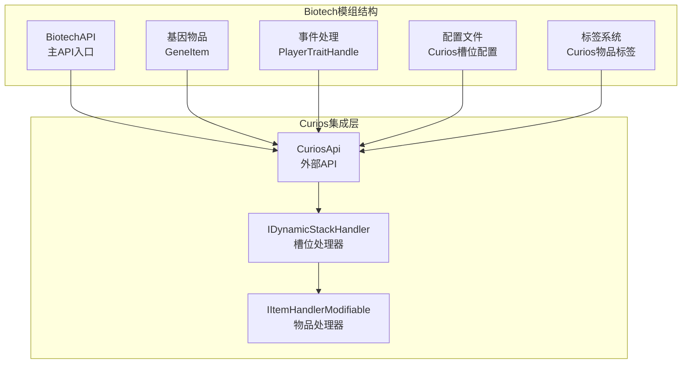
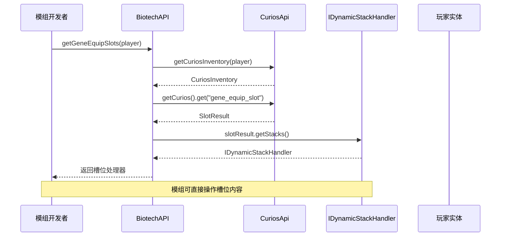
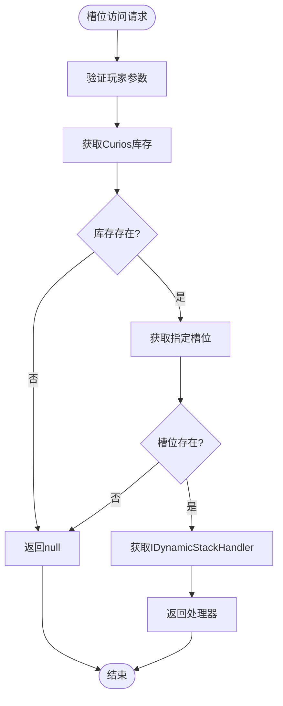
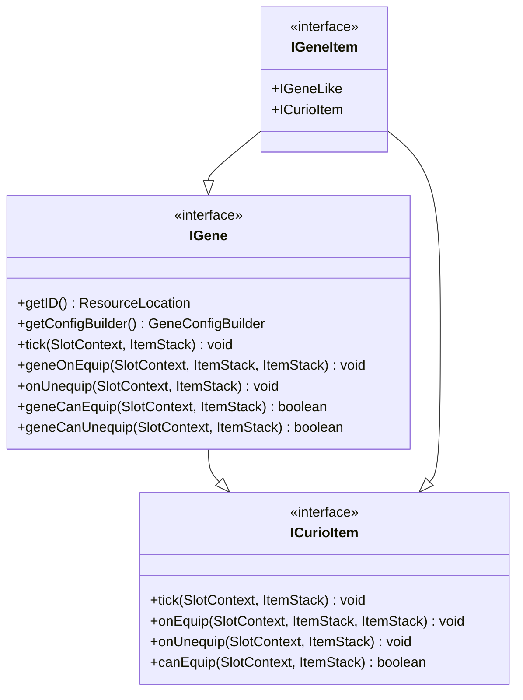
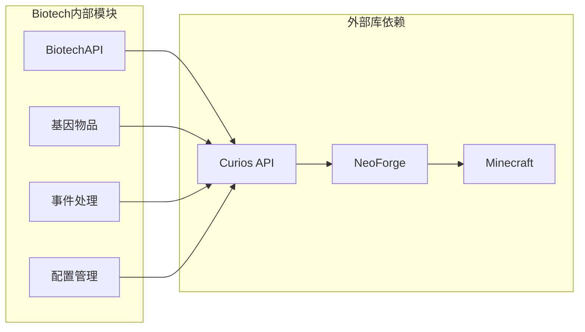

# Curios装备集成

<cite>
**本文档引用的文件**
- [BiotechAPI.java](file://Biotech/src/main/java/org/biotech/api/BiotechAPI.java)
- [Biotech.java](file://Biotech/src/main/java/org/biotech/Biotech.java)
- [player_slots.json](file://Biotech/src/main/resources/data/biotech/curios/entities/player_slots.json)
- [gene_equip_slot.json](file://Biotech/src/main/resources/data/biotech/curios/slots/gene_equip_slot.json)
- [xene_equip_slot.json](file://Biotech/src/main/resources/data/biotech/curios/slots/xene_equip_slot.json)
- [gene_equip_slot.json](file://Biotech/src/main/resources/data/curios/tags/item/gene_equip_slot.json)
- [xene_equip_slot.json](file://Biotech/src/main/resources/data/curios/tags/item/xene_equip_slot.json)
- [IGene.java](file://Biotech/src/main/java/org/biotech/api/system/gene/core/IGene.java)
- [IGeneItem.java](file://Biotech/src/main/java/org/biotech/api/system/gene/core/IGeneItem.java)
- [IXenoItem.java](file://Biotech/src/main/java/org/biotech/api/system/gene/core/IXenoItem.java)
- [GeneItem.java](file://Biotech/src/main/java/org/biotech/item/GeneItem.java)
- [PlayerTraitHandle.java](file://Biotech/src/main/java/org/biotech/api/event/handle/PlayerTraitHandle.java)
- [build.gradle](file://build.gradle)
</cite>

## 目录
1. [简介](#简介)
2. [项目结构](#项目结构)
3. [核心组件](#核心组件)
4. [架构概览](#架构概览)
5. [详细组件分析](#详细组件分析)
6. [依赖关系分析](#依赖关系分析)
7. [性能考虑](#性能考虑)
8. [故障排除指南](#故障排除指南)
9. [结论](#结论)
10. [附录](#附录)

## 简介

本文档详细说明了Biotech模组中与Curios API集成的Curios装备系统。该系统为玩家提供了两个专门的装备槽位：基因装备槽位(gene_equip_slot)和异种装备槽位(xene_equip_slot)，用于管理基因物品和异种物品。

Curios装备集成的核心目标是：
- 提供标准化的槽位访问接口
- 实现动态槽位管理
- 支持装备验证和权限控制
- 确保模组间的兼容性

## 项目结构

Biotech模组采用模块化架构，Curios集成主要分布在以下目录：



**图表来源**
- [BiotechAPI.java:1-92](file://Biotech/src/main/java/org/biotech/api/BiotechAPI.java#L1-L92)
- [build.gradle:1-16](file://build.gradle#L1-L16)

**章节来源**
- [BiotechAPI.java:1-92](file://Biotech/src/main/java/org/biotech/api/BiotechAPI.java#L1-L92)
- [build.gradle:1-16](file://build.gradle#L1-L16)

## 核心组件

### BiotechAPI主入口

BiotechAPI是Curios集成的核心入口点，提供了以下关键功能：

#### 槽位访问方法
- `getGeneEquipSlots(Player targetPlayer)`: 获取基因装备槽位
- `getXeneEquipSlots(Player targetPlayer)`: 获取异种装备槽位

#### 数据管理接口
- `getGeneData(Player player)`: 获取玩家基因数据
- `getGeneInventoryManager(Player player)`: 获取基因库存管理器
- `getLootTableManager(Player player)`: 获取战利品表管理器
- `getMergeManager(Player player)`: 获取合并管理器

#### 界面管理
- `openGeneInventoryFor(ServerPlayer targetPlayer)`: 打开基因库存界面
- `openGeneChoiceFor(ServerPlayer targetPlayer)`: 打开基因选择界面

**章节来源**
- [BiotechAPI.java:21-92](file://Biotech/src/main/java/org/biotech/api/BiotechAPI.java#L21-L92)

### 槽位配置系统

系统定义了两个标准槽位ID：
- `GENE_EQUIP_SLOT = "gene_equip_slot"`
- `XENE_EQUIP_SLOT = "xene_equip_slot"`

每个槽位都有独立的配置文件，定义了槽位的行为特性。

**章节来源**
- [BiotechAPI.java:72-81](file://Biotech/src/main/java/org/biotech/api/BiotechAPI.java#L72-L81)

## 架构概览



**图表来源**
- [BiotechAPI.java:75-90](file://Biotech/src/main/java/org/biotech/api/BiotechAPI.java#L75-L90)

### 数据流架构



**图表来源**
- [BiotechAPI.java:83-90](file://Biotech/src/main/java/org/biotech/api/BiotechAPI.java#L83-L90)

## 详细组件分析

### 槽位配置详解

#### 基因装备槽位配置
基因装备槽位配置文件定义了以下特性：
- **order**: 0 - 槽位优先级
- **size**: 6 - 槽位容量
- **drop_rule**: "ALWAYS_KEEP" - 掉落规则
- **add_cosmetic**: false - 是否添加装饰性物品
- **use_native_gui**: false - 是否使用原生GUI

#### 异种装备槽位配置
异种装备槽位配置文件定义了以下特性：
- **order**: 0 - 槽位优先级
- **size**: 4 - 槽位容量
- **drop_rule**: "ALWAYS_KEEP" - 掉落规则
- **add_cosmetic**: false - 是否添加装饰性物品
- **use_native_gui**: true - 使用原生GUI

**章节来源**
- [gene_equip_slot.json:1-7](file://Biotech/src/main/resources/data/biotech/curios/slots/gene_equip_slot.json#L1-L7)
- [xene_equip_slot.json:1-7](file://Biotech/src/main/resources/data/biotech/curios/slots/xene_equip_slot.json#L1-L7)

### 物品标签系统

Curios标签系统确保物品只能放入相应的槽位：

#### 基因物品标签
- **替换策略**: `replace: false`
- **允许物品**: `["biotech:gene_item"]`
- **作用**: 限制基因物品只能放入基因装备槽位

#### 异种物品标签
- **替换策略**: `replace: false`
- **允许物品**: `["biotech:xene_item"]`
- **作用**: 限制异种物品只能放入异种装备槽位

**章节来源**
- [gene_equip_slot.json:1-4](file://Biotech/src/main/resources/data/curios/tags/item/gene_equip_slot.json#L1-L4)
- [xene_equip_slot.json:1-4](file://Biotech/src/main/resources/data/curios/tags/item/xene_equip_slot.json#L1-L4)

### 事件处理机制

#### 属性修饰符事件
系统通过`PlayerTraitHandle.onCurioAttributeModifier`事件处理程序：
- 监听Curios属性修饰符事件
- 处理异种物品的词条属性
- 为不同槽位生成唯一的修饰符ID

#### 槽位级修饰符ID生成
修饰符ID格式：`namespace/trait/{trait_id}/{slot_path}`
- 避免不同槽位间属性覆盖
- 确保属性修改的精确性

**章节来源**
- [PlayerTraitHandle.java:57-72](file://Biotech/src/main/java/org/biotech/api/event/handle/PlayerTraitHandle.java#L57-L72)
- [ITrait.java:55-63](file://Biotech/src/main/java/org/biotech/api/system/trait/core/ITrait.java#L55-L63)

### 物品接口设计

#### IGene接口扩展


**图表来源**
- [IGene.java:15-42](file://Biotech/src/main/java/org/biotech/api/system/gene/core/IGene.java#L15-L42)
- [IGeneItem.java:1-7](file://Biotech/src/main/java/org/biotech/api/system/gene/core/IGeneItem.java#L1-L7)

#### 基因物品实现
基因物品实现了完整的Curios生命周期：
- `curioTick()`: 槽位内定时执行
- `onEquip()`: 装备时回调
- `onUnequip()`: 卸下时回调
- `getSlotsTooltip()`: 抑制槽位类型提示

**章节来源**
- [IGene.java:15-42](file://Biotech/src/main/java/org/biotech/api/system/gene/core/IGene.java#L15-L42)
- [GeneItem.java:98-109](file://Biotech/src/main/java/org/biotech/item/GeneItem.java#L98-L109)

## 依赖关系分析

### 外部依赖



**图表来源**
- [build.gradle:10-14](file://build.gradle#L10-L14)
- [Biotech.java:36-37](file://Biotech/src/main/java/org/biotech/Biotech.java#L36-L37)

### 内部模块耦合

系统采用松耦合设计：
- API层不直接依赖具体实现
- 事件处理通过NeoForge EventBus解耦
- 配置通过JSON文件实现运行时配置

**章节来源**
- [build.gradle:10-14](file://build.gradle#L10-L14)
- [Biotech.java:36-37](file://Biotech/src/main/java/org/biotech/Biotech.java#L36-L37)

## 性能考虑

### 槽位访问优化
- 使用Optional模式避免空指针异常
- 缓存Curios库存引用减少重复查询
- 延迟初始化槽位处理器

### 内存管理
- 及时释放不再使用的槽位引用
- 避免在热路径上创建临时对象
- 合理使用事件监听器生命周期

### 网络同步
- 仅在网络必要时同步槽位状态
- 使用事件驱动而非轮询机制
- 优化物品栈序列化过程

## 故障排除指南

### 常见问题及解决方案

#### 槽位为空返回null
**症状**: `getGeneEquipSlots()`返回null
**原因**: 玩家没有Curios能力或槽位不存在
**解决**: 检查玩家是否具有Curios能力，确认槽位ID正确

#### 物品无法放入槽位
**症状**: 物品被拒绝进入槽位
**原因**: 物品标签不匹配或槽位容量不足
**解决**: 验证物品标签配置，检查槽位大小设置

#### 属性修饰符冲突
**症状**: 不同槽位间属性相互覆盖
**解决**: 确保使用唯一的修饰符ID生成策略

**章节来源**
- [BiotechAPI.java:83-90](file://Biotech/src/main/java/org/biotech/api/BiotechAPI.java#L83-L90)
- [PlayerTraitHandle.java:57-72](file://Biotech/src/main/java/org/biotech/api/event/handle/PlayerTraitHandle.java#L57-L72)

## 结论

Biotech模组的Curios装备集成为模组开发者提供了完整而灵活的装备管理系统。通过标准化的API接口、清晰的配置文件和完善的事件处理机制，该系统实现了：

- **模块化设计**: 松耦合的组件架构便于维护和扩展
- **配置驱动**: JSON配置文件提供灵活的运行时调整能力
- **事件驱动**: 基于NeoForge的事件系统确保响应式行为
- **类型安全**: 泛型接口确保编译时类型检查

该集成方案为其他模组提供了优秀的参考实现，展示了如何在Minecraft模组中正确集成Curios API。

## 附录

### API使用示例

#### 获取基因装备槽位
```java
// 获取玩家的基因装备槽位
IDynamicStackHandler geneSlots = BiotechAPI.getGeneEquipSlots(player);
if (geneSlots != null) {
    // 检查槽位容量
    int slotsCount = geneSlots.getSlots();
    // 访问特定槽位
    ItemStack slotItem = geneSlots.getStackInSlot(0);
}
```

#### 获取异种装备槽位
```java
// 获取玩家的异种装备槽位
IDynamicStackHandler xeneSlots = BiotechAPI.getXeneEquipSlots(player);
if (xeneSlots != null) {
    // 遍历所有槽位
    for (int i = 0; i < xeneSlots.getSlots(); i++) {
        ItemStack item = xeneSlots.getStackInSlot(i);
        if (!item.isEmpty()) {
            // 处理已装备的异种物品
        }
    }
}
```

#### 动态槽位管理
```java
// 检查槽位可用性
public boolean canEquipGene(Player player, ItemStack geneItem) {
    IDynamicStackHandler slots = BiotechAPI.getGeneEquipSlots(player);
    if (slots == null) return false;
    
    // 检查是否有空闲槽位
    for (int i = 0; i < slots.getSlots(); i++) {
        if (slots.getStackInSlot(i).isEmpty()) {
            return true;
        }
    }
    return false;
}
```

### 配置文件位置
- 槽位配置: `data/biotech/curios/slots/`
- 实体绑定: `data/biotech/curios/entities/player_slots.json`
- 物品标签: `data/curios/tags/item/`