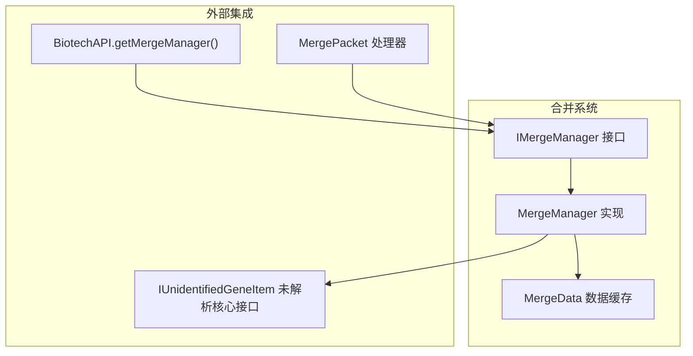
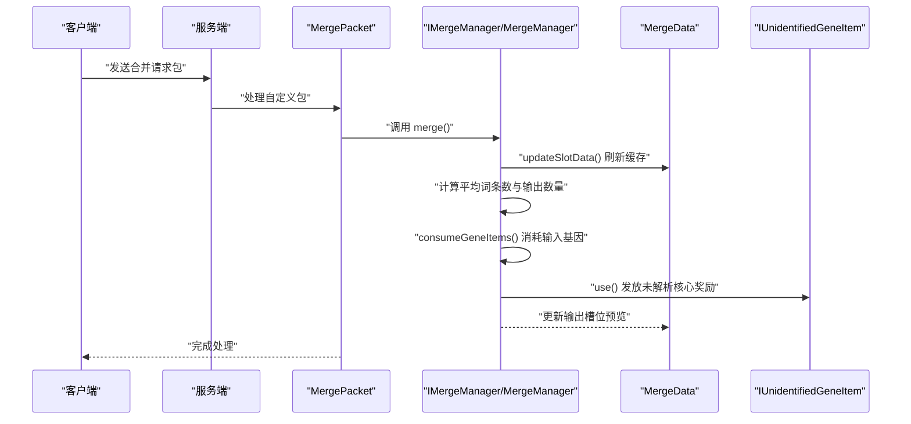
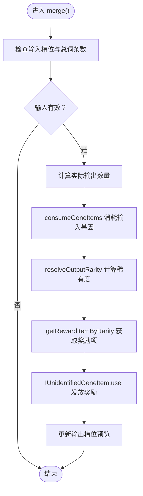
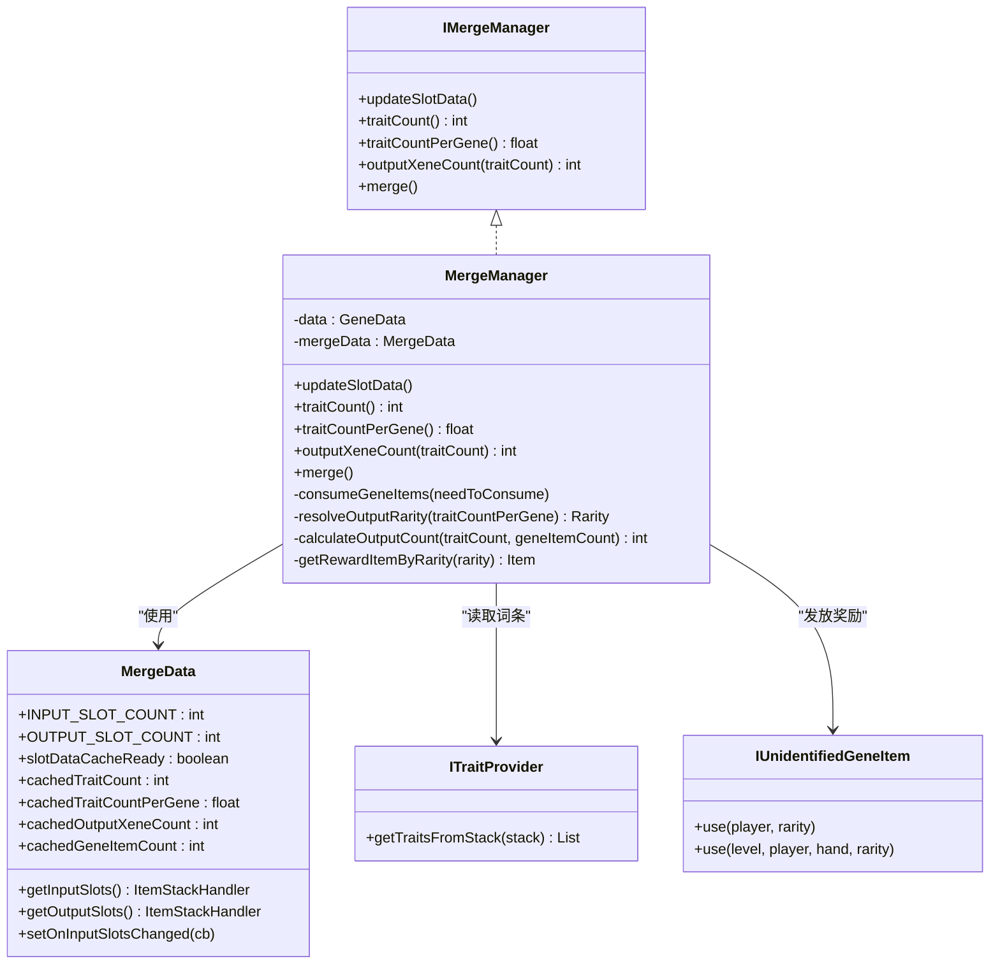

# 基因合并管理

<cite>
**本文引用的文件**
- [IMergeManager.java](file://Biotech/src/main/java/org/biotech/api/system/merge/core/IMergeManager.java)
- [MergeManager.java](file://Biotech/src/main/java/org/biotech/api/system/merge/MergeManager.java)
- [MergeData.java](file://Biotech/src/main/java/org/biotech/api/system/merge/MergeData.java)
- [BiotechAPI.java](file://Biotech/src/main/java/org/biotech/api/BiotechAPI.java)
- [MergePacket.java](file://Biotech/src/main/java/org/biotech/network/MergePacket.java)
- [IUnidentifiedGeneItem.java](file://Biotech/src/main/java/org/biotech/api/system/gene/core/IUnidentifiedGeneItem.java)
- [ITraitProvider.java](file://Biotech/src/main/java/org/biotech/api/system/trait/core/ITraitProvider.java)
- [EpicUnidentifiedGeneItem.java](file://Biotech/src/main/java/org/biotech/item/EpicUnidentifiedGeneItem.java)
- [RareUnidentifiedGeneItem.java](file://Biotech/src/main/java/org/biotech/item/RareUnidentifiedGeneItem.java)
- [UncommonUnidentifiedGeneItem.java](file://Biotech/src/main/java/org/biotech/item/UncommonUnidentifiedGeneItem.java)
</cite>

## 目录
1. [简介](#简介)
2. [项目结构](#项目结构)
3. [核心组件](#核心组件)
4. [架构总览](#架构总览)
5. [详细组件分析](#详细组件分析)
6. [依赖关系分析](#依赖关系分析)
7. [性能考量](#性能考量)
8. [故障排查指南](#故障排查指南)
9. [结论](#结论)
10. [附录：模组开发实践示例](#附录模组开发实践示例)

## 简介
本文件面向模组开发者，系统性阐述基因合并管理子系统的设计与实现，重点覆盖以下主题：
- IMergeManager 接口的职责与能力边界
- MergeManager 的算法实现：词条统计、平均词条数、输出数量计算、输出稀有度判定、物品消耗与奖励发放
- 合并规则验证与结果生成流程
- getMergeManager 方法的工作原理与使用场景
- 数据验证、成功率计算、属性叠加等机制
- 高级功能：合并冷却时间、成功率修正、特殊合并条件的扩展点与实现建议
- 在模组开发中如何基于现有框架实现自定义的基因合并逻辑

## 项目结构
基因合并系统位于 Biotech 模块内，采用“接口 + 实现 + 数据缓存 + 网络交互”的分层设计：
- 接口层：IMergeManager 定义合并管理器的对外契约
- 实现层：MergeManager 提供具体的合并算法与执行逻辑
- 数据层：MergeData 负责输入/输出槽位与运行时缓存
- 外部集成：BiotechAPI 提供能力查询入口；MergePacket 处理客户端到服务端的合并请求；IUnidentifiedGeneItem 定义未解析核心的使用行为

图表来源
- [IMergeManager.java:13-51](file://Biotech/src/main/java/org/biotech/api/system/merge/core/IMergeManager.java#L13-L51)
- [MergeManager.java:24-206](file://Biotech/src/main/java/org/biotech/api/system/merge/MergeManager.java#L24-L206)
- [MergeData.java:19-113](file://Biotech/src/main/java/org/biotech/api/system/merge/MergeData.java#L19-L113)
- [BiotechAPI.java:39-41](file://Biotech/src/main/java/org/biotech/api/BiotechAPI.java#L39-L41)
- [MergePacket.java:23-32](file://Biotech/src/main/java/org/biotech/network/MergePacket.java#L23-L32)
- [IUnidentifiedGeneItem.java:30-46](file://Biotech/src/main/java/org/biotech/api/system/gene/core/IUnidentifiedGeneItem.java#L30-L46)

章节来源
- [IMergeManager.java:13-51](file://Biotech/src/main/java/org/biotech/api/system/merge/core/IMergeManager.java#L13-L51)
- [MergeManager.java:24-206](file://Biotech/src/main/java/org/biotech/api/system/merge/MergeManager.java#L24-L206)
- [MergeData.java:19-113](file://Biotech/src/main/java/org/biotech/api/system/merge/MergeData.java#L19-L113)
- [BiotechAPI.java:39-41](file://Biotech/src/main/java/org/biotech/api/BiotechAPI.java#L39-L41)
- [MergePacket.java:23-32](file://Biotech/src/main/java/org/biotech/network/MergePacket.java#L23-L32)
- [IUnidentifiedGeneItem.java:30-46](file://Biotech/src/main/java/org/biotech/api/system/gene/core/IUnidentifiedGeneItem.java#L30-L46)

## 核心组件
- IMergeManager 接口
  - 职责：定义合并管理器的对外方法，包括槽位更新、词条计数、平均词条数、输出数量计算、合并执行等
  - 关键方法：updateSlotData、traitCount、traitCountPerGene、outputXeneCount、merge
- MergeManager 实现
  - 职责：实现 IMergeManager，负责遍历输入槽位、统计词条、计算平均词条数、确定输出稀有度、发放奖励、播放音效
  - 关键算法：calculateOutputCount、resolveOutputRarity、consumeGeneItems
- MergeData 数据缓存
  - 职责：维护输入/输出槽位、运行时缓存（词条总数、平均词条数、输出数量、基因数量）、槽位变更回调
- BiotechAPI.getMergeManager
  - 职责：通过玩家能力系统获取 IMergeManager 实例，作为外部调用入口
- MergePacket
  - 职责：处理客户端发起的合并请求，调用合并管理器执行合并与刷新
- IUnidentifiedGeneItem
  - 职责：定义未解析核心的使用行为（根据稀有度决定词条抽取次数），作为合并奖励的发放载体

章节来源
- [IMergeManager.java:13-51](file://Biotech/src/main/java/org/biotech/api/system/merge/core/IMergeManager.java#L13-L51)
- [MergeManager.java:24-206](file://Biotech/src/main/java/org/biotech/api/system/merge/MergeManager.java#L24-L206)
- [MergeData.java:19-113](file://Biotech/src/main/java/org/biotech/api/system/merge/MergeData.java#L19-L113)
- [BiotechAPI.java:39-41](file://Biotech/src/main/java/org/biotech/api/BiotechAPI.java#L39-L41)
- [MergePacket.java:23-32](file://Biotech/src/main/java/org/biotech/network/MergePacket.java#L23-L32)
- [IUnidentifiedGeneItem.java:30-46](file://Biotech/src/main/java/org/biotech/api/system/gene/core/IUnidentifiedGeneItem.java#L30-L46)

## 架构总览
下图展示了从客户端到服务端、再到合并管理器与奖励发放的整体流程。

图表来源
- [MergePacket.java:23-32](file://Biotech/src/main/java/org/biotech/network/MergePacket.java#L23-L32)
- [MergeManager.java:107-157](file://Biotech/src/main/java/org/biotech/api/system/merge/MergeManager.java#L107-L157)
- [MergeData.java:37-84](file://Biotech/src/main/java/org/biotech/api/system/merge/MergeData.java#L37-L84)
- [IUnidentifiedGeneItem.java:30-46](file://Biotech/src/main/java/org/biotech/api/system/gene/core/IUnidentifiedGeneItem.java#L30-L46)

## 详细组件分析

### IMergeManager 接口
- 设计要点
  - 将“槽位数据更新”“词条统计”“输出数量计算”“合并执行”等职责抽象为统一接口，便于替换与扩展
  - 明确输出规则：史诗必定双词条、稀有更高概率双词条、少见极小概率双词条、常见不会有双词条
- 方法语义
  - updateSlotData：每次向输入槽放入基因时触发，重新统计并缓存数据
  - traitCount/traitCountPerGene：返回累计词条数与平均词条数
  - outputXeneCount：按给定词条数估算可产出的未解析核心数量
  - merge：执行合并，消耗输入基因，发放奖励，播放确认音效

章节来源
- [IMergeManager.java:13-51](file://Biotech/src/main/java/org/biotech/api/system/merge/core/IMergeManager.java#L13-L51)

### MergeManager 实现
- 数据统计与缓存
  - 遍历输入槽位，统计总词条数、基因数量，计算平均词条数
  - 缓存至 MergeData，避免重复遍历
- 输出数量与稀有度
  - calculateOutputCount：以“每3个词条或每3个基因”为单位，取两者最小值
  - resolveOutputRarity：平均词条数≥3为史诗，≥2为稀有，否则为少见
- 合并执行
  - merge：校验输入与输出，按最大可产出数量消耗输入基因，按稀有度发放未解析核心
  - consumeGeneItems：顺序遍历输入槽位，按需消耗基因堆叠
- 奖励发放
  - 使用 IUnidentifiedGeneItem.use，按稀有度设置词条抽取次数，派发战利并播放音效

图表来源
- [MergeManager.java:107-157](file://Biotech/src/main/java/org/biotech/api/system/merge/MergeManager.java#L107-L157)
- [MergeManager.java:160-178](file://Biotech/src/main/java/org/biotech/api/system/merge/MergeManager.java#L160-L178)
- [MergeManager.java:180-196](file://Biotech/src/main/java/org/biotech/api/system/merge/MergeManager.java#L180-L196)
- [IUnidentifiedGeneItem.java:30-46](file://Biotech/src/main/java/org/biotech/api/system/gene/core/IUnidentifiedGeneItem.java#L30-L46)

章节来源
- [MergeManager.java:24-206](file://Biotech/src/main/java/org/biotech/api/system/merge/MergeManager.java#L24-L206)

### MergeData 数据缓存
- 结构与职责
  - 输入/输出槽位：固定输入槽位数量与输出槽位数量
  - 运行时缓存：词条总数、平均词条数、输出数量、基因数量、缓存就绪标志
  - 输入槽变更监听：当槽位内容变化时触发回调，使缓存失效并重新计算
- 设计优势
  - 减少频繁遍历输入槽位带来的性能开销
  - 保证 UI 与逻辑层的数据一致性

章节来源
- [MergeData.java:19-113](file://Biotech/src/main/java/org/biotech/api/system/merge/MergeData.java#L19-L113)

### getMergeManager 方法
- 工作原理
  - 通过 BiotechAPI.getMergeManager(player) 从玩家实体的能力系统中获取 IMergeManager 实例
  - 该实例在初始化时绑定输入槽位变更回调，确保数据实时更新
- 使用场景
  - UI 层预览输出、按钮可用性判断
  - 网络层处理合并请求（服务端）
  - 自定义模组扩展合并逻辑时的注入点

章节来源
- [BiotechAPI.java:39-41](file://Biotech/src/main/java/org/biotech/api/BiotechAPI.java#L39-L41)
- [MergeData.java:37-84](file://Biotech/src/main/java/org/biotech/api/system/merge/MergeData.java#L37-L84)

### 网络与交互：MergePacket
- 流程
  - 客户端发送自定义包至服务端
  - 服务端在安全线程中获取合并管理器并执行合并与刷新
- 注意事项
  - 合并前先刷新缓存，再执行合并，最后再次刷新以更新 UI

章节来源
- [MergePacket.java:23-32](file://Biotech/src/main/java/org/biotech/network/MergePacket.java#L23-L32)

### 未解析核心与词条抽取：IUnidentifiedGeneItem
- 行为
  - use(player, rarity)：根据稀有度设置词条抽取次数，滚动战利并派发结果
  - use(level, player, hand, rarity)：通用使用流程，播放音效并消耗物品（非创造模式）
- 与合并的关系
  - 合并成功后按稀有度发放对应未解析核心，核心使用时按配置抽取词条

章节来源
- [IUnidentifiedGeneItem.java:30-46](file://Biotech/src/main/java/org/biotech/api/system/gene/core/IUnidentifiedGeneItem.java#L30-L46)
- [IUnidentifiedGeneItem.java:98-117](file://Biotech/src/main/java/org/biotech/api/system/gene/core/IUnidentifiedGeneItem.java#L98-L117)

### 词条提供者：ITraitProvider
- 职责
  - 从物品堆叠中读取 TraitComp 并返回词条列表
  - 为合并统计提供基础数据
- 与合并的关系
  - MergeManager 通过 ITraitProvider 获取每个输入基因的词条数量，用于统计与平均值计算

章节来源
- [ITraitProvider.java:26-32](file://Biotech/src/main/java/org/biotech/api/system/trait/core/ITraitProvider.java#L26-L32)

### 未解析核心类型：Epic/Rare/Uncommon
- 类型与稀有度
  - 史诗、稀有、少见三种未解析核心分别对应不同稀有度
- 与合并的关系
  - 合并结果的稀有度决定奖励的未解析核心类型

章节来源
- [EpicUnidentifiedGeneItem.java:15-30](file://Biotech/src/main/java/org/biotech/item/EpicUnidentifiedGeneItem.java#L15-L30)
- [RareUnidentifiedGeneItem.java:15-31](file://Biotech/src/main/java/org/biotech/item/RareUnidentifiedGeneItem.java#L15-L31)
- [UncommonUnidentifiedGeneItem.java:15-30](file://Biotech/src/main/java/org/biotech/item/UncommonUnidentifiedGeneItem.java#L15-L30)

## 依赖关系分析
- 组件耦合
  - MergeManager 依赖 MergeData 进行缓存与槽位访问
  - MergeManager 依赖 ITraitProvider 读取词条信息
  - MergeManager 依赖 IUnidentifiedGeneItem 发放奖励
  - BiotechAPI 作为门面，提供 getMergeManager 能力查询
  - MergePacket 作为网络入口，调用合并管理器
- 外部依赖
  - Neoforge 物品栈处理器、能力系统、网络协议
  - 服务器配置（ServerConfig）用于词条抽取次数等参数

图表来源
- [IMergeManager.java:13-51](file://Biotech/src/main/java/org/biotech/api/system/merge/core/IMergeManager.java#L13-L51)
- [MergeManager.java:24-206](file://Biotech/src/main/java/org/biotech/api/system/merge/MergeManager.java#L24-L206)
- [MergeData.java:19-113](file://Biotech/src/main/java/org/biotech/api/system/merge/MergeData.java#L19-L113)
- [ITraitProvider.java:26-32](file://Biotech/src/main/java/org/biotech/api/system/trait/core/ITraitProvider.java#L26-L32)
- [IUnidentifiedGeneItem.java:30-46](file://Biotech/src/main/java/org/biotech/api/system/gene/core/IUnidentifiedGeneItem.java#L30-L46)

## 性能考量
- 缓存策略
  - 通过 MergeData 的运行时缓存避免重复遍历输入槽位，显著降低 CPU 开销
- 最小化网络往返
  - 合并请求在服务端一次性完成统计、消耗与发放，减少 UI 刷新次数
- 批量发放
  - 合并成功后批量发放未解析核心，减少多次网络与 UI 更新

## 故障排查指南
- 合并无效
  - 检查输入槽位是否为空或不满足“至少3个基因”的条件
  - 确认平均词条数是否足够产生输出
- 输出槽位为空
  - 确认 updateSlotData 是否被正确触发（输入槽位变更会自动触发）
- 奖励未发放
  - 检查目标稀有度对应的未解析核心是否存在
  - 确认玩家背包是否有空间接收奖励
- 音效异常
  - 确认合并成功后是否播放了经验球拾取音效，音调由稀有度决定

章节来源
- [MergeManager.java:107-157](file://Biotech/src/main/java/org/biotech/api/system/merge/MergeManager.java#L107-L157)
- [MergeData.java:65-84](file://Biotech/src/main/java/org/biotech/api/system/merge/MergeData.java#L65-L84)

## 结论
基因合并管理子系统通过清晰的接口与稳健的实现，提供了可扩展的合并机制。其核心在于：
- 以平均词条数为核心指标，结合输入基因数量，计算输出数量与稀有度
- 通过缓存与事件驱动，平衡性能与实时性
- 以未解析核心为奖励载体，无缝对接词条抽取系统

对于模组开发者而言，可在不破坏现有流程的前提下，通过扩展 IUnidentifiedGeneItem 或自定义 IMergeManager 实现，引入新的合并规则与奖励形态。

## 附录：模组开发实践示例
以下示例展示如何在模组中使用合并管理器实现自定义的基因合并逻辑（步骤式说明，不包含具体代码）：

- 步骤1：获取合并管理器
  - 使用 BiotechAPI.getMergeManager(player) 获取 IMergeManager 实例
- 步骤2：预览输出
  - 调用 traitCount()/traitCountPerGene()/outputXeneCount() 获取当前状态与预估输出
- 步骤3：发起合并
  - 在服务端处理客户端合并请求时，调用 manager.merge() 执行合并
  - 合并完成后调用 manager.updateSlotData() 刷新 UI
- 步骤4：自定义奖励
  - 实现 IUnidentifiedGeneItem 接口，定义 use(player, rarity) 的词条抽取逻辑
  - 在合并成功后按稀有度发放自定义未解析核心
- 步骤5：高级功能扩展
  - 合并冷却时间：在自定义 IMergeManager 中增加冷却状态字段与冷却判定
  - 成功率修正：在合并前根据玩家属性或环境因素调整平均词条数阈值
  - 特殊合并条件：在 merge() 执行前增加前置条件检查（如特定基因组合、玩家状态等）

章节来源
- [BiotechAPI.java:39-41](file://Biotech/src/main/java/org/biotech/api/BiotechAPI.java#L39-L41)
- [MergePacket.java:23-32](file://Biotech/src/main/java/org/biotech/network/MergePacket.java#L23-L32)
- [MergeManager.java:107-157](file://Biotech/src/main/java/org/biotech/api/system/merge/MergeManager.java#L107-L157)
- [IUnidentifiedGeneItem.java:30-46](file://Biotech/src/main/java/org/biotech/api/system/gene/core/IUnidentifiedGeneItem.java#L30-L46)