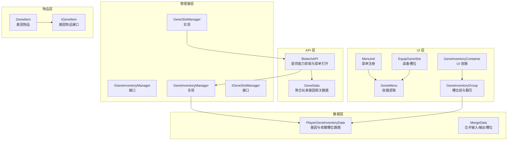
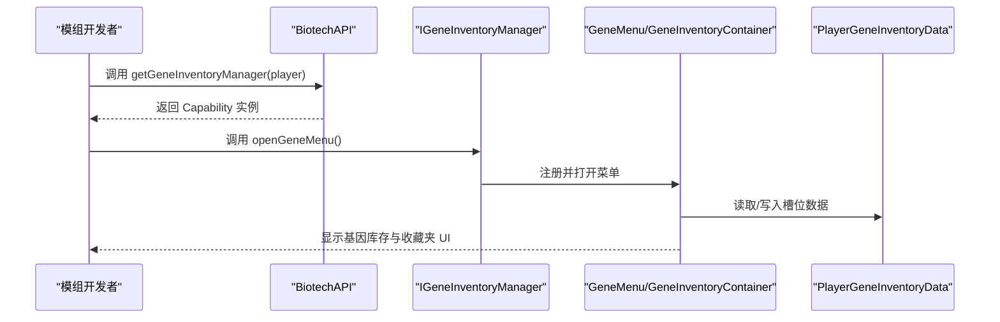
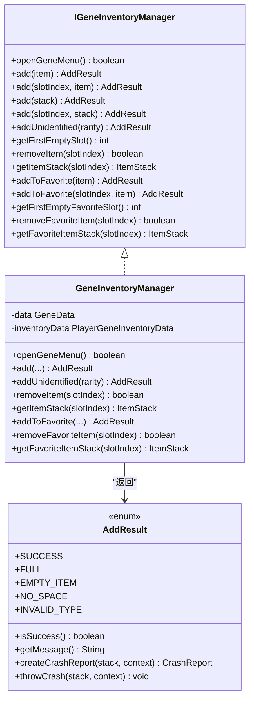
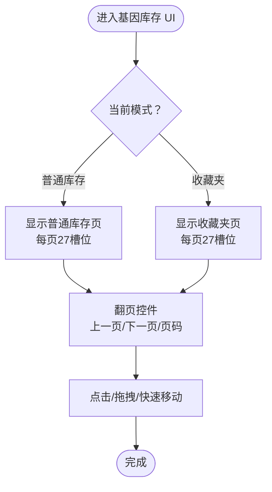
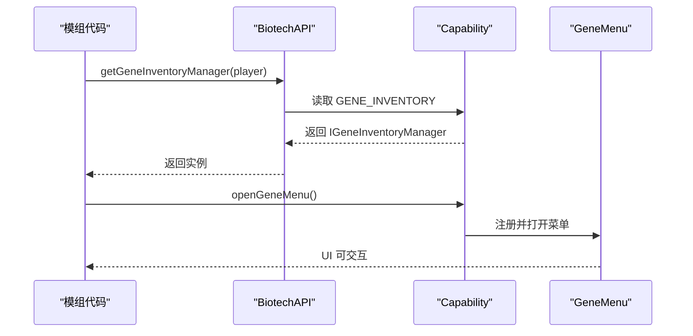
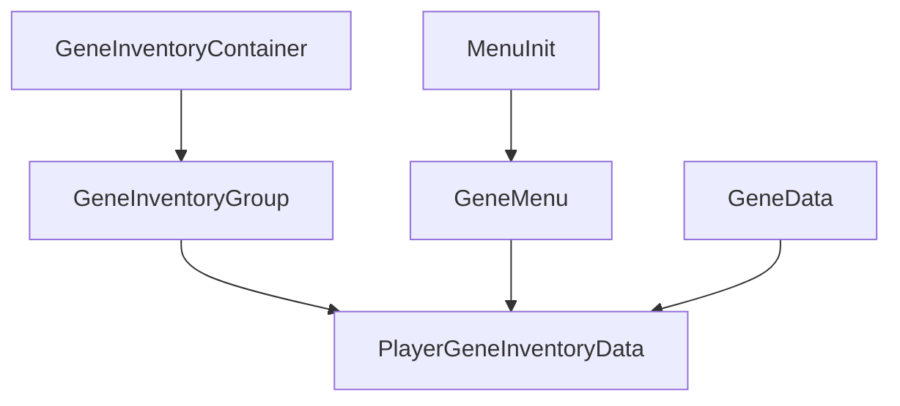
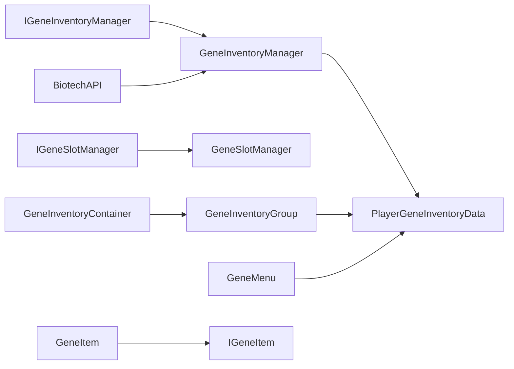

# 基因库存管理

<cite>
**本文引用的文件**
- [IGeneInventoryManager.java](file://Biotech/src/main/java/org/biotech/api/system/gene/core/manager/IGeneInventoryManager.java)
- [IGeneSlotManager.java](file://Biotech/src/main/java/org/biotech/api/system/gene/core/manager/IGeneSlotManager.java)
- [GeneInventoryManager.java](file://Biotech/src/main/java/org/biotech/api/system/gene/inventory/GeneInventoryManager.java)
- [GeneSlotManager.java](file://Biotech/src/main/java/org/biotech/api/system/gene/inventory/GeneSlotManager.java)
- [PlayerGeneInventoryData.java](file://Biotech/src/main/java/org/biotech/api/system/gene/inventory/PlayerGeneInventoryData.java)
- [BiotechAPI.java](file://Biotech/src/main/java/org/biotech/api/BiotechAPI.java)
- [GeneData.java](file://Biotech/src/main/java/org/biotech/api/GeneData.java)
- [MenuInit.java](file://Biotech/src/main/java/org/biotech/api/init/MenuInit.java)
- [GeneMenu.java](file://Biotech/src/main/java/org/biotech/container/GeneMenu.java)
- [GeneInventoryContainer.java](file://Biotech/src/main/java/org/biotech/container/GeneInventoryContainer.java)
- [GeneItem.java](file://Biotech/src/main/java/org/biotech/item/GeneItem.java)
- [IGeneItem.java](file://Biotech/src/main/java/org/biotech/api/system/gene/core/IGeneItem.java)
- [GeneInventoryGroup.java](file://Biotech/src/main/java/org/biotech/ui/gene_inventroy/group/GeneInventoryGroup.java)
- [EquipGeneSlot.java](file://Biotech/src/main/java/org/biotech/ui/gene_inventroy/element/EquipGeneSlot.java)
- [MergeData.java](file://Biotech/src/main/java/org/biotech/api/system/merge/MergeData.java)
</cite>

## 目录
1. [简介](#简介)
2. [项目结构](#项目结构)
3. [核心组件](#核心组件)
4. [架构总览](#架构总览)
5. [详细组件分析](#详细组件分析)
6. [依赖关系分析](#依赖关系分析)
7. [性能考量](#性能考量)
8. [故障排查指南](#故障排查指南)
9. [结论](#结论)
10. [附录](#附录)

## 简介
本文件面向模组开发者，系统性阐述“基因库存管理”子系统的设计与实现，重点覆盖以下方面：
- IGeneInventoryManager 接口的功能与实现细节，包括增删改查、槽位管理、收藏夹功能
- getGeneInventoryManager 方法的工作原理与使用场景
- 基因库存的 UI 交互、数据同步与状态管理
- 完整的模组开发示例路径（以源码路径代替具体代码片段）
- 库存容量限制、排序与过滤等高级能力的使用方法

## 项目结构
基因库存管理位于 Biotech 模块中，围绕“接口定义 → 实现类 → 数据持久化 → UI 容器 → API 暴露”的层次组织，形成清晰的分层架构。

图表来源
- [BiotechAPI.java:1-92](file://Biotech/src/main/java/org/biotech/api/BiotechAPI.java#L1-L92)
- [IGeneInventoryManager.java:1-133](file://Biotech/src/main/java/org/biotech/api/system/gene/core/manager/IGeneInventoryManager.java#L1-L133)
- [GeneInventoryManager.java:1-186](file://Biotech/src/main/java/org/biotech/api/system/gene/inventory/GeneInventoryManager.java#L1-L186)
- [IGeneSlotManager.java:1-36](file://Biotech/src/main/java/org/biotech/api/system/gene/core/manager/IGeneSlotManager.java#L1-L36)
- [GeneSlotManager.java:1-54](file://Biotech/src/main/java/org/biotech/api/system/gene/inventory/GeneSlotManager.java#L1-L54)
- [PlayerGeneInventoryData.java:1-72](file://Biotech/src/main/java/org/biotech/api/system/gene/inventory/PlayerGeneInventoryData.java#L1-L72)
- [MenuInit.java:1-60](file://Biotech/src/main/java/org/biotech/api/init/MenuInit.java#L1-L60)
- [GeneMenu.java:1-189](file://Biotech/src/main/java/org/biotech/container/GeneMenu.java#L1-L189)
- [GeneInventoryContainer.java:34-67](file://Biotech/src/main/java/org/biotech/container/GeneInventoryContainer.java#L34-L67)
- [GeneInventoryGroup.java:1-200](file://Biotech/src/main/java/org/biotech/ui/gene_inventroy/group/GeneInventoryGroup.java#L1-L200)
- [EquipGeneSlot.java:1-35](file://Biotech/src/main/java/org/biotech/ui/gene_inventroy/element/EquipGeneSlot.java#L1-L35)
- [MergeData.java:1-40](file://Biotech/src/main/java/org/biotech/api/system/merge/MergeData.java#L1-L40)
- [GeneItem.java:1-209](file://Biotech/src/main/java/org/biotech/item/GeneItem.java#L1-L209)
- [IGeneItem.java:1-8](file://Biotech/src/main/java/org/biotech/api/system/gene/core/IGeneItem.java#L1-L8)

章节来源
- [BiotechAPI.java:1-92](file://Biotech/src/main/java/org/biotech/api/BiotechAPI.java#L1-L92)
- [IGeneInventoryManager.java:1-133](file://Biotech/src/main/java/org/biotech/api/system/gene/core/manager/IGeneInventoryManager.java#L1-L133)
- [PlayerGeneInventoryData.java:1-72](file://Biotech/src/main/java/org/biotech/api/system/gene/inventory/PlayerGeneInventoryData.java#L1-L72)

## 核心组件
- IGeneInventoryManager：定义基因库存的增删改查、收藏夹操作、打开菜单等接口契约
- GeneInventoryManager：IGeneInventoryManager 的实现，负责实际的槽位写入、读取、删除与校验
- PlayerGeneInventoryData：基于 LDLib2 的持久化数据，包含基因槽位与收藏槽位，限定仅接受 IGeneItem
- BiotechAPI：对外 API 入口，提供 getGeneInventoryManager、openGeneInventoryFor 等静态方法
- GeneMenu/GeneInventoryContainer：UI 容器与菜单逻辑，负责快速移动、目标分支判定与优先级
- UI 组与槽位：GeneInventoryGroup、EquipGeneSlot 等，负责渲染、翻页、收藏模式切换与交互

章节来源
- [IGeneInventoryManager.java:12-133](file://Biotech/src/main/java/org/biotech/api/system/gene/core/manager/IGeneInventoryManager.java#L12-L133)
- [GeneInventoryManager.java:18-186](file://Biotech/src/main/java/org/biotech/api/system/gene/inventory/GeneInventoryManager.java#L18-L186)
- [PlayerGeneInventoryData.java:20-72](file://Biotech/src/main/java/org/biotech/api/system/gene/inventory/PlayerGeneInventoryData.java#L20-L72)
- [BiotechAPI.java:21-60](file://Biotech/src/main/java/org/biotech/api/BiotechAPI.java#L21-L60)
- [GeneMenu.java:13-189](file://Biotech/src/main/java/org/biotech/container/GeneMenu.java#L13-L189)
- [GeneInventoryContainer.java:34-67](file://Biotech/src/main/java/org/biotech/container/GeneInventoryContainer.java#L34-L67)
- [GeneInventoryGroup.java:48-200](file://Biotech/src/main/java/org/biotech/ui/gene_inventroy/group/GeneInventoryGroup.java#L48-L200)
- [EquipGeneSlot.java:21-35](file://Biotech/src/main/java/org/biotech/ui/gene_inventroy/element/EquipGeneSlot.java#L21-L35)

## 架构总览
下图展示了从模组调用到 UI 渲染与数据持久化的整体流程。

图表来源
- [BiotechAPI.java:31-56](file://Biotech/src/main/java/org/biotech/api/BiotechAPI.java#L31-L56)
- [GeneInventoryManager.java:28-39](file://Biotech/src/main/java/org/biotech/api/system/gene/inventory/GeneInventoryManager.java#L28-L39)
- [MenuInit.java:47-57](file://Biotech/src/main/java/org/biotech/api/init/MenuInit.java#L47-L57)
- [PlayerGeneInventoryData.java:20-72](file://Biotech/src/main/java/org/biotech/api/system/gene/inventory/PlayerGeneInventoryData.java#L20-L72)

## 详细组件分析

### IGeneInventoryManager 接口与实现
- 职责边界
  - 基础增删改查：add/add(int, ItemStack)/add(ItemStack)/removeItem/getItemStack
  - 收藏夹：addToFavorite/addToFavorite(int, GeneItem)/removeFavoriteItem/getFavoriteItemStack
  - 菜单控制：openGeneMenu
  - 结果与异常：AddResult 枚举及崩溃报告工具
- 关键行为
  - 自动寻空：slotIndex=-1 时自动查找第一个空槽
  - 类型校验：仅允许 IGeneItem 类型写入
  - 边界保护：越界、满仓、空项等返回明确的 AddResult
- 与 UI 的衔接
  - openGeneMenu 通过 MenuInit 注册的菜单打开 UI
  - UI 侧通过 GeneMenu 的快速移动逻辑与槽位 ID 规则进行交互

图表来源
- [IGeneInventoryManager.java:12-133](file://Biotech/src/main/java/org/biotech/api/system/gene/core/manager/IGeneInventoryManager.java#L12-L133)
- [GeneInventoryManager.java:18-186](file://Biotech/src/main/java/org/biotech/api/system/gene/inventory/GeneInventoryManager.java#L18-L186)

章节来源
- [IGeneInventoryManager.java:14-133](file://Biotech/src/main/java/org/biotech/api/system/gene/core/manager/IGeneInventoryManager.java#L14-L133)
- [GeneInventoryManager.java:45-184](file://Biotech/src/main/java/org/biotech/api/system/gene/inventory/GeneInventoryManager.java#L45-L184)

### 槽位与收藏夹管理
- 槽位设计
  - 每页 3 行 × 9 列 = 27 个槽位；总页数 9；基因与收藏各 243 个槽位
  - 通过 ItemStackHandler 限定仅接受 IGeneItem
- 收藏夹模式
  - UI 侧通过 GeneInventoryGroup 的收藏按钮切换“收藏模式”，默认显示普通库存第一页，收藏页默认隐藏
- 装备槽位
  - UI 侧提供 EquipGeneSlot，用于展示与交互 Curios 装备槽位

图表来源
- [PlayerGeneInventoryData.java:23-31](file://Biotech/src/main/java/org/biotech/api/system/gene/inventory/PlayerGeneInventoryData.java#L23-L31)
- [GeneInventoryGroup.java:137-149](file://Biotech/src/main/java/org/biotech/ui/gene_inventroy/group/GeneInventoryGroup.java#L137-L149)
- [EquipGeneSlot.java:21-35](file://Biotech/src/main/java/org/biotech/ui/gene_inventroy/element/EquipGeneSlot.java#L21-L35)

章节来源
- [PlayerGeneInventoryData.java:16-72](file://Biotech/src/main/java/org/biotech/api/system/gene/inventory/PlayerGeneInventoryData.java#L16-L72)
- [GeneInventoryGroup.java:137-200](file://Biotech/src/main/java/org/biotech/ui/gene_inventroy/group/GeneInventoryGroup.java#L137-L200)
- [EquipGeneSlot.java:21-35](file://Biotech/src/main/java/org/biotech/ui/gene_inventroy/element/EquipGeneSlot.java#L21-L35)

### getGeneInventoryManager 方法详解
- 工作原理
  - 通过 BiotechAPI.getGeneInventoryManager(player) 从玩家实体的 Capability 中取出 IGeneInventoryManager
  - 该 Capability 由 CapInit 注册并在运行时注入到玩家数据中
- 使用场景
  - 客户端/服务端均可调用，用于打开菜单、查询槽位、执行增删改查
  - 服务端可通过 openGeneInventoryFor(targetPlayer) 为其他玩家打开菜单
- 注意事项
  - 若返回 null，需检查 Capability 注册与数据附加是否正确
  - openGeneMenu 内部依赖 MenuInit 注册的菜单容器

图表来源
- [BiotechAPI.java:31-56](file://Biotech/src/main/java/org/biotech/api/BiotechAPI.java#L31-L56)
- [MenuInit.java:47-57](file://Biotech/src/main/java/org/biotech/api/init/MenuInit.java#L47-L57)
- [GeneMenu.java:23-25](file://Biotech/src/main/java/org/biotech/container/GeneMenu.java#L23-L25)

章节来源
- [BiotechAPI.java:31-56](file://Biotech/src/main/java/org/biotech/api/BiotechAPI.java#L31-L56)
- [MenuInit.java:47-57](file://Biotech/src/main/java/org/biotech/api/init/MenuInit.java#L47-L57)

### UI 交互、数据同步与状态管理
- UI 容器与菜单
  - GeneInventoryContainer 构建根 UI，挂载 Inventory/Info/Merge 等分组
  - GeneMenu 负责快速移动、来源分支识别、目标槽位合法性判断与优先级
- 数据同步
  - PlayerGeneInventoryData 使用 LDLib2 的 IPersistedSerializable 与自动生成的 Codec/StreamCodec，保证网络传输与本地持久化
  - GeneData 聚合多个子数据模块，按需延迟初始化
- 状态管理
  - UI 侧通过 PageManager 控制页码显示与隐藏
  - 收藏模式通过 FavoritesButton 在普通库存与收藏夹之间切换

图表来源
- [MenuInit.java:47-57](file://Biotech/src/main/java/org/biotech/api/init/MenuInit.java#L47-L57)
- [GeneMenu.java:13-189](file://Biotech/src/main/java/org/biotech/container/GeneMenu.java#L13-L189)
- [GeneInventoryContainer.java:34-67](file://Biotech/src/main/java/org/biotech/container/GeneInventoryContainer.java#L34-L67)
- [GeneInventoryGroup.java:137-149](file://Biotech/src/main/java/org/biotech/ui/gene_inventroy/group/GeneInventoryGroup.java#L137-L149)
- [PlayerGeneInventoryData.java:20-72](file://Biotech/src/main/java/org/biotech/api/system/gene/inventory/PlayerGeneInventoryData.java#L20-L72)
- [GeneData.java:43-62](file://Biotech/src/main/java/org/biotech/api/GeneData.java#L43-L62)

章节来源
- [GeneMenu.java:27-148](file://Biotech/src/main/java/org/biotech/container/GeneMenu.java#L27-L148)
- [PlayerGeneInventoryData.java:34-35](file://Biotech/src/main/java/org/biotech/api/system/gene/inventory/PlayerGeneInventoryData.java#L34-L35)
- [GeneData.java:66-99](file://Biotech/src/main/java/org/biotech/api/GeneData.java#L66-L99)

### 高级功能：容量、排序与过滤
- 容量限制
  - 基因库存与收藏夹均为 9 页 × 27 槽位 = 243 个槽位
  - add(...) 会在无空槽时返回 FULL；越界返回 NO_SPACE
- 排序与过滤
  - 当前实现未提供排序与过滤逻辑；如需实现，可在 UI 侧对 GeneInventoryGroup 的行与列进行二次加工，或扩展 PlayerGeneInventoryData 的访问器以支持自定义顺序
- 合并与装备
  - 合并功能使用 MergeData 的输入/输出槽位，UI 侧通过 Merge 分组与 GeneInventoryGroup 协同
  - 装备槽位通过 Curios 接口获取，UI 侧使用 EquipGeneSlot 进行渲染与交互

章节来源
- [PlayerGeneInventoryData.java:23-31](file://Biotech/src/main/java/org/biotech/api/system/gene/inventory/PlayerGeneInventoryData.java#L23-L31)
- [GeneInventoryManager.java:58-80](file://Biotech/src/main/java/org/biotech/api/system/gene/inventory/GeneInventoryManager.java#L58-L80)
- [MergeData.java:18-40](file://Biotech/src/main/java/org/biotech/api/system/merge/MergeData.java#L18-L40)
- [EquipGeneSlot.java:21-35](file://Biotech/src/main/java/org/biotech/ui/gene_inventroy/element/EquipGeneSlot.java#L21-L35)

## 依赖关系分析
- 接口与实现
  - IGeneInventoryManager ← GeneInventoryManager：职责清晰，实现类专注数据访问与校验
  - IGeneSlotManager ← GeneSlotManager：当前实现返回 false，预留扩展点
- 数据与 UI
  - PlayerGeneInventoryData 作为数据载体，被 UI 组与容器直接读取
  - GeneMenu 通过槽位 ID 与父节点关系判断来源分支，确保快速移动的正确性
- 物品与能力
  - GeneItem 实现 IGeneItem，约束槽位写入类型
  - BiotechAPI 作为统一入口，连接 Capability、菜单与 Curios 装备

图表来源
- [IGeneInventoryManager.java:12-133](file://Biotech/src/main/java/org/biotech/api/system/gene/core/manager/IGeneInventoryManager.java#L12-L133)
- [GeneInventoryManager.java:18-186](file://Biotech/src/main/java/org/biotech/api/system/gene/inventory/GeneInventoryManager.java#L18-L186)
- [IGeneSlotManager.java:6-36](file://Biotech/src/main/java/org/biotech/api/system/gene/core/manager/IGeneSlotManager.java#L6-L36)
- [GeneSlotManager.java:6-54](file://Biotech/src/main/java/org/biotech/api/system/gene/inventory/GeneSlotManager.java#L6-L54)
- [PlayerGeneInventoryData.java:20-72](file://Biotech/src/main/java/org/biotech/api/system/gene/inventory/PlayerGeneInventoryData.java#L20-L72)
- [GeneInventoryContainer.java:34-67](file://Biotech/src/main/java/org/biotech/container/GeneInventoryContainer.java#L34-L67)
- [GeneInventoryGroup.java:137-149](file://Biotech/src/main/java/org/biotech/ui/gene_inventroy/group/GeneInventoryGroup.java#L137-L149)
- [GeneMenu.java:150-187](file://Biotech/src/main/java/org/biotech/container/GeneMenu.java#L150-L187)
- [BiotechAPI.java:31-56](file://Biotech/src/main/java/org/biotech/api/BiotechAPI.java#L31-L56)
- [GeneItem.java:31-38](file://Biotech/src/main/java/org/biotech/item/GeneItem.java#L31-L38)
- [IGeneItem.java:5-7](file://Biotech/src/main/java/org/biotech/api/system/gene/core/IGeneItem.java#L5-L7)

章节来源
- [IGeneInventoryManager.java:12-133](file://Biotech/src/main/java/org/biotech/api/system/gene/core/manager/IGeneInventoryManager.java#L12-L133)
- [IGeneSlotManager.java:6-36](file://Biotech/src/main/java/org/biotech/api/system/gene/core/manager/IGeneSlotManager.java#L6-L36)
- [PlayerGeneInventoryData.java:20-72](file://Biotech/src/main/java/org/biotech/api/system/gene/inventory/PlayerGeneInventoryData.java#L20-L72)
- [GeneMenu.java:150-187](file://Biotech/src/main/java/org/biotech/container/GeneMenu.java#L150-L187)
- [BiotechAPI.java:31-56](file://Biotech/src/main/java/org/biotech/api/BiotechAPI.java#L31-L56)
- [GeneItem.java:31-38](file://Biotech/src/main/java/org/biotech/item/GeneItem.java#L31-L38)
- [IGeneItem.java:5-7](file://Biotech/src/main/java/org/biotech/api/system/gene/core/IGeneItem.java#L5-L7)

## 性能考量
- 槽位遍历
  - getFirstEmptySlot 与 getFirstEmptyFavoriteSlot 采用线性扫描，时间复杂度 O(n)，n 为页内槽位数
  - 对于高频操作，可在 UI 侧维护“最近空槽”缓存以降低遍历成本
- 序列化与网络
  - PlayerGeneInventoryData 使用 LDLib2 的自动生成编解码器，具备良好性能与稳定性
- 快速移动
  - GeneMenu 的快速移动逻辑通过 ID 前缀匹配与优先级排序，减少不必要的遍历

## 故障排查指南
- 添加失败
  - AddResult.FULL：库存已满，建议先清理或扩展页数（当前实现预留扩展接口）
  - AddResult.EMPTY_ITEM：传入空物品，检查调用方参数
  - AddResult.NO_SPACE：指定索引越界或不可堆叠无空位
  - AddResult.INVALID_TYPE：非 IGeneItem 类型，检查物品类型
- 打开菜单失败
  - openGeneMenu 返回 false：确认玩家实体存在、菜单注册正常
  - 服务端打开他人菜单：使用 openGeneInventoryFor，检查 Capability 是否注入
- UI 不显示
  - 收藏模式未切换：检查 FavoritesButton 的点击事件与 PageManager 的显示逻辑
  - 槽位不响应：确认槽位 ID 前缀与父节点关系匹配

章节来源
- [IGeneInventoryManager.java:79-130](file://Biotech/src/main/java/org/biotech/api/system/gene/core/manager/IGeneInventoryManager.java#L79-L130)
- [GeneInventoryManager.java:58-80](file://Biotech/src/main/java/org/biotech/api/system/gene/inventory/GeneInventoryManager.java#L58-L80)
- [BiotechAPI.java:47-56](file://Biotech/src/main/java/org/biotech/api/BiotechAPI.java#L47-L56)
- [GeneMenu.java:27-148](file://Biotech/src/main/java/org/biotech/container/GeneMenu.java#L27-L148)

## 结论
本系统以清晰的接口与实现分离、严谨的数据持久化与灵活的 UI 容器为核心，提供了完整的基因库存管理能力。通过 BiotechAPI 的统一入口与 Capability 注入，模组开发者可以安全地在客户端与服务端进行库存操作。当前实现已覆盖基本增删改查、收藏夹与菜单打开，未来可在此基础上扩展排序、过滤与动态页数等功能。

## 附录
- 模组开发示例路径（以源码路径代替具体代码）
  - 获取库存管理器：[BiotechAPI.java:31-33](file://Biotech/src/main/java/org/biotech/api/BiotechAPI.java#L31-L33)
  - 打开基因库存菜单：[BiotechAPI.java:47-56](file://Biotech/src/main/java/org/biotech/api/BiotechAPI.java#L47-L56)
  - 添加基因到库存（自动寻空）：[GeneInventoryManager.java:45-48](file://Biotech/src/main/java/org/biotech/api/system/gene/inventory/GeneInventoryManager.java#L45-L48)
  - 指定槽位添加基因：[GeneInventoryManager.java:58-80](file://Biotech/src/main/java/org/biotech/api/system/gene/inventory/GeneInventoryManager.java#L58-L80)
  - 添加到收藏夹：[GeneInventoryManager.java:128-157](file://Biotech/src/main/java/org/biotech/api/system/gene/inventory/GeneInventoryManager.java#L128-L157)
  - 移除库存项：[GeneInventoryManager.java:109-116](file://Biotech/src/main/java/org/biotech/api/system/gene/inventory/GeneInventoryManager.java#L109-L116)
  - 移除收藏夹项：[GeneInventoryManager.java:169-176](file://Biotech/src/main/java/org/biotech/api/system/gene/inventory/GeneInventoryManager.java#L169-L176)
  - 获取空槽位：[PlayerGeneInventoryData.java:29-31](file://Biotech/src/main/java/org/biotech/api/system/gene/inventory/PlayerGeneInventoryData.java#L29-L31)
  - UI 容器与菜单注册：[MenuInit.java:47-57](file://Biotech/src/main/java/org/biotech/api/init/MenuInit.java#L47-L57)
  - UI 快速移动逻辑：[GeneMenu.java:27-148](file://Biotech/src/main/java/org/biotech/container/GeneMenu.java#L27-L148)
  - 基因物品类型约束：[PlayerGeneInventoryData.java:60-68](file://Biotech/src/main/java/org/biotech/api/system/gene/inventory/PlayerGeneInventoryData.java#L60-L68)
  - 合并数据结构：[MergeData.java:18-40](file://Biotech/src/main/java/org/biotech/api/system/merge/MergeData.java#L18-L40)
  - 装备槽位 UI：[EquipGeneSlot.java:21-35](file://Biotech/src/main/java/org/biotech/ui/gene_inventroy/element/EquipGeneSlot.java#L21-L35)