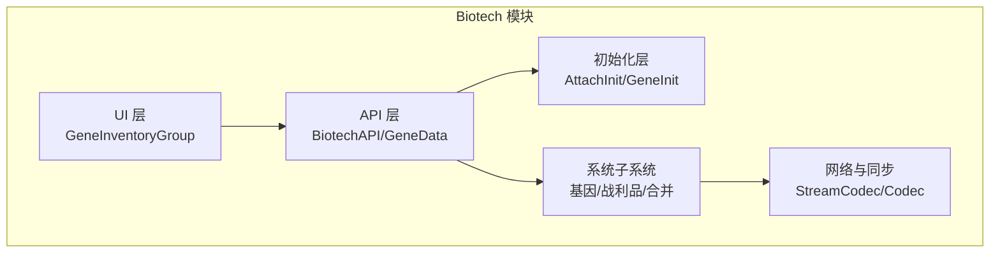
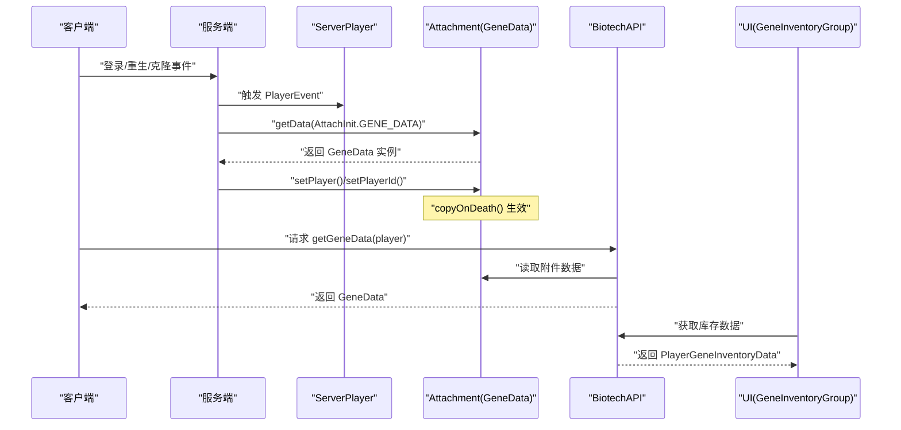
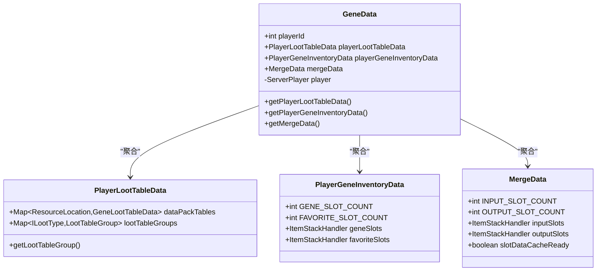
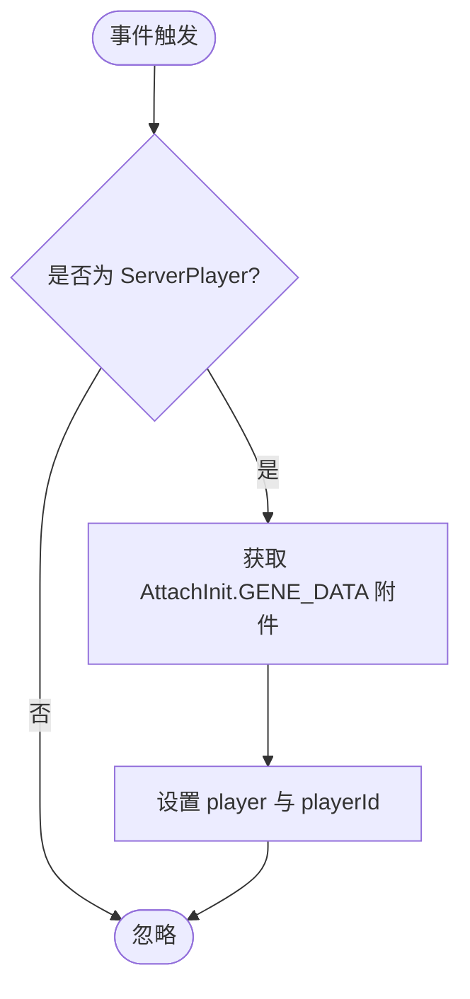
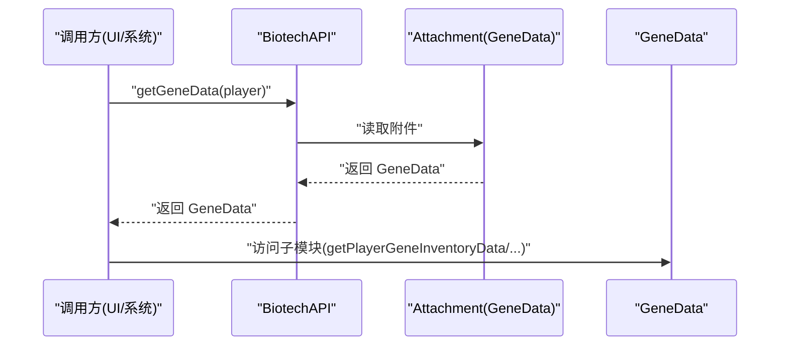
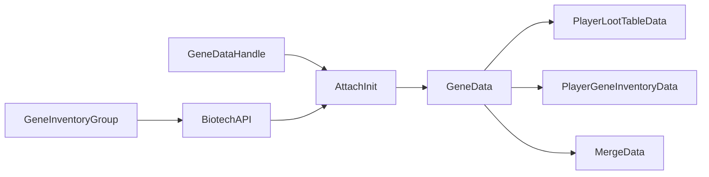

# 基因数据管理

<cite>
**本文引用的文件**
- [GeneData.java](file://Biotech/src/main/java/org/biotech/api/GeneData.java)
- [AttachInit.java](file://Biotech/src/main/java/org/biotech/api/init/AttachInit.java)
- [GeneDataHandle.java](file://Biotech/src/main/java/org/biotech/api/event/handle/GeneDataHandle.java)
- [PlayerGeneInventoryData.java](file://Biotech/src/main/java/org/biotech/api/system/gene/inventory/PlayerGeneInventoryData.java)
- [MergeData.java](file://Biotech/src/main/java/org/biotech/api/system/merge/MergeData.java)
- [PlayerLootTableData.java](file://Biotech/src/main/java/org/biotech/api/system/loot/PlayerLootTableData.java)
- [BiotechAPI.java](file://Biotech/src/main/java/org/biotech/api/BiotechAPI.java)
- [GeneInventoryGroup.java](file://Biotech/src/main/java/org/biotech/ui/gene_inventroy/group/GeneInventoryGroup.java)
- [GeneContext.java](file://Biotech/src/main/java/org/biotech/api/system/gene/GeneContext.java)
- [DataComponentInit.java](file://Biotech/src/main/java/org/biotech/api/init/DataComponentInit.java)
</cite>

## 目录
1. [简介](#简介)
2. [项目结构](#项目结构)
3. [核心组件](#核心组件)
4. [架构总览](#架构总览)
5. [详细组件分析](#详细组件分析)
6. [依赖关系分析](#依赖关系分析)
7. [性能考量](#性能考量)
8. [故障排查指南](#故障排查指南)
9. [结论](#结论)
10. [附录：模组开发最佳实践与示例路径](#附录模组开发最佳实践与示例路径)

## 简介
本文件系统性阐述“基因数据管理”模块的设计与实现，重点围绕 GeneData 类及其附属数据结构（玩家基因库存、战利品表、合并数据）展开，解释其存储、访问与管理机制；说明 getGeneData 方法（通过 BiotechAPI）如何基于 Player 对象获取基因数据附件；梳理数据生命周期、持久化方式与客户端-服务器同步机制；并提供模组开发中的最佳实践、数据验证与错误处理建议。

## 项目结构
本项目采用按功能域分层的组织方式，基因相关能力集中在 Biotech 模块下，核心入口为 API 层，数据以“附件（Attachment）”形式依附于 ServerPlayer，通过注册中心统一初始化与同步。

**图表来源**
- [AttachInit.java:19-31](file://Biotech/src/main/java/org/biotech/api/init/AttachInit.java#L19-L31)
- [GeneData.java:67-99](file://Biotech/src/main/java/org/biotech/api/GeneData.java#L67-L99)
- [PlayerGeneInventoryData.java:34-35](file://Biotech/src/main/java/org/biotech/api/system/gene/inventory/PlayerGeneInventoryData.java#L34-L35)
- [PlayerLootTableData.java:50-86](file://Biotech/src/main/java/org/biotech/api/system/loot/PlayerLootTableData.java#L50-L86)
- [MergeData.java:26-27](file://Biotech/src/main/java/org/biotech/api/system/merge/MergeData.java#L26-L27)

**章节来源**
- [AttachInit.java:1-34](file://Biotech/src/main/java/org/biotech/api/init/AttachInit.java#L1-L34)
- [GeneData.java:1-101](file://Biotech/src/main/java/org/biotech/api/GeneData.java#L1-L101)

## 核心组件
- GeneData：聚合型数据容器，延迟初始化各子数据模块，提供序列化与网络流编解码，支持复制到死亡场景。
- PlayerGeneInventoryData：玩家基因库存数据，封装 243 个基因槽与 243 个收藏槽，限制仅接受 IGeneItem。
- PlayerLootTableData：玩家战利品表数据，维护按战利品类型的分组与序列化策略。
- MergeData：合并系统数据，包含输入/输出槽位与运行时缓存，用于优化合并逻辑的计算与同步。
- AttachInit：注册 GeneData 附件类型，定义序列化、网络同步、死亡复制等行为。
- GeneDataHandle：事件驱动的数据绑定，确保登录、重生、克隆时将 ServerPlayer 注入 GeneData。
- BiotechAPI：对外暴露 getGeneData 等 API，供 UI、系统与其他模块使用。

**章节来源**
- [GeneData.java:14-62](file://Biotech/src/main/java/org/biotech/api/GeneData.java#L14-L62)
- [PlayerGeneInventoryData.java:16-72](file://Biotech/src/main/java/org/biotech/api/system/gene/inventory/PlayerGeneInventoryData.java#L16-L72)
- [PlayerLootTableData.java:20-88](file://Biotech/src/main/java/org/biotech/api/system/loot/PlayerLootTableData.java#L20-L88)
- [MergeData.java:15-114](file://Biotech/src/main/java/org/biotech/api/system/merge/MergeData.java#L15-L114)
- [AttachInit.java:19-31](file://Biotech/src/main/java/org/biotech/api/init/AttachInit.java#L19-L31)
- [GeneDataHandle.java:13-38](file://Biotech/src/main/java/org/biotech/api/event/handle/GeneDataHandle.java#L13-L38)
- [BiotechAPI.java](file://Biotech/src/main/java/org/biotech/api/BiotechAPI.java)

## 架构总览
下图展示了从玩家事件到附件数据绑定、再到 UI 使用的完整链路，以及数据的序列化与网络同步路径。

**图表来源**
- [GeneDataHandle.java:14-38](file://Biotech/src/main/java/org/biotech/api/event/handle/GeneDataHandle.java#L14-L38)
- [AttachInit.java:19-31](file://Biotech/src/main/java/org/biotech/api/init/AttachInit.java#L19-L31)
- [BiotechAPI.java](file://Biotech/src/main/java/org/biotech/api/BiotechAPI.java)
- [GeneInventoryGroup.java:137-139](file://Biotech/src/main/java/org/biotech/ui/gene_inventroy/group/GeneInventoryGroup.java#L137-L139)

## 详细组件分析

### GeneData 类分析
- 职责与结构
  - 聚合多个子数据模块：战利品表、基因库存、合并数据。
  - 延迟初始化策略：首次访问对应 getter 时才创建实例，避免空指针与冗余开销。
  - 序列化与网络编解码：提供 Codec 与 StreamCodec，确保服务端持久化与客户端-服务器同步。
  - 死亡复制：copyOnDeath() 保证玩家死亡后数据可随实体转移或保留。
- 关键字段与方法
  - 字段：playerId、playerLootTableData、playerGeneInventoryData、mergeData、transient player。
  - Getter：延迟初始化各子数据。
  - 编解码：CODEC/STREAM_CODEC 将子模块纳入序列化范围。
- 生命周期
  - 注册阶段：AttachInit 定义附件类型与行为。
  - 运行阶段：事件回调注入 ServerPlayer，后续 UI/系统读取。
  - 死亡阶段：copyOnDeath() 控制数据复制策略。
- 数据持久化与同步
  - 服务端侧：通过 CODEC 写入世界/玩家数据。
  - 客户端侧：通过 STREAM_CODEC 接收同步，保持 UI 与服务端一致。

**图表来源**
- [GeneData.java:18-62](file://Biotech/src/main/java/org/biotech/api/GeneData.java#L18-L62)
- [PlayerLootTableData.java:20-39](file://Biotech/src/main/java/org/biotech/api/system/loot/PlayerLootTableData.java#L20-L39)
- [PlayerGeneInventoryData.java:21-72](file://Biotech/src/main/java/org/biotech/api/system/gene/inventory/PlayerGeneInventoryData.java#L21-L72)
- [MergeData.java:18-114](file://Biotech/src/main/java/org/biotech/api/system/merge/MergeData.java#L18-L114)

**章节来源**
- [GeneData.java:14-101](file://Biotech/src/main/java/org/biotech/api/GeneData.java#L14-L101)

### 附件注册与生命周期绑定
- AttachInit
  - 注册 AttachmentType<GeneData>，定义 builder、序列化、网络同步、死亡复制。
  - 构造器根据持有者类型（ServerPlayer 或其他）决定初始数据形态。
- 事件绑定
  - 登录、重生、克隆事件中，从持有者获取附件并设置 player 与 playerId，确保后续操作可用。

**图表来源**
- [GeneDataHandle.java:14-38](file://Biotech/src/main/java/org/biotech/api/event/handle/GeneDataHandle.java#L14-L38)
- [AttachInit.java:19-31](file://Biotech/src/main/java/org/biotech/api/init/AttachInit.java#L19-L31)

**章节来源**
- [AttachInit.java:12-31](file://Biotech/src/main/java/org/biotech/api/init/AttachInit.java#L12-L31)
- [GeneDataHandle.java:11-39](file://Biotech/src/main/java/org/biotech/api/event/handle/GeneDataHandle.java#L11-L39)

### getGeneData 方法工作原理
- 获取路径
  - 通过 BiotechAPI 提供的静态方法，传入 Player（通常为 ServerPlayer），内部读取 AttachInit.GENE_DATA 附件。
  - 返回的 GeneData 即为当前玩家的聚合数据容器，可进一步访问子模块。
- 使用场景
  - UI 层：如 GeneInventoryGroup 在初始化时调用 API 获取库存数据。
  - 系统层：在事件或逻辑中直接读取/写入子模块数据。

**图表来源**
- [BiotechAPI.java](file://Biotech/src/main/java/org/biotech/api/BiotechAPI.java)
- [GeneInventoryGroup.java:137-139](file://Biotech/src/main/java/org/biotech/ui/gene_inventroy/group/GeneInventoryGroup.java#L137-L139)

**章节来源**
- [BiotechAPI.java](file://Biotech/src/main/java/org/biotech/api/BiotechAPI.java)
- [GeneInventoryGroup.java:137-139](file://Biotech/src/main/java/org/biotech/ui/gene_inventroy/group/GeneInventoryGroup.java#L137-L139)

### 子数据模块详解

#### PlayerGeneInventoryData
- 设计要点
  - 使用 LDLib2 的 IPersistedSerializable 与 @Persisted 注解简化序列化。
  - 提供只接受 IGeneItem 的 ItemStackHandler，保证数据一致性。
  - 预设页数与槽位常量，便于 UI 布局与数据校验。
- 数据验证
  - isItemValid 限制仅允许 IGeneItem，避免非法物品进入库存。
- 性能优化
  - 通过 PersistedParser 自动生成 Codec/StreamCodec，减少手写样板代码与出错风险。

**章节来源**
- [PlayerGeneInventoryData.java:16-72](file://Biotech/src/main/java/org/biotech/api/system/gene/inventory/PlayerGeneInventoryData.java#L16-L72)

#### PlayerLootTableData
- 设计要点
  - 维护按 ILootType 分组的 LootTableGroup，支持动态扩展。
  - 序列化仅记录 key 列表，实际数据从数据包重建，降低传输与存储成本。
- 数据验证
  - 通过 ResourceLocation 映射与 Registry 校验，避免无效 ID 导致异常。
- 同步策略
  - STREAM_CODEC 仅同步 key，减少网络带宽占用。

**章节来源**
- [PlayerLootTableData.java:20-88](file://Biotech/src/main/java/org/biotech/api/system/loot/PlayerLootTableData.java#L20-L88)

#### MergeData
- 设计要点
  - 输入/输出槽位分离，输出槽禁止直接提取，仅作为预览与交互载体。
  - 运行时缓存（slotDataCacheReady 及相关字段）减少频繁计算。
  - 输入槽变更触发回调，自动失效缓存并通知 UI 更新。
- 数据验证
  - 输入槽尺寸规范化，避免越界与状态不一致。
- 性能优化
  - 缓存命中优先，输入槽变化时批量刷新，降低 UI 抖动与计算压力。

**章节来源**
- [MergeData.java:15-114](file://Biotech/src/main/java/org/biotech/api/system/merge/MergeData.java#L15-L114)

### 数据持久化与客户端-服务器同步
- 持久化
  - 服务端通过 GeneData.CODEC 将数据写入世界/玩家数据，确保重启后恢复。
- 同步
  - 通过 GeneData.STREAM_CODEC 将数据打包发送至客户端，保持 UI 与服务端一致。
  - AttachInit.GENE_DATA.copyOnDeath() 控制死亡场景下的数据复制策略。
- 数据组件补充
  - DataComponentInit 中的 GENE_INSTANCE 等数据组件同样采用 persistent + networkSynchronized 的模式，体现统一的序列化与同步范式。

**章节来源**
- [AttachInit.java:27-31](file://Biotech/src/main/java/org/biotech/api/init/AttachInit.java#L27-L31)
- [DataComponentInit.java:35-44](file://Biotech/src/main/java/org/biotech/api/init/DataComponentInit.java#L35-L44)

## 依赖关系分析
- 组件耦合
  - GeneData 与子模块松耦合，通过延迟初始化与接口隔离，降低初始化成本。
  - AttachInit 作为唯一入口，集中管理序列化、同步与复制策略，提升一致性。
- 外部依赖
  - NeoForge Attachment API：提供附件注册与生命周期管理。
  - LDLib2：简化复杂数据的序列化与同步。
  - Mojang Serialization：RecordCodecBuilder 提供声明式编解码。

**图表来源**
- [AttachInit.java:19-31](file://Biotech/src/main/java/org/biotech/api/init/AttachInit.java#L19-L31)
- [GeneData.java:18-62](file://Biotech/src/main/java/org/biotech/api/GeneData.java#L18-L62)
- [GeneDataHandle.java:16-18](file://Biotech/src/main/java/org/biotech/api/event/handle/GeneDataHandle.java#L16-L18)
- [GeneInventoryGroup.java:137-139](file://Biotech/src/main/java/org/biotech/ui/gene_inventroy/group/GeneInventoryGroup.java#L137-L139)

**章节来源**
- [AttachInit.java:12-31](file://Biotech/src/main/java/org/biotech/api/init/AttachInit.java#L12-L31)
- [GeneData.java:18-62](file://Biotech/src/main/java/org/biotech/api/GeneData.java#L18-L62)
- [GeneDataHandle.java:11-39](file://Biotech/src/main/java/org/biotech/api/event/handle/GeneDataHandle.java#L11-L39)
- [GeneInventoryGroup.java:137-139](file://Biotech/src/main/java/org/biotech/ui/gene_inventroy/group/GeneInventoryGroup.java#L137-L139)

## 性能考量
- 延迟初始化：仅在首次访问时创建子模块，避免不必要的内存占用。
- 缓存策略：MergeData 的运行时缓存显著降低重复计算成本，输入槽变化时统一刷新。
- 序列化优化：LDLib2 自动化生成 Codec/StreamCodec，减少手写样板与潜在错误。
- 同步粒度：PlayerLootTableData 仅同步 key，实际数据从数据包重建，降低网络负载。
- UI 一致性：通过 STREAM_CODEC 与事件绑定，确保 UI 与服务端状态一致，减少额外校验成本。

[本节为通用性能讨论，无需列出具体文件来源]

## 故障排查指南
- 附件未绑定
  - 现象：调用 getGeneData 返回空或异常。
  - 排查：确认事件回调已执行（登录/重生/克隆），检查 AttachInit 是否注册成功。
  - 参考
    - [GeneDataHandle.java:14-38](file://Biotech/src/main/java/org/biotech/api/event/handle/GeneDataHandle.java#L14-L38)
    - [AttachInit.java:19-31](file://Biotech/src/main/java/org/biotech/api/init/AttachInit.java#L19-L31)
- 库存非法物品
  - 现象：向基因库存放入非 IGeneItem 物品被拒绝。
  - 排查：确认物品实现 IGeneItem 接口，或在 UI/系统层进行过滤。
  - 参考
    - [PlayerGeneInventoryData.java:60-68](file://Biotech/src/main/java/org/biotech/api/system/gene/inventory/PlayerGeneInventoryData.java#L60-L68)
- 合并结果异常
  - 现象：输出槽无产物或统计不准确。
  - 排查：检查输入槽变更回调是否触发缓存失效，确认缓存是否及时刷新。
  - 参考
    - [MergeData.java:89-96](file://Biotech/src/main/java/org/biotech/api/system/merge/MergeData.java#L89-L96)
- 网络不同步
  - 现象：客户端 UI 与服务端状态不一致。
  - 排查：确认 STREAM_CODEC 已正确同步，且 UI 在收到更新后刷新。
  - 参考
    - [GeneData.java:83-99](file://Biotech/src/main/java/org/biotech/api/GeneData.java#L83-L99)

**章节来源**
- [GeneDataHandle.java:14-38](file://Biotech/src/main/java/org/biotech/api/event/handle/GeneDataHandle.java#L14-L38)
- [AttachInit.java:19-31](file://Biotech/src/main/java/org/biotech/api/init/AttachInit.java#L19-L31)
- [PlayerGeneInventoryData.java:60-68](file://Biotech/src/main/java/org/biotech/api/system/gene/inventory/PlayerGeneInventoryData.java#L60-L68)
- [MergeData.java:89-96](file://Biotech/src/main/java/org/biotech/api/system/merge/MergeData.java#L89-L96)
- [GeneData.java:83-99](file://Biotech/src/main/java/org/biotech/api/GeneData.java#L83-L99)

## 结论
本模块以 GeneData 为核心，结合延迟初始化、统一编解码与事件驱动绑定，实现了对玩家基因相关数据的高效管理。通过 AttachInit 的集中配置与 LDLib2 的序列化工具，既保证了数据一致性与性能，又降低了开发复杂度。UI 与系统通过 BiotechAPI 简洁地获取与使用数据，形成清晰的职责边界与可维护的扩展点。

[本节为总结性内容，无需列出具体文件来源]

## 附录：模组开发最佳实践与示例路径
- 获取与使用基因数据
  - 在 UI 初始化中获取库存数据：[GeneInventoryGroup.java:137-139](file://Biotech/src/main/java/org/biotech/ui/gene_inventroy/group/GeneInventoryGroup.java#L137-L139)
  - 通过 BiotechAPI 获取 GeneData：[BiotechAPI.java](file://Biotech/src/main/java/org/biotech/api/BiotechAPI.java)
- 数据验证与错误处理
  - 库存合法性校验：[PlayerGeneInventoryData.java:60-68](file://Biotech/src/main/java/org/biotech/api/system/gene/inventory/PlayerGeneInventoryData.java#L60-L68)
  - 合并输入槽变更回调：[MergeData.java:89-96](file://Biotech/src/main/java/org/biotech/api/system/merge/MergeData.java#L89-L96)
- 性能优化建议
  - 使用延迟初始化与缓存：[GeneData.java:43-62](file://Biotech/src/main/java/org/biotech/api/GeneData.java#L43-L62)，[MergeData.java:37-48](file://Biotech/src/main/java/org/biotech/api/system/merge/MergeData.java#L37-L48)
  - 序列化与同步策略：[AttachInit.java:27-31](file://Biotech/src/main/java/org/biotech/api/init/AttachInit.java#L27-L31)，[PlayerLootTableData.java:70-86](file://Biotech/src/main/java/org/biotech/api/system/loot/PlayerLootTableData.java#L70-L86)

**章节来源**
- [GeneInventoryGroup.java:137-139](file://Biotech/src/main/java/org/biotech/ui/gene_inventroy/group/GeneInventoryGroup.java#L137-L139)
- [BiotechAPI.java](file://Biotech/src/main/java/org/biotech/api/BiotechAPI.java)
- [PlayerGeneInventoryData.java:60-68](file://Biotech/src/main/java/org/biotech/api/system/gene/inventory/PlayerGeneInventoryData.java#L60-L68)
- [MergeData.java:37-48](file://Biotech/src/main/java/org/biotech/api/system/merge/MergeData.java#L37-L48)
- [AttachInit.java:27-31](file://Biotech/src/main/java/org/biotech/api/init/AttachInit.java#L27-L31)
- [PlayerLootTableData.java:70-86](file://Biotech/src/main/java/org/biotech/api/system/loot/PlayerLootTableData.java#L70-L86)