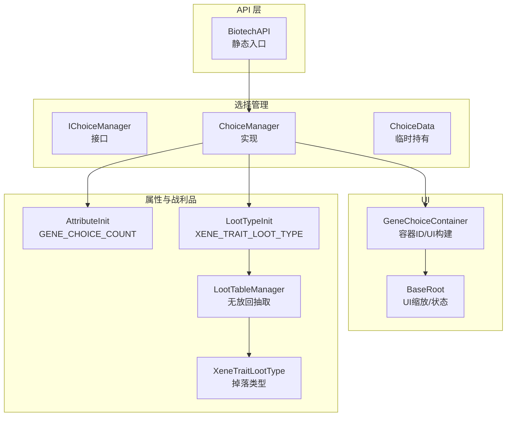
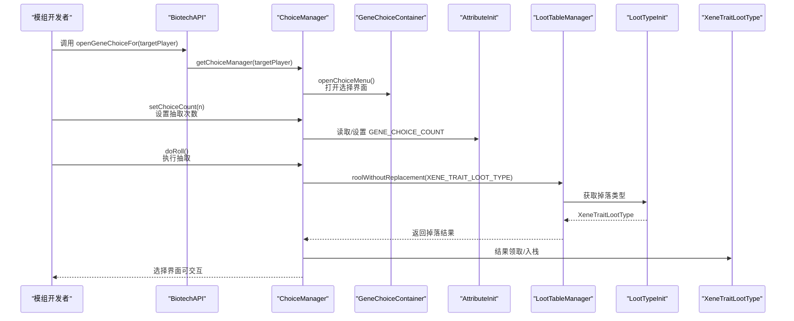
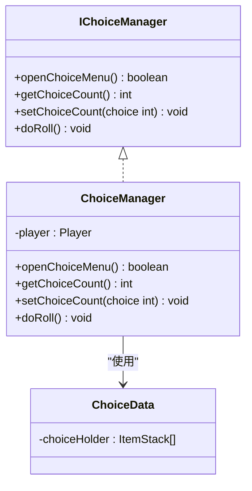
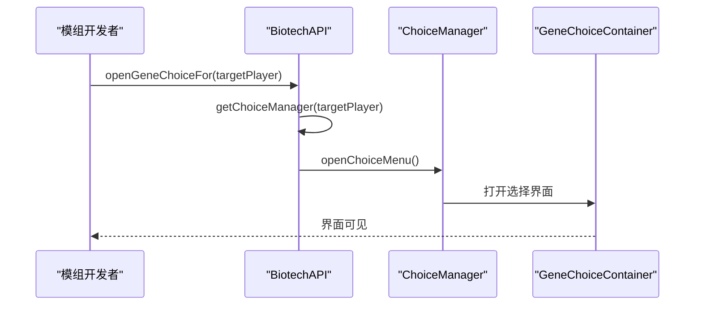
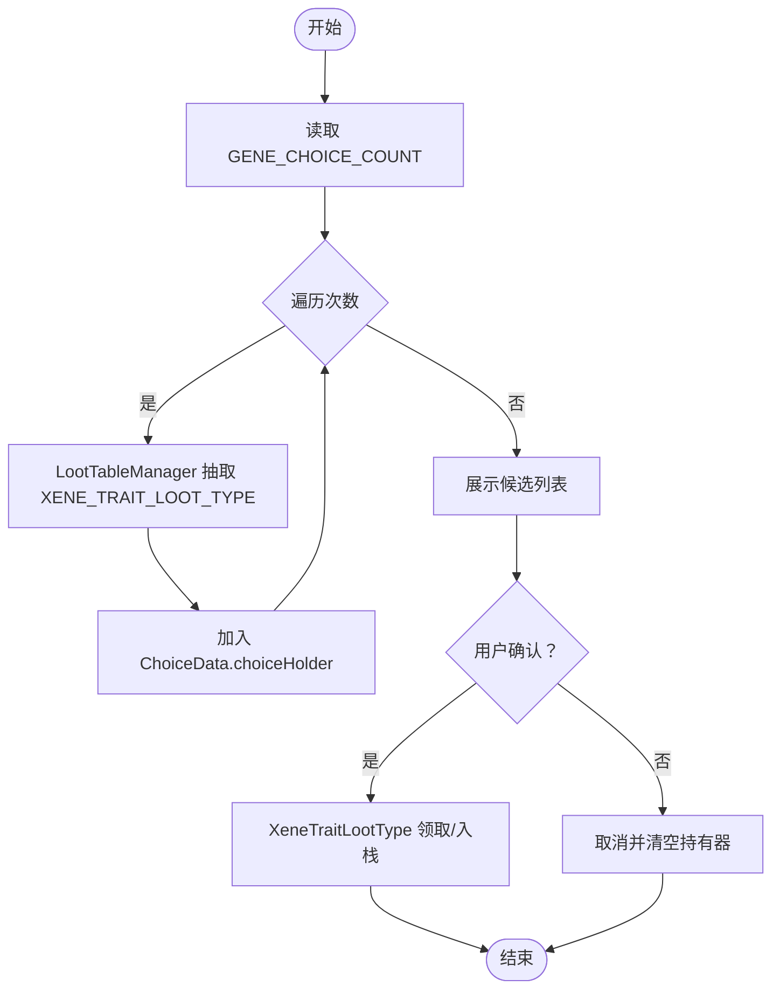
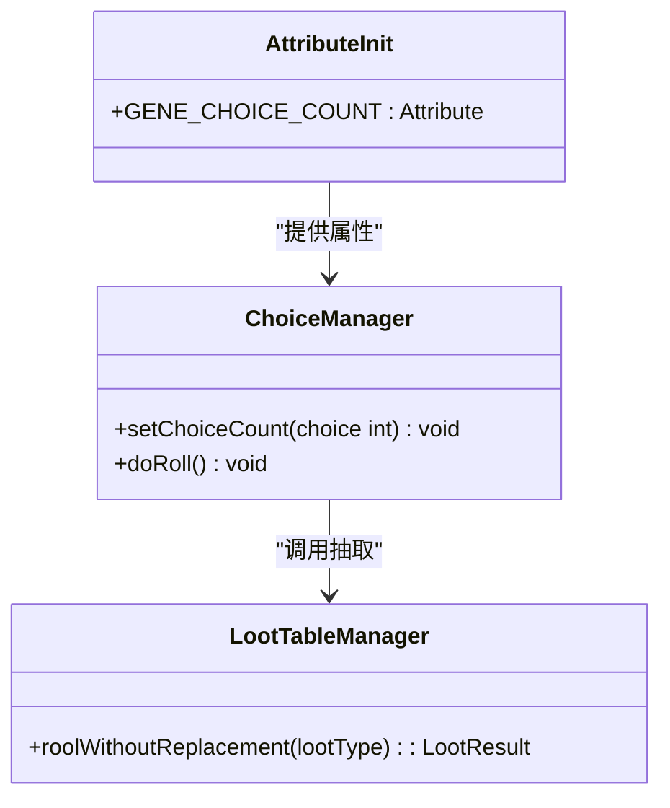
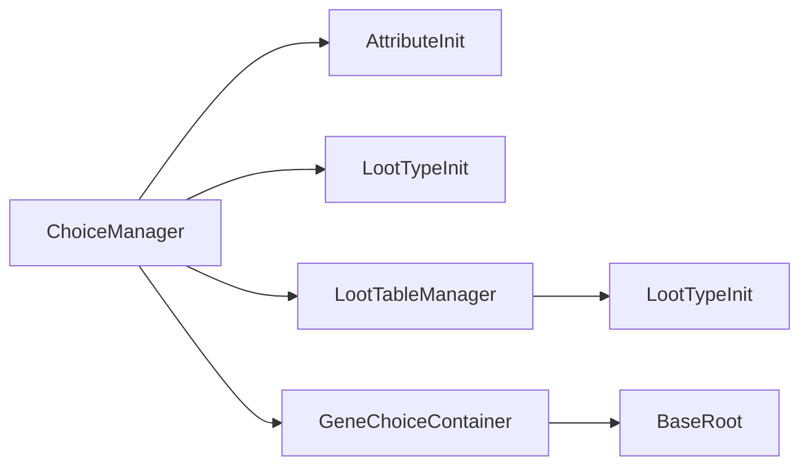

# 基因选择管理

<cite>
**本文引用的文件**
- [IChoiceManager.java](file://Biotech/src/main/java/org/biotech/api/system/choice/core/IChoiceManager.java)
- [ChoiceManager.java](file://Biotech/src/main/java/org/biotech/api/system/choice/ChoiceManager.java)
- [ChoiceData.java](file://Biotech/src/main/java/org/biotech/api/system/choice/ChoiceData.java)
- [BiotechAPI.java](file://Biotech/src/main/java/org/biotech/api/BiotechAPI.java)
- [AttributeInit.java](file://Biotech/src/main/java/org/biotech/api/init/AttributeInit.java)
- [LootTypeInit.java](file://Biotech/src/main/java/org/biotech/api/init/LootTypeInit.java)
- [GeneChoiceContainer.java](file://Biotech/src/main/java/org/biotech/container/GeneChoiceContainer.java)
- [LootTableManager.java](file://Biotech/src/main/java/org/biotech/api/system/loot/LootTableManager.java)
- [XeneTraitLootType.java](file://Biotech/src/main/java/org/biotech/loot/XeneTraitLootType.java)
- [BaseRoot.java](file://Biotech/src/main/java/org/biotech/ui/gene_inventroy/element/BaseRoot.java)
</cite>

## 目录
1. [简介](#简介)
2. [项目结构](#项目结构)
3. [核心组件](#核心组件)
4. [架构总览](#架构总览)
5. [详细组件分析](#详细组件分析)
6. [依赖分析](#依赖分析)
7. [性能考虑](#性能考虑)
8. [故障排查指南](#故障排查指南)
9. [结论](#结论)
10. [附录](#附录)

## 简介
本文件面向模组开发者，系统性阐述“基因选择管理”模块的设计与实现，重点覆盖以下内容：
- IChoiceManager 接口与 ChoiceManager 实现类的功能边界与职责
- 基因选择界面的打开流程、选择逻辑的处理、结果确认机制
- getChoiceManager 与 openGeneChoiceFor 方法的工作原理与使用场景
- UI 交互、数据验证与状态管理在该模块中的体现
- 基于仓库现有代码的完整使用示例路径，帮助开发者快速集成自定义的基因选择功能
- 高级能力：选择限制、优先级设置、批量选择的实现思路与扩展点

## 项目结构
基因选择管理位于 Biotech 模块下，采用分层与按功能域划分的组织方式：
- 接口与实现：system/choice 下定义了 IChoiceManager 接口与 ChoiceManager 实现
- 数据模型：system/choice 下的 ChoiceData 用于临时持有候选结果
- API 入口：api/BiotechAPI 提供 getChoiceManager 与 openGeneChoiceFor 等静态方法
- UI 容器：container/GeneChoiceContainer 定义了选择界面的容器标识与 UI 构建入口
- 属性与战利品：api/init 下的 AttributeInit 与 LootTypeInit 分别负责属性与战利品类型的注册
- 战利品抽取：api/system/loot/LootTableManager 提供无放回抽取能力；loot/XeneTraitLootType 定义具体掉落类型
- UI 基础元素：ui/gene_inventroy/element/BaseRoot 提供 UI 缩放与状态管理的基础能力

**图表来源**
- [BiotechAPI.java:58-70](file://Biotech/src/main/java/org/biotech/api/BiotechAPI.java#L58-L70)
- [IChoiceManager.java:5-21](file://Biotech/src/main/java/org/biotech/api/system/choice/core/IChoiceManager.java#L5-L21)
- [ChoiceManager.java:16-67](file://Biotech/src/main/java/org/biotech/api/system/choice/ChoiceManager.java#L16-L67)
- [ChoiceData.java:10-19](file://Biotech/src/main/java/org/biotech/api/system/choice/ChoiceData.java#L10-L19)
- [GeneChoiceContainer.java:10-25](file://Biotech/src/main/java/org/biotech/container/GeneChoiceContainer.java#L10-L25)
- [AttributeInit.java:73-75](file://Biotech/src/main/java/org/biotech/api/init/AttributeInit.java#L73-L75)
- [LootTypeInit.java:72](file://Biotech/src/main/java/org/biotech/api/init/LootTypeInit.java#L72)
- [LootTableManager.java:55-72](file://Biotech/src/main/java/org/biotech/api/system/loot/LootTableManager.java#L55-L72)
- [XeneTraitLootType.java:19-40](file://Biotech/src/main/java/org/biotech/loot/XeneTraitLootType.java#L19-L40)
- [BaseRoot.java:15-144](file://Biotech/src/main/java/org/biotech/ui/gene_inventroy/element/BaseRoot.java#L15-L144)

**章节来源**
- [BiotechAPI.java:1-92](file://Biotech/src/main/java/org/biotech/api/BiotechAPI.java#L1-L92)
- [IChoiceManager.java:1-22](file://Biotech/src/main/java/org/biotech/api/system/choice/core/IChoiceManager.java#L1-L22)
- [ChoiceManager.java:1-68](file://Biotech/src/main/java/org/biotech/api/system/choice/ChoiceManager.java#L1-L68)
- [ChoiceData.java:1-20](file://Biotech/src/main/java/org/biotech/api/system/choice/ChoiceData.java#L1-L20)
- [GeneChoiceContainer.java:1-26](file://Biotech/src/main/java/org/biotech/container/GeneChoiceContainer.java#L1-L26)
- [AttributeInit.java:1-77](file://Biotech/src/main/java/org/biotech/api/init/AttributeInit.java#L1-L77)
- [LootTypeInit.java:1-78](file://Biotech/src/main/java/org/biotech/api/init/LootTypeInit.java#L1-L78)
- [LootTableManager.java:1-72](file://Biotech/src/main/java/org/biotech/api/system/loot/LootTableManager.java#L1-L72)
- [XeneTraitLootType.java:1-40](file://Biotech/src/main/java/org/biotech/loot/XeneTraitLootType.java#L1-L40)
- [BaseRoot.java:1-144](file://Biotech/src/main/java/org/biotech/ui/gene_inventroy/element/BaseRoot.java#L1-L144)

## 核心组件
- IChoiceManager 接口：定义了打开选择界面、读取/设置选择次数、执行抽取的核心方法
- ChoiceManager 实现：封装了打开 UI、读写属性、调用战利品管理器进行抽取的业务逻辑
- ChoiceData：用于临时存放候选结果，便于 UI 展示与后续确认
- BiotechAPI：对外暴露 getChoiceManager 与 openGeneChoiceFor，作为模组集成入口
- AttributeInit：注册 GENE_CHOICE_COUNT 属性，决定每次抽取的次数
- LootTypeInit：注册 XENE_TRAIT_LOOT_TYPE 等掉落类型，驱动抽取结果
- GeneChoiceContainer：定义选择界面容器 ID，并提供 UI 构建入口
- LootTableManager：提供无放回抽取能力，支持权重与全局概率池
- XeneTraitLootType：定义“异种词条”的掉落与领取逻辑
- BaseRoot：提供 UI 缩放与状态管理，支撑选择界面的视觉一致性

**章节来源**
- [IChoiceManager.java:5-21](file://Biotech/src/main/java/org/biotech/api/system/choice/core/IChoiceManager.java#L5-L21)
- [ChoiceManager.java:16-67](file://Biotech/src/main/java/org/biotech/api/system/choice/ChoiceManager.java#L16-L67)
- [ChoiceData.java:10-19](file://Biotech/src/main/java/org/biotech/api/system/choice/ChoiceData.java#L10-L19)
- [BiotechAPI.java:58-70](file://Biotech/src/main/java/org/biotech/api/BiotechAPI.java#L58-L70)
- [AttributeInit.java:73-75](file://Biotech/src/main/java/org/biotech/api/init/AttributeInit.java#L73-L75)
- [LootTypeInit.java:72](file://Biotech/src/main/java/org/biotech/api/init/LootTypeInit.java#L72)
- [GeneChoiceContainer.java:10-25](file://Biotech/src/main/java/org/biotech/container/GeneChoiceContainer.java#L10-L25)
- [LootTableManager.java:55-72](file://Biotech/src/main/java/org/biotech/api/system/loot/LootTableManager.java#L55-L72)
- [XeneTraitLootType.java:19-40](file://Biotech/src/main/java/org/biotech/loot/XeneTraitLootType.java#L19-L40)
- [BaseRoot.java:15-144](file://Biotech/src/main/java/org/biotech/ui/gene_inventroy/element/BaseRoot.java#L15-L144)

## 架构总览
下图展示了从 API 入口到 UI、属性与战利品系统的调用链路与职责分工。

**图表来源**
- [BiotechAPI.java:58-70](file://Biotech/src/main/java/org/biotech/api/BiotechAPI.java#L58-L70)
- [ChoiceManager.java:25-64](file://Biotech/src/main/java/org/biotech/api/system/choice/ChoiceManager.java#L25-L64)
- [GeneChoiceContainer.java:12-25](file://Biotech/src/main/java/org/biotech/container/GeneChoiceContainer.java#L12-L25)
- [AttributeInit.java:73-75](file://Biotech/src/main/java/org/biotech/api/init/AttributeInit.java#L73-L75)
- [LootTypeInit.java:72](file://Biotech/src/main/java/org/biotech/api/init/LootTypeInit.java#L72)
- [LootTableManager.java:55-72](file://Biotech/src/main/java/org/biotech/api/system/loot/LootTableManager.java#L55-L72)
- [XeneTraitLootType.java:37-40](file://Biotech/src/main/java/org/biotech/loot/XeneTraitLootType.java#L37-L40)

## 详细组件分析

### IChoiceManager 接口与 ChoiceManager 实现
- IChoiceManager 定义了四个核心方法：
  - openChoiceMenu：打开基因选择界面
  - getChoiceCount/setChoiceCount：读取与设置抽取次数
  - doRoll：执行抽取逻辑
- ChoiceManager 的职责：
  - openChoiceMenu：仅在服务端玩家上调用 UI 打开，返回布尔结果
  - getChoiceCount/setChoiceCount：通过 AttributeInit.GENE_CHOICE_COUNT 属性读写
  - doRoll：调用 BiotechAPI 获取战利品管理器，按选择次数循环抽取 XENE_TRAIT_LOOT_TYPE，并将结果暂存至选择持有器（当前实现留白，后续可接入 UI 与确认流程）

**图表来源**
- [IChoiceManager.java:5-21](file://Biotech/src/main/java/org/biotech/api/system/choice/core/IChoiceManager.java#L5-L21)
- [ChoiceManager.java:16-67](file://Biotech/src/main/java/org/biotech/api/system/choice/ChoiceManager.java#L16-L67)
- [ChoiceData.java:10-19](file://Biotech/src/main/java/org/biotech/api/system/choice/ChoiceData.java#L10-L19)

**章节来源**
- [IChoiceManager.java:5-21](file://Biotech/src/main/java/org/biotech/api/system/choice/core/IChoiceManager.java#L5-L21)
- [ChoiceManager.java:16-67](file://Biotech/src/main/java/org/biotech/api/system/choice/ChoiceManager.java#L16-L67)
- [ChoiceData.java:10-19](file://Biotech/src/main/java/org/biotech/api/system/choice/ChoiceData.java#L10-L19)

### getChoiceManager 与 openGeneChoiceFor
- getChoiceManager(Player player)：返回 ChoiceManager 实例，供开发者直接调用其方法
- openGeneChoiceFor(ServerPlayer targetPlayer)：通过 API 统一打开目标玩家的选择界面，内部委托给 ChoiceManager.openChoiceMenu

**图表来源**
- [BiotechAPI.java:58-70](file://Biotech/src/main/java/org/biotech/api/BiotechAPI.java#L58-L70)
- [ChoiceManager.java:25-31](file://Biotech/src/main/java/org/biotech/api/system/choice/ChoiceManager.java#L25-L31)
- [GeneChoiceContainer.java:12-25](file://Biotech/src/main/java/org/biotech/container/GeneChoiceContainer.java#L12-L25)

**章节来源**
- [BiotechAPI.java:58-70](file://Biotech/src/main/java/org/biotech/api/BiotechAPI.java#L58-L70)

### 抽取流程与 UI 交互
- 抽取流程：
  - 读取 GENE_CHOICE_COUNT 属性确定抽取次数
  - 通过 LootTableManager 对 XENE_TRAIT_LOOT_TYPE 进行无放回抽取
  - 将结果暂存至选择持有器，等待 UI 展示与确认
- UI 交互：
  - 选择界面由 GeneChoiceContainer 定义容器 ID 并构建 UI
  - BaseRoot 提供 UI 缩放与状态管理，确保界面适配不同分辨率
- 状态管理：
  - 通过属性与持有器实现“未确认”状态，确认后由领取逻辑完成最终落盘

**图表来源**
- [ChoiceManager.java:34-64](file://Biotech/src/main/java/org/biotech/api/system/choice/ChoiceManager.java#L34-L64)
- [LootTableManager.java:55-72](file://Biotech/src/main/java/org/biotech/api/system/loot/LootTableManager.java#L55-L72)
- [XeneTraitLootType.java:37-40](file://Biotech/src/main/java/org/biotech/loot/XeneTraitLootType.java#L37-L40)
- [ChoiceData.java:10-19](file://Biotech/src/main/java/org/biotech/api/system/choice/ChoiceData.java#L10-L19)
- [BaseRoot.java:15-144](file://Biotech/src/main/java/org/biotech/ui/gene_inventroy/element/BaseRoot.java#L15-L144)

**章节来源**
- [ChoiceManager.java:34-64](file://Biotech/src/main/java/org/biotech/api/system/choice/ChoiceManager.java#L34-L64)
- [LootTableManager.java:55-72](file://Biotech/src/main/java/org/biotech/api/system/loot/LootTableManager.java#L55-L72)
- [XeneTraitLootType.java:37-40](file://Biotech/src/main/java/org/biotech/loot/XeneTraitLootType.java#L37-L40)
- [ChoiceData.java:10-19](file://Biotech/src/main/java/org/biotech/api/system/choice/ChoiceData.java#L10-L19)
- [BaseRoot.java:15-144](file://Biotech/src/main/java/org/biotech/ui/gene_inventroy/element/BaseRoot.java#L15-L144)

### 高级功能：选择限制、优先级与批量
- 选择限制（单次抽取上限）：通过 AttributeInit.GENE_CHOICE_COUNT 的属性范围限制（最小值、最大值）实现
- 优先级设置：可通过修改掉落权重或全局概率池（LootTableManager 内部的 globeChance）实现
- 批量选择：通过 setChoiceCount(n) 设置抽取次数，doRoll() 将按次数循环抽取并暂存至持有器，随后由 UI 与领取逻辑完成批量确认

**图表来源**
- [AttributeInit.java:73-75](file://Biotech/src/main/java/org/biotech/api/init/AttributeInit.java#L73-L75)
- [LootTableManager.java:55-72](file://Biotech/src/main/java/org/biotech/api/system/loot/LootTableManager.java#L55-L72)
- [ChoiceManager.java:40-64](file://Biotech/src/main/java/org/biotech/api/system/choice/ChoiceManager.java#L40-L64)

**章节来源**
- [AttributeInit.java:73-75](file://Biotech/src/main/java/org/biotech/api/init/AttributeInit.java#L73-L75)
- [LootTableManager.java:55-72](file://Biotech/src/main/java/org/biotech/api/system/loot/LootTableManager.java#L55-L72)
- [ChoiceManager.java:40-64](file://Biotech/src/main/java/org/biotech/api/system/choice/ChoiceManager.java#L40-L64)

## 依赖分析
- 组件耦合与内聚：
  - ChoiceManager 与 AttributeInit、LootTypeInit、LootTableManager 存在直接依赖，耦合度中等
  - UI 与业务逻辑通过容器 ID 解耦，便于扩展
- 外部依赖：
  - 低拖 lib2 GUI 库用于 UI 构建
  - Curios API 用于装备槽位管理（与选择界面无直接耦合）
- 潜在环形依赖：
  - 当前模块未见明显环形依赖

**图表来源**
- [ChoiceManager.java:16-67](file://Biotech/src/main/java/org/biotech/api/system/choice/ChoiceManager.java#L16-L67)
- [AttributeInit.java:73-75](file://Biotech/src/main/java/org/biotech/api/init/AttributeInit.java#L73-L75)
- [LootTypeInit.java:72](file://Biotech/src/main/java/org/biotech/api/init/LootTypeInit.java#L72)
- [LootTableManager.java:55-72](file://Biotech/src/main/java/org/biotech/api/system/loot/LootTableManager.java#L55-L72)
- [GeneChoiceContainer.java:12-25](file://Biotech/src/main/java/org/biotech/container/GeneChoiceContainer.java#L12-L25)
- [BaseRoot.java:15-144](file://Biotech/src/main/java/org/biotech/ui/gene_inventroy/element/BaseRoot.java#L15-L144)

**章节来源**
- [ChoiceManager.java:16-67](file://Biotech/src/main/java/org/biotech/api/system/choice/ChoiceManager.java#L16-L67)
- [AttributeInit.java:73-75](file://Biotech/src/main/java/org/biotech/api/init/AttributeInit.java#L73-L75)
- [LootTypeInit.java:72](file://Biotech/src/main/java/org/biotech/api/init/LootTypeInit.java#L72)
- [LootTableManager.java:55-72](file://Biotech/src/main/java/org/biotech/api/system/loot/LootTableManager.java#L55-L72)
- [GeneChoiceContainer.java:12-25](file://Biotech/src/main/java/org/biotech/container/GeneChoiceContainer.java#L12-L25)
- [BaseRoot.java:15-144](file://Biotech/src/main/java/org/biotech/ui/gene_inventroy/element/BaseRoot.java#L15-L144)

## 性能考虑
- 抽取次数与 UI 渲染：批量抽取与 UI 展示应避免主线程阻塞，建议在服务端完成抽取，客户端仅负责渲染
- 权重计算：LootTableManager 的加权随机选择在大池时可能成为热点，建议缓存概率池或采用分段查找优化
- 属性访问：频繁读写属性需注意同步与网络广播成本，必要时合并更新批次

## 故障排查指南
- 打不开选择界面：
  - 确认调用者为服务端玩家，openChoiceMenu 仅在服务端生效
  - 检查容器 ID 是否正确注册
- 抽取次数无效：
  - 检查 GENE_CHOICE_COUNT 属性是否成功附加到玩家
  - 确认 setChoiceCount 后属性值已更新
- 抽取结果为空：
  - 检查掉落类型是否正确注册
  - 确认掉落表是否已初始化并包含有效条目
- UI 显示异常：
  - 检查 BaseRoot 的缩放逻辑与父容器尺寸变化事件

**章节来源**
- [ChoiceManager.java:25-31](file://Biotech/src/main/java/org/biotech/api/system/choice/ChoiceManager.java#L25-L31)
- [AttributeInit.java:34-40](file://Biotech/src/main/java/org/biotech/api/init/AttributeInit.java#L34-L40)
- [LootTableManager.java:35-41](file://Biotech/src/main/java/org/biotech/api/system/loot/LootTableManager.java#L35-L41)
- [BaseRoot.java:27-103](file://Biotech/src/main/java/org/biotech/ui/gene_inventroy/element/BaseRoot.java#L27-L103)

## 结论
基因选择管理模块以清晰的分层设计实现了“配置—抽取—展示—确认”的闭环流程。通过属性驱动的抽取次数、可扩展的掉落类型与 UI 容器，开发者可以快速集成并定制化自己的基因选择体验。建议在实际模组中结合掉落权重与 UI 动画，进一步提升交互体验与性能表现。

## 附录
- 使用示例（路径参考）：
  - 打开目标玩家的选择界面：[BiotechAPI.java:62-70](file://Biotech/src/main/java/org/biotech/api/BiotechAPI.java#L62-L70)
  - 获取选择管理器并设置抽取次数：[BiotechAPI.java:58](file://Biotech/src/main/java/org/biotech/api/BiotechAPI.java#L58)，[ChoiceManager.java:40-45](file://Biotech/src/main/java/org/biotech/api/system/choice/ChoiceManager.java#L40-L45)
  - 执行抽取并将结果暂存：[ChoiceManager.java:47-64](file://Biotech/src/main/java/org/biotech/api/system/choice/ChoiceManager.java#L47-L64)
  - 无放回抽取与权重选择：[LootTableManager.java:55-72](file://Biotech/src/main/java/org/biotech/api/system/loot/LootTableManager.java#L55-L72)
  - 异种词条掉落与领取：[XeneTraitLootType.java:37-40](file://Biotech/src/main/java/org/biotech/loot/XeneTraitLootType.java#L37-L40)
  - 选择界面容器与 UI 基础元素：[GeneChoiceContainer.java:12-25](file://Biotech/src/main/java/org/biotech/container/GeneChoiceContainer.java#L12-L25)，[BaseRoot.java:15-144](file://Biotech/src/main/java/org/biotech/ui/gene_inventroy/element/BaseRoot.java#L15-L144)