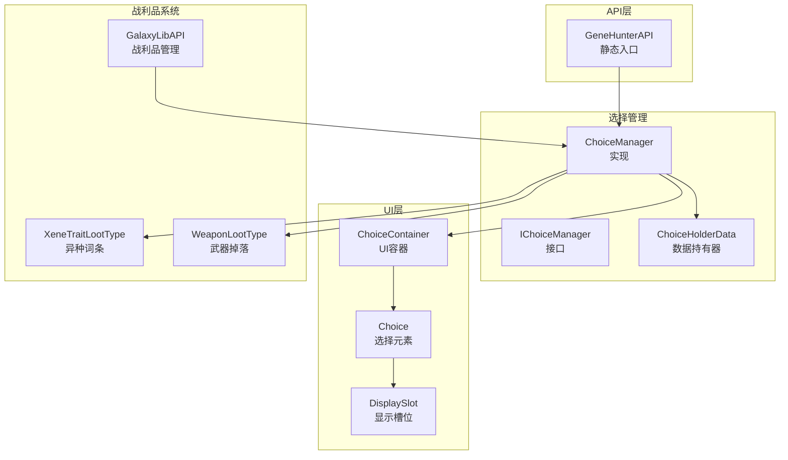
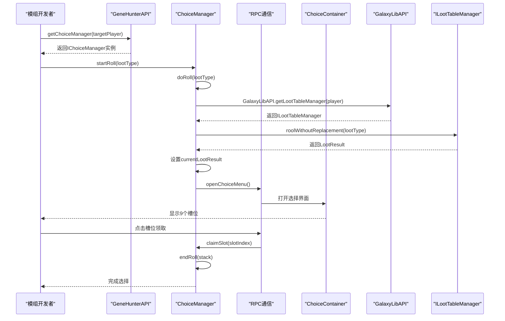
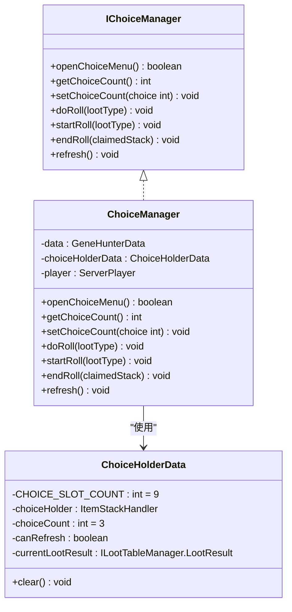
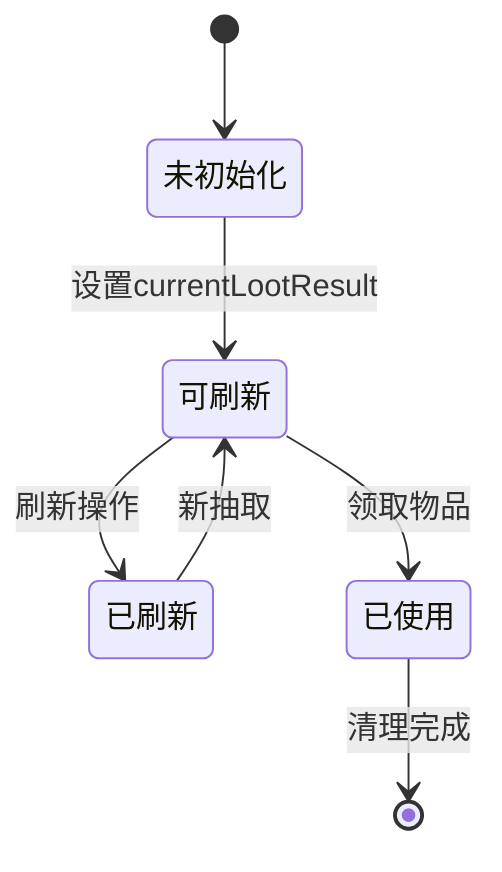
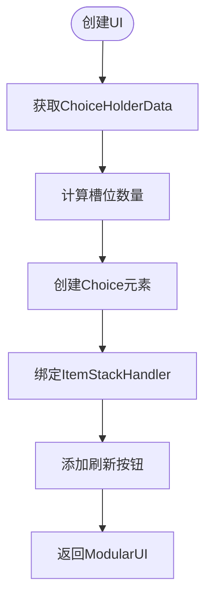
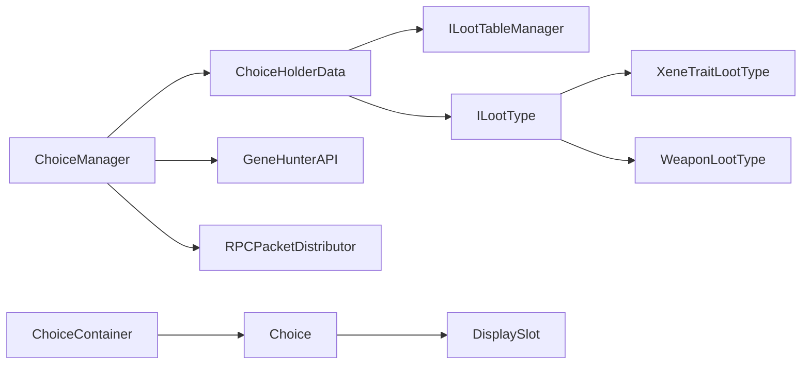

# 基因选择管理

<cite>
**本文档引用的文件**
- [IChoiceManager.java](file://GeneHunter/src/main/java/org/galaxy/gene_hunter/api/system/choice/core/IChoiceManager.java)
- [ChoiceManager.java](file://GeneHunter/src/main/java/org/galaxy/gene_hunter/api/system/choice/ChoiceManager.java)
- [ChoiceHolderData.java](file://GeneHunter/src/main/java/org/galaxy/gene_hunter/api/system/choice/ChoiceHolderData.java)
- [ChoiceContainer.java](file://GeneHunter/src/main/java/org/galaxy/gene_hunter/container/ChoiceContainer.java)
- [Choice.java](file://GeneHunter/src/main/java/org/galaxy/gene_hunter/ui/element/Choice.java)
- [DisplaySlot.java](file://GeneHunter/src/main/java/org/galaxy/gene_hunter/ui/element/DisplaySlot.java)
- [GeneHunterAPI.java](file://GeneHunter/src/main/java/org/galaxy/gene_hunter/api/GeneHunterAPI.java)
- [XeneTraitLootType.java](file://Biotech/src/main/java/org/biotech/loot/XeneTraitLootType.java)
- [WeaponLootType.java](file://GeneHunter/src/main/java/org/galaxy/gene_hunter/loot/WeaponLootType.java)
- [GalaxyLibAPI.java](file://GalaxyLib/src/main/java/org/galaxylib/api/GalaxyLibAPI.java)
- [ILootTableManager.java](file://GalaxyLib/src/main/java/org/galaxylib/api/system/loot/core/ILootTableManager.java)
- [ILootType.java](file://GalaxyLib/src/main/java/org/galaxylib/api/system/loot/core/ILootType.java)
</cite>

## 更新摘要
**所做更改**
- 完全重写基因选择管理文档，反映GeneHunter模块的新实现
- 移除Biotech模块中过时的ChoiceManager和相关组件
- 新增GeneHunter模块的完整架构和实现细节
- 更新接口设计、RPC通信机制和UI交互流程
- 添加新的战利品类型支持（武器、局外基因等）

## 目录
1. [简介](#简介)
2. [项目结构](#项目结构)
3. [核心组件](#核心组件)
4. [架构总览](#架构总览)
5. [详细组件分析](#详细组件分析)
6. [依赖分析](#依赖分析)
7. [性能考虑](#性能考虑)
8. [故障排查指南](#故障排查指南)
9. [结论](#结论)
10. [附录](#附录)

## 简介
本文件面向模组开发者，系统性阐述"基因选择管理"模块在GeneHunter模块中的全新设计与实现。该模块已完全重构，采用现代化的架构设计，提供更强大的功能和更好的集成体验：

- IChoiceManager接口与ChoiceManager实现类的功能边界与职责
- 基因选择界面的RPC驱动打开流程、选择逻辑的处理、结果确认机制
- 增强的战利品系统支持（武器、局外基因、异种词条等）
- 基于LowDragLib2的现代UI框架和RPC通信机制
- 完整的客户端-服务端同步和状态管理
- 基于仓库现有代码的完整使用示例路径

## 项目结构
基因选择管理位于GeneHunter模块下，采用全新的分层架构设计：

- **接口与实现**：system/choice/core下定义了IChoiceManager接口，system/choice下为ChoiceManager实现
- **数据模型**：system/choice下的ChoiceHolderData用于管理选择槽位和状态
- **UI组件**：ui/element下包含Choice和DisplaySlot等现代UI元素
- **容器管理**：container/ChoiceContainer提供基于LowDragLib2的UI构建
- **API入口**：GeneHunterAPI提供getChoiceManager和getGeneHunterData等静态方法
- **战利品系统**：支持多种战利品类型（XeneTraitLootType、WeaponLootType等）
- **RPC通信**：基于LowDragLib2的RPC机制实现客户端-服务端通信



**图表来源**
- [GeneHunterAPI.java:13-19](file://GeneHunter/src/main/java/org/galaxy/gene_hunter/api/GeneHunterAPI.java#L13-L19)
- [IChoiceManager.java:7-47](file://GeneHunter/src/main/java/org/galaxy/gene_hunter/api/system/choice/core/IChoiceManager.java#L7-L47)
- [ChoiceManager.java:23-191](file://GeneHunter/src/main/java/org/galaxy/gene_hunter/api/system/choice/ChoiceManager.java#L23-L191)
- [ChoiceHolderData.java:31-114](file://GeneHunter/src/main/java/org/galaxy/gene_hunter/api/system/choice/ChoiceHolderData.java#L31-L114)
- [ChoiceContainer.java:22-65](file://GeneHunter/src/main/java/org/galaxy/gene_hunter/container/ChoiceContainer.java#L22-L65)
- [Choice.java:15-74](file://GeneHunter/src/main/java/org/galaxy/gene_hunter/ui/element/Choice.java#L15-L74)
- [DisplaySlot.java:11-56](file://GeneHunter/src/main/java/org/galaxy/gene_hunter/ui/element/DisplaySlot.java#L11-L56)

## 核心组件
- **IChoiceManager接口**：定义了完整的基因选择管理接口，包括打开界面、设置选择次数、执行抽取、开始/结束抽取和刷新等方法
- **ChoiceManager实现**：封装了完整的抽取逻辑，支持RPC通信、状态管理和UI交互
- **ChoiceHolderData**：基于LowDragLib2的持久化数据持有器，管理9个槽位的选择结果和状态
- **ChoiceContainer**：基于LowDragLib2的UI容器，动态创建选择界面
- **Choice UI元素**：包含物品显示区域和描述标签的现代化UI组件
- **DisplaySlot**：可缩放的物品槽位，支持RPC领取机制
- **战利品类型**：支持XeneTraitLootType（异种词条）和WeaponLootType（武器）等多种掉落类型
- **RPC通信**：基于LowDragLib2的RPC包实现客户端-服务端同步

**章节来源**
- [IChoiceManager.java:7-47](file://GeneHunter/src/main/java/org/galaxy/gene_hunter/api/system/choice/core/IChoiceManager.java#L7-L47)
- [ChoiceManager.java:23-191](file://GeneHunter/src/main/java/org/galaxy/gene_hunter/api/system/choice/ChoiceManager.java#L23-L191)
- [ChoiceHolderData.java:31-114](file://GeneHunter/src/main/java/org/galaxy/gene_hunter/api/system/choice/ChoiceHolderData.java#L31-L114)
- [ChoiceContainer.java:22-65](file://GeneHunter/src/main/java/org/galaxy/gene_hunter/container/ChoiceContainer.java#L22-L65)
- [Choice.java:15-74](file://GeneHunter/src/main/java/org/galaxy/gene_hunter/ui/element/Choice.java#L15-L74)
- [DisplaySlot.java:11-56](file://GeneHunter/src/main/java/org/galaxy/gene_hunter/ui/element/DisplaySlot.java#L11-L56)

## 架构总览
下图展示了GeneHunter模块中新基因选择管理系统的完整架构和调用流程：



**图表来源**
- [GeneHunterAPI.java:13-19](file://GeneHunter/src/main/java/org/galaxy/gene_hunter/api/GeneHunterAPI.java#L13-L19)
- [ChoiceManager.java:108-129](file://GeneHunter/src/main/java/org/galaxy/gene_hunter/api/system/choice/ChoiceManager.java#L108-L129)
- [ChoiceManager.java:161-189](file://GeneHunter/src/main/java/org/galaxy/gene_hunter/api/system/choice/ChoiceManager.java#L161-L189)
- [ChoiceContainer.java:28-65](file://GeneHunter/src/main/java/org/galaxy/gene_hunter/container/ChoiceContainer.java#L28-L65)

## 详细组件分析

### IChoiceManager接口与ChoiceManager实现

**更新** 完全重构的接口设计，新增RPC支持和增强的状态管理

IChoiceManager接口定义了完整的基因选择管理功能：
- `openChoiceMenu()`：打开基因选择界面
- `getChoiceCount()/setChoiceCount(int)`：读取与设置选择次数
- `doRoll(ILootType)`：执行抽取并填充槽位
- `startRoll(ILootType)`：启动抽取流程（包含UI打开）
- `endRoll(ItemStack)`：结束抽取并清理状态
- `refresh()`：刷新当前抽取结果

ChoiceManager实现类提供了完整的业务逻辑：
- 基于LowDragLib2的RPC通信机制
- 支持多种战利品类型的抽取（异种词条、武器等）
- 完整的状态管理（canRefresh标志、currentLootResult）
- 音效播放和系统消息通知
- 自动清理和UI关闭机制



**图表来源**
- [IChoiceManager.java:7-47](file://GeneHunter/src/main/java/org/galaxy/gene_hunter/api/system/choice/core/IChoiceManager.java#L7-L47)
- [ChoiceManager.java:23-191](file://GeneHunter/src/main/java/org/galaxy/gene_hunter/api/system/choice/ChoiceManager.java#L23-L191)
- [ChoiceHolderData.java:31-114](file://GeneHunter/src/main/java/org/galaxy/gene_hunter/api/system/choice/ChoiceHolderData.java#L31-L114)

**章节来源**
- [IChoiceManager.java:7-47](file://GeneHunter/src/main/java/org/galaxy/gene_hunter/api/system/choice/core/IChoiceManager.java#L7-L47)
- [ChoiceManager.java:23-191](file://GeneHunter/src/main/java/org/galaxy/gene_hunter/api/system/choice/ChoiceManager.java#L23-L191)
- [ChoiceHolderData.java:31-114](file://GeneHunter/src/main/java/org/galaxy/gene_hunter/api/system/choice/ChoiceHolderData.java#L31-L114)

### ChoiceHolderData数据管理

**更新** 基于LowDragLib2的现代化数据持久化和同步机制

ChoiceHolderData是新的数据管理核心，具有以下特性：
- **固定槽位数量**：9个选择槽位，支持异种词条和武器等不同类型
- **默认选择次数**：初始为3次抽取
- **状态控制**：canRefresh标志控制刷新权限
- **持久化支持**：实现IPersistedSerializable接口，支持NBT序列化
- **RPC同步**：使用@DescSynced注解实现客户端-服务端数据同步
- **透明字段**：currentLootResult为transient，避免不必要的网络传输



**章节来源**
- [ChoiceHolderData.java:31-114](file://GeneHunter/src/main/java/org/galaxy/gene_hunter/api/system/choice/ChoiceHolderData.java#L31-L114)

### ChoiceContainer UI构建

**更新** 基于LowDragLib2的现代化UI框架

ChoiceContainer提供了灵活的UI构建机制：
- **动态槽位生成**：根据choiceCount和槽位数量自动调整
- **Flex布局**：使用ROW方向的Flexbox布局实现响应式设计
- **RPC按钮**：内置刷新按钮，支持RPC通信
- **ModularUI集成**：基于LowDragLib2的ModularUI框架
- **事件绑定**：自动绑定槽位事件和UI元素



**图表来源**
- [ChoiceContainer.java:28-65](file://GeneHunter/src/main/java/org/galaxy/gene_hunter/container/ChoiceContainer.java#L28-L65)

**章节来源**
- [ChoiceContainer.java:22-65](file://GeneHunter/src/main/java/org/galaxy/gene_hunter/container/ChoiceContainer.java#L22-L65)

### Choice UI元素设计

**更新** 现代化的UI组件设计，支持缩放和事件处理

Choice元素包含两个主要部分：
- **物品显示区域**：使用BaseRoot实现缩放适配，支持异种词条显示
- **描述标签区域**：显示物品描述信息
- **事件处理**：继承自UIElement，支持完整的UI事件系统
- **纹理支持**：使用BiotechTexture的Button_Slice纹理

DisplaySlot提供了专门的槽位实现：
- **可缩放设计**：scale方法支持动态缩放
- **RPC领取**：鼠标点击事件触发RPC包发送
- **事件拦截**：阻止事件冒泡，实现自定义处理逻辑

**章节来源**
- [Choice.java:15-74](file://GeneHunter/src/main/java/org/galaxy/gene_hunter/ui/element/Choice.java#L15-L74)
- [DisplaySlot.java:11-56](file://GeneHunter/src/main/java/org/galaxy/gene_hunter/ui/element/DisplaySlot.java#L11-L56)

### RPC通信机制

**更新** 基于LowDragLib2的RPC包实现客户端-服务端通信

新的RPC机制提供了完整的客户端-服务端同步：
- **open_choice_menu**：客户端请求打开选择界面
- **refresh_choice**：客户端请求刷新当前抽取结果
- **claim_slot**：客户端请求领取指定槽位的物品
- **RPCPacket注解**：@RPCPacket实现RPC方法声明
- **RPCPacketDistributor**：统一的RPC包分发器

RPC通信流程：
1. 客户端UI事件触发RPC包
2. 服务端接收RPC包并执行对应方法
3. 服务端更新状态并同步到客户端
4. 客户端UI自动刷新显示

**章节来源**
- [ChoiceManager.java:47-55](file://GeneHunter/src/main/java/org/galaxy/gene_hunter/api/system/choice/ChoiceManager.java#L47-L55)
- [ChoiceManager.java:148-159](file://GeneHunter/src/main/java/org/galaxy/gene_hunter/api/system/choice/ChoiceManager.java#L148-L159)
- [ChoiceManager.java:161-189](file://GeneHunter/src/main/java/org/galaxy/gene_hunter/api/system/choice/ChoiceManager.java#L161-L189)

### 战利品系统集成

**更新** 增强的战利品系统支持多种掉落类型

新的战利品系统支持：
- **XeneTraitLootType**：异种词条抽取，使用特殊的多词条抽取方式
- **WeaponLootType**：武器掉落，支持从掉落池中获取具体物品
- **GalaxyLib集成**：基于GalaxyLib的ILootTableManager和ILootType接口
- **类型检测**：运行时类型检测，支持不同战利品类型的差异化处理

抽取流程差异：
- **异种词条**：使用rollWithTrait方法，直接创建物品堆栈
- **武器**：通过LootPoolData.Entry获取具体物品ID和数量

**章节来源**
- [ChoiceManager.java:69-93](file://GeneHunter/src/main/java/org/galaxy/gene_hunter/api/system/choice/ChoiceManager.java#L69-L93)
- [ChoiceManager.java:101-106](file://GeneHunter/src/main/java/org/galaxy/gene_hunter/api/system/choice/ChoiceManager.java#L101-L106)

## 依赖分析

**更新** 完全重构的依赖关系，移除对Biotech的直接依赖

新的依赖关系：
- **GeneHunter模块内部**：各组件间松耦合设计
- **LowDragLib2**：UI框架和RPC通信的核心依赖
- **GalaxyLib**：战利品管理系统的外部依赖
- **Biotech**：仅通过XeneTraitLootType间接使用

组件耦合度分析：
- **低耦合**：各模块职责明确，接口隔离良好
- **RPC解耦**：客户端-服务端通过RPC包解耦
- **接口依赖**：通过ILootType等接口实现松耦合



**图表来源**
- [ChoiceManager.java:12-22](file://GeneHunter/src/main/java/org/galaxy/gene_hunter/api/system/choice/ChoiceManager.java#L12-L22)
- [ChoiceHolderData.java:21-28](file://GeneHunter/src/main/java/org/galaxy/gene_hunter/api/system/choice/ChoiceHolderData.java#L21-L28)
- [ChoiceContainer.java:19-20](file://GeneHunter/src/main/java/org/galaxy/gene_hunter/container/ChoiceContainer.java#L19-L20)

**章节来源**
- [ChoiceManager.java:12-22](file://GeneHunter/src/main/java/org/galaxy/gene_hunter/api/system/choice/ChoiceManager.java#L12-L22)
- [ChoiceHolderData.java:21-28](file://GeneHunter/src/main/java/org/galaxy/gene_hunter/api/system/choice/ChoiceHolderData.java#L21-L28)
- [ChoiceContainer.java:19-20](file://GeneHunter/src/main/java/org/galaxy/gene_hunter/container/ChoiceContainer.java#L19-L20)

## 性能考虑

**更新** 基于RPC和异步处理的性能优化

新的性能优化策略：
- **RPC异步处理**：客户端请求通过RPC包异步处理，避免主线程阻塞
- **批量槽位处理**：一次性创建和绑定多个槽位，减少UI重建开销
- **状态缓存**：currentLootResult缓存避免重复抽取
- **条件刷新**：canRefresh标志控制刷新权限，防止无效操作
- **序列化优化**：transient字段避免不必要的网络传输

内存管理：
- **槽位复用**：固定9个槽位，避免动态分配开销
- **对象池**：RPC包和UI元素使用LowDragLib2的对象池机制
- **及时清理**：endRoll方法确保资源及时释放

## 故障排查指南

**更新** 针对新架构的故障排查指南

常见问题及解决方案：
- **UI无法打开**：
  - 检查RPC包名称是否正确："gene_hunter:open_choice_menu"
  - 确认PlayerUIMenuType.openUI调用成功
  - 验证服务端玩家身份

- **抽取结果为空**：
  - 检查GalaxyLibAPI.getLootTableManager返回值
  - 确认ILootType类型匹配
  - 验证掉落池是否包含有效条目

- **RPC通信失败**：
  - 检查@RPCPacket注解是否正确声明
  - 确认RPCPacketDistributor.rpcToServer调用
  - 验证客户端-服务端版本兼容性

- **槽位显示异常**：
  - 检查DisplaySlot.scale方法调用
  - 确认BaseRoot缩放逻辑
  - 验证ItemStackHandler绑定

**章节来源**
- [ChoiceManager.java:37-42](file://GeneHunter/src/main/java/org/galaxy/gene_hunter/api/system/choice/ChoiceManager.java#L37-L42)
- [ChoiceManager.java:161-189](file://GeneHunter/src/main/java/org/galaxy/gene_hunter/api/system/choice/ChoiceManager.java#L161-L189)
- [DisplaySlot.java:30-37](file://GeneHunter/src/main/java/org/galaxy/gene_hunter/ui/element/DisplaySlot.java#L30-L37)

## 结论

GeneHunter模块的基因选择管理系统代表了模组开发的新标准。通过完全重构的架构设计，实现了以下优势：

**技术优势**：
- **现代化UI框架**：基于LowDragLib2的响应式UI设计
- **RPC通信机制**：实现可靠的客户端-服务端同步
- **类型安全**：通过ILootType接口实现编译时类型检查
- **状态管理**：完善的canRefresh和currentLootResult状态控制

**开发体验**：
- **简单易用**：通过GeneHunterAPI提供简洁的静态方法
- **扩展性强**：支持自定义战利品类型和UI元素
- **性能优异**：RPC异步处理和缓存机制优化性能
- **维护友好**：清晰的接口分离和模块化设计

建议开发者在新项目中直接使用GeneHunter模块的基因选择管理功能，充分利用其现代化特性和强大的扩展能力。

## 附录

**更新** 基于新架构的使用示例

**基础使用示例**：
```java
// 获取选择管理器
IChoiceManager choiceManager = GeneHunterAPI.getChoiceManager(targetPlayer);

// 设置选择次数
choiceManager.setChoiceCount(5);

// 开始抽取（包含UI打开）
choiceManager.startRoll(xeneTraitLootType);

// 或者手动打开UI后执行抽取
choiceManager.openChoiceMenu();
choiceManager.doRoll(weaponLootType);
```

**高级功能示例**：
```java
// 刷新当前抽取结果
choiceManager.refresh();

// 领取指定槽位物品
choiceManager.endRoll(selectedItemStack);

// 自定义战利品类型
ILootType<?> customLootType = new CustomLootType();
choiceManager.startRoll(customLootType);
```

**相关文件路径**：
- [IChoiceManager接口](file://GeneHunter/src/main/java/org/galaxy/gene_hunter/api/system/choice/core/IChoiceManager.java)
- [ChoiceManager实现](file://GeneHunter/src/main/java/org/galaxy/gene_hunter/api/system/choice/ChoiceManager.java)
- [ChoiceHolderData数据](file://GeneHunter/src/main/java/org/galaxy/gene_hunter/api/system/choice/ChoiceHolderData.java)
- [ChoiceContainer UI](file://GeneHunter/src/main/java/org/galaxy/gene_hunter/container/ChoiceContainer.java)
- [Choice UI元素](file://GeneHunter/src/main/java/org/galaxy/gene_hunter/ui/element/Choice.java)
- [DisplaySlot槽位](file://GeneHunter/src/main/java/org/galaxy/gene_hunter/ui/element/DisplaySlot.java)
- [GeneHunterAPI入口](file://GeneHunter/src/main/java/org/galaxy/gene_hunter/api/GeneHunterAPI.java)
- [XeneTraitLootType](file://Biotech/src/main/java/org/biotech/loot/XeneTraitLootType.java)
- [WeaponLootType](file://GeneHunter/src/main/java/org/galaxy/gene_hunter/loot/WeaponLootType.java)
- [GalaxyLibAPI](file://GalaxyLib/src/main/java/org/galaxylib/api/GalaxyLibAPI.java)
- [ILootTableManager](file://GalaxyLib/src/main/java/org/galaxylib/api/system/loot/core/ILootTableManager.java)
- [ILootType](file://GalaxyLib/src/main/java/org/galaxylib/api/system/loot/core/ILootType.java)