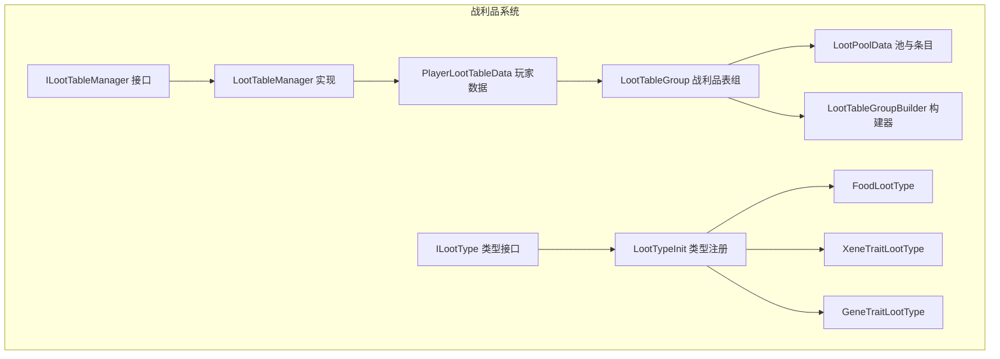
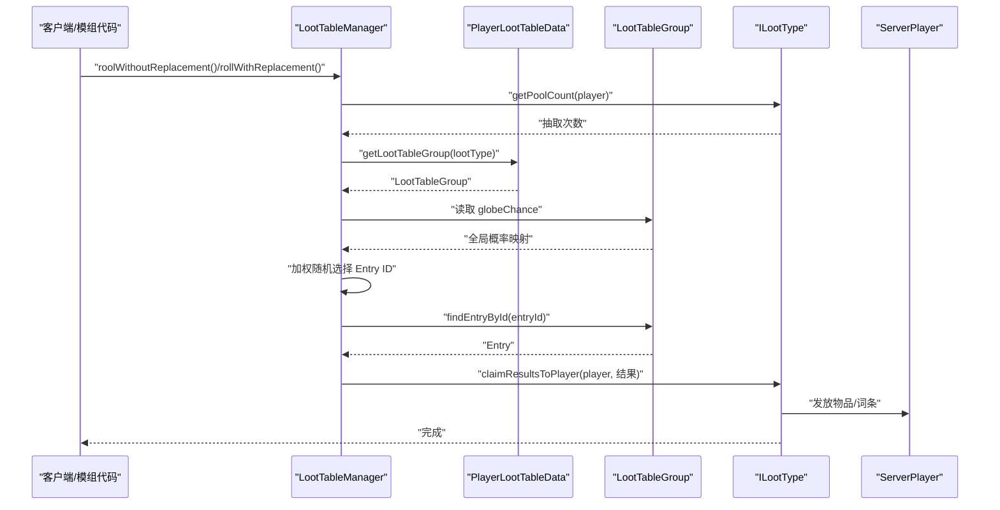
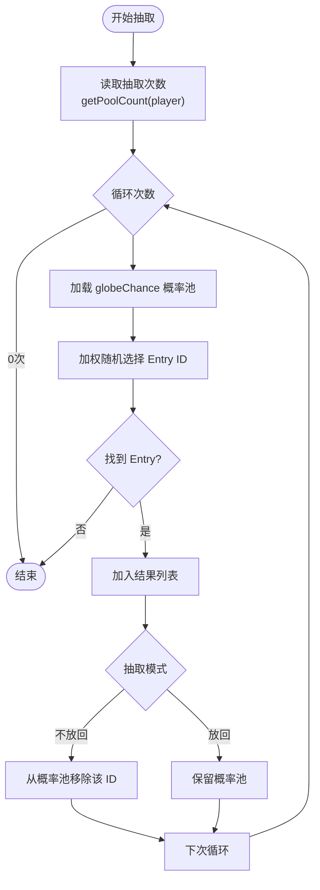
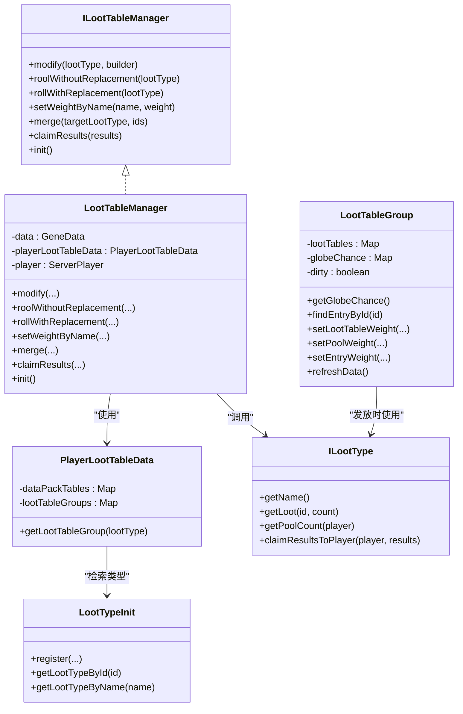
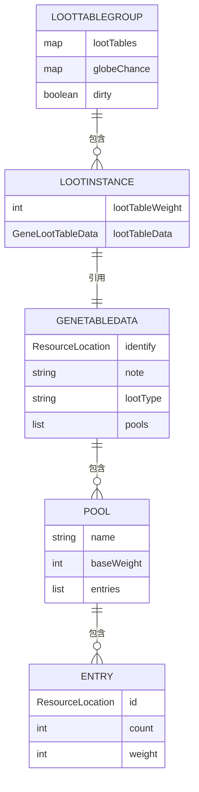

# 战利品表管理

<cite>
**本文引用的文件**
- [ILootTableManager.java](file://Biotech/src/main/java/org/biotech/api/system/loot/core/ILootTableManager.java)
- [LootTableManager.java](file://Biotech/src/main/java/org/biotech/api/system/loot/LootTableManager.java)
- [ILootType.java](file://Biotech/src/main/java/org/biotech/api/system/loot/core/ILootType.java)
- [PlayerLootTableData.java](file://Biotech/src/main/java/org/biotech/api/system/loot/PlayerLootTableData.java)
- [LootTableGroup.java](file://Biotech/src/main/java/org/biotech/api/system/loot/data/LootTableGroup.java)
- [LootPoolData.java](file://Biotech/src/main/java/org/biotech/api/system/loot/data/LootPoolData.java)
- [LootTableGroupBuilder.java](file://Biotech/src/main/java/org/biotech/api/system/loot/data/LootTableGroupBuilder.java)
- [LootTypeInit.java](file://Biotech/src/main/java/org/biotech/api/init/LootTypeInit.java)
- [FoodLootType.java](file://Biotech/src/main/java/org/biotech/loot/FoodLootType.java)
- [XeneTraitLootType.java](file://Biotech/src/main/java/org/biotech/loot/XeneTraitLootType.java)
- [GeneTraitLootType.java](file://Biotech/src/main/java/org/biotech/loot/GeneTraitLootType.java)
- [xene_trait_base.json](file://Biotech/src/main/resources/data/biotech/gene_loot_table/in_game/xene_trait_base.json)
- [gene_trait_base.json](file://Biotech/src/main/resources/data/biotech/gene_loot_table/other/gene_trait_base.json)
</cite>

## 目录
1. [简介](#简介)
2. [项目结构](#项目结构)
3. [核心组件](#核心组件)
4. [架构总览](#架构总览)
5. [详细组件分析](#详细组件分析)
6. [依赖关系分析](#依赖关系分析)
7. [性能考量](#性能考量)
8. [故障排查指南](#故障排查指南)
9. [结论](#结论)
10. [附录](#附录)

## 简介
本文件系统性阐述战利品表管理的设计与实现，围绕 ILootTableManager 接口及其具体实现 LootTableManager，详解战利品表的配置、查询、抽取与发放流程；解释 getLootTableManager 的工作原理与使用场景；覆盖不同战利品类型（如基因战利品表、异种战利品表等）的配置与使用方式，并提供模组开发中使用战利品表管理器进行随机掉落与奖励分配的实践路径。文档还包含权重计算、稀有度控制与动态调整等关键机制的实现要点。

## 项目结构
本项目采用按功能域分层的组织方式，战利品系统位于 Biotech 模块内，核心文件分布如下：
- 接口与实现：ILootTableManager、LootTableManager
- 数据模型：LootTableGroup、LootPoolData、LootTableGroupBuilder
- 类型系统：ILootType、LootTypeInit 及具体类型实现（Food、XeneTrait、GeneTrait、Weapon、Gene）
- 配置数据：JSON 形式的战利品表数据包资源
- 玩家数据：PlayerLootTableData（持有各类型战利品表组）

图表来源
- [ILootTableManager.java:1-77](file://Biotech/src/main/java/org/biotech/api/system/loot/core/ILootTableManager.java#L1-L77)
- [LootTableManager.java:1-190](file://Biotech/src/main/java/org/biotech/api/system/loot/LootTableManager.java#L1-L190)
- [PlayerLootTableData.java:1-88](file://Biotech/src/main/java/org/biotech/api/system/loot/PlayerLootTableData.java#L1-L88)
- [LootTableGroup.java:1-384](file://Biotech/src/main/java/org/biotech/api/system/loot/data/LootTableGroup.java#L1-L384)
- [LootPoolData.java:1-81](file://Biotech/src/main/java/org/biotech/api/system/loot/data/LootPoolData.java#L1-L81)
- [LootTableGroupBuilder.java:1-262](file://Biotech/src/main/java/org/biotech/api/system/loot/data/LootTableGroupBuilder.java#L1-L262)
- [ILootType.java:1-85](file://Biotech/src/main/java/org/biotech/api/system/loot/core/ILootType.java#L1-L85)
- [LootTypeInit.java:1-78](file://Biotech/src/main/java/org/biotech/api/init/LootTypeInit.java#L1-L78)
- [FoodLootType.java:1-45](file://Biotech/src/main/java/org/biotech/loot/FoodLootType.java#L1-L45)
- [XeneTraitLootType.java:1-69](file://Biotech/src/main/java/org/biotech/loot/XeneTraitLootType.java#L1-L69)
- [GeneTraitLootType.java:1-75](file://Biotech/src/main/java/org/biotech/loot/GeneTraitLootType.java#L1-L75)

章节来源
- [ILootTableManager.java:1-77](file://Biotech/src/main/java/org/biotech/api/system/loot/core/ILootTableManager.java#L1-L77)
- [LootTableManager.java:1-190](file://Biotech/src/main/java/org/biotech/api/system/loot/LootTableManager.java#L1-L190)
- [PlayerLootTableData.java:1-88](file://Biotech/src/main/java/org/biotech/api/system/loot/PlayerLootTableData.java#L1-L88)
- [LootTableGroup.java:1-384](file://Biotech/src/main/java/org/biotech/api/system/loot/data/LootTableGroup.java#L1-L384)
- [LootPoolData.java:1-81](file://Biotech/src/main/java/org/biotech/api/system/loot/data/LootPoolData.java#L1-L81)
- [LootTableGroupBuilder.java:1-262](file://Biotech/src/main/java/org/biotech/api/system/loot/data/LootTableGroupBuilder.java#L1-L262)
- [ILootType.java:1-85](file://Biotech/src/main/java/org/biotech/api/system/loot/core/ILootType.java#L1-L85)
- [LootTypeInit.java:1-78](file://Biotech/src/main/java/org/biotech/api/init/LootTypeInit.java#L1-L78)
- [FoodLootType.java:1-45](file://Biotech/src/main/java/org/biotech/loot/FoodLootType.java#L1-L45)
- [XeneTraitLootType.java:1-69](file://Biotech/src/main/java/org/biotech/loot/XeneTraitLootType.java#L1-L69)
- [GeneTraitLootType.java:1-75](file://Biotech/src/main/java/org/biotech/loot/GeneTraitLootType.java#L1-L75)

## 核心组件
- ILootTableManager：定义战利品表管理能力，包括修改、不放回/放回抽取、批量权重设置、合并战利品表、领取结果等。
- LootTableManager：ILootTableManager 的具体实现，负责根据玩家上下文执行抽取、发放与数据更新。
- ILootType：抽象各类战利品类型（如食物、基因词条、异种词条、武器、基因），定义如何解析 ID、如何根据属性决定抽取次数、如何发放给玩家。
- PlayerLootTableData：存储玩家维度的战利品表数据，按 ILootType 分组维护 LootTableGroup。
- LootTableGroup：管理多张战利品表，维护全局概率缓存 globeChance，提供权重/数量修改与查找。
- LootPoolData：描述池与条目，包含名称、基础权重、条目列表及条目内部结构（ID、数量、权重）。
- LootTableGroupBuilder：链式构建器，支持按表、池、条目逐层查找与修改。
- LootTypeInit：注册与检索 ILootType，内置多种类型（食物、异种词条、基因词条、武器、基因）。
- 具体类型实现：FoodLootType、XeneTraitLootType、GeneTraitLootType 等，分别定义如何解析与发放对应类型的战利品。

章节来源
- [ILootTableManager.java:14-76](file://Biotech/src/main/java/org/biotech/api/system/loot/core/ILootTableManager.java#L14-L76)
- [LootTableManager.java:21-188](file://Biotech/src/main/java/org/biotech/api/system/loot/LootTableManager.java#L21-L188)
- [ILootType.java:9-84](file://Biotech/src/main/java/org/biotech/api/system/loot/core/ILootType.java#L9-L84)
- [PlayerLootTableData.java:20-87](file://Biotech/src/main/java/org/biotech/api/system/loot/PlayerLootTableData.java#L20-L87)
- [LootTableGroup.java:17-381](file://Biotech/src/main/java/org/biotech/api/system/loot/data/LootTableGroup.java#L17-L381)
- [LootPoolData.java:24-79](file://Biotech/src/main/java/org/biotech/api/system/loot/data/LootPoolData.java#L24-L79)
- [LootTableGroupBuilder.java:25-261](file://Biotech/src/main/java/org/biotech/api/system/loot/data/LootTableGroupBuilder.java#L25-L261)
- [LootTypeInit.java:19-77](file://Biotech/src/main/java/org/biotech/api/init/LootTypeInit.java#L19-L77)
- [FoodLootType.java:13-44](file://Biotech/src/main/java/org/biotech/loot/FoodLootType.java#L13-L44)
- [XeneTraitLootType.java:19-68](file://Biotech/src/main/java/org/biotech/loot/XeneTraitLootType.java#L19-L68)
- [GeneTraitLootType.java:17-74](file://Biotech/src/main/java/org/biotech/loot/GeneTraitLootType.java#L17-L74)

## 架构总览
下图展示了战利品系统的关键交互：客户端通过 ILootTableManager 发起抽取请求，LootTableManager 基于玩家上下文与类型接口计算抽取次数，从 PlayerLootTableData 中获取对应 LootTableGroup，利用 globeChance 进行加权抽取，最后通过 ILootType 将结果发放给玩家。

图表来源
- [LootTableManager.java:54-112](file://Biotech/src/main/java/org/biotech/api/system/loot/LootTableManager.java#L54-L112)
- [PlayerLootTableData.java:37-39](file://Biotech/src/main/java/org/biotech/api/system/loot/PlayerLootTableData.java#L37-L39)
- [LootTableGroup.java:52-68](file://Biotech/src/main/java/org/biotech/api/system/loot/data/LootTableGroup.java#L52-L68)
- [ILootType.java:33-46](file://Biotech/src/main/java/org/biotech/api/system/loot/core/ILootType.java#L33-L46)

## 详细组件分析

### ILootTableManager 接口与实现
- 功能概览
  - modify：对指定战利品类型进行链式修改，返回自身以支持连续调用。
  - roolWithoutReplacement/rollWithReplacement：基于 globeChance 进行加权抽取，前者不放回，后者放回。
  - setWeightByName：按池名批量设置基础权重并标记脏数据。
  - merge：将数据包中的其他战利品表合并到目标类型。
  - claimResults：委托 ILootType 将结果发放给玩家。
  - init：初始化阶段合并基础战利品表（如基因词条、异种词条的基础表）。
- 关键实现细节
  - 抽取算法使用 weightedRandomSelect，累计概率进行二分查找，确保浮点误差下的稳健性。
  - globeChance 缓存仅在 dirty 时刷新，避免重复计算。
  - modify 通过 LootTableGroupBuilder 提供链式 API，便于定位并修改特定表/池/条目。

章节来源
- [ILootTableManager.java:14-76](file://Biotech/src/main/java/org/biotech/api/system/loot/core/ILootTableManager.java#L14-L76)
- [LootTableManager.java:44-187](file://Biotech/src/main/java/org/biotech/api/system/loot/LootTableManager.java#L44-L187)

### 抽取流程与权重计算
- 权重层级
  - 战利品表权重（LootInstance.lootTableWeight）
  - 池基础权重（LootPoolData.baseWeight）
  - 条目权重（Entry.weight）
- 最终概率
  - 最终概率 = 表概率 × 池概率 × 条目概率
  - globeChance 为所有 Entry 的最终概率之和（同 ID 条目概率累加）
- 抽取策略
  - 不放回：每次命中后从 globeChance 移除该 ID，避免重复。
  - 放回：每次命中后保留 globeChance，允许重复抽取。
- 属性驱动抽取次数
  - ILootType.getPoolCountFromAttribute 将属性值拆分为整数部分（固定次数）与小数部分（额外概率），随机判定是否追加一次。

图表来源
- [LootTableManager.java:55-111](file://Biotech/src/main/java/org/biotech/api/system/loot/LootTableManager.java#L55-L111)
- [LootTableGroup.java:346-381](file://Biotech/src/main/java/org/biotech/api/system/loot/data/LootTableGroup.java#L346-L381)
- [ILootType.java:69-82](file://Biotech/src/main/java/org/biotech/api/system/loot/core/ILootType.java#L69-L82)

章节来源
- [LootTableManager.java:55-111](file://Biotech/src/main/java/org/biotech/api/system/loot/LootTableManager.java#L55-L111)
- [LootTableGroup.java:346-381](file://Biotech/src/main/java/org/biotech/api/system/loot/data/LootTableGroup.java#L346-L381)
- [ILootType.java:69-82](file://Biotech/src/main/java/org/biotech/api/system/loot/core/ILootType.java#L69-L82)

### 不同类型的战利品表配置与使用
- 基础表与数据包
  - 异种词条基础表：xene_trait_base.json
  - 基因词条基础表：gene_trait_base.json
  - 两者均以 identify、note、loot_type、pools 结构定义，pools 包含 name、base_weight、entries。
- 类型注册与检索
  - LootTypeInit 注册多种 ILootType，包括食物、异种词条、基因词条、武器、基因。
  - 通过 getLootTypeById/getLootTypeByName 获取类型实例。
- 类型实现差异
  - FoodLootType：校验 FOOD 组件，返回物品堆栈。
  - XeneTraitLootType：将抽取的词条封装到 TraitComp，生成 XeneItem 并放入 xene_equip_slot 槽位。
  - GeneTraitLootType：将词条封装到 GeneInstance，生成 GeneItem 并交由基因背包管理器处理。

章节来源
- [xene_trait_base.json:1-26](file://Biotech/src/main/resources/data/biotech/gene_loot_table/in_game/xene_trait_base.json#L1-L26)
- [gene_trait_base.json:1-26](file://Biotech/src/main/resources/data/biotech/gene_loot_table/other/gene_trait_base.json#L1-L26)
- [LootTypeInit.java:39-53](file://Biotech/src/main/java/org/biotech/api/init/LootTypeInit.java#L39-L53)
- [FoodLootType.java:21-39](file://Biotech/src/main/java/org/biotech/loot/FoodLootType.java#L21-L39)
- [XeneTraitLootType.java:37-65](file://Biotech/src/main/java/org/biotech/loot/XeneTraitLootType.java#L37-L65)
- [GeneTraitLootType.java:39-67](file://Biotech/src/main/java/org/biotech/loot/GeneTraitLootType.java#L39-L67)

### getLootTableManager 的工作原理与使用场景
- 工作原理
  - 通过 PlayerLootTableData 按 ILootType 获取对应的 LootTableGroup，若不存在则新建。
  - 在抽取前，LootTableGroup 会根据 dirty 标记触发 globeChance 刷新。
  - 抽取时使用 weightedRandomSelect 从 globeChance 中选择 Entry ID，再通过 findEntryById 定位具体条目。
- 使用场景
  - 模组在事件回调中触发掉落：如怪物死亡、箱子开启、任务完成等。
  - 玩家属性变化导致抽取次数变化：如通过属性系统增加“每次抽取次数”。
  - 运行时动态调整权重：通过 modify 或 setWeightByName 实现临时平衡。

章节来源
- [PlayerLootTableData.java:37-39](file://Biotech/src/main/java/org/biotech/api/system/loot/PlayerLootTableData.java#L37-L39)
- [LootTableGroup.java:52-68](file://Biotech/src/main/java/org/biotech/api/system/loot/data/LootTableGroup.java#L52-L68)
- [LootTableManager.java:184-186](file://Biotech/src/main/java/org/biotech/api/system/loot/LootTableManager.java#L184-L186)

### 链式修改与动态调整
- 链式 API
  - 通过 LootTableGroupBuilder.builder(group) 获取顶层构建器。
  - 支持 findLootTable/findPool/findEntry 逐层定位，随后 setWeight/setCount 修改权重与数量。
  - 支持 modifyLootTable/modifyPool/modifyEntry 消费式修改。
- 动态调整
  - setWeightByName：按池名批量调整基础权重，触发脏标记，后续抽取时重新计算 globeChance。
  - merge：将数据包中的其他战利品表合并到目标类型，扩展掉落内容。

章节来源
- [LootTableGroupBuilder.java:47-88](file://Biotech/src/main/java/org/biotech/api/system/loot/data/LootTableGroupBuilder.java#L47-L88)
- [LootTableGroupBuilder.java:111-152](file://Biotech/src/main/java/org/biotech/api/system/loot/data/LootTableGroupBuilder.java#L111-L152)
- [LootTableGroupBuilder.java:172-209](file://Biotech/src/main/java/org/biotech/api/system/loot/data/LootTableGroupBuilder.java#L172-L209)
- [LootTableGroupBuilder.java:227-238](file://Biotech/src/main/java/org/biotech/api/system/loot/data/LootTableGroupBuilder.java#L227-L238)
- [LootTableManager.java:115-122](file://Biotech/src/main/java/org/biotech/api/system/loot/LootTableManager.java#L115-L122)
- [LootTableManager.java:124-133](file://Biotech/src/main/java/org/biotech/api/system/loot/LootTableManager.java#L124-L133)

### 模组开发实战：随机掉落与奖励分配
以下为在模组中使用战利品表管理器进行随机掉落与奖励分配的实践步骤（以路径代替代码片段）：
- 步骤一：注册自定义战利品类型
  - 参考 [LootTypeInit.java:58-60](file://Biotech/src/main/java/org/biotech/api/init/LootTypeInit.java#L58-L60)，使用 registerLootType 注册新类型。
- 步骤二：准备数据包战利品表
  - 在 data/<namespace>/gene_loot_table 下新增 JSON 文件，参考 [xene_trait_base.json:1-26](file://Biotech/src/main/resources/data/biotech/gene_loot_table/in_game/xene_trait_base.json#L1-L26) 与 [gene_trait_base.json:1-26](file://Biotech/src/main/resources/data/biotech/gene_loot_table/other/gene_trait_base.json#L1-L26)。
- 步骤三：初始化并合并基础表
  - 在 [LootTableManager.java:35-41](file://Biotech/src/main/java/org/biotech/api/system/loot/LootTableManager.java#L35-L41) 中调用 merge 合并基础表。
- 步骤四：运行时修改权重或合并新表
  - 使用 [LootTableManager.java:44-52](file://Biotech/src/main/java/org/biotech/api/system/loot/LootTableManager.java#L44-L52) 的 modify，或 [LootTableManager.java:115-122](file://Biotech/src/main/java/org/biotech/api/system/loot/LootTableManager.java#L115-L122) 的 setWeightByName。
- 步骤五：发起抽取与发放
  - 使用 [LootTableManager.java:55-112](file://Biotech/src/main/java/org/biotech/api/system/loot/LootTableManager.java#L55-L112) 进行不放回/放回抽取，再通过 [LootTableManager.java:135-138](file://Biotech/src/main/java/org/biotech/api/system/loot/LootTableManager.java#L135-L138) 发放结果。

章节来源
- [LootTypeInit.java:58-60](file://Biotech/src/main/java/org/biotech/api/init/LootTypeInit.java#L58-L60)
- [xene_trait_base.json:1-26](file://Biotech/src/main/resources/data/biotech/gene_loot_table/in_game/xene_trait_base.json#L1-L26)
- [gene_trait_base.json:1-26](file://Biotech/src/main/resources/data/biotech/gene_loot_table/other/gene_trait_base.json#L1-L26)
- [LootTableManager.java:35-41](file://Biotech/src/main/java/org/biotech/api/system/loot/LootTableManager.java#L35-L41)
- [LootTableManager.java:44-52](file://Biotech/src/main/java/org/biotech/api/system/loot/LootTableManager.java#L44-L52)
- [LootTableManager.java:115-122](file://Biotech/src/main/java/org/biotech/api/system/loot/LootTableManager.java#L115-L122)
- [LootTableManager.java:55-112](file://Biotech/src/main/java/org/biotech/api/system/loot/LootTableManager.java#L55-L112)
- [LootTableManager.java:135-138](file://Biotech/src/main/java/org/biotech/api/system/loot/LootTableManager.java#L135-L138)

## 依赖关系分析
- 组件耦合
  - LootTableManager 依赖 PlayerLootTableData 获取类型分组，依赖 ILootType 解析与发放。
  - PlayerLootTableData 依赖 LootTypeInit 进行类型检索与序列化。
  - LootTableGroup 维护 globeChance 并提供权重/数量修改接口。
  - ILootType 的具体实现（如 XeneTraitLootType、GeneTraitLootType）对游戏系统（Curios、基因背包）有直接依赖。
- 外部依赖
  - NeoForge 注册表与数据包资源系统。
  - Minecraft 随机源与属性系统。

图表来源
- [ILootTableManager.java:14-76](file://Biotech/src/main/java/org/biotech/api/system/loot/core/ILootTableManager.java#L14-L76)
- [LootTableManager.java:21-188](file://Biotech/src/main/java/org/biotech/api/system/loot/LootTableManager.java#L21-L188)
- [PlayerLootTableData.java:20-87](file://Biotech/src/main/java/org/biotech/api/system/loot/PlayerLootTableData.java#L20-L87)
- [LootTableGroup.java:17-381](file://Biotech/src/main/java/org/biotech/api/system/loot/data/LootTableGroup.java#L17-L381)
- [ILootType.java:9-84](file://Biotech/src/main/java/org/biotech/api/system/loot/core/ILootType.java#L9-L84)
- [LootTypeInit.java:19-77](file://Biotech/src/main/java/org/biotech/api/init/LootTypeInit.java#L19-L77)

章节来源
- [ILootTableManager.java:14-76](file://Biotech/src/main/java/org/biotech/api/system/loot/core/ILootTableManager.java#L14-L76)
- [LootTableManager.java:21-188](file://Biotech/src/main/java/org/biotech/api/system/loot/LootTableManager.java#L21-L188)
- [PlayerLootTableData.java:20-87](file://Biotech/src/main/java/org/biotech/api/system/loot/PlayerLootTableData.java#L20-L87)
- [LootTableGroup.java:17-381](file://Biotech/src/main/java/org/biotech/api/system/loot/data/LootTableGroup.java#L17-L381)
- [ILootType.java:9-84](file://Biotech/src/main/java/org/biotech/api/system/loot/core/ILootType.java#L9-L84)
- [LootTypeInit.java:19-77](file://Biotech/src/main/java/org/biotech/api/init/LootTypeInit.java#L19-L77)

## 性能考量
- 概率缓存与脏标记
  - globeChance 仅在 dirty 时刷新，避免每次抽取都进行 O(N) 的概率计算。
- 加权随机选择
  - weightedRandomSelect 使用累计概率与线性扫描，时间复杂度 O(M)（M 为候选数量），在池规模合理时性能稳定。
- 批量权重设置
  - setWeightByName 遍历所有表/池，适合低频调用；高频调用建议合并修改为一次性批量操作。
- 抽取次数计算
  - getPoolCountFromAttribute 为 O(1) 随机判定，开销极低。

## 故障排查指南
- 抽取结果为空
  - 检查目标类型是否正确注册与检索：参考 [LootTypeInit.java:39-53](file://Biotech/src/main/java/org/biotech/api/init/LootTypeInit.java#L39-L53)。
  - 确认 PlayerLootTableData 是否已合并基础表：参考 [LootTableManager.java:35-41](file://Biotech/src/main/java/org/biotech/api/system/loot/LootTableManager.java#L35-L41)。
- 权重调整无效
  - 确认 setWeightByName 后 globeChance 是否被标记为 dirty 并在下次抽取前刷新：参考 [LootTableGroup.java:52-60](file://Biotech/src/main/java/org/biotech/api/system/loot/data/LootTableGroup.java#L52-L60)。
- 发放异常
  - 检查 ILootType 的 claimResultsToPlayer 实现是否正确处理物品/词条发放：参考 [ILootType.java:33-46](file://Biotech/src/main/java/org/biotech/api/system/loot/core/ILootType.java#L33-L46)、[XeneTraitLootType.java:37-65](file://Biotech/src/main/java/org/biotech/loot/XeneTraitLootType.java#L37-L65)、[GeneTraitLootType.java:39-67](file://Biotech/src/main/java/org/biotech/loot/GeneTraitLootType.java#L39-L67)。
- 数据包未生效
  - 确认 JSON 文件路径与命名符合数据包规范，且在 merge 时传入正确的 ResourceLocation：参考 [xene_trait_base.json:1-26](file://Biotech/src/main/resources/data/biotech/gene_loot_table/in_game/xene_trait_base.json#L1-L26)、[gene_trait_base.json:1-26](file://Biotech/src/main/resources/data/biotech/gene_loot_table/other/gene_trait_base.json#L1-L26)、[LootTableManager.java:124-133](file://Biotech/src/main/java/org/biotech/api/system/loot/LootTableManager.java#L124-L133)。

章节来源
- [LootTypeInit.java:39-53](file://Biotech/src/main/java/org/biotech/api/init/LootTypeInit.java#L39-L53)
- [LootTableManager.java:35-41](file://Biotech/src/main/java/org/biotech/api/system/loot/LootTableManager.java#L35-L41)
- [LootTableGroup.java:52-60](file://Biotech/src/main/java/org/biotech/api/system/loot/data/LootTableGroup.java#L52-L60)
- [ILootType.java:33-46](file://Biotech/src/main/java/org/biotech/api/system/loot/core/ILootType.java#L33-L46)
- [XeneTraitLootType.java:37-65](file://Biotech/src/main/java/org/biotech/loot/XeneTraitLootType.java#L37-L65)
- [GeneTraitLootType.java:39-67](file://Biotech/src/main/java/org/biotech/loot/GeneTraitLootType.java#L39-L67)
- [xene_trait_base.json:1-26](file://Biotech/src/main/resources/data/biotech/gene_loot_table/in_game/xene_trait_base.json#L1-L26)
- [gene_trait_base.json:1-26](file://Biotech/src/main/resources/data/biotech/gene_loot_table/other/gene_trait_base.json#L1-L26)
- [LootTableManager.java:124-133](file://Biotech/src/main/java/org/biotech/api/system/loot/LootTableManager.java#L124-L133)

## 结论
本战利品表管理系统通过 ILootTableManager 抽象与 LootTableManager 实现，结合 PlayerLootTableData、LootTableGroup 与 ILootType，提供了灵活、可扩展的随机掉落与奖励分配框架。其核心优势在于：
- 清晰的三层权重体系与稳定的加权抽取算法；
- 基于 globeChance 的缓存与脏标记优化；
- 链式构建器与批量权重设置满足动态调整需求；
- 多类型支持与数据包资源化，便于模组扩展。

## 附录
- 数据模型关系图

图表来源
- [LootTableGroup.java:17-381](file://Biotech/src/main/java/org/biotech/api/system/loot/data/LootTableGroup.java#L17-L381)
- [LootPoolData.java:24-79](file://Biotech/src/main/java/org/biotech/api/system/loot/data/LootPoolData.java#L24-L79)
- [GeneLootTableData.java:25-51](file://Biotech/src/main/java/org/biotech/api/system/loot/data/GeneLootTableData.java#L25-L51)