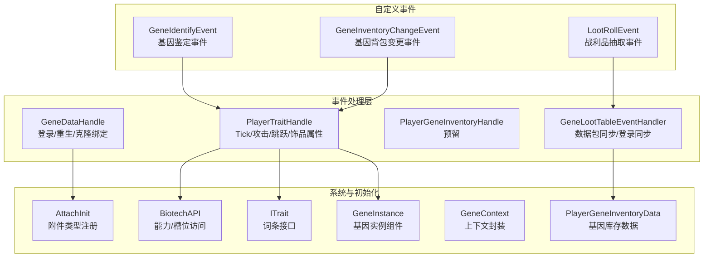
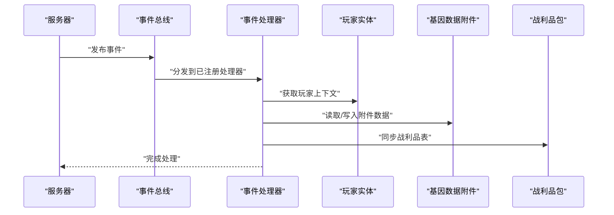
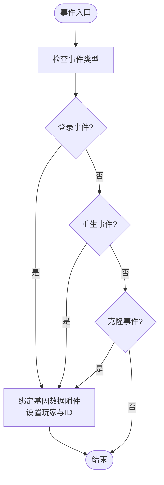
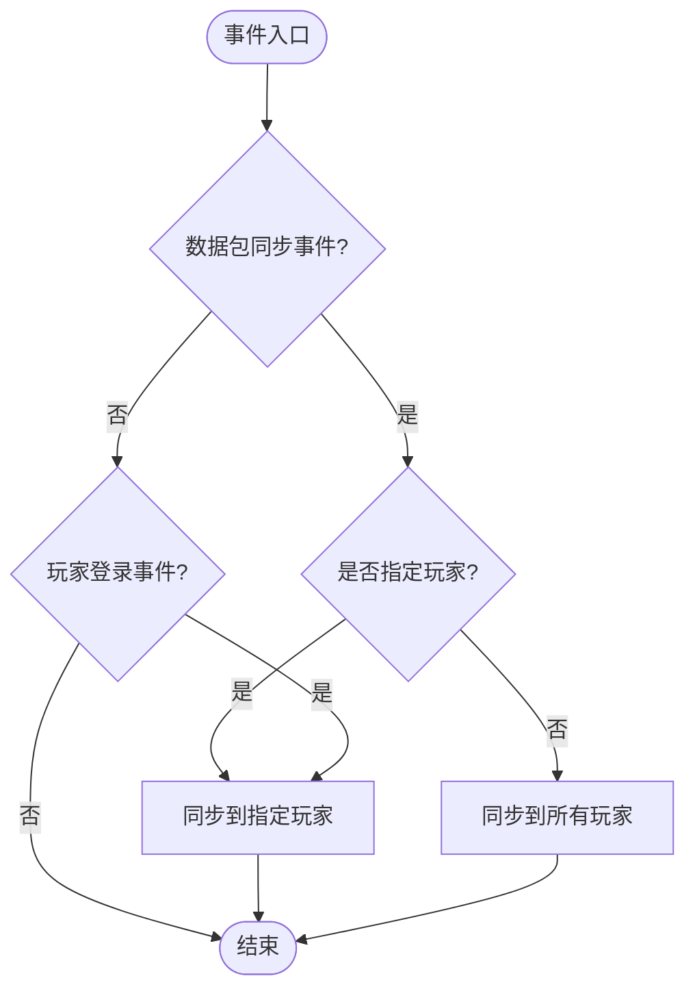
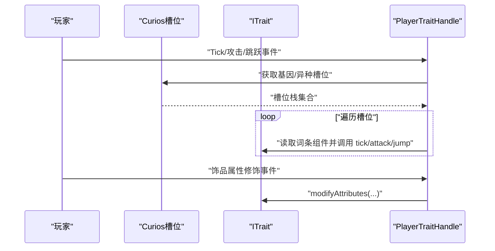
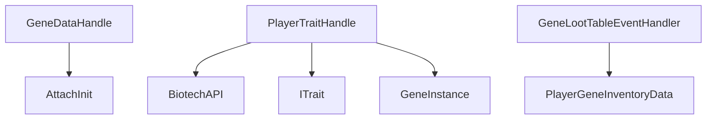

# 事件处理器实现

<cite>
**本文引用的文件**
- [GeneDataHandle.java](file://Biotech/src/main/java/org/biotech/api/event/handle/GeneDataHandle.java)
- [GeneLootTableEventHandler.java](file://Biotech/src/main/java/org/biotech/api/event/handle/GeneLootTableEventHandler.java)
- [PlayerGeneInventoryHandle.java](file://Biotech/src/main/java/org/biotech/api/event/handle/PlayerGeneInventoryHandle.java)
- [PlayerTraitHandle.java](file://Biotech/src/main/java/org/biotech/api/event/handle/PlayerTraitHandle.java)
- [GeneIdentifyEvent.java](file://Biotech/src/main/java/org/biotech/api/event/custom/GeneIdentifyEvent.java)
- [GeneInventoryChangeEvent.java](file://Biotech/src/main/java/org/biotech/api/event/custom/GeneInventoryChangeEvent.java)
- [LootRollEvent.java](file://Biotech/src/main/java/org/biotech/api/event/custom/LootRollEvent.java)
- [AttachInit.java](file://Biotech/src/main/java/org/biotech/api/init/AttachInit.java)
- [PlayerGeneInventoryData.java](file://Biotech/src/main/java/org/biotech/api/system/gene/inventory/PlayerGeneInventoryData.java)
- [ITrait.java](file://Biotech/src/main/java/org/biotech/api/system/trait/core/ITrait.java)
- [BiotechAPI.java](file://Biotech/src/main/java/org/biotech/api/BiotechAPI.java)
- [GeneContext.java](file://Biotech/src/main/java/org/biotech/api/system/gene/GeneContext.java)
- [GeneInstance.java](file://Biotech/src/main/java/org/biotech/api/system/gene/GeneInstance.java)
</cite>

## 目录
1. [简介](#简介)
2. [项目结构](#项目结构)
3. [核心组件](#核心组件)
4. [架构总览](#架构总览)
5. [详细组件分析](#详细组件分析)
6. [依赖分析](#依赖分析)
7. [性能考量](#性能考量)
8. [故障排查指南](#故障排查指南)
9. [结论](#结论)
10. [附录](#附录)

## 简介
本文件系统性梳理 Biotech 模组中的事件处理器实现，重点覆盖以下处理器的工作原理与集成方式：
- 基因数据处理器：负责玩家登录、重生、克隆时的基因数据绑定与初始化
- 基因战利品表处理器：负责数据包同步与玩家登录时的战利品表同步
- 玩家基因背包处理器：预留扩展点（暂未使用）
- 玩家词条处理器：负责玩家 Tick、攻击、跳跃以及饰品属性修饰事件的处理

同时，文档说明事件处理器的注册流程、执行顺序与优先级设置，解释与事件系统的集成方式（事件总线订阅、事件分发），并提供自定义事件处理器的实现步骤、性能优化策略与调试技巧。

## 项目结构
事件处理器主要位于 Biotech 模组的事件处理与自定义事件目录中，配合初始化与系统组件共同构成事件驱动架构。

图表来源
- [GeneDataHandle.java:1-40](file://Biotech/src/main/java/org/biotech/api/event/handle/GeneDataHandle.java#L1-L40)
- [GeneLootTableEventHandler.java:1-34](file://Biotech/src/main/java/org/biotech/api/event/handle/GeneLootTableEventHandler.java#L1-L34)
- [PlayerTraitHandle.java:1-133](file://Biotech/src/main/java/org/biotech/api/event/handle/PlayerTraitHandle.java#L1-L133)
- [AttachInit.java:1-34](file://Biotech/src/main/java/org/biotech/api/init/AttachInit.java#L1-L34)
- [BiotechAPI.java:1-92](file://Biotech/src/main/java/org/biotech/api/BiotechAPI.java#L1-L92)
- [PlayerGeneInventoryData.java:1-72](file://Biotech/src/main/java/org/biotech/api/system/gene/inventory/PlayerGeneInventoryData.java#L1-L72)
- [ITrait.java:1-108](file://Biotech/src/main/java/org/biotech/api/system/trait/core/ITrait.java#L1-L108)
- [GeneContext.java:1-13](file://Biotech/src/main/java/org/biotech/api/system/gene/GeneContext.java#L1-L13)
- [GeneInstance.java:1-119](file://Biotech/src/main/java/org/biotech/api/system/gene/GeneInstance.java#L1-L119)

章节来源
- [GeneDataHandle.java:1-40](file://Biotech/src/main/java/org/biotech/api/event/handle/GeneDataHandle.java#L1-L40)
- [GeneLootTableEventHandler.java:1-34](file://Biotech/src/main/java/org/biotech/api/event/handle/GeneLootTableEventHandler.java#L1-L34)
- [PlayerTraitHandle.java:1-133](file://Biotech/src/main/java/org/biotech/api/event/handle/PlayerTraitHandle.java#L1-L133)
- [AttachInit.java:1-34](file://Biotech/src/main/java/org/biotech/api/init/AttachInit.java#L1-L34)
- [BiotechAPI.java:1-92](file://Biotech/src/main/java/org/biotech/api/BiotechAPI.java#L1-L92)
- [PlayerGeneInventoryData.java:1-72](file://Biotech/src/main/java/org/biotech/api/system/gene/inventory/PlayerGeneInventoryData.java#L1-L72)
- [ITrait.java:1-108](file://Biotech/src/main/java/org/biotech/api/system/trait/core/ITrait.java#L1-L108)
- [GeneContext.java:1-13](file://Biotech/src/main/java/org/biotech/api/system/gene/GeneContext.java#L1-L13)
- [GeneInstance.java:1-119](file://Biotech/src/main/java/org/biotech/api/system/gene/GeneInstance.java#L1-L119)

## 核心组件
- 基因数据处理器（GeneDataHandle）
  - 职责：在登录、重生、克隆事件中确保服务器端玩家绑定到正确的基因数据附件，并设置玩家对象与 ID
  - 关键点：使用事件总线注解订阅；仅对服务器端玩家生效；通过附件类型获取并初始化数据
- 基因战利品表处理器（GeneLootTableEventHandler）
  - 职责：在数据包同步与玩家登录时，向客户端同步最新的战利品表
  - 关键点：按目标区分同步范围（单个玩家或全部玩家）
- 玩家基因背包处理器（PlayerGeneInventoryHandle）
  - 状态：预留扩展，暂未实现具体逻辑
- 玩家词条处理器（PlayerTraitHandle）
  - 职责：在 Tick、攻击、跳跃事件中遍历玩家装备槽位与基因实例中的词条，分别调用对应生命周期方法；在饰品属性修饰事件中应用词条提供的属性修正
  - 关键点：从 Curios 槽位收集词条；支持 XeneItem 与 GeneItem 两种挂载路径；通过上下文传递玩家信息

章节来源
- [GeneDataHandle.java:10-39](file://Biotech/src/main/java/org/biotech/api/event/handle/GeneDataHandle.java#L10-L39)
- [GeneLootTableEventHandler.java:14-33](file://Biotech/src/main/java/org/biotech/api/event/handle/GeneLootTableEventHandler.java#L14-L33)
- [PlayerGeneInventoryHandle.java:1-10](file://Biotech/src/main/java/org/biotech/api/event/handle/PlayerGeneInventoryHandle.java#L1-L10)
- [PlayerTraitHandle.java:23-132](file://Biotech/src/main/java/org/biotech/api/event/handle/PlayerTraitHandle.java#L23-L132)

## 架构总览
事件处理器通过 NeoForge 事件总线进行注册与分发，自定义事件用于在特定业务阶段插入可取消或可修改的处理逻辑。系统通过附件（Attachment）、能力（Capability）与 Curios 槽位组合实现状态持久化与可视化交互。

图表来源
- [GeneDataHandle.java:13-38](file://Biotech/src/main/java/org/biotech/api/event/handle/GeneDataHandle.java#L13-L38)
- [GeneLootTableEventHandler.java:17-32](file://Biotech/src/main/java/org/biotech/api/event/handle/GeneLootTableEventHandler.java#L17-L32)
- [AttachInit.java:19-31](file://Biotech/src/main/java/org/biotech/api/init/AttachInit.java#L19-L31)

## 详细组件分析

### 基因数据处理器（GeneDataHandle）
- 注册与优先级
  - 使用全局事件总线注解注册，适用于所有事件类型
  - 无显式优先级声明，默认由事件总线按注册顺序调度
- 执行顺序
  - 登录事件 → 重生事件 → 克隆事件
  - 每次均确保服务器端玩家绑定到附件并设置 ID
- 关键流程图

图表来源
- [GeneDataHandle.java:13-38](file://Biotech/src/main/java/org/biotech/api/event/handle/GeneDataHandle.java#L13-L38)

章节来源
- [GeneDataHandle.java:10-39](file://Biotech/src/main/java/org/biotech/api/event/handle/GeneDataHandle.java#L10-L39)
- [AttachInit.java:19-31](file://Biotech/src/main/java/org/biotech/api/init/AttachInit.java#L19-L31)

### 基因战利品表处理器（GeneLootTableEventHandler）
- 注册与优先级
  - 限定 modid 的事件总线注解，确保仅在本模组上下文中生效
- 执行顺序
  - 数据包同步事件 → 玩家登录事件
- 关键流程图

图表来源
- [GeneLootTableEventHandler.java:17-32](file://Biotech/src/main/java/org/biotech/api/event/handle/GeneLootTableEventHandler.java#L17-L32)

章节来源
- [GeneLootTableEventHandler.java:14-33](file://Biotech/src/main/java/org/biotech/api/event/handle/GeneLootTableEventHandler.java#L14-L33)

### 玩家基因背包处理器（PlayerGeneInventoryHandle）
- 当前状态：预留扩展点，暂未实现具体逻辑
- 建议：后续可在此处实现背包变更、收藏、合并输入等事件的前置/后置处理

章节来源
- [PlayerGeneInventoryHandle.java:1-10](file://Biotech/src/main/java/org/biotech/api/event/handle/PlayerGeneInventoryHandle.java#L1-L10)

### 玩家词条处理器（PlayerTraitHandle）
- 注册与优先级
  - 限定 modid 的事件总线注解，确保仅在本模组上下文中生效
- 执行顺序
  - 玩家 Tick 后置事件 → 攻击事件 → 跳跃事件 → 饰品属性修饰事件
- 处理逻辑
  - 从 Curios 槽位收集词条（基因/异种槽位）
  - 对 XeneItem 与 GeneItem 分别解析词条组件并应用相应回调
  - 在 Tick/攻击/跳跃事件中调用词条生命周期方法
  - 在饰品属性修饰事件中应用属性修正

图表来源
- [PlayerTraitHandle.java:26-87](file://Biotech/src/main/java/org/biotech/api/event/handle/PlayerTraitHandle.java#L26-L87)
- [BiotechAPI.java:75-90](file://Biotech/src/main/java/org/biotech/api/BiotechAPI.java#L75-L90)
- [ITrait.java:18-107](file://Biotech/src/main/java/org/biotech/api/system/trait/core/ITrait.java#L18-L107)
- [GeneInstance.java:19-118](file://Biotech/src/main/java/org/biotech/api/system/gene/GeneInstance.java#L19-L118)

章节来源
- [PlayerTraitHandle.java:23-132](file://Biotech/src/main/java/org/biotech/api/event/handle/PlayerTraitHandle.java#L23-L132)
- [BiotechAPI.java:72-90](file://Biotech/src/main/java/org/biotech/api/BiotechAPI.java#L72-L90)
- [ITrait.java:18-107](file://Biotech/src/main/java/org/biotech/api/system/trait/core/ITrait.java#L18-L107)
- [GeneInstance.java:19-118](file://Biotech/src/main/java/org/biotech/api/system/gene/GeneInstance.java#L19-L118)

### 自定义事件处理器实现指南
- 基本步骤
  - 定义事件处理器类并使用事件总线注解进行注册（可选择限定 modid）
  - 在处理器中使用订阅注解声明事件处理方法
  - 在处理方法中获取事件上下文并执行业务逻辑
  - 如需网络同步或数据持久化，结合附件、能力或数据组件
- 示例参考
  - 登录/重生/克隆绑定：[事件处理器:13-38](file://Biotech/src/main/java/org/biotech/api/event/handle/GeneDataHandle.java#L13-L38)
  - 数据包同步/登录同步：[事件处理器:17-32](file://Biotech/src/main/java/org/biotech/api/event/handle/GeneLootTableEventHandler.java#L17-L32)
  - Tick/攻击/跳跃/饰品属性：[事件处理器:26-87](file://Biotech/src/main/java/org/biotech/api/event/handle/PlayerTraitHandle.java#L26-L87)

章节来源
- [GeneDataHandle.java:10-39](file://Biotech/src/main/java/org/biotech/api/event/handle/GeneDataHandle.java#L10-L39)
- [GeneLootTableEventHandler.java:14-33](file://Biotech/src/main/java/org/biotech/api/event/handle/GeneLootTableEventHandler.java#L14-L33)
- [PlayerTraitHandle.java:23-87](file://Biotech/src/main/java/org/biotech/api/event/handle/PlayerTraitHandle.java#L23-L87)

## 依赖分析
- 事件处理器与系统组件的耦合关系
  - GeneDataHandle 依赖附件初始化以获取/创建基因数据
  - PlayerTraitHandle 依赖 BiotechAPI 获取 Curios 槽位，依赖 ITrait 接口与 GeneInstance 组件
  - GeneLootTableEventHandler 依赖战利品包同步工具
- 依赖关系图

图表来源
- [GeneDataHandle.java:1-40](file://Biotech/src/main/java/org/biotech/api/event/handle/GeneDataHandle.java#L1-L40)
- [AttachInit.java:1-34](file://Biotech/src/main/java/org/biotech/api/init/AttachInit.java#L1-L34)
- [PlayerTraitHandle.java:1-133](file://Biotech/src/main/java/org/biotech/api/event/handle/PlayerTraitHandle.java#L1-L133)
- [BiotechAPI.java:1-92](file://Biotech/src/main/java/org/biotech/api/BiotechAPI.java#L1-L92)
- [ITrait.java:1-108](file://Biotech/src/main/java/org/biotech/api/system/trait/core/ITrait.java#L1-L108)
- [GeneInstance.java:1-119](file://Biotech/src/main/java/org/biotech/api/system/gene/GeneInstance.java#L1-L119)
- [PlayerGeneInventoryData.java:1-72](file://Biotech/src/main/java/org/biotech/api/system/gene/inventory/PlayerGeneInventoryData.java#L1-L72)

章节来源
- [AttachInit.java:1-34](file://Biotech/src/main/java/org/biotech/api/init/AttachInit.java#L1-L34)
- [BiotechAPI.java:72-90](file://Biotech/src/main/java/org/biotech/api/BiotechAPI.java#L72-L90)
- [ITrait.java:18-107](file://Biotech/src/main/java/org/biotech/api/system/trait/core/ITrait.java#L18-L107)
- [GeneInstance.java:19-118](file://Biotech/src/main/java/org/biotech/api/system/gene/GeneInstance.java#L19-L118)
- [PlayerGeneInventoryData.java:1-72](file://Biotech/src/main/java/org/biotech/api/system/gene/inventory/PlayerGeneInventoryData.java#L1-L72)

## 性能考量
- 事件频率控制
  - 玩家 Tick 事件频繁触发，应避免在处理函数中执行重型计算；必要时采用缓存或延迟更新
- 遍历开销
  - 收集词条时对槽位进行循环遍历，建议仅在槽位非空时继续解析，减少无效 IO
- 序列化与网络
  - 附件与数据组件具备编解码器，注意在高频事件中避免重复序列化；利用现有同步机制（如附件复制死亡）降低冗余
- 内存管理
  - 使用只读副本与不可变集合（如只读结果列表）避免意外修改
  - 对空值进行快速返回，减少分支与对象创建

## 故障排查指南
- 事件未触发
  - 检查处理器是否正确使用事件总线注解并处于有效 modid 范围内
  - 确认事件类型与订阅方法签名匹配
- 附件数据为空
  - 确保在登录/重生/克隆事件后才访问附件；检查附件注册与序列化配置
- 词条未生效
  - 核查槽位是否正确获取；确认 XeneItem 与 GeneItem 的组件挂载路径是否正确
  - 检查 ITrait 的网络编码/解码是否正常
- 战利品表未同步
  - 确认 OnDatapackSyncEvent 是否正确分发；检查指定玩家同步与全服同步分支

章节来源
- [GeneDataHandle.java:13-38](file://Biotech/src/main/java/org/biotech/api/event/handle/GeneDataHandle.java#L13-L38)
- [PlayerTraitHandle.java:57-87](file://Biotech/src/main/java/org/biotech/api/event/handle/PlayerTraitHandle.java#L57-L87)
- [GeneLootTableEventHandler.java:17-32](file://Biotech/src/main/java/org/biotech/api/event/handle/GeneLootTableEventHandler.java#L17-L32)
- [AttachInit.java:19-31](file://Biotech/src/main/java/org/biotech/api/init/AttachInit.java#L19-L31)
- [ITrait.java:87-106](file://Biotech/src/main/java/org/biotech/api/system/trait/core/ITrait.java#L87-L106)

## 结论
事件处理器通过统一的事件总线机制与自定义事件模型，实现了对玩家状态、战利品系统与词条效果的精细化控制。处理器在注册、执行顺序与优先级方面遵循 NeoForge 默认行为，结合附件、能力与 Curios 槽位，形成稳定且可扩展的事件驱动架构。建议在高频事件中注重性能优化与内存管理，并通过严格的单元测试与日志记录保障稳定性。

## 附录
- 自定义事件类型
  - 基因鉴定事件：支持物品与合并两种输入类型，输出可被监听器修改
  - 基因背包变更事件：涵盖装备、背包、收藏、合并输入四类，每类包含前置与后置事件
  - 战利品抽取事件：分为抽取前（可修改抽取次数）、修改输出（可修改结果）、抽取完成（只读）
- 事件处理器实现要点
  - 使用 @EventBusSubscriber 注解进行注册，必要时限定 modid
  - 在订阅方法中严格判空与类型检查
  - 利用现有 API（如 BiotechAPI、附件、数据组件）简化实现

章节来源
- [GeneIdentifyEvent.java:1-108](file://Biotech/src/main/java/org/biotech/api/event/custom/GeneIdentifyEvent.java#L1-L108)
- [GeneInventoryChangeEvent.java:1-124](file://Biotech/src/main/java/org/biotech/api/event/custom/GeneInventoryChangeEvent.java#L1-L124)
- [LootRollEvent.java:1-143](file://Biotech/src/main/java/org/biotech/api/event/custom/LootRollEvent.java#L1-L143)