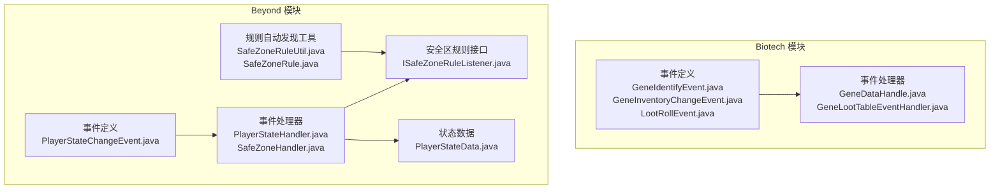
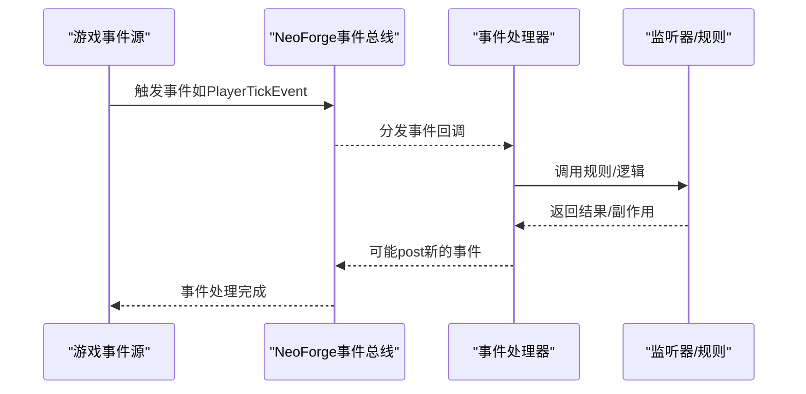
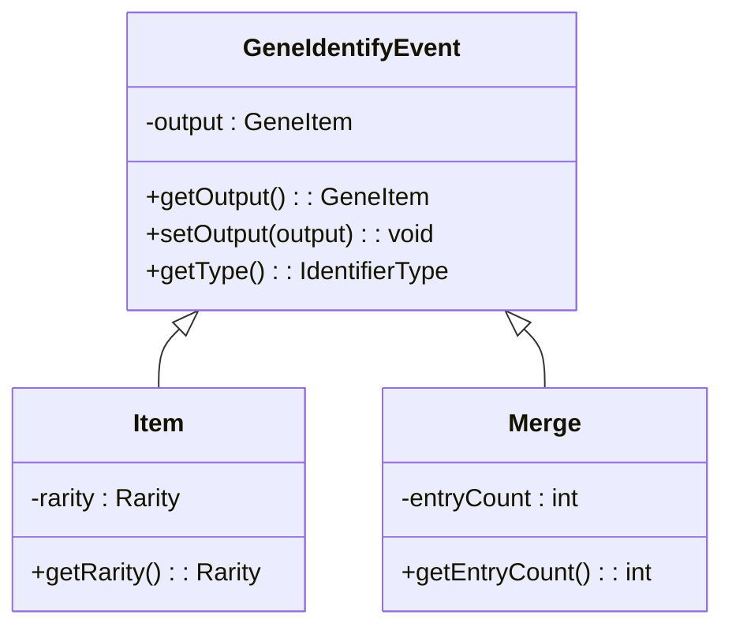
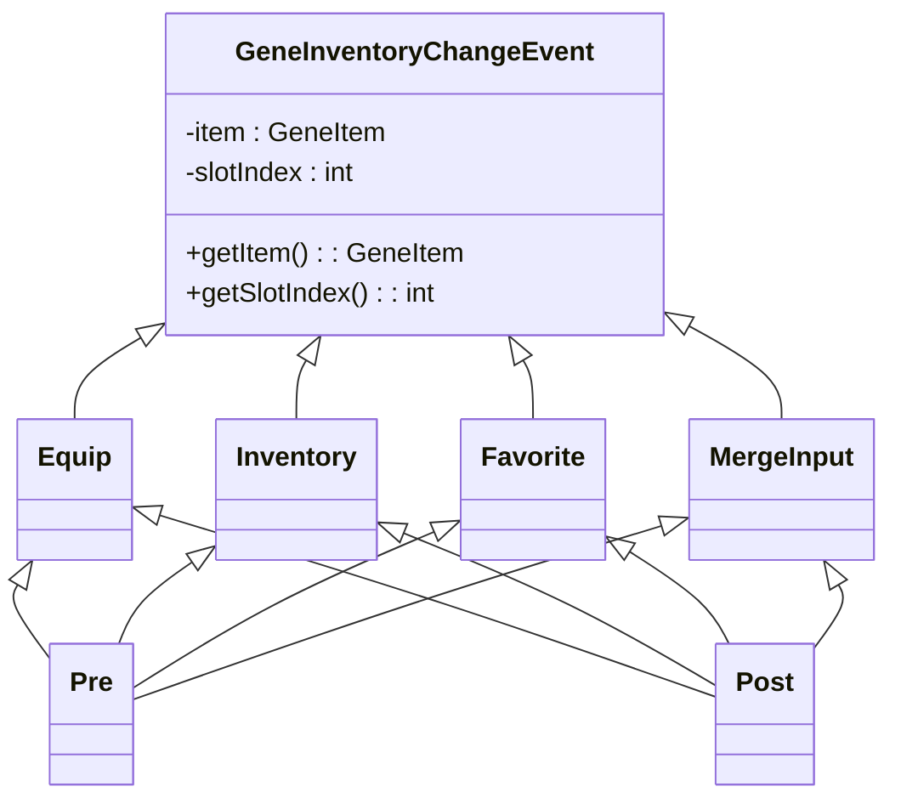
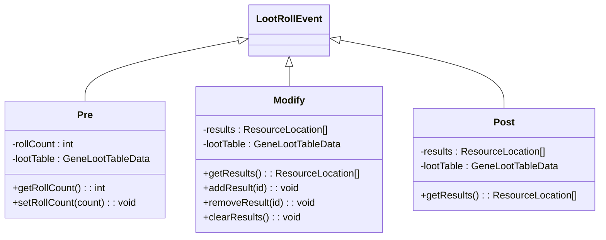
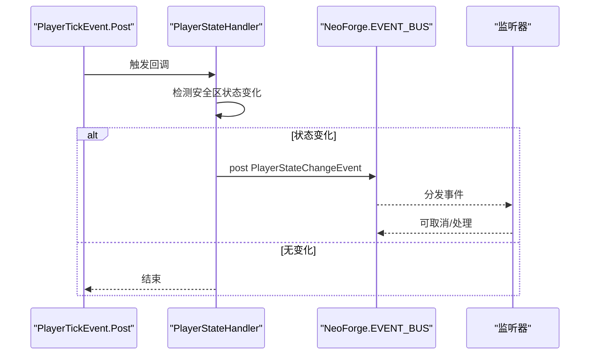
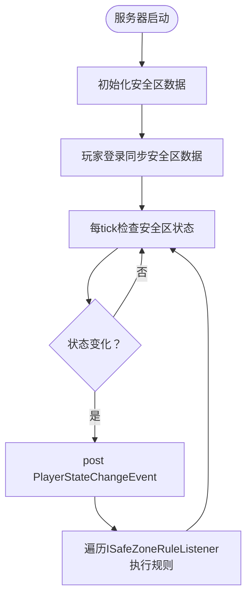
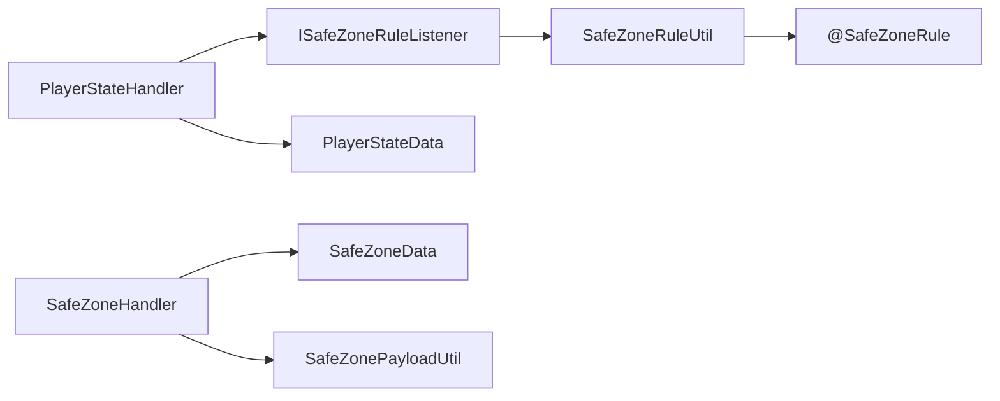

# 事件系统API

<cite>
**本文档引用的文件**
- [GeneIdentifyEvent.java](file://Biotech/src/main/java/org/biotech/api/event/custom/GeneIdentifyEvent.java)
- [GeneInventoryChangeEvent.java](file://Biotech/src/main/java/org/biotech/api/event/custom/GeneInventoryChangeEvent.java)
- [LootRollEvent.java](file://Biotech/src/main/java/org/biotech/api/event/custom/LootRollEvent.java)
- [PlayerStateChangeEvent.java](file://Beyond/src/main/java/com/pz/beyond/event/custom/PlayerStateChangeEvent.java)
- [PlayerStateHandler.java](file://Beyond/src/main/java/com/pz/beyond/event/PlayerStateHandler.java)
- [SafeZoneHandler.java](file://Beyond/src/main/java/com/pz/beyond/event/SafeZoneHandler.java)
- [ISafeZoneRuleListener.java](file://Beyond/src/main/java/com/pz/beyond/safeZoneRule/ISafeZoneRuleListener.java)
- [SafeZoneRuleUtil.java](file://Beyond/src/main/java/com/pz/beyond/util/SafeZoneRuleUtil.java)
- [SafeZoneRule.java](file://Beyond/src/main/java/com/pz/beyond/safeZoneRule/SafeZoneRule.java)
- [PlayerStateData.java](file://Beyond/src/main/java/com/pz/beyond/data/PlayerStateData.java)
- [GeneDataHandle.java](file://Biotech/src/main/java/org/biotech/api/event/handle/GeneDataHandle.java)
- [GeneLootTableEventHandler.java](file://Biotech/src/main/java/org/biotech/api/event/handle/GeneLootTableEventHandler.java)
</cite>

## 目录
1. [简介](#简介)
2. [项目结构](#项目结构)
3. [核心组件](#核心组件)
4. [架构总览](#架构总览)
5. [详细组件分析](#详细组件分析)
6. [依赖关系分析](#依赖关系分析)
7. [性能考量](#性能考量)
8. [故障排除指南](#故障排除指南)
9. [结论](#结论)
10. [附录](#附录)

## 简介
本文件系统性地文档化了事件系统API，涵盖以下内容：
- 自定义事件的定义与触发机制：包括基因系统事件（GeneIdentifyEvent、GeneInventoryChangeEvent、LootRollEvent）与安全区事件（PlayerStateChangeEvent）。
- 事件处理器的注册与执行流程：重点解析PlayerStateHandler与SafeZoneHandler的实现原理及与安全区规则接口的协作方式。
- 事件生命周期、优先级与传播机制：基于NeoForge事件总线的订阅与发布模型进行说明。
- 实战示例路径：提供如何定义自定义事件、注册监听器与处理响应的参考路径。
- 性能优化建议与最佳实践：结合事件频率、可取消性与监听器数量进行指导。
- 调试与故障排除：定位事件未触发、监听器失效、规则未生效等问题的方法。

## 项目结构
事件系统主要分布在两个模块中：
- Biotech模块：提供基因系统的自定义事件与事件处理器，如基因识别、库存变更、战利品抽取等。
- Beyond模块：提供安全区相关的事件与处理器，如玩家状态变更、安全区规则监听器等。

图表来源
- [GeneIdentifyEvent.java:1-108](file://Biotech/src/main/java/org/biotech/api/event/custom/GeneIdentifyEvent.java#L1-L108)
- [GeneInventoryChangeEvent.java:1-124](file://Biotech/src/main/java/org/biotech/api/event/custom/GeneInventoryChangeEvent.java#L1-L124)
- [LootRollEvent.java:1-143](file://Biotech/src/main/java/org/biotech/api/event/custom/LootRollEvent.java#L1-L143)
- [PlayerStateChangeEvent.java:1-70](file://Beyond/src/main/java/com/pz/beyond/event/custom/PlayerStateChangeEvent.java#L1-L70)
- [PlayerStateHandler.java:1-80](file://Beyond/src/main/java/com/pz/beyond/event/PlayerStateHandler.java#L1-L80)
- [SafeZoneHandler.java:1-77](file://Beyond/src/main/java/com/pz/beyond/event/SafeZoneHandler.java#L1-L77)
- [ISafeZoneRuleListener.java:1-42](file://Beyond/src/main/java/com/pz/beyond/safeZoneRule/ISafeZoneRuleListener.java#L1-L42)
- [SafeZoneRuleUtil.java:1-54](file://Beyond/src/main/java/com/pz/beyond/util/SafeZoneRuleUtil.java#L1-L54)
- [SafeZoneRule.java:1-12](file://Beyond/src/main/java/com/pz/beyond/safeZoneRule/SafeZoneRule.java#L1-L12)
- [PlayerStateData.java:1-65](file://Beyond/src/main/java/com/pz/beyond/data/PlayerStateData.java#L1-L65)

章节来源
- [GeneIdentifyEvent.java:1-108](file://Biotech/src/main/java/org/biotech/api/event/custom/GeneIdentifyEvent.java#L1-L108)
- [GeneInventoryChangeEvent.java:1-124](file://Biotech/src/main/java/org/biotech/api/event/custom/GeneInventoryChangeEvent.java#L1-L124)
- [LootRollEvent.java:1-143](file://Biotech/src/main/java/org/biotech/api/event/custom/LootRollEvent.java#L1-L143)
- [PlayerStateChangeEvent.java:1-70](file://Beyond/src/main/java/com/pz/beyond/event/custom/PlayerStateChangeEvent.java#L1-L70)
- [PlayerStateHandler.java:1-80](file://Beyond/src/main/java/com/pz/beyond/event/PlayerStateHandler.java#L1-L80)
- [SafeZoneHandler.java:1-77](file://Beyond/src/main/java/com/pz/beyond/event/SafeZoneHandler.java#L1-L77)
- [ISafeZoneRuleListener.java:1-42](file://Beyond/src/main/java/com/pz/beyond/safeZoneRule/ISafeZoneRuleListener.java#L1-L42)
- [SafeZoneRuleUtil.java:1-54](file://Beyond/src/main/java/com/pz/beyond/util/SafeZoneRuleUtil.java#L1-L54)
- [SafeZoneRule.java:1-12](file://Beyond/src/main/java/com/pz/beyond/safeZoneRule/SafeZoneRule.java#L1-L12)
- [PlayerStateData.java:1-65](file://Beyond/src/main/java/com/pz/beyond/data/PlayerStateData.java#L1-L65)

## 核心组件
本节概述三大类事件及其关键属性：
- 基因识别事件（GeneIdentifyEvent）
  - 类型：Item（输入稀有度）、Merge（输入词条数量）
  - 可修改输出：监听器可调整最终基因产物
- 基因库存变更事件（GeneInventoryChangeEvent）
  - 类型：Equip（装备）、Inventory（背包）、Favorite（收藏）、MergeInput（合并输入）
  - 生命周期：Pre（前置，可取消）、Post（后置）
- 战利品抽取事件（LootRollEvent）
  - 阶段：Pre（前置，可修改抽取次数）、Modify（后置，可修改结果）、Post（完成，只读）

章节来源
- [GeneIdentifyEvent.java:16-107](file://Biotech/src/main/java/org/biotech/api/event/custom/GeneIdentifyEvent.java#L16-L107)
- [GeneInventoryChangeEvent.java:13-123](file://Biotech/src/main/java/org/biotech/api/event/custom/GeneInventoryChangeEvent.java#L13-L123)
- [LootRollEvent.java:19-142](file://Biotech/src/main/java/org/biotech/api/event/custom/LootRollEvent.java#L19-L142)

## 架构总览
事件系统基于NeoForge事件总线，采用“事件定义 + 订阅者（处理器）”的模式：
- 事件定义：位于各自模块的event.custom包中，继承PlayerEvent或Event，部分事件实现ICancellableEvent以支持取消。
- 订阅者：在EventBusSubscriber标注的类中，使用@SubscribeEvent注册回调。
- 规则扩展：Beyond模块通过注解扫描自动收集ISafeZoneRuleListener实现，形成可插拔的安全区规则体系。

图表来源
- [PlayerStateHandler.java:26-66](file://Beyond/src/main/java/com/pz/beyond/event/PlayerStateHandler.java#L26-L66)
- [SafeZoneHandler.java:44-76](file://Beyond/src/main/java/com/pz/beyond/event/SafeZoneHandler.java#L44-L76)
- [ISafeZoneRuleListener.java:13-41](file://Beyond/src/main/java/com/pz/beyond/safeZoneRule/ISafeZoneRuleListener.java#L13-L41)

## 详细组件分析

### 基因识别事件（GeneIdentifyEvent）
- 设计要点
  - 抽象父类封装通用字段（输出基因产物），子类区分两种输入类型（稀有度/词条数）。
  - 输出可由监听器修改，不支持取消。
- 典型使用场景
  - 在物品合成或合并过程中，允许其他模组/功能根据输入参数动态调整产出。
- 监听器注册
  - 使用@EventBusSubscriber与@SubscribeEvent在目标模块中注册监听方法。

图表来源
- [GeneIdentifyEvent.java:16-107](file://Biotech/src/main/java/org/biotech/api/event/custom/GeneIdentifyEvent.java#L16-L107)

章节来源
- [GeneIdentifyEvent.java:16-107](file://Biotech/src/main/java/org/biotech/api/event/custom/GeneIdentifyEvent.java#L16-L107)

### 基因库存变更事件（GeneInventoryChangeEvent）
- 设计要点
  - 四种变更类型，每种均提供Pre（可取消）与Post（只读）。
  - 通过ICancellableEvent实现可取消能力，便于在前置阶段阻止不当操作。
- 典型使用场景
  - 装备/卸下基因、背包增删改、收藏切换、合并输入槽位变更。
- 监听器注册
  - 在Biotech模块中通过EventBusSubscriber注册，监听对应Pre/Post事件。

图表来源
- [GeneInventoryChangeEvent.java:13-123](file://Biotech/src/main/java/org/biotech/api/event/custom/GeneInventoryChangeEvent.java#L13-L123)

章节来源
- [GeneInventoryChangeEvent.java:13-123](file://Biotech/src/main/java/org/biotech/api/event/custom/GeneInventoryChangeEvent.java#L13-L123)

### 战利品抽取事件（LootRollEvent）
- 设计要点
  - 三阶段：Pre（修改抽取次数）、Modify（修改结果列表）、Post（只读完成态）。
  - Modify阶段提供add/remove/clear等便捷方法，便于灵活调整掉落。
- 典型使用场景
  - 动态调整基因战利品表的掉落权重、批量增删掉落项。
- 监听器注册
  - 在Biotech模块中通过EventBusSubscriber注册，按阶段监听对应事件。

图表来源
- [LootRollEvent.java:19-142](file://Biotech/src/main/java/org/biotech/api/event/custom/LootRollEvent.java#L19-L142)

章节来源
- [LootRollEvent.java:19-142](file://Biotech/src/main/java/org/biotech/api/event/custom/LootRollEvent.java#L19-L142)

### 玩家状态变更事件（PlayerStateChangeEvent）
- 设计要点
  - 继承Event并实现ICancellableEvent，表示可取消。
  - 携带fromState与toState，便于监听器在状态切换前后执行逻辑。
- 触发时机
  - PlayerStateHandler在每tick检查玩家是否进入/离开安全区，必要时post事件并广播网络消息。
- 监听器注册
  - 通过@EventBusSubscriber在目标模块中注册监听方法。

图表来源
- [PlayerStateHandler.java:26-66](file://Beyond/src/main/java/com/pz/beyond/event/PlayerStateHandler.java#L26-L66)
- [PlayerStateChangeEvent.java:15-69](file://Beyond/src/main/java/com/pz/beyond/event/custom/PlayerStateChangeEvent.java#L15-L69)

章节来源
- [PlayerStateChangeEvent.java:15-69](file://Beyond/src/main/java/com/pz/beyond/event/custom/PlayerStateChangeEvent.java#L15-L69)
- [PlayerStateHandler.java:26-66](file://Beyond/src/main/java/com/pz/beyond/event/PlayerStateHandler.java#L26-L66)

### 安全区规则与处理器（SafeZoneHandler、PlayerStateHandler）
- SafeZoneHandler
  - 负责服务端启动时初始化安全区数据、玩家登录时同步安全区信息、以及生物生成位置检查。
- PlayerStateHandler
  - 每tick检查玩家是否进入/离开安全区，维护PlayerStateData状态，并在状态变化时post PlayerStateChangeEvent。
  - 对伤害事件应用安全区规则（如无敌）。
- 规则自动发现
  - SafeZoneRuleUtil通过扫描注解@SafeZoneRule自动收集ISafeZoneRuleListener实现，形成规则列表供处理器统一调度。

图表来源
- [SafeZoneHandler.java:44-76](file://Beyond/src/main/java/com/pz/beyond/event/SafeZoneHandler.java#L44-L76)
- [PlayerStateHandler.java:26-66](file://Beyond/src/main/java/com/pz/beyond/event/PlayerStateHandler.java#L26-L66)
- [SafeZoneRuleUtil.java:13-48](file://Beyond/src/main/java/com/pz/beyond/util/SafeZoneRuleUtil.java#L13-L48)
- [ISafeZoneRuleListener.java:13-41](file://Beyond/src/main/java/com/pz/beyond/safeZoneRule/ISafeZoneRuleListener.java#L13-L41)

章节来源
- [SafeZoneHandler.java:35-76](file://Beyond/src/main/java/com/pz/beyond/event/SafeZoneHandler.java#L35-L76)
- [PlayerStateHandler.java:21-79](file://Beyond/src/main/java/com/pz/beyond/event/PlayerStateHandler.java#L21-L79)
- [SafeZoneRuleUtil.java:11-54](file://Beyond/src/main/java/com/pz/beyond/util/SafeZoneRuleUtil.java#L11-L54)
- [ISafeZoneRuleListener.java:13-41](file://Beyond/src/main/java/com/pz/beyond/safeZoneRule/ISafeZoneRuleListener.java#L13-L41)

### 事件生命周期、优先级与传播机制
- 生命周期
  - 基因事件：由业务逻辑触发（例如玩家操作、数据包加载），监听器在同一线程顺序执行。
  - 安全区事件：由NeoForge事件驱动（Tick、Damage、Spawn等），处理器在相应事件回调中分发。
- 优先级
  - 本仓库未显式设置优先级；默认遵循NeoForge事件总线的注册顺序。
- 传播机制
  - 事件通过NeoForge.EVENT_BUS.post传播至所有已注册的监听器。
  - 对于可取消事件（如Pre/ICancellableEvent），监听器可通过取消阻止后续处理。

章节来源
- [PlayerStateHandler.java:26-76](file://Beyond/src/main/java/com/pz/beyond/event/PlayerStateHandler.java#L26-L76)
- [SafeZoneHandler.java:44-76](file://Beyond/src/main/java/com/pz/beyond/event/SafeZoneHandler.java#L44-L76)
- [GeneInventoryChangeEvent.java:41-110](file://Biotech/src/main/java/org/biotech/api/event/custom/GeneInventoryChangeEvent.java#L41-L110)
- [LootRollEvent.java:30-111](file://Biotech/src/main/java/org/biotech/api/event/custom/LootRollEvent.java#L30-L111)

### 实战示例（代码路径）
以下为常见任务的参考路径（请在对应文件中查看具体实现）：
- 定义自定义事件
  - [自定义事件基类与子类定义:16-107](file://Biotech/src/main/java/org/biotech/api/event/custom/GeneIdentifyEvent.java#L16-L107)
  - [自定义事件基类与子类定义:13-123](file://Biotech/src/main/java/org/biotech/api/event/custom/GeneInventoryChangeEvent.java#L13-L123)
  - [自定义事件基类与子类定义:19-142](file://Biotech/src/main/java/org/biotech/api/event/custom/LootRollEvent.java#L19-L142)
  - [自定义事件基类与子类定义:15-69](file://Beyond/src/main/java/com/pz/beyond/event/custom/PlayerStateChangeEvent.java#L15-L69)
- 注册事件监听器
  - [在模块中注册监听器（示例：登录/重生/克隆）:10-39](file://Biotech/src/main/java/org/biotech/api/event/handle/GeneDataHandle.java#L10-L39)
  - [在模块中注册监听器（示例：数据包同步/登录）:14-33](file://Biotech/src/main/java/org/biotech/api/event/handle/GeneLootTableEventHandler.java#L14-L33)
  - [在模块中注册监听器（示例：安全区规则应用）:21-79](file://Beyond/src/main/java/com/pz/beyond/event/PlayerStateHandler.java#L21-L79)
  - [在模块中注册监听器（示例：服务端启动/登录/生成）:35-76](file://Beyond/src/main/java/com/pz/beyond/event/SafeZoneHandler.java#L35-L76)
- 处理事件响应
  - [在监听器中读取事件上下文并执行逻辑（示例：状态变更）:15-69](file://Beyond/src/main/java/com/pz/beyond/event/custom/PlayerStateChangeEvent.java#L15-L69)
  - [在监听器中读取事件上下文并执行逻辑（示例：库存变更）:13-123](file://Biotech/src/main/java/org/biotech/api/event/custom/GeneInventoryChangeEvent.java#L13-L123)
  - [在监听器中读取事件上下文并执行逻辑（示例：战利品抽取）:19-142](file://Biotech/src/main/java/org/biotech/api/event/custom/LootRollEvent.java#L19-L142)

章节来源
- [GeneDataHandle.java:10-39](file://Biotech/src/main/java/org/biotech/api/event/handle/GeneDataHandle.java#L10-L39)
- [GeneLootTableEventHandler.java:14-33](file://Biotech/src/main/java/org/biotech/api/event/handle/GeneLootTableEventHandler.java#L14-L33)
- [PlayerStateHandler.java:21-79](file://Beyond/src/main/java/com/pz/beyond/event/PlayerStateHandler.java#L21-L79)
- [SafeZoneHandler.java:35-76](file://Beyond/src/main/java/com/pz/beyond/event/SafeZoneHandler.java#L35-L76)
- [PlayerStateChangeEvent.java:15-69](file://Beyond/src/main/java/com/pz/beyond/event/custom/PlayerStateChangeEvent.java#L15-L69)
- [GeneInventoryChangeEvent.java:13-123](file://Biotech/src/main/java/org/biotech/api/event/custom/GeneInventoryChangeEvent.java#L13-L123)
- [LootRollEvent.java:19-142](file://Biotech/src/main/java/org/biotech/api/event/custom/LootRollEvent.java#L19-L142)

## 依赖关系分析
- 模块间耦合
  - Biotech模块的事件定义与处理器相对独立，仅依赖NeoForge事件总线。
  - Beyond模块的事件处理器依赖安全区规则接口与工具类，形成可插拔扩展。
- 关键依赖链
  - PlayerStateHandler → ISafeZoneRuleListener → SafeZoneRuleUtil（注解扫描）
  - SafeZoneHandler → SafeZoneData（持久化数据）→ SafeZonePayloadUtil（网络同步）
  - 事件处理器 → 附件/数据（如PlayerStateData、GeneData）→ 业务逻辑

图表来源
- [PlayerStateHandler.java:24-45](file://Beyond/src/main/java/com/pz/beyond/event/PlayerStateHandler.java#L24-L45)
- [ISafeZoneRuleListener.java:13-41](file://Beyond/src/main/java/com/pz/beyond/safeZoneRule/ISafeZoneRuleListener.java#L13-L41)
- [SafeZoneRuleUtil.java:13-48](file://Beyond/src/main/java/com/pz/beyond/util/SafeZoneRuleUtil.java#L13-L48)
- [SafeZoneRule.java:10-11](file://Beyond/src/main/java/com/pz/beyond/safeZoneRule/SafeZoneRule.java#L10-L11)
- [PlayerStateData.java:13-37](file://Beyond/src/main/java/com/pz/beyond/data/PlayerStateData.java#L13-L37)
- [SafeZoneHandler.java:44-67](file://Beyond/src/main/java/com/pz/beyond/event/SafeZoneHandler.java#L44-L67)

章节来源
- [PlayerStateHandler.java:24-45](file://Beyond/src/main/java/com/pz/beyond/event/PlayerStateHandler.java#L24-L45)
- [ISafeZoneRuleListener.java:13-41](file://Beyond/src/main/java/com/pz/beyond/safeZoneRule/ISafeZoneRuleListener.java#L13-L41)
- [SafeZoneRuleUtil.java:13-48](file://Beyond/src/main/java/com/pz/beyond/util/SafeZoneRuleUtil.java#L13-L48)
- [SafeZoneRule.java:10-11](file://Beyond/src/main/java/com/pz/beyond/safeZoneRule/SafeZoneRule.java#L10-L11)
- [PlayerStateData.java:13-37](file://Beyond/src/main/java/com/pz/beyond/data/PlayerStateData.java#L13-L37)
- [SafeZoneHandler.java:44-67](file://Beyond/src/main/java/com/pz/beyond/event/SafeZoneHandler.java#L44-L67)

## 性能考量
- 事件频率控制
  - PlayerTickEvent等高频事件应避免重型计算，尽量将复杂逻辑延迟或异步化。
- 监听器数量与开销
  - 安全区规则通过注解自动发现，需控制规则数量与单次规则执行成本。
- 可取消事件的短路
  - 对Pre阶段的可取消事件，尽早返回可减少后续处理开销。
- 数据访问优化
  - 通过附件（如PlayerStateData、GeneData）缓存常用数据，减少重复查询。

[本节为通用性能建议，无需特定文件来源]

## 故障排除指南
- 事件未触发
  - 检查是否正确使用@EventBusSubscriber与@SubscribeEvent。
  - 确认事件类型与监听器签名一致，且在正确的事件总线上注册。
  - 参考：[事件处理器注册示例:10-39](file://Biotech/src/main/java/org/biotech/api/event/handle/GeneDataHandle.java#L10-L39)
- 监听器无效
  - 确保模块ID正确（如Biotech.MODID），或使用全局事件总线。
  - 参考：[数据包同步处理器注册:14-33](file://Biotech/src/main/java/org/biotech/api/event/handle/GeneLootTableEventHandler.java#L14-L33)
- 规则未生效
  - 检查@SafeZoneRule注解是否正确标注在实现类上。
  - 确认SafeZoneRuleUtil的扫描流程未被过滤。
  - 参考：[规则自动发现与实例化:13-48](file://Beyond/src/main/java/com/pz/beyond/util/SafeZoneRuleUtil.java#L13-L48)
- 状态切换异常
  - 检查PlayerStateData的读写与缓存一致性。
  - 参考：[状态数据结构:13-61](file://Beyond/src/main/java/com/pz/beyond/data/PlayerStateData.java#L13-L61)
- 网络同步问题
  - 确认SafeZonePayloadUtil的同步逻辑与PacketDistributor使用正确。
  - 参考：[登录时同步安全区数据:61-67](file://Beyond/src/main/java/com/pz/beyond/event/SafeZoneHandler.java#L61-L67)

章节来源
- [GeneDataHandle.java:10-39](file://Biotech/src/main/java/org/biotech/api/event/handle/GeneDataHandle.java#L10-L39)
- [GeneLootTableEventHandler.java:14-33](file://Biotech/src/main/java/org/biotech/api/event/handle/GeneLootTableEventHandler.java#L14-L33)
- [SafeZoneRuleUtil.java:13-48](file://Beyond/src/main/java/com/pz/beyond/util/SafeZoneRuleUtil.java#L13-L48)
- [PlayerStateData.java:13-61](file://Beyond/src/main/java/com/pz/beyond/data/PlayerStateData.java#L13-L61)
- [SafeZoneHandler.java:61-67](file://Beyond/src/main/java/com/pz/beyond/event/SafeZoneHandler.java#L61-L67)

## 结论
本事件系统以清晰的事件分类与严格的生命周期管理为基础，结合可插拔的安全区规则机制，提供了高扩展性的事件处理框架。通过合理使用可取消事件、控制事件频率与监听器数量，可在保证功能灵活性的同时维持良好的性能表现。建议在实际开发中遵循本文档的最佳实践，并利用提供的示例路径快速集成自定义事件与处理器。

[本节为总结性内容，无需特定文件来源]

## 附录
- 相关数据结构与工具
  - [PlayerStateData：玩家状态编码与序列化:13-61](file://Beyond/src/main/java/com/pz/beyond/data/PlayerStateData.java#L13-L61)
  - [ISafeZoneRuleListener：安全区规则接口:13-41](file://Beyond/src/main/java/com/pz/beyond/safeZoneRule/ISafeZoneRuleListener.java#L13-L41)
  - [SafeZoneRuleUtil：规则自动发现工具:11-54](file://Beyond/src/main/java/com/pz/beyond/util/SafeZoneRuleUtil.java#L11-L54)
  - [SafeZoneRule：规则注解:10-11](file://Beyond/src/main/java/com/pz/beyond/safeZoneRule/SafeZoneRule.java#L10-L11)

章节来源
- [PlayerStateData.java:13-61](file://Beyond/src/main/java/com/pz/beyond/data/PlayerStateData.java#L13-L61)
- [ISafeZoneRuleListener.java:13-41](file://Beyond/src/main/java/com/pz/beyond/safeZoneRule/ISafeZoneRuleListener.java#L13-L41)
- [SafeZoneRuleUtil.java:11-54](file://Beyond/src/main/java/com/pz/beyond/util/SafeZoneRuleUtil.java#L11-L54)
- [SafeZoneRule.java:10-11](file://Beyond/src/main/java/com/pz/beyond/safeZoneRule/SafeZoneRule.java#L10-L11)