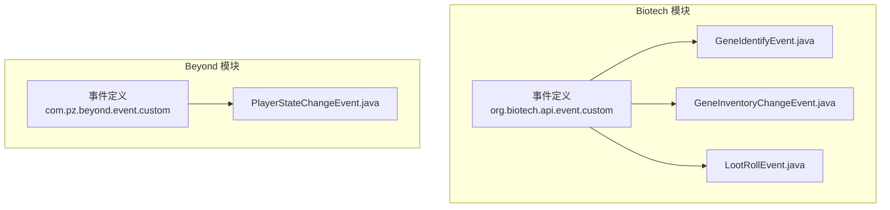
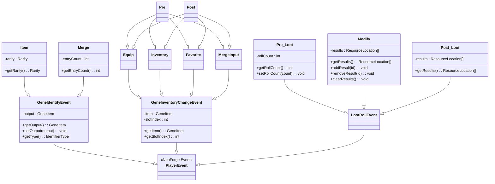
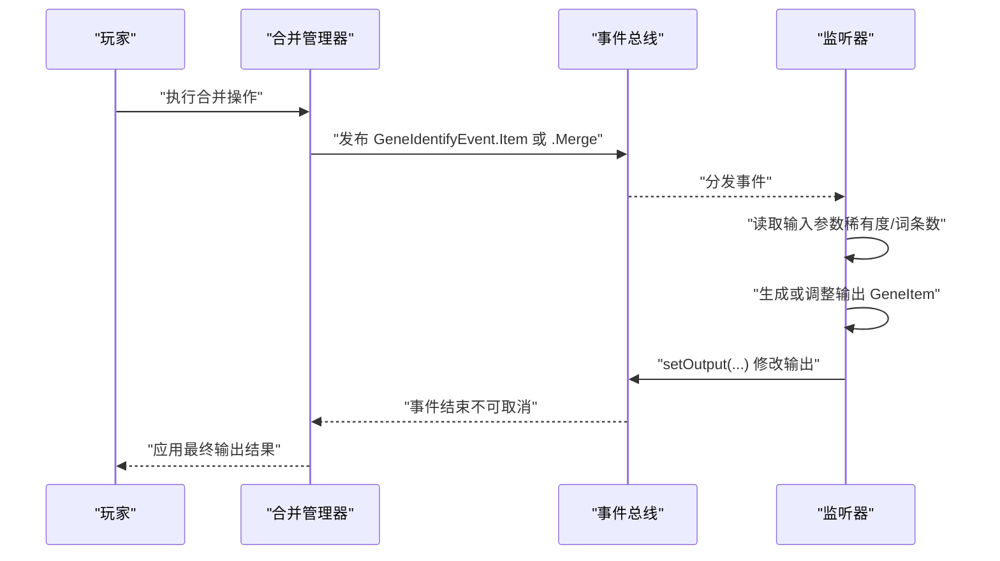
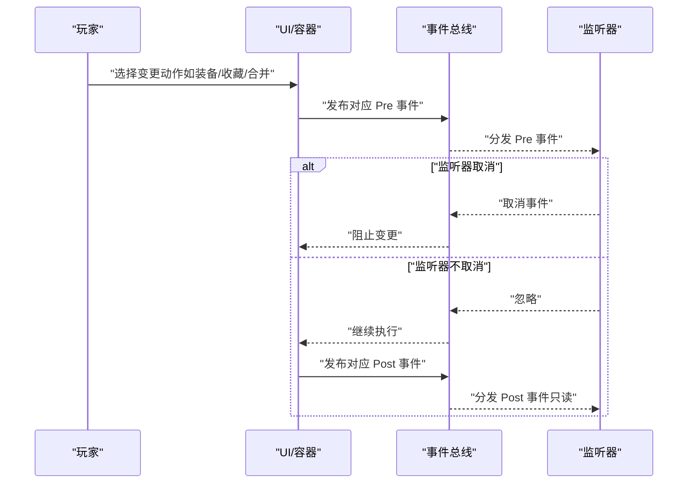
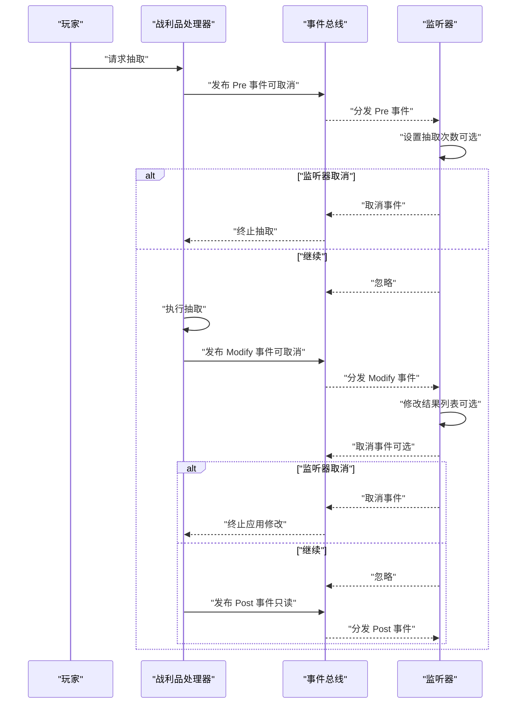
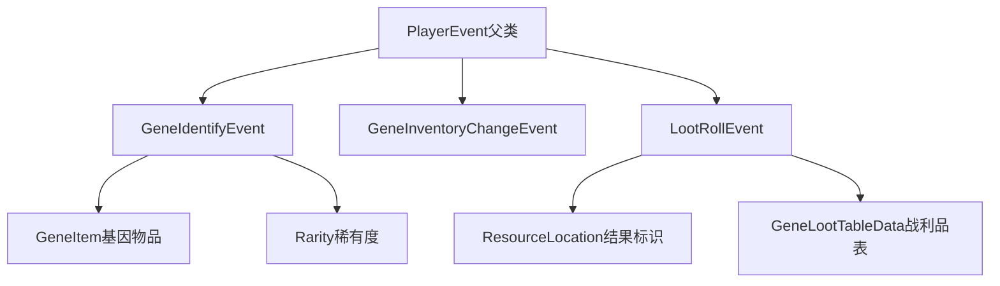

# 自定义事件定义

<cite>
**本文引用的文件**
- [GeneIdentifyEvent.java](file://Biotech/src/main/java/org/biotech/api/event/custom/GeneIdentifyEvent.java)
- [GeneInventoryChangeEvent.java](file://Biotech/src/main/java/org/biotech/api/event/custom/GeneInventoryChangeEvent.java)
- [LootRollEvent.java](file://Biotech/src/main/java/org/biotech/api/event/custom/LootRollEvent.java)
- [PlayerStateChangeEvent.java](file://Beyond/src/main/java/com/pz/beyond/event/custom/PlayerStateChangeEvent.java)
- [MergeManager.java](file://Biotech/src/main/java/org/biotech/api/system/merge/MergeManager.java)
- [GeneLootTableEventHandler.java](file://Biotech/src/main/java/org/biotech/api/event/handle/GeneLootTableEventHandler.java)
- [ModPackInit.java](file://Biotech/src/main/java/org/biotech/api/init/ModPackInit.java)
</cite>

## 目录
1. [简介](#简介)
2. [项目结构](#项目结构)
3. [核心组件](#核心组件)
4. [架构总览](#架构总览)
5. [详细组件分析](#详细组件分析)
6. [依赖分析](#依赖分析)
7. [性能考虑](#性能考虑)
8. [故障排查指南](#故障排查指南)
9. [结论](#结论)
10. [附录](#附录)

## 简介
本文件系统性地文档化了基因猎人子模块中的三类自定义事件：基因鉴定事件（GeneIdentifyEvent）、基因背包变更事件（GeneInventoryChangeEvent）与战利品抽取事件（LootRollEvent）。内容涵盖事件继承体系、参数与返回值、可修改输出、不可取消特性与监听器权限、IdentifierType枚举的用途与处理方式，以及事件触发时机与最佳实践。同时提供事件扩展建议与常见陷阱，帮助开发者正确集成与扩展。

## 项目结构
事件定义集中在 Biotech 模块的自定义事件包中，分别对应三大功能域：
- 基因系统：基因鉴定、背包变更、战利品系统
- Beyond 模块：玩家状态变更事件（对比参考）

图表来源
- [GeneIdentifyEvent.java:1-108](file://Biotech/src/main/java/org/biotech/api/event/custom/GeneIdentifyEvent.java#L1-L108)
- [GeneInventoryChangeEvent.java:1-124](file://Biotech/src/main/java/org/biotech/api/event/custom/GeneInventoryChangeEvent.java#L1-L124)
- [LootRollEvent.java:1-143](file://Biotech/src/main/java/org/biotech/api/event/custom/LootRollEvent.java#L1-L143)
- [PlayerStateChangeEvent.java:1-46](file://Beyond/src/main/java/com/pz/beyond/event/custom/PlayerStateChangeEvent.java#L1-L46)

章节来源
- [GeneIdentifyEvent.java:1-108](file://Biotech/src/main/java/org/biotech/api/event/custom/GeneIdentifyEvent.java#L1-L108)
- [GeneInventoryChangeEvent.java:1-124](file://Biotech/src/main/java/org/biotech/api/event/custom/GeneInventoryChangeEvent.java#L1-L124)
- [LootRollEvent.java:1-143](file://Biotech/src/main/java/org/biotech/api/event/custom/LootRollEvent.java#L1-L143)
- [PlayerStateChangeEvent.java:1-46](file://Beyond/src/main/java/com/pz/beyond/event/custom/PlayerStateChangeEvent.java#L1-L46)

## 核心组件
本节概述三大事件类的设计目标、继承关系与关键行为。

- 基因鉴定事件（GeneIdentifyEvent）
  - 继承自 PlayerEvent，不可取消，但允许监听器修改输出结果（输出为 GeneItem）。
  - 内部定义 IdentifierType 枚举，区分两种输入类型：ITEM（输入 Rarity）、MERGE（输入词条数量）。
  - 提供静态内部类 Item 与 Merge，分别封装对应输入参数与访问器。

- 基因背包变更事件（GeneInventoryChangeEvent）
  - 继承自 PlayerEvent，按变更类型细分为 Equip、Inventory、Favorite、MergeInput 四大类。
  - 每类均包含 Pre（可取消）与 Post（不可取消）两个阶段，用于在变更前后进行拦截或记录。
  - 参数包含 GeneItem 与槽位索引，便于定位具体操作对象。

- 战利品抽取事件（LootRollEvent）
  - 继承自 PlayerEvent，分为三个阶段：Pre（可取消，可修改抽取次数）、Modify（可取消，可修改输出结果）、Post（只读）。
  - 结果以 ResourceLocation 列表形式表示，支持增删改查与清空操作。

章节来源
- [GeneIdentifyEvent.java:8-42](file://Biotech/src/main/java/org/biotech/api/event/custom/GeneIdentifyEvent.java#L8-L42)
- [GeneInventoryChangeEvent.java:8-31](file://Biotech/src/main/java/org/biotech/api/event/custom/GeneInventoryChangeEvent.java#L8-L31)
- [LootRollEvent.java:11-23](file://Biotech/src/main/java/org/biotech/api/event/custom/LootRollEvent.java#L11-L23)

## 架构总览
下图展示了三大事件类的继承与组合关系，以及与父类 PlayerEvent 的关联。

图表来源
- [GeneIdentifyEvent.java:16-107](file://Biotech/src/main/java/org/biotech/api/event/custom/GeneIdentifyEvent.java#L16-L107)
- [GeneInventoryChangeEvent.java:13-123](file://Biotech/src/main/java/org/biotech/api/event/custom/GeneInventoryChangeEvent.java#L13-L123)
- [LootRollEvent.java:19-142](file://Biotech/src/main/java/org/biotech/api/event/custom/LootRollEvent.java#L19-L142)

## 详细组件分析

### 基因鉴定事件（GeneIdentifyEvent）
- 设计理念
  - 将“物品”与“合并”两类不同的输入模式抽象为统一的事件模型，通过 IdentifierType 进行区分。
  - 输出可由监听器修改，但事件本身不可取消，确保流程可控且可扩展。

- 关键参数与返回值
  - 输出：GeneItem（可通过 setOutput 修改）
  - 输入类型：IdentifierType（ITEM 或 MERGE）
  - ITEM 输入：Rarity（稀有度）
  - MERGE 输入：int（词条数量）

- 监听器权限
  - 不可取消；可修改输出（setOutput）。
  - IdentifierType 用于分支逻辑，决定监听器对输出的处理策略。

- 触发时机与使用示例（路径）
  - 合并系统中，当玩家尝试将多个未鉴定基因进行合并时，会触发相应事件（例如在合并管理器中）。
  - 示例路径参考：[合并管理器:1-43](file://Biotech/src/main/java/org/biotech/api/system/merge/MergeManager.java#L1-L43)

图表来源
- [GeneIdentifyEvent.java:16-42](file://Biotech/src/main/java/org/biotech/api/event/custom/GeneIdentifyEvent.java#L16-L42)
- [MergeManager.java:1-43](file://Biotech/src/main/java/org/biotech/api/system/merge/MergeManager.java#L1-L43)

章节来源
- [GeneIdentifyEvent.java:8-42](file://Biotech/src/main/java/org/biotech/api/event/custom/GeneIdentifyEvent.java#L8-L42)
- [MergeManager.java:1-43](file://Biotech/src/main/java/org/biotech/api/system/merge/MergeManager.java#L1-L43)

### 基因背包变更事件（GeneInventoryChangeEvent）
- 设计理念
  - 将“装备”“背包”“收藏”“合并输入”四类变更抽象为统一事件族，每类均提供 Pre（可取消）与 Post（不可取消）阶段。
  - 通过槽位索引与物品标识，精确控制变更范围。

- 关键参数与返回值
  - 参数：GeneItem、槽位索引（int）
  - Pre 阶段可取消；Post 阶段仅用于通知，不可修改。

- 监听器权限
  - Pre 可取消，适合在变更前进行校验或阻止。
  - Post 仅读，适合统计与日志。

- 触发时机与使用示例（路径）
  - 背包交互、装备切换、收藏变更、合并输入槽位变化等场景。
  - 示例路径参考：事件族结构定义见下方文件。

图表来源
- [GeneInventoryChangeEvent.java:32-53](file://Biotech/src/main/java/org/biotech/api/event/custom/GeneInventoryChangeEvent.java#L32-L53)
- [GeneInventoryChangeEvent.java:55-76](file://Biotech/src/main/java/org/biotech/api/event/custom/GeneInventoryChangeEvent.java#L55-L76)
- [GeneInventoryChangeEvent.java:78-99](file://Biotech/src/main/java/org/biotech/api/event/custom/GeneInventoryChangeEvent.java#L78-L99)
- [GeneInventoryChangeEvent.java:101-122](file://Biotech/src/main/java/org/biotech/api/event/custom/GeneInventoryChangeEvent.java#L101-L122)

章节来源
- [GeneInventoryChangeEvent.java:8-31](file://Biotech/src/main/java/org/biotech/api/event/custom/GeneInventoryChangeEvent.java#L8-L31)

### 战利品抽取事件（LootRollEvent）
- 设计理念
  - 将抽取过程拆分为三个阶段：Pre（可取消，可修改抽取次数）、Modify（可取消，可修改输出）、Post（只读）。
  - 通过阶段化设计，既保证灵活性，又避免后期篡改。

- 关键参数与返回值
  - Pre：可设置抽取次数（setRollCount），读取战利品表。
  - Modify：可增删改查结果列表（add/remove/clear），读取战利品表。
  - Post：只读结果列表（不可变副本）。

- 监听器权限
  - Pre/Modify 可取消；Post 不可取消且只读。

- 触发时机与使用示例（路径）
  - 数据包同步与玩家登录时，同步战利品表；随后在抽取流程中触发上述阶段事件。
  - 示例路径参考：
    - [战利品表同步处理器:14-33](file://Biotech/src/main/java/org/biotech/api/event/handle/GeneLootTableEventHandler.java#L14-L33)
    - [数据包重载注册:10-16](file://Biotech/src/main/java/org/biotech/api/init/ModPackInit.java#L10-L16)

图表来源
- [LootRollEvent.java:25-60](file://Biotech/src/main/java/org/biotech/api/event/custom/LootRollEvent.java#L25-L60)
- [LootRollEvent.java:62-111](file://Biotech/src/main/java/org/biotech/api/event/custom/LootRollEvent.java#L62-L111)
- [LootRollEvent.java:113-141](file://Biotech/src/main/java/org/biotech/api/event/custom/LootRollEvent.java#L113-L141)
- [GeneLootTableEventHandler.java:14-33](file://Biotech/src/main/java/org/biotech/api/event/handle/GeneLootTableEventHandler.java#L14-L33)
- [ModPackInit.java:10-16](file://Biotech/src/main/java/org/biotech/api/init/ModPackInit.java#L10-L16)

章节来源
- [LootRollEvent.java:11-23](file://Biotech/src/main/java/org/biotech/api/event/custom/LootRollEvent.java#L11-L23)

### IdentifierType 枚举与处理方式
- 作用
  - 统一区分“物品鉴定”与“合并鉴定”的输入模式，便于监听器根据类型采取不同策略。
- 处理方式
  - 在事件中通过 getType() 返回对应枚举值，监听器据此读取相应输入参数（Rarity 或词条数量）并生成/调整输出。

章节来源
- [GeneIdentifyEvent.java:96-107](file://Biotech/src/main/java/org/biotech/api/event/custom/GeneIdentifyEvent.java#L96-L107)

### 事件类型分类与继承体系
- 共同点
  - 均继承自 PlayerEvent，绑定到玩家实体，便于上下文访问。
- 分类
  - 不可取消事件：GeneIdentifyEvent（输出可修改）
  - 可取消事件：Pre 阶段（Equip/Inventory/Favorite/MergeInput 与 LootRollEvent 的 Pre/Modify）
  - 只读事件：Post 阶段（Equip/Inventory/Favorite/MergeInput 与 LootRollEvent 的 Post）

章节来源
- [GeneIdentifyEvent.java:16-23](file://Biotech/src/main/java/org/biotech/api/event/custom/GeneIdentifyEvent.java#L16-L23)
- [GeneInventoryChangeEvent.java:41-44](file://Biotech/src/main/java/org/biotech/api/event/custom/GeneInventoryChangeEvent.java#L41-L44)
- [LootRollEvent.java:30-38](file://Biotech/src/main/java/org/biotech/api/event/custom/LootRollEvent.java#L30-L38)
- [LootRollEvent.java:67-75](file://Biotech/src/main/java/org/biotech/api/event/custom/LootRollEvent.java#L67-L75)

## 依赖分析
- 事件与父类关系
  - 所有事件均继承自 PlayerEvent，确保与 NeoForge 事件总线兼容。
- 事件与外部类型
  - 基因事件依赖 GeneItem（基因物品）。
  - 战利品事件依赖 GeneLootTableData 与 ResourceLocation（战利品表与结果标识）。
  - 合并事件依赖 Rarity（稀有度）。
- 事件与系统模块
  - 合并系统（MergeManager）与战利品系统（LootPack、数据包重载）与事件存在交互。

图表来源
- [GeneIdentifyEvent.java:3-6](file://Biotech/src/main/java/org/biotech/api/event/custom/GeneIdentifyEvent.java#L3-L6)
- [LootRollEvent.java:3-7](file://Biotech/src/main/java/org/biotech/api/event/custom/LootRollEvent.java#L3-L7)

章节来源
- [GeneIdentifyEvent.java:3-6](file://Biotech/src/main/java/org/biotech/api/event/custom/GeneIdentifyEvent.java#L3-L6)
- [LootRollEvent.java:3-7](file://Biotech/src/main/java/org/biotech/api/event/custom/LootRollEvent.java#L3-L7)

## 性能考虑
- 事件粒度与开销
  - 背包变更事件包含 Pre/Post 双阶段，监听器应避免在 Post 中执行重型操作。
  - 战利品 Modify 阶段允许修改结果列表，建议批量操作并减少重复遍历。
- 取消决策成本
  - Pre 阶段的取消判断应尽量轻量，避免阻塞主线程。
- 数据一致性
  - 合并与战利品流程中，监听器对输出的修改需与后续流程保持一致，避免产生悬挂状态。

## 故障排查指南
- 事件未触发
  - 确认事件是否在正确的流程节点发布（如合并管理器、战利品抽取流程）。
  - 检查监听器是否注册到正确的 EventBus（主事件总线或模组事件总线）。
- 监听器无效
  - 对于不可取消事件（如 GeneIdentifyEvent），监听器只能修改输出，不能阻止流程。
  - 对于只读 Post 阶段（如 LootRollEvent.Post），监听器无法修改结果。
- 数据包同步问题
  - 战利品表需要在数据包重载后同步至客户端，检查数据包注册与同步逻辑。

章节来源
- [GeneLootTableEventHandler.java:14-33](file://Biotech/src/main/java/org/biotech/api/event/handle/GeneLootTableEventHandler.java#L14-L33)
- [ModPackInit.java:10-16](file://Biotech/src/main/java/org/biotech/api/init/ModPackInit.java#L10-L16)

## 结论
本文件系统化梳理了基因猎人项目中的三大自定义事件：基因鉴定、基因背包变更与战利品抽取。通过清晰的继承体系、阶段化设计与明确的监听器权限，这些事件在保证流程可控的同时提供了强大的扩展能力。建议在开发中遵循不可取消事件仅修改输出、Pre 阶段谨慎取消、Post 阶段只读的原则，并结合 IdentifierType 与事件族结构进行模块化扩展。

## 附录
- 对比参考：Beyond 模块的玩家状态变更事件（PlayerStateChangeEvent）同样继承自 Event 并实现了 ICancellableEvent，可用于理解不同事件类型的取消语义差异。
  
章节来源
- [PlayerStateChangeEvent.java:15-46](file://Beyond/src/main/java/com/pz/beyond/event/custom/PlayerStateChangeEvent.java#L15-L46)