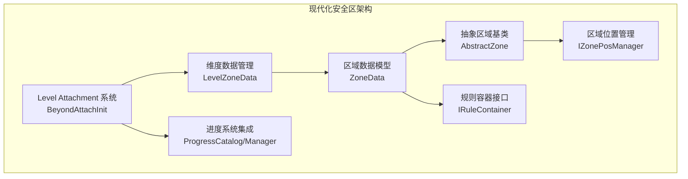
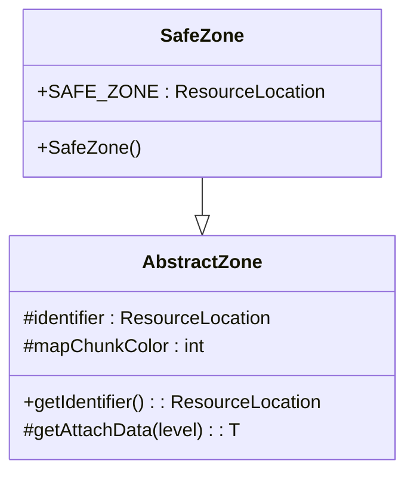
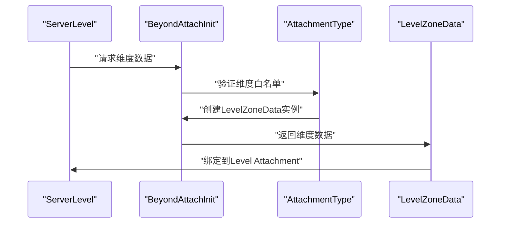
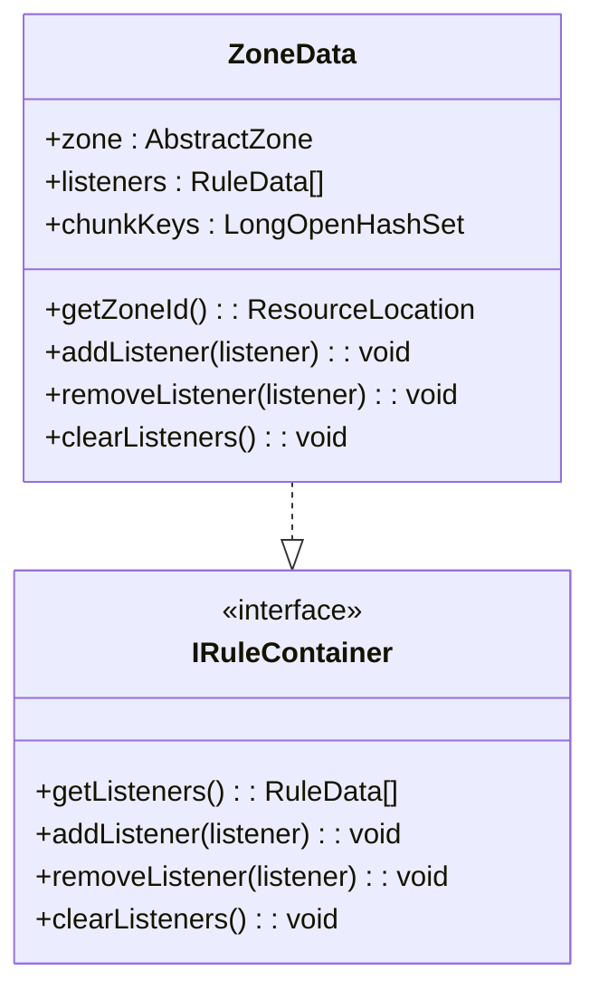
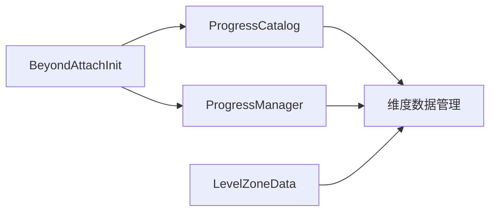
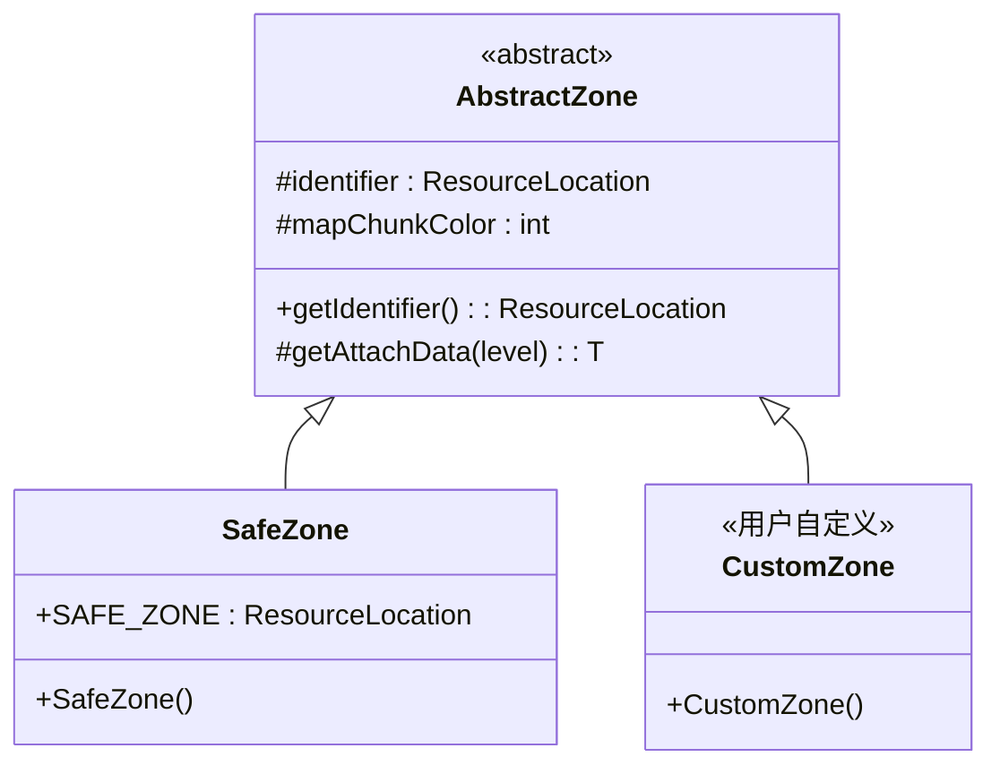

# 安全区API接口

<cite>
**本文引用的文件**
- [SafeZone.java](file://Beyond/src/main/java/com/pz/beyond/api/system/zone/zones/SafeZone.java)
- [AbstractZone.java](file://Beyond/src/main/java/com/pz/beyond/api/system/zone/AbstractZone.java)
- [BeyondAttachInit.java](file://Beyond/src/main/java/com/pz/beyond/api/init/BeyondAttachInit.java)
- [LevelZoneData.java](file://Beyond/src/main/java/com/pz/beyond/api/system/zone/LevelZoneData.java)
- [ZoneData.java](file://Beyond/src/main/java/com/pz/beyond/api/system/zone/ZoneData.java)
- [IZonePosManager.java](file://Beyond/src/main/java/com/pz/beyond/api/system/zone/core/IZonePosManager.java)
- [IRuleContainer.java](file://Beyond/src/main/java/com/pz/beyond/api/system/zone/core/IRuleContainer.java)
- [ProgressCatalog.java](file://Beyond/src/main/java/com/pz/beyond/api/system/progress/ProgressCatalog.java)
- [ProgressManager.java](file://Beyond/src/main/java/com/pz/beyond/api/system/progress/ProgressManager.java)
- [BeyondZoneInit.java](file://Beyond/src/main/java/com/pz/beyond/api/init/BeyondZoneInit.java)
- [BeyondZoneRuleInit.java](file://Beyond/src/main/java/com/pz/beyond/api/init/BeyondZoneRuleInit.java)
- [BeyondNodeEventTypes.java](file://Beyond/src/main/java/com/pz/beyond/api/init/BeyondNodeEventTypes.java)
- [BeyondEncounters.java](file://Beyond/src/main/java/com/pz/beyond/api/init/BeyondEncounters.java)
- [BeyondCapInit.java](file://Beyond/src/main/java/com/pz/beyond/api/init/BeyondCapInit.java)
- [BeyondAttachInit.java](file://Beyond/src/main/java/com/pz/beyond/api/init/BeyondAttachInit.java)
</cite>

## 更新摘要
**所做更改**
- 更新了安全区API接口的现代化架构，引入新的附件系统和维度数据管理
- 新增了基于Level Attachment的数据管理模式，支持维度级别的区域数据管理
- 扩展了ZoneData和LevelZoneData的数据结构，支持多维度区域管理
- 更新了ProgressCatalog和ProgressManager的集成架构
- 增强了区域系统的可扩展性和维度兼容性

## 目录
1. [简介](#简介)
2. [现代化架构概览](#现代化架构概览)
3. [核心组件](#核心组件)
4. [维度数据管理系统](#维度数据管理系统)
5. [区域数据模型](#区域数据模型)
6. [附件系统集成](#附件系统集成)
7. [扩展机制](#扩展机制)
8. [使用示例](#使用示例)
9. [最佳实践](#最佳实践)
10. [故障排查](#故障排查)

## 简介
本文档详细介绍了现代化的安全区API接口，该接口经过重大升级以支持新的附件系统和维度数据管理机制。新架构基于NeoForge的Attachment API，提供了更高效、更灵活的区域数据管理方式。

**更新重点**：
- 引入Level Attachment数据管理模式
- 支持多维度区域数据管理
- 增强了区域系统的可扩展性和性能
- 提供了完整的维度兼容性解决方案

## 现代化架构概览
新架构围绕"维度级数据管理 + 附件系统集成 + 规则容器模式"的核心理念设计：



**图表来源**
- [BeyondAttachInit.java:18-127](file://Beyond/src/main/java/com/pz/beyond/api/init/BeyondAttachInit.java#L18-L127)
- [LevelZoneData.java:24-87](file://Beyond/src/main/java/com/pz/beyond/api/system/zone/LevelZoneData.java#L24-L87)
- [ZoneData.java:22-124](file://Beyond/src/main/java/com/pz/beyond/api/system/zone/ZoneData.java#L22-L124)
- [AbstractZone.java:15-42](file://Beyond/src/main/java/com/pz/beyond/api/system/zone/AbstractZone.java#L15-L42)

## 核心组件

### SafeZone 类
新的SafeZone类继承自AbstractZone，提供了标准的安全区标识符：



**图表来源**
- [SafeZone.java:10-17](file://Beyond/src/main/java/com/pz/beyond/api/system/zone/zones/SafeZone.java#L10-L17)
- [AbstractZone.java:15-42](file://Beyond/src/main/java/com/pz/beyond/api/system/zone/AbstractZone.java#L15-L42)

**章节来源**
- [SafeZone.java:1-18](file://Beyond/src/main/java/com/pz/beyond/api/system/zone/zones/SafeZone.java#L1-L18)
- [AbstractZone.java:1-42](file://Beyond/src/main/java/com/pz/beyond/api/system/zone/AbstractZone.java#L1-L42)

### IRuleContainer 接口
定义了规则容器的标准接口，支持动态添加、移除和清理规则监听器：

**章节来源**
- [IRuleContainer.java:1-16](file://Beyond/src/main/java/com/pz/beyond/api/system/zone/core/IRuleContainer.java#L1-L16)

### IZonePosManager 接口
提供了区域位置管理的核心方法，支持安全区大小调整、区块生成和玩家活动区域管理：

**章节来源**
- [IZonePosManager.java:1-39](file://Beyond/src/main/java/com/pz/beyond/api/system/zone/core/IZonePosManager.java#L1-L39)

## 维度数据管理系统

### BeyondAttachInit 附件初始化器
新的附件系统提供了维度级别的数据管理能力：



**图表来源**
- [BeyondAttachInit.java:50-61](file://Beyond/src/main/java/com/pz/beyond/api/init/BeyondAttachInit.java#L50-L61)

**核心特性**：
- **维度白名单管理**：仅允许指定维度（如主世界）挂载数据
- **序列化支持**：通过CODEC和STREAM_CODEC实现数据持久化
- **网络同步**：支持客户端-服务器数据同步
- **延迟初始化**：按需创建维度数据实例

**章节来源**
- [BeyondAttachInit.java:18-127](file://Beyond/src/main/java/com/pz/beyond/api/init/BeyondAttachInit.java#L18-L127)

### LevelZoneData 数据模型
新的维度级区域数据管理模型：

**章节来源**
- [LevelZoneData.java:24-87](file://Beyond/src/main/java/com/pz/beyond/api/system/zone/LevelZoneData.java#L24-L87)

## 区域数据模型

### ZoneData 数据结构
ZoneData作为区域的核心数据载体，支持规则容器和区块键管理：



**图表来源**
- [ZoneData.java:22-124](file://Beyond/src/main/java/com/pz/beyond/api/system/zone/ZoneData.java#L22-L124)
- [IRuleContainer.java:7-15](file://Beyond/src/main/java/com/pz/beyond/api/system/zone/core/IRuleContainer.java#L7-L15)

**核心功能**：
- **规则管理**：动态管理区域规则监听器
- **区块跟踪**：使用LongOpenHashSet跟踪区域包含的区块
- **序列化支持**：完整的NBT序列化和网络传输支持
- **类型安全**：通过ResourceLocation确保区域类型安全

**章节来源**
- [ZoneData.java:1-124](file://Beyond/src/main/java/com/pz/beyond/api/system/zone/ZoneData.java#L1-L124)

## 附件系统集成

### 进度系统集成
新的架构无缝集成了进度管理系统：



**图表来源**
- [BeyondAttachInit.java:34-75](file://Beyond/src/main/java/com/pz/beyond/api/init/BeyondAttachInit.java#L34-L75)
- [ProgressCatalog.java:19-157](file://Beyond/src/main/java/com/pz/beyond/api/system/progress/ProgressCatalog.java#L19-L157)
- [ProgressManager.java:13-69](file://Beyond/src/main/java/com/pz/beyond/api/system/progress/ProgressManager.java#L13-L69)

**ProgressCatalog 功能**：
- **进度管理**：支持多个进度类型的存储和管理
- **节点数据**：维护节点静态数据映射
- **状态跟踪**：记录当前进度状态和激活的运行时数据
- **序列化优化**：提供高效的编码和流式编解码支持

**ProgressManager 控制逻辑**：
- **进度切换**：动态切换当前进度
- **进度创建**：支持动态创建新的进度类型
- **游戏启动**：协调游戏开始时的初始化流程

**章节来源**
- [ProgressCatalog.java:1-157](file://Beyond/src/main/java/com/pz/beyond/api/system/progress/ProgressCatalog.java#L1-L157)
- [ProgressManager.java:1-69](file://Beyond/src/main/java/com/pz/beyond/api/system/progress/ProgressManager.java#L1-L69)

## 扩展机制

### 区域系统扩展
新架构提供了强大的扩展能力：



**图表来源**
- [AbstractZone.java:15-42](file://Beyond/src/main/java/com/pz/beyond/api/system/zone/AbstractZone.java#L15-L42)
- [SafeZone.java:10-17](file://Beyond/src/main/java/com/pz/beyond/api/system/zone/zones/SafeZone.java#L10-L17)

**扩展步骤**：
1. 继承AbstractZone基类
2. 定义唯一的ResourceLocation标识符
3. 在BeyondZoneInit中注册区域类型
4. 实现自定义的区域行为

**章节来源**
- [AbstractZone.java:1-42](file://Beyond/src/main/java/com/pz/beyond/api/system/zone/AbstractZone.java#L1-L42)

### 规则系统集成
ZoneData实现了IRuleContainer接口，支持动态规则管理：

**章节来源**
- [ZoneData.java:22-124](file://Beyond/src/main/java/com/pz/beyond/api/system/zone/ZoneData.java#L22-L124)

## 使用示例

### 基础区域管理
```java
// 获取维度区域数据
LevelZoneData levelData = BeyondAttachInit.getLevelZoneData(world);
if (levelData != null) {
    // 添加安全区
    levelData.addSafeZone(10);
    
    // 管理区域规则
    ZoneData zoneData = new ZoneData(new SafeZone());
    zoneData.addListener(myRule);
}
```

### 进度系统集成
```java
// 设置当前进度
ProgressManager progressMgr = BeyondAttachInit.getProgressManager(world);
if (progressMgr != null) {
    progressMgr.setCurrentProgress(MyProgressType.ID);
    
    // 创建新进度
    progressMgr.createProgress(NewProgressType.ID, builder -> {
        builder.withName("新进度")
               .withDescription("进度描述");
    });
}
```

## 最佳实践

### 维度数据管理
- **白名单策略**：仅在允许的维度中启用区域数据管理
- **延迟初始化**：按需创建维度数据实例，避免内存浪费
- **数据同步**：确保维度数据在网络中的正确同步

### 区域系统设计
- **规则分离**：将不同类型的规则分离到独立的监听器中
- **性能优化**：使用LongOpenHashSet提高区块键查找性能
- **类型安全**：通过ResourceLocation确保区域类型的一致性

### 扩展开发
- **继承抽象类**：通过继承AbstractZone实现自定义区域
- **接口实现**：实现IZonePosManager提供区域位置管理功能
- **注册机制**：在BeyondZoneInit中注册自定义区域类型

## 故障排查

### 维度数据问题
- **检查维度白名单**：确认目标维度是否在ALLOWED_DIMENSIONS中
- **验证Attachment注册**：确保LEVEL_ZONE_DATA附件正确注册
- **调试数据访问**：使用getLevelZoneData方法验证数据获取

### 区域数据同步
- **检查序列化支持**：确认ZoneData和LevelZoneData的CODEC配置
- **验证网络编解码**：确保STREAM_CODEC正确实现
- **测试数据持久化**：验证NBT序列化和反序列化功能

### 规则系统问题
- **验证规则注册**：确认自定义规则正确实现IRuleContainer接口
- **检查监听器管理**：验证addListener和removeListener方法
- **调试规则执行**：使用日志跟踪规则执行流程

**章节来源**
- [BeyondAttachInit.java:78-127](file://Beyond/src/main/java/com/pz/beyond/api/init/BeyondAttachInit.java#L78-L127)
- [LevelZoneData.java:29-40](file://Beyond/src/main/java/com/pz/beyond/api/system/zone/LevelZoneData.java#L29-L40)
- [ZoneData.java:32-75](file://Beyond/src/main/java/com/pz/beyond/api/system/zone/ZoneData.java#L32-L75)