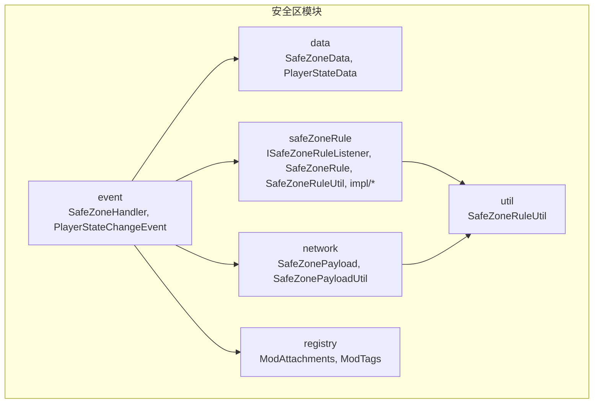
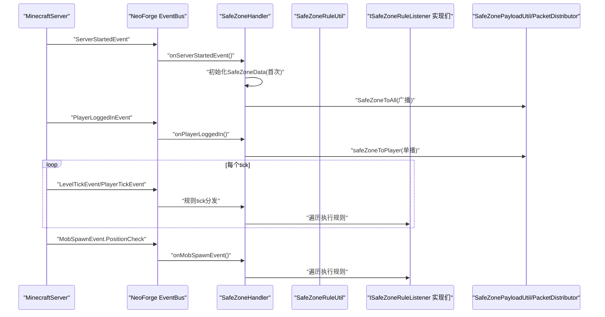
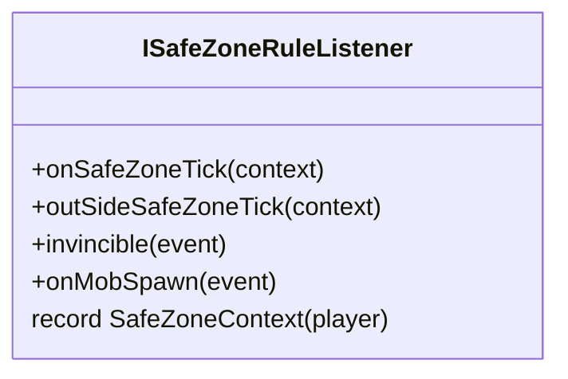
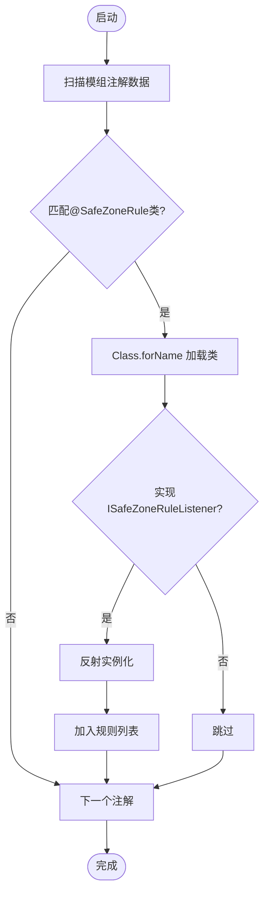
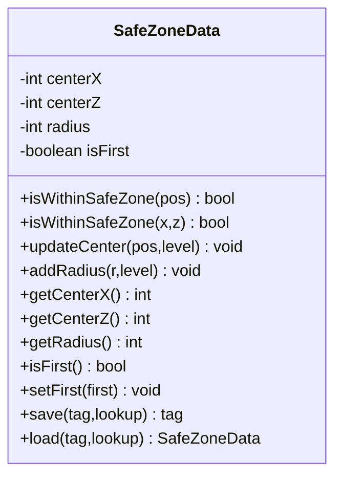
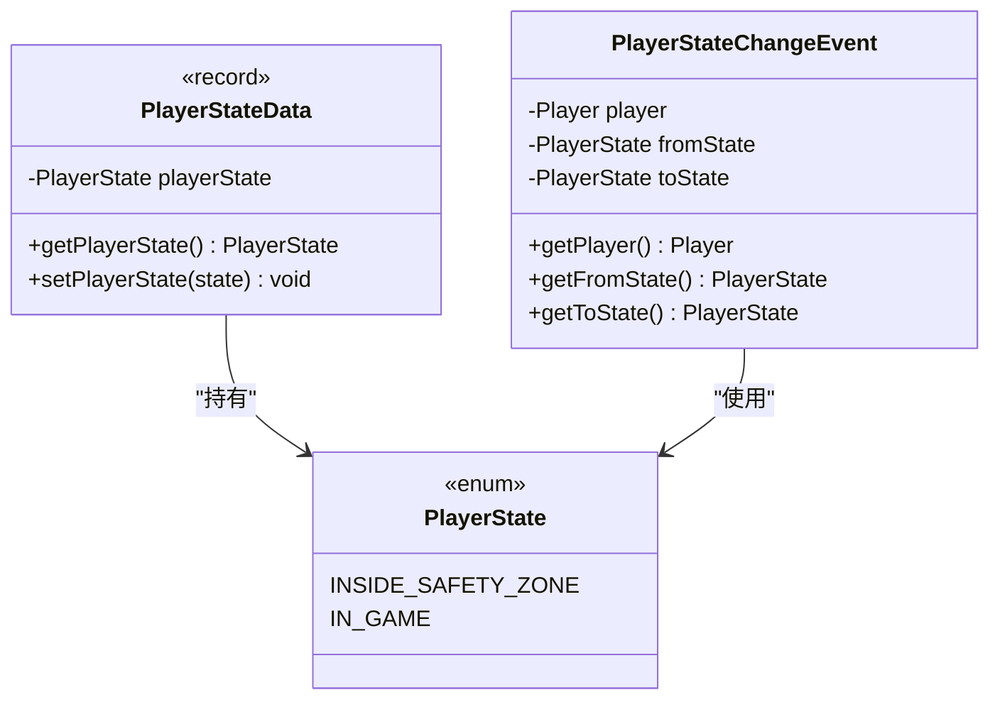
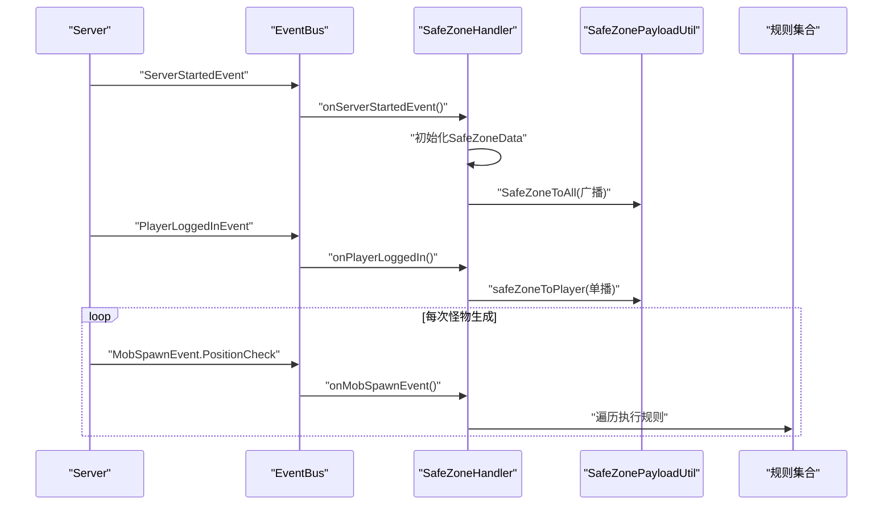
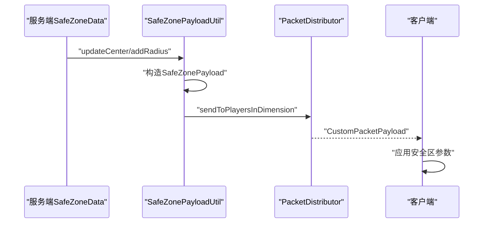
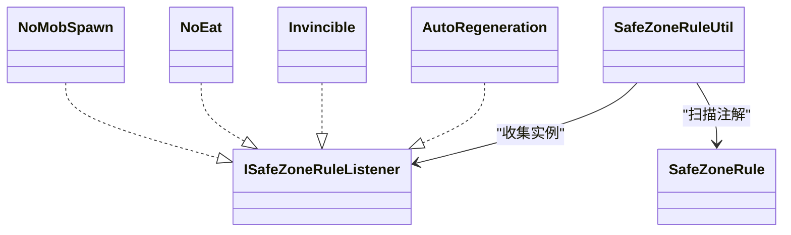
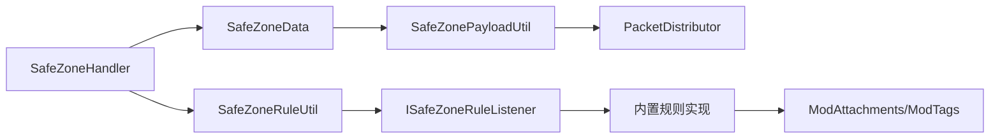

# 安全区API接口

<cite>
**本文引用的文件**
- [ISafeZoneRuleListener.java](file://Beyond/src/main/java/com/pz/beyond/safeZoneRule/ISafeZoneRuleListener.java)
- [SafeZoneRule.java](file://Beyond/src/main/java/com/pz/beyond/safeZoneRule/SafeZoneRule.java)
- [SafeZoneRuleUtil.java](file://Beyond/src/main/java/com/pz/beyond/util/SafeZoneRuleUtil.java)
- [SafeZoneData.java](file://Beyond/src/main/java/com/pz/beyond/data/SafeZoneData.java)
- [PlayerStateData.java](file://Beyond/src/main/java/com/pz/beyond/data/PlayerStateData.java)
- [PlayerStateChangeEvent.java](file://Beyond/src/main/java/com/pz/beyond/event/custom/PlayerStateChangeEvent.java)
- [SafeZoneHandler.java](file://Beyond/src/main/java/com/pz/beyond/event/SafeZoneHandler.java)
- [SafeZonePayload.java](file://Beyond/src/main/java/com/pz/beyond/network/SafeZonePayload.java)
- [SafeZonePayloadUtil.java](file://Beyond/src/main/java/com/pz/beyond/util/SafeZonePayloadUtil.java)
- [ModAttachments.java](file://Beyond/src/main/java/com/pz/beyond/registry/ModAttachments.java)
- [ModTags.java](file://Beyond/src/main/java/com/pz/beyond/registry/ModTags.java)
- [AutoRegeneration.java](file://Beyond/src/main/java/com/pz/beyond/safeZoneRule/impl/AutoRegeneration.java)
- [Invincible.java](file://Beyond/src/main/java/com/pz/beyond/safeZoneRule/impl/Invincible.java)
- [NoEat.java](file://Beyond/src/main/java/com/pz/beyond/safeZoneRule/impl/NoEat.java)
- [NoMobSpawn.java](file://Beyond/src/main/java/com/pz/beyond/safeZoneRule/impl/NoMobSpawn.java)
</cite>

## 目录
1. [简介](#简介)
2. [项目结构](#项目结构)
3. [核心组件](#核心组件)
4. [架构总览](#架构总览)
5. [详细组件分析](#详细组件分析)
6. [依赖关系分析](#依赖关系分析)
7. [性能考量](#性能考量)
8. [故障排查指南](#故障排查指南)
9. [结论](#结论)
10. [附录](#附录)

## 简介
本文件系统性地文档化“安全区”API接口与规则系统，涵盖以下主题：
- ISafeZoneRuleListener接口的设计与实现要点，包括规则监听器的注册、事件处理与生命周期管理
- SafeZoneData与PlayerStateData数据模型的结构与用途
- 安全区规则系统的扩展机制（如何实现自定义安全区规则）
- 完整的使用流程与最佳实践，包括监听安全区事件、处理玩家状态变化、实现自定义规则
- 安全区系统的网络同步机制与数据一致性保障
- 常见使用场景与最佳实践

## 项目结构
安全区模块位于Beyond子模块中，采用按功能域分层组织：
- data：持久化与会话数据模型（SafeZoneData、PlayerStateData）
- event：事件总线与自定义事件（SafeZoneHandler、PlayerStateChangeEvent）
- network：自定义网络协议载荷（SafeZonePayload）与工具（SafeZonePayloadUtil）
- safeZoneRule：规则系统（接口、注解、工具、内置规则实现）
- registry：注册表（ModAttachments、ModTags）
- util：工具类（SafeZoneRuleUtil）

图表来源
- [SafeZoneData.java:16-100](file://Beyond/src/main/java/com/pz/beyond/data/SafeZoneData.java#L16-L100)
- [PlayerStateData.java:13-64](file://Beyond/src/main/java/com/pz/beyond/data/PlayerStateData.java#L13-L64)
- [SafeZoneHandler.java:35-76](file://Beyond/src/main/java/com/pz/beyond/event/SafeZoneHandler.java#L35-L76)
- [SafeZonePayload.java:10-30](file://Beyond/src/main/java/com/pz/beyond/network/SafeZonePayload.java#L10-L30)
- [SafeZonePayloadUtil.java:9-31](file://Beyond/src/main/java/com/pz/beyond/util/SafeZonePayloadUtil.java#L9-L31)
- [ISafeZoneRuleListener.java:13-41](file://Beyond/src/main/java/com/pz/beyond/safeZoneRule/ISafeZoneRuleListener.java#L13-L41)
- [SafeZoneRuleUtil.java:11-53](file://Beyond/src/main/java/com/pz/beyond/util/SafeZoneRuleUtil.java#L11-L53)
- [ModAttachments.java:11-21](file://Beyond/src/main/java/com/pz/beyond/registry/ModAttachments.java#L11-L21)
- [ModTags.java:9-16](file://Beyond/src/main/java/com/pz/beyond/registry/ModTags.java#L9-L16)

章节来源
- [SafeZoneData.java:16-100](file://Beyond/src/main/java/com/pz/beyond/data/SafeZoneData.java#L16-L100)
- [PlayerStateData.java:13-64](file://Beyond/src/main/java/com/pz/beyond/data/PlayerStateData.java#L13-L64)
- [SafeZoneHandler.java:35-76](file://Beyond/src/main/java/com/pz/beyond/event/SafeZoneHandler.java#L35-L76)
- [SafeZonePayload.java:10-30](file://Beyond/src/main/java/com/pz/beyond/network/SafeZonePayload.java#L10-L30)
- [SafeZonePayloadUtil.java:9-31](file://Beyond/src/main/java/com/pz/beyond/util/SafeZonePayloadUtil.java#L9-L31)
- [ISafeZoneRuleListener.java:13-41](file://Beyond/src/main/java/com/pz/beyond/safeZoneRule/ISafeZoneRuleListener.java#L13-L41)
- [SafeZoneRuleUtil.java:11-53](file://Beyond/src/main/java/com/pz/beyond/util/SafeZoneRuleUtil.java#L11-L53)
- [ModAttachments.java:11-21](file://Beyond/src/main/java/com/pz/beyond/registry/ModAttachments.java#L11-L21)
- [ModTags.java:9-16](file://Beyond/src/main/java/com/pz/beyond/registry/ModTags.java#L9-L16)

## 核心组件
- ISafeZoneRuleListener：定义安全区规则监听器的事件回调接口，默认方法覆盖tick、伤害、怪物生成等事件
- SafeZoneRule：规则注解，用于标记可自动发现的规则实现
- SafeZoneRuleUtil：基于模组扫描自动收集并实例化规则实现
- SafeZoneData：安全区几何数据（中心坐标与半径），支持持久化与广播更新
- PlayerStateData：玩家状态数据（在安全区内/在游戏内），支持序列化与死亡继承
- SafeZoneHandler：事件总线入口，负责服务端启动、玩家登录、怪物生成等事件的分发与规则执行
- SafeZonePayload/SafeZonePayloadUtil：自定义网络协议与广播工具，用于向客户端同步安全区参数
- ModAttachments/ModTags：注册附件类型与实体标签，支撑规则判定

章节来源
- [ISafeZoneRuleListener.java:13-41](file://Beyond/src/main/java/com/pz/beyond/safeZoneRule/ISafeZoneRuleListener.java#L13-L41)
- [SafeZoneRule.java:8-11](file://Beyond/src/main/java/com/pz/beyond/safeZoneRule/SafeZoneRule.java#L8-L11)
- [SafeZoneRuleUtil.java:11-53](file://Beyond/src/main/java/com/pz/beyond/util/SafeZoneRuleUtil.java#L11-L53)
- [SafeZoneData.java:16-100](file://Beyond/src/main/java/com/pz/beyond/data/SafeZoneData.java#L16-L100)
- [PlayerStateData.java:13-64](file://Beyond/src/main/java/com/pz/beyond/data/PlayerStateData.java#L13-L64)
- [SafeZoneHandler.java:35-76](file://Beyond/src/main/java/com/pz/beyond/event/SafeZoneHandler.java#L35-L76)
- [SafeZonePayload.java:10-30](file://Beyond/src/main/java/com/pz/beyond/network/SafeZonePayload.java#L10-L30)
- [SafeZonePayloadUtil.java:9-31](file://Beyond/src/main/java/com/pz/beyond/util/SafeZonePayloadUtil.java#L9-L31)
- [ModAttachments.java:11-21](file://Beyond/src/main/java/com/pz/beyond/registry/ModAttachments.java#L11-L21)
- [ModTags.java:9-16](file://Beyond/src/main/java/com/pz/beyond/registry/ModTags.java#L9-L16)

## 架构总览
安全区系统围绕“事件驱动 + 规则插件 + 数据持久化 + 网络同步”的架构设计：
- 事件总线：NeoForge EventBus承载各类事件（服务器启动、玩家登录、怪物生成、玩家tick等）
- 规则系统：通过注解与扫描自动发现规则实现，统一调度
- 数据层：SafeZoneData持久化安全区几何信息；PlayerStateData持久化玩家状态
- 网络层：自定义协议载荷与PacketDistributor广播，保证客户端与服务端数据一致

图表来源
- [SafeZoneHandler.java:43-76](file://Beyond/src/main/java/com/pz/beyond/event/SafeZoneHandler.java#L43-L76)
- [SafeZoneRuleUtil.java:13-48](file://Beyond/src/main/java/com/pz/beyond/util/SafeZoneRuleUtil.java#L13-L48)
- [SafeZonePayloadUtil.java:26-30](file://Beyond/src/main/java/com/pz/beyond/util/SafeZonePayloadUtil.java#L26-L30)

## 详细组件分析

### ISafeZoneRuleListener 接口
- 设计目标：为安全区内的行为提供统一的事件钩子，便于扩展不同规则
- 关键方法：
  - onSafeZoneTick：在安全区内每tick触发
  - outSideSafeZoneTick：在安全区外每tick触发
  - invincible：处理伤害事件（可拦截或修改伤害）
  - onMobSpawn：处理怪物生成位置检查事件（可阻止特定实体在安全区内生成）
- 上下文：提供SafeZoneContext携带当前ServerPlayer，便于规则读取玩家状态

图表来源
- [ISafeZoneRuleListener.java:13-41](file://Beyond/src/main/java/com/pz/beyond/safeZoneRule/ISafeZoneRuleListener.java#L13-L41)

章节来源
- [ISafeZoneRuleListener.java:13-41](file://Beyond/src/main/java/com/pz/beyond/safeZoneRule/ISafeZoneRuleListener.java#L13-L41)

### SafeZoneRule 注解与 SafeZoneRuleUtil 自动发现机制
- SafeZoneRule：标记规则实现类，供扫描识别
- SafeZoneRuleUtil：
  - 扫描所有已加载模组的注解数据
  - 匹配@SafeZoneRule注解的类
  - 通过反射实例化实现，并校验其实现ISafeZoneRuleListener
  - 收集到的规则实例保存在静态列表中，供运行时统一调度

图表来源
- [SafeZoneRuleUtil.java:13-48](file://Beyond/src/main/java/com/pz/beyond/util/SafeZoneRuleUtil.java#L13-L48)
- [SafeZoneRule.java:8-11](file://Beyond/src/main/java/com/pz/beyond/safeZoneRule/SafeZoneRule.java#L8-L11)

章节来源
- [SafeZoneRuleUtil.java:11-53](file://Beyond/src/main/java/com/pz/beyond/util/SafeZoneRuleUtil.java#L11-L53)
- [SafeZoneRule.java:8-11](file://Beyond/src/main/java/com/pz/beyond/safeZoneRule/SafeZoneRule.java#L8-L11)

### SafeZoneData 数据模型
- 字段：centerX、centerZ、radius、isFirst
- 能力：
  - isWithinSafeZone：判断坐标是否在安全区内（正方形范围）
  - updateCenter/addRadius：更新中心与半径并标记脏数据，同时广播给所有玩家
  - NBT持久化：save/load支持数据存档
- 生命周期：由服务端在首次启动时初始化默认安全区，随后随配置变更广播

图表来源
- [SafeZoneData.java:16-100](file://Beyond/src/main/java/com/pz/beyond/data/SafeZoneData.java#L16-L100)

章节来源
- [SafeZoneData.java:16-100](file://Beyond/src/main/java/com/pz/beyond/data/SafeZoneData.java#L16-L100)

### PlayerStateData 与 PlayerStateChangeEvent
- PlayerStateData：
  - 字段：playerState（枚举）
  - 枚举值：INSIDE_SAFETY_ZONE、IN_GAME
  - 提供Codec以便序列化与网络传输
  - 通过ModAttachments注册为玩家附件，支持死亡继承
- PlayerStateChangeEvent：
  - 自定义事件，携带玩家、fromState、toState
  - 支持取消，可用于阻止状态变更

图表来源
- [PlayerStateData.java:13-64](file://Beyond/src/main/java/com/pz/beyond/data/PlayerStateData.java#L13-L64)
- [PlayerStateChangeEvent.java:15-69](file://Beyond/src/main/java/com/pz/beyond/event/custom/PlayerStateChangeEvent.java#L15-L69)

章节来源
- [PlayerStateData.java:13-64](file://Beyond/src/main/java/com/pz/beyond/data/PlayerStateData.java#L13-L64)
- [PlayerStateChangeEvent.java:15-69](file://Beyond/src/main/java/com/pz/beyond/event/custom/PlayerStateChangeEvent.java#L15-L69)
- [ModAttachments.java:16-20](file://Beyond/src/main/java/com/pz/beyond/registry/ModAttachments.java#L16-L20)

### SafeZoneHandler 事件处理与生命周期
- onServerStartedEvent：首次启动时初始化安全区中心与半径，并标记isFirst
- onPlayerLoggedIn：新玩家登录时单播当前安全区参数
- onMobSpawnEvent：遍历所有规则，执行onMobSpawn以决定是否阻止生成

图表来源
- [SafeZoneHandler.java:43-76](file://Beyond/src/main/java/com/pz/beyond/event/SafeZoneHandler.java#L43-L76)
- [SafeZonePayloadUtil.java:26-30](file://Beyond/src/main/java/com/pz/beyond/util/SafeZonePayloadUtil.java#L26-L30)

章节来源
- [SafeZoneHandler.java:35-76](file://Beyond/src/main/java/com/pz/beyond/event/SafeZoneHandler.java#L35-L76)

### 网络同步与数据一致性
- SafeZonePayload：封装centerX、centerZ、radius，提供StreamCodec
- SafeZonePayloadUtil：
  - safeZoneToPlayer：向单个玩家发送安全区参数
  - SafeZoneToAll：向维度内所有玩家广播
- 一致性策略：
  - SafeZoneData变更后立即广播，确保客户端与服务端参数一致
  - 使用SavedData持久化，重启后恢复

图表来源
- [SafeZoneData.java:60-79](file://Beyond/src/main/java/com/pz/beyond/data/SafeZoneData.java#L60-L79)
- [SafeZonePayloadUtil.java:26-30](file://Beyond/src/main/java/com/pz/beyond/util/SafeZonePayloadUtil.java#L26-L30)
- [SafeZonePayload.java:10-30](file://Beyond/src/main/java/com/pz/beyond/network/SafeZonePayload.java#L10-L30)

章节来源
- [SafeZonePayload.java:10-30](file://Beyond/src/main/java/com/pz/beyond/network/SafeZonePayload.java#L10-L30)
- [SafeZonePayloadUtil.java:9-31](file://Beyond/src/main/java/com/pz/beyond/util/SafeZonePayloadUtil.java#L9-L31)
- [SafeZoneData.java:60-79](file://Beyond/src/main/java/com/pz/beyond/data/SafeZoneData.java#L60-L79)

### 内置规则示例与扩展机制
- AutoRegeneration：在安全区内每秒回血
- Invincible：在安全区内伤害归零
- NoEat：在安全区内强制满饱和度
- NoMobSpawn：根据实体标签阻止怪物在安全区内生成

扩展步骤（实现自定义规则）：
1. 新建类实现ISafeZoneRuleListener
2. 使用@SafeZoneRule注解类
3. 将类置于可被扫描的模组中
4. SafeZoneRuleUtil会在启动时自动发现并实例化该规则
5. SafeZoneHandler在相应事件中遍历执行规则

图表来源
- [ISafeZoneRuleListener.java:13-41](file://Beyond/src/main/java/com/pz/beyond/safeZoneRule/ISafeZoneRuleListener.java#L13-L41)
- [SafeZoneRule.java:8-11](file://Beyond/src/main/java/com/pz/beyond/safeZoneRule/SafeZoneRule.java#L8-L11)
- [SafeZoneRuleUtil.java:13-48](file://Beyond/src/main/java/com/pz/beyond/util/SafeZoneRuleUtil.java#L13-L48)
- [AutoRegeneration.java:8-17](file://Beyond/src/main/java/com/pz/beyond/safeZoneRule/impl/AutoRegeneration.java#L8-L17)
- [Invincible.java:10-22](file://Beyond/src/main/java/com/pz/beyond/safeZoneRule/impl/Invincible.java#L10-L22)
- [NoEat.java:10-22](file://Beyond/src/main/java/com/pz/beyond/safeZoneRule/impl/NoEat.java#L10-L22)
- [NoMobSpawn.java:12-28](file://Beyond/src/main/java/com/pz/beyond/safeZoneRule/impl/NoMobSpawn.java#L12-L28)

章节来源
- [AutoRegeneration.java:8-17](file://Beyond/src/main/java/com/pz/beyond/safeZoneRule/impl/AutoRegeneration.java#L8-L17)
- [Invincible.java:10-22](file://Beyond/src/main/java/com/pz/beyond/safeZoneRule/impl/Invincible.java#L10-L22)
- [NoEat.java:10-22](file://Beyond/src/main/java/com/pz/beyond/safeZoneRule/impl/NoEat.java#L10-L22)
- [NoMobSpawn.java:12-28](file://Beyond/src/main/java/com/pz/beyond/safeZoneRule/impl/NoMobSpawn.java#L12-L28)

## 依赖关系分析
- 松耦合：
  - 规则通过注解与扫描解耦，新增规则无需修改核心调度
  - SafeZoneHandler仅依赖规则列表，不关心具体实现
- 关键依赖链：
  - SafeZoneHandler -> SafeZoneRuleUtil -> ISafeZoneRuleListener
  - SafeZoneHandler -> SafeZoneData -> SafeZonePayloadUtil -> PacketDistributor
  - 规则实现 -> ModAttachments/ModTags（如需访问玩家状态或实体标签）

图表来源
- [SafeZoneHandler.java:38-76](file://Beyond/src/main/java/com/pz/beyond/event/SafeZoneHandler.java#L38-L76)
- [SafeZoneRuleUtil.java:13-48](file://Beyond/src/main/java/com/pz/beyond/util/SafeZoneRuleUtil.java#L13-L48)
- [SafeZonePayloadUtil.java:26-30](file://Beyond/src/main/java/com/pz/beyond/util/SafeZonePayloadUtil.java#L26-L30)
- [ModAttachments.java:16-20](file://Beyond/src/main/java/com/pz/beyond/registry/ModAttachments.java#L16-L20)
- [ModTags.java:10-15](file://Beyond/src/main/java/com/pz/beyond/registry/ModTags.java#L10-L15)

章节来源
- [SafeZoneHandler.java:35-76](file://Beyond/src/main/java/com/pz/beyond/event/SafeZoneHandler.java#L35-L76)
- [SafeZoneRuleUtil.java:11-53](file://Beyond/src/main/java/com/pz/beyond/util/SafeZoneRuleUtil.java#L11-L53)
- [SafeZonePayloadUtil.java:9-31](file://Beyond/src/main/java/com/pz/beyond/util/SafeZonePayloadUtil.java#L9-L31)
- [ModAttachments.java:11-21](file://Beyond/src/main/java/com/pz/beyond/registry/ModAttachments.java#L11-L21)
- [ModTags.java:9-16](file://Beyond/src/main/java/com/pz/beyond/registry/ModTags.java#L9-L16)

## 性能考量
- 规则遍历：每次事件都会遍历规则列表，建议：
  - 控制规则数量与复杂度
  - 在规则内部进行快速分支判断（如仅在安全区内生效）
- tick频率：某些规则按tick执行，注意避免高成本操作（如频繁IO）
- 网络广播：仅在安全区参数变更时广播，减少不必要的流量

## 故障排查指南
- 规则未生效
  - 检查类是否标注@SafeZoneRule且可被扫描
  - 确认类实现ISafeZoneRuleListener并正确反射实例化
  - 参考路径：[SafeZoneRuleUtil.java:13-48](file://Beyond/src/main/java/com/pz/beyond/util/SafeZoneRuleUtil.java#L13-L48)
- 客户端未收到安全区参数
  - 确认SafeZoneData变更后调用广播
  - 检查PacketDistributor维度参数与连接状态
  - 参考路径：[SafeZoneData.java:60-79](file://Beyond/src/main/java/com/pz/beyond/data/SafeZoneData.java#L60-L79)，[SafeZonePayloadUtil.java:26-30](file://Beyond/src/main/java/com/pz/beyond/util/SafeZonePayloadUtil.java#L26-L30)
- 无敌/回血等效果异常
  - 检查PlayerStateData是否正确设置为INSIDE_SAFETY_ZONE
  - 确认ModAttachments注册与序列化正常
  - 参考路径：[PlayerStateData.java:13-64](file://Beyond/src/main/java/com/pz/beyond/data/PlayerStateData.java#L13-L64)，[ModAttachments.java:16-20](file://Beyond/src/main/java/com/pz/beyond/registry/ModAttachments.java#L16-L20)

章节来源
- [SafeZoneRuleUtil.java:13-48](file://Beyond/src/main/java/com/pz/beyond/util/SafeZoneRuleUtil.java#L13-L48)
- [SafeZoneData.java:60-79](file://Beyond/src/main/java/com/pz/beyond/data/SafeZoneData.java#L60-L79)
- [SafeZonePayloadUtil.java:26-30](file://Beyond/src/main/java/com/pz/beyond/util/SafeZonePayloadUtil.java#L26-L30)
- [PlayerStateData.java:13-64](file://Beyond/src/main/java/com/pz/beyond/data/PlayerStateData.java#L13-L64)
- [ModAttachments.java:16-20](file://Beyond/src/main/java/com/pz/beyond/registry/ModAttachments.java#L16-L20)

## 结论
安全区API通过事件驱动与规则插件化设计，提供了高度可扩展的安全区系统。借助注解扫描与统一调度，开发者可以轻松实现自定义规则；通过SavedData与自定义网络协议，系统实现了数据持久化与客户端同步的一致性。遵循本文的最佳实践与排错指引，可在保证性能的前提下构建稳定可靠的安全部署。

## 附录

### 常见使用场景与最佳实践
- 初始化安全区：在服务端启动时设置默认中心与半径，并标记首次初始化
  - 参考路径：[SafeZoneHandler.java:43-52](file://Beyond/src/main/java/com/pz/beyond/event/SafeZoneHandler.java#L43-L52)
- 登录同步：新玩家登录时立即单播当前安全区参数
  - 参考路径：[SafeZoneHandler.java:60-68](file://Beyond/src/main/java/com/pz/beyond/event/SafeZoneHandler.java#L60-L68)
- 事件处理：
  - 伤害拦截：在安全区内将伤害设为0
    - 参考路径：[Invincible.java:14-21](file://Beyond/src/main/java/com/pz/beyond/safeZoneRule/impl/Invincible.java#L14-L21)
  - 回血：在安全区内定时回血
    - 参考路径：[AutoRegeneration.java:11-16](file://Beyond/src/main/java/com/pz/beyond/safeZoneRule/impl/AutoRegeneration.java#L11-L16)
  - 饱和度维持：在安全区内强制满饱和度
    - 参考路径：[NoEat.java:13-21](file://Beyond/src/main/java/com/pz/beyond/safeZoneRule/impl/NoEat.java#L13-L21)
  - 禁止生成：对特定实体在安全区内禁止生成
    - 参考路径：[NoMobSpawn.java:16-26](file://Beyond/src/main/java/com/pz/beyond/safeZoneRule/impl/NoMobSpawn.java#L16-L26)
- 扩展自定义规则：
  - 实现ISafeZoneRuleListener并标注@SafeZoneRule
  - 将类置于可扫描模组中，等待SafeZoneRuleUtil自动发现
  - 参考路径：[ISafeZoneRuleListener.java:13-41](file://Beyond/src/main/java/com/pz/beyond/safeZoneRule/ISafeZoneRuleListener.java#L13-L41)，[SafeZoneRule.java:8-11](file://Beyond/src/main/java/com/pz/beyond/safeZoneRule/SafeZoneRule.java#L8-L11)，[SafeZoneRuleUtil.java:13-48](file://Beyond/src/main/java/com/pz/beyond/util/SafeZoneRuleUtil.java#L13-L48)