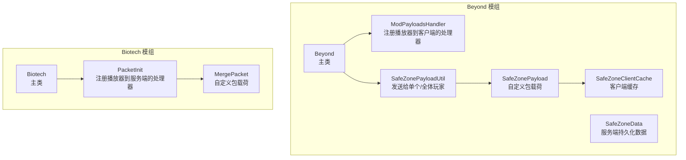
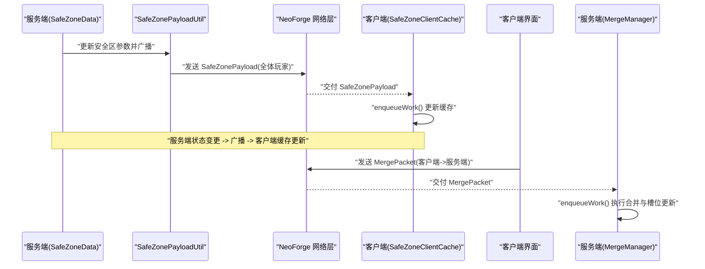
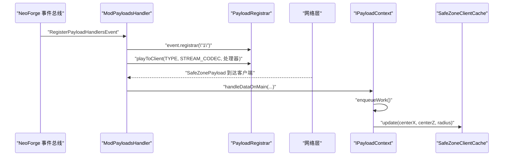
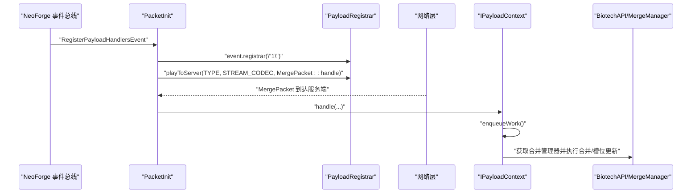
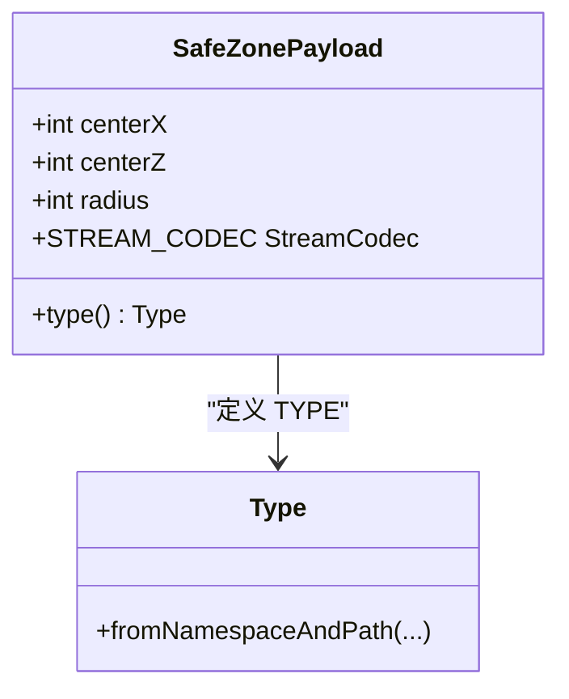
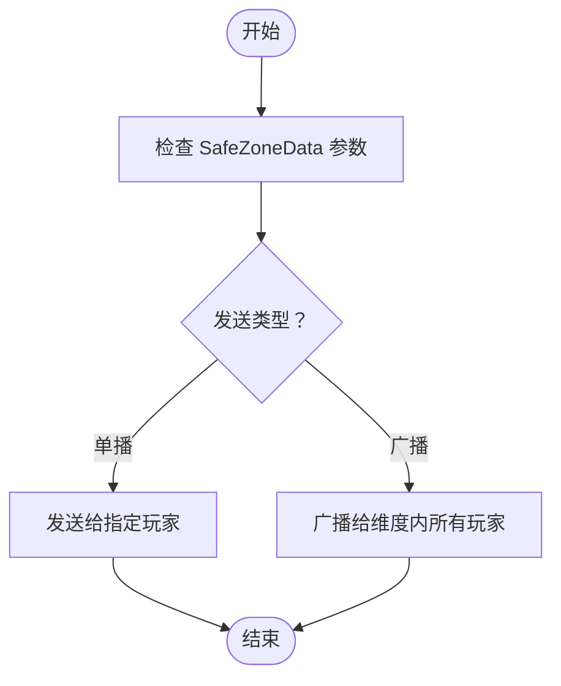
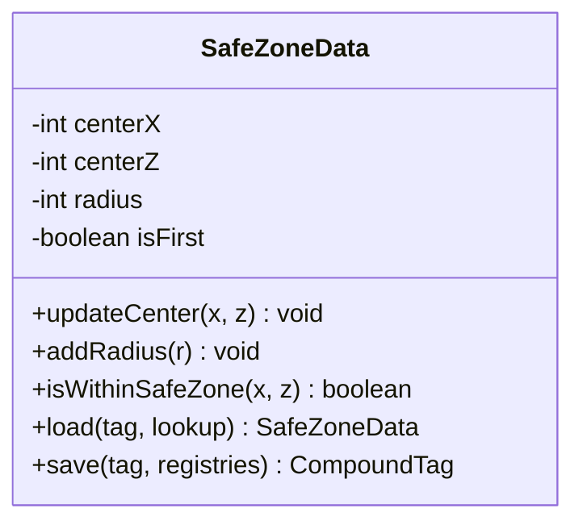
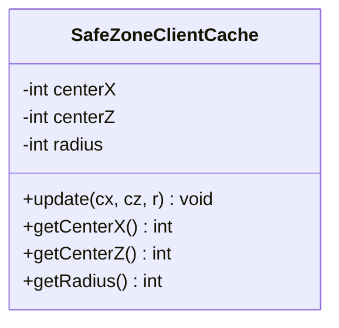
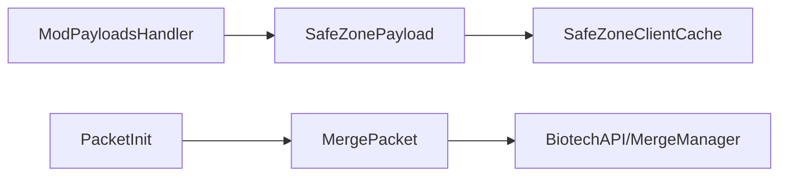

# 网络包处理器

<cite>
**本文引用的文件**
- [Beyond/ModPayloadsHandler.java](file://Beyond/src/main/java/com/pz/beyond/event/ModPayloadsHandler.java)
- [Beyond/SafeZonePayload.java](file://Beyond/src/main/java/com/pz/beyond/network/SafeZonePayload.java)
- [Beyond/SafeZonePayloadUtil.java](file://Beyond/src/main/java/com/pz/beyond/util/SafeZonePayloadUtil.java)
- [Beyond/SafeZoneClientCache.java](file://Beyond/src/main/java/com/pz/beyond/data/SafeZoneClientCache.java)
- [Beyond/SafeZoneData.java](file://Beyond/src/main/java/com/pz/beyond/data/SafeZoneData.java)
- [Beyond/Beyond.java](file://Beyond/src/main/java/com/pz/beyond/Beyond.java)
- [Biotech/PacketInit.java](file://Biotech/src/main/java/org/biotech/api/init/PacketInit.java)
- [Biotech/MergePacket.java](file://Biotech/src/main/java/org/biotech/network/MergePacket.java)
- [Biotech/Biotech.java](file://Biotech/src/main/java/org/biotech/Biotech.java)
- [Beyond/beyond.mixins.json](file://Beyond/src/main/resources/beyond.mixins.json)
- [Biotech/biotech.mixins.json](file://Biotech/src/main/resources/biotech.mixins.json)
</cite>

## 目录
1. [简介](#简介)
2. [项目结构](#项目结构)
3. [核心组件](#核心组件)
4. [架构总览](#架构总览)
5. [详细组件分析](#详细组件分析)
6. [依赖分析](#依赖分析)
7. [性能考虑](#性能考虑)
8. [故障排除指南](#故障排除指南)
9. [结论](#结论)
10. [附录：使用示例与最佳实践](#附录使用示例与最佳实践)

## 简介
本文件系统性梳理并文档化“网络包处理器”的设计与实现，重点覆盖以下方面：
- ModPayloadsHandler 的注册与处理流程：事件监听器注册机制、消息分发逻辑、线程与上下文处理。
- PacketInit 的初始化过程：网络包类型注册、处理器绑定、生命周期管理。
- 客户端-服务器通信协议：数据传输、事件分发、状态同步机制。
- 错误处理、重连与性能监控策略建议。
- 网络调试工具与故障排除指南。

## 项目结构
本仓库包含两个主要模组：Beyond 与 Biotech。两者均采用 NeoForge 的自定义包载荷（Custom Packet Payload）机制进行网络通信：
- Beyond 提供安全区数据包与客户端缓存，负责将服务端状态广播至客户端。
- Biotech 提供合并请求包，负责从客户端向服务端发起请求并执行业务逻辑。

图表来源
- [Beyond/ModPayloadsHandler.java:11-23](file://Beyond/src/main/java/com/pz/beyond/event/ModPayloadsHandler.java#L11-L23)
- [Beyond/SafeZonePayload.java:10-29](file://Beyond/src/main/java/com/pz/beyond/network/SafeZonePayload.java#L10-L29)
- [Beyond/SafeZonePayloadUtil.java:9-31](file://Beyond/src/main/java/com/pz/beyond/util/SafeZonePayloadUtil.java#L9-L31)
- [Beyond/SafeZoneClientCache.java:6-28](file://Beyond/src/main/java/com/pz/beyond/data/SafeZoneClientCache.java#L6-L28)
- [Beyond/SafeZoneData.java:16-99](file://Beyond/src/main/java/com/pz/beyond/data/SafeZoneData.java#L16-L99)
- [Beyond/Beyond.java:38-60](file://Beyond/src/main/java/com/pz/beyond/Beyond.java#L38-L60)
- [Biotech/PacketInit.java:9-18](file://Biotech/src/main/java/org/biotech/api/init/PacketInit.java#L9-L18)
- [Biotech/MergePacket.java:13-34](file://Biotech/src/main/java/org/biotech/network/MergePacket.java#L13-L34)
- [Biotech/Biotech.java:16-39](file://Biotech/src/main/java/org/biotech/Biotech.java#L16-L39)

章节来源
- [Beyond/Beyond.java:38-60](file://Beyond/src/main/java/com/pz/beyond/Beyond.java#L38-L60)
- [Biotech/Biotech.java:16-39](file://Biotech/src/main/java/org/biotech/Biotech.java#L16-L39)

## 核心组件
- 自定义包载荷（CustomPacketPayload）
  - SafeZonePayload：携带中心坐标与半径，用于客户端渲染与判定。
  - MergePacket：客户端向服务端发起的合并请求。
- 处理器注册
  - ModPayloadsHandler：在 NeoForge 的注册事件中，将 SafeZonePayload 注册为“播放器到客户端”方向的处理器。
  - PacketInit：在 NeoForge 的注册事件中，将 MergePacket 注册为“播放器到服务端”方向的处理器。
- 数据与分发
  - SafeZonePayloadUtil：封装单播与广播发送逻辑。
  - SafeZoneData：服务端持久化与更新安全区状态。
  - SafeZoneClientCache：客户端缓存最新安全区参数，供渲染与判定使用。

章节来源
- [Beyond/SafeZonePayload.java:10-29](file://Beyond/src/main/java/com/pz/beyond/network/SafeZonePayload.java#L10-L29)
- [Beyond/ModPayloadsHandler.java:14-23](file://Beyond/src/main/java/com/pz/beyond/event/ModPayloadsHandler.java#L14-L23)
- [Beyond/SafeZonePayloadUtil.java:9-31](file://Beyond/src/main/java/com/pz/beyond/util/SafeZonePayloadUtil.java#L9-L31)
- [Beyond/SafeZoneData.java:16-99](file://Beyond/src/main/java/com/pz/beyond/data/SafeZoneData.java#L16-L99)
- [Beyond/SafeZoneClientCache.java:6-28](file://Beyond/src/main/java/com/pz/beyond/data/SafeZoneClientCache.java#L6-L28)
- [Biotech/PacketInit.java:9-18](file://Biotech/src/main/java/org/biotech/api/init/PacketInit.java#L9-L18)
- [Biotech/MergePacket.java:13-34](file://Biotech/src/main/java/org/biotech/network/MergePacket.java#L13-L34)

## 架构总览
下图展示了从服务端到客户端的状态同步路径，以及从客户端到服务端的请求处理路径。

图表来源
- [Beyond/SafeZonePayloadUtil.java:26-30](file://Beyond/src/main/java/com/pz/beyond/util/SafeZonePayloadUtil.java#L26-L30)
- [Beyond/ModPayloadsHandler.java:14-23](file://Beyond/src/main/java/com/pz/beyond/event/ModPayloadsHandler.java#L14-L23)
- [Beyond/SafeZoneClientCache.java:12-16](file://Beyond/src/main/java/com/pz/beyond/data/SafeZoneClientCache.java#L12-L16)
- [Biotech/PacketInit.java:12-17](file://Biotech/src/main/java/org/biotech/api/init/PacketInit.java#L12-L17)
- [Biotech/MergePacket.java:23-33](file://Biotech/src/main/java/org/biotech/network/MergePacket.java#L23-L33)

## 详细组件分析

### ModPayloadsHandler：注册与处理流程
- 注册机制
  - 订阅 NeoForge 的注册事件，在事件回调中通过版本字符串“1”创建 PayloadRegistrar。
  - 将 SafeZonePayload 的 TYPE 与 STREAM_CODEC 绑定到“播放器到客户端”方向，并指定处理器方法。
- 处理流程
  - 客户端收到包后，通过 IPayloadContext.enqueueWork 将更新操作调度到主线程。
  - 在主线程中更新 SafeZoneClientCache，确保渲染与判定使用最新数据。

图表来源
- [Beyond/ModPayloadsHandler.java:14-32](file://Beyond/src/main/java/com/pz/beyond/event/ModPayloadsHandler.java#L14-L32)
- [Beyond/SafeZonePayload.java:15-19](file://Beyond/src/main/java/com/pz/beyond/network/SafeZonePayload.java#L15-L19)

章节来源
- [Beyond/ModPayloadsHandler.java:11-34](file://Beyond/src/main/java/com/pz/beyond/event/ModPayloadsHandler.java#L11-L34)

### PacketInit：初始化与处理器绑定
- 初始化过程
  - 订阅注册事件，创建版本为“1”的 PayloadRegistrar。
  - 将 MergePacket 的 TYPE 与 STREAM_CODEC 绑定到“播放器到服务端”方向。
- 生命周期管理
  - 该注册发生在模组事件总线上，确保在游戏加载早期完成，避免运行期缺失处理器导致的异常。

图表来源
- [Biotech/PacketInit.java:11-17](file://Biotech/src/main/java/org/biotech/api/init/PacketInit.java#L11-L17)
- [Biotech/MergePacket.java:23-33](file://Biotech/src/main/java/org/biotech/network/MergePacket.java#L23-L33)

章节来源
- [Biotech/PacketInit.java:9-18](file://Biotech/src/main/java/org/biotech/api/init/PacketInit.java#L9-L18)
- [Biotech/MergePacket.java:13-34](file://Biotech/src/main/java/org/biotech/network/MergePacket.java#L13-L34)

### SafeZonePayload：数据模型与编解码
- 类型与编解码
  - 使用 Composite StreamCodec 编码三个整型字段，保证序列化/反序列化的稳定性与性能。
  - 类型标识使用 ResourceLocation，确保跨模组唯一性。
- 生命周期
  - 作为 CustomPacketPayload，遵循 NeoForge 包载荷生命周期；由注册器绑定到网络层。

图表来源
- [Beyond/SafeZonePayload.java:10-29](file://Beyond/src/main/java/com/pz/beyond/network/SafeZonePayload.java#L10-L29)

章节来源
- [Beyond/SafeZonePayload.java:10-30](file://Beyond/src/main/java/com/pz/beyond/network/SafeZonePayload.java#L10-L30)

### SafeZonePayloadUtil：消息分发逻辑
- 单播：针对特定 ServerPlayer 发送包。
- 广播：向指定维度的所有在线玩家广播包。
- 与 SafeZoneData 协作：当服务端状态变化时，统一通过工具类进行分发。

图表来源
- [Beyond/SafeZonePayloadUtil.java:16-30](file://Beyond/src/main/java/com/pz/beyond/util/SafeZonePayloadUtil.java#L16-L30)

章节来源
- [Beyond/SafeZonePayloadUtil.java:9-31](file://Beyond/src/main/java/com/pz/beyond/util/SafeZonePayloadUtil.java#L9-L31)

### SafeZoneData：服务端状态与持久化
- 状态字段：中心坐标与半径。
- 更新接口：提供修改中心与半径的方法，并在变更后广播。
- 持久化：继承 SavedData，支持 NBT 存档。

图表来源
- [Beyond/SafeZoneData.java:16-99](file://Beyond/src/main/java/com/pz/beyond/data/SafeZoneData.java#L16-L99)

章节来源
- [Beyond/SafeZoneData.java:16-101](file://Beyond/src/main/java/com/pz/beyond/data/SafeZoneData.java#L16-L101)

### SafeZoneClientCache：客户端缓存
- 作用：保存最新安全区参数，供渲染与判定使用。
- 更新：通过 enqueueWork 在主线程中更新，避免并发问题。

图表来源
- [Beyond/SafeZoneClientCache.java:6-28](file://Beyond/src/main/java/com/pz/beyond/data/SafeZoneClientCache.java#L6-L28)

章节来源
- [Beyond/SafeZoneClientCache.java:1-30](file://Beyond/src/main/java/com/pz/beyond/data/SafeZoneClientCache.java#L1-L30)

### Mixin 配置与调试
- beyond.mixins.json 与 biotech.mixins.json：声明了 mixin 包与兼容级别，便于后续扩展或调试。
- 建议：如需在运行时观察网络包收发，可在注册器或处理器中加入日志记录，结合 Mixin 进行非侵入式增强。

章节来源
- [Beyond/beyond.mixins.json:1-17](file://Beyond/src/main/resources/beyond.mixins.json#L1-L17)
- [Biotech/biotech.mixins.json:1-17](file://Biotech/src/main/resources/biotech.mixins.json#L1-L17)

## 依赖分析
- 模组间耦合
  - Beyond 与 Biotech 通过 NeoForge 的自定义包载荷机制进行松耦合通信。
  - Beyond 负责状态广播，Biotech 负责请求下发。
- 关键依赖链
  - ModPayloadsHandler -> SafeZonePayload -> SafeZoneClientCache
  - PacketInit -> MergePacket -> BiotechAPI/MergeManager

图表来源
- [Beyond/ModPayloadsHandler.java:14-23](file://Beyond/src/main/java/com/pz/beyond/event/ModPayloadsHandler.java#L14-L23)
- [Beyond/SafeZonePayload.java:15-19](file://Beyond/src/main/java/com/pz/beyond/network/SafeZonePayload.java#L15-L19)
- [Beyond/SafeZoneClientCache.java:12-16](file://Beyond/src/main/java/com/pz/beyond/data/SafeZoneClientCache.java#L12-L16)
- [Biotech/PacketInit.java:12-17](file://Biotech/src/main/java/org/biotech/api/init/PacketInit.java#L12-L17)
- [Biotech/MergePacket.java:23-33](file://Biotech/src/main/java/org/biotech/network/MergePacket.java#L23-L33)

章节来源
- [Beyond/ModPayloadsHandler.java:11-34](file://Beyond/src/main/java/com/pz/beyond/event/ModPayloadsHandler.java#L11-L34)
- [Biotech/PacketInit.java:9-18](file://Biotech/src/main/java/org/biotech/api/init/PacketInit.java#L9-L18)

## 性能考虑
- 编解码优化
  - 使用 Composite StreamCodec 对固定字段进行高效编解码，减少反射开销。
- 分发策略
  - 广播时优先按维度筛选，避免跨维传输造成带宽浪费。
- 线程与上下文
  - 使用 enqueueWork 将客户端更新调度到主线程，避免 UI 线程并发问题。
- 状态同步频率
  - 合理控制 SafeZoneData 的更新频率，避免高频广播导致卡顿。

## 故障排除指南
- 症状：客户端未收到安全区更新
  - 检查 ModPayloadsHandler 是否正确注册 TYPE 与处理器。
  - 确认 SafeZonePayloadUtil 的广播维度与当前世界一致。
  - 核对客户端是否在主线程更新缓存。
- 症状：服务端未收到合并请求
  - 检查 PacketInit 是否在注册事件中完成绑定。
  - 确认 MergePacket 的 TYPE 与客户端发送的一致。
  - 查看 BiotechAPI 的合并管理器是否正确初始化。
- 症状：网络包未生效或崩溃
  - 检查 StreamCodec 的字段顺序与数量是否与定义一致。
  - 确认 ResourceLocation 的命名空间与模组 ID 一致。
  - 如需调试，可在处理器中增加日志输出，结合 Mixin 进行非侵入式增强。

章节来源
- [Beyond/ModPayloadsHandler.java:14-32](file://Beyond/src/main/java/com/pz/beyond/event/ModPayloadsHandler.java#L14-L32)
- [Beyond/SafeZonePayloadUtil.java:26-30](file://Beyond/src/main/java/com/pz/beyond/util/SafeZonePayloadUtil.java#L26-L30)
- [Biotech/PacketInit.java:12-17](file://Biotech/src/main/java/org/biotech/api/init/PacketInit.java#L12-L17)
- [Biotech/MergePacket.java:23-33](file://Biotech/src/main/java/org/biotech/network/MergePacket.java#L23-L33)

## 结论
本系统以 NeoForge 的自定义包载荷为核心，实现了服务端状态到客户端的可靠同步与客户端请求到服务端的处理闭环。通过清晰的注册流程、稳定的编解码与合理的线程调度，保障了网络通信的性能与可靠性。建议在实际部署中配合日志与监控，持续优化广播频率与编解码策略。

## 附录：使用示例与最佳实践
- 注册网络包处理器（服务端到客户端）
  - 参考路径：[Beyond/ModPayloadsHandler.java:14-23](file://Beyond/src/main/java/com/pz/beyond/event/ModPayloadsHandler.java#L14-L23)
- 注册网络包处理器（客户端到服务端）
  - 参考路径：[Biotech/PacketInit.java:12-17](file://Biotech/src/main/java/org/biotech/api/init/PacketInit.java#L12-L17)
- 处理接收到的消息并更新状态
  - 客户端侧：[Beyond/ModPayloadsHandler.java:27-31](file://Beyond/src/main/java/com/pz/beyond/event/ModPayloadsHandler.java#L27-L31)，[Beyond/SafeZoneClientCache.java:12-16](file://Beyond/src/main/java/com/pz/beyond/data/SafeZoneClientCache.java#L12-L16)
  - 服务端侧：[Biotech/MergePacket.java:23-33](file://Biotech/src/main/java/org/biotech/network/MergePacket.java#L23-L33)
- 实现响应逻辑（广播/单播）
  - 参考路径：[Beyond/SafeZonePayloadUtil.java:16-30](file://Beyond/src/main/java/com/pz/beyond/util/SafeZonePayloadUtil.java#L16-L30)
- 错误处理与重试建议
  - 在处理器中捕获异常并记录日志，必要时回滚状态或延迟重试。
- 性能监控策略
  - 记录包大小、发送/接收速率、处理耗时，定期评估编解码与广播策略。