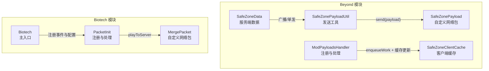
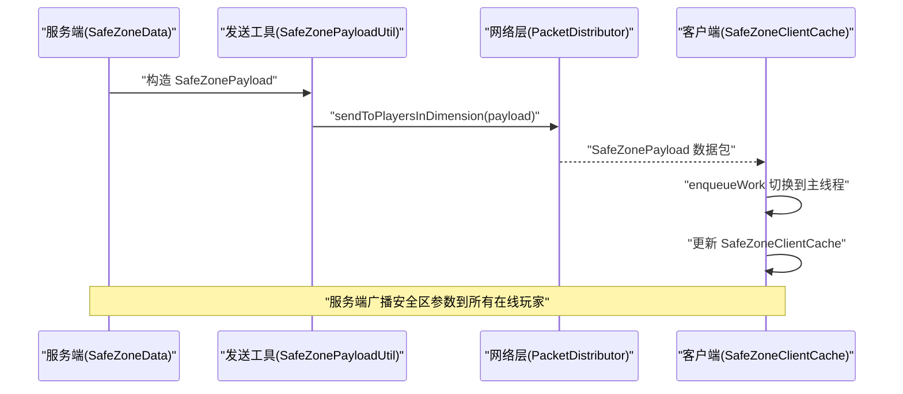
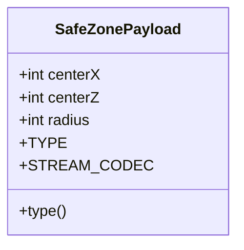
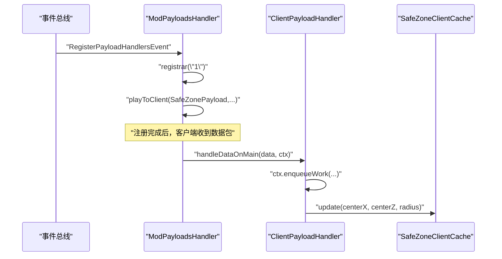
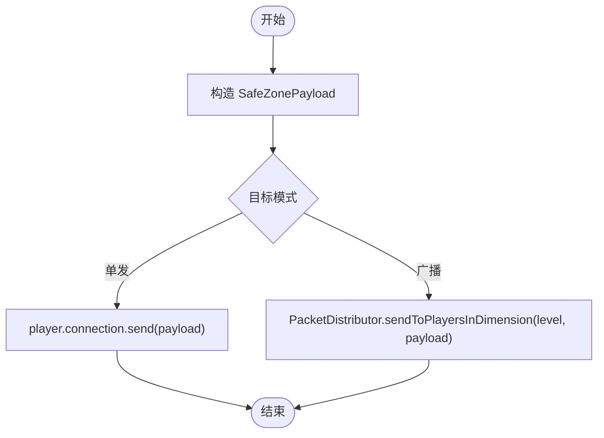
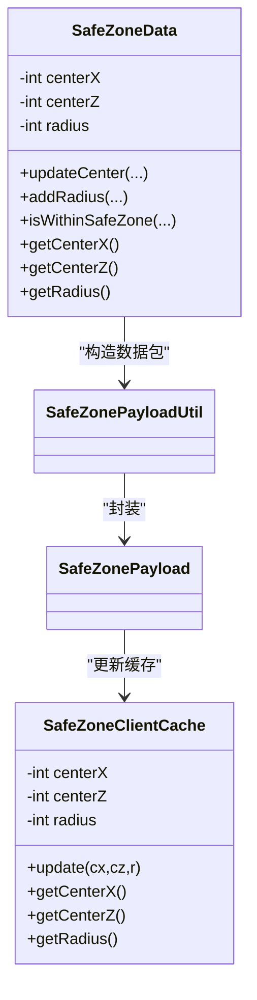
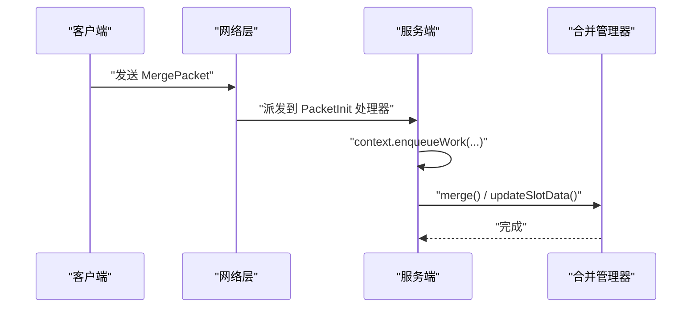
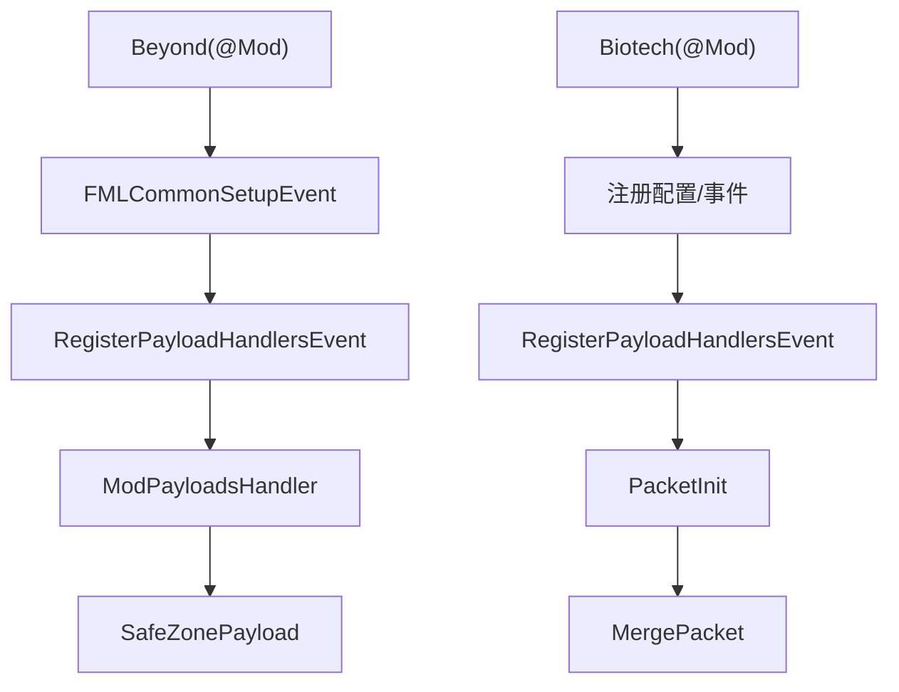

# 网络通信API

<cite>
**本文引用的文件**
- [Beyond 模块：ModPayloadsHandler.java](file://Beyond/src/main/java/com/pz/beyond/event/ModPayloadsHandler.java)
- [Beyond 模块：SafeZonePayload.java](file://Beyond/src/main/java/com/pz/beyond/network/SafeZonePayload.java)
- [Beyond 模块：SafeZonePayloadUtil.java](file://Beyond/src/main/java/com/pz/beyond/util/SafeZonePayloadUtil.java)
- [Beyond 模块：SafeZoneData.java](file://Beyond/src/main/java/com/pz/beyond/data/SafeZoneData.java)
- [Beyond 模块：SafeZoneClientCache.java](file://Beyond/src/main/java/com/pz/beyond/data/SafeZoneClientCache.java)
- [Biotech 模块：PacketInit.java](file://Biotech/src/main/java/org/biotech/api/init/PacketInit.java)
- [Biotech 模块：MergePacket.java](file://Biotech/src/main/java/org/biotech/network/MergePacket.java)
- [Beyond 模块：Beyond.java](file://Beyond/src/main/java/com/pz/beyond/Beyond.java)
- [Biotech 模块：Biotech.java](file://Biotech/src/main/java/org/biotech/Biotech.java)
- [Beyond 模块：PlayerStateChangeEvent.java](file://Beyond/src/main/java/com/pz/beyond/event/custom/PlayerStateChangeEvent.java)
</cite>

## 目录
1. [简介](#简介)
2. [项目结构](#项目结构)
3. [核心组件](#核心组件)
4. [架构总览](#架构总览)
5. [组件详解](#组件详解)
6. [依赖关系分析](#依赖关系分析)
7. [性能与优化](#性能与优化)
8. [故障排查指南](#故障排查指南)
9. [结论](#结论)
10. [附录](#附录)

## 简介
本文件系统性地文档化了两个子模块中的网络通信API，重点覆盖以下内容：
- 自定义网络包的实现机制：以 SafeZonePayload 与 MergePacket 为例，说明数据模型、序列化与反序列化、类型标识与版本控制。
- 注册与处理流程：ModPayloadsHandler 与 PacketInit 的职责划分与事件驱动注册机制。
- 客户端-服务器通信协议：数据包发送、广播、事件分发与线程调度。
- 使用示例路径：如何发送与接收自定义网络包、处理网络事件与实现数据同步。
- 性能优化策略与错误处理机制：缓冲区复用、批量广播、线程安全与回压。
- 网络安全与调试技巧：版本协商、最小必要字段、日志与断点定位。

## 项目结构
本仓库包含多个子模块，网络通信API主要分布在 Beyond 与 Biotech 两个模块中：
- Beyond 模块：提供安全区数据与网络包 SafeZonePayload，并通过 ModPayloadsHandler 在客户端侧注册处理逻辑；同时提供 SafeZonePayloadUtil 用于向单个或全体玩家广播数据。
- Biotech 模块：提供合并请求网络包 MergePacket，通过 PacketInit 在服务端注册处理逻辑；Biotech 作为主入口负责注册与配置。

图表来源
- [Beyond 模块：SafeZonePayload.java:1-31](file://Beyond/src/main/java/com/pz/beyond/network/SafeZonePayload.java#L1-L31)
- [Beyond 模块：ModPayloadsHandler.java:1-35](file://Beyond/src/main/java/com/pz/beyond/event/ModPayloadsHandler.java#L1-L35)
- [Beyond 模块：SafeZonePayloadUtil.java:1-32](file://Beyond/src/main/java/com/pz/beyond/util/SafeZonePayloadUtil.java#L1-L32)
- [Beyond 模块：SafeZoneData.java:1-101](file://Beyond/src/main/java/com/pz/beyond/data/SafeZoneData.java#L1-L101)
- [Beyond 模块：SafeZoneClientCache.java:1-30](file://Beyond/src/main/java/com/pz/beyond/data/SafeZoneClientCache.java#L1-L30)
- [Biotech 模块：MergePacket.java:1-35](file://Biotech/src/main/java/org/biotech/network/MergePacket.java#L1-L35)
- [Biotech 模块：PacketInit.java:1-19](file://Biotech/src/main/java/org/biotech/api/init/PacketInit.java#L1-L19)
- [Biotech 模块：Biotech.java:1-73](file://Biotech/src/main/java/org/biotech/Biotech.java#L1-L73)

章节来源
- [Beyond 模块：Beyond.java:1-79](file://Beyond/src/main/java/com/pz/beyond/Beyond.java#L1-L79)
- [Biotech 模块：Biotech.java:1-73](file://Biotech/src/main/java/org/biotech/Biotech.java#L1-L73)

## 核心组件
- SafeZonePayload：服务端向客户端推送安全区参数的自定义网络包，包含中心坐标与半径，采用流编解码器进行序列化。
- ModPayloadsHandler：在注册阶段绑定 Play-to-Client 类型的处理器，确保客户端收到数据包后在主线程安全更新缓存。
- SafeZonePayloadUtil：封装单发与广播发送逻辑，简化调用方代码。
- SafeZoneData：服务端持久化与计算安全区状态，提供广播能力。
- SafeZoneClientCache：客户端静态缓存，供渲染与判定逻辑使用。
- MergePacket：客户端向服务端发起合并请求的自定义网络包，携带空载荷，服务端处理后执行业务逻辑。
- PacketInit：在注册阶段绑定 Play-to-Server 类型的处理器，完成协议注册与版本控制。

章节来源
- [Beyond 模块：SafeZonePayload.java:10-30](file://Beyond/src/main/java/com/pz/beyond/network/SafeZonePayload.java#L10-L30)
- [Beyond 模块：ModPayloadsHandler.java:14-32](file://Beyond/src/main/java/com/pz/beyond/event/ModPayloadsHandler.java#L14-L32)
- [Beyond 模块：SafeZonePayloadUtil.java:9-31](file://Beyond/src/main/java/com/pz/beyond/util/SafeZonePayloadUtil.java#L9-L31)
- [Beyond 模块：SafeZoneData.java:16-101](file://Beyond/src/main/java/com/pz/beyond/data/SafeZoneData.java#L16-L101)
- [Beyond 模块：SafeZoneClientCache.java:6-30](file://Beyond/src/main/java/com/pz/beyond/data/SafeZoneClientCache.java#L6-L30)
- [Biotech 模块：MergePacket.java:13-35](file://Biotech/src/main/java/org/biotech/network/MergePacket.java#L13-L35)
- [Biotech 模块：PacketInit.java:11-17](file://Biotech/src/main/java/org/biotech/api/init/PacketInit.java#L11-L17)

## 架构总览
下图展示了客户端-服务器之间的网络通信路径与事件分发：

图表来源
- [Beyond 模块：SafeZonePayloadUtil.java:26-30](file://Beyond/src/main/java/com/pz/beyond/util/SafeZonePayloadUtil.java#L26-L30)
- [Beyond 模块：SafeZoneClientCache.java:12-16](file://Beyond/src/main/java/com/pz/beyond/data/SafeZoneClientCache.java#L12-L16)
- [Beyond 模块：ModPayloadsHandler.java:27-31](file://Beyond/src/main/java/com/pz/beyond/event/ModPayloadsHandler.java#L27-L31)

## 组件详解

### SafeZonePayload 设计与使用
- 数据模型：包含三个整型字段（中心X、中心Z、半径），作为不可变记录类实现。
- 类型标识：使用 ResourceLocation 生成唯一类型ID，确保跨模组兼容性。
- 流编解码器：采用复合流编解码器，按字段顺序读写，保证序列化与反序列化的确定性。
- 版本控制：注册阶段通过版本字符串统一管理，便于后续升级与兼容。

图表来源
- [Beyond 模块：SafeZonePayload.java:10-30](file://Beyond/src/main/java/com/pz/beyond/network/SafeZonePayload.java#L10-L30)

章节来源
- [Beyond 模块：SafeZonePayload.java:10-30](file://Beyond/src/main/java/com/pz/beyond/network/SafeZonePayload.java#L10-L30)

### ModPayloadsHandler 注册与处理流程
- 注册：在注册事件中创建 PayloadRegistrar（版本号“1”），绑定 Play-to-Client 类型的处理器。
- 处理：在客户端收到数据包后，通过上下文的 enqueueWork 将更新操作排入主线程队列，再更新客户端缓存。

图表来源
- [Beyond 模块：ModPayloadsHandler.java:14-32](file://Beyond/src/main/java/com/pz/beyond/event/ModPayloadsHandler.java#L14-L32)
- [Beyond 模块：SafeZoneClientCache.java:12-16](file://Beyond/src/main/java/com/pz/beyond/data/SafeZoneClientCache.java#L12-L16)

章节来源
- [Beyond 模块：ModPayloadsHandler.java:14-32](file://Beyond/src/main/java/com/pz/beyond/event/ModPayloadsHandler.java#L14-L32)

### SafeZonePayloadUtil 发送与广播
- 单发：针对指定玩家，构造数据包并通过连接发送。
- 广播：针对当前维度的所有在线玩家，使用 PacketDistributor 进行高效广播。

图表来源
- [Beyond 模块：SafeZonePayloadUtil.java:16-30](file://Beyond/src/main/java/com/pz/beyond/util/SafeZonePayloadUtil.java#L16-L30)

章节来源
- [Beyond 模块：SafeZonePayloadUtil.java:9-31](file://Beyond/src/main/java/com/pz/beyond/util/SafeZonePayloadUtil.java#L9-L31)

### SafeZoneData 与 SafeZoneClientCache
- SafeZoneData：服务端持有并维护安全区状态，提供更新与广播能力；更新后标记脏数据以便保存。
- SafeZoneClientCache：客户端静态缓存，提供读取接口供其他模块使用。

图表来源
- [Beyond 模块：SafeZoneData.java:16-101](file://Beyond/src/main/java/com/pz/beyond/data/SafeZoneData.java#L16-L101)
- [Beyond 模块：SafeZoneClientCache.java:6-30](file://Beyond/src/main/java/com/pz/beyond/data/SafeZoneClientCache.java#L6-L30)
- [Beyond 模块：SafeZonePayloadUtil.java:9-31](file://Beyond/src/main/java/com/pz/beyond/util/SafeZonePayloadUtil.java#L9-L31)

章节来源
- [Beyond 模块：SafeZoneData.java:16-101](file://Beyond/src/main/java/com/pz/beyond/data/SafeZoneData.java#L16-L101)
- [Beyond 模块：SafeZoneClientCache.java:6-30](file://Beyond/src/main/java/com/pz/beyond/data/SafeZoneClientCache.java#L6-L30)

### MergePacket 与 PacketInit（客户端→服务端）
- MergePacket：空载荷网络包，仅用于触发服务端合并逻辑。
- PacketInit：注册 Play-to-Server 类型处理器，绑定到 MergePacket 的类型与编解码器，并在上下文中执行业务逻辑。

图表来源
- [Biotech 模块：MergePacket.java:23-33](file://Biotech/src/main/java/org/biotech/network/MergePacket.java#L23-L33)
- [Biotech 模块：PacketInit.java:12-17](file://Biotech/src/main/java/org/biotech/api/init/PacketInit.java#L12-L17)

章节来源
- [Biotech 模块：MergePacket.java:13-35](file://Biotech/src/main/java/org/biotech/network/MergePacket.java#L13-L35)
- [Biotech 模块：PacketInit.java:11-17](file://Biotech/src/main/java/org/biotech/api/init/PacketInit.java#L11-L17)

### 客户端-服务器通信协议与事件分发
- 类型与版本：每个自定义包均定义唯一类型ID与版本字符串，确保跨版本兼容。
- 序列化：使用流编解码器进行二进制序列化，字段顺序固定，避免解析歧义。
- 传输：单发通过玩家连接发送，广播通过维度级分发器发送。
- 事件：注册阶段通过事件总线完成处理器绑定；客户端处理通过上下文的主线程调度保证线程安全。

章节来源
- [Beyond 模块：SafeZonePayload.java:15-29](file://Beyond/src/main/java/com/pz/beyond/network/SafeZonePayload.java#L15-L29)
- [Beyond 模块：ModPayloadsHandler.java:14-23](file://Beyond/src/main/java/com/pz/beyond/event/ModPayloadsHandler.java#L14-L23)
- [Beyond 模块：SafeZonePayloadUtil.java:16-30](file://Beyond/src/main/java/com/pz/beyond/util/SafeZonePayloadUtil.java#L16-L30)
- [Biotech 模块：MergePacket.java:15-21](file://Biotech/src/main/java/org/biotech/network/MergePacket.java#L15-L21)
- [Biotech 模块：PacketInit.java:12-17](file://Biotech/src/main/java/org/biotech/api/init/PacketInit.java#L12-L17)

## 依赖关系分析
- 模块入口：Beyond 与 Biotech 分别通过 @Mod 注解注册自身，Biotech 还负责注册配置与事件总线。
- 事件总线：两个模块均使用 EventBusSubscriber 订阅注册事件，完成网络包处理器的注册。
- 网络层：NeoForge 提供的 RegisterPayloadHandlersEvent 与 PayloadRegistrar 负责协议注册；PacketDistributor 负责广播。

图表来源
- [Beyond 模块：Beyond.java:46-65](file://Beyond/src/main/java/com/pz/beyond/Beyond.java#L46-L65)
- [Biotech 模块：Biotech.java:23-39](file://Biotech/src/main/java/org/biotech/Biotech.java#L23-L39)
- [Beyond 模块：ModPayloadsHandler.java:14-23](file://Beyond/src/main/java/com/pz/beyond/event/ModPayloadsHandler.java#L14-L23)
- [Biotech 模块：PacketInit.java:12-17](file://Biotech/src/main/java/org/biotech/api/init/PacketInit.java#L12-L17)

章节来源
- [Beyond 模块：Beyond.java:46-65](file://Beyond/src/main/java/com/pz/beyond/Beyond.java#L46-L65)
- [Biotech 模块：Biotech.java:23-39](file://Biotech/src/main/java/org/biotech/Biotech.java#L23-L39)

## 性能与优化
- 选择合适的数据结构：使用整型字段减少序列化开销；避免频繁分配临时对象。
- 批量与广播：优先使用维度级广播而非逐个发送，降低网络与调度成本。
- 主线程调度：客户端处理通过 enqueueWork 切换到主线程，避免并发访问共享状态。
- 版本控制：统一版本字符串，便于未来扩展字段而不破坏兼容性。
- 最小必要字段：仅传输必要数据，避免冗余字段导致带宽浪费。

## 故障排查指南
- 无法收到数据包
  - 检查注册是否正确：确认注册事件已触发且版本字符串一致。
  - 检查类型ID：确保客户端与服务端使用相同的 ResourceLocation。
- 客户端未更新
  - 检查 enqueueWork 是否被调用，确保在主线程更新缓存。
- 广播无效
  - 确认维度参数正确，检查 PacketDistributor 的调用方式。
- 服务端无响应
  - 检查 PacketInit 的注册是否生效，确认 playToServer 的绑定正确。

章节来源
- [Beyond 模块：ModPayloadsHandler.java:27-31](file://Beyond/src/main/java/com/pz/beyond/event/ModPayloadsHandler.java#L27-L31)
- [Beyond 模块：SafeZonePayloadUtil.java:26-30](file://Beyond/src/main/java/com/pz/beyond/util/SafeZonePayloadUtil.java#L26-L30)
- [Biotech 模块：PacketInit.java:12-17](file://Biotech/src/main/java/org/biotech/api/init/PacketInit.java#L12-L17)

## 结论
本网络通信API以自定义网络包为核心，结合事件驱动的注册机制与 NeoForge 的网络层，实现了服务端到客户端的安全区参数广播与客户端到服务端的合并请求处理。通过版本控制、流编解码器与主线程调度，系统在保证正确性的同时兼顾性能与可维护性。建议在后续迭代中持续关注字段最小化、广播粒度与线程安全，以进一步提升稳定性与扩展性。

## 附录
- 示例路径（不展示具体代码，仅给出文件与行号）：
  - 发送单个玩家数据包：[SafeZonePayloadUtil.safeZoneToPlayer:16-19](file://Beyond/src/main/java/com/pz/beyond/util/SafeZonePayloadUtil.java#L16-L19)
  - 广播到维度内所有玩家：[SafeZonePayloadUtil.SafeZoneToAll:26-30](file://Beyond/src/main/java/com/pz/beyond/util/SafeZonePayloadUtil.java#L26-L30)
  - 客户端注册与处理：[ModPayloadsHandler.register/handleDataOnMain:14-32](file://Beyond/src/main/java/com/pz/beyond/event/ModPayloadsHandler.java#L14-L32)
  - 客户端→服务端注册与处理：[PacketInit.register:12-17](file://Biotech/src/main/java/org/biotech/api/init/PacketInit.java#L12-L17)，[MergePacket.handle:23-33](file://Biotech/src/main/java/org/biotech/network/MergePacket.java#L23-L33)
  - 安全区状态更新与广播：[SafeZoneData.updateCenter/addRadius:60-79](file://Beyond/src/main/java/com/pz/beyond/data/SafeZoneData.java#L60-L79)