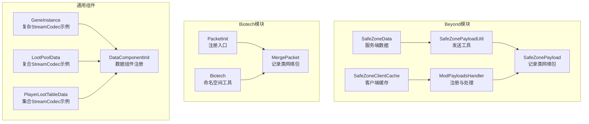
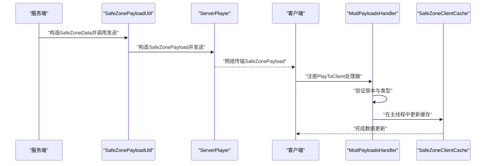
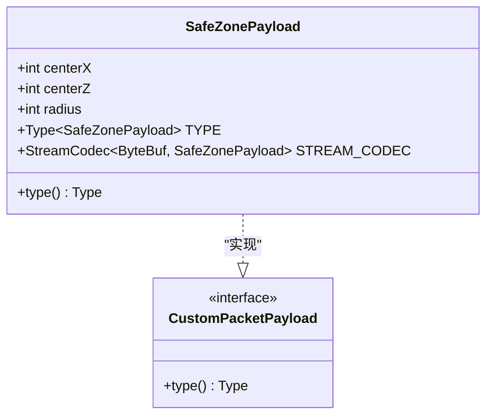
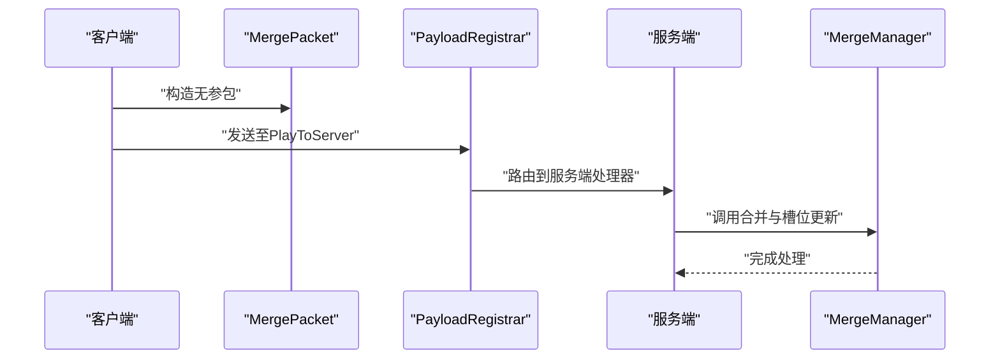
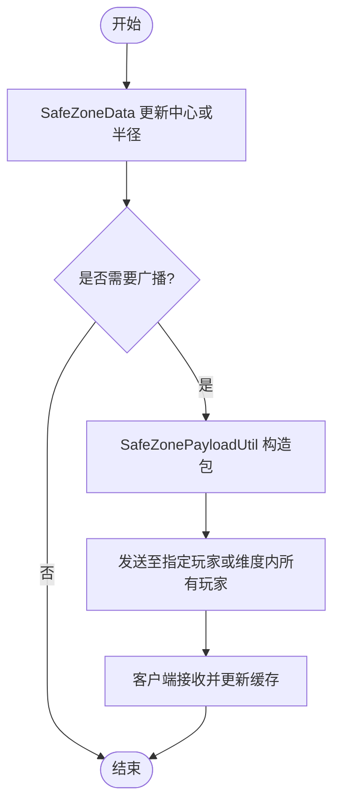
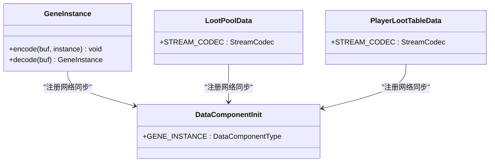
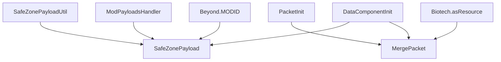

# 自定义网络包

<cite>
**本文档引用的文件**
- [SafeZonePayload.java](file://Beyond/src/main/java/com/pz/beyond/network/SafeZonePayload.java)
- [MergePacket.java](file://Biotech/src/main/java/org/biotech/network/MergePacket.java)
- [SafeZonePayloadUtil.java](file://Beyond/src/main/java/com/pz/beyond/util/SafeZonePayloadUtil.java)
- [ModPayloadsHandler.java](file://Beyond/src/main/java/com/pz/beyond/event/ModPayloadsHandler.java)
- [PacketInit.java](file://Biotech/src/main/java/org/biotech/api/init/PacketInit.java)
- [SafeZoneData.java](file://Beyond/src/main/java/com/pz/beyond/data/SafeZoneData.java)
- [SafeZoneClientCache.java](file://Beyond/src/main/java/com/pz/beyond/data/SafeZoneClientCache.java)
- [Beyond.java](file://Beyond/src/main/java/com/pz/beyond/Beyond.java)
- [Biotech.java](file://Biotech/src/main/java/org/biotech/Biotech.java)
- [GeneInstance.java](file://Biotech/src/main/java/org/biotech/api/system/gene/GeneInstance.java)
- [LootPoolData.java](file://Biotech/src/main/java/org/biotech/api/system/loot/data/LootPoolData.java)
- [PlayerLootTableData.java](file://Biotech/src/main/java/org/biotech/api/system/loot/PlayerLootTableData.java)
- [DataComponentInit.java](file://Biotech/src/main/java/org/biotech/api/init/DataComponentInit.java)
</cite>

## 目录
1. [简介](#简介)
2. [项目结构](#项目结构)
3. [核心组件](#核心组件)
4. [架构总览](#架构总览)
5. [详细组件分析](#详细组件分析)
6. [依赖关系分析](#依赖关系分析)
7. [性能考虑](#性能考虑)
8. [故障排除指南](#故障排除指南)
9. [结论](#结论)
10. [附录](#附录)

## 简介
本文件系统性地文档化了两个自定义网络包的设计与实现：SafeZonePayload（安全区数据包）与MergePacket（合并请求包）。我们将深入解析CustomPacketPayload接口的使用方式，包括TYPE常量定义、STREAM_CODEC编解码器配置以及数据序列化过程；同时给出网络包的构造参数、数据结构与传输格式，并提供完整的代码示例路径，帮助开发者创建自定义网络包。此外，文档还涵盖性能优化策略、内存管理最佳实践以及错误处理与调试技巧。

## 项目结构
本仓库包含多个模块，其中与网络包直接相关的关键文件分布如下：
- Beyond模块：包含安全区网络包SafeZonePayload及其客户端/服务端处理逻辑
- Biotech模块：包含合并请求网络包MergePacket及其注册与处理逻辑
- 其他模块展示了更复杂的网络包实现模式，如基于StreamCodec复合编解码、基于ResourceLocation命名空间管理等

图表来源
- [SafeZonePayload.java:10-30](file://Beyond/src/main/java/com/pz/beyond/network/SafeZonePayload.java#L10-L30)
- [SafeZonePayloadUtil.java:9-31](file://Beyond/src/main/java/com/pz/beyond/util/SafeZonePayloadUtil.java#L9-L31)
- [ModPayloadsHandler.java:12-34](file://Beyond/src/main/java/com/pz/beyond/event/ModPayloadsHandler.java#L12-L34)
- [SafeZoneData.java:16-100](file://Beyond/src/main/java/com/pz/beyond/data/SafeZoneData.java#L16-L100)
- [SafeZoneClientCache.java:6-29](file://Beyond/src/main/java/com/pz/beyond/data/SafeZoneClientCache.java#L6-L29)
- [MergePacket.java:13-34](file://Biotech/src/main/java/org/biotech/network/MergePacket.java#L13-L34)
- [PacketInit.java:10-17](file://Biotech/src/main/java/org/biotech/api/init/PacketInit.java#L10-L17)
- [Biotech.java:41-43](file://Biotech/src/main/java/org/biotech/Biotech.java#L41-L43)
- [GeneInstance.java:54-64](file://Biotech/src/main/java/org/biotech/api/system/gene/GeneInstance.java#L54-L64)
- [LootPoolData.java:70-78](file://Biotech/src/main/java/org/biotech/api/system/loot/data/LootPoolData.java#L70-L78)
- [PlayerLootTableData.java:70-73](file://Biotech/src/main/java/org/biotech/api/system/loot/PlayerLootTableData.java#L70-L73)
- [DataComponentInit.java:35-44](file://Biotech/src/main/java/org/biotech/api/init/DataComponentInit.java#L35-L44)

章节来源
- [SafeZonePayload.java:1-31](file://Beyond/src/main/java/com/pz/beyond/network/SafeZonePayload.java#L1-L31)
- [MergePacket.java:1-35](file://Biotech/src/main/java/org/biotech/network/MergePacket.java#L1-L35)
- [SafeZonePayloadUtil.java:1-32](file://Beyond/src/main/java/com/pz/beyond/util/SafeZonePayloadUtil.java#L1-L32)
- [ModPayloadsHandler.java:1-35](file://Beyond/src/main/java/com/pz/beyond/event/ModPayloadsHandler.java#L1-L35)
- [PacketInit.java:1-18](file://Biotech/src/main/java/org/biotech/api/init/PacketInit.java#L1-L18)
- [SafeZoneData.java:1-101](file://Beyond/src/main/java/com/pz/beyond/data/SafeZoneData.java#L1-L101)
- [SafeZoneClientCache.java:1-30](file://Beyond/src/main/java/com/pz/beyond/data/SafeZoneClientCache.java#L1-L30)
- [Beyond.java:1-79](file://Beyond/src/main/java/com/pz/beyond/Beyond.java#L1-L79)
- [Biotech.java:1-73](file://Biotech/src/main/java/org/biotech/Biotech.java#L1-L73)
- [GeneInstance.java:54-64](file://Biotech/src/main/java/org/biotech/api/system/gene/GeneInstance.java#L54-L64)
- [LootPoolData.java:1-80](file://Biotech/src/main/java/org/biotech/api/system/loot/data/LootPoolData.java#L1-L80)
- [PlayerLootTableData.java:70-73](file://Biotech/src/main/java/org/biotech/api/system/loot/PlayerLootTableData.java#L70-L73)
- [DataComponentInit.java:35-44](file://Biotech/src/main/java/org/biotech/api/init/DataComponentInit.java#L35-L44)

## 核心组件
本节聚焦于两个核心网络包的设计与实现要点，包括接口使用、类型常量、编解码器配置与数据结构。

- SafeZonePayload
  - 类型：记录类（record），实现CustomPacketPayload
  - 构造参数：centerX、centerZ、radius（整型）
  - TYPE常量：使用ResourceLocation.fromNamespaceAndPath生成唯一标识
  - STREAM_CODEC：使用StreamCodec.composite组合编解码器，按字段顺序读写
  - 传输格式：三个VAR_INT（中心坐标与半径）

- MergePacket
  - 类型：记录类（record），实现CustomPacketPayload
  - TYPE常量：使用Biotech.asResource生成命名空间下的资源定位符
  - STREAM_CODEC：使用StreamCodec.unit创建无参单元包
  - 处理流程：在IPayloadContext上下文中执行enqueueWork，调用合并管理器进行合并与槽位更新

章节来源
- [SafeZonePayload.java:10-30](file://Beyond/src/main/java/com/pz/beyond/network/SafeZonePayload.java#L10-L30)
- [MergePacket.java:13-34](file://Biotech/src/main/java/org/biotech/network/MergePacket.java#L13-L34)
- [Beyond.java](file://Beyond/src/main/java/com/pz/beyond/Beyond.java#L42)
- [Biotech.java:41-43](file://Biotech/src/main/java/org/biotech/Biotech.java#L41-L43)

## 架构总览
下图展示了两个网络包在服务端与客户端之间的交互流程，包括注册、发送与处理阶段。

图表来源
- [SafeZonePayloadUtil.java:16-29](file://Beyond/src/main/java/com/pz/beyond/util/SafeZonePayloadUtil.java#L16-L29)
- [ModPayloadsHandler.java:18-31](file://Beyond/src/main/java/com/pz/beyond/event/ModPayloadsHandler.java#L18-L31)
- [SafeZoneClientCache.java:12-16](file://Beyond/src/main/java/com/pz/beyond/data/SafeZoneClientCache.java#L12-L16)

## 详细组件分析

### SafeZonePayload 分析
SafeZonePayload是一个轻量级的记录类网络包，用于向客户端广播安全区的中心坐标与半径信息。其设计遵循以下原则：
- 使用Record类确保不可变性与简洁性
- TYPE常量采用ResourceLocation.fromNamespaceAndPath，保证全局唯一性
- STREAM_CODEC使用StreamCodec.composite，按字段顺序进行编解码，提高可读性与维护性
- 传输格式为三个VAR_INT，占用小且高效

图表来源
- [SafeZonePayload.java:10-29](file://Beyond/src/main/java/com/pz/beyond/network/SafeZonePayload.java#L10-L29)

章节来源
- [SafeZonePayload.java:10-30](file://Beyond/src/main/java/com/pz/beyond/network/SafeZonePayload.java#L10-L30)

### MergePacket 分析
MergePacket是一个客户端向服务端发起的请求包，用于触发合并操作。其特点：
- 使用记录类实现，无状态
- TYPE常量通过Biotech.asResource统一命名空间管理
- STREAM_CODEC使用StreamCodec.unit，表示无数据负载
- 处理函数handle在IPayloadContext上下文中执行enqueueWork，确保在主线程中安全访问服务器端资源

图表来源
- [MergePacket.java:15-33](file://Biotech/src/main/java/org/biotech/network/MergePacket.java#L15-L33)
- [PacketInit.java](file://Biotech/src/main/java/org/biotech/api/init/PacketInit.java#L16)

章节来源
- [MergePacket.java:13-34](file://Biotech/src/main/java/org/biotech/network/MergePacket.java#L13-L34)
- [PacketInit.java:10-17](file://Biotech/src/main/java/org/biotech/api/init/PacketInit.java#L10-L17)

### SafeZonePayloadUtil 与 SafeZoneData 流程
SafeZoneData负责服务端数据的保存与更新，SafeZonePayloadUtil负责将数据转换为网络包并发送给客户端。两者配合实现了“数据变更 -> 网络广播”的完整链路。

图表来源
- [SafeZoneData.java:60-79](file://Beyond/src/main/java/com/pz/beyond/data/SafeZoneData.java#L60-L79)
- [SafeZonePayloadUtil.java:16-30](file://Beyond/src/main/java/com/pz/beyond/util/SafeZonePayloadUtil.java#L16-L30)
- [SafeZoneClientCache.java:12-16](file://Beyond/src/main/java/com/pz/beyond/data/SafeZoneClientCache.java#L12-L16)

章节来源
- [SafeZoneData.java:16-100](file://Beyond/src/main/java/com/pz/beyond/data/SafeZoneData.java#L16-L100)
- [SafeZonePayloadUtil.java:9-31](file://Beyond/src/main/java/com/pz/beyond/util/SafeZonePayloadUtil.java#L9-L31)
- [SafeZoneClientCache.java:6-29](file://Beyond/src/main/java/com/pz/beyond/data/SafeZoneClientCache.java#L6-L29)

### 编解码器与数据结构示例
除了上述两个网络包，Biotech模块还提供了更复杂的编解码器实现示例，有助于理解复杂数据结构在网络层的序列化与反序列化过程。

- GeneInstance：自定义StreamCodec，支持可空字段与嵌套组件的序列化
- LootPoolData：使用StreamCodec.composite对ResourceLocation、VAR_INT等进行组合编解码
- PlayerLootTableData：对集合类型的StreamCodec应用，仅在网络层同步键集合以减少传输开销

图表来源
- [GeneInstance.java:54-64](file://Biotech/src/main/java/org/biotech/api/system/gene/GeneInstance.java#L54-L64)
- [LootPoolData.java:70-78](file://Biotech/src/main/java/org/biotech/api/system/loot/data/LootPoolData.java#L70-L78)
- [PlayerLootTableData.java:70-73](file://Biotech/src/main/java/org/biotech/api/system/loot/PlayerLootTableData.java#L70-L73)
- [DataComponentInit.java:35-44](file://Biotech/src/main/java/org/biotech/api/init/DataComponentInit.java#L35-L44)

章节来源
- [GeneInstance.java:54-64](file://Biotech/src/main/java/org/biotech/api/system/gene/GeneInstance.java#L54-L64)
- [LootPoolData.java:70-78](file://Biotech/src/main/java/org/biotech/api/system/loot/data/LootPoolData.java#L70-L78)
- [PlayerLootTableData.java:70-73](file://Biotech/src/main/java/org/biotech/api/system/loot/PlayerLootTableData.java#L70-L73)
- [DataComponentInit.java:35-44](file://Biotech/src/main/java/org/biotech/api/init/DataComponentInit.java#L35-L44)

## 依赖关系分析
下图展示了网络包与其相关组件之间的依赖关系，包括注册入口、命名空间工具与数据组件注册。

图表来源
- [SafeZonePayload.java](file://Beyond/src/main/java/com/pz/beyond/network/SafeZonePayload.java#L15)
- [MergePacket.java](file://Biotech/src/main/java/org/biotech/network/MergePacket.java#L15)
- [SafeZonePayloadUtil.java:16-29](file://Beyond/src/main/java/com/pz/beyond/util/SafeZonePayloadUtil.java#L16-L29)
- [ModPayloadsHandler.java:18-22](file://Beyond/src/main/java/com/pz/beyond/event/ModPayloadsHandler.java#L18-L22)
- [PacketInit.java](file://Biotech/src/main/java/org/biotech/api/init/PacketInit.java#L16)
- [Beyond.java](file://Beyond/src/main/java/com/pz/beyond/Beyond.java#L42)
- [Biotech.java:41-43](file://Biotech/src/main/java/org/biotech/Biotech.java#L41-L43)
- [DataComponentInit.java:35-44](file://Biotech/src/main/java/org/biotech/api/init/DataComponentInit.java#L35-L44)

章节来源
- [Beyond.java](file://Beyond/src/main/java/com/pz/beyond/Beyond.java#L42)
- [Biotech.java:41-43](file://Biotech/src/main/java/org/biotech/Biotech.java#L41-L43)
- [DataComponentInit.java:35-44](file://Biotech/src/main/java/org/biotech/api/init/DataComponentInit.java#L35-L44)

## 性能考虑
- 字段数量与大小
  - SafeZonePayload仅包含三个整型字段，传输开销极低，适合高频广播场景
  - MergePacket为无参包，零负载，适合触发类请求
- 编解码器选择
  - 对于简单字段，StreamCodec.composite具有良好的可读性与性能
  - 对于复杂对象，建议使用自定义StreamCodec以控制序列化细节，减少冗余字段传输
- 集合与可空字段
  - 对集合类型采用集合编解码器，仅在网络层同步必要键值，避免全量传输
  - 对可空字段在编码时显式处理，避免空指针异常
- 版本与兼容性
  - 在注册时设置网络版本，便于未来协议演进与向后兼容
- 主线程与异步处理
  - 服务端处理应在IPayloadContext.enqueueWork中执行，避免阻塞网络线程
  - 客户端更新缓存时也应确保在主线程中进行

[本节提供一般性指导，无需特定文件来源]

## 故障排除指南
- 类型常量冲突
  - 确保TYPE常量使用唯一的ResourceLocation，避免不同包之间命名冲突
  - 参考：SafeZonePayload使用Beyond.MODID作为命名空间
- 编解码顺序不一致
  - STREAM_CODEC字段顺序必须与构造函数参数顺序严格一致，否则会导致数据错位
  - 参考：SafeZonePayload的STREAM_CODEC字段顺序与record字段一致
- 无参包处理
  - MergePacket为无参包，确保处理函数handle中不依赖任何输入参数
  - 参考：MergePacket.STREAM_CODEC使用StreamCodec.unit
- 注册入口遗漏
  - 确保在正确的事件中注册网络包，避免无法接收
  - 参考：ModPayloadsHandler在RegisterPayloadHandlersEvent中注册PlayToClient
- 版本不匹配
  - 若网络版本不一致，可能导致包被丢弃或处理失败
  - 参考：PacketInit中设置版本字符串"1"
- 客户端缓存更新
  - 确保在主线程中更新客户端缓存，避免并发问题
  - 参考：ModPayloadsHandler中使用context.enqueueWork

章节来源
- [SafeZonePayload.java:15-29](file://Beyond/src/main/java/com/pz/beyond/network/SafeZonePayload.java#L15-L29)
- [MergePacket.java:15-33](file://Biotech/src/main/java/org/biotech/network/MergePacket.java#L15-L33)
- [ModPayloadsHandler.java:18-22](file://Beyond/src/main/java/com/pz/beyond/event/ModPayloadsHandler.java#L18-L22)
- [PacketInit.java:12-16](file://Biotech/src/main/java/org/biotech/api/init/PacketInit.java#L12-L16)

## 结论
本文档系统性地解析了SafeZonePayload与MergePacket的设计与实现，覆盖了TYPE常量定义、STREAM_CODEC编解码器配置、数据结构与传输格式，并提供了完整的代码示例路径。通过这些示例，开发者可以快速创建自定义网络包，掌握命名空间管理、版本控制、编解码器选择与主线程处理等关键实践。同时，结合Biotech模块中的复杂编解码器示例，可以进一步提升复杂数据结构在网络层的传输效率与可靠性。

[本节为总结性内容，无需特定文件来源]

## 附录
- 创建自定义网络包的步骤清单
  - 定义记录类网络包，实现CustomPacketPayload
  - 定义TYPE常量，使用ResourceLocation.fromNamespaceAndPath或asResource
  - 配置STREAM_CODEC，优先使用StreamCodec.composite或StreamCodec.unit
  - 在注册事件中注册PlayToClient或PlayToServer处理器
  - 在处理函数中使用enqueueWork确保主线程安全
  - 如需复杂数据结构，参考GeneInstance/LootPoolData/PlayerLootTableData的编解码器实现

[本节为概念性内容，无需特定文件来源]