# Genehunter模块文档

<cite>
**本文档中引用的文件**
- [GeneHunter.java](file://GeneHunter/src/main/java/org/galaxy/gene_hunter/GeneHunter.java)
- [build.gradle](file://GeneHunter/build.gradle)
- [README.md](file://GeneHunter/README.md)
- [GeneHunterAttachInit.java](file://GeneHunter/src/main/java/org/galaxy/gene_hunter/api/init/GeneHunterAttachInit.java)
- [GeneHunterAttributeInit.java](file://GeneHunter/src/main/java/org/galaxy/gene_hunter/api/init/GeneHunterAttributeInit.java)
- [GeneHunterLootInit.java](file://GeneHunter/src/main/java/org/galaxy/gene_hunter/api/init/GeneHunterLootInit.java)
- [GeneHunterMenuInit.java](file://GeneHunter/src/main/java/org/galaxy/gene_hunter/api/init/GeneHunterMenuInit.java)
- [GeneHunterData.java](file://GeneHunter/src/main/java/org/galaxy/gene_hunter/api/system/GeneHunterData.java)
- [IChoiceManager.java](file://GeneHunter/src/main/java/org/galaxy/gene_hunter/api/system/choice/core/IChoiceManager.java)
- [ChoiceManager.java](file://GeneHunter/src/main/java/org/galaxy/gene_hunter/api/system/choice/ChoiceManager.java)
- [ChoiceContainer.java](file://GeneHunter/src/main/java/org/galaxy/gene_hunter/container/ChoiceContainer.java)
- [Choice.java](file://GeneHunter/src/main/java/org/galaxy/gene_hunter/ui/element/Choice.java)
</cite>

## 目录
1. [简介](#简介)
2. [项目结构](#项目结构)
3. [核心组件](#核心组件)
4. [架构概览](#架构概览)
5. [详细组件分析](#详细组件分析)
6. [依赖关系分析](#依赖关系分析)
7. [性能考虑](#性能考虑)
8. [故障排除指南](#故障排除指南)
9. [结论](#结论)

## 简介

GeneHunter是VerShift整合包中的核心模块，负责聚合各个子模块并提供对外核心功能。该模块主要实现了基于战利品系统的基因选择机制，允许玩家通过选择界面来获得随机掉落的物品或特性。

根据模块定位，GeneHunter作为主整合模块，需要与GalaxyLib、Beyond、Biotech等子模块保持接口稳定，并在本模块中进行整合接入。

**章节来源**
- [README.md:1-11](file://GeneHunter/README.md#L1-L11)

## 项目结构

GeneHunter模块采用标准的NeoForge模组结构，主要包含以下核心目录：

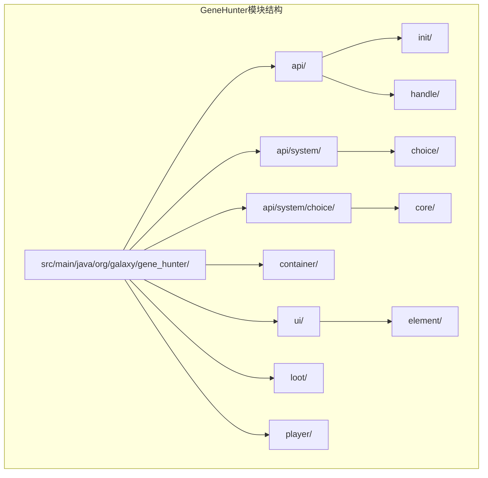

**图表来源**
- [GeneHunter.java:1-32](file://GeneHunter/src/main/java/org/galaxy/gene_hunter/GeneHunter.java#L1-L32)

**章节来源**
- [build.gradle:1-125](file://GeneHunter/build.gradle#L1-L125)

## 核心组件

### 主要职责

GeneHunter模块的核心职责包括：

1. **数据管理**：通过附件系统管理玩家的基因猎人数据
2. **属性系统**：为不同类型的武器提供伤害加成属性
3. **战利品系统**：实现基于战利品表的选择机制
4. **用户界面**：提供直观的物品选择界面
5. **网络通信**：处理客户端与服务器之间的RPC调用

### 初始化流程

模块启动时会执行以下初始化步骤：

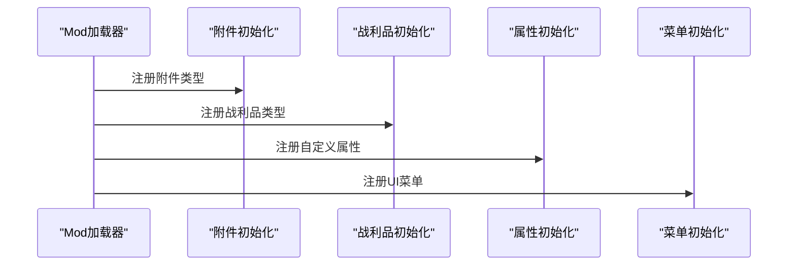

**图表来源**
- [GeneHunter.java:17-24](file://GeneHunter/src/main/java/org/galaxy/gene_hunter/GeneHunter.java#L17-L24)

**章节来源**
- [GeneHunter.java:13-32](file://GeneHunter/src/main/java/org/galaxy/gene_hunter/GeneHunter.java#L13-L32)

## 架构概览

### 整体架构设计

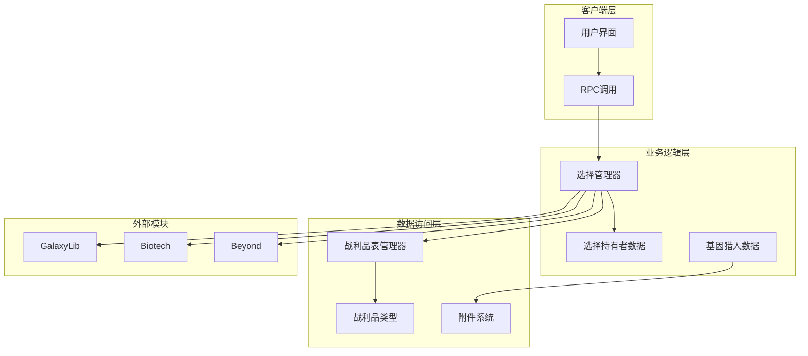

**图表来源**
- [ChoiceManager.java:23-33](file://GeneHunter/src/main/java/org/galaxy/gene_hunter/api/system/choice/ChoiceManager.java#L23-L33)
- [GeneHunterAttachInit.java:18-36](file://GeneHunter/src/main/java/org/galaxy/gene_hunter/api/init/GeneHunterAttachInit.java#L18-L36)

### 数据流架构

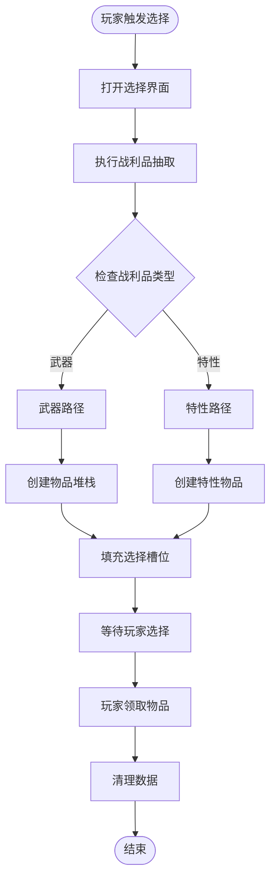

**图表来源**
- [ChoiceManager.java:69-93](file://GeneHunter/src/main/java/org/galaxy/gene_hunter/api/system/choice/ChoiceManager.java#L69-L93)

## 详细组件分析

### 附件系统组件

附件系统是GeneHunter模块的核心数据存储机制，负责为每个玩家持久化保存基因猎人相关的数据。

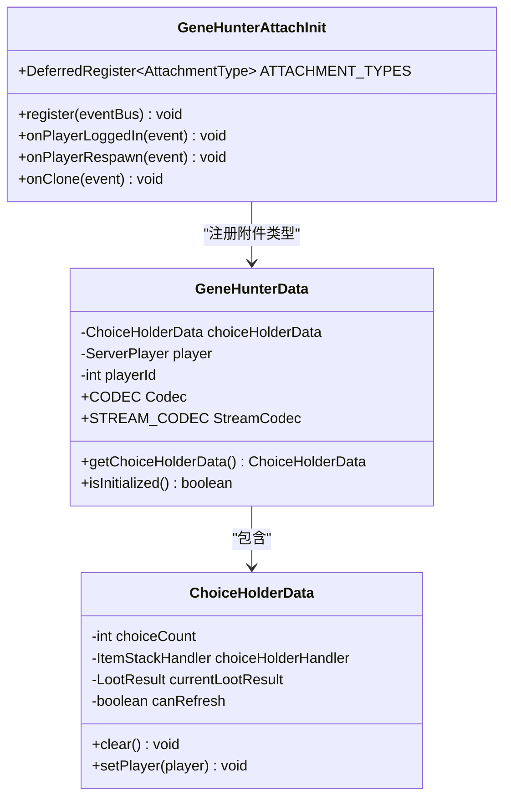

**图表来源**
- [GeneHunterAttachInit.java:16-36](file://GeneHunter/src/main/java/org/galaxy/gene_hunter/api/init/GeneHunterAttachInit.java#L16-L36)
- [GeneHunterData.java:12-41](file://GeneHunter/src/main/java/org/galaxy/gene_hunter/api/system/GeneHunterData.java#L12-L41)

#### 数据序列化机制

附件系统使用Mojang的序列化框架来确保数据在网络传输和持久化存储中的完整性：

- **Codec序列化**：用于数据的结构化存储
- **StreamCodec序列化**：用于网络数据包传输
- **自动复制机制**：在死亡时自动复制玩家数据

**章节来源**
- [GeneHunterAttachInit.java:24-36](file://GeneHunter/src/main/java/org/galaxy/gene_hunter/api/init/GeneHunterAttachInit.java#L24-L36)
- [GeneHunterData.java:49-72](file://GeneHunter/src/main/java/org/galaxy/gene_hunter/api/system/GeneHunterData.java#L49-L72)

### 属性系统组件

属性系统为不同类型的武器提供专门的伤害加成属性，增强游戏的策略性。

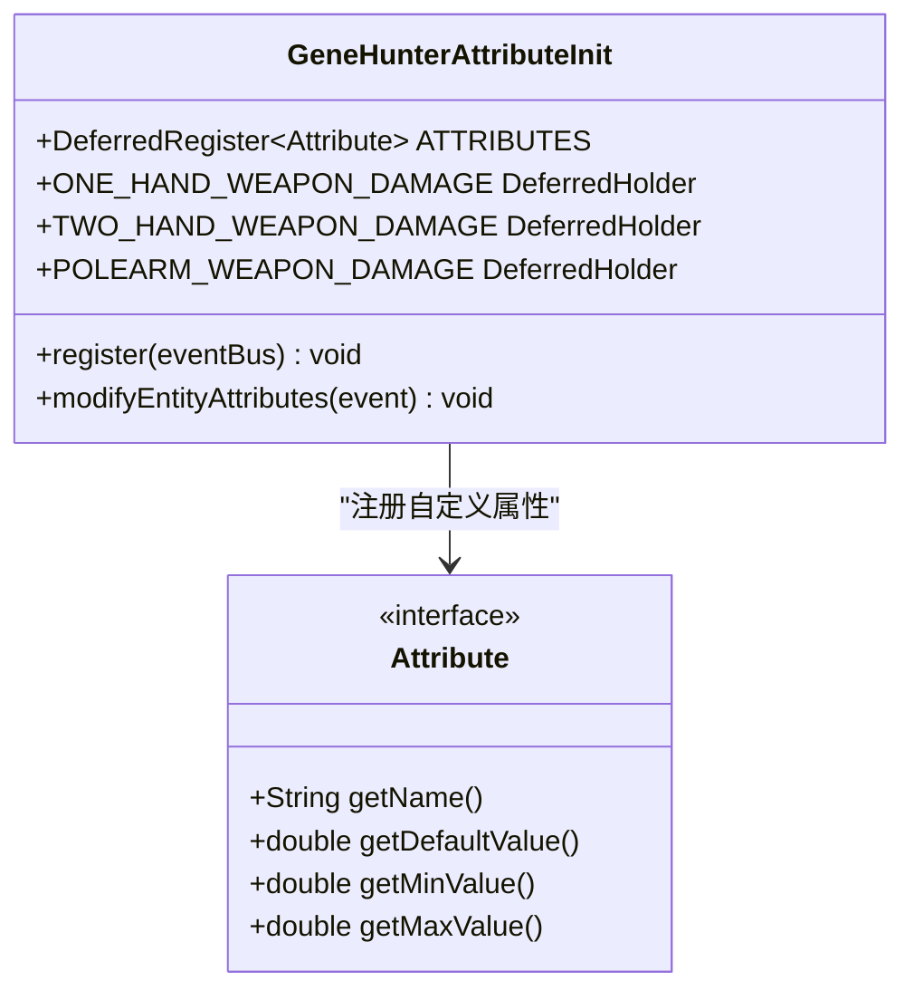

**图表来源**
- [GeneHunterAttributeInit.java:18-26](file://GeneHunter/src/main/java/org/galaxy/gene_hunter/api/init/GeneHunterAttributeInit.java#L18-L26)

#### 属性数值格式

属性值采用特殊的数值格式，允许同时提供固定伤害加成和百分比伤害加成：

- **整数部分**：固定伤害加成
- **小数部分**：百分比伤害加成

例如：
- `5.0` = +5点固定伤害
- `0.25` = +25%伤害加成  
- `5.25` = +5点固定伤害 + 25%伤害加成

**章节来源**
- [GeneHunterAttributeInit.java:28-44](file://GeneHunter/src/main/java/org/galaxy/gene_hunter/api/init/GeneHunterAttributeInit.java#L28-L44)

### 选择管理器组件

选择管理器是整个模块的核心业务逻辑组件，负责处理玩家的选择过程。

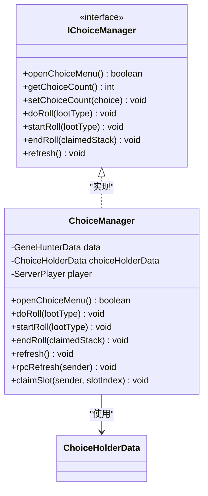

**图表来源**
- [IChoiceManager.java:7-47](file://GeneHunter/src/main/java/org/galaxy/gene_hunter/api/system/choice/core/IChoiceManager.java#L7-L47)
- [ChoiceManager.java:23-33](file://GeneHunter/src/main/java/org/galaxy/gene_hunter/api/system/choice/ChoiceManager.java#L23-L33)

#### RPC通信机制

选择管理器使用RPC（远程过程调用）机制来处理客户端与服务器之间的异步通信：

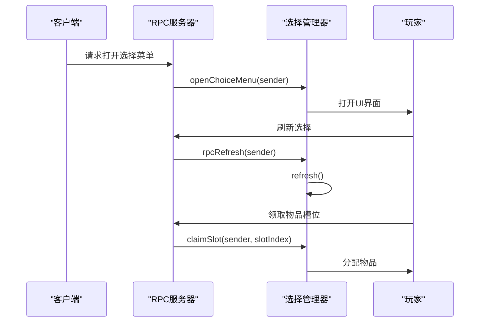

**图表来源**
- [ChoiceManager.java:47-55](file://GeneHunter/src/main/java/org/galaxy/gene_hunter/api/system/choice/ChoiceManager.java#L47-L55)
- [ChoiceManager.java:148-159](file://GeneHunter/src/main/java/org/galaxy/gene_hunter/api/system/choice/ChoiceManager.java#L148-L159)

**章节来源**
- [ChoiceManager.java:108-129](file://GeneHunter/src/main/java/org/galaxy/gene_hunter/api/system/choice/ChoiceManager.java#L108-L129)

### 用户界面组件

用户界面组件提供了直观的物品选择体验，基于LowDragLib2框架构建。

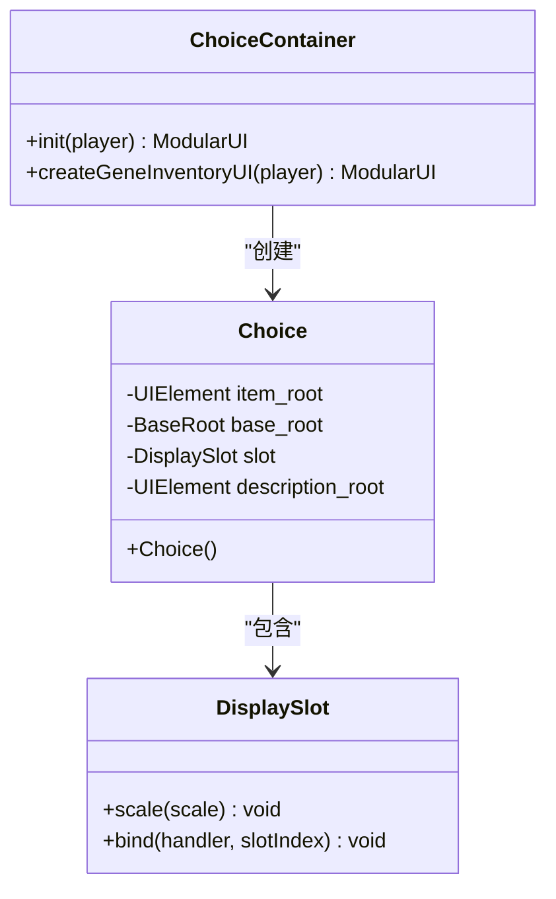

**图表来源**
- [ChoiceContainer.java:22-27](file://GeneHunter/src/main/java/org/galaxy/gene_hunter/container/ChoiceContainer.java#L22-L27)
- [Choice.java:15-25](file://GeneHunter/src/main/java/org/galaxy/gene_hunter/ui/element/Choice.java#L15-L25)

#### 界面布局设计

界面采用Flexbox布局系统，确保在不同分辨率下都能正确显示：

- **主容器**：使用ROW方向布局，水平排列选择槽位
- **槽位容器**：每个槽位占20%宽度，垂直居中对齐
- **按钮设计**：刷新按钮位于左上角，便于快速访问

**章节来源**
- [ChoiceContainer.java:28-48](file://GeneHunter/src/main/java/org/galaxy/gene_hunter/container/ChoiceContainer.java#L28-L48)

### 战利品系统组件

战利品系统基于GalaxyLib模块构建，提供了灵活的掉落机制。

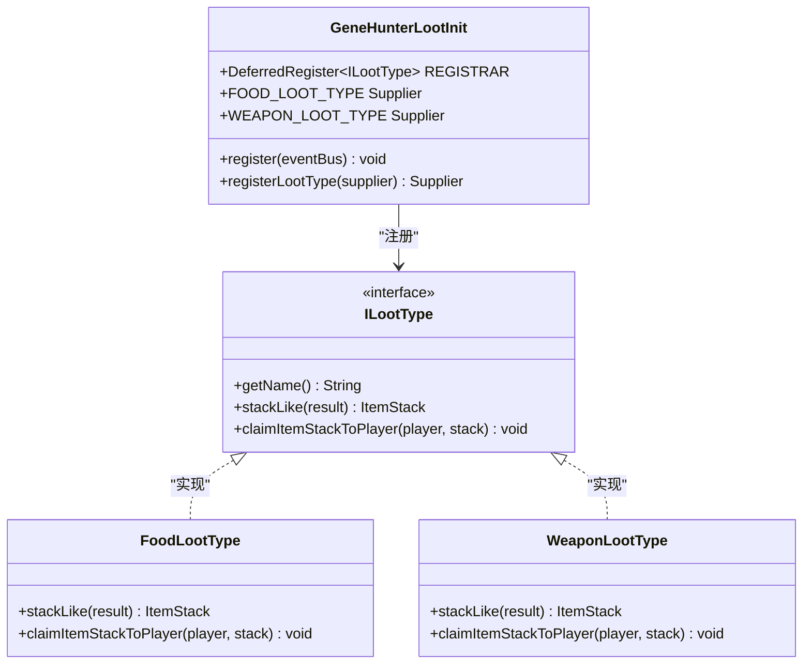

**图表来源**
- [GeneHunterLootInit.java:13-36](file://GeneHunter/src/main/java/org/galaxy/gene_hunter/api/init/GeneHunterLootInit.java#L13-L36)

## 依赖关系分析

### 模块间依赖

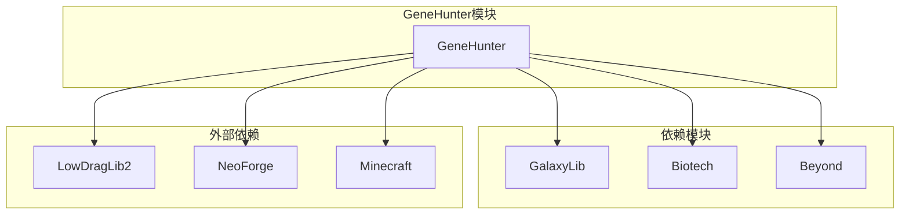

**图表来源**
- [build.gradle:71-98](file://GeneHunter/build.gradle#L71-L98)

### 外部库依赖

GeneHunter模块依赖多个外部库来实现特定功能：

- **LowDragLib2**：提供UI框架和RPC通信支持
- **GalaxyLib**：提供基础的战利品系统框架
- **Biotech**：提供基因和特性的相关功能
- **Beyond**：提供区域和事件系统

**章节来源**
- [build.gradle:71-98](file://GeneHunter/build.gradle#L71-L98)

## 性能考虑

### 数据序列化优化

1. **延迟初始化**：选择持有者数据采用延迟初始化，避免不必要的对象创建
2. **序列化缓存**：使用Mojang的序列化框架，提供高效的二进制序列化
3. **网络压缩**：StreamCodec用于网络传输，减少数据包大小

### 内存管理

1. **临时对象池**：避免频繁创建和销毁临时对象
2. **弱引用**：对玩家引用使用弱引用，防止内存泄漏
3. **及时清理**：在操作完成后及时清理不需要的数据

### 网络通信优化

1. **批量处理**：一次抽取多个结果，减少网络往返次数
2. **增量更新**：只传输必要的数据变化
3. **错误恢复**：提供完善的错误处理和重试机制

## 故障排除指南

### 常见问题及解决方案

#### 附件数据丢失

**问题描述**：玩家重生后附件数据丢失

**解决方案**：
1. 检查`copyOnDeath()`配置是否正确设置
2. 验证`onClone()`事件处理器是否正常工作
3. 确认数据序列化和反序列化过程

#### UI界面不响应

**问题描述**：选择界面无法打开或响应点击事件

**解决方案**：
1. 检查RPC调用是否正确注册
2. 验证`PlayerUIMenuType`是否正确初始化
3. 确认事件监听器是否绑定成功

#### 战利品抽取异常

**问题描述**：战利品抽取结果不符合预期

**解决方案**：
1. 检查战利品类型注册是否正确
2. 验证战利品表配置
3. 确认随机数生成器状态

**章节来源**
- [GeneHunterAttachInit.java:65-75](file://GeneHunter/src/main/java/org/galaxy/gene_hunter/api/init/GeneHunterAttachInit.java#L65-L75)
- [ChoiceManager.java:161-189](file://GeneHunter/src/main/java/org/galaxy/gene_hunter/api/system/choice/ChoiceManager.java#L161-L189)

## 结论

GeneHunter模块作为VerShift整合包的核心组件，成功实现了以下目标：

1. **模块化设计**：通过清晰的分层架构，实现了良好的模块解耦
2. **扩展性**：基于接口的设计使得新功能易于添加
3. **性能优化**：采用了多种优化技术确保运行效率
4. **用户体验**：提供了直观易用的用户界面

该模块为后续的功能扩展奠定了坚实的基础，特别是在与GalaxyLib、Beyond、Biotech等模块的集成方面展现了良好的兼容性和稳定性。