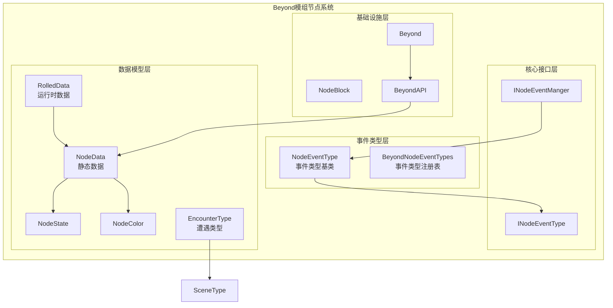
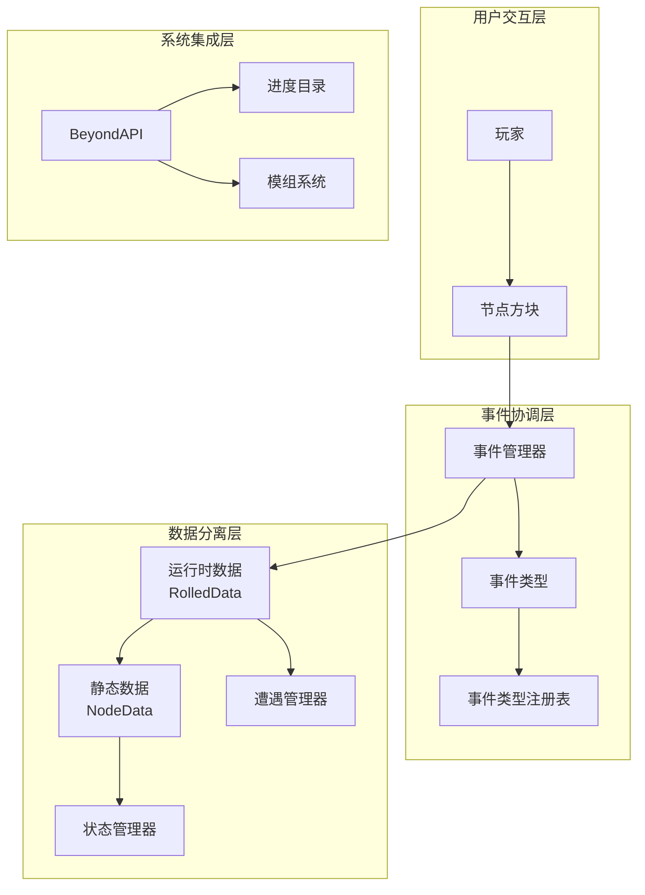
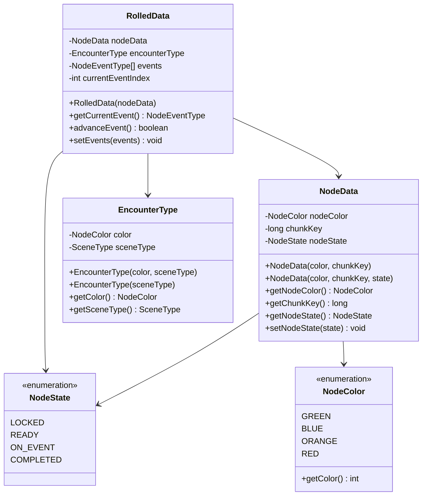
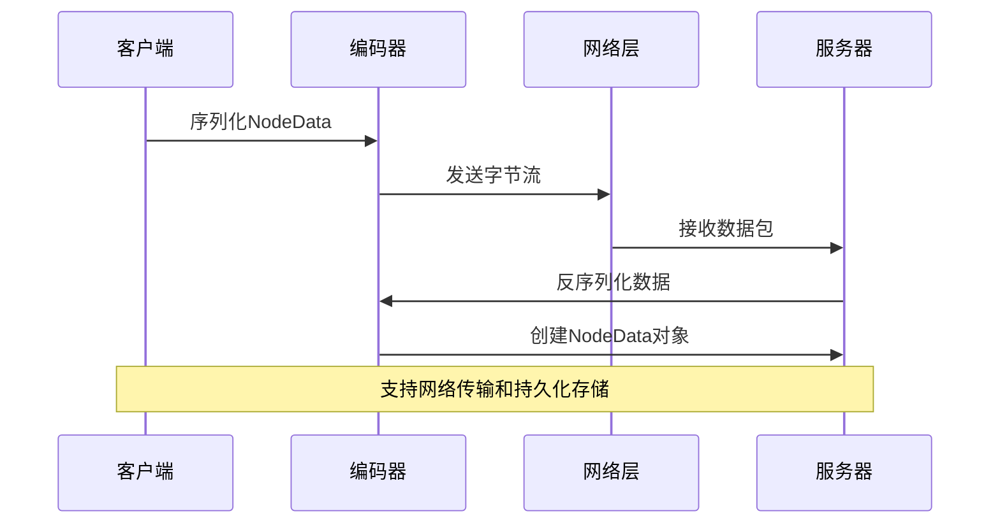
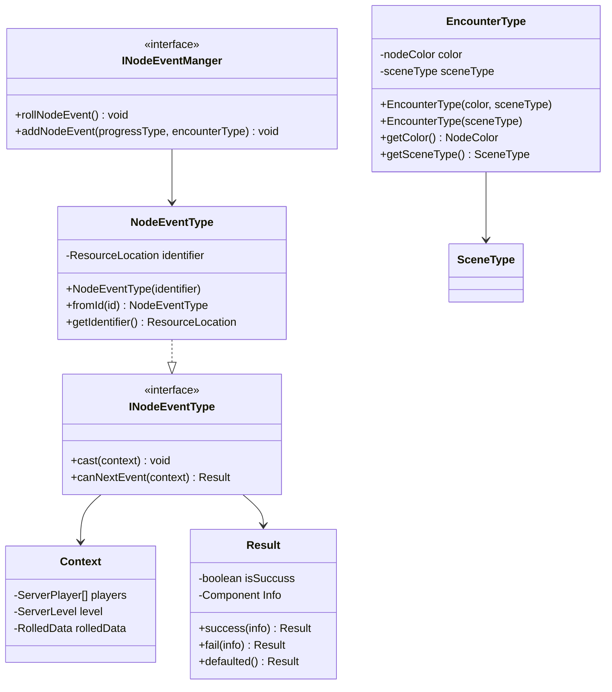
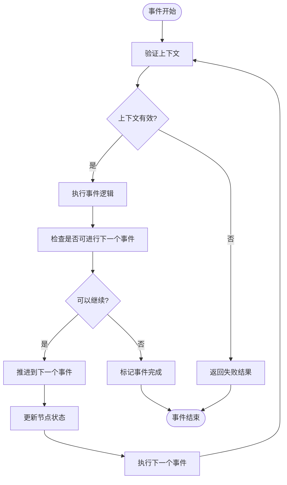
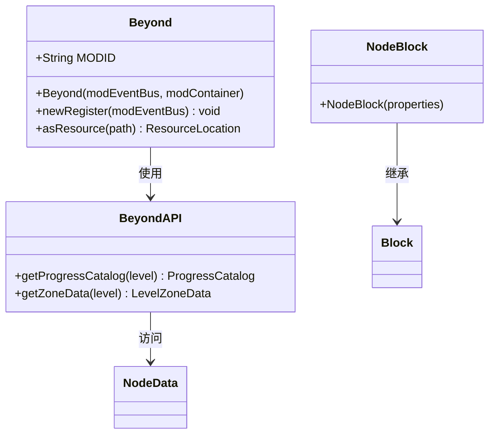
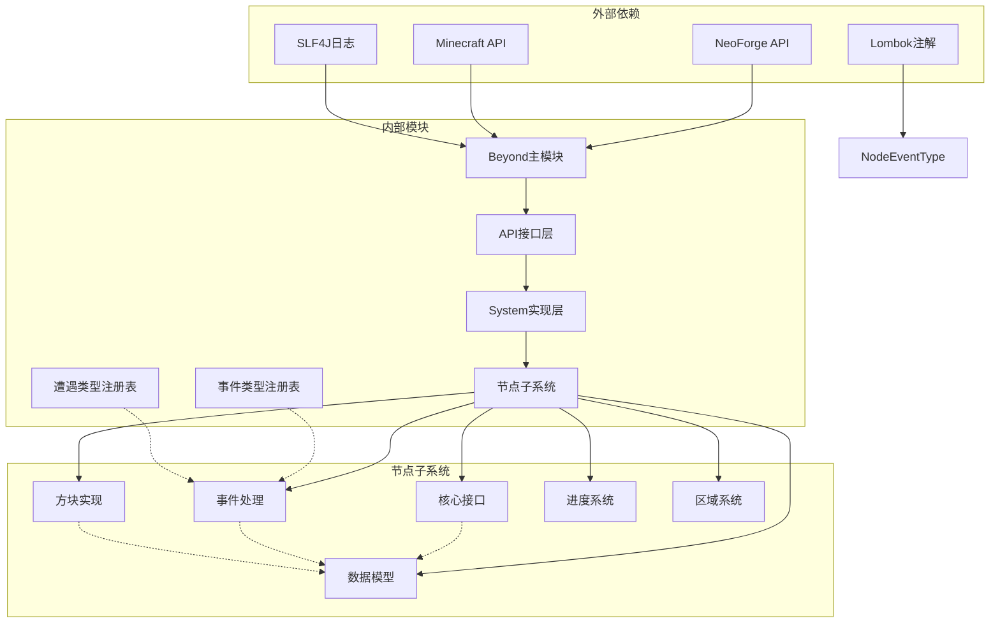

# 节点系统架构

<cite>
**本文档引用的文件**
- [Beyond.java](file://Beyond/src/main/java/com/pz/beyond/Beyond.java)
- [BeyondAPI.java](file://Beyond/src/main/java/com/pz/beyond/api/BeyondAPI.java)
- [INodeEventManger.java](file://Beyond/src/main/java/com/pz/beyond/api/system/node/core/INodeEventManger.java)
- [INodeEventType.java](file://Beyond/src/main/java/com/pz/beyond/api/system/node/core/INodeEventType.java)
- [NodeData.java](file://Beyond/src/main/java/com/pz/beyond/api/system/node/NodeData.java)
- [NodeEventType.java](file://Beyond/src/main/java/com/pz/beyond/api/system/node/NodeEventType.java)
- [NodeState.java](file://Beyond/src/main/java/com/pz/beyond/api/system/node/NodeState.java)
- [NodeColor.java](file://Beyond/src/main/java/com/pz/beyond/api/system/node/NodeColor.java)
- [RolledData.java](file://Beyond/src/main/java/com/pz/beyond/api/system/node/RolledData.java)
- [EncounterType.java](file://Beyond/src/main/java/com/pz/beyond/api/system/node/EncounterType.java)
- [NodeBlock.java](file://Beyond/src/main/java/com/pz/beyond/api/system/node/block/NodeBlock.java)
</cite>

## 更新摘要
**所做变更**
- 更新数据模型部分以反映NodeData简化和RolledData引入
- 新增静态/动态数据分离架构说明
- 更新事件处理组件以反映EncounterType重构
- 更新架构概览以体现新的数据分离模式
- 更新依赖关系分析以反映新的组件结构

## 目录
1. [简介](#简介)
2. [项目结构](#项目结构)
3. [核心组件](#核心组件)
4. [架构概览](#架构概览)
5. [详细组件分析](#详细组件分析)
6. [依赖关系分析](#依赖关系分析)
7. [性能考虑](#性能考虑)
8. [故障排除指南](#故障排除指南)
9. [结论](#结论)

## 简介

节点系统是Beyond模组中的核心机制，负责管理游戏世界中的特殊节点事件。该系统通过抽象的节点事件类型、状态管理和数据持久化机制，为玩家提供丰富的探索体验。系统采用模块化设计，将节点的静态数据、运行时数据和事件处理逻辑分离，确保了良好的可扩展性和维护性。

**更新** 系统经历了重大重构，引入了静态/动态数据分离架构，通过NodeData存储静态信息，RolledData管理运行时状态，实现了更清晰的数据组织和更好的性能表现。

## 项目结构

Beyond模组采用分层架构设计，节点系统位于api.system.node包下，包含以下主要层次：

**图表来源**
- [Beyond.java:16-52](file://Beyond/src/main/java/com/pz/beyond/Beyond.java#L16-L52)
- [INodeEventManger.java:6-14](file://Beyond/src/main/java/com/pz/beyond/api/system/node/core/INodeEventManger.java#L6-L14)
- [INodeEventType.java:10-38](file://Beyond/src/main/java/com/pz/beyond/api/system/node/core/INodeEventType.java#L10-L38)

**章节来源**
- [Beyond.java:16-52](file://Beyond/src/main/java/com/pz/beyond/Beyond.java#L16-L52)
- [BeyondAPI.java:11-26](file://Beyond/src/main/java/com/pz/beyond/api/BeyondAPI.java#L11-L26)

## 核心组件

节点系统的核心由七个关键组件构成，每个组件都有明确的职责分工：

### 数据管理层
- **NodeData**: 存储节点的静态信息，包括颜色、区块键和状态
- **RolledData**: 管理节点的运行时状态，包括遭遇类型、事件序列和当前事件索引
- **EncounterType**: 定义节点遭遇类型，包含颜色和场景类型信息
- **NodeState**: 定义节点的生命周期状态枚举
- **NodeColor**: 定义节点的颜色分类和视觉表示

### 事件处理层
- **INodeEventType**: 定义节点事件的标准接口规范
- **INodeEventManger**: 提供节点事件的管理接口
- **NodeEventType**: 抽象的事件类型基类，使用ResourceLocation标识符

### 基础设施层
- **NodeBlock**: 节点方块的基础实现
- **Beyond**: 主模组入口点
- **BeyondAPI**: 提供外部访问节点系统的API

**更新** 数据管理层现在实现了静态/动态数据分离，NodeData只存储不变的静态信息，而RolledData专门处理运行时状态变化。

**章节来源**
- [NodeData.java:13-88](file://Beyond/src/main/java/com/pz/beyond/api/system/node/NodeData.java#L13-L88)
- [RolledData.java:18-153](file://Beyond/src/main/java/com/pz/beyond/api/system/node/RolledData.java#L18-L153)
- [EncounterType.java:15-64](file://Beyond/src/main/java/com/pz/beyond/api/system/node/EncounterType.java#L15-L64)
- [NodeEventType.java:16-50](file://Beyond/src/main/java/com/pz/beyond/api/system/node/NodeEventType.java#L16-L50)

## 架构概览

节点系统采用分层架构，通过清晰的接口分离关注点，实现了高度的模块化和可扩展性。重构后的架构特别强调静态/动态数据分离：

**图表来源**
- [BeyondAPI.java:18-24](file://Beyond/src/main/java/com/pz/beyond/api/BeyondAPI.java#L18-L24)
- [INodeEventManger.java:11-13](file://Beyond/src/main/java/com/pz/beyond/api/system/node/core/INodeEventManger.java#L11-L13)
- [RolledData.java:87-105](file://Beyond/src/main/java/com/pz/beyond/api/system/node/RolledData.java#L87-L105)

系统的工作流程遵循以下模式：
1. 玩家与节点方块交互触发事件
2. 事件管理器协调事件类型选择，使用注册表管理
3. 运行时数据记录事件序列和状态变化
4. 静态数据提供基础配置信息，保持不变
5. 状态管理器跟踪节点生命周期
6. 遭遇管理器处理不同类型的节点遭遇

**更新** 新架构通过静态/动态数据分离提高了性能和可维护性，静态数据在节点生成时确定并缓存，运行时数据只在需要时创建和更新。

**章节来源**
- [Beyond.java:32-44](file://Beyond/src/main/java/com/pz/beyond/Beyond.java#L32-L44)
- [INodeEventType.java:12-13](file://Beyond/src/main/java/com/pz/beyond/api/system/node/core/INodeEventType.java#L12-L13)

## 详细组件分析

### 数据模型组件

节点系统的数据模型采用不可变设计原则，确保数据的一致性和线程安全性。重构后的架构实现了清晰的静态/动态数据分离：

**图表来源**
- [NodeData.java:50-87](file://Beyond/src/main/java/com/pz/beyond/api/system/node/NodeData.java#L50-L87)
- [RolledData.java:52-152](file://Beyond/src/main/java/com/pz/beyond/api/system/node/RolledData.java#L52-L152)
- [EncounterType.java:33-62](file://Beyond/src/main/java/com/pz/beyond/api/system/node/EncounterType.java#L33-L62)
- [NodeState.java:7-23](file://Beyond/src/main/java/com/pz/beyond/api/system/node/NodeState.java#L7-L23)
- [NodeColor.java:10-26](file://Beyond/src/main/java/com/pz/beyond/api/system/node/NodeColor.java#L10-L26)

#### 数据序列化机制

系统实现了完整的数据序列化支持，包括编码器和流编解码器。静态数据和运行时数据都支持高效的网络传输和持久化存储：

**更新** 序列化机制现在针对静态数据和运行时数据分别优化，静态数据使用紧凑格式，运行时数据包含必要的状态信息。

**图表来源**
- [NodeData.java:19-45](file://Beyond/src/main/java/com/pz/beyond/api/system/node/NodeData.java#L19-L45)
- [RolledData.java:25-47](file://Beyond/src/main/java/com/pz/beyond/api/system/node/RolledData.java#L25-L47)

**章节来源**
- [NodeData.java:19-45](file://Beyond/src/main/java/com/pz/beyond/api/system/node/NodeData.java#L19-L45)
- [RolledData.java:25-47](file://Beyond/src/main/java/com/pz/beyond/api/system/node/RolledData.java#L25-L47)

### 事件处理组件

事件处理系统采用策略模式，允许动态注册和执行不同类型的节点事件。EncounterType现在作为具体类而非接口存在：

**图表来源**
- [INodeEventType.java:10-38](file://Beyond/src/main/java/com/pz/beyond/api/system/node/core/INodeEventType.java#L10-L38)
- [NodeEventType.java:16-50](file://Beyond/src/main/java/com/pz/beyond/api/system/node/NodeEventType.java#L16-L50)
- [INodeEventManger.java:6-14](file://Beyond/src/main/java/com/pz/beyond/api/system/node/core/INodeEventManger.java#L6-L14)
- [EncounterType.java:15-64](file://Beyond/src/main/java/com/pz/beyond/api/system/node/EncounterType.java#L15-L64)

#### 事件执行流程

事件的执行遵循严格的生命周期管理，现在通过RolledData协调：

**更新** 事件执行现在通过RolledData协调，状态更新直接修改关联的NodeData，确保静态数据和运行时数据的一致性。

**图表来源**
- [INodeEventType.java:15-15](file://Beyond/src/main/java/com/pz/beyond/api/system/node/core/INodeEventType.java#L15-L15)
- [RolledData.java:98-105](file://Beyond/src/main/java/com/pz/beyond/api/system/node/RolledData.java#L98-L105)

**章节来源**
- [INodeEventType.java:20-35](file://Beyond/src/main/java/com/pz/beyond/api/system/node/core/INodeEventType.java#L20-L35)
- [RolledData.java:87-105](file://Beyond/src/main/java/com/pz/beyond/api/system/node/RolledData.java#L87-L105)

### 基础设施组件

基础设施层提供了系统运行所需的基本能力：

**图表来源**
- [Beyond.java:17-51](file://Beyond/src/main/java/com/pz/beyond/Beyond.java#L17-L51)
- [BeyondAPI.java:11-26](file://Beyond/src/main/java/com/pz/beyond/api/BeyondAPI.java#L11-L26)
- [NodeBlock.java:5-9](file://Beyond/src/main/java/com/pz/beyond/api/system/node/block/NodeBlock.java#L5-L9)

**章节来源**
- [Beyond.java:22-44](file://Beyond/src/main/java/com/pz/beyond/Beyond.java#L22-L44)
- [BeyondAPI.java:18-24](file://Beyond/src/main/java/com/pz/beyond/api/BeyondAPI.java#L18-L24)

## 依赖关系分析

节点系统的依赖关系体现了清晰的分层架构和新的静态/动态数据分离：

**更新** 依赖关系现在包含了新的注册表系统，事件类型和遭遇类型都通过各自的注册表管理，提高了系统的可扩展性。

**图表来源**
- [Beyond.java:3-14](file://Beyond/src/main/java/com/pz/beyond/Beyond.java#L3-L14)
- [BeyondAPI.java:7-9](file://Beyond/src/main/java/com/pz/beyond/api/BeyondAPI.java#L7-L9)

系统的主要依赖特点：
- **低耦合高内聚**: 各组件间通过接口通信，减少直接依赖
- **向后兼容**: 使用标准的Minecraft和NeoForge API确保兼容性
- **可测试性**: 清晰的接口定义便于单元测试和模拟
- **注册表模式**: 事件类型和遭遇类型通过注册表管理，支持动态扩展

**章节来源**
- [Beyond.java:3-14](file://Beyond/src/main/java/com/pz/beyond/Beyond.java#L3-L14)
- [INodeEventManger.java:3-4](file://Beyond/src/main/java/com/pz/beyond/api/system/node/core/INodeEventManger.java#L3-L4)

## 性能考虑

节点系统在设计时充分考虑了性能优化。重构后的架构在多个方面提升了性能：

### 内存管理
- **不可变数据结构**: NodeData采用不可变设计，减少内存碎片
- **对象池模式**: 事件类型使用注册表管理，避免重复创建
- **延迟初始化**: 运行时数据按需创建，减少启动开销
- **静态数据缓存**: 静态数据在节点生成时确定并缓存

### 网络优化
- **增量更新**: 仅在网络必要时同步节点状态变化
- **批量处理**: 多个节点状态变更合并发送
- **压缩传输**: 使用高效的编解码器减少网络带宽
- **数据分离**: 静态数据和运行时数据分别传输，优化带宽使用

### 并发安全
- **线程安全**: 所有公共接口设计为线程安全
- **原子操作**: 关键状态变更使用原子操作保证一致性
- **锁粒度优化**: 最小化锁的范围和持有时间
- **不可变对象**: 静态数据的不可变性天然支持并发访问

**更新** 新的静态/动态数据分离架构显著减少了不必要的数据传输和内存占用，运行时数据只在需要时创建和更新。

## 故障排除指南

### 常见问题诊断

**节点状态异常**
- 检查NodeState转换逻辑
- 验证状态转换的有效性
- 确认状态持久化机制
- 检查RolledData中的状态更新逻辑

**事件执行失败**
- 验证事件上下文的完整性
- 检查事件类型注册情况
- 确认事件处理器的可用性
- 验证EncounterType的正确性

**数据序列化错误**
- 验证编解码器的正确性
- 检查网络传输的完整性
- 确认版本兼容性
- 验证静态/动态数据分离的正确性

**更新** 新增了针对静态/动态数据分离的故障排除指导。

### 调试建议

1. **启用详细日志**: 在开发环境中启用DEBUG级别日志
2. **单元测试**: 为关键组件编写单元测试
3. **性能监控**: 使用性能分析工具监控系统行为
4. **回归测试**: 建立自动化回归测试套件
5. **数据分离验证**: 确保静态数据不被意外修改，运行时数据正确更新

**章节来源**
- [NodeState.java:25-43](file://Beyond/src/main/java/com/pz/beyond/api/system/node/NodeState.java#L25-L43)
- [INodeEventType.java:24-35](file://Beyond/src/main/java/com/pz/beyond/api/system/node/core/INodeEventType.java#L24-L35)

## 结论

节点系统展现了优秀的软件工程实践，通过清晰的分层架构、完善的接口设计和高效的实现机制，为游戏提供了灵活且可扩展的节点事件系统。重构后的架构通过静态/动态数据分离，进一步提升了系统的性能和可维护性。

**更新** 该架构的主要优势包括：
- **模块化设计**: 清晰的职责分离便于维护和扩展
- **接口驱动**: 通过接口实现松耦合的组件交互
- **数据分离**: 静态/动态数据分离确保性能和一致性
- **注册表模式**: 动态事件类型和遭遇类型管理
- **序列化优化**: 针对静态和动态数据的高效编解码
- **性能优化**: 多层次的性能考虑确保系统高效运行

未来的发展方向可以包括：
- 事件系统的进一步模块化
- 更丰富的节点类型支持
- 更完善的性能监控机制
- 动态数据的智能缓存策略
- 更好的多线程并发处理