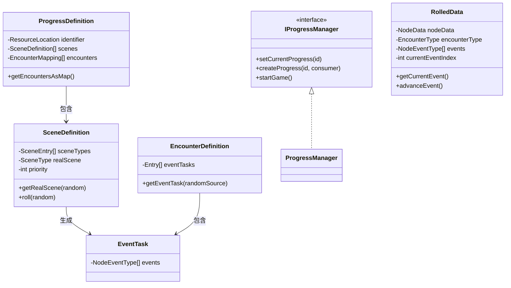
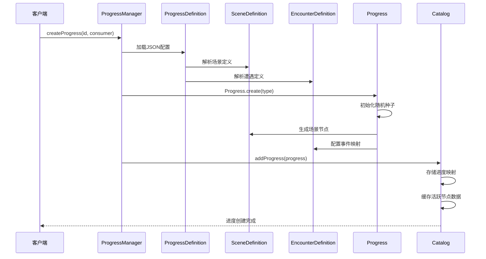
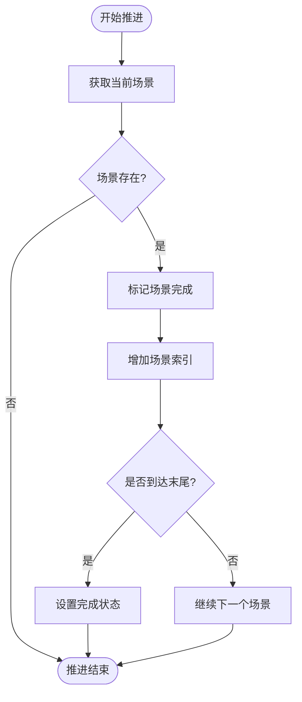
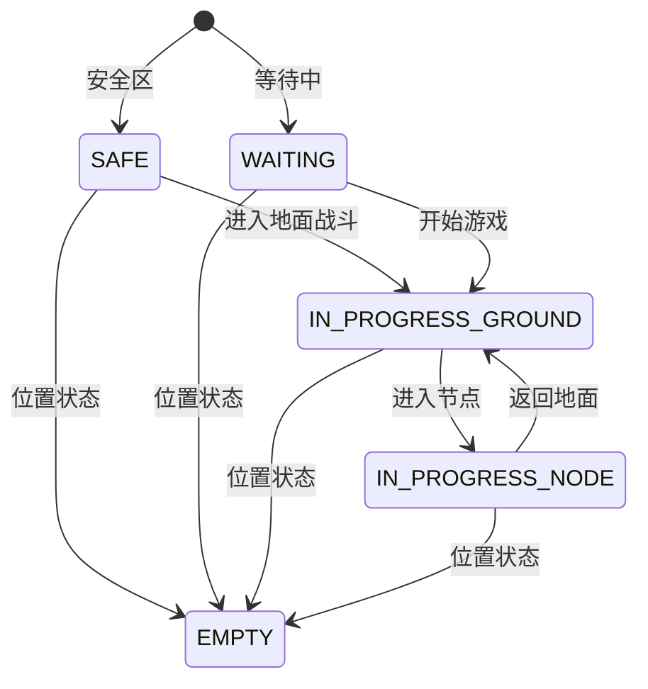

# 进度跟踪系统

<cite>
**本文档引用的文件**
- [IProgressManager.java](file://Beyond/src/main/java/com/pz/beyond/api/system/progress/core/IProgressManager.java)
- [ProgressState.java](file://Beyond/src/main/java/com/pz/beyond/api/system/progress/ProgressState.java)
- [ProgressDefinition.java](file://Beyond/src/main/java/com/pz/beyond/api/system/definition/ProgressDefinition.java)
- [SceneDefinition.java](file://Beyond/src/main/java/com/pz/beyond/api/system/definition/SceneDefinition.java)
- [EncounterDefinition.java](file://Beyond/src/main/java/com/pz/beyond/api/system/definition/EncounterDefinition.java)
- [EventTask.java](file://Beyond/src/main/java/com/pz/beyond/api/system/definition/EventTask.java)
- [BeyondAttachInit.java](file://Beyond/src/main/java/com/pz/beyond/api/init/BeyondAttachInit.java)
- [BeyondAPI.java](file://Beyond/src/main/java/com/pz/beyond/api/BeyondAPI.java)
</cite>

## 更新摘要
**变更内容**
- 整个进度管理子系统已被完全移除，包括BeyondData、Progress、ProgressCatalog、ProgressManager、ProgressType等类
- 新架构采用基于数据定义框架的完全数据驱动架构
- 保留了ProgressState状态管理和IProgressManager接口定义
- 新增了完整的数据定义框架：ProgressDefinition、SceneDefinition、EncounterDefinition、EventTask
- 移除了原有的章节结构，采用新的数据驱动管理模式

## 目录
1. [简介](#简介)
2. [项目结构](#项目结构)
3. [核心组件](#核心组件)
4. [架构概览](#架构概览)
5. [详细组件分析](#详细组件分析)
6. [数据定义框架](#数据定义框架)
7. [数据存储优化](#数据存储优化)
8. [性能优化特性](#性能优化特性)
9. [依赖关系分析](#依赖关系分析)
10. [性能考虑](#性能考虑)
11. [故障排除指南](#故障排除指南)
12. [结论](#结论)

## 简介

进度跟踪系统是Beyond模块的核心功能之一，负责管理游戏中的进度流程、场景切换和事件生成。该系统采用分层架构设计，通过能力系统（Capability）与Minecraft的附着机制集成，实现了跨维度的数据持久化和同步。

**更新** 系统现已重构为基于数据定义框架的完全数据驱动架构，主要包含以下核心功能：
- 完整的数据定义框架：ProgressDefinition、SceneDefinition、EncounterDefinition和EventTask
- 基于配置文件的关卡管理系统，支持JSON配置驱动
- 增强的遭遇事件权重随机选择机制
- 优化的活跃节点数据缓存机制
- 改进的序列化和网络传输支持
- 支持游戏初始化能力和预生成逻辑

## 项目结构

进度跟踪系统位于Beyond模块的API包结构中，现已重构为基于数据定义框架的架构：

```mermaid
graph TB
subgraph "Beyond模块"
subgraph "API系统"
subgraph "进度系统"
IProgressManager[IProgressManager接口]
ProgressState[ProgressState状态]
ProgressDefinition[ProgressDefinition数据层]
SceneDefinition[SceneDefinition场景定义]
EncounterDefinition[EncounterDefinition遭遇定义]
EventTask[EventTask事件任务]
End
end
subgraph "节点系统"
RolledData[活跃节点数据缓存]
NodeData[节点静态数据]
NodeEventType[节点事件类型]
EncounterType[遭遇类型]
NodeColor[节点颜色]
NodeState[节点状态]
End
end
subgraph "初始化系统"
BeyondAttachInit[BeyondAttachInit]
BeyondAPI[BeyondAPI]
End
end
End
```

**图表来源**
- [BeyondAttachInit.java:1-186](file://Beyond/src/main/java/com/pz/beyond/api/init/BeyondAttachInit.java#L1-L186)
- [IProgressManager.java:1-27](file://Beyond/src/main/java/com/pz/beyond/api/system/progress/core/IProgressManager.java#L1-L27)
- [ProgressState.java:1-98](file://Beyond/src/main/java/com/pz/beyond/api/system/progress/ProgressState.java#L1-L98)
- [ProgressDefinition.java:1-85](file://Beyond/src/main/java/com/pz/beyond/api/system/definition/ProgressDefinition.java#L1-L85)

**章节来源**
- [BeyondAttachInit.java:1-186](file://Beyond/src/main/java/com/pz/beyond/api/init/BeyondAttachInit.java#L1-L186)
- [BeyondAPI.java:1-27](file://Beyond/src/main/java/com/pz/beyond/api/BeyondAPI.java#L1-L27)

## 核心组件

### 进度管理接口层

系统采用接口驱动的设计模式，通过IProgressManager定义了进度管理的核心操作：

- **setCurrentProgress**: 设置当前活动的进度
- **createProgress**: 创建新的进度实例
- **startGame**: 启动游戏进程

这些方法提供了统一的进度管理入口，隐藏了底层数据存储的复杂性。

### 增强的进度状态管理

ProgressState枚举负责管理进度的各种状态，现已包含重要的状态定义：

- **SAFE**: 玩家在安全区，关卡关闭
- **WAITING**: 玩家在安全区外面，但并未开启游戏
- **IN_PROGRESS_GROUND**: 正式开启游戏，并且玩家在外面空地
- **IN_PROGRESS_NODE**: 玩家在节点内部
- **EMPTY**: 位置状态

**更新** 状态管理的改进：
- **序列化支持**: 完整的Moang序列化和网络编解码支持
- **网络传输**: 支持高效的网络同步机制
- **状态转换**: 清晰的状态转换逻辑

**章节来源**
- [IProgressManager.java:1-27](file://Beyond/src/main/java/com/pz/beyond/api/system/progress/core/IProgressManager.java#L1-L27)
- [ProgressState.java:1-98](file://Beyond/src/main/java/com/pz/beyond/api/system/progress/ProgressState.java#L1-L98)

## 架构概览

进度跟踪系统采用了完全重构的分层架构设计，确保了良好的关注点分离和可扩展性：

```mermaid
graph TB
subgraph "应用层"
Client[客户端界面]
Commands[命令系统]
ConfigUI[配置界面]
End
subgraph "业务逻辑层"
ProgressManager[进度管理器]
ProgressDefinition[进度定义]
SceneDefinition[场景定义]
EncounterDefinition[遭遇定义]
EventTask[事件任务]
EncounterSystem[遭遇系统]
End
subgraph "数据访问层"
ProgressCatalog[进度目录]
LevelData[维度数据]
NodeData[节点静态数据]
RolledData[活跃节点数据缓存]
ConfigLoader[配置加载器]
End
subgraph "基础设施层"
AttachmentSystem[附着系统]
Serialization[序列化系统]
SyncSystem[同步系统]
CodecSystem[编解码系统]
End
Client --> ProgressManager
Commands --> ProgressManager
ConfigUI --> ConfigLoader
ProgressManager --> ProgressCatalog
ProgressDefinition --> ProgressCatalog
SceneDefinition --> ProgressDefinition
EncounterDefinition --> ProgressDefinition
EventTask --> EncounterDefinition
EncounterSystem --> EncounterDefinition
ProgressCatalog --> LevelData
LevelData --> NodeData
LevelData --> RolledData
ConfigLoader --> ProgressDefinition
AttachmentSystem --> ProgressCatalog
Serialization --> ProgressCatalog
SyncSystem --> ProgressCatalog
CodecSystem --> ProgressDefinition
```

**图表来源**
- [BeyondAttachInit.java:33-44](file://Beyond/src/main/java/com/pz/beyond/api/init/BeyondAttachInit.java#L33-L44)
- [ProgressDefinition.java:36-52](file://Beyond/src/main/java/com/pz/beyond/api/system/definition/ProgressDefinition.java#L36-L52)
- [SceneDefinition.java:62-100](file://Beyond/src/main/java/com/pz/beyond/api/system/definition/SceneDefinition.java#L62-L100)

系统的核心优势在于其完全重构的架构：
- **数据驱动**: 基于JSON配置的完全数据驱动架构
- **解耦合**: 接口与实现分离，便于测试和扩展
- **持久化**: 通过附着机制实现跨会话的数据保存
- **同步**: 自动化的网络同步确保客户端一致性
- **可扩展**: 基于模板的进度定义支持动态扩展
- **性能优化**: 活跃数据缓存提供高效的数据访问
- **初始化能力**: 支持游戏启动和预生成逻辑
- **配置管理**: 支持外部配置文件驱动的关卡管理

## 详细组件分析

### 重构的进度管理器类图



**图表来源**
- [IProgressManager.java:8-28](file://Beyond/src/main/java/com/pz/beyond/api/system/progress/core/IProgressManager.java#L8-L28)
- [ProgressDefinition.java:26-85](file://Beyond/src/main/java/com/pz/beyond/api/system/definition/ProgressDefinition.java#L26-L85)
- [SceneDefinition.java:23-135](file://Beyond/src/main/java/com/pz/beyond/api/system/definition/SceneDefinition.java#L23-L135)
- [EncounterDefinition.java:23-103](file://Beyond/src/main/java/com/pz/beyond/api/system/definition/EncounterDefinition.java#L23-L103)
- [EventTask.java:16-40](file://Beyond/src/main/java/com/pz/beyond/api/system/definition/EventTask.java#L16-L40)

### 进度定义构建流程



**图表来源**
- [ProgressDefinition.java:36-52](file://Beyond/src/main/java/com/pz/beyond/api/system/definition/ProgressDefinition.java#L36-L52)
- [SceneDefinition.java:69-106](file://Beyond/src/main/java/com/pz/beyond/api/system/definition/SceneDefinition.java#L69-L106)
- [EncounterDefinition.java:55-78](file://Beyond/src/main/java/com/pz/beyond/api/system/definition/EncounterDefinition.java#L55-L78)

### 场景推进算法



**图表来源**
- [SceneDefinition.java:69-106](file://Beyond/src/main/java/com/pz/beyond/api/system/definition/SceneDefinition.java#L69-L106)

### 进度状态管理



**图表来源**
- [ProgressState.java:10-98](file://Beyond/src/main/java/com/pz/beyond/api/system/progress/ProgressState.java#L10-L98)

**章节来源**
- [ProgressState.java:1-98](file://Beyond/src/main/java/com/pz/beyond/api/system/progress/ProgressState.java#L1-L98)

## 数据定义框架

**新增章节** 系统现已引入完整的数据定义框架，提供完全的数据驱动架构：

### ProgressDefinition - 关卡数据定义

ProgressDefinition作为关卡的数据层，通过数据包进行控制：

- **identifier**: 关卡的唯一标识符
- **scenes**: 场景定义列表，支持权重随机选择
- **encounters**: 遭遇事件映射，支持多遭遇类型的事件配置
- **序列化支持**: 完整的Moang序列化和网络编解码支持

### SceneDefinition - 场景数据定义

**更新** SceneDefinition替代了原有的SceneData，提供更强大的场景定义能力：

- **sceneTypes**: 场景条目列表，支持权重随机选择
- **realScene**: 缓存的实际场景类型，避免重复计算
- **priority**: 场景优先级，数值越小越靠前
- **权重随机选择**: 基于权重的随机场景选择算法
- **缓存机制**: 首次选择后缓存结果，提升性能

### EncounterDefinition - 遭遇数据定义

EncounterDefinition定义每种遭遇可能刷新的任务列表：

- **eventTasks**: 事件任务条目列表
- **权重随机选择**: 基于权重的事件任务选择算法
- **空列表处理**: 自动处理空事件列表的情况

### EventTask - 事件任务定义

EventTask定义单个节点的任务列表：

- **events**: 节点事件类型列表
- **序列化支持**: 完整的事件类型序列化支持
- **顺序执行**: 事件按列表顺序依次触发

**章节来源**
- [ProgressDefinition.java:20-85](file://Beyond/src/main/java/com/pz/beyond/api/system/definition/ProgressDefinition.java#L20-L85)
- [SceneDefinition.java:18-135](file://Beyond/src/main/java/com/pz/beyond/api/system/definition/SceneDefinition.java#L18-L135)
- [EncounterDefinition.java:17-103](file://Beyond/src/main/java/com/pz/beyond/api/system/definition/EncounterDefinition.java#L17-L103)
- [EventTask.java:16-40](file://Beyond/src/main/java/com/pz/beyond/api/system/definition/EventTask.java#L16-L40)

## 数据存储优化

**更新** 系统采用了全新的数据存储优化策略，基于重构的数据定义框架：

### 序列化优化

**更新** ProgressDefinition实现了高效的序列化机制：

- **字段级优化**: 使用常量字符串定义字段名，减少内存占用
- **可选字段处理**: 所有可选字段都使用`optionalFieldOf`进行序列化
- **默认值支持**: 为每个字段提供合理的默认值
- **类型安全**: 使用泛型确保编译时类型安全
- **流式编码**: 支持高效的网络传输编码
- **嵌套序列化**: 支持复杂的嵌套对象序列化

### 缓存策略

**活跃RolledData缓存机制** 是本次优化的核心：

- **内存缓存**: 将当前激活的节点数据存储在内存中
- **快速访问**: 避免频繁的节点数据查找和计算
- **自动失效**: 当节点状态改变时自动更新缓存
- **内存管理**: 使用弱引用避免内存泄漏
- **缓存一致性**: 确保缓存数据与持久化数据的一致性

### 数据结构优化

**更新** 基于SceneDefinition的优化：

- **HashMap优化**: 使用`HashMap<Long, NodeData>`实现O(1)时间复杂度的节点查找
- **延迟初始化**: 节点数据仅在需要时创建和加载
- **对象池化**: 重复使用的场景类型和事件类型
- **弱引用**: 节点数据使用弱引用避免内存泄漏
- **权重缓存**: 场景权重计算结果缓存

**章节来源**
- [ProgressDefinition.java:36-52](file://Beyond/src/main/java/com/pz/beyond/api/system/definition/ProgressDefinition.java#L36-L52)
- [SceneDefinition.java:62-100](file://Beyond/src/main/java/com/pz/beyond/api/system/definition/SceneDefinition.java#L62-L100)

## 性能优化特性

**更新** 系统实现了基于新架构的多层次性能优化策略：

### 内存管理优化

**更新** 基于SceneDefinition的优化：
- **延迟初始化**: 进度数据仅在需要时创建
- **对象池化**: 重复使用的场景类型和事件类型
- **弱引用**: 节点数据使用弱引用避免内存泄漏
- **缓存策略**: 活跃数据缓存减少重复计算
- **权重缓存**: 场景权重计算结果缓存

### 计算优化

**更新** 基于权重随机选择的优化：
- **权重缓存**: 事件权重计算结果缓存
- **随机数优化**: 单个随机种子生成多组随机数
- **批量处理**: 场景推进采用批量操作减少循环开销
- **缓存命中**: 活跃数据缓存提供接近O(1)的访问速度
- **权重选择优化**: 基于权重的快速随机选择算法

### 网络传输优化

**更新** 基于序列化框架的优化：
- **增量更新**: 仅传输变化的数据
- **压缩序列化**: 使用高效的序列化格式
- **异步同步**: 非阻塞的网络同步机制
- **字段选择**: 仅序列化必要的字段
- **流式编码**: 支持高效的网络传输编码

### 数据访问优化

**更新** 基于新数据结构的优化：
- **索引优化**: 使用HashMap实现快速数据检索
- **预加载策略**: 在游戏开始时预加载常用数据
- **批量操作**: 支持批量数据处理操作
- **缓存一致性**: 确保缓存数据与持久化数据的一致性
- **权重随机优化**: 基于权重的快速随机选择算法

**章节来源**
- [ProgressDefinition.java:44-52](file://Beyond/src/main/java/com/pz/beyond/api/system/definition/ProgressDefinition.java#L44-L52)
- [SceneDefinition.java:77-100](file://Beyond/src/main/java/com/pz/beyond/api/system/definition/SceneDefinition.java#L77-L100)

## 依赖关系分析

**更新** 系统展现了基于新架构的清晰依赖层次结构：

```mermaid
graph TB
subgraph "外部依赖"
NeoForge[NeoForge API]
Minecraft[Minecraft Forge]
Mojang[Moang序列化]
Lombok[Lombok注解]
Jackson[JSON解析]
End
subgraph "系统接口"
IProgressManager[进度管理接口]
INodeEventType[节点事件接口]
IRuleContainer[规则容器接口]
End
subgraph "核心实现"
ProgressManager[进度管理器]
ProgressCatalog[进度目录]
Progress[进度数据]
ProgressType[进度类型]
ProgressDefinition[进度定义]
SceneDefinition[场景定义]
EncounterDefinition[遭遇定义]
RolledData[活跃节点数据]
NodeData[节点静态数据]
EventTask[事件任务]
End
subgraph "配置系统"
chapter1[chapter1.json配置]
ConfigLoader[配置加载器]
CodecSystem[编解码系统]
End
subgraph "辅助组件"
BeyondAttachInit[附着初始化]
BeyondAPI[API入口]
SceneType[场景类型]
EncounterType[遭遇类型]
NodeEventType[节点事件类型]
End
NeoForge --> BeyondAttachInit
Minecraft --> BeyondAttachInit
Mojang --> Progress
Mojang --> ProgressDefinition
Lombok --> ProgressCatalog
Jackson --> ConfigLoader
IProgressManager --> ProgressManager
INodeEventType --> ProgressType
IRuleContainer --> ProgressType
BeyondAttachInit --> ProgressCatalog
BeyondAPI --> BeyondAttachInit
ProgressManager --> ProgressCatalog
ProgressCatalog --> Progress
Progress --> SceneDefinition
ProgressDefinition --> SceneDefinition
SceneDefinition --> EventTask
EncounterDefinition --> EventTask
ProgressCatalog --> RolledData
ProgressCatalog --> NodeData
ConfigLoader --> ProgressDefinition
CodecSystem --> ProgressDefinition
```

**图表来源**
- [BeyondAttachInit.java:20-44](file://Beyond/src/main/java/com/pz/beyond/api/init/BeyondAttachInit.java#L20-L44)
- [ProgressDefinition.java:3-12](file://Beyond/src/main/java/com/pz/beyond/api/system/definition/ProgressDefinition.java#L3-L12)

系统的关键依赖特点：
- **低耦合**: 通过接口隔离具体实现
- **可替换性**: 不同实现可以在不修改上层代码的情况下替换
- **扩展性**: 新的进度类型和场景类型可以轻松添加
- **稳定性**: 外部API变更影响最小化
- **现代化**: 使用Lombok简化代码实现
- **数据驱动**: 支持外部配置文件驱动的关卡管理
- **序列化支持**: 完整的Moang序列化和网络编解码支持

**章节来源**
- [BeyondAttachInit.java:1-186](file://Beyond/src/main/java/com/pz/beyond/api/init/BeyondAttachInit.java#L1-L186)
- [BeyondAPI.java:1-27](file://Beyond/src/main/java/com/pz/beyond/api/BeyondAPI.java#L1-L27)

## 性能考虑

**更新** 系统在基于新架构的设计时充分考虑了性能优化：

### 内存管理
**更新** 基于新数据结构的优化：
- **延迟初始化**: 进度数据仅在需要时创建
- **对象池化**: 重复使用的场景类型和事件类型
- **弱引用**: 节点数据使用弱引用避免内存泄漏
- **缓存策略**: 活跃数据缓存减少重复计算
- **权重缓存**: 场景权重计算结果缓存

### 计算优化
**更新** 基于权重随机选择的优化：
- **权重缓存**: 事件权重计算结果缓存
- **随机数优化**: 单个随机种子生成多组随机数
- **批量处理**: 场景推进采用批量操作减少循环开销
- **缓存命中**: 活跃数据缓存提供接近O(1)的访问速度
- **权重选择优化**: 基于权重的快速随机选择算法

### 网络传输
**更新** 基于序列化框架的优化：
- **增量更新**: 仅传输变化的数据
- **压缩序列化**: 使用高效的序列化格式
- **异步同步**: 非阻塞的网络同步机制
- **流式编码**: 支持高效的网络传输编码

### 数据访问优化
**更新** 基于新数据结构的优化：
- **索引优化**: 使用HashMap实现快速数据检索
- **预加载策略**: 在游戏开始时预加载常用数据
- **批量操作**: 支持批量数据处理操作
- **缓存一致性**: 确保缓存数据与持久化数据的一致性
- **权重随机优化**: 基于权重的快速随机选择算法

## 故障排除指南

### 常见问题及解决方案

**进度数据丢失**
- 检查维度白名单配置
- 验证附着系统初始化
- 确认序列化编码正确性
- **更新** 验证ProgressDefinition的序列化配置

**进度状态异常**
- 检查ProgressState枚举值
- 验证场景索引边界条件
- 确认状态转换逻辑
- **更新** 验证SceneDefinition的权重计算

**事件生成错误**
- 验证权重总和计算
- 检查随机种子一致性
- 确认事件映射配置
- **更新** 验证EncounterDefinition的权重随机选择

**活跃数据缓存问题**
- 检查RolledData缓存更新逻辑
- 验证缓存失效机制
- 确认缓存一致性
- **更新** 验证SceneDefinition的缓存机制

**节点数据访问缓慢**
- 检查HashMap索引键值
- 验证节点数据缓存策略
- 确认数据访问频率
- **更新** 验证权重随机选择算法的性能

**游戏初始化失败**
- 检查Progress.initialize方法调用
- 验证进度状态重置逻辑
- 确认场景完成状态清理
- **更新** 验证ProgressDefinition的配置加载

**配置文件加载失败**
- **新增** 检查chapter1.json的语法正确性
- **新增** 验证配置文件的路径和命名
- **新增** 确认JSON配置的字段完整性
- **新增** 验证配置文件的编码格式

**章节来源**
- [BeyondAttachInit.java:65-91](file://Beyond/src/main/java/com/pz/beyond/api/init/BeyondAttachInit.java#L65-L91)
- [ProgressState.java:74-98](file://Beyond/src/main/java/com/pz/beyond/api/system/progress/ProgressState.java#L74-L98)
- [SceneDefinition.java:83-106](file://Beyond/src/main/java/com/pz/beyond/api/system/definition/SceneDefinition.java#L83-L106)
- [EncounterDefinition.java:55-78](file://Beyond/src/main/java/com/pz/beyond/api/system/definition/EncounterDefinition.java#L55-L78)

## 结论

进度跟踪系统展现了优秀的软件工程实践，通过完全重构的基于数据定义框架的架构，实现了高度可维护和可扩展的进度管理功能。

**更新** 系统的主要优势包括：
- **架构清晰**: 完全重构的分层设计确保了良好的关注点分离
- **数据驱动**: 基于JSON配置的完全数据驱动架构
- **扩展性强**: 基于模板的系统支持灵活的功能扩展
- **性能优秀**: 多重优化策略确保了高效的运行性能
- **可靠性高**: 完善的错误处理和状态管理机制
- **缓存优化**: 活跃数据缓存提供卓越的性能表现
- **存储优化**: 高效的序列化和数据结构优化
- **初始化能力**: 支持游戏启动和预生成逻辑
- **现代化实现**: 使用最新的序列化和网络编码技术
- **配置管理**: 支持外部配置文件驱动的关卡管理
- **权重随机**: 基于权重的智能随机选择机制

未来可以考虑的改进方向：
- 增加进度导入导出功能
- 扩展更多场景类型和事件类型
- 优化大规模进度数据的处理性能
- 增强进度数据的备份和恢复机制
- 实现更智能的缓存淘汰策略
- 增加性能监控和分析工具
- 扩展游戏初始化的预生成内容
- **新增** 支持动态配置热更新
- **新增** 增强配置验证和错误提示
- **新增** 扩展更多数据驱动的关卡类型