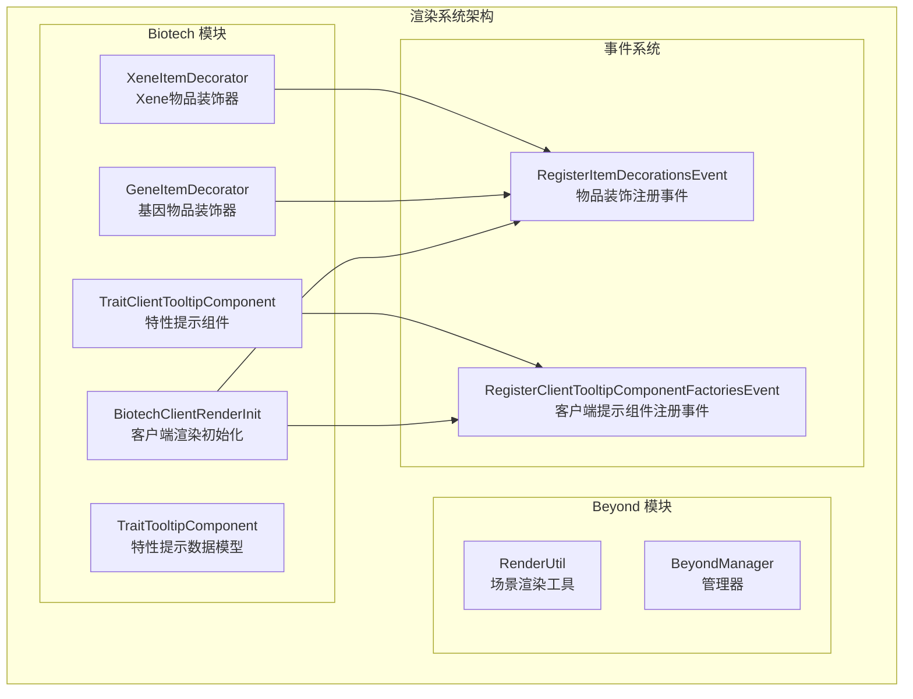
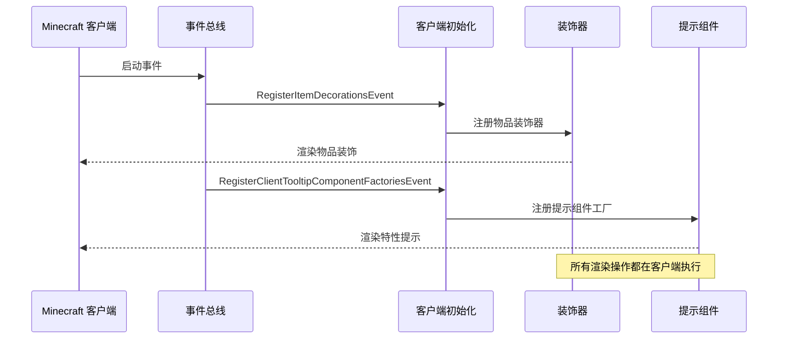
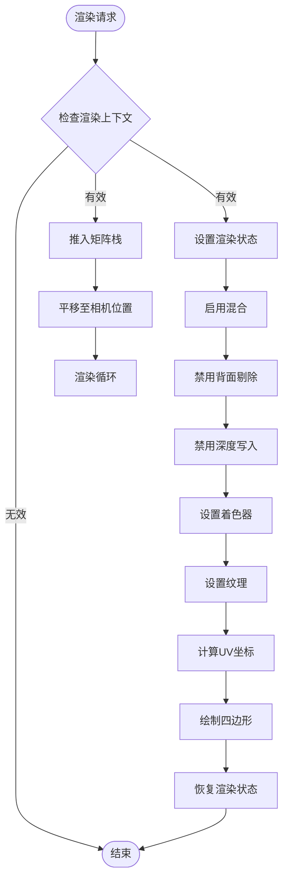
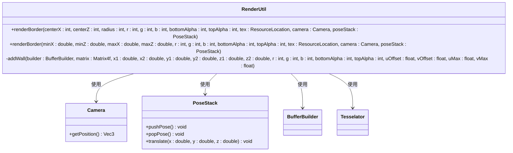
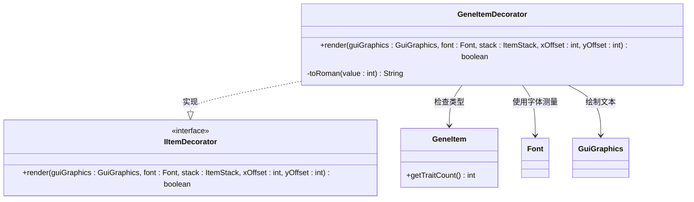
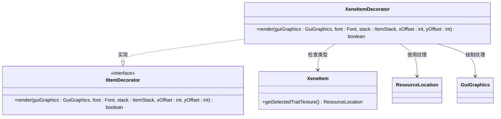
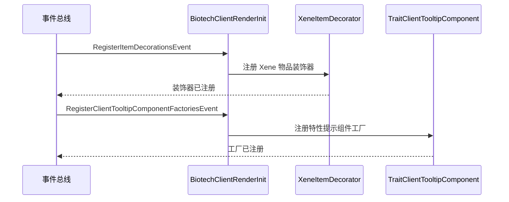
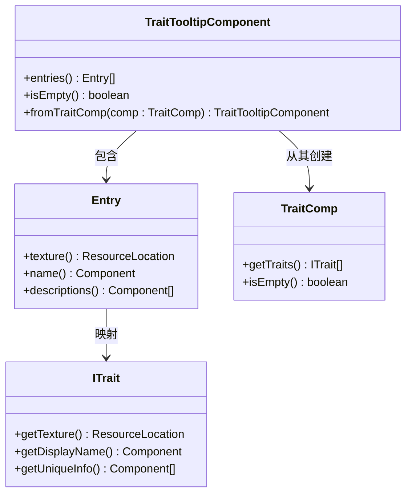
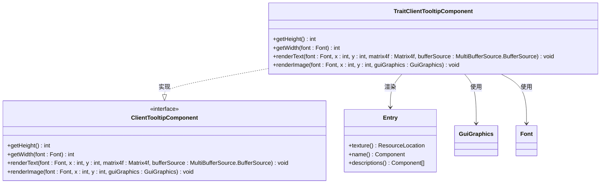
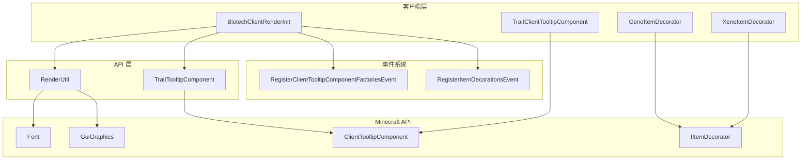

# 渲染系统

<cite>
**本文档引用的文件**
- [RenderUtil.java](file://Beyond/src/main/java/com/pz/beyond/api/util/RenderUtil.java)
- [GeneItemDecorator.java](file://Biotech/src/main/java/org/biotech/client/render/GeneItemDecorator.java)
- [XeneItemDecorator.java](file://Biotech/src/main/java/org/biotech/client/render/XeneItemDecorator.java)
- [BiotechClientRenderInit.java](file://Biotech/src/main/java/org/biotech/client/BiotechClientRenderInit.java)
- [TraitClientTooltipComponent.java](file://Biotech/src/main/java/org/biotech/client/tooltip/TraitClientTooltipComponent.java)
- [TraitTooltipComponent.java](file://Biotech/src/main/java/org/biotech/api/tooltip/TraitTooltipComponent.java)
- [Beyond.java](file://Beyond/src/main/java/com/pz/beyond/Beyond.java)
- [en_us.json (Biotech)](file://Biotech/src/main/resources/assets/biotech/lang/en_us.json)
- [en_us.json (Beyond)](file://Beyond/src/main/resources/assets/beyond/lang/en_us.json)
</cite>

## 目录
1. [简介](#简介)
2. [项目结构](#项目结构)
3. [核心组件](#核心组件)
4. [架构概览](#架构概览)
5. [详细组件分析](#详细组件分析)
6. [依赖关系分析](#依赖关系分析)
7. [性能考虑](#性能考虑)
8. [故障排除指南](#故障排除指南)
9. [结论](#结论)

## 简介

本文件全面分析了 VerShift 项目中两个主要模块的渲染系统：Beyond 模块的 3D 场景渲染和 Biotech 模块的 UI/物品装饰渲染。该渲染系统采用分层架构设计，将客户端渲染逻辑与业务逻辑分离，提供了灵活且可扩展的渲染解决方案。

渲染系统主要包含三个核心层面：
- **场景渲染层**：负责 3D 环境中的视觉效果渲染
- **UI 渲染层**：处理用户界面元素和交互反馈
- **物品装饰层**：提供物品图标上的额外视觉信息

## 项目结构

渲染系统在项目中的组织结构如下：

**图表来源**
- [RenderUtil.java:13-117](file://Beyond/src/main/java/com/pz/beyond/api/util/RenderUtil.java#L13-L117)
- [BiotechClientRenderInit.java:14-28](file://Biotech/src/main/java/org/biotech/client/BiotechClientRenderInit.java#L14-L28)

**章节来源**
- [Beyond.java:19-60](file://Beyond/src/main/java/com/pz/beyond/Beyond.java#L19-L60)
- [BiotechClientRenderInit.java:14-28](file://Biotech/src/main/java/org/biotech/client/BiotechClientRenderInit.java#L14-L28)

## 核心组件

### Beyond 模块渲染组件

Beyond 模块的核心渲染组件是 `RenderUtil` 类，它提供了高级的 3D 边界渲染功能：

**关键特性：**
- 支持动态纹理效果
- 可配置的颜色和透明度控制
- 相机坐标系下的世界空间渲染
- 四个墙体的批量渲染优化

### Biotech 模块渲染组件

Biotech 模块包含多个专门的渲染组件：

**物品装饰器：**
- `GeneItemDecorator`：为基因物品添加罗马数字徽章
- `XeneItemDecorator`：替换 Xene 物品的图标为选中特性的纹理

**UI 组件：**
- `TraitClientTooltipComponent`：客户端特性提示渲染
- `TraitTooltipComponent`：特性提示数据模型

**章节来源**
- [RenderUtil.java:15-81](file://Beyond/src/main/java/com/pz/beyond/api/util/RenderUtil.java#L15-L81)
- [GeneItemDecorator.java:10-34](file://Biotech/src/main/java/org/biotech/client/render/GeneItemDecorator.java#L10-L34)
- [XeneItemDecorator.java:11-29](file://Biotech/src/main/java/org/biotech/client/render/XeneItemDecorator.java#L11-L29)

## 架构概览

渲染系统的整体架构采用事件驱动的设计模式：

**图表来源**
- [BiotechClientRenderInit.java:19-27](file://Biotech/src/main/java/org/biotech/client/BiotechClientRenderInit.java#L19-L27)

### 渲染管线流程

**图表来源**
- [RenderUtil.java:40-80](file://Beyond/src/main/java/com/pz/beyond/api/util/RenderUtil.java#L40-L80)

**章节来源**
- [RenderUtil.java:18-80](file://Beyond/src/main/java/com/pz/beyond/api/util/RenderUtil.java#L18-L80)

## 详细组件分析

### RenderUtil 类分析

`RenderUtil` 是 Beyond 模块的核心渲染工具类，提供了高级的 3D 边界渲染功能：

**图表来源**
- [RenderUtil.java:13-117](file://Beyond/src/main/java/com/pz/beyond/api/util/RenderUtil.java#L13-L117)

**核心渲染方法：**
- `renderBorder(int, int, int, ...)`：以中心点和半径渲染方形边界
- `renderBorder(double, double, double, double, ...)`：以边界坐标渲染方形边界
- `addWall(...)`：内部方法，负责单个墙面的顶点数据生成

**渲染状态管理：**
- 启用混合模式以实现透明效果
- 禁用背面剔除确保从任意角度可见
- 禁用深度写入避免与其他渲染元素冲突

**章节来源**
- [RenderUtil.java:18-81](file://Beyond/src/main/java/com/pz/beyond/api/util/RenderUtil.java#L18-L81)
- [RenderUtil.java:106-111](file://Beyond/src/main/java/com/pz/beyond/api/util/RenderUtil.java#L106-L111)

### 物品装饰器组件分析

Biotech 模块实现了两个专门的物品装饰器来增强物品的视觉表现：

#### GeneItemDecorator 分析

**图表来源**
- [GeneItemDecorator.java:13-57](file://Biotech/src/main/java/org/biotech/client/render/GeneItemDecorator.java#L13-L57)

**装饰器工作流程：**
1. 检查物品是否为 GeneItem 类型
2. 获取物品上的特性数量
3. 当特性数量大于 1 时，转换为罗马数字并绘制徽章
4. 徽章位于物品图标的右下角区域

#### XeneItemDecorator 分析

**图表来源**
- [XeneItemDecorator.java:14-32](file://Biotech/src/main/java/org/biotech/client/render/XeneItemDecorator.java#L14-L32)

**装饰器功能：**
- 替换 Xene 物品的标准图标
- 显示选中特性的自定义纹理
- 在物品图标区域内进行精确绘制

**章节来源**
- [GeneItemDecorator.java:15-34](file://Biotech/src/main/java/org/biotech/client/render/GeneItemDecorator.java#L15-L34)
- [XeneItemDecorator.java:16-29](file://Biotech/src/main/java/org/biotech/client/render/XeneItemDecorator.java#L16-L29)

### 客户端渲染初始化分析

`BiotechClientRenderInit` 类负责注册所有客户端渲染组件：

**图表来源**
- [BiotechClientRenderInit.java:19-27](file://Biotech/src/main/java/org/biotech/client/BiotechClientRenderInit.java#L19-L27)

**初始化流程：**
1. 订阅 `RegisterItemDecorationsEvent` 事件
2. 订阅 `RegisterClientTooltipComponentFactoriesEvent` 事件
3. 注册 Xene 物品装饰器到指定的物品
4. 注册特性提示组件工厂

**章节来源**
- [BiotechClientRenderInit.java:14-28](file://Biotech/src/main/java/org/biotech/client/BiotechClientRenderInit.java#L14-L28)

### 特性提示组件分析

特性提示系统提供了丰富的物品信息展示功能：

#### TraitTooltipComponent 数据模型

**图表来源**
- [TraitTooltipComponent.java:15-62](file://Biotech/src/main/java/org/biotech/api/tooltip/TraitTooltipComponent.java#L15-L62)

#### TraitClientTooltipComponent 渲染器

**图表来源**
- [TraitClientTooltipComponent.java:14-79](file://Biotech/src/main/java/org/biotech/client/tooltip/TraitClientTooltipComponent.java#L14-L79)

**渲染特性：**
- 动态计算提示框尺寸
- 支持图标和文本的组合显示
- 可变行高和间距调整
- 自动换行和文本截断

**章节来源**
- [TraitTooltipComponent.java:25-52](file://Biotech/src/main/java/org/biotech/api/tooltip/TraitTooltipComponent.java#L25-L52)
- [TraitClientTooltipComponent.java:26-76](file://Biotech/src/main/java/org/biotech/client/tooltip/TraitClientTooltipComponent.java#L26-L76)

## 依赖关系分析

渲染系统的依赖关系呈现清晰的分层结构：

**图表来源**
- [BiotechClientRenderInit.java:14-28](file://Biotech/src/main/java/org/biotech/client/BiotechClientRenderInit.java#L14-L28)
- [RenderUtil.java:3-11](file://Beyond/src/main/java/com/pz/beyond/api/util/RenderUtil.java#L3-L11)

**依赖特点：**
- 所有渲染组件都依赖于 Minecraft 的客户端 API
- 事件驱动的组件注册机制
- 数据模型与渲染器的分离设计
- 接口抽象确保了良好的可扩展性

**章节来源**
- [Beyond.java:30-51](file://Beyond/src/main/java/com/pz/beyond/Beyond.java#L30-L51)

## 性能考虑

渲染系统在设计时充分考虑了性能优化：

### 渲染状态管理
- **状态最小化**：只在必要时修改渲染状态
- **批处理优化**：使用 `Tesselator` 和 `BufferBuilder` 进行批量渲染
- **状态恢复**：确保渲染完成后正确恢复原始状态

### 内存管理
- **对象池化**：避免频繁创建临时对象
- **纹理缓存**：利用 Minecraft 的纹理管理系统
- **资源释放**：及时清理渲染资源

### 渲染效率
- **条件渲染**：仅在需要时执行渲染逻辑
- **坐标变换**：使用矩阵栈进行高效的坐标变换
- **深度测试**：合理配置深度测试以避免不必要的渲染

## 故障排除指南

### 常见问题及解决方案

**问题：物品装饰未显示**
- 检查装饰器是否正确注册到事件总线
- 确认物品类型检查逻辑
- 验证纹理资源路径是否正确

**问题：渲染效果异常**
- 检查渲染状态是否正确恢复
- 确认相机坐标系转换是否正确
- 验证深度测试和混合模式设置

**问题：提示组件显示错误**
- 检查数据模型的空值处理
- 确认组件宽度和高度计算
- 验证字体测量和文本渲染

**章节来源**
- [RenderUtil.java:19-31](file://Beyond/src/main/java/com/pz/beyond/api/util/RenderUtil.java#L19-L31)
- [BiotechClientRenderInit.java:25-27](file://Biotech/src/main/java/org/biotech/client/BiotechClientRenderInit.java#L25-L27)

## 结论

VerShift 项目的渲染系统展现了优秀的架构设计和实现质量。通过分层的组件设计、事件驱动的注册机制以及对性能的精心优化，该系统为玩家提供了丰富而流畅的视觉体验。

**主要优势：**
- **模块化设计**：清晰的职责分离和接口抽象
- **事件驱动**：灵活的组件注册和生命周期管理
- **性能优化**：合理的渲染状态管理和资源利用
- **扩展性强**：易于添加新的渲染组件和效果

**未来改进方向：**
- 添加更多预设的渲染效果
- 实现更复杂的材质系统
- 优化大规模场景的渲染性能
- 增强渲染效果的配置选项

该渲染系统为整个 Modpack 提供了坚实的技术基础，为后续的功能扩展和性能优化奠定了良好基础。