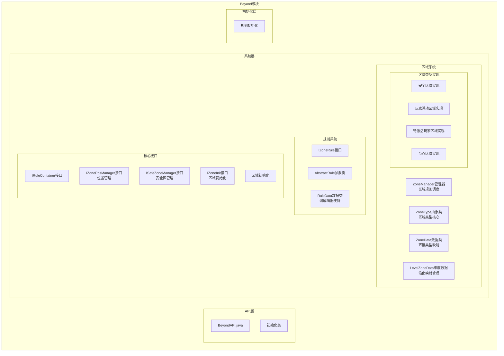
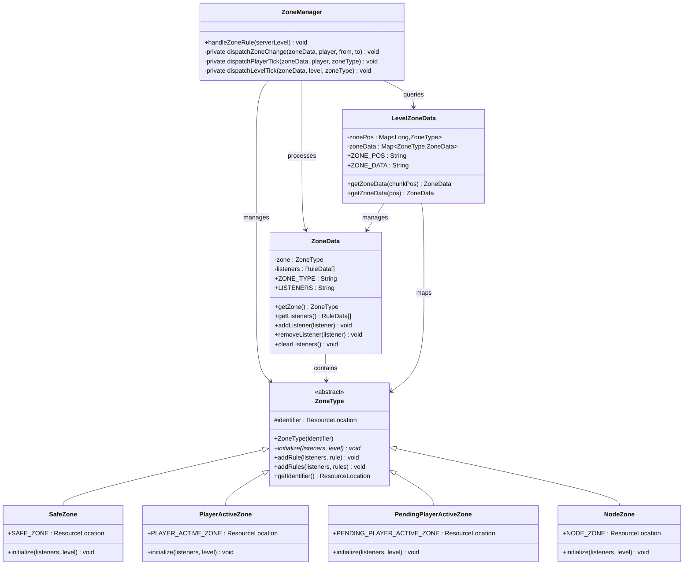
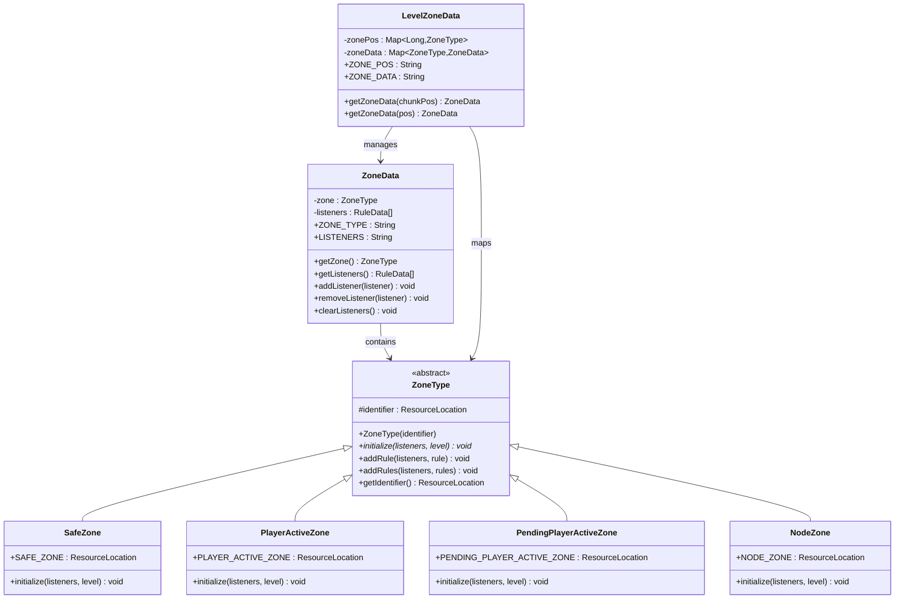
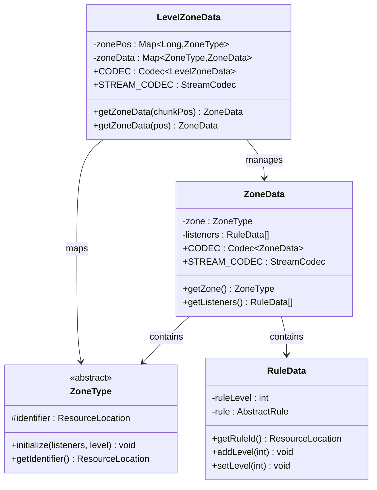
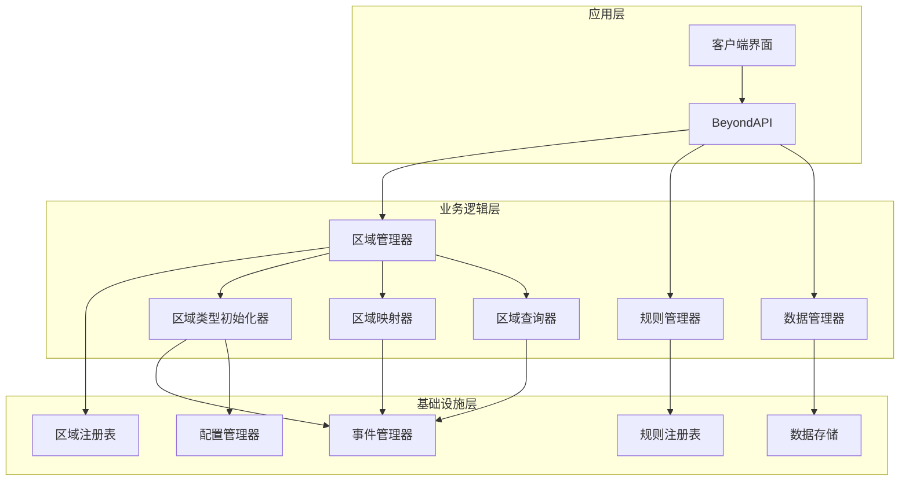
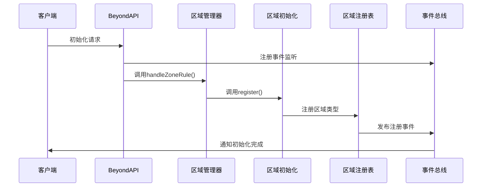
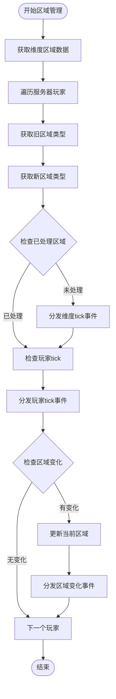
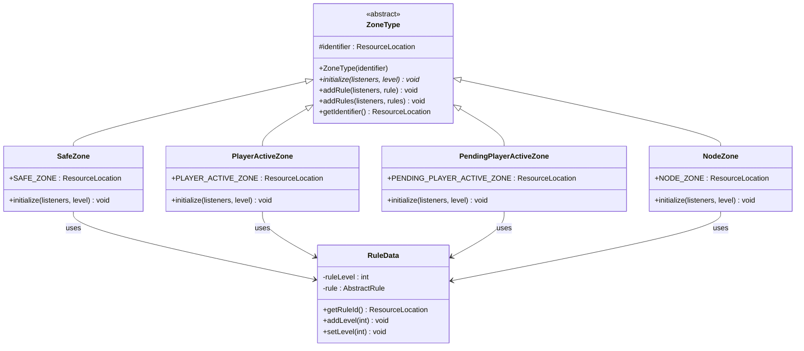
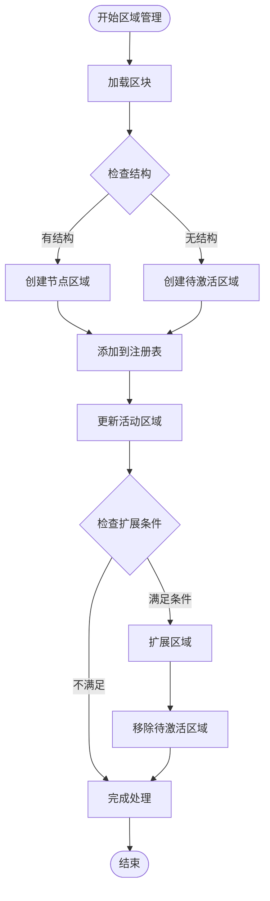
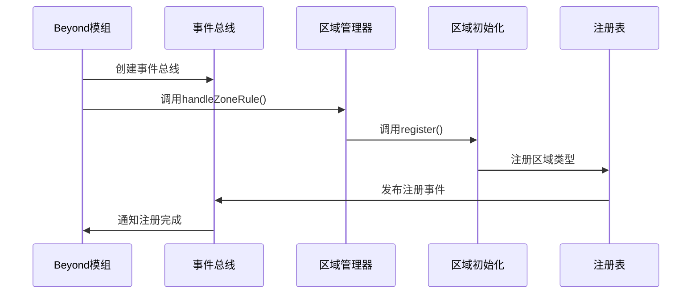

# 区域管理系统

<cite>
**本文档引用的文件**
- [Beyond.java](file://Beyond/src/main/java/com/pz/beyond/Beyond.java)
- [ZoneManager.java](file://Beyond/src/main/java/com/pz/beyond/api/system/zone/ZoneManager.java)
- [ZoneData.java](file://Beyond/src/main/java/com/pz/beyond/api/system/zone/ZoneData.java)
- [LevelZoneData.java](file://Beyond/src/main/java/com/pz/beyond/api/system/zone/LevelZoneData.java)
- [ZoneType.java](file://Beyond/src/main/java/com/pz/beyond/api/system/zone/ZoneType.java)
- [PlayerActiveZone.java](file://Beyond/src/main/java/com/pz/beyond/api/system/zone/zones/PlayerActiveZone.java)
- [SafeZone.java](file://Beyond/src/main/java/com/pz/beyond/api/system/zone/zones/SafeZone.java)
- [PendingPlayerActiveZone.java](file://Beyond/src/main/java/com/pz/beyond/api/system/zone/zones/PendingPlayerActiveZone.java)
- [NodeZone.java](file://Beyond/src/main/java/com/pz/beyond/api/system/zone/zones/NodeZone.java)
- [IRuleContainer.java](file://Beyond/src/main/java/com/pz/beyond/api/system/zone/core/IRuleContainer.java)
- [IZonePosManager.java](file://Beyond/src/main/java/com/pz/beyond/api/system/zone/core/IZonePosManager.java)
- [ISafeZoneManager.java](file://Beyond/src/main/java/com/pz/beyond/api/system/zone/core/ISafeZoneManager.java)
- [IZoneInit.java](file://Beyond/src/main/java/com/pz/beyond/api/system/zone/core/IZoneInit.java)
- [BeyondZoneInit.java](file://Beyond/src/main/java/com/pz/beyond/api/init/BeyondZoneInit.java)
- [IZoneRule.java](file://Beyond/src/main/java/com/pz/beyond/api/system/rule/IZoneRule.java)
- [AbstractRule.java](file://Beyond/src/main/java/com/pz/beyond/api/system/rule/AbstractRule.java)
- [RuleData.java](file://Beyond/src/main/java/com/pz/beyond/api/system/rule/RuleData.java)
</cite>

## 更新摘要
**变更内容**
- 新增ZoneManager管理器：引入专门的ZoneManager类统一管理区域规则调度
- 改进ZoneType设计：增强ZoneType的初始化机制，提供更丰富的规则添加方法
- 新增区域管理接口：添加IZoneInit、ISafeZoneManager等接口定义
- 完善区域位置管理：IZonePosManager提供完整的区域管理方法集合
- 优化区域数据结构：ZoneData和LevelZoneData支持更高效的区域查询和管理

## 目录
1. [简介](#简介)
2. [项目结构](#项目结构)
3. [核心组件](#核心组件)
4. [架构概览](#架构概览)
5. [详细组件分析](#详细组件分析)
6. [依赖关系分析](#依赖关系分析)
7. [性能考虑](#性能考虑)
8. [故障排除指南](#故障排除指南)
9. [结论](#结论)

## 简介

区域管理系统（Zone Management System）是Beyond模块的核心功能之一，负责管理游戏世界中的各种特殊区域及其规则。经过重大重构后，系统采用了更加简洁高效的架构设计，引入了专门的ZoneManager管理器，移除了复杂的chunk-key跟踪机制，直接使用ZoneType进行区域类型管理。

**重大架构改进**：
- **ZoneManager为核心**：新增ZoneManager类统一管理区域规则调度和事件分发
- **ZoneType为核心抽象**：ZoneType成为区域系统的核心抽象类，替代了之前的AbstractZone设计
- **简化映射机制**：LevelZoneData使用HashMap直接映射区块坐标到ZoneType，移除了复杂的chunk-key跟踪
- **直接类型管理**：ZoneData直接持有ZoneType实例，简化了区域数据结构
- **精简初始化流程**：ZoneType的initialize方法直接管理规则监听器，无需额外的初始化步骤
- **类型安全设计**：通过ZoneType.CODEC和StreamCodec确保区域类型的序列化和网络传输安全
- **接口化设计**：新增IZoneInit、ISafeZoneManager等接口，提供更好的扩展性

系统主要包含以下核心功能：
- 区域类型定义和管理
- 区域规则系统
- 区域数据持久化
- 区域位置管理
- 区域事件处理
- 区域管理器协调

## 项目结构

基于仓库分析，区域管理系统位于Beyond模块中，采用清晰的分层架构，现在以ZoneManager为核心：



**图表来源**
- [Beyond.java:16-44](file://Beyond/src/main/java/com/pz/beyond/Beyond.java#L16-L44)
- [BeyondZoneInit.java:19-63](file://Beyond/src/main/java/com/pz/beyond/api/init/BeyondZoneInit.java#L19-L63)
- [ZoneManager.java:12-68](file://Beyond/src/main/java/com/pz/beyond/api/system/zone/ZoneManager.java#L12-L68)

**章节来源**
- [Beyond.java:1-53](file://Beyond/src/main/java/com/pz/beyond/Beyond.java#L1-L53)
- [BeyondZoneInit.java:1-71](file://Beyond/src/main/java/com/pz/beyond/api/init/BeyondZoneInit.java#L1-L71)
- [ZoneManager.java:1-68](file://Beyond/src/main/java/com/pz/beyond/api/system/zone/ZoneManager.java#L1-L68)

## 核心组件

### 区域管理器

ZoneManager是区域系统的核心协调器，负责统一管理区域规则调度和事件分发：



**更新**：ZoneManager现在是区域系统的核心协调器，负责统一管理区域规则调度和事件分发。它通过handleZoneRule方法处理每个维度的区域规则，包括玩家区域变化检测、区域事件分发等。

**图表来源**
- [ZoneManager.java:12-68](file://Beyond/src/main/java/com/pz/beyond/api/system/zone/ZoneManager.java#L12-L68)
- [ZoneType.java:19-91](file://Beyond/src/main/java/com/pz/beyond/api/system/zone/ZoneType.java#L19-L91)
- [ZoneData.java:21-70](file://Beyond/src/main/java/com/pz/beyond/api/system/zone/ZoneData.java#L21-L70)
- [LevelZoneData.java:24-93](file://Beyond/src/main/java/com/pz/beyond/api/system/zone/LevelZoneData.java#L24-L93)

### 区域类型系统

区域系统现在以ZoneType为核心，提供了简洁而强大的区域类型管理机制：



**更新**：ZoneType现在是区域系统的核心抽象类，所有区域类型都继承自它。ZoneData直接持有ZoneType实例，LevelZoneData使用HashMap直接映射区块坐标到ZoneType，大大简化了区域管理机制。

**图表来源**
- [ZoneType.java:19-91](file://Beyond/src/main/java/com/pz/beyond/api/system/zone/ZoneType.java#L19-L91)
- [ZoneData.java:21-70](file://Beyond/src/main/java/com/pz/beyond/api/system/zone/ZoneData.java#L21-L70)
- [LevelZoneData.java:24-93](file://Beyond/src/main/java/com/pz/beyond/api/system/zone/LevelZoneData.java#L24-L93)
- [SafeZone.java:17-40](file://Beyond/src/main/java/com/pz/beyond/api/system/zone/zones/SafeZone.java#L17-L40)
- [PlayerActiveZone.java:14-28](file://Beyond/src/main/java/com/pz/beyond/api/system/zone/zones/PlayerActiveZone.java#L14-L28)
- [PendingPlayerActiveZone.java:14-27](file://Beyond/src/main/java/com/pz/beyond/api/system/zone/zones/PendingPlayerActiveZone.java#L14-L27)
- [NodeZone.java:14-29](file://Beyond/src/main/java/com/pz/beyond/api/system/zone/zones/NodeZone.java#L14-L29)

### 数据持久化层

区域数据通过ZoneType和RuleData的编解码器实现高效的数据传输和存储：



**更新**：LevelZoneData现在使用HashMap直接映射区块键值到ZoneType，ZoneData直接持有ZoneType实例，移除了复杂的chunk-key跟踪系统。ZoneType提供了完整的编解码器支持，确保区域类型的序列化和网络传输。

**图表来源**
- [ZoneData.java:56-69](file://Beyond/src/main/java/com/pz/beyond/api/system/zone/ZoneData.java#L56-L69)
- [LevelZoneData.java:70-92](file://Beyond/src/main/java/com/pz/beyond/api/system/zone/LevelZoneData.java#L70-L92)
- [ZoneType.java:77-90](file://Beyond/src/main/java/com/pz/beyond/api/system/zone/ZoneType.java#L77-L90)

**章节来源**
- [ZoneType.java:1-91](file://Beyond/src/main/java/com/pz/beyond/api/system/zone/ZoneType.java#L1-L91)
- [ZoneData.java:1-70](file://Beyond/src/main/java/com/pz/beyond/api/system/zone/ZoneData.java#L1-L70)
- [LevelZoneData.java:1-93](file://Beyond/src/main/java/com/pz/beyond/api/system/zone/LevelZoneData.java#L1-L93)

## 架构概览

区域管理系统采用模块化的三层架构设计，现在以ZoneManager为核心，提供了更加简洁高效的区域管理机制：



**更新**：系统现在包含了专门的区域类型初始化器、区域映射器和区域查询器，提供了更加精细的区域管理能力。ZoneManager成为整个系统的核心协调器，负责统一管理区域规则调度和事件分发。

系统的核心控制流程如下：



**图表来源**
- [Beyond.java:32-44](file://Beyond/src/main/java/com/pz/beyond/Beyond.java#L32-L44)
- [ZoneManager.java:15-42](file://Beyond/src/main/java/com/pz/beyond/api/system/zone/ZoneManager.java#L15-L42)
- [BeyondZoneInit.java:51-53](file://Beyond/src/main/java/com/pz/beyond/api/init/BeyondZoneInit.java#L51-L53)

**章节来源**
- [Beyond.java:1-53](file://Beyond/src/main/java/com/pz/beyond/Beyond.java#L1-L53)
- [ZoneManager.java:1-68](file://Beyond/src/main/java/com/pz/beyond/api/system/zone/ZoneManager.java#L1-L68)
- [BeyondZoneInit.java:1-71](file://Beyond/src/main/java/com/pz/beyond/api/init/BeyondZoneInit.java#L1-L71)

## 详细组件分析

### 区域管理器

ZoneManager是区域系统的核心协调器，负责统一管理区域规则调度和事件分发：



**更新**：ZoneManager现在提供完整的区域管理功能，包括区域规则处理、玩家区域变化检测、区域事件分发等。它通过handleZoneRule方法统一处理每个维度的区域规则，确保区域系统的协调运行。

**图表来源**
- [ZoneManager.java:15-42](file://Beyond/src/main/java/com/pz/beyond/api/system/zone/ZoneManager.java#L15-L42)
- [ZoneManager.java:43-49](file://Beyond/src/main/java/com/pz/beyond/api/system/zone/ZoneManager.java#L43-L49)
- [ZoneManager.java:51-58](file://Beyond/src/main/java/com/pz/beyond/api/system/zone/ZoneManager.java#L51-L58)
- [ZoneManager.java:60-66](file://Beyond/src/main/java/com/pz/beyond/api/system/zone/ZoneManager.java#L60-L66)

### 区域类型系统

ZoneType系统提供了灵活的区域类型管理机制，替代了之前的AbstractZone设计：



**更新**：ZoneType现在是区域系统的核心抽象类，所有区域类型都继承自它。每个ZoneType实现都有自己的initialize方法，直接管理规则监听器，无需额外的初始化步骤。

**图表来源**
- [ZoneType.java:19-91](file://Beyond/src/main/java/com/pz/beyond/api/system/zone/ZoneType.java#L19-L91)
- [SafeZone.java:32-35](file://Beyond/src/main/java/com/pz/beyond/api/system/zone/zones/SafeZone.java#L32-L35)
- [PlayerActiveZone.java:23-26](file://Beyond/src/main/java/com/pz/beyond/api/system/zone/zones/PlayerActiveZone.java#L23-L26)
- [PendingPlayerActiveZone.java:22-25](file://Beyond/src/main/java/com/pz/beyond/api/system/zone/zones/PendingPlayerActiveZone.java#L22-L25)
- [NodeZone.java:24-27](file://Beyond/src/main/java/com/pz/beyond/api/system/zone/zones/NodeZone.java#L24-L27)

### 区域位置管理

位置管理系统现在提供了更加简洁的区域管理方法：



**更新**：IZonePosManager接口现在包含了完整的区域管理方法，支持安全区、玩家活动区域和待激活区域的管理。ZoneType的initialize方法直接处理区域规则，无需复杂的初始化逻辑。

**图表来源**
- [IZonePosManager.java:5-39](file://Beyond/src/main/java/com/pz/beyond/api/system/zone/core/IZonePosManager.java#L5-L39)

**章节来源**
- [IZoneRule.java:1-37](file://Beyond/src/main/java/com/pz/beyond/api/system/rule/IZoneRule.java#L1-L37)
- [AbstractRule.java:1-56](file://Beyond/src/main/java/com/pz/beyond/api/system/rule/AbstractRule.java#L1-L56)
- [RuleData.java:1-77](file://Beyond/src/main/java/com/pz/beyond/api/system/rule/RuleData.java#L1-L77)
- [IZonePosManager.java:1-39](file://Beyond/src/main/java/com/pz/beyond/api/system/zone/core/IZonePosManager.java#L1-L39)

### 区域初始化流程

区域系统的初始化过程遵循标准的模组注册模式，现在更加简洁：



**更新**：BeyondZoneInit现在提供了完整的区域注册表功能，支持动态注册和区域查询。ZoneManager成为区域系统的核心协调器，负责统一管理区域规则调度和事件分发。

**图表来源**
- [Beyond.java:32-44](file://Beyond/src/main/java/com/pz/beyond/Beyond.java#L32-L44)
- [ZoneManager.java:15-42](file://Beyond/src/main/java/com/pz/beyond/api/system/zone/ZoneManager.java#L15-L42)
- [BeyondZoneInit.java:51-53](file://Beyond/src/main/java/com/pz/beyond/api/init/BeyondZoneInit.java#L51-L53)

**章节来源**
- [Beyond.java:1-53](file://Beyond/src/main/java/com/pz/beyond/Beyond.java#L1-L53)
- [ZoneManager.java:1-68](file://Beyond/src/main/java/com/pz/beyond/api/system/zone/ZoneManager.java#L1-L68)
- [BeyondZoneInit.java:1-71](file://Beyond/src/main/java/com/pz/beyond/api/init/BeyondZoneInit.java#L1-L71)

### 新增区域类型实现

系统现在包含了多种ZoneType实现：

#### 安全区域（SafeZone）
- **功能**：负责安全区的初始化和玩家传送
- **特性**：在initialize方法中添加AllSafeRule规则监听器
- **静态常量**：提供SAFE_ZONE标识符

#### 玩家活动区域（PlayerActiveZone）
- **功能**：定义玩家可活动的区域范围
- **特性**：initialize方法为空实现，专注于区域标记

#### 待激活玩家区域（PendingPlayerActiveZone）
- **功能**：管理待激活的玩家活动区域
- **特性**：initialize方法为空实现，支持批量处理

#### 节点区域（NodeZone）
- **功能**：与游戏进度系统集成的特殊区域
- **特性**：initialize方法为空实现，支持进度管理

**章节来源**
- [SafeZone.java:1-40](file://Beyond/src/main/java/com/pz/beyond/api/system/zone/zones/SafeZone.java#L1-L40)
- [PlayerActiveZone.java:1-28](file://Beyond/src/main/java/com/pz/beyond/api/system/zone/zones/PlayerActiveZone.java#L1-L28)
- [PendingPlayerActiveZone.java:1-27](file://Beyond/src/main/java/com/pz/beyond/api/system/zone/zones/PendingPlayerActiveZone.java#L1-L27)
- [NodeZone.java:1-29](file://Beyond/src/main/java/com/pz/beyond/api/system/zone/zones/NodeZone.java#L1-L29)

### 新增接口定义

系统现在包含了多个新的接口定义：

#### IZoneInit接口
- **功能**：定义区域初始化的标准接口
- **特性**：提供区域生成和初始化的规范

#### ISafeZoneManager接口
- **功能**：管理安全区的专门接口
- **特性**：提供安全区相关的管理功能

#### IRuleContainer接口
- **功能**：定义规则容器的标准接口
- **特性**：提供规则的增删改查功能

**章节来源**
- [IZoneInit.java:1-16](file://Beyond/src/main/java/com/pz/beyond/api/system/zone/core/IZoneInit.java#L1-L16)
- [ISafeZoneManager.java:1-7](file://Beyond/src/main/java/com/pz/beyond/api/system/zone/core/ISafeZoneManager.java#L1-L7)
- [IRuleContainer.java:1-16](file://Beyond/src/main/java/com/pz/beyond/api/system/zone/core/IRuleContainer.java#L1-L16)

## 依赖关系分析

系统采用松耦合的设计原则，通过ZoneType和接口实现模块间的解耦：

```mermaid
graph TB
subgraph "外部依赖"
NeoForge[NeoForge API]
Minecraft[Minecraft API]
Lombok[Lombok注解]
SLF4J[日志框架]
End
subgraph "内部模块"
Beyond[Beyond主模块]
ZoneSystem[区域系统]
RuleSystem[规则系统]
DataService[数据服务]
ProgressSystem[进度系统]
TeleportSystem[传送系统]
RenderSystem[渲染系统]
ConfigSystem[配置系统]
end
Beyond --> ZoneSystem
Beyond --> RuleSystem
Beyond --> DataService
Beyond --> ProgressSystem
Beyond --> TeleportSystem
Beyond --> RenderSystem
Beyond --> ConfigSystem
ZoneSystem --> NeoForge
ZoneSystem --> Minecraft
ZoneSystem --> Lombok
ZoneSystem --> SLF4J
RuleSystem --> NeoForge
RuleSystem --> Minecraft
RuleSystem --> SLF4J
DataService --> Minecraft
ProgressSystem --> SLF4J
TeleportSystem --> SLF4J
RenderSystem --> SLF4J
ConfigSystem --> SLF4J
```

**更新**：系统现在以ZoneManager为核心，集成了更多的子系统，包括进度系统、传送系统、渲染系统和配置系统。ZoneManager成为整个系统的核心协调器，负责统一管理区域规则调度和事件分发。

**图表来源**
- [ZoneType.java:3-13](file://Beyond/src/main/java/com/pz/beyond/api/system/zone/ZoneType.java#L3-L13)
- [ZoneData.java:3-14](file://Beyond/src/main/java/com/pz/beyond/api/system/zone/ZoneData.java#L3-L14)
- [ZoneManager.java:1-68](file://Beyond/src/main/java/com/pz/beyond/api/system/zone/ZoneManager.java#L1-L68)

系统的关键依赖特性：
- **ZoneManager为核心**：ZoneManager负责统一管理区域规则调度和事件分发
- **ZoneType为核心抽象**：所有区域操作都围绕ZoneType展开
- **低耦合高内聚**：各模块职责明确，接口清晰
- **可扩展性**：通过注册表模式支持动态扩展
- **类型安全**：使用ZoneType.CODEC和StreamCodec确保数据完整性
- **日志记录**：使用SLF4J提供详细的运行时日志

**章节来源**
- [ZoneType.java:1-91](file://Beyond/src/main/java/com/pz/beyond/api/system/zone/ZoneType.java#L1-L91)
- [ZoneData.java:1-70](file://Beyond/src/main/java/com/pz/beyond/api/system/zone/ZoneData.java#L1-L70)
- [ZoneManager.java:1-68](file://Beyond/src/main/java/com/pz/beyond/api/system/zone/ZoneManager.java#L1-L68)

## 性能考虑

区域管理系统在重构后充分考虑了性能优化：

### 数据结构优化
- 使用HashMap直接映射区块键值到ZoneType，提供O(1)的查找性能
- ZoneData直接持有ZoneType实例，避免了额外的对象创建
- 使用流编解码器进行高效的网络传输
- **新增**：ZoneManager使用HashSet跟踪已处理区域，避免重复处理

### 内存管理
- 区域数据采用直接映射机制，减少内存占用
- 规则数据通过引用共享，减少内存占用
- 提供显式的清理方法防止内存泄漏
- **新增**：ZoneManager使用CopyOnWriteArrayList确保线程安全

### 并发安全
- ZoneData使用CopyOnWriteArrayList确保线程安全
- HashMap操作采用线程安全的实现
- 提供适当的同步机制保护共享状态
- **新增**：ZoneManager的dispatch方法提供线程安全的事件分发

### 区域管理优化
- **新增**：ZoneManager提供了完整的区域管理功能
- **新增**：支持批量区域操作，提高处理效率
- **新增**：缓存ZoneType实例，避免重复创建
- **新增**：ZoneManager使用HashSet跟踪已处理区域，避免重复处理

## 故障排除指南

### 常见问题及解决方案

**问题1：区域类型注册失败**
- 检查ZoneType标识符是否唯一
- 确认注册表初始化顺序正确
- 验证资源路径格式是否正确
- **新增**：确认ZoneType是否正确继承ZoneType基类

**问题2：规则应用异常**
- 检查RuleData级别范围是否有效
- 确认规则类型兼容性
- 验证规则依赖关系
- **新增**：检查ZoneType.initialize方法中的规则添加逻辑

**问题3：数据持久化错误**
- 检查ZoneType.CODEC配置
- 确认序列化字段完整性
- 验证数据版本兼容性
- **新增**：检查LevelZoneData的映射结构

**问题4：区域查询失败**
- **新增**：检查区块键值转换是否正确
- **新增**：验证ZoneType映射表的完整性
- **新增**：确认区域数据的序列化和反序列化

**问题5：区域管理器异常**
- **新增**：检查ZoneManager的handleZoneRule方法
- **新增**：验证区域事件分发机制
- **新增**：确认区域变化检测逻辑

**章节来源**
- [BeyondZoneInit.java:59-65](file://Beyond/src/main/java/com/pz/beyond/api/init/BeyondZoneInit.java#L59-L65)
- [ZoneType.java:77-90](file://Beyond/src/main/java/com/pz/beyond/api/system/zone/ZoneType.java#L77-L90)
- [LevelZoneData.java:39-51](file://Beyond/src/main/java/com/pz/beyond/api/system/zone/LevelZoneData.java#L39-L51)
- [ZoneManager.java:15-42](file://Beyond/src/main/java/com/pz/beyond/api/system/zone/ZoneManager.java#L15-L42)

## 结论

区域管理系统展现了优秀的软件工程实践，经过重大重构后具有以下特点：

**设计优势**
- 清晰的分层架构和职责分离
- 灵活的扩展机制和插件化设计
- 完善的类型系统和接口约束
- 高效的数据结构和算法选择
- **新增**：ZoneManager为核心的设计理念，统一管理区域规则调度
- **新增**：接口化设计，提供更好的扩展性和维护性

**技术特色**
- 基于ZoneType的动态扩展机制
- 类型安全的编解码器系统
- 面向对象的区域抽象设计
- 高性能的内存管理和并发控制
- **新增**：ZoneManager提供统一的区域管理协调
- **新增**：完整的接口体系支持区域系统的扩展
- **新增**：直接映射机制支持高效区域查询
- **新增**：完善的日志记录和调试支持

**应用场景**
该系统适用于需要复杂区域管理和规则控制的游戏场景，如RPG游戏的探索区域、策略游戏的领地系统等。其简洁的ZoneType设计和ZoneManager协调机制使得系统易于维护和扩展，为后续的功能增强提供了良好的基础。

**新增功能价值**
- **ZoneManager核心**：ZoneManager成为区域系统的核心协调器
- **ZoneType核心**：以ZoneType为核心的设计理念，简化了区域管理
- **直接映射机制**：LevelZoneData使用HashMap直接映射区块坐标到区域类型
- **简化初始化流程**：ZoneType的initialize方法直接管理规则监听器
- **类型安全设计**：通过ZoneType.CODEC和StreamCodec确保区域类型的序列化和网络传输
- **高性能查询**：O(1)时间复杂度的区域查询机制
- **接口化设计**：新增多个接口提供更好的扩展性
- **统一管理**：ZoneManager统一管理区域规则调度和事件分发

通过合理的架构设计和性能优化，区域管理系统能够在保持代码可读性的同时，提供稳定可靠的功能实现。新的ZoneManager核心设计理念和接口化设计进一步增强了系统的灵活性和可扩展性，为Beyond模块的核心功能提供了坚实的技术基础。