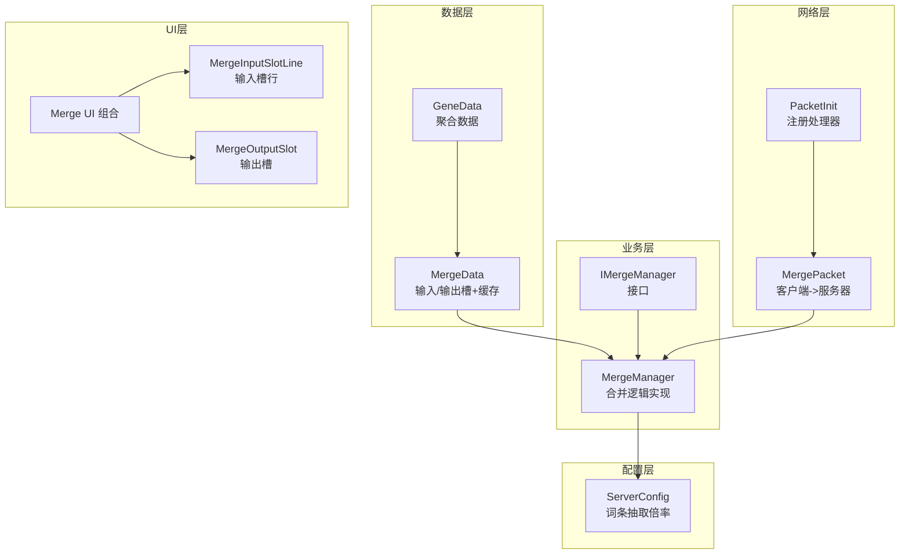
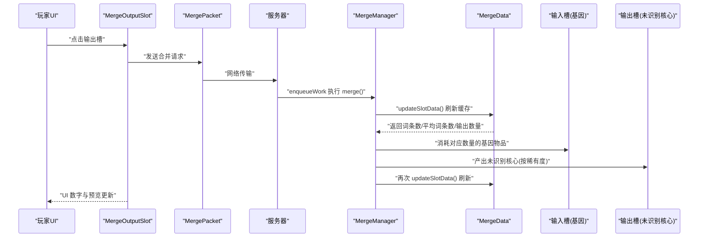
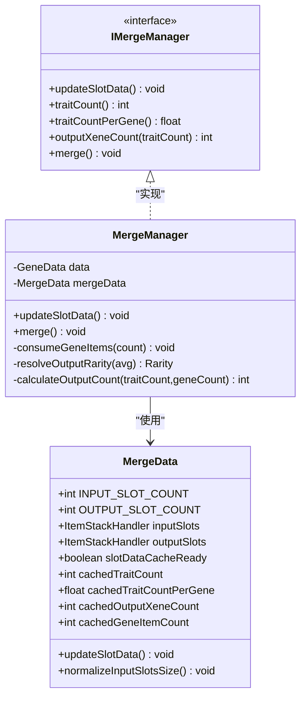
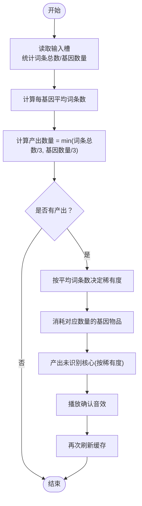
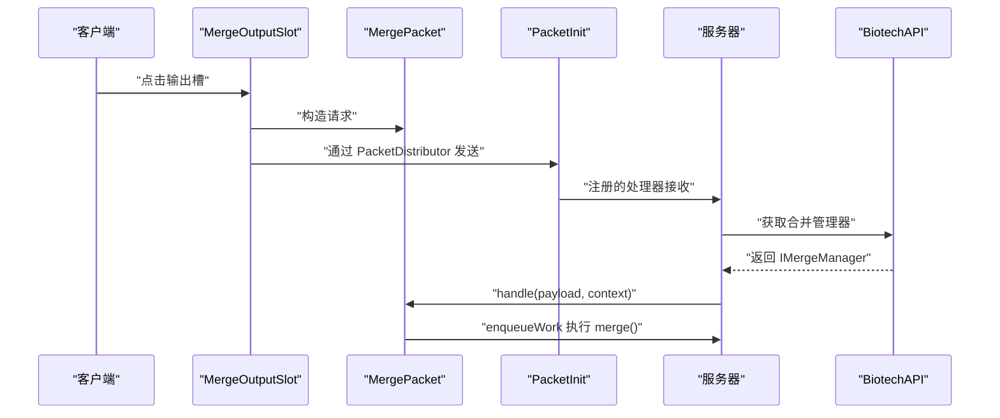
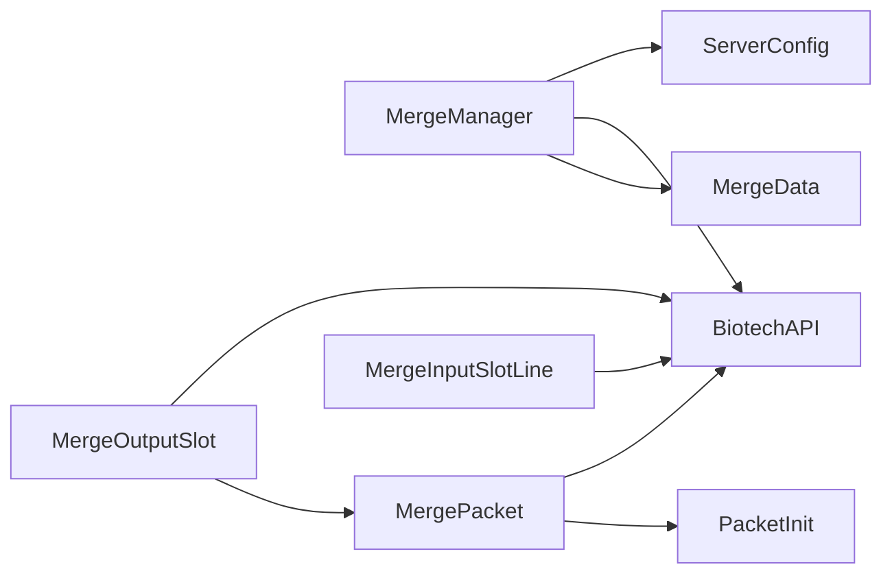

# 基因合并系统

<cite>
**本文引用的文件**
- [MergeData.java](file://Biotech/src/main/java/org/biotech/api/system/merge/MergeData.java)
- [MergeManager.java](file://Biotech/src/main/java/org/biotech/api/system/merge/MergeManager.java)
- [IMergeManager.java](file://Biotech/src/main/java/org/biotech/api/system/merge/core/IMergeManager.java)
- [MergePacket.java](file://Biotech/src/main/java/org/biotech/network/MergePacket.java)
- [Merge.java](file://Biotech/src/main/java/org/biotech/ui/gene_inventroy/group/Merge.java)
- [MergeInputSlotLine.java](file://Biotech/src/main/java/org/biotech/ui/gene_inventroy/element/merge/MergeInputSlotLine.java)
- [MergeOutputSlot.java](file://Biotech/src/main/java/org/biotech/ui/gene_inventroy/element/merge/MergeOutputSlot.java)
- [GeneData.java](file://Biotech/src/main/java/org/biotech/api/GeneData.java)
- [BiotechAPI.java](file://Biotech/src/main/java/org/biotech/api/BiotechAPI.java)
- [IUnidentifiedGeneItem.java](file://Biotech/src/main/java/org/biotech/api/system/gene/core/IUnidentifiedGeneItem.java)
- [ServerConfig.java](file://Biotech/src/main/java/org/biotech/api/config/ServerConfig.java)
- [PacketInit.java](file://Biotech/src/main/java/org/biotech/api/init/PacketInit.java)
- [EpicUnidentifiedGeneItem.java](file://Biotech/src/main/java/org/biotech/item/EpicUnidentifiedGeneItem.java)
- [RareUnidentifiedGeneItem.java](file://Biotech/src/main/java/org/biotech/item/RareUnidentifiedGeneItem.java)
- [UncommonUnidentifiedGeneItem.java](file://Biotech/src/main/java/org/biotech/item/UncommonUnidentifiedGeneItem.java)
</cite>

## 目录
1. [简介](#简介)
2. [项目结构](#项目结构)
3. [核心组件](#核心组件)
4. [架构总览](#架构总览)
5. [详细组件分析](#详细组件分析)
6. [依赖分析](#依赖分析)
7. [性能考虑](#性能考虑)
8. [故障排查指南](#故障排查指南)
9. [结论](#结论)
10. [附录](#附录)

## 简介
本技术文档围绕“基因合并系统”展开，聚焦于合并管理器（MergeManager）的核心算法与数据结构，解释合并配方的定义、成功率与结果生成机制，详述 MergeData 的数据模型与状态管理、临时数据缓存与清理策略。同时提供网络包处理流程说明（客户端请求与服务器响应），UI 交互设计与用户体验优化建议，以及性能监控与调试方法。文档面向开发者与内容创作者，帮助快速扩展与定制合并规则。

## 项目结构
基因合并系统位于 Biotech 模块中，主要由以下层次构成：
- 数据层：MergeData（输入/输出槽位与缓存）、GeneData（聚合玩家基因相关数据）
- 业务层：IMergeManager 接口与 MergeManager 实现（合并逻辑、缓存更新、产出计算）
- 网络层：MergePacket（客户端请求）、PacketInit（注册网络处理器）
- UI 层：Merge UI 组合（输入槽行、输出槽、输出数量标签）
- 配置层：ServerConfig（不同稀有度词条抽取次数）

图表来源
- [MergeData.java:1-114](file://Biotech/src/main/java/org/biotech/api/system/merge/MergeData.java#L1-L114)
- [MergeManager.java:1-207](file://Biotech/src/main/java/org/biotech/api/system/merge/MergeManager.java#L1-L207)
- [IMergeManager.java:1-52](file://Biotech/src/main/java/org/biotech/api/system/merge/core/IMergeManager.java#L1-L52)
- [MergePacket.java:1-35](file://Biotech/src/main/java/org/biotech/network/MergePacket.java#L1-L35)
- [PacketInit.java:1-19](file://Biotech/src/main/java/org/biotech/api/init/PacketInit.java#L1-L19)
- [Merge.java:1-155](file://Biotech/src/main/java/org/biotech/ui/gene_inventroy/group/Merge.java#L1-L155)
- [MergeInputSlotLine.java:1-255](file://Biotech/src/main/java/org/biotech/ui/gene_inventroy/element/merge/MergeInputSlotLine.java#L1-L255)
- [MergeOutputSlot.java:1-248](file://Biotech/src/main/java/org/biotech/ui/gene_inventroy/element/merge/MergeOutputSlot.java#L1-L248)
- [ServerConfig.java:1-49](file://Biotech/src/main/java/org/biotech/api/config/ServerConfig.java#L1-L49)

章节来源
- [MergeData.java:1-114](file://Biotech/src/main/java/org/biotech/api/system/merge/MergeData.java#L1-L114)
- [MergeManager.java:1-207](file://Biotech/src/main/java/org/biotech/api/system/merge/MergeManager.java#L1-L207)
- [IMergeManager.java:1-52](file://Biotech/src/main/java/org/biotech/api/system/merge/core/IMergeManager.java#L1-L52)
- [MergePacket.java:1-35](file://Biotech/src/main/java/org/biotech/network/MergePacket.java#L1-L35)
- [PacketInit.java:1-19](file://Biotech/src/main/java/org/biotech/api/init/PacketInit.java#L1-L19)
- [Merge.java:1-155](file://Biotech/src/main/java/org/biotech/ui/gene_inventroy/group/Merge.java#L1-L155)
- [MergeInputSlotLine.java:1-255](file://Biotech/src/main/java/org/biotech/ui/gene_inventroy/element/merge/MergeInputSlotLine.java#L1-L255)
- [MergeOutputSlot.java:1-248](file://Biotech/src/main/java/org/biotech/ui/gene_inventroy/element/merge/MergeOutputSlot.java#L1-L248)
- [ServerConfig.java:1-49](file://Biotech/src/main/java/org/biotech/api/config/ServerConfig.java#L1-L49)

## 核心组件
- 合并数据模型（MergeData）
  - 输入槽与输出槽：分别使用 ItemStackHandler 管理，输入槽支持动态尺寸调整与变更回调，输出槽仅用于预览，禁止直接提取。
  - 缓存字段：记录词条总数、每基因平均词条数、输出核心数量、基因物品数量等，避免重复计算。
  - 运行时监听：输入槽变更触发缓存失效与回调通知，保证 UI 与逻辑一致。
- 合并管理器（MergeManager）
  - 更新槽位数据：遍历输入槽，统计词条总数、基因数量，计算每基因平均词条数与输出核心数量，并预填输出槽。
  - 合并执行：消耗对应数量的基因物品，按平均词条数决定产出稀有度，批量产出未识别核心。
  - 成功率与产出：以“每基因词条数”和“输入基因数量”共同决定产出数量与稀有度，确保资源消耗与收益平衡。
- 接口（IMergeManager）
  - 定义槽位数据更新、词条统计、平均词条统计、输出数量估算与合并执行等契约方法。
- 网络包（MergePacket）
  - 客户端向服务器发送合并请求，服务器在主线程安全上下文中执行合并与刷新逻辑。
- UI 组件（Merge UI）
  - 输入槽行（MergeInputSlotLine）：支持阶梯布局、槽位绑定、悬停与图标绘制。
  - 输出槽（MergeOutputSlot）：显示预览与可产出数量，鼠标点击触发网络请求。

章节来源
- [MergeData.java:18-114](file://Biotech/src/main/java/org/biotech/api/system/merge/MergeData.java#L18-L114)
- [MergeManager.java:24-207](file://Biotech/src/main/java/org/biotech/api/system/merge/MergeManager.java#L24-L207)
- [IMergeManager.java:13-52](file://Biotech/src/main/java/org/biotech/api/system/merge/core/IMergeManager.java#L13-L52)
- [MergePacket.java:13-35](file://Biotech/src/main/java/org/biotech/network/MergePacket.java#L13-L35)
- [MergeInputSlotLine.java:30-255](file://Biotech/src/main/java/org/biotech/ui/gene_inventroy/element/merge/MergeInputSlotLine.java#L30-L255)
- [MergeOutputSlot.java:33-248](file://Biotech/src/main/java/org/biotech/ui/gene_inventroy/element/merge/MergeOutputSlot.java#L33-L248)

## 架构总览
下图展示了从 UI 到网络再到业务逻辑与产出的整体流程。

图表来源
- [MergeOutputSlot.java:168-177](file://Biotech/src/main/java/org/biotech/ui/gene_inventroy/element/merge/MergeOutputSlot.java#L168-L177)
- [MergePacket.java:23-33](file://Biotech/src/main/java/org/biotech/network/MergePacket.java#L23-L33)
- [MergeManager.java:107-157](file://Biotech/src/main/java/org/biotech/api/system/merge/MergeManager.java#L107-L157)
- [MergeData.java:37-77](file://Biotech/src/main/java/org/biotech/api/system/merge/MergeData.java#L37-L77)

## 详细组件分析

### MergeData 数据模型与状态管理
- 数据结构
  - 输入槽：固定大小为 9，支持运行时尺寸归一化与变更回调，变更后自动失效缓存并触发回调。
  - 输出槽：仅 1 个槽位，不可直接提取，仅用于预览。
  - 缓存字段：词条总数、每基因平均词条数、输出核心数量、基因物品数量，以及缓存可用标记。
- 状态管理
  - 输入槽变更回调：每次变更触发缓存失效与回调，确保后续读取能获得最新值。
  - 尺寸归一化：当输入槽数量变化时重建处理器并迁移已有物品，同时重置缓存与回调。
- 临时数据存储与清理
  - 缓存仅驻留内存，随输入槽内容变化而失效，避免持久化开销。
  - 输出槽不保存任何可提取物品，清理即完成。

图表来源
- [MergeData.java:19-114](file://Biotech/src/main/java/org/biotech/api/system/merge/MergeData.java#L19-L114)
- [IMergeManager.java:13-52](file://Biotech/src/main/java/org/biotech/api/system/merge/core/IMergeManager.java#L13-L52)
- [MergeManager.java:24-207](file://Biotech/src/main/java/org/biotech/api/system/merge/MergeManager.java#L24-L207)

章节来源
- [MergeData.java:18-114](file://Biotech/src/main/java/org/biotech/api/system/merge/MergeData.java#L18-L114)
- [MergeManager.java:36-77](file://Biotech/src/main/java/org/biotech/api/system/merge/MergeManager.java#L36-L77)

### 合并算法与成功率计算
- 条件与目标
  - 每 3 个词条或 3 个基因物品可合成 1 个未识别核心。
  - 平均词条数决定产出稀有度：≥3 为史诗，≥2 为稀有，否则为少见。
- 计算步骤
  - 统计输入槽中所有基因的词条总数与基因物品数量。
  - 计算每基因平均词条数。
  - 产出数量 = min(词条总数/3, 基因物品数量/3)。
  - 若存在可产出数量，则预填输出槽为对应稀有度的未识别核心。
- 合并执行
  - 服务器端执行时，先刷新缓存，再按实际产出数量消耗对应数量的基因物品。
  - 产出未识别核心，播放确认音效。

图表来源
- [MergeManager.java:36-157](file://Biotech/src/main/java/org/biotech/api/system/merge/MergeManager.java#L36-L157)
- [MergeData.java:67-77](file://Biotech/src/main/java/org/biotech/api/system/merge/MergeData.java#L67-L77)

章节来源
- [MergeManager.java:180-196](file://Biotech/src/main/java/org/biotech/api/system/merge/MergeManager.java#L180-L196)
- [MergeManager.java:107-157](file://Biotech/src/main/java/org/biotech/api/system/merge/MergeManager.java#L107-L157)

### 网络包处理机制
- 客户端请求
  - 玩家点击输出槽时，客户端通过 MergeOutputSlot 发送 MergePacket 至服务器。
- 服务器响应
  - PacketInit 注册 MergePacket 的处理逻辑，服务器在主线程安全上下文中调用 BiotechAPI 获取合并管理器并执行合并与刷新。
- 注册与版本
  - 使用 NeoForge 网络注册器，设置协议版本为“1”，绑定 playToServer 方向的处理函数。

图表来源
- [MergeOutputSlot.java:168-177](file://Biotech/src/main/java/org/biotech/ui/gene_inventroy/element/merge/MergeOutputSlot.java#L168-L177)
- [MergePacket.java:23-33](file://Biotech/src/main/java/org/biotech/network/MergePacket.java#L23-L33)
- [PacketInit.java:10-18](file://Biotech/src/main/java/org/biotech/api/init/PacketInit.java#L10-L18)
- [BiotechAPI.java:39-41](file://Biotech/src/main/java/org/biotech/api/BiotechAPI.java#L39-L41)

章节来源
- [MergePacket.java:13-35](file://Biotech/src/main/java/org/biotech/network/MergePacket.java#L13-L35)
- [PacketInit.java:10-18](file://Biotech/src/main/java/org/biotech/api/init/PacketInit.java#L10-L18)
- [MergeOutputSlot.java:168-177](file://Biotech/src/main/java/org/biotech/ui/gene_inventroy/element/merge/MergeOutputSlot.java#L168-L177)

### UI 交互设计与用户体验优化
- 输入槽行（MergeInputSlotLine）
  - 支持阶梯式布局与缩放，绑定玩家物品处理器，允许快速移动与拖拽。
  - 悬停时绘制高亮覆盖层，物品图标上方显示词条数量罗马数字徽章。
- 输出槽（MergeOutputSlot）
  - 显示可产出数量标签，动画浮动增强视觉反馈。
  - 点击输出槽触发网络请求，避免直接操作输出槽导致的异常。
- 建议
  - 在 UI 中增加“一键整理”按钮，自动将输入槽中的基因按词条数量排序。
  - 当产出数量为 0 时，禁用输出槽点击并提示原因（如“需要至少 3 个基因物品”）。
  - 增加音效与粒子特效，提升合并成功后的成就感。

章节来源
- [MergeInputSlotLine.java:176-212](file://Biotech/src/main/java/org/biotech/ui/gene_inventroy/element/merge/MergeInputSlotLine.java#L176-L212)
- [MergeOutputSlot.java:168-177](file://Biotech/src/main/java/org/biotech/ui/gene_inventroy/element/merge/MergeOutputSlot.java#L168-L177)
- [Merge.java:43-51](file://Biotech/src/main/java/org/biotech/ui/gene_inventroy/group/Merge.java#L43-L51)

### 如何添加新的合并配方与自定义规则
- 新增未识别核心
  - 参考现有未识别核心类，实现 IUnidentifiedGeneItem 接口，定义稀有度与使用行为。
  - 示例路径：[EpicUnidentifiedGeneItem.java:1-31](file://Biotech/src/main/java/org/biotech/item/EpicUnidentifiedGeneItem.java#L1-L31)，[RareUnidentifiedGeneItem.java:1-32](file://Biotech/src/main/java/org/biotech/item/RareUnidentifiedGeneItem.java#L1-L32)，[UncommonUnidentifiedGeneItem.java:1-31](file://Biotech/src/main/java/org/biotech/item/UncommonUnidentifiedGeneItem.java#L1-L31)。
- 自定义产出稀有度映射
  - 修改 MergeManager.resolveOutputRarity，调整平均词条阈值以改变产出稀有度。
  - 示例路径：[MergeManager.java:180-188](file://Biotech/src/main/java/org/biotech/api/system/merge/MergeManager.java#L180-L188)。
- 自定义产出数量公式
  - 修改 MergeManager.calculateOutputCount，调整每 3 个词条/基因物品的产出比例。
  - 示例路径：[MergeManager.java:190-196](file://Biotech/src/main/java/org/biotech/api/system/merge/MergeManager.java#L190-L196)。
- 自定义词条抽取次数
  - 通过 ServerConfig 的配置项控制不同稀有度的词条抽取倍率。
  - 示例路径：[ServerConfig.java:37-47](file://Biotech/src/main/java/org/biotech/api/config/ServerConfig.java#L37-L47)。
- 扩展 UI
  - 在 Merge UI 中新增自定义槽位或标签，绑定到 MergeData 的相应处理器。
  - 示例路径：[Merge.java:14-51](file://Biotech/src/main/java/org/biotech/ui/gene_inventroy/group/Merge.java#L14-L51)。

章节来源
- [EpicUnidentifiedGeneItem.java:15-31](file://Biotech/src/main/java/org/biotech/item/EpicUnidentifiedGeneItem.java#L15-L31)
- [RareUnidentifiedGeneItem.java:15-32](file://Biotech/src/main/java/org/biotech/item/RareUnidentifiedGeneItem.java#L15-L32)
- [UncommonUnidentifiedGeneItem.java:15-31](file://Biotech/src/main/java/org/biotech/item/UncommonUnidentifiedGeneItem.java#L15-L31)
- [MergeManager.java:180-196](file://Biotech/src/main/java/org/biotech/api/system/merge/MergeManager.java#L180-L196)
- [ServerConfig.java:37-47](file://Biotech/src/main/java/org/biotech/api/config/ServerConfig.java#L37-L47)
- [Merge.java:14-51](file://Biotech/src/main/java/org/biotech/ui/gene_inventroy/group/Merge.java#L14-L51)

## 依赖分析
- 组件耦合
  - MergeManager 依赖 MergeData 的缓存与槽位，依赖 BiotechAPI 获取玩家能力，依赖 ServerConfig 控制词条抽取倍率。
  - MergePacket 依赖 PacketInit 注册，依赖 BiotechAPI 获取合并管理器。
  - UI 组件依赖 BiotechAPI 获取 GeneData 与 MergeData，依赖 MergePacket 发送网络请求。
- 外部依赖
  - NeoForge 网络框架（CustomPacketPayload、PacketDistributor）。
  - LowDragLib2 GUI 框架（UIElement、ItemSlot、动画组件）。
  - Mojang 序列化（Codec/StreamCodec）用于数据持久化与网络同步。

图表来源
- [MergeManager.java:24-33](file://Biotech/src/main/java/org/biotech/api/system/merge/MergeManager.java#L24-L33)
- [MergePacket.java:23-33](file://Biotech/src/main/java/org/biotech/network/MergePacket.java#L23-L33)
- [PacketInit.java:10-18](file://Biotech/src/main/java/org/biotech/api/init/PacketInit.java#L10-L18)
- [MergeOutputSlot.java:168-177](file://Biotech/src/main/java/org/biotech/ui/gene_inventroy/element/merge/MergeOutputSlot.java#L168-L177)
- [MergeInputSlotLine.java:30-91](file://Biotech/src/main/java/org/biotech/ui/gene_inventroy/element/merge/MergeInputSlotLine.java#L30-L91)

章节来源
- [MergeManager.java:24-33](file://Biotech/src/main/java/org/biotech/api/system/merge/MergeManager.java#L24-L33)
- [MergePacket.java:23-33](file://Biotech/src/main/java/org/biotech/network/MergePacket.java#L23-L33)
- [PacketInit.java:10-18](file://Biotech/src/main/java/org/biotech/api/init/PacketInit.java#L10-L18)
- [MergeOutputSlot.java:168-177](file://Biotech/src/main/java/org/biotech/ui/gene_inventroy/element/merge/MergeOutputSlot.java#L168-L177)
- [MergeInputSlotLine.java:30-91](file://Biotech/src/main/java/org/biotech/ui/gene_inventroy/element/merge/MergeInputSlotLine.java#L30-L91)

## 性能考虑
- 缓存策略
  - 通过 MergeData 的缓存字段避免重复统计输入槽，显著降低 CPU 开销。
  - 输入槽变更时仅失效缓存，确保后续读取一致性。
- 网络与线程
  - 使用 enqueueWork 将合并逻辑置于服务器主线程，避免并发问题。
  - 网络包为轻量级空载荷，仅触发服务器端处理。
- UI 渲染
  - 输出数量标签与动画在 Tick 事件中更新，建议限制刷新频率，避免过度重绘。
- 建议
  - 对大量输入槽场景，可考虑分页或虚拟滚动以减少 UI 绘制成本。
  - 合并前先校验输入槽状态，若无有效输入则提前返回，减少无效计算。

[本节为通用性能建议，无需特定文件引用]

## 故障排查指南
- 合并无产出
  - 检查输入槽是否至少包含 3 个基因物品或累计 3 个词条。
  - 确认平均词条数是否满足产出阈值。
  - 参考路径：[MergeManager.java:190-196](file://Biotech/src/main/java/org/biotech/api/system/merge/MergeManager.java#L190-L196)。
- 输出槽无法点击
  - 输出槽为预览用途，不可直接提取；点击应通过 UI 触发网络请求。
  - 参考路径：[MergeData.java:100-112](file://Biotech/src/main/java/org/biotech/api/system/merge/MergeData.java#L100-L112)。
- 网络请求未生效
  - 确认 PacketInit 是否正确注册 MergePacket。
  - 检查客户端是否通过 PacketDistributor 发送请求。
  - 参考路径：[PacketInit.java:10-18](file://Biotech/src/main/java/org/biotech/api/init/PacketInit.java#L10-L18)，[MergeOutputSlot.java:168-177](file://Biotech/src/main/java/org/biotech/ui/gene_inventroy/element/merge/MergeOutputSlot.java#L168-L177)。
- UI 不显示产出数量
  - 确认 MergeOutputSlot 正确绑定输出槽处理器并刷新标签。
  - 参考路径：[MergeOutputSlot.java:219-222](file://Biotech/src/main/java/org/biotech/ui/gene_inventroy/element/merge/MergeOutputSlot.java#L219-L222)。

章节来源
- [MergeManager.java:190-196](file://Biotech/src/main/java/org/biotech/api/system/merge/MergeManager.java#L190-L196)
- [MergeData.java:100-112](file://Biotech/src/main/java/org/biotech/api/system/merge/MergeData.java#L100-L112)
- [PacketInit.java:10-18](file://Biotech/src/main/java/org/biotech/api/init/PacketInit.java#L10-L18)
- [MergeOutputSlot.java:219-222](file://Biotech/src/main/java/org/biotech/ui/gene_inventroy/element/merge/MergeOutputSlot.java#L219-L222)

## 结论
基因合并系统通过清晰的数据模型（MergeData）、稳定的业务逻辑（MergeManager）与简洁的网络协议（MergePacket），实现了高效的合并体验。系统采用缓存与懒更新策略，兼顾性能与一致性；UI 通过直观的可视化与动画反馈提升用户感知。通过 ServerConfig 与接口扩展点，开发者可以灵活定制产出规则与稀有度映射，满足多样化的游戏内容需求。

[本节为总结性内容，无需特定文件引用]

## 附录
- 关键配置项
  - ServerConfig：控制不同稀有度词条抽取倍率，影响产出词条数量。
  - 示例路径：[ServerConfig.java:37-47](file://Biotech/src/main/java/org/biotech/api/config/ServerConfig.java#L37-L47)。
- 数据模型与序列化
  - GeneData 与 MergeData 均提供 Codec 与 StreamCodec，便于持久化与网络同步。
  - 示例路径：[GeneData.java:67-99](file://Biotech/src/main/java/org/biotech/api/GeneData.java#L67-L99)，[MergeData.java:25-27](file://Biotech/src/main/java/org/biotech/api/system/merge/MergeData.java#L25-L27)。

章节来源
- [ServerConfig.java:37-47](file://Biotech/src/main/java/org/biotech/api/config/ServerConfig.java#L37-L47)
- [GeneData.java:67-99](file://Biotech/src/main/java/org/biotech/api/GeneData.java#L67-L99)
- [MergeData.java:25-27](file://Biotech/src/main/java/org/biotech/api/system/merge/MergeData.java#L25-L27)