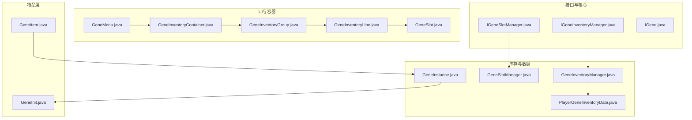
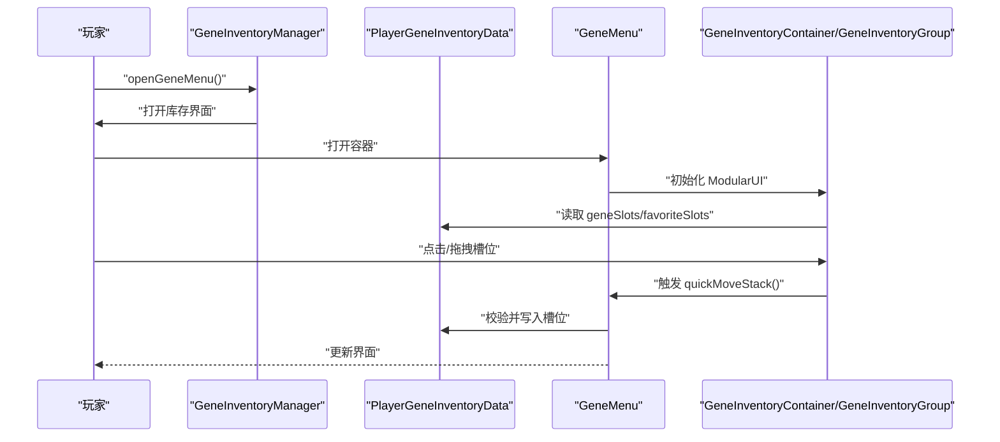
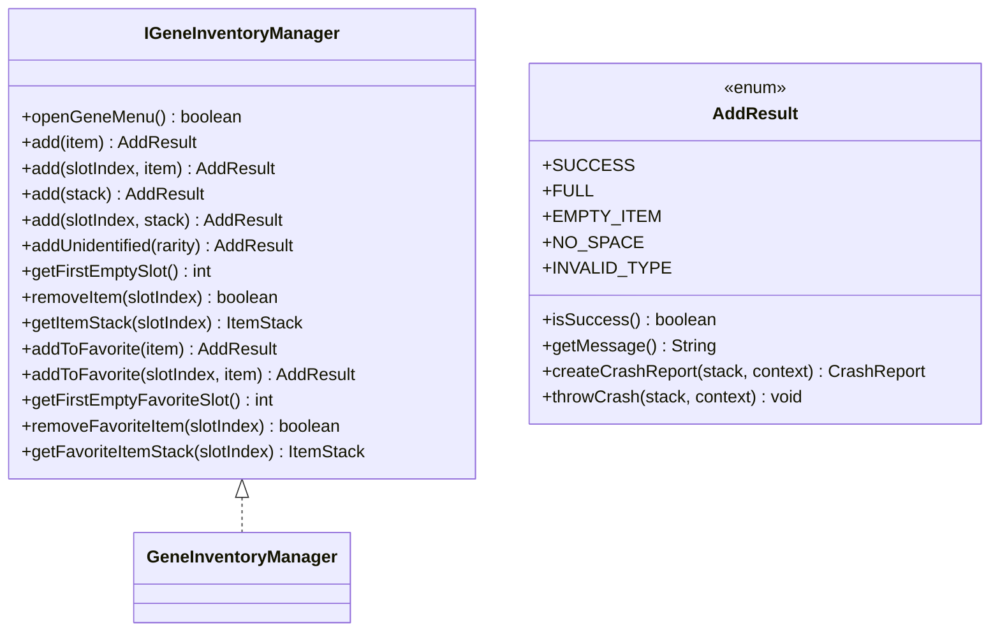
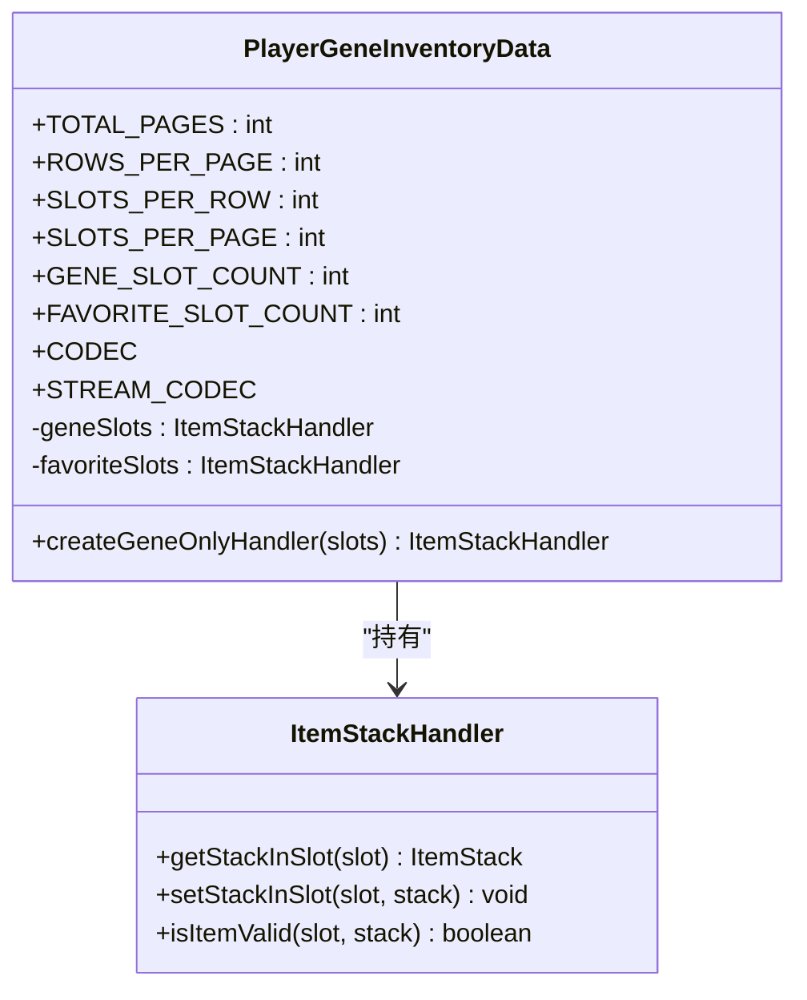
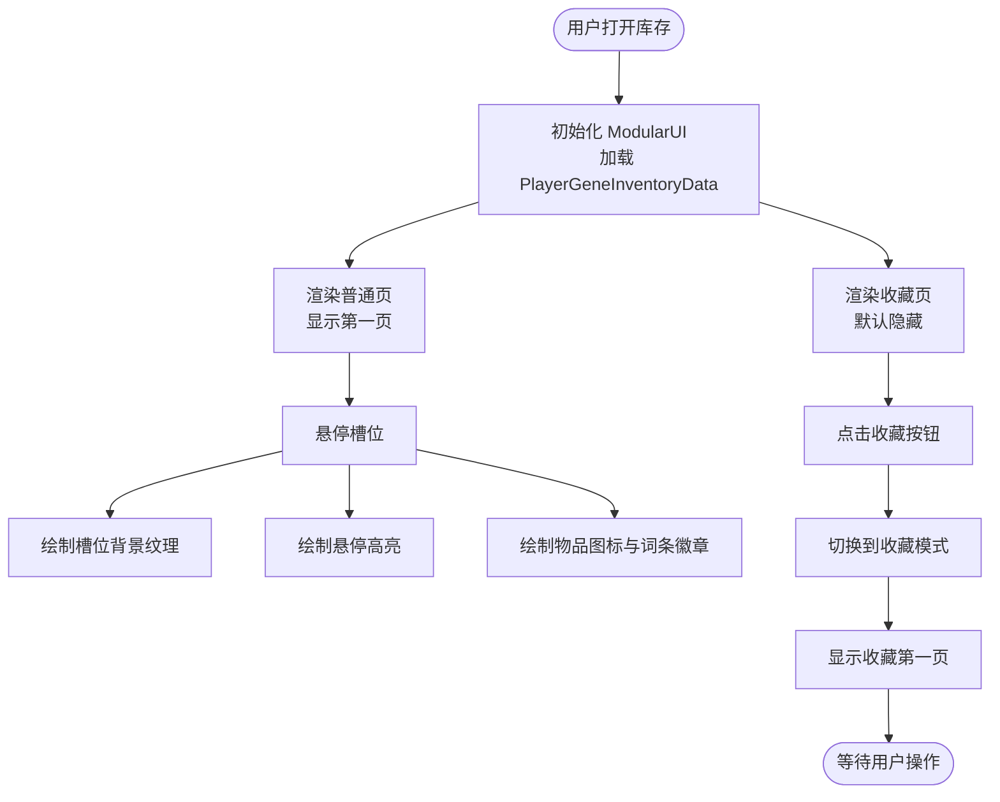
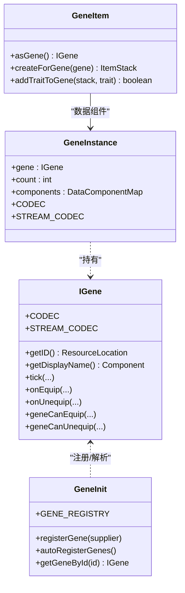
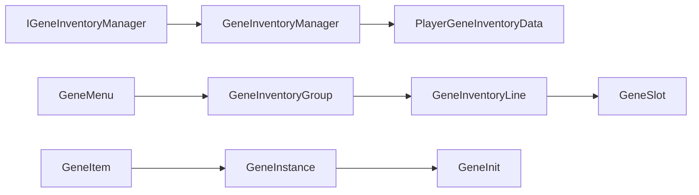

# 基因库存管理

<cite>
**本文引用的文件**
- [IGeneInventoryManager.java](file://Biotech/src/main/java/org/biotech/api/system/gene/core/manager/IGeneInventoryManager.java)
- [IGeneSlotManager.java](file://Biotech/src/main/java/org/biotech/api/system/gene/core/manager/IGeneSlotManager.java)
- [GeneInventoryManager.java](file://Biotech/src/main/java/org/biotech/api/system/gene/inventory/GeneInventoryManager.java)
- [GeneSlotManager.java](file://Biotech/src/main/java/org/biotech/api/system/gene/inventory/GeneSlotManager.java)
- [PlayerGeneInventoryData.java](file://Biotech/src/main/java/org/biotech/api/system/gene/inventory/PlayerGeneInventoryData.java)
- [GeneInventoryContainer.java](file://Biotech/src/main/java/org/biotech/container/GeneInventoryContainer.java)
- [GeneMenu.java](file://Biotech/src/main/java/org/biotech/container/GeneMenu.java)
- [GeneInventoryGroup.java](file://Biotech/src/main/java/org/biotech/ui/gene_inventroy/group/GeneInventoryGroup.java)
- [GeneInventoryLine.java](file://Biotech/src/main/java/org/biotech/ui/gene_inventroy/element/inventory/GeneInventoryLine.java)
- [GeneSlot.java](file://Biotech/src/main/java/org/biotech/ui/gene_inventroy/element/inventory/GeneSlot.java)
- [GeneItem.java](file://Biotech/src/main/java/org/biotech/item/GeneItem.java)
- [IGene.java](file://Biotech/src/main/java/org/biotech/api/system/gene/core/IGene.java)
- [GeneInit.java](file://Biotech/src/main/java/org/biotech/api/init/GeneInit.java)
- [GeneInstance.java](file://Biotech/src/main/java/org/biotech/api/system/gene/GeneInstance.java)
</cite>

## 目录
1. [简介](#简介)
2. [项目结构](#项目结构)
3. [核心组件](#核心组件)
4. [架构总览](#架构总览)
5. [详细组件分析](#详细组件分析)
6. [依赖分析](#依赖分析)
7. [性能考虑](#性能考虑)
8. [故障排查指南](#故障排查指南)
9. [结论](#结论)
10. [附录](#附录)

## 简介
本技术文档围绕基因库存管理系统展开，系统以“基因”为核心实体，提供库存槽位管理、收藏夹功能、动态槽位扩展能力，并通过UI模块实现高扩展性的界面渲染与交互。文档重点解释以下方面：
- IGeneInventoryManager 接口的设计理念与实现机制
- PlayerGeneInventoryData 的数据模型、持久化与网络同步
- 基因库存的槽位布局、收藏夹模式与分页机制
- UI 系统的集成方式与渲染流程
- 如何扩展新的基因类型与自定义槽位行为
- 性能优化与内存管理最佳实践

## 项目结构
本系统位于 Biotech 模块中，核心代码分布在如下包路径：
- 接口与管理器：org.biotech.api.system.gene.core.manager
- 库存与槽位管理：org.biotech.api.system.gene.inventory
- UI 组与元素：org.biotech.ui.gene_inventroy.group 与 org.biotech.ui.gene_inventroy.element.inventory
- 容器与菜单：org.biotech.container
- 基因与物品：org.biotech.api.system.gene.* 与 org.biotech.item

图表来源
- [IGeneInventoryManager.java:12-133](file://Biotech/src/main/java/org/biotech/api/system/gene/core/manager/IGeneInventoryManager.java#L12-L133)
- [IGeneSlotManager.java:6-36](file://Biotech/src/main/java/org/biotech/api/system/gene/core/manager/IGeneSlotManager.java#L6-L36)
- [GeneInventoryManager.java:18-186](file://Biotech/src/main/java/org/biotech/api/system/gene/inventory/GeneInventoryManager.java#L18-L186)
- [GeneSlotManager.java:6-54](file://Biotech/src/main/java/org/biotech/api/system/gene/inventory/GeneSlotManager.java#L6-L54)
- [PlayerGeneInventoryData.java:21-72](file://Biotech/src/main/java/org/biotech/api/system/gene/inventory/PlayerGeneInventoryData.java#L21-L72)
- [GeneInventoryContainer.java:23-97](file://Biotech/src/main/java/org/biotech/container/GeneInventoryContainer.java#L23-L97)
- [GeneMenu.java:13-189](file://Biotech/src/main/java/org/biotech/container/GeneMenu.java#L13-L189)
- [GeneInventoryGroup.java:48-637](file://Biotech/src/main/java/org/biotech/ui/gene_inventroy/group/GeneInventoryGroup.java#L48-L637)
- [GeneInventoryLine.java:14-87](file://Biotech/src/main/java/org/biotech/ui/gene_inventroy/element/inventory/GeneInventoryLine.java#L14-L87)
- [GeneSlot.java:15-130](file://Biotech/src/main/java/org/biotech/ui/gene_inventroy/element/inventory/GeneSlot.java#L15-L130)
- [GeneItem.java:31-209](file://Biotech/src/main/java/org/biotech/item/GeneItem.java#L31-L209)
- [IGene.java:15-91](file://Biotech/src/main/java/org/biotech/api/system/gene/core/IGene.java#L15-L91)
- [GeneInit.java:21-107](file://Biotech/src/main/java/org/biotech/api/init/GeneInit.java#L21-L107)
- [GeneInstance.java:19-119](file://Biotech/src/main/java/org/biotech/api/system/gene/GeneInstance.java#L19-L119)

章节来源
- [IGeneInventoryManager.java:12-133](file://Biotech/src/main/java/org/biotech/api/system/gene/core/manager/IGeneInventoryManager.java#L12-L133)
- [PlayerGeneInventoryData.java:21-72](file://Biotech/src/main/java/org/biotech/api/system/gene/inventory/PlayerGeneInventoryData.java#L21-L72)

## 核心组件
本节聚焦于接口与实现类，解释设计理念与关键职责。

- IGeneInventoryManager：定义基因库存的增删改查、收藏夹操作、打开界面与错误处理规范。其 AddResult 枚举提供统一的结果语义与崩溃报告能力，便于调试与容错。
- GeneInventoryManager：IGeneInventoryManager 的具体实现，负责与 PlayerGeneInventoryData 协作，执行槽位写入、读取、删除与空槽查找；同时负责打开库存界面。
- IGeneSlotManager：抽象动态槽位管理，支持库存页、收藏页、装备槽与合成槽的增减。
- GeneSlotManager：当前占位实现，预留扩展点，未来可接入动态页数与槽位配置。

章节来源
- [IGeneInventoryManager.java:12-133](file://Biotech/src/main/java/org/biotech/api/system/gene/core/manager/IGeneInventoryManager.java#L12-L133)
- [GeneInventoryManager.java:18-186](file://Biotech/src/main/java/org/biotech/api/system/gene/inventory/GeneInventoryManager.java#L18-L186)
- [IGeneSlotManager.java:6-36](file://Biotech/src/main/java/org/biotech/api/system/gene/core/manager/IGeneSlotManager.java#L6-L36)
- [GeneSlotManager.java:6-54](file://Biotech/src/main/java/org/biotech/api/system/gene/inventory/GeneSlotManager.java#L6-L54)

## 架构总览
系统采用“接口抽象 + 数据持久化 + UI 渲染 + 容器交互”的分层设计：
- 接口层：定义能力边界（库存、槽位）
- 实现层：对接数据层，提供业务逻辑
- 数据层：PlayerGeneInventoryData 作为持久化与网络同步载体
- UI 层：基于 LowDragLib2 的 ModularUI，提供灵活布局与事件驱动
- 容器层：GeneMenu 控制快速移动、目标校验与优先级策略

图表来源
- [GeneInventoryManager.java:28-40](file://Biotech/src/main/java/org/biotech/api/system/gene/inventory/GeneInventoryManager.java#L28-L40)
- [GeneMenu.java:27-122](file://Biotech/src/main/java/org/biotech/container/GeneMenu.java#L27-L122)
- [GeneInventoryContainer.java:29-82](file://Biotech/src/main/java/org/biotech/container/GeneInventoryContainer.java#L29-L82)
- [PlayerGeneInventoryData.java:52-72](file://Biotech/src/main/java/org/biotech/api/system/gene/inventory/PlayerGeneInventoryData.java#L52-L72)

## 详细组件分析

### IGeneInventoryManager 接口与实现
- 设计理念
  - 以 AddResult 统一返回语义，覆盖成功、满格、空项、无空间、类型非法等场景
  - 提供 openGeneMenu() 与 add()/remove()/getItemStack() 等基本操作
  - 收藏夹接口与主库存接口分离，职责清晰
- 实现要点
  - add(int, ItemStack) 支持指定槽位与自动寻空
  - removeItem/getItemStack 做越界保护
  - addToFavorite 与 getFavoriteItemStack 对应收藏槽位
  - AddResult.createCrashReport/throwCrash 提供一致的错误上报

图表来源
- [IGeneInventoryManager.java:12-133](file://Biotech/src/main/java/org/biotech/api/system/gene/core/manager/IGeneInventoryManager.java#L12-L133)
- [GeneInventoryManager.java:18-186](file://Biotech/src/main/java/org/biotech/api/system/gene/inventory/GeneInventoryManager.java#L18-L186)

章节来源
- [IGeneInventoryManager.java:12-133](file://Biotech/src/main/java/org/biotech/api/system/gene/core/manager/IGeneInventoryManager.java#L12-L133)
- [GeneInventoryManager.java:18-186](file://Biotech/src/main/java/org/biotech/api/system/gene/inventory/GeneInventoryManager.java#L18-L186)

### PlayerGeneInventoryData 数据模型与持久化
- 数据结构
  - 使用 ItemStackHandler 管理基因槽位与收藏槽位，分别限制为 IGeneItem 类型
  - 常量定义页数、行列与总槽位数，确保 UI 与数据层一致
- 持久化与网络同步
  - 通过 PersistedParser 自动生成 Codec 与 StreamCodec，简化序列化
  - 适配 LDLib2 的 IPersistedSerializable，便于跨 Tick/Server 同步
- 复杂度与约束
  - isItemValid 保证类型安全，避免非基因物品进入库存
  - 槽位数量固定，便于 UI 布局与快速渲染

图表来源
- [PlayerGeneInventoryData.java:21-72](file://Biotech/src/main/java/org/biotech/api/system/gene/inventory/PlayerGeneInventoryData.java#L21-L72)

章节来源
- [PlayerGeneInventoryData.java:21-72](file://Biotech/src/main/java/org/biotech/api/system/gene/inventory/PlayerGeneInventoryData.java#L21-L72)

### UI 系统与交互逻辑
- 布局与分页
  - GeneInventoryGroup 采用纵向 Flex 布局，包含槽位容器与功能区（收藏按钮、翻页控件）
  - 每页 3 行 × 9 槽位，阶梯式水平偏移营造视觉层次
  - PageManager 独立维护普通与收藏模式的页码状态，支持循环翻页
- 槽位渲染
  - GeneSlot 支持 Left/Middle/Right 三种位置样式与悬停纹理
  - PageSlotContainer 统一绘制背景与悬停效果，按需绘制物品图标与词条数量徽章
- 事件与交互
  - ItemSlot 的 acceptQuickMove/isPlayerSlot/quickMovePriority 控制拖拽行为
  - GeneMenu 的 quickMoveStack/isValidQuickMoveDestination/优先级策略限定移动范围（仅允许从库存/收藏移动至装备/合成输入）

图表来源
- [GeneInventoryContainer.java:29-82](file://Biotech/src/main/java/org/biotech/container/GeneInventoryContainer.java#L29-L82)
- [GeneInventoryGroup.java:48-637](file://Biotech/src/main/java/org/biotech/ui/gene_inventroy/group/GeneInventoryGroup.java#L48-L637)
- [GeneSlot.java:15-130](file://Biotech/src/main/java/org/biotech/ui/gene_inventroy/element/inventory/GeneSlot.java#L15-L130)
- [GeneMenu.java:27-122](file://Biotech/src/main/java/org/biotech/container/GeneMenu.java#L27-L122)

章节来源
- [GeneInventoryContainer.java:29-82](file://Biotech/src/main/java/org/biotech/container/GeneInventoryContainer.java#L29-L82)
- [GeneInventoryGroup.java:48-637](file://Biotech/src/main/java/org/biotech/ui/gene_inventroy/group/GeneInventoryGroup.java#L48-L637)
- [GeneSlot.java:15-130](file://Biotech/src/main/java/org/biotech/ui/gene_inventroy/element/inventory/GeneSlot.java#L15-L130)
- [GeneMenu.java:27-122](file://Biotech/src/main/java/org/biotech/container/GeneMenu.java#L27-L122)

### 基因类型扩展与槽位行为定制
- 扩展新的基因类型
  - 实现 IGene 并注册到 GENE_REGISTRY（可通过 GeneInit 自动扫描注册）
  - 使用 GeneInstance 作为数据组件承载基因配置与词条集合
  - GeneItem 作为可堆叠的物品载体，绑定 GENE_INSTANCE 数据组件
- 自定义槽位行为
  - 若需动态页数/槽位，可在 IGeneSlotManager 中扩展 add/remove 方法，并在实现类中接入配置
  - UI 层通过 GeneInventoryGroup 的常量与 PageManager 保持与数据层一致

图表来源
- [IGene.java:15-91](file://Biotech/src/main/java/org/biotech/api/system/gene/core/IGene.java#L15-L91)
- [GeneInit.java:21-107](file://Biotech/src/main/java/org/biotech/api/init/GeneInit.java#L21-L107)
- [GeneInstance.java:19-119](file://Biotech/src/main/java/org/biotech/api/system/gene/GeneInstance.java#L19-L119)
- [GeneItem.java:31-209](file://Biotech/src/main/java/org/biotech/item/GeneItem.java#L31-L209)

章节来源
- [IGene.java:15-91](file://Biotech/src/main/java/org/biotech/api/system/gene/core/IGene.java#L15-L91)
- [GeneInit.java:21-107](file://Biotech/src/main/java/org/biotech/api/init/GeneInit.java#L21-L107)
- [GeneInstance.java:19-119](file://Biotech/src/main/java/org/biotech/api/system/gene/GeneInstance.java#L19-L119)
- [GeneItem.java:31-209](file://Biotech/src/main/java/org/biotech/item/GeneItem.java#L31-L209)

## 依赖分析
- 松耦合
  - 接口层与实现层解耦，UI 与容器通过接口与数据层交互
  - PlayerGeneInventoryData 仅依赖低耦合的 ItemStackHandler 与数据组件
- 关键依赖链
  - IGeneInventoryManager → GeneInventoryManager → PlayerGeneInventoryData
  - UI → GeneInventoryGroup → GeneInventoryLine → GeneSlot
  - 容器 → GeneMenu → UI（ModularUI）
  - 基因体系：IGene → GeneInit → GeneInstance → GeneItem

图表来源
- [IGeneInventoryManager.java:12-133](file://Biotech/src/main/java/org/biotech/api/system/gene/core/manager/IGeneInventoryManager.java#L12-L133)
- [GeneInventoryManager.java:18-186](file://Biotech/src/main/java/org/biotech/api/system/gene/inventory/GeneInventoryManager.java#L18-L186)
- [PlayerGeneInventoryData.java:21-72](file://Biotech/src/main/java/org/biotech/api/system/gene/inventory/PlayerGeneInventoryData.java#L21-L72)
- [GeneInventoryGroup.java:48-637](file://Biotech/src/main/java/org/biotech/ui/gene_inventroy/group/GeneInventoryGroup.java#L48-L637)
- [GeneInventoryLine.java:14-87](file://Biotech/src/main/java/org/biotech/ui/gene_inventroy/element/inventory/GeneInventoryLine.java#L14-L87)
- [GeneSlot.java:15-130](file://Biotech/src/main/java/org/biotech/ui/gene_inventroy/element/inventory/GeneSlot.java#L15-L130)
- [GeneMenu.java:13-189](file://Biotech/src/main/java/org/biotech/container/GeneMenu.java#L13-L189)
- [GeneItem.java:31-209](file://Biotech/src/main/java/org/biotech/item/GeneItem.java#L31-L209)
- [GeneInstance.java:19-119](file://Biotech/src/main/java/org/biotech/api/system/gene/GeneInstance.java#L19-L119)
- [GeneInit.java:21-107](file://Biotech/src/main/java/org/biotech/api/init/GeneInit.java#L21-L107)

章节来源
- [IGeneInventoryManager.java:12-133](file://Biotech/src/main/java/org/biotech/api/system/gene/core/manager/IGeneInventoryManager.java#L12-L133)
- [GeneInventoryManager.java:18-186](file://Biotech/src/main/java/org/biotech/api/system/gene/inventory/GeneInventoryManager.java#L18-L186)
- [PlayerGeneInventoryData.java:21-72](file://Biotech/src/main/java/org/biotech/api/system/gene/inventory/PlayerGeneInventoryData.java#L21-L72)
- [GeneInventoryGroup.java:48-637](file://Biotech/src/main/java/org/biotech/ui/gene_inventroy/group/GeneInventoryGroup.java#L48-L637)
- [GeneSlot.java:15-130](file://Biotech/src/main/java/org/biotech/ui/gene_inventroy/element/inventory/GeneSlot.java#L15-L130)
- [GeneMenu.java:13-189](file://Biotech/src/main/java/org/biotech/container/GeneMenu.java#L13-L189)
- [GeneItem.java:31-209](file://Biotech/src/main/java/org/biotech/item/GeneItem.java#L31-L209)
- [GeneInstance.java:19-119](file://Biotech/src/main/java/org/biotech/api/system/gene/GeneInstance.java#L19-L119)
- [GeneInit.java:21-107](file://Biotech/src/main/java/org/biotech/api/init/GeneInit.java#L21-L107)

## 性能考虑
- UI 渲染
  - PageSlotContainer 仅绘制当前页可见槽位，减少无关绘制开销
  - 悬停纹理与物品图标按需绘制，避免全量重绘
- 数据访问
  - 槽位访问通过 ItemStackHandler 直接索引，时间复杂度 O(1)
  - 空槽查找线性扫描，建议在高频场景下缓存最近空槽索引
- 网络同步
  - 使用 StreamCodec 进行高效序列化，避免冗余字段
  - 数据组件按需更新，减少不必要的广播
- 内存管理
  - 使用 Lombok @Data 与低占用数据结构，避免额外包装
  - 建议在批量操作时合并槽位变更，减少 UI 重绘次数

## 故障排查指南
- 常见问题与定位
  - 添加失败：检查 AddResult 返回值，确认是否为 FULL/EMPTY_ITEM/NO_SPACE/INVALID_TYPE
  - 类型错误：确认物品是否为 IGeneItem，避免非基因物品进入库存
  - 界面无法打开：验证 openGeneMenu() 返回值与 SimpleMenuProvider 初始化
  - 快速移动异常：检查 GeneMenu 的 isValidQuickMoveDestination 与 quickMovePriority 设置
- 错误上报
  - 使用 AddResult.createCrashReport/throwCrash 输出详细上下文（注册名、类名、数量、结果、上下文）

章节来源
- [IGeneInventoryManager.java:79-130](file://Biotech/src/main/java/org/biotech/api/system/gene/core/manager/IGeneInventoryManager.java#L79-L130)
- [GeneMenu.java:93-122](file://Biotech/src/main/java/org/biotech/container/GeneMenu.java#L93-L122)
- [PlayerGeneInventoryData.java:60-68](file://Biotech/src/main/java/org/biotech/api/system/gene/inventory/PlayerGeneInventoryData.java#L60-L68)

## 结论
本系统通过清晰的接口抽象、强类型的数据模型与灵活的 UI/容器架构，实现了基因库存的完整生命周期管理。PlayerGeneInventoryData 提供稳定的持久化与网络同步能力，UI 层以模块化组件支撑复杂的槽位布局与交互。未来可在 IGeneSlotManager 上扩展动态页数与槽位配置，并结合 GeneInit 的自动注册机制，进一步降低扩展成本。

## 附录
- 术语说明
  - 基因：可装备的实体，实现 IGene 接口
  - 基因实例：携带配置与词条的数据组件，绑定到物品
  - 收藏夹：独立的槽位集合，支持与主库存独立翻页
- 最佳实践
  - 新增基因类型：实现 IGene → 注册 → 通过 GeneItem 绑定到物品栈
  - 自定义槽位：扩展 IGeneSlotManager 并在实现类中接入配置
  - UI 扩展：复用 GeneInventoryGroup/GeneInventoryLine/GeneSlot，遵循 quickMove 策略