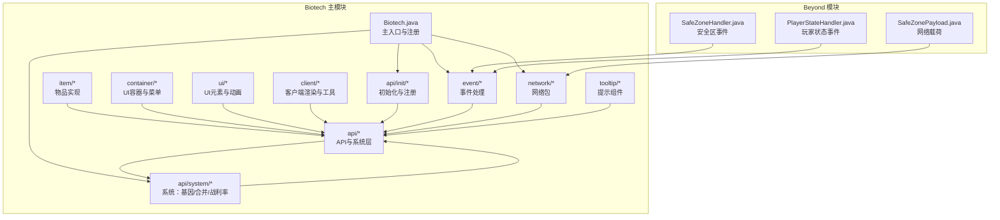
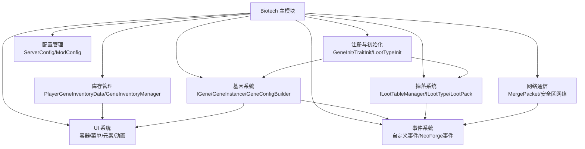
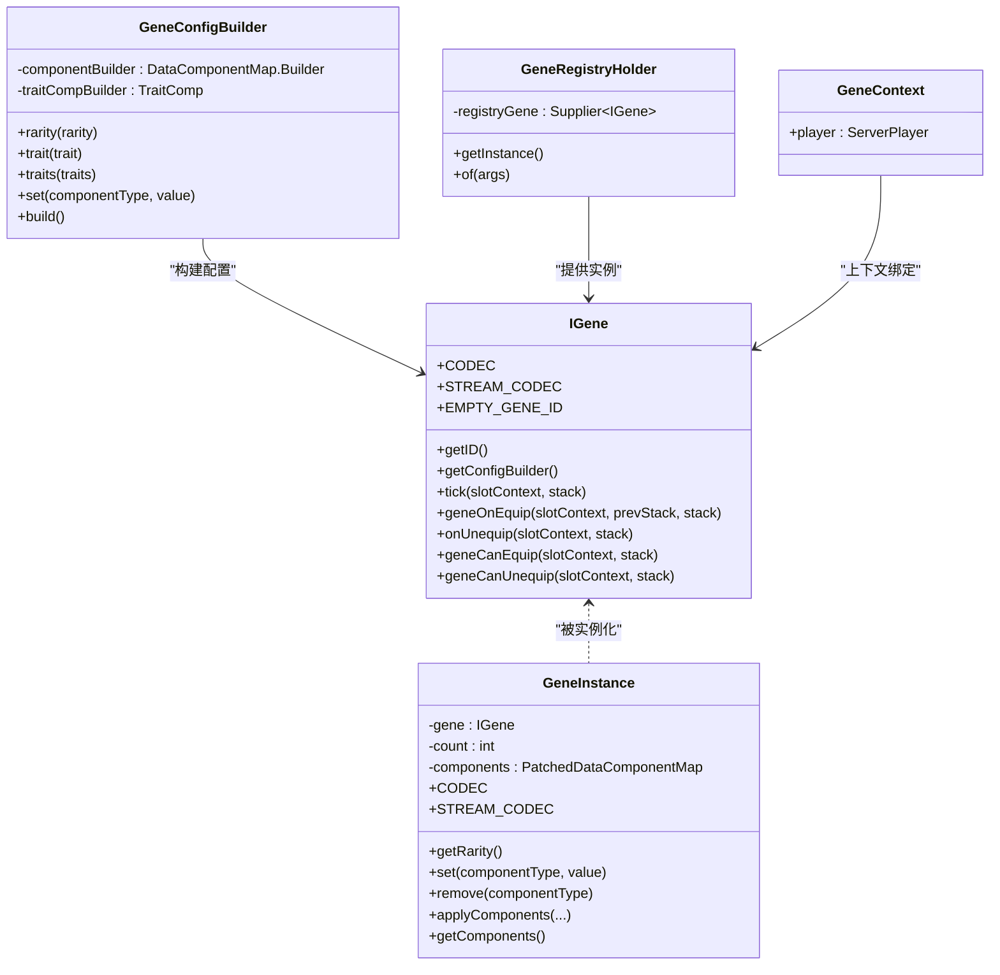
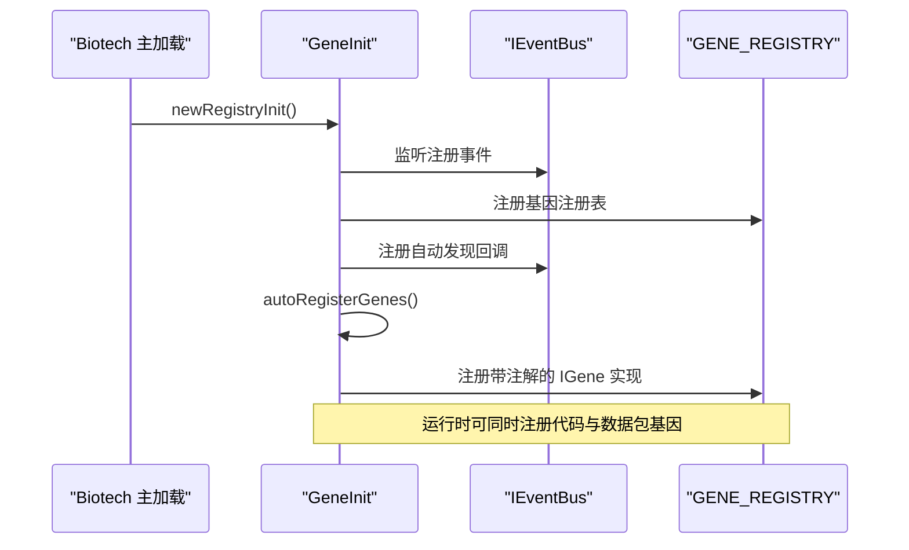
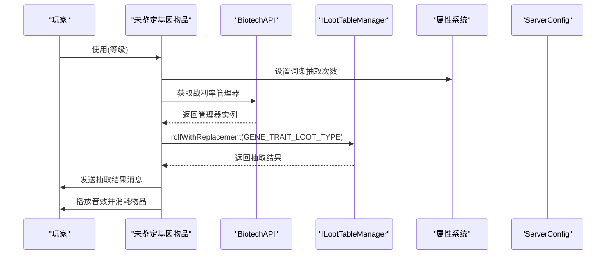
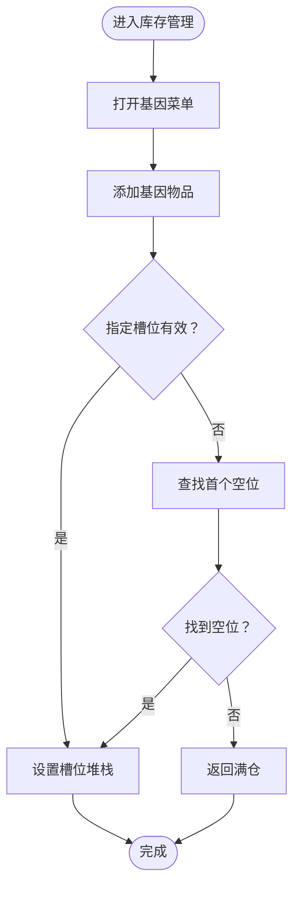
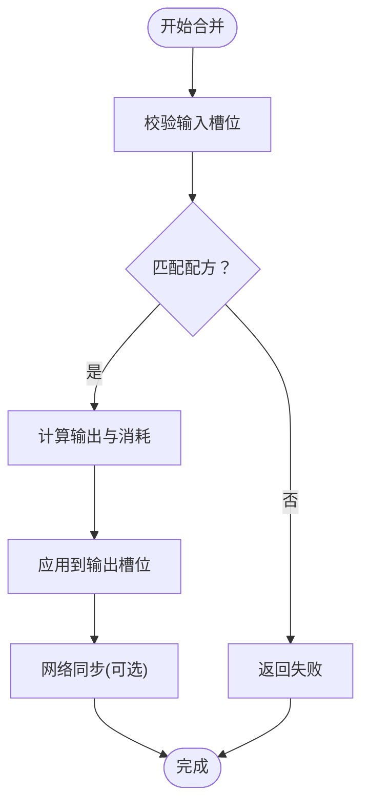
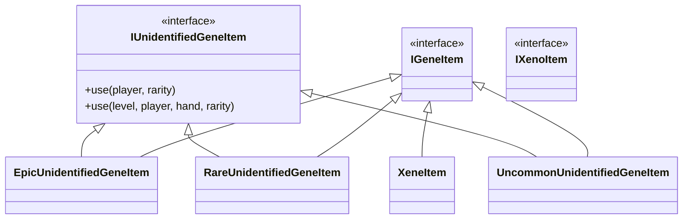
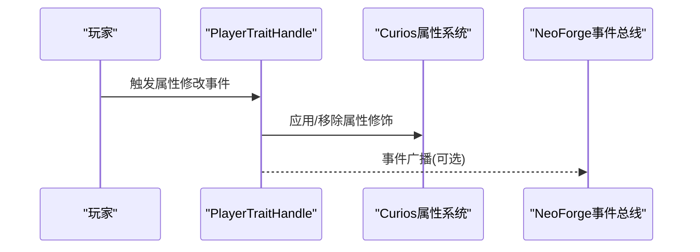
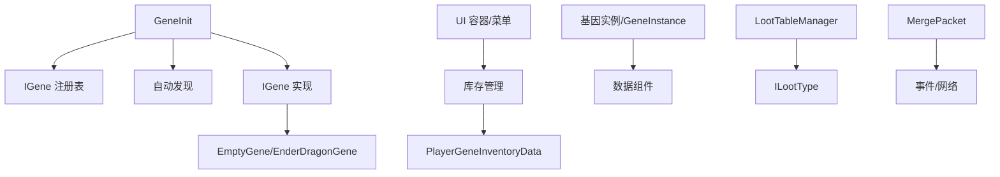

# 基因科技系统

<cite>
**本文引用的文件**
- [Biotech.java](file://Biotech/src/main/java/org/biotech/Biotech.java)
- [BiotechAPI.java](file://Biotech/src/main/java/org/biotech/api/BiotechAPI.java)
- [GeneData.java](file://Biotech/src/main/java/org/biotech/api/GeneData.java)
- [IGene.java](file://Biotech/src/main/java/org/biotech/api/system/gene/core/IGene.java)
- [IGeneItem.java](file://Biotech/src/main/java/org/biotech/api/system/gene/core/IGeneItem.java)
- [IUnidentifiedGeneItem.java](file://Biotech/src/main/java/org/biotech/api/system/gene/core/IUnidentifiedGeneItem.java)
- [IXenoItem.java](file://Biotech/src/main/java/org/biotech/api/system/gene/core/IXenoItem.java)
- [GeneInstance.java](file://Biotech/src/main/java/org/biotech/api/system/gene/GeneInstance.java)
- [GeneConfigBuilder.java](file://Biotech/src/main/java/org/biotech/api/system/gene/GeneConfigBuilder.java)
- [GeneRegistryHolder.java](file://Biotech/src/main/java/org/biotech/api/system/gene/GeneRegistryHolder.java)
- [GeneContext.java](file://Biotech/src/main/java/org/biotech/api/system/gene/GeneContext.java)
- [GeneInventoryManager.java](file://Biotech/src/main/java/org/biotech/api/system/gene/inventory/GeneInventoryManager.java)
- [PlayerGeneInventoryData.java](file://Biotech/src/main/java/org/biotech/api/system/gene/inventory/PlayerGeneInventoryData.java)
- [GeneInit.java](file://Biotech/src/main/java/org/biotech/api/init/GeneInit.java)
- [MergeManager.java](file://Biotech/src/main/java/org/biotech/api/system/merge/MergeManager.java)
- [MergeData.java](file://Biotech/src/main/java/org/biotech/api/system/merge/MergeData.java)
- [IMergeManager.java](file://Biotech/src/main/java/org/biotech/api/system/merge/core/IMergeManager.java)
- [LootTableManager.java](file://Biotech/src/main/java/org/biotech/api/system/loot/LootTableManager.java)
- [ILootTableManager.java](file://Biotech/src/main/java/org/biotech/api/system/loot/core/ILootTableManager.java)
- [ILootType.java](file://Biotech/src/main/java/org/biotech/api/system/loot/core/ILootType.java)
- [LootPack.java](file://Biotech/src/main/java/org/biotech/api/pack/LootPack.java)
- [ServerConfig.java](file://Biotech/src/main/java/org/biotech/api/config/ServerConfig.java)
- [PlayerStateData.java](file://Beyond/src/main/java/com/pz/beyond/data/PlayerStateData.java)
- [SafeZoneData.java](file://Beyond/src/main/java/com/pz/beyond/data/SafeZoneData.java)
- [SafeZoneHandler.java](file://Beyond/src/main/java/com/pz/beyond/event/SafeZoneHandler.java)
- [SafeZonePayload.java](file://Beyond/src/main/java/com/pz/beyond/network/SafeZonePayload.java)
- [SafeZonePayloadUtil.java](file://Beyond/src/main/java/com/pz/beyond/util/SafeZonePayloadUtil.java)
- [SafeZoneRenderer.java](file://Beyond/src/main/java/com/pz/beyond/renderer/SafeZoneRenderer.java)
- [SafeZoneClientCache.java](file://Beyond/src/main/java/com/pz/beyond/data/SafeZoneClientCache.java)
- [PlayerStateHandler.java](file://Beyond/src/main/java/com/pz/beyond/event/PlayerStateHandler.java)
- [PlayerStateChangeEvent.java](file://Beyond/src/main/java/com/pz/beyond/event/custom/PlayerStateChangeEvent.java)
- [ModPayloadsHandler.java](file://Beyond/src/main/java/com/pz/beyond/event/ModPayloadsHandler.java)
- [MergePacket.java](file://Biotech/src/main/java/org/biotech/network/MergePacket.java)
- [GeneInventoryContainer.java](file://Biotech/src/main/java/org/biotech/container/GeneInventoryContainer.java)
- [GeneMenu.java](file://Biotech/src/main/java/org/biotech/container/GeneMenu.java)
- [EpicUnidentifiedGeneItem.java](file://Biotech/src/main/java/org/biotech/item/EpicUnidentifiedGeneItem.java)
- [RareUnidentifiedGeneItem.java](file://Biotech/src/main/java/org/biotech/item/RareUnidentifiedGeneItem.java)
- [UncommonUnidentifiedGeneItem.java](file://Biotech/src/main/java/org/biotech/item/UncommonUnidentifiedGeneItem.java)
- [XeneItem.java](file://Biotech/src/main/java/org/biotech/item/XeneItem.java)
- [EmptyGene.java](file://Biotech/src/main/java/org/biotech/gene/EmptyGene.java)
- [EnderDragonGene.java](file://Biotech/src/main/java/org/biotech/gene/EnderDragonGene.java)
- [AttackSpeedTrait.java](file://Biotech/src/main/java/org/biotech/trait/AttackSpeedTrait.java)
- [HealthTrait.java](file://Biotech/src/main/java/org/biotech/trait/HealthTrait.java)
- [SpeedTrait.java](file://Biotech/src/main/java/org/biotech/trait/SpeedTrait.java)
- [TraitTableData.java](file://Biotech/src/main/java/org/biotech/api/system/trait/TraitTableData.java)
- [TraitComp.java](file://Biotech/src/main/java/org/biotech/component/TraitComp.java)
- [TraitInit.java](file://Biotech/src/main/java/org/biotech/api/init/TraitInit.java)
- [DataComponentInit.java](file://Biotech/src/main/java/org/biotech/api/init/DataComponentInit.java)
- [MenuInit.java](file://Biotech/src/main/java/org/biotech/api/init/MenuInit.java)
- [AttachInit.java](file://Biotech/src/main/java/org/biotech/api/init/AttachInit.java)
- [AttributeInit.java](file://Biotech/src/main/java/org/biotech/api/init/AttributeInit.java)
- [CreativeTabInit.java](file://Biotech/src/main/java/org/biotech/api/init/CreativeTabInit.java)
- [ItemInit.java](file://Biotech/src/main/java/org/biotech/api/init/ItemInit.java)
- [LootTypeInit.java](file://Biotech/src/main/java/org/biotech/api/init/LootTypeInit.java)
- [ModPackInit.java](file://Biotech/src/main/java/org/biotech/api/init/ModPackInit.java)
- [PacketInit.java](file://Biotech/src/main/java/org/biotech/api/init/PacketInit.java)
- [GeneLootTableData.java](file://Biotech/src/main/java/org/biotech/api/system/loot/data/GeneLootTableData.java)
- [LootPoolData.java](file://Biotech/src/main/java/org/biotech/api/system/loot/data/LootPoolData.java)
- [LootTableGroup.java](file://Biotech/src/main/java/org/biotech/api/system/loot/data/LootTableGroup.java)
- [LootTableGroupBuilder.java](file://Biotech/src/main/java/org/biotech/api/system/loot/data/LootTableGroupBuilder.java)
- [PlayerLootTableData.java](file://Biotech/src/main/java/org/biotech/api/system/loot/data/PlayerLootTableData.java)
- [FoodLootType.java](file://Biotech/src/main/java/org/biotech/loot/FoodLootType.java)
- [WeaponLootType.java](file://Biotech/src/main/java/org/biotech/loot/WeaponLootType.java)
- [GeneLootType.java](file://Biotech/src/main/java/org/biotech/loot/GeneLootType.java)
- [GeneTraitLootType.java](file://Biotech/src/main/java/org/biotech/loot/GeneTraitLootType.java)
- [XeneTraitLootType.java](file://Biotech/src/main/java/org/biotech/loot/XeneTraitLootType.java)
- [GeneDataHandle.java](file://Biotech/src/main/java/org/biotech/api/event/handle/GeneDataHandle.java)
- [PlayerGeneInventoryHandle.java](file://Biotech/src/main/java/org/biotech/api/event/handle/PlayerGeneInventoryHandle.java)
- [PlayerTraitHandle.java](file://Biotech/src/main/java/org/biotech/api/event/handle/PlayerTraitHandle.java)
- [GeneLootTableEventHandler.java](file://Biotech/src/main/java/org/biotech/api/event/handle/GeneLootTableEventHandler.java)
- [LootRollEvent.java](file://Biotech/src/main/java/org/biotech/api/event/custom/LootRollEvent.java)
- [GeneIdentifyEvent.java](file://Biotech/src/main/java/org/biotech/api/event/custom/GeneIdentifyEvent.java)
- [GeneInventoryChangeEvent.java](file://Biotech/src/main/java/org/biotech/api/event/custom/GeneInventoryChangeEvent.java)
- [BiotechItemModelProvider.java](file://Biotech/src/main/java/org/biotech/api/datagen/model/BiotechItemModelProvider.java)
- [BiotechDataGenerators.java](file://Biotech/src/main/java/org/biotech/api/datagen/BiotechDataGenerators.java)
- [ModPluginFinder.java](file://Biotech/src/main/java/org/biotech/api/util/ModPluginFinder.java)
- [TodoDebugLog.java](file://Biotech/src/main/java/org/biotech/util/TodoDebugLog.java)
- [AnimationManager.java](file://Biotech/src/main/java/org/biotech/ui/animation/AnimationManager.java)
- [IBaseAnimation.java](file://Biotech/src/main/java/org/biotech/ui/animation/IBaseAnimation.java)
- [ShowyAnimation.java](file://Biotech/src/main/java/org/biotech/ui/animation/ShowyAnimation.java)
- [BiotechTexture.java](file://Biotech/src/main/java/org/biotech/ui/BiotechTexture.java)
- [IScalable.java](file://Biotech/src/main/java/org/biotech/ui/IScalable.java)
- [GeneInventoryGroup.java](file://Biotech/src/main/java/org/biotech/ui/gene_inventroy/group/GeneInventoryGroup.java)
- [DNA.java](file://Biotech/src/main/java/org/biotech/ui/gene_inventroy/group/DNA.java)
- [EquipGeneSlot.java](file://Biotech/src/main/java/org/biotech/ui/gene_inventroy/group/EquipGeneSlot.java)
- [InfoGroup.java](file://Biotech/src/main/java/org/biotech/ui/gene_inventroy/group/InfoGroup.java)
- [Merge.java](file://Biotech/src/main/java/org/biotech/ui/gene_inventroy/group/Merge.java)
- [OutputGroup.java](file://Biotech/src/main/java/org/biotech/ui/gene_inventroy/group/OutputGroup.java)
- [FavoritesButton.java](file://Biotech/src/main/java/org/biotech/ui/gene_inventroy/element/inventory/FavoritesButton.java)
- [GeneInventoryLine.java](file://Biotech/src/main/java/org/biotech/ui/gene_inventroy/element/inventory/GeneInventoryLine.java)
- [GeneSlot.java](file://Biotech/src/main/java/org/biotech/ui/gene_inventroy/element/inventory/GeneSlot.java)
- [PageText.java](file://Biotech/src/main/java/org/biotech/ui/gene_inventroy/element/inventory/PageText.java)
- [SwitchPage.java](file://Biotech/src/main/java/org/biotech/ui/gene_inventroy/element/inventory/SwitchPage.java)
- [MergeInputSlot.java](file://Biotech/src/main/java/org/biotech/ui/gene_inventroy/element/merge/MergeInputSlot.java)
- [MergeInputSlotLine.java](file://Biotech/src/main/java/org/biotech/ui/gene_inventroy/element/merge/MergeInputSlotLine.java)
- [MergeOutputSlot.java](file://Biotech/src/main/java/org/biotech/ui/gene_inventroy/element/merge/MergeOutputSlot.java)
- [ElementGroup.java](file://Biotech/src/main/java/org/biotech/ui/gene_inventroy/group/ElementGroup.java)
- [EquipDNAGroup.java](file://Biotech/src/main/java/org/biotech/ui/gene_inventroy/group/EquipDNAGroup.java)
- [BaseRoot.java](file://Biotech/src/main/java/org/biotech/ui/gene_inventroy/group/BaseRoot.java)
- [GeneBackGround.java](file://Biotech/src/main/java/org/biotech/ui/gene_inventroy/group/GeneBackGround.java)
- [ToggleButton.java](file://Biotech/src/main/java/org/biotech/ui/gene_inventroy/group/ToggleButton.java)
- [TraitTooltipComponent.java](file://Biotech/src/main/java/org/biotech/tooltip/TraitTooltipComponent.java)
- [TraitClientTooltipComponent.java](file://Biotech/src/main/java/org/biotech/client/tooltip/TraitClientTooltipComponent.java)
- [TooltipUtil.java](file://Biotech/src/main/java/org/biotech/api/util/TooltipUtil.java)
- [AutoInit.java](file://Biotech/src/main/java/org/biotech/api/util/AutoInit.java)
- [IActive.java](file://Biotech/src/main/java/org/biotech/api/util/IActive.java)
- [ClientRenderInit.java](file://Biotech/src/main/java/org/biotech/client/ClientRenderInit.java)
- [GeneItemDecorator.java](file://Biotech/src/main/java/org/biotech/client/render/GeneItemDecorator.java)
- [XeneItemDecorator.java](file://Biotech/src/main/java/org/biotech/client/render/XeneItemDecorator.java)
- [biotech.mixins.json](file://Biotech/src/main/resources/biotech.mixins.json)
- [en_us.json](file://Biotech/src/main/resources/assets/biotech/lang/en_us.json)
- [zh_cn.json](file://Biotech/src/main/resources/assets/biotech/lang/zh_cn.json)
- [biotech.mixins.json](file://Beyond/src/main/resources/beyond.mixins.json)
- [en_us.json](file://Beyond/src/main/resources/assets/beyond/lang/en_us.json)
- [README.md](file://Biotech/README.md)
- [README.md](file://Beyond/README.md)
</cite>

## 目录
1. [简介](#简介)
2. [项目结构](#项目结构)
3. [核心组件](#核心组件)
4. [架构总览](#架构总览)
5. [详细组件分析](#详细组件分析)
6. [依赖分析](#依赖分析)
7. [性能考虑](#性能考虑)
8. [故障排除指南](#故障排除指南)
9. [结论](#结论)
10. [附录](#附录)

## 简介
本文件为“基因科技系统”的全面技术文档，面向开发者与高级用户，系统性阐述基因系统的整体架构、核心组件与工作机制，涵盖基因库存管理、未鉴定基因识别系统、基因合并算法、物品系统设计、BiotechAPI 接口设计、数据模型定义、事件处理机制与网络通信协议。文档同时提供扩展新基因类型的实践路径、与 UI 系统、网络包处理、配置管理的集成方式，并给出性能优化建议与最佳实践。

## 项目结构
本仓库包含三个主要子模块：
- Biotech：基因科技主模块，提供基因注册、物品、UI、网络、事件、数据生成等完整实现。
- Beyond：安全区与玩家状态相关模块，与 Biotech 在事件与网络层面存在交互。
- GalaxyLib、GameText、GeneHunter、ModFix：通用库与辅助模块，作为依赖或扩展存在。

图表来源
- [Biotech.java:16-73](file://Biotech/src/main/java/org/biotech/Biotech.java#L16-L73)
- [SafeZoneHandler.java](file://Beyond/src/main/java/com/pz/beyond/event/SafeZoneHandler.java)
- [SafeZonePayload.java](file://Beyond/src/main/java/com/pz/beyond/network/SafeZonePayload.java)

章节来源
- [Biotech.java:16-73](file://Biotech/src/main/java/org/biotech/Biotech.java#L16-L73)
- [README.md](file://Biotech/README.md)

## 核心组件
本节从系统视角概览基因科技的关键构件及其职责：
- 基因接口与实现：IGene 定义基因行为契约，GeneInstance 表示具体基因实例，GeneConfigBuilder 构建数据组件。
- 注册与发现：GeneInit 提供注册表、自动发现与获取基因实例的能力。
- 物品系统：IGeneItem、IUnidentifiedGeneItem、IXenoItem 定义不同类型的基因物品；各类未鉴定基因与异种物品提供使用与掉落逻辑。
- 库存与槽位：PlayerGeneInventoryData 描述持久化库存结构；GeneInventoryManager 提供增删查与收藏管理。
- 合并与配方：MergeManager、MergeData、IMergeManager 提供基因合并算法与配方管理。
- 战利率系统：ILootTableManager、ILootType、LootTableManager、LootPack、各类 LootType 与数据对象构成掉落与词条抽取体系。
- UI 与交互：容器、菜单、UI 组与元素、动画与渲染装饰器共同构成基因背包与合并界面。
- 事件与网络：自定义事件（如基因识别、库存变更、掉落滚动）与网络包（如合并包）支撑跨端一致性。
- 配置与国际化：ServerConfig 提供服务端配置；多语言资源提供 UI 文案。

章节来源
- [IGene.java:15-91](file://Biotech/src/main/java/org/biotech/api/system/gene/core/IGene.java#L15-L91)
- [GeneInstance.java:18-119](file://Biotech/src/main/java/org/biotech/api/system/gene/GeneInstance.java#L18-L119)
- [GeneConfigBuilder.java:16-109](file://Biotech/src/main/java/org/biotech/api/system/gene/GeneConfigBuilder.java#L16-L109)
- [GeneInit.java:21-107](file://Biotech/src/main/java/org/biotech/api/init/GeneInit.java#L21-L107)
- [IGeneItem.java:1-8](file://Biotech/src/main/java/org/biotech/api/system/gene/core/IGeneItem.java#L1-L8)
- [IUnidentifiedGeneItem.java:23-138](file://Biotech/src/main/java/org/biotech/api/system/gene/core/IUnidentifiedGeneItem.java#L23-L138)
- [IXenoItem.java:1-13](file://Biotech/src/main/java/org/biotech/api/system/gene/core/IXenoItem.java#L1-L13)
- [PlayerGeneInventoryData.java:20-72](file://Biotech/src/main/java/org/biotech/api/system/gene/inventory/PlayerGeneInventoryData.java#L20-L72)
- [GeneInventoryManager.java:18-186](file://Biotech/src/main/java/org/biotech/api/system/gene/inventory/GeneInventoryManager.java#L18-L186)
- [IMergeManager.java](file://Biotech/src/main/java/org/biotech/api/system/merge/core/IMergeManager.java)
- [MergeManager.java](file://Biotech/src/main/java/org/biotech/api/system/merge/MergeManager.java)
- [MergeData.java](file://Biotech/src/main/java/org/biotech/api/system/merge/MergeData.java)
- [ILootTableManager.java](file://Biotech/src/main/java/org/biotech/api/system/loot/core/ILootTableManager.java)
- [ILootType.java](file://Biotech/src/main/java/org/biotech/api/system/loot/core/ILootType.java)
- [LootTableManager.java](file://Biotech/src/main/java/org/biotech/api/system/loot/LootTableManager.java)
- [LootPack.java](file://Biotech/src/main/java/org/biotech/api/pack/LootPack.java)
- [ServerConfig.java](file://Biotech/src/main/java/org/biotech/api/config/ServerConfig.java)

## 架构总览
下图展示了基因系统在运行时的高层交互：主模块加载注册、事件监听、UI 菜单、网络包与掉落系统协同工作。

图表来源
- [Biotech.java:23-61](file://Biotech/src/main/java/org/biotech/Biotech.java#L23-L61)
- [GeneInit.java:21-107](file://Biotech/src/main/java/org/biotech/api/init/GeneInit.java#L21-L107)
- [LootTableManager.java](file://Biotech/src/main/java/org/biotech/api/system/loot/LootTableManager.java)
- [MergePacket.java](file://Biotech/src/main/java/org/biotech/network/MergePacket.java)

## 详细组件分析

### 基因接口与数据模型
- IGene：定义基因生命周期钩子（tick、装备/卸下、可装备/可卸下），并提供序列化编解码（Codec/StreamCodec）与空基因标识。
- GeneInstance：封装具体基因实例，包含基因引用、堆叠数与数据组件补丁，支持序列化与网络传输。
- GeneConfigBuilder：以数据组件为核心构建基因配置，支持稀有度、词条等属性设置。
- GeneRegistryHolder：持有 IGene 的 Supplier 并生成 GeneInstance，便于注册与实例化。
- GeneContext：携带当前操作的玩家上下文。

图表来源
- [IGene.java:15-91](file://Biotech/src/main/java/org/biotech/api/system/gene/core/IGene.java#L15-L91)
- [GeneInstance.java:18-119](file://Biotech/src/main/java/org/biotech/api/system/gene/GeneInstance.java#L18-L119)
- [GeneConfigBuilder.java:16-109](file://Biotech/src/main/java/org/biotech/api/system/gene/GeneConfigBuilder.java#L16-L109)
- [GeneRegistryHolder.java:10-25](file://Biotech/src/main/java/org/biotech/api/system/gene/GeneRegistryHolder.java#L10-L25)
- [GeneContext.java:11](file://Biotech/src/main/java/org/biotech/api/system/gene/GeneContext.java#L11)

章节来源
- [IGene.java:15-91](file://Biotech/src/main/java/org/biotech/api/system/gene/core/IGene.java#L15-L91)
- [GeneInstance.java:18-119](file://Biotech/src/main/java/org/biotech/api/system/gene/GeneInstance.java#L18-L119)
- [GeneConfigBuilder.java:16-109](file://Biotech/src/main/java/org/biotech/api/system/gene/GeneConfigBuilder.java#L16-L109)
- [GeneRegistryHolder.java:10-25](file://Biotech/src/main/java/org/biotech/api/system/gene/GeneRegistryHolder.java#L10-L25)
- [GeneContext.java:11](file://Biotech/src/main/java/org/biotech/api/system/gene/GeneContext.java#L11)

### 基因注册与自动发现
- GeneInit 提供基因注册表、注册方法、自动发现（扫描带注解的实现）、以及按 ID 获取基因的统一入口。
- EMPTY_GENE 用于占位与默认值场景。

图表来源
- [Biotech.java:49-61](file://Biotech/src/main/java/org/biotech/Biotech.java#L49-L61)
- [GeneInit.java:27-80](file://Biotech/src/main/java/org/biotech/api/init/GeneInit.java#L27-L80)

章节来源
- [Biotech.java:49-61](file://Biotech/src/main/java/org/biotech/Biotech.java#L49-L61)
- [GeneInit.java:21-107](file://Biotech/src/main/java/org/biotech/api/init/GeneInit.java#L21-L107)

### 未鉴定基因识别系统
- IUnidentifiedGeneItem 定义未鉴定基因的使用流程：根据稀有度设置词条抽取次数、通过战利率系统抽取、向玩家反馈结果、播放音效与消耗物品。
- 服务器端通过 BiotechAPI 获取战利率管理器，结合 ServerConfig 控制抽取次数。
- 结果消息根据添加结果（成功/失败原因）动态生成。

图表来源
- [IUnidentifiedGeneItem.java:30-94](file://Biotech/src/main/java/org/biotech/api/system/gene/core/IUnidentifiedGeneItem.java#L30-L94)
- [ServerConfig.java](file://Biotech/src/main/java/org/biotech/api/config/ServerConfig.java)

章节来源
- [IUnidentifiedGeneItem.java:23-138](file://Biotech/src/main/java/org/biotech/api/system/gene/core/IUnidentifiedGeneItem.java#L23-L138)
- [ServerConfig.java](file://Biotech/src/main/java/org/biotech/api/config/ServerConfig.java)

### 基因库存管理
- PlayerGeneInventoryData 定义 243×2 的基因槽位与收藏槽位，仅接受 IGeneItem 类型物品，使用 LDLib2 的持久化与序列化能力。
- GeneInventoryManager 提供打开菜单、添加/移除/查询、收藏管理、空位查找等操作，并封装 AddResult 错误码。

图表来源
- [PlayerGeneInventoryData.java:20-72](file://Biotech/src/main/java/org/biotech/api/system/gene/inventory/PlayerGeneInventoryData.java#L20-L72)
- [GeneInventoryManager.java:46-124](file://Biotech/src/main/java/org/biotech/api/system/gene/inventory/GeneInventoryManager.java#L46-L124)

章节来源
- [PlayerGeneInventoryData.java:20-72](file://Biotech/src/main/java/org/biotech/api/system/gene/inventory/PlayerGeneInventoryData.java#L20-L72)
- [GeneInventoryManager.java:18-186](file://Biotech/src/main/java/org/biotech/api/system/gene/inventory/GeneInventoryManager.java#L18-L186)

### 基因合并算法
- IMergeManager、MergeManager、MergeData 提供合并配方与执行流程。
- 合并过程通常涉及输入槽位校验、配方匹配、输出槽位处理与网络同步（如 MergePacket）。

图表来源
- [IMergeManager.java](file://Biotech/src/main/java/org/biotech/api/system/merge/core/IMergeManager.java)
- [MergeManager.java](file://Biotech/src/main/java/org/biotech/api/system/merge/MergeManager.java)
- [MergeData.java](file://Biotech/src/main/java/org/biotech/api/system/merge/MergeData.java)
- [MergePacket.java](file://Biotech/src/main/java/org/biotech/network/MergePacket.java)

章节来源
- [IMergeManager.java](file://Biotech/src/main/java/org/biotech/api/system/merge/core/IMergeManager.java)
- [MergeManager.java](file://Biotech/src/main/java/org/biotech/api/system/merge/MergeManager.java)
- [MergeData.java](file://Biotech/src/main/java/org/biotech/api/system/merge/MergeData.java)
- [MergePacket.java](file://Biotech/src/main/java/org/biotech/network/MergePacket.java)

### 物品系统设计
- IGeneItem、IUnidentifiedGeneItem、IXenoItem 定义不同物品类型的行为边界。
- 未鉴定基因物品（稀有度：常见/稀有/史诗）提供统一使用流程与音效。
- 异种物品（XeneItem）用于局内天赋相关用途。

图表来源
- [IGeneItem.java:1-8](file://Biotech/src/main/java/org/biotech/api/system/gene/core/IGeneItem.java#L1-L8)
- [IUnidentifiedGeneItem.java:23-138](file://Biotech/src/main/java/org/biotech/api/system/gene/core/IUnidentifiedGeneItem.java#L23-L138)
- [IXenoItem.java:1-13](file://Biotech/src/main/java/org/biotech/api/system/gene/core/IXenoItem.java#L1-L13)
- [EpicUnidentifiedGeneItem.java](file://Biotech/src/main/java/org/biotech/item/EpicUnidentifiedGeneItem.java)
- [RareUnidentifiedGeneItem.java](file://Biotech/src/main/java/org/biotech/item/RareUnidentifiedGeneItem.java)
- [UncommonUnidentifiedGeneItem.java](file://Biotech/src/main/java/org/biotech/item/UncommonUnidentifiedGeneItem.java)
- [XeneItem.java](file://Biotech/src/main/java/org/biotech/item/XeneItem.java)

章节来源
- [IGeneItem.java:1-8](file://Biotech/src/main/java/org/biotech/api/system/gene/core/IGeneItem.java#L1-L8)
- [IUnidentifiedGeneItem.java:23-138](file://Biotech/src/main/java/org/biotech/api/system/gene/core/IUnidentifiedGeneItem.java#L23-L138)
- [IXenoItem.java:1-13](file://Biotech/src/main/java/org/biotech/api/system/gene/core/IXenoItem.java#L1-L13)

### BiotechAPI 接口设计
- BiotechAPI 提供系统级访问点，例如获取战利率管理器、基因管理器等，供物品与事件处理器使用。
- 典型用法：在物品使用或事件回调中通过 BiotechAPI 获取对应管理器，再执行业务逻辑。

章节来源
- [BiotechAPI.java](file://Biotech/src/main/java/org/biotech/api/BiotechAPI.java)

### 事件处理机制
- 自定义事件：LootRollEvent、GeneIdentifyEvent、GeneInventoryChangeEvent 等，承载业务状态变化。
- 事件处理器：PlayerGeneInventoryHandle、PlayerTraitHandle、GeneLootTableEventHandler 等负责具体逻辑。
- 与 Beyond 模块交互：SafeZoneHandler、ModPayloadsHandler 等处理安全区与模组间负载。

图表来源
- [PlayerTraitHandle.java](file://Biotech/src/main/java/org/biotech/api/event/handle/PlayerTraitHandle.java)
- [Biotech.java:37](file://Biotech/src/main/java/org/biotech/Biotech.java#L37)

章节来源
- [PlayerTraitHandle.java](file://Biotech/src/main/java/org/biotech/api/event/handle/PlayerTraitHandle.java)
- [Biotech.java:37](file://Biotech/src/main/java/org/biotech/Biotech.java#L37)

### 网络通信协议
- MergePacket：用于基因合并结果的网络同步。
- SafeZonePayload：Beyond 模块的安全区网络载荷，用于跨端状态同步。
- 通用编码：IGene/IGeneItem 使用 ResourceLocation 与 StreamCodec 进行网络编解码，确保空值与默认值安全。

章节来源
- [MergePacket.java](file://Biotech/src/main/java/org/biotech/network/MergePacket.java)
- [SafeZonePayload.java](file://Beyond/src/main/java/com/pz/beyond/network/SafeZonePayload.java)
- [IGene.java:67-87](file://Biotech/src/main/java/org/biotech/api/system/gene/core/IGene.java#L67-L87)

### UI 系统与交互
- 容器与菜单：GeneInventoryContainer、GeneMenu 提供背包与合并界面的容器实现。
- UI 组与元素：包含基因库存行、槽位、收藏按钮、翻页控件、合并输入/输出槽等。
- 动画与渲染：AnimationManager、ShowyAnimation、IBaseAnimation、渲染装饰器等提升交互体验。

章节来源
- [GeneInventoryContainer.java](file://Biotech/src/main/java/org/biotech/container/GeneInventoryContainer.java)
- [GeneMenu.java](file://Biotech/src/main/java/org/biotech/container/GeneMenu.java)
- [GeneInventoryGroup.java](file://Biotech/src/main/java/org/biotech/ui/gene_inventroy/group/GeneInventoryGroup.java)
- [Merge.java](file://Biotech/src/main/java/org/biotech/ui/gene_inventroy/group/Merge.java)
- [AnimationManager.java](file://Biotech/src/main/java/org/biotech/ui/animation/AnimationManager.java)
- [ShowyAnimation.java](file://Biotech/src/main/java/org/biotech/ui/animation/ShowyAnimation.java)

### 配置管理
- ServerConfig：集中管理服务端配置项（如不同稀有度的词条抽取次数）。
- ModConfig：通过 Biotech 主模块注册服务器配置规范。

章节来源
- [ServerConfig.java](file://Biotech/src/main/java/org/biotech/api/config/ServerConfig.java)
- [Biotech.java:26](file://Biotech/src/main/java/org/biotech/Biotech.java#L26)

### 数据生成与本地化
- BiotechDataGenerators 与 BiotechItemModelProvider：生成物品模型与数据包资源。
- 多语言资源：en_us.json、zh_cn.json 提供 UI 文案。

章节来源
- [BiotechDataGenerators.java](file://Biotech/src/main/java/org/biotech/api/datagen/BiotechDataGenerators.java)
- [BiotechItemModelProvider.java](file://Biotech/src/main/java/org/biotech/api/datagen/model/BiotechItemModelProvider.java)
- [en_us.json](file://Biotech/src/main/resources/assets/biotech/lang/en_us.json)
- [zh_cn.json](file://Biotech/src/main/resources/assets/biotech/lang/zh_cn.json)

## 依赖分析
- 组件耦合：基因系统通过 GeneInit 与注册表解耦，IGene 与物品类型通过 Curios 能力解耦，UI 与逻辑通过容器/菜单解耦。
- 外部依赖：LDLib2（持久化与序列化）、NeoForge（事件总线与注册）、Curios（装备槽位能力）、Mixins（运行时增强）。
- 循环依赖：未见直接循环依赖；事件与网络包通过接口与回调避免紧耦合。

图表来源
- [GeneInit.java:21-107](file://Biotech/src/main/java/org/biotech/api/init/GeneInit.java#L21-L107)
- [PlayerGeneInventoryData.java:20-72](file://Biotech/src/main/java/org/biotech/api/system/gene/inventory/PlayerGeneInventoryData.java#L20-L72)
- [LootTableManager.java](file://Biotech/src/main/java/org/biotech/api/system/loot/LootTableManager.java)
- [MergePacket.java](file://Biotech/src/main/java/org/biotech/network/MergePacket.java)

章节来源
- [GeneInit.java:21-107](file://Biotech/src/main/java/org/biotech/api/init/GeneInit.java#L21-L107)
- [PlayerGeneInventoryData.java:20-72](file://Biotech/src/main/java/org/biotech/api/system/gene/inventory/PlayerGeneInventoryData.java#L20-L72)
- [LootTableManager.java](file://Biotech/src/main/java/org/biotech/api/system/loot/LootTableManager.java)
- [MergePacket.java](file://Biotech/src/main/java/org/biotech/network/MergePacket.java)

## 性能考虑
- 序列化与网络：使用 StreamCodec 编解码 IGene/IGeneItem，减少反射开销；对空值使用统一标识（EMPTY_GENE_ID）避免分支判断。
- 槽位访问：PlayerGeneInventoryData 使用 ItemStackHandler 并限制物品类型，降低无效写入成本。
- 自动发现：仅在启动阶段扫描与注册，避免运行期频繁扫描。
- UI 更新：UI 组与元素采用分页与懒加载策略，减少一次性渲染压力。
- 事件与网络：事件处理器尽量短小，网络包最小化，避免阻塞主线程。

## 故障排除指南
- 无法识别新基因：检查是否通过 GeneInit 正确注册，或使用自动发现注解；确认 ID 与注册路径一致。
- 未鉴定基因无法抽取词条：检查 ServerConfig 对应稀有度的抽取次数配置；确认玩家属性是否正确设置。
- 库存添加失败：查看 AddResult 错误码含义（满仓/空物品/无空间/类型错误），定位问题槽位。
- 合并失败：核对输入槽位是否满足配方要求，检查网络同步是否成功。
- UI 不显示：确认容器/菜单注册与 UI 组装配是否正确；检查纹理与本地化资源是否存在。

章节来源
- [IUnidentifiedGeneItem.java:128-136](file://Biotech/src/main/java/org/biotech/api/system/gene/core/IUnidentifiedGeneItem.java#L128-L136)
- [GeneInventoryManager.java:77-80](file://Biotech/src/main/java/org/biotech/api/system/gene/inventory/GeneInventoryManager.java#L77-L80)

## 结论
基因科技系统以数据组件为核心，通过清晰的接口与注册机制实现了高度可扩展的基因生态。库存、掉落、合并、UI、网络与事件模块协同工作，既保证了运行时性能，又提供了良好的扩展性。遵循本文的最佳实践与扩展路径，可快速新增基因类型与玩法内容。

## 附录

### 如何扩展新的基因类型
- 实现 IGene 并在类上标注自动发现注解（参考现有实现）。
- 在构造函数中设置唯一 ID 与配置构建器（稀有度、词条等）。
- 通过 GeneInit.registerGene 或自动发现机制注册。
- 如需特殊物品形态，实现 IGeneItem 或 IUnidentifiedGeneItem 并注册相应物品。

章节来源
- [IGene.java:15-91](file://Biotech/src/main/java/org/biotech/api/system/gene/core/IGene.java#L15-L91)
- [GeneInit.java:64-80](file://Biotech/src/main/java/org/biotech/api/init/GeneInit.java#L64-L80)
- [EmptyGene.java](file://Biotech/src/main/java/org/biotech/gene/EmptyGene.java)
- [EnderDragonGene.java](file://Biotech/src/main/java/org/biotech/gene/EnderDragonGene.java)

### API 使用示例（路径指引）
- 获取战利率管理器：[BiotechAPI.java](file://Biotech/src/main/java/org/biotech/api/BiotechAPI.java)
- 注册基因：[GeneInit.java:64-66](file://Biotech/src/main/java/org/biotech/api/init/GeneInit.java#L64-L66)
- 使用未鉴定基因：[IUnidentifiedGeneItem.java:73-94](file://Biotech/src/main/java/org/biotech/api/system/gene/core/IUnidentifiedGeneItem.java#L73-L94)
- 打开基因菜单：[GeneInventoryManager.java:28-39](file://Biotech/src/main/java/org/biotech/api/system/gene/inventory/GeneInventoryManager.java#L28-L39)
- 合并基因：[MergeManager.java](file://Biotech/src/main/java/org/biotech/api/system/merge/MergeManager.java)