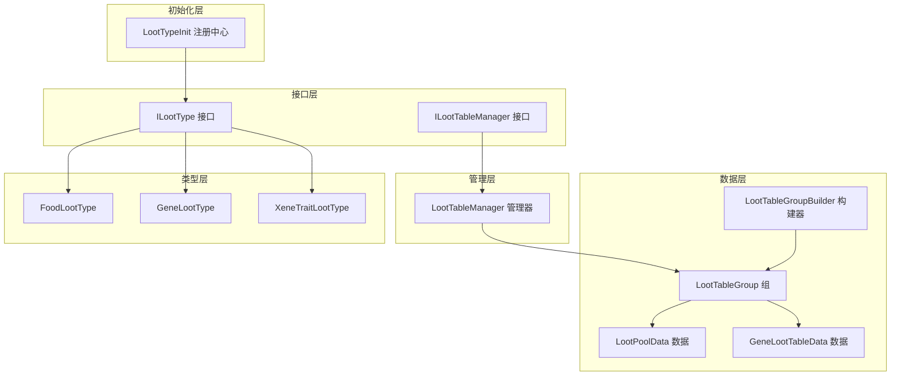
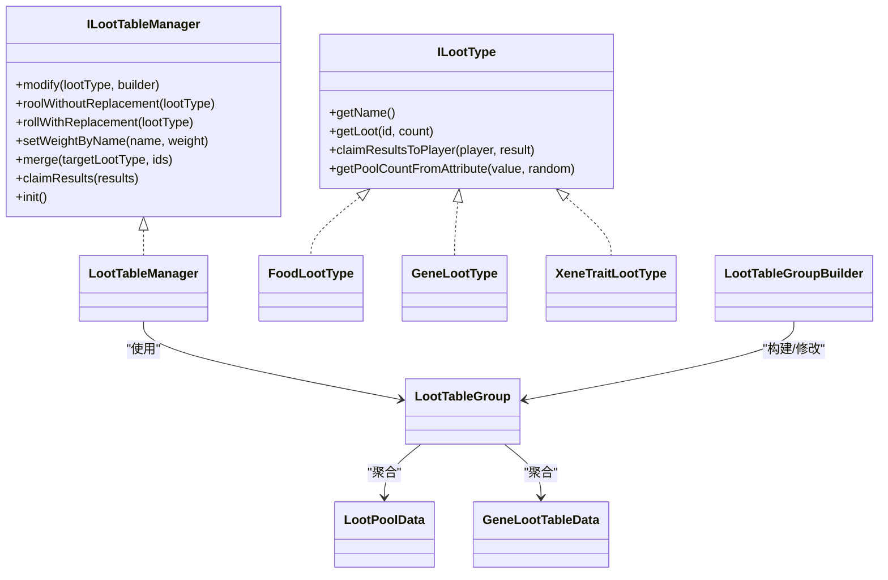
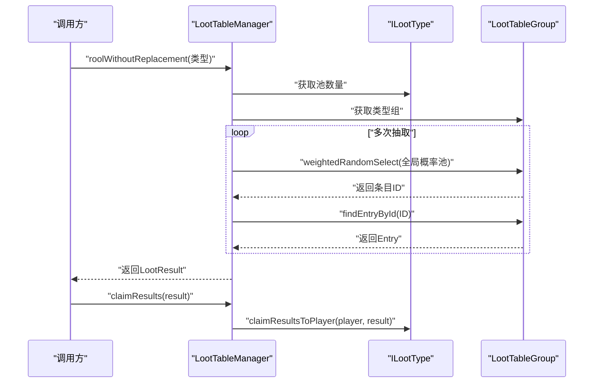
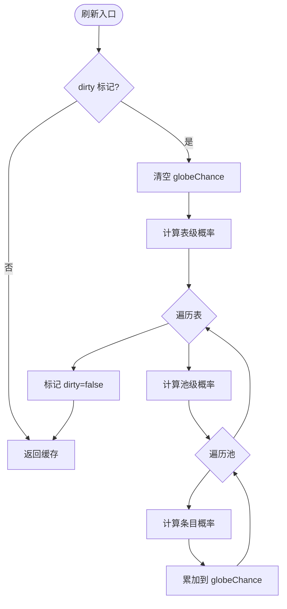
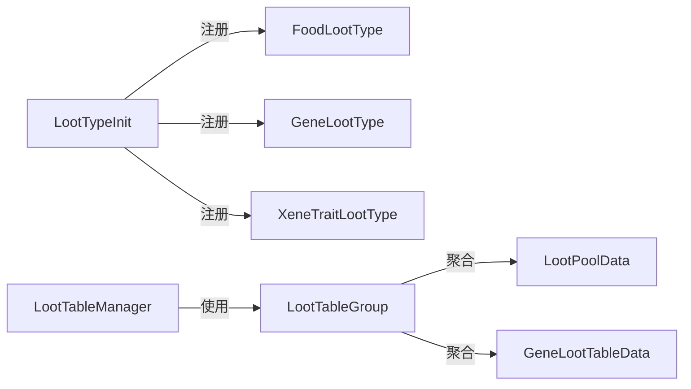

# 战利品表系统

<cite>
**本文引用的文件**
- [LootTableManager.java](file://Biotech/src/main/java/org/biotech/api/system/loot/LootTableManager.java)
- [ILootTableManager.java](file://Biotech/src/main/java/org/biotech/api/system/loot/core/ILootTableManager.java)
- [ILootType.java](file://Biotech/src/main/java/org/biotech/api/system/loot/core/ILootType.java)
- [LootPoolData.java](file://Biotech/src/main/java/org/biotech/api/system/loot/data/LootPoolData.java)
- [GeneLootTableData.java](file://Biotech/src/main/java/org/biotech/api/system/loot/data/GeneLootTableData.java)
- [LootTableGroup.java](file://Biotech/src/main/java/org/biotech/api/system/loot/data/LootTableGroup.java)
- [LootTableGroupBuilder.java](file://Biotech/src/main/java/org/biotech/api/system/loot/data/LootTableGroupBuilder.java)
- [LootTypeInit.java](file://Biotech/src/main/java/org/biotech/api/init/LootTypeInit.java)
- [FoodLootType.java](file://Biotech/src/main/java/org/biotech/loot/FoodLootType.java)
- [GeneLootType.java](file://Biotech/src/main/java/org/biotech/loot/GeneLootType.java)
- [XeneTraitLootType.java](file://Biotech/src/main/java/org/biotech/loot/XeneTraitLootType.java)
- [xene_trait_base.json](file://Biotech/src/main/resources/data/biotech/gene_loot_table/in_game/xene_trait_base.json)
- [gene_trait_base.json](file://Biotech/src/main/resources/data/biotech/gene_loot_table/other/gene_trait_base.json)
</cite>

## 目录
1. [简介](#简介)
2. [项目结构](#项目结构)
3. [核心组件](#核心组件)
4. [架构总览](#架构总览)
5. [详细组件分析](#详细组件分析)
6. [依赖关系分析](#依赖关系分析)
7. [性能考虑](#性能考虑)
8. [故障排查指南](#故障排查指南)
9. [结论](#结论)
10. [附录](#附录)

## 简介
本技术文档围绕战利品表系统展开，重点阐释 LootTableManager 的架构设计与工作原理，涵盖战利品表的加载、解析与执行机制；详解各类战利品类型（基因战利品、异种战利品、食物战利品等）的定义与使用；提供创建自定义战利品表、配置掉落权重与数量范围的方法指引；解释战利品包系统的设计理念与预设战利品包的组织管理方式；并给出平衡性调整建议与性能优化策略。

## 项目结构
战利品表系统位于 Biotech 模块中，采用“接口 + 数据模型 + 管理器 + 类型实现”的分层设计：
- 接口层：ILootTableManager、ILootType 定义统一抽象
- 数据层：LootPoolData、GeneLootTableData、LootTableGroup 等承载 JSON 结构与运行时状态
- 管理层：LootTableManager 提供抽取、合并、权重调整、结果发放等能力
- 类型层：FoodLootType、GeneLootType、XeneTraitLootType 等实现不同掉落类型的生成与发放
- 初始化层：LootTypeInit 负责注册与检索战利品类型

图表来源
- [ILootTableManager.java:1-77](file://Biotech/src/main/java/org/biotech/api/system/loot/core/ILootTableManager.java#L1-L77)
- [ILootType.java:1-85](file://Biotech/src/main/java/org/biotech/api/system/loot/core/ILootType.java#L1-L85)
- [LootPoolData.java:1-81](file://Biotech/src/main/java/org/biotech/api/system/loot/data/LootPoolData.java#L1-L81)
- [GeneLootTableData.java:1-53](file://Biotech/src/main/java/org/biotech/api/system/loot/data/GeneLootTableData.java#L1-L53)
- [LootTableGroup.java:1-384](file://Biotech/src/main/java/org/biotech/api/system/loot/data/LootTableGroup.java#L1-L384)
- [LootTableGroupBuilder.java:1-262](file://Biotech/src/main/java/org/biotech/api/system/loot/data/LootTableGroupBuilder.java#L1-L262)
- [LootTableManager.java:1-190](file://Biotech/src/main/java/org/biotech/api/system/loot/LootTableManager.java#L1-L190)
- [LootTypeInit.java:1-78](file://Biotech/src/main/java/org/biotech/api/init/LootTypeInit.java#L1-L78)

章节来源
- [LootTableManager.java:1-190](file://Biotech/src/main/java/org/biotech/api/system/loot/LootTableManager.java#L1-L190)
- [LootTableGroup.java:1-384](file://Biotech/src/main/java/org/biotech/api/system/loot/data/LootTableGroup.java#L1-L384)
- [LootTableGroupBuilder.java:1-262](file://Biotech/src/main/java/org/biotech/api/system/loot/data/LootTableGroupBuilder.java#L1-L262)
- [ILootTableManager.java:1-77](file://Biotech/src/main/java/org/biotech/api/system/loot/core/ILootTableManager.java#L1-L77)
- [ILootType.java:1-85](file://Biotech/src/main/java/org/biotech/api/system/loot/core/ILootType.java#L1-L85)
- [LootTypeInit.java:1-78](file://Biotech/src/main/java/org/biotech/api/init/LootTypeInit.java#L1-L78)

## 核心组件
- ILootTableManager：定义战利品表管理器的统一接口，包括修改、抽取（放回/不放回）、批量权重设置、合并表、结果发放等能力
- ILootType：定义不同掉落类型的抽象，负责根据 ID 生成具体掉落对象，并提供发放到玩家的默认实现
- LootTableGroup：管理一组战利品表，维护全局概率缓存、权重设置、查找与刷新机制
- LootTableGroupBuilder：链式构建器，支持按表、池、条目逐层查找与修改
- LootPoolData/GeneLootTableData：JSON 数据模型，承载战利品表的结构化信息
- LootTypeInit：集中注册与检索各类战利品类型
- 具体类型实现：FoodLootType、GeneLootType、XeneTraitLootType 分别处理食物、基因、异种词条掉落

章节来源
- [ILootTableManager.java:1-77](file://Biotech/src/main/java/org/biotech/api/system/loot/core/ILootTableManager.java#L1-L77)
- [ILootType.java:1-85](file://Biotech/src/main/java/org/biotech/api/system/loot/core/ILootType.java#L1-L85)
- [LootTableGroup.java:1-384](file://Biotech/src/main/java/org/biotech/api/system/loot/data/LootTableGroup.java#L1-L384)
- [LootTableGroupBuilder.java:1-262](file://Biotech/src/main/java/org/biotech/api/system/loot/data/LootTableGroupBuilder.java#L1-L262)
- [LootPoolData.java:1-81](file://Biotech/src/main/java/org/biotech/api/system/loot/data/LootPoolData.java#L1-L81)
- [GeneLootTableData.java:1-53](file://Biotech/src/main/java/org/biotech/api/system/loot/data/GeneLootTableData.java#L1-L53)
- [LootTypeInit.java:1-78](file://Biotech/src/main/java/org/biotech/api/init/LootTypeInit.java#L1-L78)

## 架构总览
系统采用“类型驱动 + 表组聚合 + 权重分层”的架构：
- 类型层通过 ILootType 与具体实现解耦，便于扩展新类型
- 数据层通过 JSON 文件定义表结构，运行时由 LootTableGroup 聚合并计算全局概率
- 管理层通过 LootTableManager 提供抽取、合并、权重调整与结果发放
- 初始化层集中注册类型，便于外部模块引用

图表来源
- [LootTableManager.java:1-190](file://Biotech/src/main/java/org/biotech/api/system/loot/LootTableManager.java#L1-L190)
- [ILootTableManager.java:1-77](file://Biotech/src/main/java/org/biotech/api/system/loot/core/ILootTableManager.java#L1-L77)
- [ILootType.java:1-85](file://Biotech/src/main/java/org/biotech/api/system/loot/core/ILootType.java#L1-L85)
- [FoodLootType.java:1-45](file://Biotech/src/main/java/org/biotech/loot/FoodLootType.java#L1-L45)
- [GeneLootType.java:1-37](file://Biotech/src/main/java/org/biotech/loot/GeneLootType.java#L1-L37)
- [XeneTraitLootType.java:1-69](file://Biotech/src/main/java/org/biotech/loot/XeneTraitLootType.java#L1-L69)
- [LootTableGroup.java:1-384](file://Biotech/src/main/java/org/biotech/api/system/loot/data/LootTableGroup.java#L1-L384)
- [LootTableGroupBuilder.java:1-262](file://Biotech/src/main/java/org/biotech/api/system/loot/data/LootTableGroupBuilder.java#L1-L262)
- [LootPoolData.java:1-81](file://Biotech/src/main/java/org/biotech/api/system/loot/data/LootPoolData.java#L1-L81)
- [GeneLootTableData.java:1-53](file://Biotech/src/main/java/org/biotech/api/system/loot/data/GeneLootTableData.java#L1-L53)

## 详细组件分析

### LootTableManager：抽取与管理
- 初始化：在 init 中将预设的基础战利品表合并到对应类型组
- 抽取算法：
  - 不放回：每次抽取后从全局概率池移除已抽中条目，避免重复
  - 放回：每次抽取后保留概率池，允许重复抽取
- 权重与数量：
  - setWeightByName：按名称批量调整池权重
  - merge：将多个战利品表合并到目标类型组
- 结果发放：通过 lootType 的 claimResultsToPlayer 将掉落发放给玩家

图表来源
- [LootTableManager.java:54-112](file://Biotech/src/main/java/org/biotech/api/system/loot/LootTableManager.java#L54-L112)
- [LootTableGroup.java:133-142](file://Biotech/src/main/java/org/biotech/api/system/loot/data/LootTableGroup.java#L133-L142)
- [ILootType.java:33-46](file://Biotech/src/main/java/org/biotech/api/system/loot/core/ILootType.java#L33-L46)

章节来源
- [LootTableManager.java:34-138](file://Biotech/src/main/java/org/biotech/api/system/loot/LootTableManager.java#L34-L138)
- [ILootTableManager.java:22-68](file://Biotech/src/main/java/org/biotech/api/system/loot/core/ILootTableManager.java#L22-L68)

### LootTableGroup：概率聚合与刷新
- 全局概率缓存 globeChance：按“表概率×池概率×条目概率”累加，支持同 ID 条目跨表/跨池叠加
- 刷新流程：当 dirty=true 时，重新计算各层级概率并写入 globeChance
- 查询与修改：
  - findEntryById：按条目 ID 遍历查找
  - findPools：按池名查找所有匹配池（支持重名）
  - setLootTableWeight/poolWeight/entryWeight/count：逐层设置权重与数量

图表来源
- [LootTableGroup.java:346-381](file://Biotech/src/main/java/org/biotech/api/system/loot/data/LootTableGroup.java#L346-L381)
- [LootTableGroup.java:214-223](file://Biotech/src/main/java/org/biotech/api/system/loot/data/LootTableGroup.java#L214-L223)

章节来源
- [LootTableGroup.java:17-384](file://Biotech/src/main/java/org/biotech/api/system/loot/data/LootTableGroup.java#L17-L384)

### LootTableGroupBuilder：链式构建与修改
- 支持按表、池、条目逐层查找与修改
- 提供 modifyLootTable/findPool/findEntry 等链式 API，便于在 init 或运行时动态调整

章节来源
- [LootTableGroupBuilder.java:25-262](file://Biotech/src/main/java/org/biotech/api/system/loot/data/LootTableGroupBuilder.java#L1-L262)

### ILootType：掉落类型抽象与发放
- getLoot：根据 ID 生成具体掉落对象（如物品堆栈、词条等）
- claimResultsToPlayer：默认发放逻辑（物品堆栈尝试放入背包，否则掉落至地面）
- getPoolCountFromAttribute：基于属性值计算抽取次数（整数部分固定次数 + 小数部分概率）

章节来源
- [ILootType.java:9-85](file://Biotech/src/main/java/org/biotech/api/system/loot/core/ILootType.java#L1-L85)

### 具体掉落类型实现

#### 食物战利品（FoodLootType）
- 仅处理带有食物组件的物品
- 通过注册表获取物品并校验食物属性

章节来源
- [FoodLootType.java:1-45](file://Biotech/src/main/java/org/biotech/loot/FoodLootType.java#L1-L45)

#### 基因战利品（GeneLootType）
- 根据基因 ID 获取基因对象并封装为 GeneItem 物品堆栈

章节来源
- [GeneLootType.java:1-37](file://Biotech/src/main/java/org/biotech/loot/GeneLootType.java#L1-L37)

#### 异种战利品（XeneTraitLootType）
- 返回 ITrait 对象
- 自定义发放逻辑：将多个词条聚合到 TraitComp，封装为 XeneItem 并放入 xene_equip_slot 槽位

章节来源
- [XeneTraitLootType.java:1-69](file://Biotech/src/main/java/org/biotech/loot/XeneTraitLootType.java#L1-L69)

### 战利品包与预设表
- 预设表以 JSON 形式存放于资源数据目录，包含 identify、note、loot_type、pools 等字段
- 基础表示例：
  - xene_trait_base.json：异种词条基础表
  - gene_trait_base.json：基因词条基础表
- 管理器在 init 中将这些基础表合并到对应类型组，供后续抽取使用

章节来源
- [xene_trait_base.json:1-26](file://Biotech/src/main/resources/data/biotech/gene_loot_table/in_game/xene_trait_base.json#L1-L26)
- [gene_trait_base.json:1-26](file://Biotech/src/main/resources/data/biotech/gene_loot_table/other/gene_trait_base.json#L1-L26)
- [LootTableManager.java:35-41](file://Biotech/src/main/java/org/biotech/api/system/loot/LootTableManager.java#L35-L41)

## 依赖关系分析
- 类型注册：LootTypeInit 通过延迟注册器集中注册 ILootType 实现，便于外部模块按名称或 ID 获取
- 管理器依赖：LootTableManager 依赖 ILootType、LootTableGroup、PlayerLootTableData 等运行时数据
- 数据依赖：LootTableGroup 依赖 JSON 数据模型（LootPoolData、GeneLootTableData）进行聚合与刷新

图表来源
- [LootTypeInit.java:58-76](file://Biotech/src/main/java/org/biotech/api/init/LootTypeInit.java#L58-L76)
- [LootTableManager.java:21-32](file://Biotech/src/main/java/org/biotech/api/system/loot/LootTableManager.java#L21-L32)
- [LootTableGroup.java:74-83](file://Biotech/src/main/java/org/biotech/api/system/loot/data/LootTableGroup.java#L74-L83)
- [LootPoolData.java:24-81](file://Biotech/src/main/java/org/biotech/api/system/loot/data/LootPoolData.java#L1-L81)
- [GeneLootTableData.java:25-53](file://Biotech/src/main/java/org/biotech/api/system/loot/data/GeneLootTableData.java#L1-L53)

章节来源
- [LootTypeInit.java:1-78](file://Biotech/src/main/java/org/biotech/api/init/LootTypeInit.java#L1-L78)
- [LootTableManager.java:1-190](file://Biotech/src/main/java/org/biotech/api/system/loot/LootTableManager.java#L1-L190)
- [LootTableGroup.java:1-384](file://Biotech/src/main/java/org/biotech/api/system/loot/data/LootTableGroup.java#L1-L384)

## 性能考虑
- 概率缓存与惰性刷新：LootTableGroup 在 dirty 标记为 true 时才刷新 globeChance，避免频繁计算
- 抽取算法复杂度：
  - 不放回：每次抽取 O(N) 查找 + O(1) 移除，整体 O(K·N)，K 为抽取次数
  - 放回：每次抽取 O(N) 查找，整体 O(K·N)
- 建议：
  - 控制池内条目数量，避免超大池导致查找开销增大
  - 合理设置抽取次数上限，避免过度循环
  - 使用 setWeightByName 批量调整权重，减少逐条目修改带来的多次刷新

[本节为通用性能建议，无需特定文件引用]

## 故障排查指南
- 抽取结果为空
  - 检查目标类型组是否正确合并了基础表
  - 确认池权重与条目权重是否大于 0
- 权重调整无效
  - 确认是否调用了 modify 或 setWeightByName，并确保 dirty 标记被触发
- 发放异常
  - 对于物品掉落，确认物品是否为有效堆栈且玩家背包有空间
  - 对于异种词条，确认 xene_equip_slot 槽位可用且未满

章节来源
- [LootTableManager.java:115-138](file://Biotech/src/main/java/org/biotech/api/system/loot/LootTableManager.java#L115-L138)
- [LootTableGroup.java:346-381](file://Biotech/src/main/java/org/biotech/api/system/loot/data/LootTableGroup.java#L346-L381)
- [ILootType.java:33-46](file://Biotech/src/main/java/org/biotech/api/system/loot/core/ILootType.java#L33-L46)

## 结论
战利品表系统通过清晰的分层设计实现了高扩展性与易维护性：类型抽象解耦了掉落生成逻辑，数据模型承载了灵活的 JSON 结构，管理器提供了强大的抽取与调整能力。配合预设基础表与链式构建器，开发者可以快速定制化掉落体验，并通过权重与数量配置实现精细的平衡控制。

[本节为总结性内容，无需特定文件引用]

## 附录

### 如何创建自定义战利品表
- 在资源数据目录下新增 JSON 文件，定义 identify、loot_type、pools 等字段
- 在初始化阶段将新表合并到目标类型组（参考基础表合并方式）
- 使用 modify 或 setWeightByName 调整权重与数量

章节来源
- [xene_trait_base.json:1-26](file://Biotech/src/main/resources/data/biotech/gene_loot_table/in_game/xene_trait_base.json#L1-L26)
- [gene_trait_base.json:1-26](file://Biotech/src/main/resources/data/biotech/gene_loot_table/other/gene_trait_base.json#L1-L26)
- [LootTableManager.java:125-133](file://Biotech/src/main/java/org/biotech/api/system/loot/LootTableManager.java#L125-L133)
- [LootTableGroupBuilder.java:47-88](file://Biotech/src/main/java/org/biotech/api/system/loot/data/LootTableGroupBuilder.java#L47-L88)

### 掉落权重与数量范围配置
- 池权重：影响池在表内的抽取概率
- 条目权重：影响条目在池内的抽取概率
- 条目数量：掉落数量，默认为 1
- 抽取次数：由属性值决定，支持整数部分固定次数 + 小数部分概率

章节来源
- [LootPoolData.java:24-81](file://Biotech/src/main/java/org/biotech/api/system/loot/data/LootPoolData.java#L1-L81)
- [ILootType.java:69-82](file://Biotech/src/main/java/org/biotech/api/system/loot/core/ILootType.java#L69-L82)