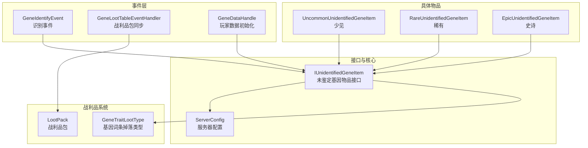
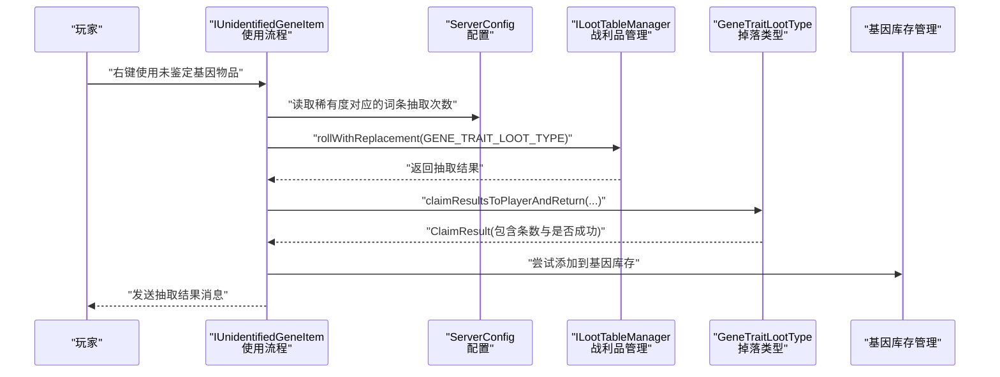
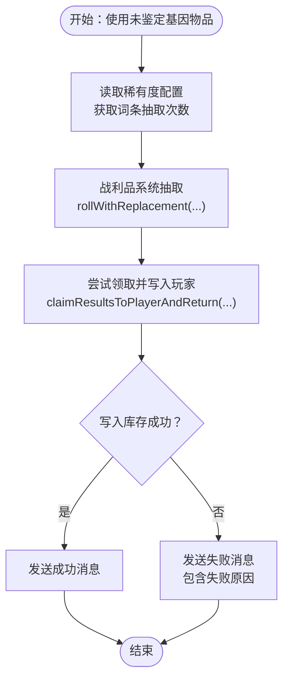
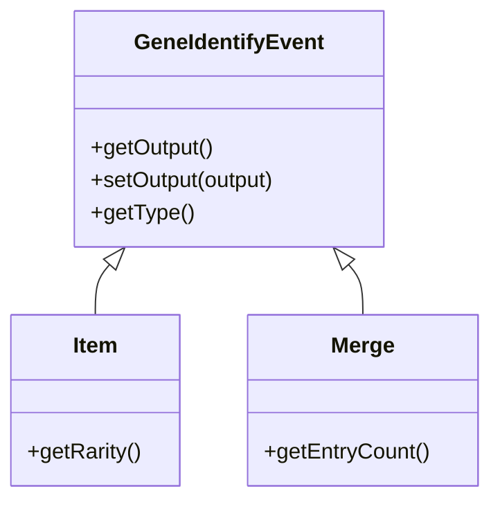
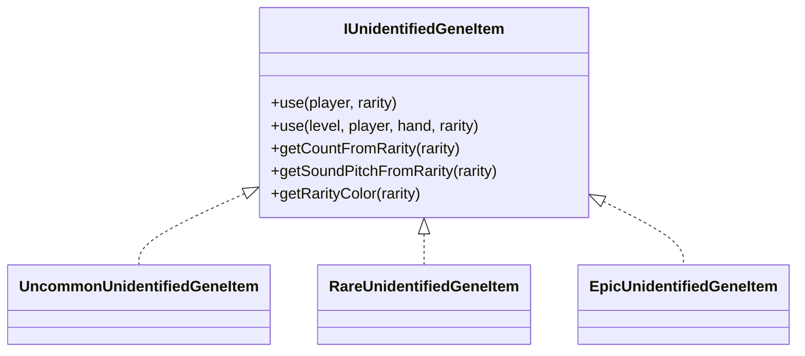
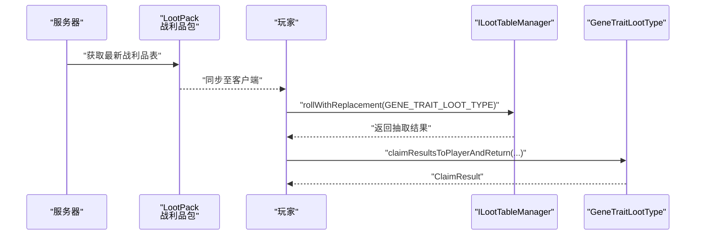
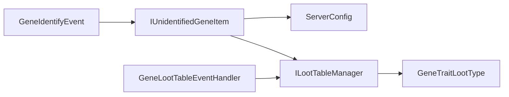

# 未鉴定基因系统

<cite>
**本文引用的文件**
- [Biotech\src\main\java\org\biotech\api\event\custom\GeneIdentifyEvent.java](file://Biotech/src/main/java/org/biotech/api/event/custom/GeneIdentifyEvent.java)
- [Biotech\src\main\java\org\biotech\api\system\gene\core\IUnidentifiedGeneItem.java](file://Biotech/src/main/java/org/biotech/api/system/gene/core/IUnidentifiedGeneItem.java)
- [Biotech\src\main\java\org\biotech\item\UncommonUnidentifiedGeneItem.java](file://Biotech/src/main/java/org/biotech/item/UncommonUnidentifiedGeneItem.java)
- [Biotech\src\main\java\org\biotech\item\RareUnidentifiedGeneItem.java](file://Biotech/src/main/java/org/biotech/item/RareUnidentifiedGeneItem.java)
- [Biotech\src\main\java\org\biotech\item\EpicUnidentifiedGeneItem.java](file://Biotech/src/main/java/org/biotech/item/EpicUnidentifiedGeneItem.java)
- [Biotech\src\main\java\org\biotech\api\config\ServerConfig.java](file://Biotech/src/main/java/org/biotech/api/config/ServerConfig.java)
- [Biotech\src\main\java\org\biotech\api\event\handle\GeneLootTableEventHandler.java](file://Biotech/src/main/java/org/biotech/api/event/handle/GeneLootTableEventHandler.java)
- [Biotech\src\main\java\org\biotech\api\event\handle\GeneDataHandle.java](file://Biotech/src/main/java/org/biotech/api/event/handle/GeneDataHandle.java)
- [Biotech\src\main\java\org\biotech\api\system\gene\core\GeneRarity.java](file://Biotech/src/main/java/org/biotech/api/system/gene/core/GeneRarity.java)
- [Biotech\src\main\java\org\biotech\api\system\gene\GeneInstance.java](file://Biotech/src/main/java/org/biotech/api/system/gene/GeneInstance.java)
- [Biotech\src\main\java\org\biotech\api\system\gene\GeneContext.java](file://Biotech/src/main/java/org/biotech/api/system/gene/GeneContext.java)
</cite>

## 目录
1. [引言](#引言)
2. [项目结构](#项目结构)
3. [核心组件](#核心组件)
4. [架构总览](#架构总览)
5. [详细组件分析](#详细组件分析)
6. [依赖分析](#依赖分析)
7. [性能考虑](#性能考虑)
8. [故障排除指南](#故障排除指南)
9. [结论](#结论)
10. [附录](#附录)

## 引言
本技术文档围绕“未鉴定基因系统”展开，系统目标是为玩家提供基于稀有度分级的基因核心抽取体验，并通过事件机制与战利品系统集成，实现可配置的识别结果与掉落率控制。文档将从设计原理、稀有度分级机制、识别事件工作流、与战利品系统的集成、用户体验优化与平衡性策略等方面进行深入说明。

## 项目结构
未鉴定基因系统主要位于 Biotech 模块中，采用按功能域划分的组织方式：
- 事件层：自定义事件与事件处理器，负责识别流程的触发与同步。
- 接口与核心逻辑：定义未鉴定基因物品的行为契约与通用流程。
- 具体物品实现：按稀有度提供不同行为特征的未鉴定基因物品。
- 配置层：服务器配置用于控制抽取词条数等参数。
- 战利品层：战利品包同步与抽取逻辑，支撑识别结果的随机性与概率计算。

图表来源
- [Biotech\src\main\java\org\biotech\api\event\custom\GeneIdentifyEvent.java:1-108](file://Biotech/src/main/java/org/biotech/api/event/custom/GeneIdentifyEvent.java#L1-L108)
- [Biotech\src\main\java\org\biotech\api\system\gene\core\IUnidentifiedGeneItem.java:1-138](file://Biotech/src/main/java/org/biotech/api/system/gene/core/IUnidentifiedGeneItem.java#L1-L138)
- [Biotech\src\main\java\org\biotech\api\config\ServerConfig.java:1-49](file://Biotech/src/main/java/org/biotech/api/config/ServerConfig.java#L1-L49)
- [Biotech\src\main\java\org\biotech\api\event\handle\GeneLootTableEventHandler.java:1-34](file://Biotech/src/main/java/org/biotech/api/event/handle/GeneLootTableEventHandler.java#L1-L34)
- [Biotech\src\main\java\org\biotech\api\event\handle\GeneDataHandle.java:1-40](file://Biotech/src/main/java/org/biotech/api/event/handle/GeneDataHandle.java#L1-L40)
- [Biotech\src\main\java\org\biotech\item\UncommonUnidentifiedGeneItem.java:1-31](file://Biotech/src/main/java/org/biotech/item/UncommonUnidentifiedGeneItem.java#L1-L31)
- [Biotech\src\main\java\org\biotech\item\RareUnidentifiedGeneItem.java:1-32](file://Biotech/src/main/java/org/biotech/item/RareUnidentifiedGeneItem.java#L1-L32)
- [Biotech\src\main\java\org\biotech\item\EpicUnidentifiedGeneItem.java:1-31](file://Biotech/src/main/java/org/biotech/item/EpicUnidentifiedGeneItem.java#L1-L31)

章节来源
- [Biotech\src\main\java\org\biotech\api\event\custom\GeneIdentifyEvent.java:1-108](file://Biotech/src/main/java/org/biotech/api/event/custom/GeneIdentifyEvent.java#L1-L108)
- [Biotech\src\main\java\org\biotech\api\system\gene\core\IUnidentifiedGeneItem.java:1-138](file://Biotech/src/main/java/org/biotech/api/system/gene/core/IUnidentifiedGeneItem.java#L1-L138)
- [Biotech\src\main\java\org\biotech\api\config\ServerConfig.java:1-49](file://Biotech/src/main/java/org/biotech/api/config/ServerConfig.java#L1-L49)
- [Biotech\src\main\java\org\biotech\api\event\handle\GeneLootTableEventHandler.java:1-34](file://Biotech/src/main/java/org/biotech/api/event/handle/GeneLootTableEventHandler.java#L1-L34)
- [Biotech\src\main\java\org\biotech\api\event\handle\GeneDataHandle.java:1-40](file://Biotech/src/main/java/org/biotech/api/event/handle/GeneDataHandle.java#L1-L40)
- [Biotech\src\main\java\org\biotech\item\UncommonUnidentifiedGeneItem.java:1-31](file://Biotech/src/main/java/org/biotech/item/UncommonUnidentifiedGeneItem.java#L1-L31)
- [Biotech\src\main\java\org\biotech\item\RareUnidentifiedGeneItem.java:1-32](file://Biotech/src/main/java/org/biotech/item/RareUnidentifiedGeneItem.java#L1-L32)
- [Biotech\src\main\java\org\biotech\item\EpicUnidentifiedGeneItem.java:1-31](file://Biotech/src/main/java/org/biotech/item/EpicUnidentifiedGeneItem.java#L1-L31)

## 核心组件
- 识别事件：定义两种识别类型（物品识别与合并识别），提供监听器修改输出的能力。
- 未鉴定基因物品接口：统一处理使用流程、音效与提示消息；根据稀有度决定抽取词条数。
- 具体未鉴定基因物品：少见、稀有、史诗三种稀有度，分别对应不同的词条抽取概率与外观。
- 服务器配置：提供可调的词条抽取基数，支持平衡性微调。
- 战利品系统：通过数据包同步与掉落类型，实现识别结果的随机性与概率控制。

章节来源
- [Biotech\src\main\java\org\biotech\api\event\custom\GeneIdentifyEvent.java:1-108](file://Biotech/src/main/java/org/biotech/api/event/custom/GeneIdentifyEvent.java#L1-L108)
- [Biotech\src\main\java\org\biotech\api\system\gene\core\IUnidentifiedGeneItem.java:1-138](file://Biotech/src/main/java/org/biotech/api/system/gene/core/IUnidentifiedGeneItem.java#L1-L138)
- [Biotech\src\main\java\org\biotech\item\UncommonUnidentifiedGeneItem.java:1-31](file://Biotech/src/main/java/org/biotech/item/UncommonUnidentifiedGeneItem.java#L1-L31)
- [Biotech\src\main\java\org\biotech\item\RareUnidentifiedGeneItem.java:1-32](file://Biotech/src/main/java/org/biotech/item/RareUnidentifiedGeneItem.java#L1-L32)
- [Biotech\src\main\java\org\biotech\item\EpicUnidentifiedGeneItem.java:1-31](file://Biotech/src/main/java/org/biotech/item/EpicUnidentifiedGeneItem.java#L1-L31)
- [Biotech\src\main\java\org\biotech\api\config\ServerConfig.java:1-49](file://Biotech/src/main/java/org/biotech/api/config/ServerConfig.java#L1-L49)

## 架构总览
未鉴定基因系统的交互流程如下：
- 玩家右键使用未鉴定基因物品时，触发统一的使用流程。
- 系统根据物品稀有度设置词条抽取次数，并通过战利品系统进行抽取。
- 抽取结果通过消息反馈给玩家，并尝试写入玩家的基因库存。
- 识别事件可用于在抽取前后进行监听与修改。

图表来源
- [Biotech\src\main\java\org\biotech\api\system\gene\core\IUnidentifiedGeneItem.java:26-94](file://Biotech/src/main/java/org/biotech/api/system/gene/core/IUnidentifiedGeneItem.java#L26-L94)
- [Biotech\src\main\java\org\biotech\api\config\ServerConfig.java:37-47](file://Biotech/src/main/java/org/biotech/api/config/ServerConfig.java#L37-L47)
- [Biotech\src\main\java\org\biotech\api\event\handle\GeneLootTableEventHandler.java:18-32](file://Biotech/src/main/java/org/biotech/api/event/handle/GeneLootTableEventHandler.java#L18-L32)

## 详细组件分析

### 稀有度分级与识别机制
- 稀有度分级：系统以少见（UNCOMMON）、稀有（RARE）、史诗（EPIC）三档为基础，分别对应不同的词条抽取次数与外观。
- 识别触发：玩家右键使用未鉴定基因物品时，进入统一使用流程。
- 词条抽取：根据稀有度读取配置中的抽取次数，通过战利品系统进行带替换的抽取。
- 结果反馈：根据抽取结果向玩家发送成功或失败的消息；失败原因包含库存满、空物品、无空间、类型无效等。

图表来源
- [Biotech\src\main\java\org\biotech\api\system\gene\core\IUnidentifiedGeneItem.java:26-94](file://Biotech/src/main/java/org/biotech/api/system/gene/core/IUnidentifiedGeneItem.java#L26-L94)
- [Biotech\src\main\java\org\biotech\api\config\ServerConfig.java:37-47](file://Biotech/src/main/java/org/biotech/api/config/ServerConfig.java#L37-L47)

章节来源
- [Biotech\src\main\java\org\biotech\api\system\gene\core\IUnidentifiedGeneItem.java:26-94](file://Biotech/src/main/java/org/biotech/api/system/gene/core/IUnidentifiedGeneItem.java#L26-L94)
- [Biotech\src\main\java\org\biotech\api\config\ServerConfig.java:1-49](file://Biotech/src/main/java/org/biotech/api/config/ServerConfig.java#L1-L49)

### 识别事件系统
- 事件类型：提供物品识别（输入稀有度）与合并识别（输入词条数量）两类事件。
- 不可取消性：识别事件不可取消，但监听器可修改输出结果。
- 监听与扩展：可通过事件总线订阅识别事件，在抽取前后进行自定义处理（如修改输出、记录日志、触发其他效果）。

图表来源
- [Biotech\src\main\java\org\biotech\api\event\custom\GeneIdentifyEvent.java:16-106](file://Biotech/src/main/java/org/biotech/api/event/custom/GeneIdentifyEvent.java#L16-L106)

章节来源
- [Biotech\src\main\java\org\biotech\api\event\custom\GeneIdentifyEvent.java:1-108](file://Biotech/src/main/java/org/biotech/api/event/custom/GeneIdentifyEvent.java#L1-L108)

### 具体未鉴定基因物品
- 未鉴定基因物品接口：统一实现使用流程、音效与提示消息；根据稀有度决定词条抽取次数。
- 三种稀有度物品：
  - 少见：极小概率出双词条。
  - 稀有：更高概率出双词条。
  - 史诗：必定出双词条。
- 使用流程：右键触发后，减少物品数量、播放音效、执行抽取与结果反馈。

图表来源
- [Biotech\src\main\java\org\biotech\api\system\gene\core\IUnidentifiedGeneItem.java:23-138](file://Biotech/src/main/java/org/biotech/api/system/gene/core/IUnidentifiedGeneItem.java#L23-L138)
- [Biotech\src\main\java\org\biotech\item\UncommonUnidentifiedGeneItem.java:15-30](file://Biotech/src/main/java/org/biotech/item/UncommonUnidentifiedGeneItem.java#L15-L30)
- [Biotech\src\main\java\org\biotech\item\RareUnidentifiedGeneItem.java:15-31](file://Biotech/src/main/java/org/biotech/item/RareUnidentifiedGeneItem.java#L15-L31)
- [Biotech\src\main\java\org\biotech\item\EpicUnidentifiedGeneItem.java:15-30](file://Biotech/src/main/java/org/biotech/item/EpicUnidentifiedGeneItem.java#L15-L30)

章节来源
- [Biotech\src\main\java\org\biotech\api\system\gene\core\IUnidentifiedGeneItem.java:1-138](file://Biotech/src/main/java/org/biotech/api/system/gene/core/IUnidentifiedGeneItem.java#L1-L138)
- [Biotech\src\main\java\org\biotech\item\UncommonUnidentifiedGeneItem.java:1-31](file://Biotech/src/main/java/org/biotech/item/UncommonUnidentifiedGeneItem.java#L1-L31)
- [Biotech\src\main\java\org\biotech\item\RareUnidentifiedGeneItem.java:1-32](file://Biotech/src/main/java/org/biotech/item/RareUnidentifiedGeneItem.java#L1-L32)
- [Biotech\src\main\java\org\biotech\item\EpicUnidentifiedGeneItem.java:1-31](file://Biotech/src/main/java/org/biotech/item/EpicUnidentifiedGeneItem.java#L1-L31)

### 与战利品系统的集成
- 数据包同步：在玩家登录或数据包重载时，将最新的战利品表同步至客户端。
- 抽取流程：使用未鉴定基因物品时，通过战利品管理器进行抽取，并尝试将结果写入玩家。
- 掉落类型：基因词条掉落类型负责将抽取结果与玩家绑定，返回条数与是否成功。

图表来源
- [Biotech\src\main\java\org\biotech\api\event\handle\GeneLootTableEventHandler.java:18-32](file://Biotech/src/main/java/org/biotech/api/event/handle/GeneLootTableEventHandler.java#L18-L32)
- [Biotech\src\main\java\org\biotech\api\system\gene\core\IUnidentifiedGeneItem.java:38-44](file://Biotech/src/main/java/org/biotech/api/system/gene/core/IUnidentifiedGeneItem.java#L38-L44)

章节来源
- [Biotech\src\main\java\org\biotech\api\event\handle\GeneLootTableEventHandler.java:1-34](file://Biotech/src/main/java/org/biotech/api/event/handle/GeneLootTableEventHandler.java#L1-L34)
- [Biotech\src\main\java\org\biotech\api\system\gene\core\IUnidentifiedGeneItem.java:1-138](file://Biotech/src/main/java/org/biotech/api/system/gene/core/IUnidentifiedGeneItem.java#L1-L138)

### 添加新的未鉴定基因类型与自定义识别结果
- 新增物品类型：参考现有少见/稀有/史诗未鉴定基因物品，实现新的稀有度等级，并在使用流程中继承统一的抽取逻辑。
- 自定义识别结果：通过识别事件监听器，在事件发生时修改输出结果，实现自定义的识别行为（例如强制指定某些词条、附加特殊效果等）。
- 配置扩展：在服务器配置中新增相关参数，控制新类型的抽取次数或其他属性。

章节来源
- [Biotech\src\main\java\org\biotech\api\event\custom\GeneIdentifyEvent.java:1-108](file://Biotech/src/main/java/org/biotech/api/event/custom/GeneIdentifyEvent.java#L1-L108)
- [Biotech\src\main\java\org\biotech\api\system\gene\core\IUnidentifiedGeneItem.java:1-138](file://Biotech/src/main/java/org/biotech/api/system/gene/core/IUnidentifiedGeneItem.java#L1-L138)
- [Biotech\src\main\java\org\biotech\api\config\ServerConfig.java:1-49](file://Biotech/src/main/java/org/biotech/api/config/ServerConfig.java#L1-L49)

## 依赖分析
- 组件耦合：
  - 未鉴定基因物品接口与服务器配置存在直接依赖，用于读取抽取次数。
  - 使用流程依赖战利品管理器与掉落类型，完成抽取与写入。
  - 识别事件为松耦合扩展点，监听器可自由修改输出。
- 外部依赖：
  - 事件总线用于注册事件监听器与处理器。
  - 数据包同步机制确保客户端与服务端战利品表一致。

图表来源
- [Biotech\src\main\java\org\biotech\api\system\gene\core\IUnidentifiedGeneItem.java:32-44](file://Biotech/src/main/java/org/biotech/api/system/gene/core/IUnidentifiedGeneItem.java#L32-L44)
- [Biotech\src\main\java\org\biotech\api\config\ServerConfig.java:37-47](file://Biotech/src/main/java/org/biotech/api/config/ServerConfig.java#L37-L47)
- [Biotech\src\main\java\org\biotech\api\event\custom\GeneIdentifyEvent.java:16-37](file://Biotech/src/main/java/org/biotech/api/event/custom/GeneIdentifyEvent.java#L16-L37)
- [Biotech\src\main\java\org\biotech\api\event\handle\GeneLootTableEventHandler.java:18-25](file://Biotech/src/main/java/org/biotech/api/event/handle/GeneLootTableEventHandler.java#L18-L25)

章节来源
- [Biotech\src\main\java\org\biotech\api\system\gene\core\IUnidentifiedGeneItem.java:1-138](file://Biotech/src/main/java/org/biotech/api/system/gene/core/IUnidentifiedGeneItem.java#L1-L138)
- [Biotech\src\main\java\org\biotech\api\config\ServerConfig.java:1-49](file://Biotech/src/main/java/org/biotech/api/config/ServerConfig.java#L1-L49)
- [Biotech\src\main\java\org\biotech\api\event\custom\GeneIdentifyEvent.java:1-108](file://Biotech/src/main/java/org/biotech/api/event/custom/GeneIdentifyEvent.java#L1-L108)
- [Biotech\src\main\java\org\biotech\api\event\handle\GeneLootTableEventHandler.java:1-34](file://Biotech/src/main/java/org/biotech/api/event/handle/GeneLootTableEventHandler.java#L1-L34)

## 性能考虑
- 抽取次数控制：通过服务器配置限制每次使用的抽取次数，避免高频抽取导致的性能压力。
- 客户端同步：仅在必要时机（登录、数据包重载）同步战利品表，减少网络开销。
- 音效与消息：使用统一的音效与消息格式，降低额外渲染与文本处理成本。

## 故障排除指南
- 抽取失败：
  - 库存已满：检查玩家基因库存容量与当前占用情况。
  - 无可用空间：确认是否存在空槽位或类型不匹配。
  - 类型无效：核对掉落类型与期望的基因词条类型是否一致。
- 配置问题：
  - 抽取次数异常：检查服务器配置中对应稀有度的抽取次数设置。
- 事件冲突：
  - 若识别事件被多个监听器修改输出，请确保修改顺序与逻辑正确，避免互相覆盖。

章节来源
- [Biotech\src\main\java\org\biotech\api\system\gene\core\IUnidentifiedGeneItem.java:128-136](file://Biotech/src/main/java/org/biotech/api/system/gene/core/IUnidentifiedGeneItem.java#L128-L136)
- [Biotech\src\main\java\org\biotech\api\config\ServerConfig.java:1-49](file://Biotech/src/main/java/org/biotech/api/config/ServerConfig.java#L1-L49)

## 结论
未鉴定基因系统通过清晰的稀有度分级、统一的使用流程与事件扩展点，实现了可配置、可扩展且易于平衡的识别体验。结合战利品系统的数据包同步与掉落类型，系统在保证随机性的同时提供了可控的概率与反馈机制。通过服务器配置与事件监听器，开发者可以灵活地添加新的未鉴定基因类型与自定义识别结果，满足多样化的玩法需求。

## 附录
- 相关上下文类：
  - 基因实例与上下文：用于承载基因状态与运行时信息。
  - 基因稀有度：定义稀有度枚举与相关常量。

章节来源
- [Biotech\src\main\java\org\biotech\api\system\gene\GeneInstance.java](file://Biotech/src/main/java/org/biotech/api/system/gene/GeneInstance.java)
- [Biotech\src\main\java\org\biotech\api\system\gene\GeneContext.java](file://Biotech/src/main/java/org/biotech/api/system/gene/GeneContext.java)
- [Biotech\src\main\java\org\biotech\api\system\gene\core\GeneRarity.java](file://Biotech/src/main/java/org/biotech/api/system/gene/core/GeneRarity.java)