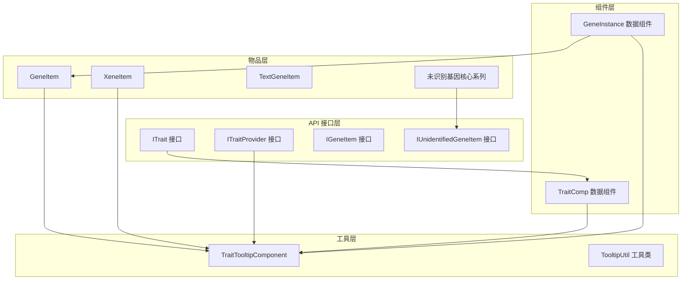
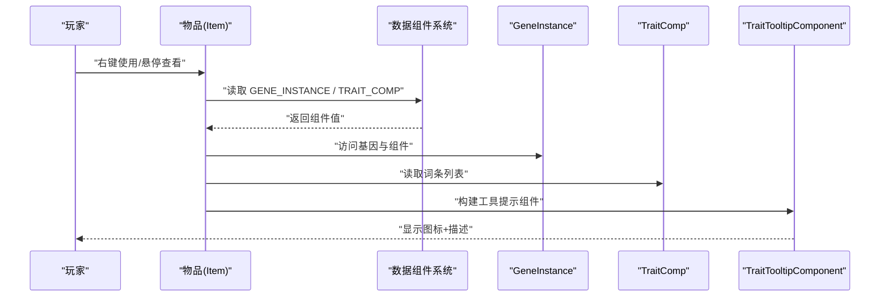
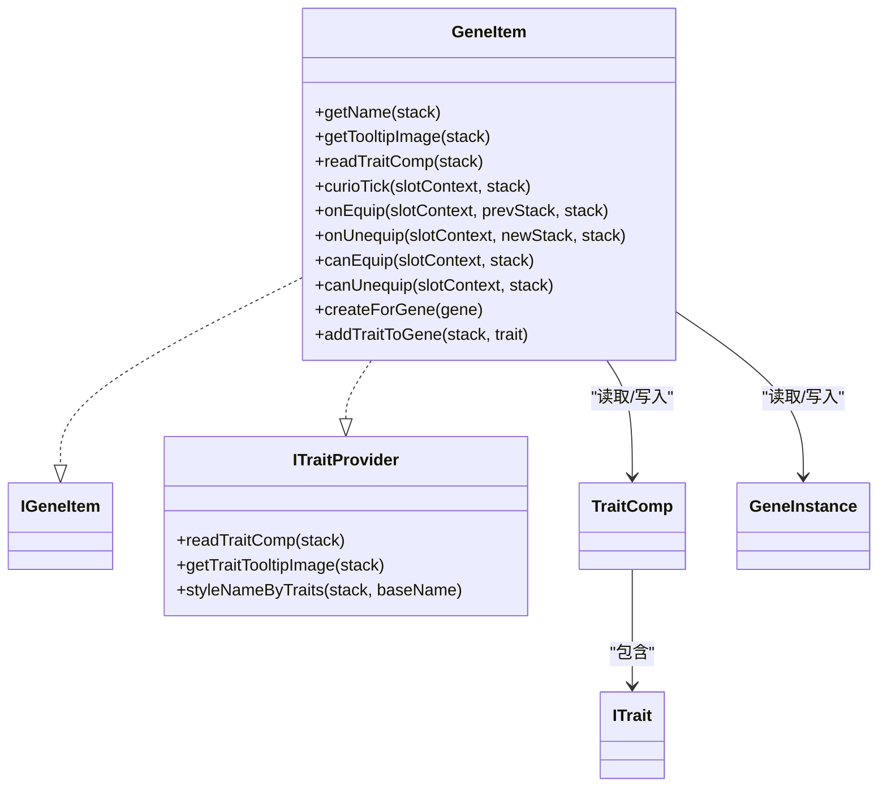
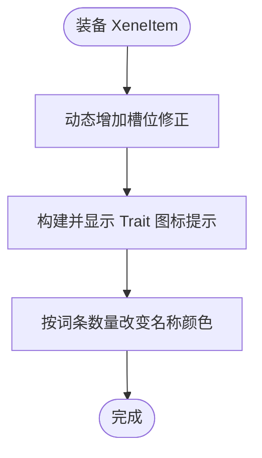
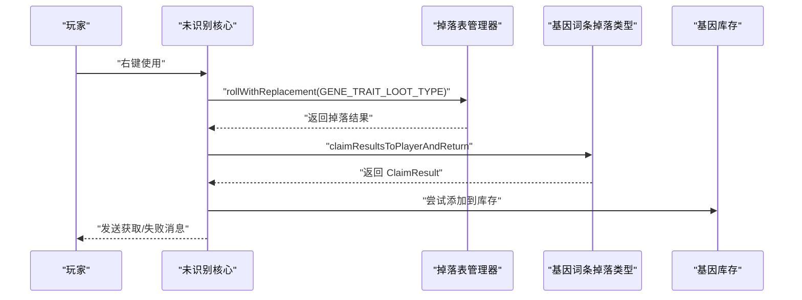
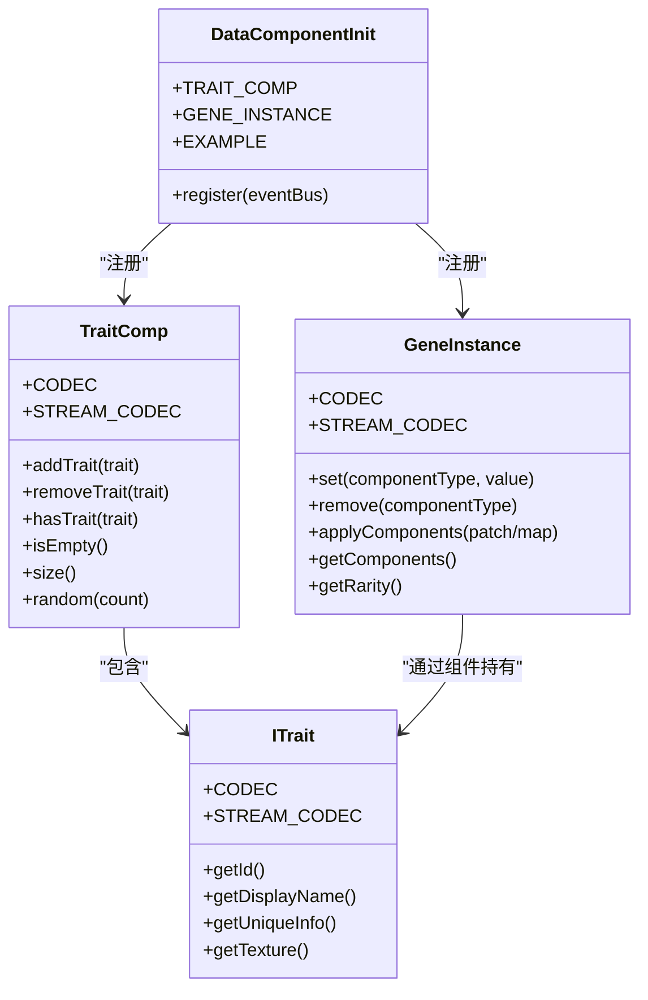
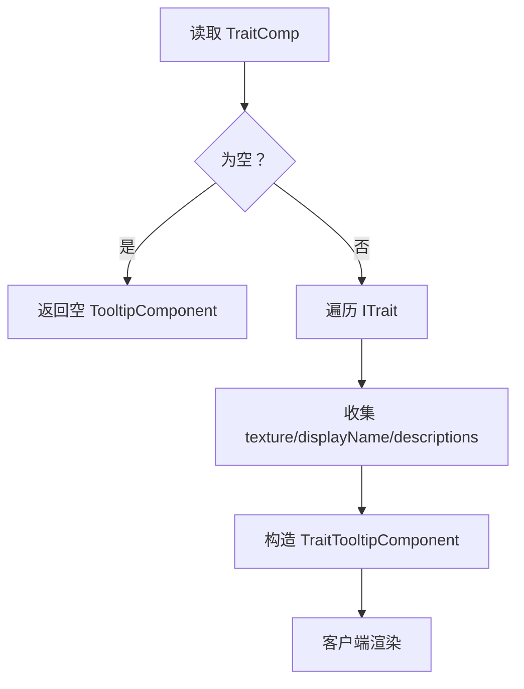
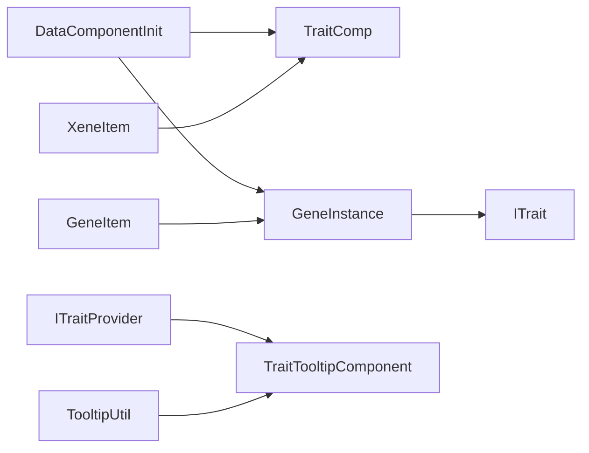

# 物品系统设计

<cite>
**本文引用的文件**
- [TraitComp.java](file://Biotech/src/main/java/org/biotech/component/TraitComp.java)
- [GeneItem.java](file://Biotech/src/main/java/org/biotech/item/GeneItem.java)
- [XeneItem.java](file://Biotech/src/main/java/org/biotech/item/XeneItem.java)
- [TextGeneItem.java](file://Biotech/src/main/java/org/biotech/item/TextGeneItem.java)
- [EpicUnidentifiedGeneItem.java](file://Biotech/src/main/java/org/biotech/item/EpicUnidentifiedGeneItem.java)
- [RareUnidentifiedGeneItem.java](file://Biotech/src/main/java/org/biotech/item/RareUnidentifiedGeneItem.java)
- [UncommonUnidentifiedGeneItem.java](file://Biotech/src/main/java/org/biotech/item/UncommonUnidentifiedGeneItem.java)
- [IGeneItem.java](file://Biotech/src/main/java/org/biotech/api/system/gene/core/IGeneItem.java)
- [ITraitProvider.java](file://Biotech/src/main/java/org/biotech/api/system/trait/core/ITraitProvider.java)
- [DataComponentInit.java](file://Biotech/src/main/java/org/biotech/api/init/DataComponentInit.java)
- [GeneInstance.java](file://Biotech/src/main/java/org/biotech/api/system/gene/GeneInstance.java)
- [TraitTooltipComponent.java](file://Biotech/src/main/java/org/biotech/api/tooltip/TraitTooltipComponent.java)
- [TooltipUtil.java](file://Biotech/src/main/java/org/biotech/api/util/TooltipUtil.java)
- [IUnidentifiedGeneItem.java](file://Biotech/src/main/java/org/biotech/api/system/gene/core/IUnidentifiedGeneItem.java)
- [ITrait.java](file://Biotech/src/main/java/org/biotech/api/system/trait/core/ITrait.java)
</cite>

## 目录
1. [引言](#引言)
2. [项目结构](#项目结构)
3. [核心组件](#核心组件)
4. [架构总览](#架构总览)
5. [详细组件分析](#详细组件分析)
6. [依赖分析](#依赖分析)
7. [性能考虑](#性能考虑)
8. [故障排查指南](#故障排查指南)
9. [结论](#结论)
10. [附录](#附录)

## 引言
本文件面向“基因物品系统”的技术文档，聚焦于基因相关物品的设计理念与实现细节，涵盖以下主题：
- 基因物品、异种物品、文本基因物品等不同类型的物品特性与差异
- 数据组件系统（TraitComp）的作用与使用方法，以及如何通过数据组件存储与传递基因相关信息
- 注册机制、材质贴图系统与工具提示组件的实现
- 如何创建新的基因物品类型、自定义物品属性与行为
- 平衡性设计原则与用户体验优化策略

## 项目结构
本系统围绕“生物技术模块（Biotech）”组织，核心位于 org.biotech.* 包下，主要分为以下层次：
- api：对外接口与通用能力（如 ITrait、ITraitProvider、IGeneItem、IUnidentifiedGeneItem）
- component：数据组件（TraitComp、GeneInstance 等）
- item：各类物品实现（GeneItem、XeneItem、TextGeneItem、未识别基因核心等）
- tooltip：工具提示组件（TraitTooltipComponent）
- util：工具类（TooltipUtil）
- init：注册入口（DataComponentInit、TraitInit 等）

图表来源
- [IGeneItem.java:1-8](file://Biotech/src/main/java/org/biotech/api/system/gene/core/IGeneItem.java#L1-L8)
- [ITraitProvider.java:1-75](file://Biotech/src/main/java/org/biotech/api/system/trait/core/ITraitProvider.java#L1-L75)
- [TraitComp.java:1-102](file://Biotech/src/main/java/org/biotech/component/TraitComp.java#L1-L102)
- [GeneItem.java:1-209](file://Biotech/src/main/java/org/biotech/item/GeneItem.java#L1-L209)
- [XeneItem.java:1-83](file://Biotech/src/main/java/org/biotech/item/XeneItem.java#L1-L83)
- [TextGeneItem.java:1-38](file://Biotech/src/main/java/org/biotech/item/TextGeneItem.java#L1-L38)
- [IUnidentifiedGeneItem.java:1-138](file://Biotech/src/main/java/org/biotech/api/system/gene/core/IUnidentifiedGeneItem.java#L1-L138)
- [TraitTooltipComponent.java:1-62](file://Biotech/src/main/java/org/biotech/api/tooltip/TraitTooltipComponent.java#L1-L62)
- [TooltipUtil.java:1-106](file://Biotech/src/main/java/org/biotech/api/util/TooltipUtil.java#L1-L106)

章节来源
- [DataComponentInit.java:1-47](file://Biotech/src/main/java/org/biotech/api/init/DataComponentInit.java#L1-L47)

## 核心组件
本节对系统中的关键组件进行深入剖析，重点说明其职责、数据结构、序列化与网络编解码、以及与其他组件的关系。

- TraitComp（多词条组件）
  - 职责：在单个物品上承载多个 ITrait，支持添加、移除、判空、计数与随机填充
  - 数据结构：List<ITrait>，提供 of/fromList/empty/random 等工厂方法
  - 序列化：CODEC 使用 RecordCodecBuilder，STREAM_CODEC 使用 ByteBufCodecs 与 composite 编排
  - 关键点：hasTrait 与 addTrait 会过滤空值与 EMPTY_TRAIT_ID，避免重复与无效词条

- GeneInstance（基因实例）
  - 职责：封装 IGene 与其数据组件集合，作为物品的核心数据载体
  - 数据结构：持有 IGene、count、PatchedDataComponentMap（components），并实现 MutableDataComponentHolder
  - 序列化：CODEC 支持 gene 为 null 的 EMPTY 常量映射；STREAM_CODEC 提供网络编解码
  - 关键点：getRarity 通过 DataComponents.RARITY 映射到 GeneRarity

- ITrait（词条接口）
  - 职责：定义词条的唯一 ID、显示名、描述、贴图、数值、修饰符 ID 生成等
  - 序列化：通过 ResourceLocation 与 TraitInit 进行双向映射，支持 CODEC 与 STREAM_CODEC
  - 关键点：提供 EMPTY_TRAIT_ID 用于空词条占位与网络传输安全

- ITraitProvider（词条提供器）
  - 职责：为物品提供读取 TraitComp 的能力，并统一处理工具提示渲染与名称样式
  - 关键点：默认实现提供 getTraitTooltipImage、styleNameByTraits 等便捷方法

- TraitTooltipComponent（工具提示组件）
  - 职责：将 TraitComp 转换为客户端可用的 TooltipComponent，包含纹理、名称与描述列表
  - 关键点：fromTraitComp 遍历 ITrait，收集 texture、displayName、descriptions

- TooltipUtil（工具提示工具类）
  - 职责：构建传统文本式工具提示、屏蔽 Curios 默认槽位提示、生成 TraitTooltipComponent
  - 关键点：suppressCuriosSlotTypeTooltip 返回空列表以避免冗余提示

章节来源
- [TraitComp.java:1-102](file://Biotech/src/main/java/org/biotech/component/TraitComp.java#L1-L102)
- [GeneInstance.java:1-119](file://Biotech/src/main/java/org/biotech/api/system/gene/GeneInstance.java#L1-L119)
- [ITrait.java:1-108](file://Biotech/src/main/java/org/biotech/api/system/trait/core/ITrait.java#L1-L108)
- [ITraitProvider.java:1-75](file://Biotech/src/main/java/org/biotech/api/system/trait/core/ITraitProvider.java#L1-L75)
- [TraitTooltipComponent.java:1-62](file://Biotech/src/main/java/org/biotech/api/tooltip/TraitTooltipComponent.java#L1-L62)
- [TooltipUtil.java:1-106](file://Biotech/src/main/java/org/biotech/api/util/TooltipUtil.java#L1-L106)

## 架构总览
下图展示了物品系统在运行时的数据流与交互关系：物品通过 DataComponentInit 注册的数据组件承载 GeneInstance 与 TraitComp；ITraitProvider 在物品层统一读取 TraitComp 并渲染工具提示；ITrait 定义词条元数据并通过 TraitTooltipComponent 传递给客户端。

图表来源
- [GeneItem.java:64-71](file://Biotech/src/main/java/org/biotech/item/GeneItem.java#L64-L71)
- [XeneItem.java:45-52](file://Biotech/src/main/java/org/biotech/item/XeneItem.java#L45-L52)
- [ITraitProvider.java:43-45](file://Biotech/src/main/java/org/biotech/api/system/trait/core/ITraitProvider.java#L43-L45)
- [TraitTooltipComponent.java:25-52](file://Biotech/src/main/java/org/biotech/api/tooltip/TraitTooltipComponent.java#L25-L52)

## 详细组件分析

### 基因物品（GeneItem）
- 设计理念
  - 作为局内“已解析基因”，可装备到饰品栏，具备生命周期事件（onEquip/onUnequip/curioTick）
  - 名称根据基因或词条动态样式化，工具提示仅通过图标组件呈现
- 关键实现
  - 构造时设置 GENE_INSTANCE 默认值与最大堆叠为 1
  - getName 根据 EmptyGene 或 ITrait 列表决定显示名与颜色
  - getTooltipImage 返回 TraitTooltipComponent，appendHoverText 留空以避免重复
  - readTraitComp 从 GENE_INSTANCE 的组件中读取 TraitComp
  - addTraitToGene 静态方法演示如何向 GeneItem 添加词条并回写组件
- 适用场景
  - 玩家拥有明确基因后，将其封装为可穿戴物品，便于展示与生效

图表来源
- [GeneItem.java:31-209](file://Biotech/src/main/java/org/biotech/item/GeneItem.java#L31-L209)
- [IGeneItem.java:1-8](file://Biotech/src/main/java/org/biotech/api/system/gene/core/IGeneItem.java#L1-L8)
- [ITraitProvider.java:19-75](file://Biotech/src/main/java/org/biotech/api/system/trait/core/ITraitProvider.java#L19-L75)
- [TraitComp.java:18-102](file://Biotech/src/main/java/org/biotech/component/TraitComp.java#L18-L102)
- [GeneInstance.java:19-119](file://Biotech/src/main/java/org/biotech/api/system/gene/GeneInstance.java#L19-L119)
- [ITrait.java:18-108](file://Biotech/src/main/java/org/biotech/api/system/trait/core/ITrait.java#L18-L108)

章节来源
- [GeneItem.java:1-209](file://Biotech/src/main/java/org/biotech/item/GeneItem.java#L1-L209)

### 异种物品（XeneItem）
- 设计理念
  - 作为“异种核心”，通过 Curios 动态增加槽位，强调与饰品系统的耦合
  - 名称与工具提示同样基于词条样式化与图标组件
- 关键实现
  - getAttributeModifiers 在装备时动态添加槽位修正
  - readTraitComp 直接从物品栈读取 TRAIT_COMP
  - canUnequip 固定返回 true，避免误操作导致卡槽
- 适用场景
  - 扩展角色的饰品槽位，同时提供词条效果与视觉反馈

图表来源
- [XeneItem.java:35-82](file://Biotech/src/main/java/org/biotech/item/XeneItem.java#L35-L82)
- [ITraitProvider.java:66-72](file://Biotech/src/main/java/org/biotech/api/system/trait/core/ITraitProvider.java#L66-L72)

章节来源
- [XeneItem.java:1-83](file://Biotech/src/main/java/org/biotech/item/XeneItem.java#L1-L83)

### 文本基因物品（TextGeneItem）
- 设计理念
  - 作为“打开基因界面”的快捷入口，右键即触发 UI
  - 示例性地携带自定义数据组件（Example），演示数据组件扩展
- 关键实现
  - use 方法在服务端打开基因界面
  - 构造时设置稀有度与自定义数据组件
- 适用场景
  - 作为 UI 入口，引导玩家进入基因管理界面

章节来源
- [TextGeneItem.java:1-38](file://Biotech/src/main/java/org/biotech/item/TextGeneItem.java#L1-L38)

### 未识别基因核心（系列）
- 设计理念
  - 作为“抽词条”的消耗品，依据稀有度决定抽取词条数量
  - 统一使用 IUnidentifiedGeneItem 的 use 流程，播放音效并消耗物品
- 类型差异
  - Uncommon（少见）：极低概率出双词条
  - Rare（稀有）：较高概率出双词条
  - Epic（史诗）：必定出双词条
- 关键实现
  - use 方法在服务端根据稀有度设置抽取次数，滚动掉落并提示结果
  - use(...) 重载负责播放音效与消耗物品
- 适用场景
  - 玩家通过消耗未识别核心，随机获得基因词条，提升可玩性与策略性

图表来源
- [IUnidentifiedGeneItem.java:30-94](file://Biotech/src/main/java/org/biotech/api/system/gene/core/IUnidentifiedGeneItem.java#L30-L94)

章节来源
- [UncommonUnidentifiedGeneItem.java:1-31](file://Biotech/src/main/java/org/biotech/item/UncommonUnidentifiedGeneItem.java#L1-L31)
- [RareUnidentifiedGeneItem.java:1-32](file://Biotech/src/main/java/org/biotech/item/RareUnidentifiedGeneItem.java#L1-L32)
- [EpicUnidentifiedGeneItem.java:1-31](file://Biotech/src/main/java/org/biotech/item/EpicUnidentifiedGeneItem.java#L1-L31)
- [IUnidentifiedGeneItem.java:1-138](file://Biotech/src/main/java/org/biotech/api/system/gene/core/IUnidentifiedGeneItem.java#L1-L138)

### 数据组件系统（TraitComp 与 GeneInstance）
- 注册机制
  - DataComponentInit 通过 DeferredRegister.DataComponents 注册 TRAIT_COMP、GENE_INSTANCE、EXAMPLE 等组件类型
  - 每个组件类型提供 persistent 与 networkSynchronized 的编解码配置
- 使用方法
  - 物品通过 DataComponentInit.*.get() 获取组件类型，在 ItemStack/GeneInstance 上 set/get
  - TraitComp 支持从列表快速创建、随机填充、判空与计数
  - GeneInstance 将 IGene 与其组件打包，支持序列化与网络传输
- 适用场景
  - 将基因与词条持久化到物品中，跨世界/网络保持一致状态

图表来源
- [DataComponentInit.java:14-47](file://Biotech/src/main/java/org/biotech/api/init/DataComponentInit.java#L14-L47)
- [TraitComp.java:18-102](file://Biotech/src/main/java/org/biotech/component/TraitComp.java#L18-L102)
- [GeneInstance.java:19-119](file://Biotech/src/main/java/org/biotech/api/system/gene/GeneInstance.java#L19-L119)
- [ITrait.java:18-108](file://Biotech/src/main/java/org/biotech/api/system/trait/core/ITrait.java#L18-L108)

章节来源
- [DataComponentInit.java:1-47](file://Biotech/src/main/java/org/biotech/api/init/DataComponentInit.java#L1-L47)
- [TraitComp.java:1-102](file://Biotech/src/main/java/org/biotech/component/TraitComp.java#L1-L102)
- [GeneInstance.java:1-119](file://Biotech/src/main/java/org/biotech/api/system/gene/GeneInstance.java#L1-L119)

### 工具提示组件与材质贴图系统
- 工具提示组件
  - TraitTooltipComponent.fromTraitComp 将每个 ITrait 的纹理、名称与描述转换为客户端可渲染的条目
  - ITraitProvider.getTraitTooltipImage 统一构建 TooltipComponent，避免重复逻辑
  - TooltipUtil.buildTraitTooltipComponent 对空组件进行短路处理
- 材质贴图系统
  - ITrait.getTexture 提供词条图标资源定位
  - ITraitProvider.styleNameByTraits 根据词条数量改变名称颜色，增强视觉反馈
- 适用场景
  - 在不破坏原版提示风格的前提下，提供更丰富的图标+描述信息

图表来源
- [TraitTooltipComponent.java:25-52](file://Biotech/src/main/java/org/biotech/api/tooltip/TraitTooltipComponent.java#L25-L52)
- [ITraitProvider.java:43-45](file://Biotech/src/main/java/org/biotech/api/system/trait/core/ITraitProvider.java#L43-L45)
- [TooltipUtil.java:76-86](file://Biotech/src/main/java/org/biotech/api/util/TooltipUtil.java#L76-L86)

章节来源
- [TraitTooltipComponent.java:1-62](file://Biotech/src/main/java/org/biotech/api/tooltip/TraitTooltipComponent.java#L1-L62)
- [ITraitProvider.java:1-75](file://Biotech/src/main/java/org/biotech/api/system/trait/core/ITraitProvider.java#L1-L75)
- [TooltipUtil.java:1-106](file://Biotech/src/main/java/org/biotech/api/util/TooltipUtil.java#L1-L106)

### 创建新的基因物品类型与自定义属性
- 新增物品步骤
  - 继承 Item 并实现 ITraitProvider（若需要词条支持）
  - 在构造函数中注册所需数据组件（参考 DataComponentInit）
  - 在 getName/appendHoverText/getTooltipImage 中集成词条样式与图标提示
  - 若涉及 Curios 装备，参考 IGeneItem/XeneItem 的生命周期方法
- 自定义属性与行为
  - 通过 DataComponentInit 注册新的组件类型，扩展物品数据
  - 在 ITrait 中定义词条行为与贴图，确保网络同步正确
  - 使用 TooltipUtil 与 TraitTooltipComponent 保持一致的提示体验

章节来源
- [DataComponentInit.java:14-47](file://Biotech/src/main/java/org/biotech/api/init/DataComponentInit.java#L14-L47)
- [ITraitProvider.java:19-75](file://Biotech/src/main/java/org/biotech/api/system/trait/core/ITraitProvider.java#L19-L75)
- [ITrait.java:18-108](file://Biotech/src/main/java/org/biotech/api/system/trait/core/ITrait.java#L18-L108)

## 依赖分析
- 组件耦合
  - GeneItem 与 XeneItem 通过 ITraitProvider 统一读取 TraitComp，降低物品层复杂度
  - TraitComp 与 ITrait 解耦，支持随机填充与网络传输
  - DataComponentInit 作为集中注册入口，避免分散注册带来的遗漏
- 外部依赖
  - Curios API：提供槽位系统与属性修正事件
  - NeoForge 数据组件框架：提供序列化与网络编解码
- 潜在循环依赖
  - ITrait 通过 TraitInit 反向解析 ID，需保证初始化顺序与注册一致性

图表来源
- [DataComponentInit.java:14-47](file://Biotech/src/main/java/org/biotech/api/init/DataComponentInit.java#L14-L47)
- [TraitComp.java:18-102](file://Biotech/src/main/java/org/biotech/component/TraitComp.java#L18-L102)
- [GeneInstance.java:19-119](file://Biotech/src/main/java/org/biotech/api/system/gene/GeneInstance.java#L19-L119)
- [ITrait.java:18-108](file://Biotech/src/main/java/org/biotech/api/system/trait/core/ITrait.java#L18-L108)
- [ITraitProvider.java:19-75](file://Biotech/src/main/java/org/biotech/api/system/trait/core/ITraitProvider.java#L19-L75)
- [TraitTooltipComponent.java:15-62](file://Biotech/src/main/java/org/biotech/api/tooltip/TraitTooltipComponent.java#L15-L62)
- [TooltipUtil.java:76-86](file://Biotech/src/main/java/org/biotech/api/util/TooltipUtil.java#L76-L86)

章节来源
- [DataComponentInit.java:1-47](file://Biotech/src/main/java/org/biotech/api/init/DataComponentInit.java#L1-L47)

## 性能考虑
- 序列化与网络传输
  - TraitComp 与 GeneInstance 均提供 STREAM_CODEC，减少网络带宽占用
  - ITrait 通过 ResourceLocation 编解码，避免大对象传输
- 计算开销
  - TooltipUtil.buildTraitTooltipComponent 对空组件短路，避免不必要的构建
  - TraitComp.random 仅在需要时打乱列表，控制随机成本
- UI 渲染
  - TraitTooltipComponent 将描述列表复制为只读，降低客户端修改风险
  - ITraitProvider.styleNameByTraits 仅在存在词条时进行颜色计算

## 故障排查指南
- 词条未显示
  - 检查物品是否实现 ITraitProvider 并正确返回 getTraitTooltipImage
  - 确认 TraitComp 非空且包含有效 ITrait
- 名称颜色异常
  - 核对 ITraitProvider.getColorByTraitCount 与 styleNameByTraits 的调用链
- 装备卡槽
  - XeneItem 的 canUnequip 固定返回 true；若仍卡槽，检查其他物品的 canUnequip 实现
- 数据丢失或网络不同步
  - 确认 DataComponentInit 中组件的 persistent 与 networkSynchronized 配置
  - 检查 GeneInstance.applyComponents 与 set/remove 的使用是否正确

章节来源
- [ITraitProvider.java:43-72](file://Biotech/src/main/java/org/biotech/api/system/trait/core/ITraitProvider.java#L43-L72)
- [XeneItem.java:78-82](file://Biotech/src/main/java/org/biotech/item/XeneItem.java#L78-L82)
- [DataComponentInit.java:23-44](file://Biotech/src/main/java/org/biotech/api/init/DataComponentInit.java#L23-L44)
- [GeneInstance.java:90-113](file://Biotech/src/main/java/org/biotech/api/system/gene/GeneInstance.java#L90-L113)

## 结论
本系统通过“数据组件 + 接口契约 + 统一工具提示”的设计，实现了基因物品的高扩展性与良好的用户体验。TraitComp 与 GeneInstance 提供了稳定的数据承载与序列化能力，ITraitProvider 与 TraitTooltipComponent 保证了提示的一致性与可读性。通过 IUnidentifiedGeneItem 的掉落流程，系统在玩法上引入了策略与随机性，满足不同玩家偏好。建议在后续迭代中持续关注序列化性能与提示信息的本地化支持。

## 附录
- 平衡性设计原则
  - 词条价值与稀有度匹配：史诗核心必定双词条，稀有核心更高概率双词条
  - 获取上限与库存管理：通过 IGeneInventoryManager.AddResult 控制获取失败原因
  - 视觉反馈与信息密度：名称颜色与图标提示共同传达词条数量与质量
- 用户体验优化策略
  - 统一提示风格：优先使用 TraitTooltipComponent 替代文本式提示
  - 减少冗余信息：屏蔽 Curios 默认槽位提示，避免信息过载
  - 即时反馈：播放与稀有度相关的音效，增强仪式感与成就感