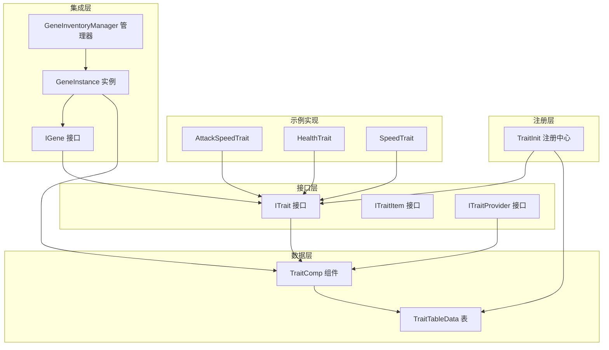
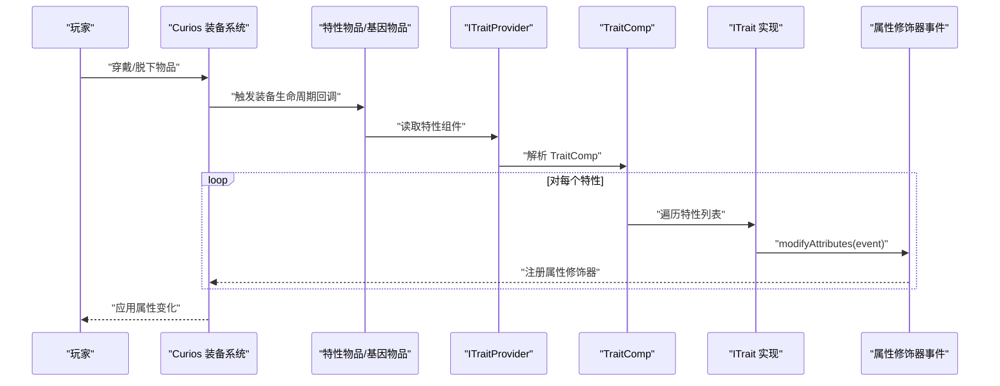
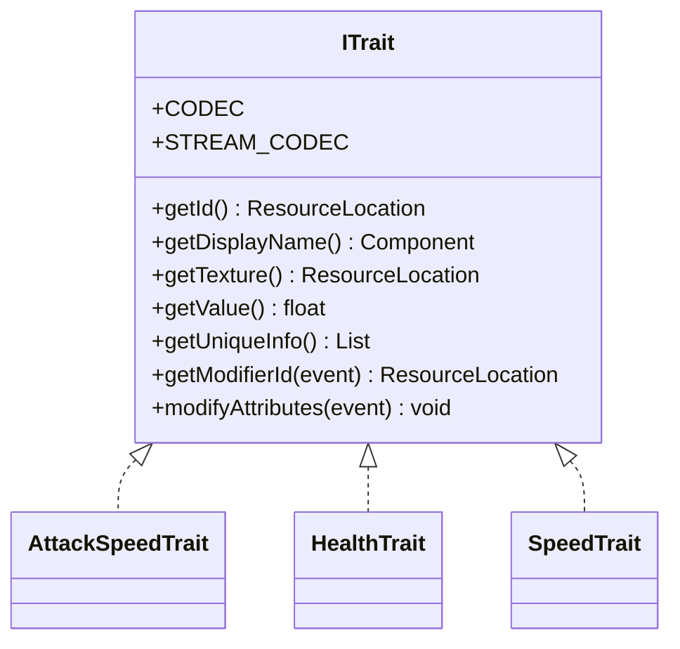
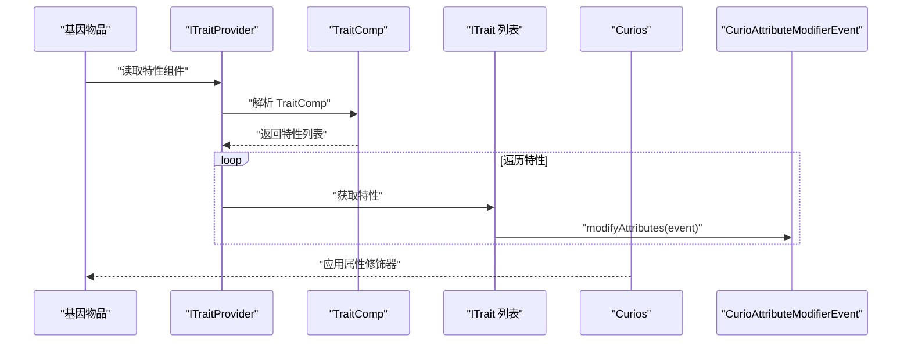
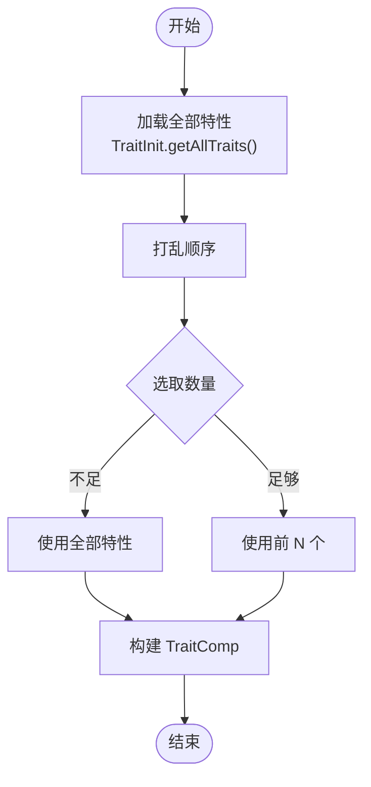
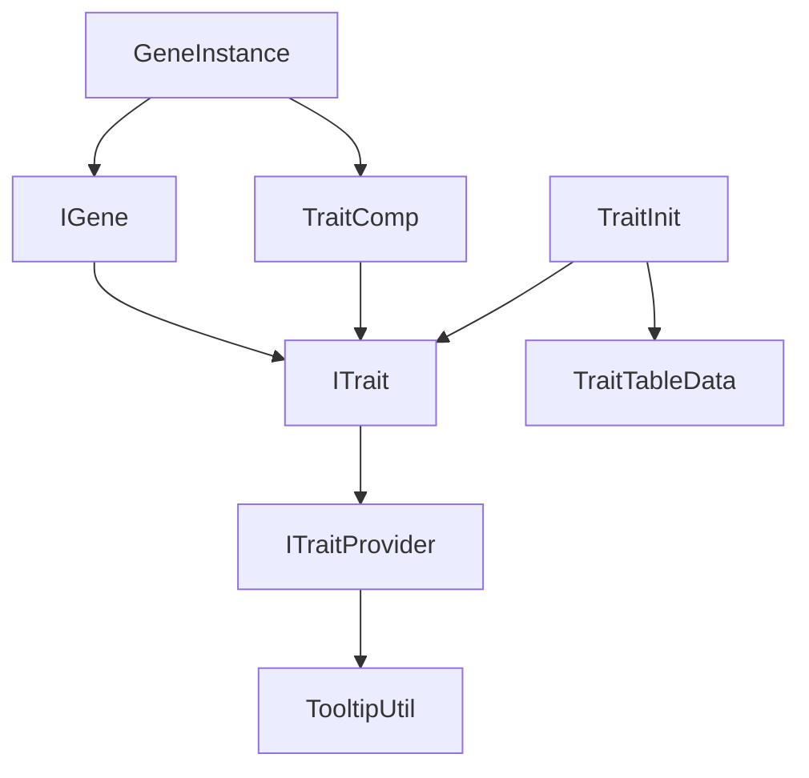

# 特性系统

<cite>
**本文引用的文件**
- [ITrait.java](file://Biotech/src/main/java/org/biotech/api/system/trait/core/ITrait.java)
- [ITraitItem.java](file://Biotech/src/main/java/org/biotech/api/system/trait/core/ITraitItem.java)
- [ITraitProvider.java](file://Biotech/src/main/java/org/biotech/api/system/trait/core/ITraitProvider.java)
- [TraitTableData.java](file://Biotech/src/main/java/org/biotech/api/system/trait/TraitTableData.java)
- [TraitInit.java](file://Biotech/src/main/java/org/biotech/api/init/TraitInit.java)
- [TraitComp.java](file://Biotech/src/main/java/org/biotech/component/TraitComp.java)
- [TooltipUtil.java](file://Biotech/src/main/java/org/biotech/api/util/TooltipUtil.java)
- [AttackSpeedTrait.java](file://Biotech/src/main/java/org/biotech/trait/AttackSpeedTrait.java)
- [HealthTrait.java](file://Biotech/src/main/java/org/biotech/trait/HealthTrait.java)
- [SpeedTrait.java](file://Biotech/src/main/java/org/biotech/trait/SpeedTrait.java)
- [IGene.java](file://Biotech/src/main/java/org/biotech/api/system/gene/core/IGene.java)
- [GeneInstance.java](file://Biotech/src/main/java/org/biotech/api/system/gene/GeneInstance.java)
- [GeneInventoryManager.java](file://Biotech/src/main/java/org/biotech/api/system/gene/inventory/GeneInventoryManager.java)
</cite>

## 目录
1. [简介](#简介)
2. [项目结构](#项目结构)
3. [核心组件](#核心组件)
4. [架构总览](#架构总览)
5. [详细组件分析](#详细组件分析)
6. [依赖关系分析](#依赖关系分析)
7. [性能考量](#性能考量)
8. [故障排查指南](#故障排查指南)
9. [结论](#结论)
10. [附录](#附录)

## 简介
本文件系统性阐述特性（Trait）系统的设计理念、实现机制与扩展方式，涵盖以下关键主题：
- ITrait 接口的职责边界与通用能力（唯一标识、显示名、纹理、属性修饰器生成、序列化与网络编解码）
- 特性与基因的绑定关系：通过数据组件与 Curios 装备事件在穿戴时生效
- 特性表数据的组织与管理：TraitTableData 提供全局可用特性集合；TraitInit 负责注册与检索
- 特性的随机生成与组合：TraitComp 支持多特性组合与随机装配
- 平衡性设计原则与对游戏体验的影响分析

## 项目结构
特性系统位于 Biotech 模块中，采用“接口 + 数据组件 + 注册中心”的分层设计：
- 接口层：ITrait、ITraitItem、ITraitProvider 定义契约
- 数据层：TraitComp 表达多特性组合；TraitTableData 管理全局特性表
- 注册层：TraitInit 提供注册、检索与自动发现机制
- 示例层：AttackSpeedTrait、HealthTrait、SpeedTrait 展示典型实现
- 集成层：IGene、GeneInstance、GeneInventoryManager 将特性与基因系统结合

图表来源
- [ITrait.java:18-108](file://Biotech/src/main/java/org/biotech/api/system/trait/core/ITrait.java#L18-L108)
- [ITraitItem.java:3-7](file://Biotech/src/main/java/org/biotech/api/system/trait/core/ITraitItem.java#L3-L7)
- [ITraitProvider.java:19-75](file://Biotech/src/main/java/org/biotech/api/system/trait/core/ITraitProvider.java#L19-L75)
- [TraitComp.java:18-102](file://Biotech/src/main/java/org/biotech/component/TraitComp.java#L18-L102)
- [TraitTableData.java:19-45](file://Biotech/src/main/java/org/biotech/api/system/trait/TraitTableData.java#L19-L45)
- [TraitInit.java:19-103](file://Biotech/src/main/java/org/biotech/api/init/TraitInit.java#L19-L103)
- [AttackSpeedTrait.java:19-57](file://Biotech/src/main/java/org/biotech/trait/AttackSpeedTrait.java#L19-L57)
- [HealthTrait.java:19-56](file://Biotech/src/main/java/org/biotech/trait/HealthTrait.java#L19-L56)
- [SpeedTrait.java:20-58](file://Biotech/src/main/java/org/biotech/trait/SpeedTrait.java#L20-L58)
- [IGene.java:15-91](file://Biotech/src/main/java/org/biotech/api/system/gene/core/IGene.java#L15-L91)
- [GeneInstance.java:19-119](file://Biotech/src/main/java/org/biotech/api/system/gene/GeneInstance.java#L19-L119)
- [GeneInventoryManager.java:18-186](file://Biotech/src/main/java/org/biotech/api/system/gene/inventory/GeneInventoryManager.java#L18-L186)

章节来源
- [ITrait.java:18-108](file://Biotech/src/main/java/org/biotech/api/system/trait/core/ITrait.java#L18-L108)
- [TraitInit.java:19-103](file://Biotech/src/main/java/org/biotech/api/init/TraitInit.java#L19-L103)
- [TraitComp.java:18-102](file://Biotech/src/main/java/org/biotech/component/TraitComp.java#L18-L102)
- [TraitTableData.java:19-45](file://Biotech/src/main/java/org/biotech/api/system/trait/TraitTableData.java#L19-L45)
- [IGene.java:15-91](file://Biotech/src/main/java/org/biotech/api/system/gene/core/IGene.java#L15-L91)
- [GeneInstance.java:19-119](file://Biotech/src/main/java/org/biotech/api/system/gene/GeneInstance.java#L19-L119)
- [GeneInventoryManager.java:18-186](file://Biotech/src/main/java/org/biotech/api/system/gene/inventory/GeneInventoryManager.java#L18-L186)

## 核心组件
- ITrait：特性抽象接口，定义唯一标识、显示名、纹理、特性值、属性修饰器生成、序列化与网络编解码等通用能力，并提供空特性常量与编码器。
- ITraitItem：物品层适配接口，用于从物品中读取特性。
- ITraitProvider：物品侧特性展示与颜色样式策略接口，负责从物品数据组件中读取特性并生成提示组件或选择纹理。
- TraitComp：多特性数据组件，支持添加、移除、判空、计数、随机装配与序列化编解码。
- TraitTableData：特性表数据容器，维护全局可用特性列表，提供 Codec 与 StreamCodec。
- TraitInit：特性注册中心，提供注册表创建、注册、按 ID 检索、获取全部特性、自动注册等能力。
- 示例特性：AttackSpeedTrait、HealthTrait、SpeedTrait 展示了如何基于 ITrait 实现具体效果。

章节来源
- [ITrait.java:18-108](file://Biotech/src/main/java/org/biotech/api/system/trait/core/ITrait.java#L18-L108)
- [ITraitItem.java:3-7](file://Biotech/src/main/java/org/biotech/api/system/trait/core/ITraitItem.java#L3-L7)
- [ITraitProvider.java:19-75](file://Biotech/src/main/java/org/biotech/api/system/trait/core/ITraitProvider.java#L19-L75)
- [TraitComp.java:18-102](file://Biotech/src/main/java/org/biotech/component/TraitComp.java#L18-L102)
- [TraitTableData.java:19-45](file://Biotech/src/main/java/org/biotech/api/system/trait/TraitTableData.java#L19-L45)
- [TraitInit.java:19-103](file://Biotech/src/main/java/org/biotech/api/init/TraitInit.java#L19-L103)
- [AttackSpeedTrait.java:19-57](file://Biotech/src/main/java/org/biotech/trait/AttackSpeedTrait.java#L19-L57)
- [HealthTrait.java:19-56](file://Biotech/src/main/java/org/biotech/trait/HealthTrait.java#L19-L56)
- [SpeedTrait.java:20-58](file://Biotech/src/main/java/org/biotech/trait/SpeedTrait.java#L20-L58)

## 架构总览
特性系统围绕“接口 + 数据组件 + 注册中心”展开，通过 Curios 的装备事件在穿戴时应用属性修饰器，同时通过数据组件持久化与网络同步。

图表来源
- [ITraitProvider.java:26-32](file://Biotech/src/main/java/org/biotech/api/system/trait/core/ITraitProvider.java#L26-L32)
- [TraitComp.java:20-48](file://Biotech/src/main/java/org/biotech/component/TraitComp.java#L20-L48)
- [ITrait.java:40-63](file://Biotech/src/main/java/org/biotech/api/system/trait/core/ITrait.java#L40-L63)

## 详细组件分析

### ITrait 接口设计与实现机制
- 唯一标识与显示：getId() 返回 ResourceLocation；默认显示名为基于命名空间与路径的本地化键；getTexture() 提供图标资源定位。
- 特性值与描述：getValue() 返回浮点数值；getUniqueInfo() 返回特性描述列表，用于提示与 UI 展示。
- 属性修饰器：modifyAttributes(CurioAttributeModifierEvent) 由实现类注入属性修饰器；getModifierId(event) 为每个槽位生成唯一修饰器 ID，避免冲突。
- 序列化与网络：提供 Codec 与 StreamCodec，支持基于 ResourceLocation 的序列化与网络传输；空特性使用专用 ID。
- 空特性与注册：EMPTY_TRAIT_ID 作为空特性标识；ITrait.EMPTY 提供空实现。

图表来源
- [ITrait.java:18-108](file://Biotech/src/main/java/org/biotech/api/system/trait/core/ITrait.java#L18-L108)
- [AttackSpeedTrait.java:19-57](file://Biotech/src/main/java/org/biotech/trait/AttackSpeedTrait.java#L19-L57)
- [HealthTrait.java:19-56](file://Biotech/src/main/java/org/biotech/trait/HealthTrait.java#L19-L56)
- [SpeedTrait.java:20-58](file://Biotech/src/main/java/org/biotech/trait/SpeedTrait.java#L20-L58)

章节来源
- [ITrait.java:18-108](file://Biotech/src/main/java/org/biotech/api/system/trait/core/ITrait.java#L18-L108)

### 特性与基因的绑定关系
- 物品层适配：ITraitItem 从物品中读取特性；ITraitProvider 从物品的数据组件中读取 TraitComp，并生成提示组件与选择纹理。
- 数据持久化：TraitComp 作为数据组件挂载于物品上，支持随机装配与序列化。
- 装备生效：IGene 扩展自 ICurioItem，继承 Curios 生命周期；当物品被穿戴时，通过 ITrait.modifyAttributes 在 CurioAttributeModifierEvent 中注册属性修饰器。
- 实例与库存：GeneInstance 封装 IGene 与数据组件；GeneInventoryManager 提供基因物品的增删查与收藏槽位管理。

图表来源
- [ITraitProvider.java:26-32](file://Biotech/src/main/java/org/biotech/api/system/trait/core/ITraitProvider.java#L26-L32)
- [TraitComp.java:20-48](file://Biotech/src/main/java/org/biotech/component/TraitComp.java#L20-L48)
- [IGene.java:15-91](file://Biotech/src/main/java/org/biotech/api/system/gene/core/IGene.java#L15-L91)
- [ITrait.java:40-63](file://Biotech/src/main/java/org/biotech/api/system/trait/core/ITrait.java#L40-L63)

章节来源
- [ITraitProvider.java:19-75](file://Biotech/src/main/java/org/biotech/api/system/trait/core/ITraitProvider.java#L19-L75)
- [TraitComp.java:18-102](file://Biotech/src/main/java/org/biotech/component/TraitComp.java#L18-L102)
- [IGene.java:15-91](file://Biotech/src/main/java/org/biotech/api/system/gene/core/IGene.java#L15-L91)
- [GeneInstance.java:19-119](file://Biotech/src/main/java/org/biotech/api/system/gene/GeneInstance.java#L19-L119)
- [GeneInventoryManager.java:18-186](file://Biotech/src/main/java/org/biotech/api/system/gene/inventory/GeneInventoryManager.java#L18-L186)

### 特性表数据的组织与管理
- TraitTableData：维护全局可用特性列表；提供 Codec 与 StreamCodec，便于数据加载与网络同步。
- TraitInit：创建并注册特性注册表；提供按 ID 检索、获取全部特性、自动注册（扫描带 @AutoInit 注解的实现类）等能力。
- TraitComp.random(count)：从 TraitInit.getAllTraits() 中随机打乱并选取若干特性组成新组件，用于生成随机基因或掉落。

图表来源
- [TraitTableData.java:23-29](file://Biotech/src/main/java/org/biotech/api/system/trait/TraitTableData.java#L23-L29)
- [TraitInit.java:70-76](file://Biotech/src/main/java/org/biotech/api/init/TraitInit.java#L70-L76)
- [TraitComp.java:75-86](file://Biotech/src/main/java/org/biotech/component/TraitComp.java#L75-L86)

章节来源
- [TraitTableData.java:19-45](file://Biotech/src/main/java/org/biotech/api/system/trait/TraitTableData.java#L19-L45)
- [TraitInit.java:19-103](file://Biotech/src/main/java/org/biotech/api/init/TraitInit.java#L19-L103)
- [TraitComp.java:18-102](file://Biotech/src/main/java/org/biotech/component/TraitComp.java#L18-L102)

### 典型特性实现示例
- 攻击速度特性：按最终值增加 10% 攻击速度，使用 ADD_MULTIPLIED_TOTAL 操作。
- 生命值特性：直接增加最大生命值，使用 ADD_VALUE 操作。
- 移动速度特性：按最终值增加 10% 移动速度，使用 ADD_MULTIPLIED_TOTAL 操作。

章节来源
- [AttackSpeedTrait.java:19-57](file://Biotech/src/main/java/org/biotech/trait/AttackSpeedTrait.java#L19-L57)
- [HealthTrait.java:19-56](file://Biotech/src/main/java/org/biotech/trait/HealthTrait.java#L19-L56)
- [SpeedTrait.java:20-58](file://Biotech/src/main/java/org/biotech/trait/SpeedTrait.java#L20-L58)

### 提示与 UI 集成
- TooltipUtil：提供文本与图标两种提示渲染路径；buildTraitTooltipComponent(TraitComp) 生成图标提示组件；getSelectedTraitTexture 选择主纹理。
- ITraitProvider：提供颜色样式策略（按特性数量改变名称颜色）与基础名称样式包装。

章节来源
- [TooltipUtil.java:18-106](file://Biotech/src/main/java/org/biotech/api/util/TooltipUtil.java#L18-L106)
- [ITraitProvider.java:26-75](file://Biotech/src/main/java/org/biotech/api/system/trait/core/ITraitProvider.java#L26-L75)

## 依赖关系分析
- ITrait 依赖 Curios 的属性修饰器事件以实现运行时属性变更。
- ITraitProvider 依赖 TooltipUtil 与 TraitComp 以生成提示与选择纹理。
- TraitInit 依赖注册表与反射扫描工具以完成自动注册。
- IGene 与 GeneInstance 为特性提供载体，通过 Curios 生命周期触发特性应用。
- TraitComp 依赖 ITrait 的 Codec 与 StreamCodec 进行序列化。

图表来源
- [ITrait.java:18-108](file://Biotech/src/main/java/org/biotech/api/system/trait/core/ITrait.java#L18-L108)
- [ITraitProvider.java:19-75](file://Biotech/src/main/java/org/biotech/api/system/trait/core/ITraitProvider.java#L19-L75)
- [TooltipUtil.java:18-106](file://Biotech/src/main/java/org/biotech/api/util/TooltipUtil.java#L18-L106)
- [TraitInit.java:19-103](file://Biotech/src/main/java/org/biotech/api/init/TraitInit.java#L19-L103)
- [TraitTableData.java:19-45](file://Biotech/src/main/java/org/biotech/api/system/trait/TraitTableData.java#L19-L45)
- [TraitComp.java:18-102](file://Biotech/src/main/java/org/biotech/component/TraitComp.java#L18-L102)
- [IGene.java:15-91](file://Biotech/src/main/java/org/biotech/api/system/gene/core/IGene.java#L15-L91)
- [GeneInstance.java:19-119](file://Biotech/src/main/java/org/biotech/api/system/gene/GeneInstance.java#L19-L119)

章节来源
- [ITrait.java:18-108](file://Biotech/src/main/java/org/biotech/api/system/trait/core/ITrait.java#L18-L108)
- [TraitInit.java:19-103](file://Biotech/src/main/java/org/biotech/api/init/TraitInit.java#L19-L103)
- [TraitComp.java:18-102](file://Biotech/src/main/java/org/biotech/component/TraitComp.java#L18-L102)
- [IGene.java:15-91](file://Biotech/src/main/java/org/biotech/api/system/gene/core/IGene.java#L15-L91)
- [GeneInstance.java:19-119](file://Biotech/src/main/java/org/biotech/api/system/gene/GeneInstance.java#L19-L119)

## 性能考量
- 序列化与网络：ITrait 与 TraitComp 使用高效的 Codec/StreamCodec，减少序列化开销；空特性使用统一 ID，避免冗余。
- 自动注册：TraitInit.autoRegisterTraits() 通过扫描注解一次性注册，降低手动注册成本。
- 随机装配：TraitComp.random(count) 使用 Collections.shuffle，时间复杂度 O(n log n)，适合小规模特性集。
- 属性修饰器：modifyAttributes 在 Curios 事件中批量注册，避免重复计算；getModifierId(event) 保证槽位隔离，避免冲突。

## 故障排查指南
- 特性未生效
  - 检查是否正确实现 ITrait.modifyAttributes 并在 Curios 事件中注册修饰器。
  - 确认物品实现了 ITraitItem/ITraitProvider 并能正确读取 TraitComp。
  - 核对 IGene 生命周期钩子是否被调用（onEquip/geneOnEquip）。
- 特性 ID 丢失或为空
  - 检查 ITrait.getId() 是否返回有效 ResourceLocation；确认 TraitInit 注册成功。
  - 若反序列化失败，检查 Codec/StreamCodec 的读写一致性。
- 提示不显示或异常
  - 确认 ITrait.getUniqueInfo() 返回非空列表；检查 TooltipUtil.buildTraitTooltipComponent 的调用链。
- 随机装配结果为空
  - 检查 TraitInit.getAllTraits() 是否为空；确认 TraitComp.random(count) 的 count 参数合理。

章节来源
- [ITrait.java:40-63](file://Biotech/src/main/java/org/biotech/api/system/trait/core/ITrait.java#L40-L63)
- [ITraitProvider.java:26-32](file://Biotech/src/main/java/org/biotech/api/system/trait/core/ITraitProvider.java#L26-L32)
- [TraitInit.java:50-58](file://Biotech/src/main/java/org/biotech/api/init/TraitInit.java#L50-L58)
- [TraitComp.java:75-86](file://Biotech/src/main/java/org/biotech/component/TraitComp.java#L75-L86)
- [TooltipUtil.java:76-86](file://Biotech/src/main/java/org/biotech/api/util/TooltipUtil.java#L76-L86)

## 结论
特性系统通过清晰的接口抽象、数据组件持久化与注册中心管理，实现了特性定义、组合、随机生成与运行时生效的完整闭环。其与 Curios 的深度集成确保了属性修饰器在穿戴时即时生效，而 TraitComp 与 TraitTableData 则提供了灵活的扩展与管理能力。遵循本文档的平衡性设计原则与最佳实践，可在不破坏游戏体验的前提下持续扩展特性生态。

## 附录
- 如何创建新的特性类型
  - 实现 ITrait 接口，定义 getId()、getValue()、getUniqueInfo()、modifyAttributes(event) 与 getTexture()。
  - 使用 @AutoInit 注解（可选），以便 TraitInit 自动发现并注册。
  - 参考现有实现：[AttackSpeedTrait.java:19-57](file://Biotech/src/main/java/org/biotech/trait/AttackSpeedTrait.java#L19-L57)、[HealthTrait.java:19-56](file://Biotech/src/main/java/org/biotech/trait/HealthTrait.java#L19-L56)、[SpeedTrait.java:20-58](file://Biotech/src/main/java/org/biotech/trait/SpeedTrait.java#L20-L58)。
- 如何定义特性的数值效果与触发条件
  - 数值效果：在 modifyAttributes(event) 中通过 event.addModifier(...) 注册修饰器，选择合适的 Attribute 与 Operation。
  - 触发条件：通过 IGene 的生命周期钩子（如 geneOnEquip/onUnequip）控制生效时机；也可在 ITrait 中根据上下文动态决定是否应用修饰器。
  - 参考：[ITrait.java:40-63](file://Biotech/src/main/java/org/biotech/api/system/trait/core/ITrait.java#L40-L63)、[IGene.java:26-38](file://Biotech/src/main/java/org/biotech/api/system/gene/core/IGene.java#L26-L38)。
- 特性表数据的组织与管理
  - 使用 TraitTableData 维护全局特性列表；通过 TraitInit 注册与检索；利用 TraitComp.random(count) 进行随机装配。
  - 参考：[TraitTableData.java:19-45](file://Biotech/src/main/java/org/biotech/api/system/trait/TraitTableData.java#L19-L45)、[TraitInit.java:70-76](file://Biotech/src/main/java/org/biotech/api/init/TraitInit.java#L70-L76)、[TraitComp.java:75-86](file://Biotech/src/main/java/org/biotech/component/TraitComp.java#L75-L86)。
- 平衡性设计原则与对游戏体验的影响
  - 单特性强度：避免单一特性过强，建议通过百分比加成与固定值叠加结合，保持线性与非线性收益的平衡。
  - 组合效应：多特性组合应考虑协同与冲突，避免“叠Buff”导致指数膨胀。
  - 可发现性：通过提示与 UI 明确展示特性效果，提升玩家理解与决策效率。
  - 可访问性：随机生成需保证多样性与可玩性，避免极端组合导致体验割裂。