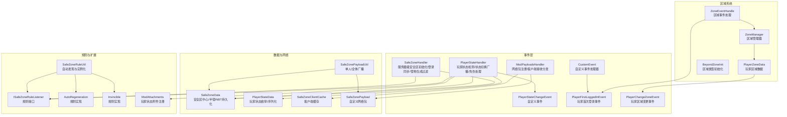
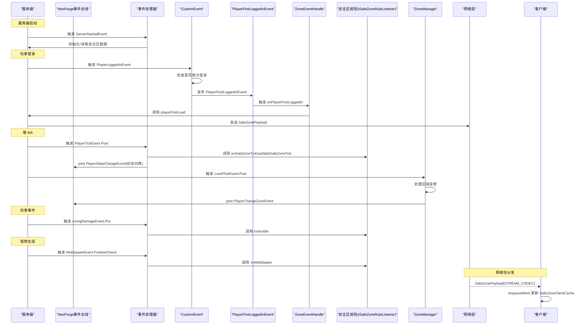
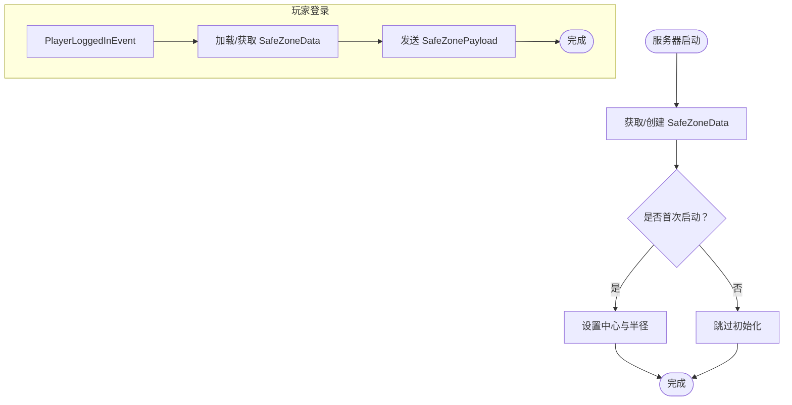
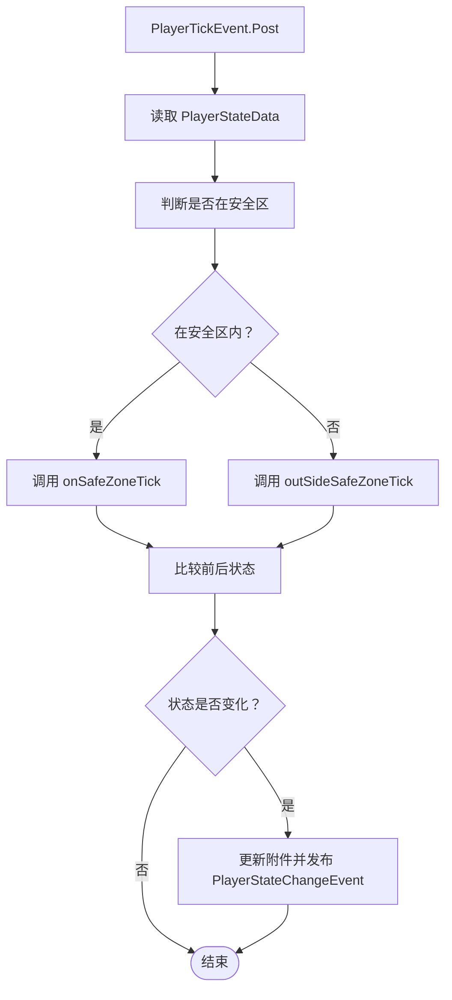
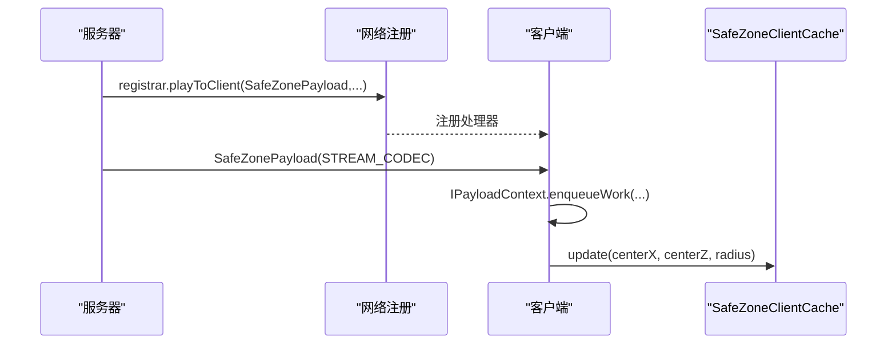
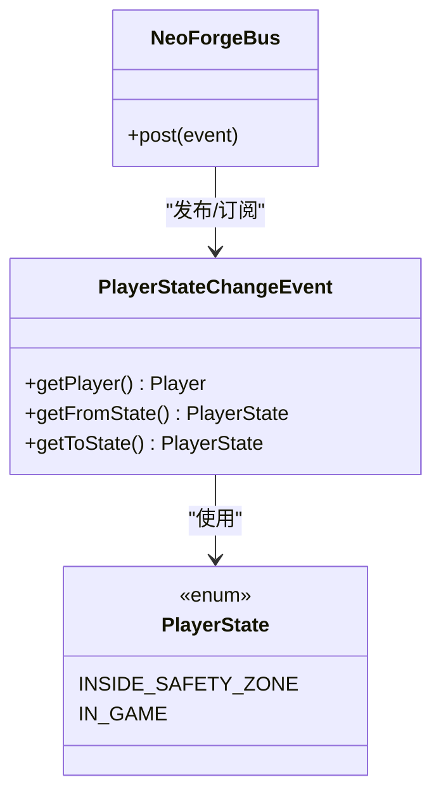
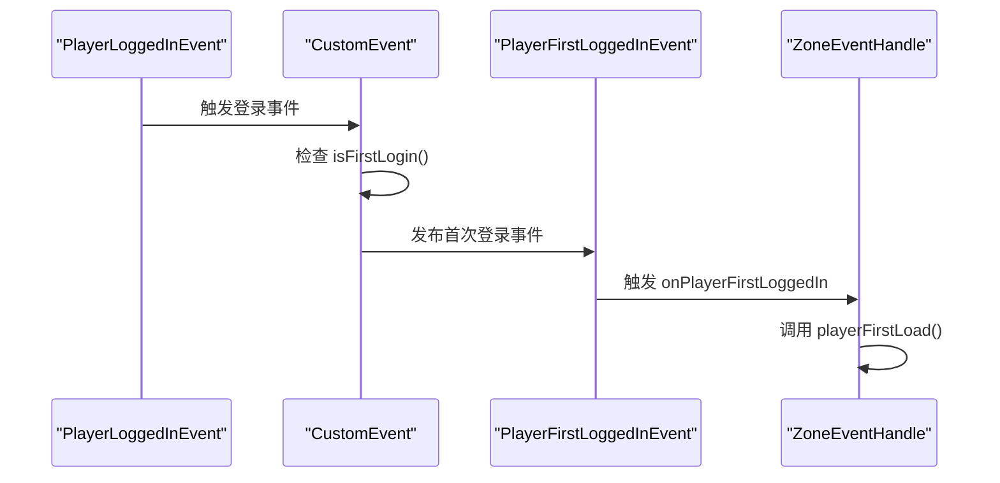
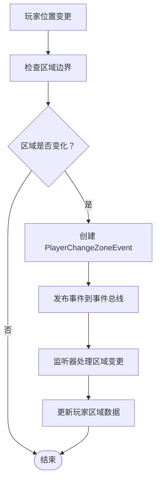
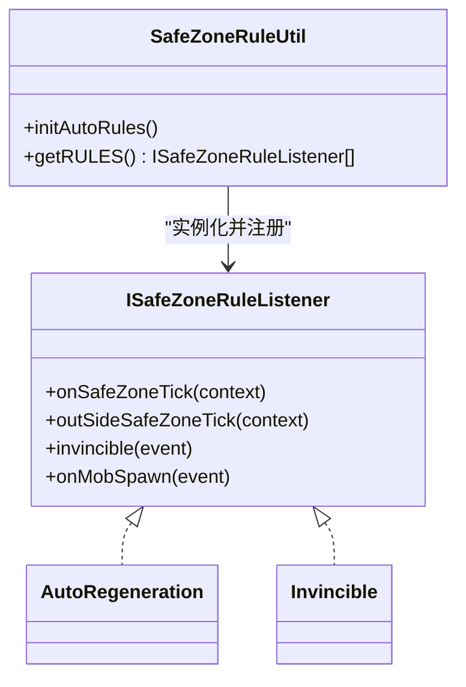
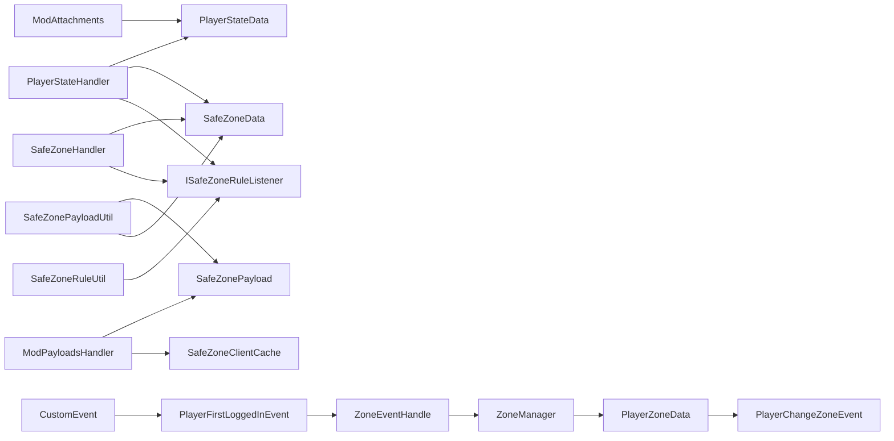

# 事件处理系统

<cite>
**本文档引用的文件**
- [Beyond.java](file://Beyond/Beyond.java)
- [SafeZoneHandler.java](file://Beyond/src/main/java/com/pz/beyond/event/SafeZoneHandler.java)
- [PlayerStateHandler.java](file://Beyond/src/main/java/com/pz/beyond/event/PlayerStateHandler.java)
- [ModPayloadsHandler.java](file://Beyond/src/main/java/com/pz/beyond/event/ModPayloadsHandler.java)
- [PlayerStateChangeEvent.java](file://Beyond/src/main/java/com/pz/beyond/event/custom/PlayerStateChangeEvent.java)
- [PlayerFirstLoggedInEvent.java](file://Beyond/src/main/java/com/pz/beyond/api/event/custom/PlayerFirstLoggedInEvent.java)
- [CustomEvent.java](file://Beyond/src/main/java/com/pz/beyond/api/event/custom/CustomEvent.java)
- [PlayerChangeZoneEvent.java](file://Beyond/src/main/java/com/pz/beyond/api/event/custom/PlayerChangeZoneEvent.java)
- [ZoneEventHandle.java](file://Beyond/src/main/java/com/pz/beyond/api/event/handle/ZoneEventHandle.java)
- [SafeZonePayload.java](file://Beyond/src/main/java/com/pz/beyond/network/SafeZonePayload.java)
- [SafeZoneData.java](file://Beyond/src/main/java/com/pz/beyond/data/SafeZoneData.java)
- [PlayerStateData.java](file://Beyond/src/main/java/com/pz/beyond/data/PlayerStateData.java)
- [SafeZoneClientCache.java](file://Beyond/src/main/java/com/pz/beyond/data/SafeZoneClientCache.java)
- [SafeZonePayloadUtil.java](file://Beyond/src/main/java/com/pz/beyond/util/SafeZonePayloadUtil.java)
- [ISafeZoneRuleListener.java](file://Beyond/src/main/java/com/pz/beyond/safeZoneRule/ISafeZoneRuleListener.java)
- [SafeZoneRuleUtil.java](file://Beyond/src/main/java/com/pz/beyond/util/SafeZoneRuleUtil.java)
- [ModAttachments.java](file://Beyond/src/main/java/com/pz/beyond/registry/ModAttachments.java)
- [AutoRegeneration.java](file://Beyond/src/main/java/com/pz/beyond/safeZoneRule/impl/AutoRegeneration.java)
- [Invincible.java](file://Beyond/src/main/java/com/pz/beyond/safeZoneRule/impl/Invincible.java)
- [ZoneManager.java](file://Beyond/src/main/java/com/pz/beyond/api/system/zone/ZoneManager.java)
- [PlayerZoneData.java](file://Beyond/src/main/java/com/pz/beyond/api/system/zone/PlayerZoneData.java)
- [BeyondZoneInit.java](file://Beyond/src/main/java/com/pz/beyond/api/init/BeyondZoneInit.java)
</cite>

## 更新摘要
**所做更改**
- 新增 PlayerFirstLoggedInEvent 和 CustomEvent 事件系统增强
- 新增 PlayerChangeZoneEvent 和 ZoneEventHandle 区域事件处理机制
- 扩展事件处理系统的完整生命周期管理
- 增强区域系统与事件驱动架构的集成

## 目录
1. [引言](#引言)
2. [项目结构](#项目结构)
3. [核心组件](#核心组件)
4. [架构总览](#架构总览)
5. [详细组件分析](#详细组件分析)
6. [依赖分析](#依赖分析)
7. [性能考虑](#性能考虑)
8. [故障排除指南](#故障排除指南)
9. [结论](#结论)
10. [附录](#附录)

## 引言
本文件面向开发者与高级用户，系统性阐述"Beyond"模组中的事件处理体系，重点覆盖以下主题：
- SafeZoneHandler 与 PlayerStateHandler 两大事件处理器的监听、过滤与响应机制
- ModPayloadsHandler 网络事件处理器的注册、接收、解析与分发流程
- 自定义事件 PlayerStateChangeEvent 的设计、参数、传播路径与订阅模式
- 新增事件系统增强：PlayerFirstLoggedInEvent、PlayerChangeZoneEvent 的完整生命周期
- 区域事件处理机制：ZoneEventHandle 与 ZoneManager 的协作架构
- 事件系统的异步处理与线程安全保证
- 事件扩展开发指南（自定义事件类型与处理流程）
- 性能监控、调试工具与故障排除实践

## 项目结构
事件处理系统主要位于 Beyond 模组的 com.pz.beyond.event 包及其子包中，并与网络层、数据层、附件系统、安全区规则、区域系统等模块协同工作。

**图表来源**
- [SafeZoneHandler.java:1-77](file://Beyond/src/main/java/com/pz/beyond/event/SafeZoneHandler.java#L1-L77)
- [PlayerStateHandler.java:1-80](file://Beyond/src/main/java/com/pz/beyond/event/PlayerStateHandler.java#L1-L80)
- [ModPayloadsHandler.java:1-35](file://Beyond/src/main/java/com/pz/beyond/event/ModPayloadsHandler.java#L1-L35)
- [PlayerStateChangeEvent.java:1-70](file://Beyond/src/main/java/com/pz/beyond/event/custom/PlayerStateChangeEvent.java#L1-L70)
- [PlayerFirstLoggedInEvent.java:1-12](file://Beyond/src/main/java/com/pz/beyond/api/event/custom/PlayerFirstLoggedInEvent.java#L1-L12)
- [CustomEvent.java:1-28](file://Beyond/src/main/java/com/pz/beyond/api/event/custom/CustomEvent.java#L1-L28)
- [PlayerChangeZoneEvent.java:1-28](file://Beyond/src/main/java/com/pz/beyond/api/event/custom/PlayerChangeZoneEvent.java#L1-L28)
- [ZoneEventHandle.java:1-55](file://Beyond/src/main/java/com/pz/beyond/api/event/handle/ZoneEventHandle.java#L1-L55)
- [ZoneManager.java:1-67](file://Beyond/src/main/java/com/pz/beyond/api/system/zone/ZoneManager.java#L1-L67)
- [PlayerZoneData.java:1-66](file://Beyond/src/main/java/com/pz/beyond/api/system/zone/PlayerZoneData.java#L1-L66)
- [BeyondZoneInit.java:1-70](file://Beyond/src/main/java/com/pz/beyond/api/init/BeyondZoneInit.java#L1-L70)

**章节来源**
- [Beyond.java:1-79](file://Beyond/Beyond.java#L1-L79)

## 核心组件
- SafeZoneHandler：负责服务器启动时初始化安全区数据、玩家登录时同步安全区信息、以及在怪物生成阶段应用安全区规则过滤。
- PlayerStateHandler：每 tick 检测玩家是否处于安全区，驱动安全区规则执行；当玩家状态切换时，发布 PlayerStateChangeEvent；同时对伤害事件进行免伤处理。
- ModPayloadsHandler：注册自定义网络包的接收端，将服务端下发的安全区数据在主线程安全更新到客户端缓存。
- PlayerStateChangeEvent：自定义事件，携带玩家实体与前后状态，支持取消。
- PlayerFirstLoggedInEvent：新增的玩家首次登录事件，用于处理首次登录的特殊逻辑。
- PlayerChangeZoneEvent：玩家区域变更事件，支持区域监听器的动态响应。
- CustomEvent：自定义事件处理器，负责在玩家登录时检测并触发 PlayerFirstLoggedInEvent。
- ZoneEventHandle：区域事件处理程序，协调区域系统与事件驱动架构。
- ISafeZoneRuleListener 与 SafeZoneRuleUtil：规则接口与自动发现机制，允许第三方以注解方式声明安全区规则并被统一调度。

**章节来源**
- [SafeZoneHandler.java:1-77](file://Beyond/src/main/java/com/pz/beyond/event/SafeZoneHandler.java#L1-L77)
- [PlayerStateHandler.java:1-80](file://Beyond/src/main/java/com/pz/beyond/event/PlayerStateHandler.java#L1-L80)
- [ModPayloadsHandler.java:1-35](file://Beyond/src/main/java/com/pz/beyond/event/ModPayloadsHandler.java#L1-L35)
- [PlayerStateChangeEvent.java:1-70](file://Beyond/src/main/java/com/pz/beyond/event/custom/PlayerStateChangeEvent.java#L1-L70)
- [PlayerFirstLoggedInEvent.java:1-12](file://Beyond/src/main/java/com/pz/beyond/api/event/custom/PlayerFirstLoggedInEvent.java#L1-L12)
- [CustomEvent.java:1-28](file://Beyond/src/main/java/com/pz/beyond/api/event/custom/CustomEvent.java#L1-L28)
- [PlayerChangeZoneEvent.java:1-28](file://Beyond/src/main/java/com/pz/beyond/api/event/custom/PlayerChangeZoneEvent.java#L1-L28)
- [ZoneEventHandle.java:1-55](file://Beyond/src/main/java/com/pz/beyond/api/event/handle/ZoneEventHandle.java#L1-L55)
- [ISafeZoneRuleListener.java:1-42](file://Beyond/src/main/java/com/pz/beyond/safeZoneRule/ISafeZoneRuleListener.java#L1-L42)
- [SafeZoneRuleUtil.java:1-54](file://Beyond/src/main/java/com/pz/beyond/util/SafeZoneRuleUtil.java#L1-L54)

## 架构总览
事件系统围绕 NeoForge 事件总线与自定义网络协议展开，采用"规则驱动 + 事件广播 + 网络同步 + 区域管理"的综合架构模式。

**图表来源**
- [SafeZoneHandler.java:43-76](file://Beyond/src/main/java/com/pz/beyond/event/SafeZoneHandler.java#L43-L76)
- [PlayerStateHandler.java:26-77](file://Beyond/src/main/java/com/pz/beyond/event/PlayerStateHandler.java#L26-L77)
- [ModPayloadsHandler.java:14-32](file://Beyond/src/main/java/com/pz/beyond/event/ModPayloadsHandler.java#L14-L32)
- [CustomEvent.java:13-26](file://Beyond/src/main/java/com/pz/beyond/api/event/custom/CustomEvent.java#L13-L26)
- [ZoneEventHandle.java:38-46](file://Beyond/src/main/java/com/pz/beyond/api/event/handle/ZoneEventHandle.java#L38-L46)
- [ZoneManager.java:15-42](file://Beyond/src/main/java/com/pz/beyond/api/system/zone/ZoneManager.java#L15-L42)
- [SafeZonePayload.java:10-30](file://Beyond/src/main/java/com/pz/beyond/network/SafeZonePayload.java#L10-L30)

## 详细组件分析

### SafeZoneHandler 分析
职责与流程
- 服务器启动时：从 Overworld 的 SavedData 存储读取或创建 SafeZoneData，首次启动时根据世界出生点设置中心与半径，并标记已初始化。
- 玩家登录：为新玩家创建/获取安全区数据，并通过连接发送 SafeZonePayload，确保客户端即时获得安全区信息。
- 怪物生成：遍历所有已加载的安全区规则，对生成位置进行过滤。

关键点
- 使用 SavedData 工厂模式创建/加载安全区数据，保证持久化与一致性。
- 通过 PacketDistributor 将安全区数据广播给指定维度的所有在线玩家。
- 与 ISafeZoneRuleListener 协作，集中式地在多个事件点应用规则。

**图表来源**
- [SafeZoneHandler.java:43-76](file://Beyond/src/main/java/com/pz/beyond/event/SafeZoneHandler.java#L43-L76)
- [SafeZoneData.java:26-46](file://Beyond/src/main/java/com/pz/beyond/data/SafeZoneData.java#L26-L46)
- [SafeZonePayloadUtil.java:16-30](file://Beyond/src/main/java/com/pz/beyond/util/SafeZonePayloadUtil.java#L16-L30)

**章节来源**
- [SafeZoneHandler.java:1-77](file://Beyond/src/main/java/com/pz/beyond/event/SafeZoneHandler.java#L1-L77)
- [SafeZoneData.java:1-101](file://Beyond/src/main/java/com/pz/beyond/data/SafeZoneData.java#L1-L101)
- [SafeZonePayloadUtil.java:1-32](file://Beyond/src/main/java/com/pz/beyond/util/SafeZonePayloadUtil.java#L1-L32)

### PlayerStateHandler 分析
职责与流程
- 每 tick 检查玩家状态：从玩家附件中读取 PlayerStateData，结合 SafeZoneData 判断是否在安全区内。
- 执行规则：根据状态分别调用 onSafeZoneTick 或 outSideSafeZoneTick。
- 状态切换检测：若状态发生变化，更新附件并发布 PlayerStateChangeEvent。
- 免伤处理：在伤害事件前调用规则的 invincible，实现安全区内免伤。

关键点
- 使用 ModAttachments 为玩家附加 PlayerStateData，支持序列化与死亡继承策略。
- 通过 NeoForge.EVENT_BUS.post 广播自定义事件，订阅者可按需取消事件。
- 与 ISafeZoneRuleListener 协同，形成"状态驱动 + 规则驱动"的双通道处理。

**图表来源**
- [PlayerStateHandler.java:26-77](file://Beyond/src/main/java/com/pz/beyond/event/PlayerStateHandler.java#L26-L77)
- [PlayerStateData.java:13-65](file://Beyond/src/main/java/com/pz/beyond/data/PlayerStateData.java#L13-L65)
- [SafeZoneData.java:49-57](file://Beyond/src/main/java/com/pz/beyond/data/SafeZoneData.java#L49-L57)
- [ModAttachments.java:16-20](file://Beyond/src/main/java/com/pz/beyond/registry/ModAttachments.java#L16-L20)

**章节来源**
- [PlayerStateHandler.java:1-80](file://Beyond/src/main/java/com/pz/beyond/event/PlayerStateHandler.java#L1-L80)
- [PlayerStateData.java:1-65](file://Beyond/src/main/java/com/pz/beyond/data/PlayerStateData.java#L1-L65)
- [ModAttachments.java:1-22](file://Beyond/src/main/java/com/pz/beyond/registry/ModAttachments.java#L1-L22)

### ModPayloadsHandler 分析
职责与流程
- 注册自定义网络包：在 RegisterPayloadHandlersEvent 中注册 PlayToClient 方向的 SafeZonePayload 处理器。
- 客户端接收：在 IPayloadContext 上下文中，使用 enqueueWork 将更新操作排入主线程队列，确保线程安全。
- 数据分发：服务端通过 SafeZonePayloadUtil 将安全区数据广播至所有在线玩家。

关键点
- 使用 STREAM_CODEC 对 SafeZonePayload 进行编解码，保证网络传输效率与稳定性。
- 通过 enqueueWork 保障客户端更新发生在主循环，避免并发问题。

**图表来源**
- [ModPayloadsHandler.java:14-32](file://Beyond/src/main/java/com/pz/beyond/event/ModPayloadsHandler.java#L14-L32)
- [SafeZonePayload.java:10-30](file://Beyond/src/main/java/com/pz/beyond/network/SafeZonePayload.java#L10-L30)
- [SafeZoneClientCache.java:12-28](file://Beyond/src/main/java/com/pz/beyond/data/SafeZoneClientCache.java#L12-L28)

**章节来源**
- [ModPayloadsHandler.java:1-35](file://Beyond/src/main/java/com/pz/beyond/event/ModPayloadsHandler.java#L1-L35)
- [SafeZonePayload.java:1-31](file://Beyond/src/main/java/com/pz/beyond/network/SafeZonePayload.java#L1-L31)
- [SafeZoneClientCache.java:1-30](file://Beyond/src/main/java/com/pz/beyond/data/SafeZoneClientCache.java#L1-L30)

### PlayerStateChangeEvent 自定义事件
设计与使用
- 类型：继承自 Event，并实现 ICancellableEvent，支持取消。
- 参数：包含玩家实体、变更前状态、变更后状态。
- 订阅：通过 NeoForge.EVENT_BUS 订阅，可在任意模块中监听状态切换事件。
- 传播路径：由 PlayerStateHandler 在状态切换时发布，订阅者可基于事件决定后续行为。

**图表来源**
- [PlayerStateChangeEvent.java:15-67](file://Beyond/src/main/java/com/pz/beyond/event/custom/PlayerStateChangeEvent.java#L15-L67)
- [PlayerStateData.java:46-61](file://Beyond/src/main/java/com/pz/beyond/data/PlayerStateData.java#L46-L61)

**章节来源**
- [PlayerStateChangeEvent.java:1-70](file://Beyond/src/main/java/com/pz/beyond/event/custom/PlayerStateChangeEvent.java#L1-L70)
- [PlayerStateData.java:1-65](file://Beyond/src/main/java/com/pz/beyond/data/PlayerStateData.java#L1-L65)

### PlayerFirstLoggedInEvent 新增事件
设计与实现
- 类型：继承自 PlayerEvent，专门用于标识玩家的首次登录。
- 触发时机：在 CustomEvent 中检测到玩家首次登录时发布。
- 处理流程：ZoneEventHandle 接收事件后调用 BeyondManager.playerFirstLoad 进行初始化。
- 应用场景：可用于首次登录奖励、新手引导、初始物品发放等功能。

**图表来源**
- [CustomEvent.java:13-26](file://Beyond/src/main/java/com/pz/beyond/api/event/custom/CustomEvent.java#L13-L26)
- [PlayerFirstLoggedInEvent.java:6-11](file://Beyond/src/main/java/com/pz/beyond/api/event/custom/PlayerFirstLoggedInEvent.java#L6-L11)
- [ZoneEventHandle.java:38-46](file://Beyond/src/main/java/com/pz/beyond/api/event/handle/ZoneEventHandle.java#L38-L46)

**章节来源**
- [PlayerFirstLoggedInEvent.java:1-12](file://Beyond/src/main/java/com/pz/beyond/api/event/custom/PlayerFirstLoggedInEvent.java#L1-L12)
- [CustomEvent.java:1-28](file://Beyond/src/main/java/com/pz/beyond/api/event/custom/CustomEvent.java#L1-L28)
- [ZoneEventHandle.java:1-55](file://Beyond/src/main/java/com/pz/beyond/api/event/handle/ZoneEventHandle.java#L1-L55)

### PlayerChangeZoneEvent 区域变更事件
设计与实现
- 类型：继承自 PlayerEvent，携带旧区域类型和新区域类型。
- 触发时机：当玩家从一个区域移动到另一个区域时触发。
- 处理机制：PlayerZoneData 在设置新区域时发布事件，允许监听器修改目标区域。
- 区域管理：ZoneManager 负责在整个服务器范围内协调区域变更事件。

**图表来源**
- [PlayerChangeZoneEvent.java:10-27](file://Beyond/src/main/java/com/pz/beyond/api/event/custom/PlayerChangeZoneEvent.java#L10-L27)
- [PlayerZoneData.java:40-51](file://Beyond/src/main/java/com/pz/beyond/api/system/zone/PlayerZoneData.java#L40-L51)
- [ZoneManager.java:33-41](file://Beyond/src/main/java/com/pz/beyond/api/system/zone/ZoneManager.java#L33-L41)

**章节来源**
- [PlayerChangeZoneEvent.java:1-28](file://Beyond/src/main/java/com/pz/beyond/api/event/custom/PlayerChangeZoneEvent.java#L1-L28)
- [PlayerZoneData.java:1-66](file://Beyond/src/main/java/com/pz/beyond/api/system/zone/PlayerZoneData.java#L1-L66)
- [ZoneManager.java:1-67](file://Beyond/src/main/java/com/pz/beyond/api/system/zone/ZoneManager.java#L1-L67)

### ZoneEventHandle 区域事件处理
职责与流程
- 等级刻处理：监听 LevelTickEvent.Post，在允许的维度中调用 BeyondManager.levelTick。
- 首次登录处理：监听 PlayerFirstLoggedInEvent，调用 BeyondManager.playerFirstLoad 进行玩家初始化。
- 关卡加载处理：监听 LevelEvent.Load，在服务器等级加载时调用 BeyondManager.loadLevel。

关键点
- 使用 @EventBusSubscriber 注解自动注册到事件总线。
- 通过 BeyondAPI.getBeyondManager() 获取管理器实例。
- 支持多维度过滤，确保只在允许的维度中处理事件。

**章节来源**
- [ZoneEventHandle.java:1-55](file://Beyond/src/main/java/com/pz/beyond/api/event/handle/ZoneEventHandle.java#L1-L55)

### 安全区规则扩展机制
- 接口：ISafeZoneRuleListener 定义了 onSafeZoneTick、outSideSafeZoneTick、invincible、onMobSpawn 四类回调，默认空实现，便于按需覆盖。
- 自动发现：SafeZoneRuleUtil 在 commonSetup 阶段扫描所有模组的注解，实例化带 @SafeZoneRule 的实现类并加入运行时列表。
- 实现示例：
  - AutoRegeneration：在安全区内每秒回血一次
  - Invincible：在安全区内将伤害置零

**图表来源**
- [ISafeZoneRuleListener.java:13-41](file://Beyond/src/main/java/com/pz/beyond/safeZoneRule/ISafeZoneRuleListener.java#L13-L41)
- [SafeZoneRuleUtil.java:11-53](file://Beyond/src/main/java/com/pz/beyond/util/SafeZoneRuleUtil.java#L11-L53)
- [AutoRegeneration.java:8-17](file://Beyond/src/main/java/com/pz/beyond/safeZoneRule/impl/AutoRegeneration.java#L8-L17)
- [Invincible.java:11-22](file://Beyond/src/main/java/com/pz/beyond/safeZoneRule/impl/Invincible.java#L11-L22)

**章节来源**
- [ISafeZoneRuleListener.java:1-42](file://Beyond/src/main/java/com/pz/beyond/safeZoneRule/ISafeZoneRuleListener.java#L1-L42)
- [SafeZoneRuleUtil.java:1-54](file://Beyond/src/main/java/com/pz/beyond/util/SafeZoneRuleUtil.java#L1-L54)
- [AutoRegeneration.java:1-18](file://Beyond/src/main/java/com/pz/beyond/safeZoneRule/impl/AutoRegeneration.java#L1-L18)
- [Invincible.java:1-23](file://Beyond/src/main/java/com/pz/beyond/safeZoneRule/impl/Invincible.java#L1-L23)

## 依赖分析
- 事件处理器依赖于数据层（SafeZoneData、PlayerStateData、PlayerZoneData）、网络层（SafeZonePayload、SafeZonePayloadUtil）、附件系统（ModAttachments）与规则系统（ISafeZoneRuleListener、SafeZoneRuleUtil）。
- ModPayloadsHandler 依赖于网络注册事件与客户端缓存 SafeZoneClientCache。
- PlayerStateHandler 依赖 PlayerStateData 与 SafeZoneData，并通过 NeoForge.EVENT_BUS 发布 PlayerStateChangeEvent。
- CustomEvent 依赖 BeyondAPI 和玩家登录数据，用于检测首次登录状态。
- ZoneEventHandle 依赖 ZoneManager 和 BeyondAPI，协调区域系统初始化。
- PlayerChangeZoneEvent 依赖 PlayerZoneData 和 ZoneType，支持区域监听器的动态响应。

**图表来源**
- [PlayerStateHandler.java:24-45](file://Beyond/src/main/java/com/pz/beyond/event/PlayerStateHandler.java#L24-L45)
- [SafeZoneHandler.java:38-75](file://Beyond/src/main/java/com/pz/beyond/event/SafeZoneHandler.java#L38-L75)
- [ModPayloadsHandler.java:14-32](file://Beyond/src/main/java/com/pz/beyond/event/ModPayloadsHandler.java#L14-L32)
- [SafeZonePayloadUtil.java:16-30](file://Beyond/src/main/java/com/pz/beyond/util/SafeZonePayloadUtil.java#L16-L30)
- [ModAttachments.java:16-20](file://Beyond/src/main/java/com/pz/beyond/registry/ModAttachments.java#L16-L20)
- [SafeZoneRuleUtil.java:12-52](file://Beyond/src/main/java/com/pz/beyond/util/SafeZoneRuleUtil.java#L12-L52)
- [CustomEvent.java:19-25](file://Beyond/src/main/java/com/pz/beyond/api/event/custom/CustomEvent.java#L19-L25)
- [ZoneEventHandle.java:45](file://Beyond/src/main/java/com/pz/beyond/api/event/handle/ZoneEventHandle.java#L45)
- [PlayerZoneData.java:44-47](file://Beyond/src/main/java/com/pz/beyond/api/system/zone/PlayerZoneData.java#L44-L47)
- [ZoneManager.java:34](file://Beyond/src/main/java/com/pz/beyond/api/system/zone/ZoneManager.java#L34)

**章节来源**
- [PlayerStateHandler.java:1-80](file://Beyond/src/main/java/com/pz/beyond/event/PlayerStateHandler.java#L1-L80)
- [SafeZoneHandler.java:1-77](file://Beyond/src/main/java/com/pz/beyond/event/SafeZoneHandler.java#L1-L77)
- [ModPayloadsHandler.java:1-35](file://Beyond/src/main/java/com/pz/beyond/event/ModPayloadsHandler.java#L1-L35)
- [SafeZonePayloadUtil.java:1-32](file://Beyond/src/main/java/com/pz/beyond/util/SafeZonePayloadUtil.java#L1-L32)
- [ModAttachments.java:1-22](file://Beyond/src/main/java/com/pz/beyond/registry/ModAttachments.java#L1-L22)
- [SafeZoneRuleUtil.java:1-54](file://Beyond/src/main/java/com/pz/beyond/util/SafeZoneRuleUtil.java#L1-L54)
- [CustomEvent.java:1-28](file://Beyond/src/main/java/com/pz/beyond/api/event/custom/CustomEvent.java#L1-L28)
- [ZoneEventHandle.java:1-55](file://Beyond/src/main/java/com/pz/beyond/api/event/handle/ZoneEventHandle.java#L1-L55)
- [PlayerZoneData.java:1-66](file://Beyond/src/main/java/com/pz/beyond/api/system/zone/PlayerZoneData.java#L1-L66)
- [ZoneManager.java:1-67](file://Beyond/src/main/java/com/pz/beyond/api/system/zone/ZoneManager.java#L1-L67)

## 性能考虑
- 规则遍历：PlayerStateHandler 与 SafeZoneHandler 在每 tick 与事件触发时遍历规则列表，建议：
  - 控制规则数量与复杂度，避免在规则中执行重型 I/O 或长耗时计算。
  - 将高频检查（如 isWithinSafeZone）保持 O(1) 或 O(logN) 级别，必要时引入空间换时间的索引结构。
- 网络包：SafeZonePayload 仅包含三个整数字段，编码/解码开销极低；广播时尽量按需发送（例如仅在安全区中心或半径变化时才广播）。
- 事件发布：PlayerStateChangeEvent 仅在状态切换时发布，避免频繁触发；PlayerChangeZoneEvent 在区域确实变化时才触发。
- 线程安全：ModPayloadsHandler 使用 enqueueWork 将客户端更新放入主循环，避免竞态条件；附件序列化与复制策略由 ModAttachments 定义，确保跨维度/重生场景的一致性。
- 首次登录优化：CustomEvent 只在检测到首次登录时才发布 PlayerFirstLoggedInEvent，避免不必要的事件处理。

## 故障排除指南
常见问题与排查步骤
- 安全区未生效
  - 检查 SafeZoneHandler 是否正确初始化 SafeZoneData，确认 isFirst 标志位与默认半径设置。
  - 确认 SafeZonePayloadUtil 是否在登录事件中向玩家发送了数据包。
- 玩家状态不切换
  - 检查 PlayerStateHandler 的状态判断逻辑与 SafeZoneData 的 isWithinSafeZone 实现。
  - 确认 PlayerStateData 通过 ModAttachments 正确附加到玩家实体。
- 客户端显示异常
  - 检查 ModPayloadsHandler 的 playToClient 注册是否成功，确认 STREAM_CODEC 与 TYPE 一致。
  - 确认 enqueueWork 是否被执行，SafeZoneClientCache 的 update 方法是否被调用。
- 规则未生效
  - 检查 SafeZoneRuleUtil 的 initAutoRules 是否在 commonSetup 中被调用。
  - 确认实现类是否带有 @SafeZoneRule 注解且实现了 ISafeZoneRuleListener。
- 事件未被订阅
  - 确认订阅方是否在正确的 EventBus 上注册，并正确处理 PlayerStateChangeEvent 的取消语义。
- 首次登录事件未触发
  - 检查 CustomEvent 是否正确检测到首次登录状态。
  - 确认 PlayerFirstLoggedInEvent 是否被正确发布和处理。
- 区域变更事件异常
  - 检查 PlayerZoneData 的 setCurrentZone 方法是否正确发布事件。
  - 确认 ZoneManager 的区域变更处理逻辑是否正常执行。

**章节来源**
- [SafeZoneHandler.java:43-76](file://Beyond/src/main/java/com/pz/beyond/event/SafeZoneHandler.java#L43-L76)
- [PlayerStateHandler.java:26-77](file://Beyond/src/main/java/com/pz/beyond/event/PlayerStateHandler.java#L26-L77)
- [ModPayloadsHandler.java:14-32](file://Beyond/src/main/java/com/pz/beyond/event/ModPayloadsHandler.java#L14-L32)
- [SafeZonePayloadUtil.java:16-30](file://Beyond/src/main/java/com/pz/beyond/util/SafeZonePayloadUtil.java#L16-L30)
- [SafeZoneRuleUtil.java:13-48](file://Beyond/src/main/java/com/pz/beyond/util/SafeZoneRuleUtil.java#L13-L48)
- [ModAttachments.java:16-20](file://Beyond/src/main/java/com/pz/beyond/registry/ModAttachments.java#L16-L20)
- [CustomEvent.java:19-25](file://Beyond/src/main/java/com/pz/beyond/api/event/custom/CustomEvent.java#L19-L25)
- [PlayerFirstLoggedInEvent.java:6-11](file://Beyond/src/main/java/com/pz/beyond/api/event/custom/PlayerFirstLoggedInEvent.java#L6-L11)
- [PlayerZoneData.java:40-51](file://Beyond/src/main/java/com/pz/beyond/api/system/zone/PlayerZoneData.java#L40-L51)
- [ZoneManager.java:33-41](file://Beyond/src/main/java/com/pz/beyond/api/system/zone/ZoneManager.java#L33-L41)

## 结论
本事件处理系统通过"规则 + 事件 + 网络 + 区域"的综合架构，实现了安全区功能的高扩展性与高性能。SafeZoneHandler 与 PlayerStateHandler 负责核心业务逻辑，ModPayloadsHandler 提供可靠的网络同步，PlayerStateChangeEvent 为外部模块提供了灵活的接入点。新增的 PlayerFirstLoggedInEvent 和 PlayerChangeZoneEvent 进一步完善了事件系统的生命周期管理，ZoneEventHandle 和 ZoneManager 则强化了区域系统的事件驱动能力。借助 SafeZoneRuleUtil 的自动发现机制和 CustomEvent 的智能检测，第三方可轻松扩展新的安全区规则和区域监听器，满足多样化玩法需求。

## 附录

### 事件扩展开发指南
- 创建自定义规则
  - 实现 ISafeZoneRuleListener 或在其子接口上覆写所需方法。
  - 使用 @SafeZoneRule 注解类，确保 SafeZoneRuleUtil 能在启动时自动发现并实例化。
  - 将实现类放置在可被扫描到的模组中，并确保其无参构造可用。
- 订阅 PlayerStateChangeEvent
  - 在订阅方注册事件监听，根据需要取消事件或执行副作用逻辑。
  - 注意事件仅在状态切换时触发，避免重复处理。
- 网络包扩展
  - 若需新增自定义网络包，参考 SafeZonePayload 的 TYPE 与 STREAM_CODEC 设计，确保两端一致。
  - 在 ModPayloadsHandler 中注册 playToClient/playToServer 处理器，并在客户端使用 enqueueWork 更新状态。
- 开发 PlayerFirstLoggedInEvent 相关功能
  - 在 CustomEvent 中添加登录状态检测逻辑。
  - 通过 ZoneEventHandle 处理首次登录后的初始化任务。
  - 确保事件处理不会影响正常的登录流程。
- 实现 PlayerChangeZoneEvent 监听器
  - 在区域监听器中实现 playerChangeZone 方法。
  - 注意事件可能被其他监听器修改，要处理好事件状态的最终确定。
  - 确保区域变更逻辑不会导致无限循环或性能问题。

**章节来源**
- [ISafeZoneRuleListener.java:13-41](file://Beyond/src/main/java/com/pz/beyond/safeZoneRule/ISafeZoneRuleListener.java#L13-L41)
- [SafeZoneRuleUtil.java:13-48](file://Beyond/src/main/java/com/pz/beyond/util/SafeZoneRuleUtil.java#L13-L48)
- [PlayerStateChangeEvent.java:15-67](file://Beyond/src/main/java/com/pz/beyond/event/custom/PlayerStateChangeEvent.java#L15-L67)
- [ModPayloadsHandler.java:14-32](file://Beyond/src/main/java/com/pz/beyond/event/ModPayloadsHandler.java#L14-L32)
- [SafeZonePayload.java:10-30](file://Beyond/src/main/java/com/pz/beyond/network/SafeZonePayload.java#L10-L30)
- [CustomEvent.java:13-26](file://Beyond/src/main/java/com/pz/beyond/api/event/custom/CustomEvent.java#L13-L26)
- [ZoneEventHandle.java:38-46](file://Beyond/src/main/java/com/pz/beyond/api/event/handle/ZoneEventHandle.java#L38-L46)
- [PlayerChangeZoneEvent.java:10-27](file://Beyond/src/main/java/com/pz/beyond/api/event/custom/PlayerChangeZoneEvent.java#L10-L27)
- [PlayerZoneData.java:40-51](file://Beyond/src/main/java/com/pz/beyond/api/system/zone/PlayerZoneData.java#L40-L51)