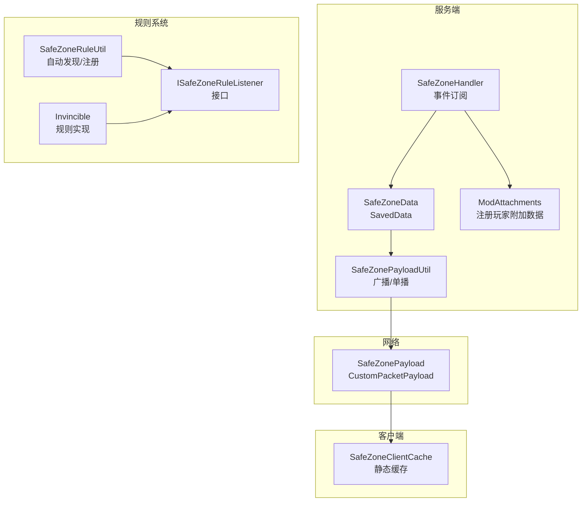
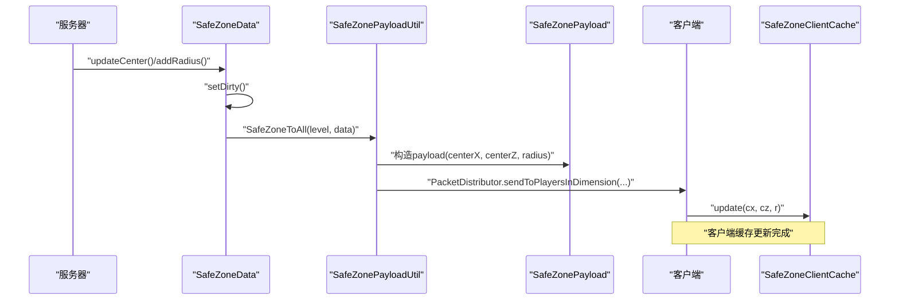
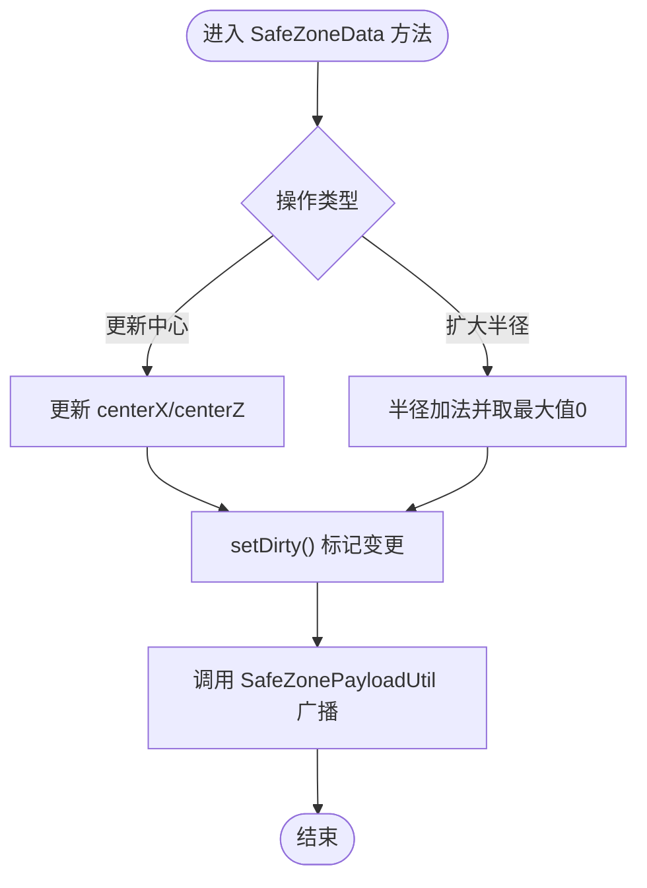
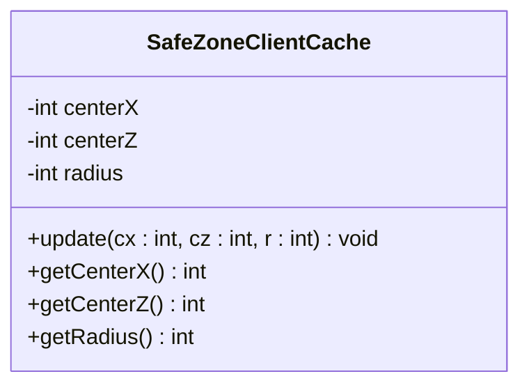
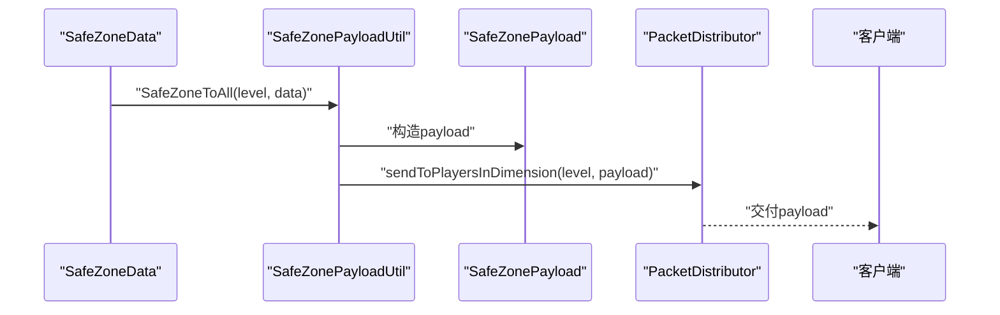
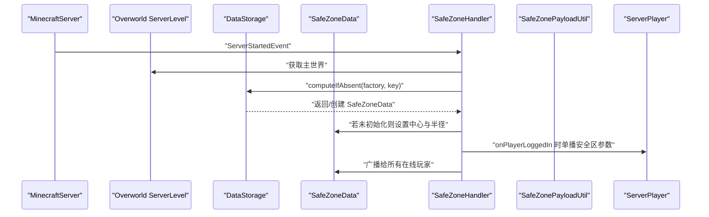
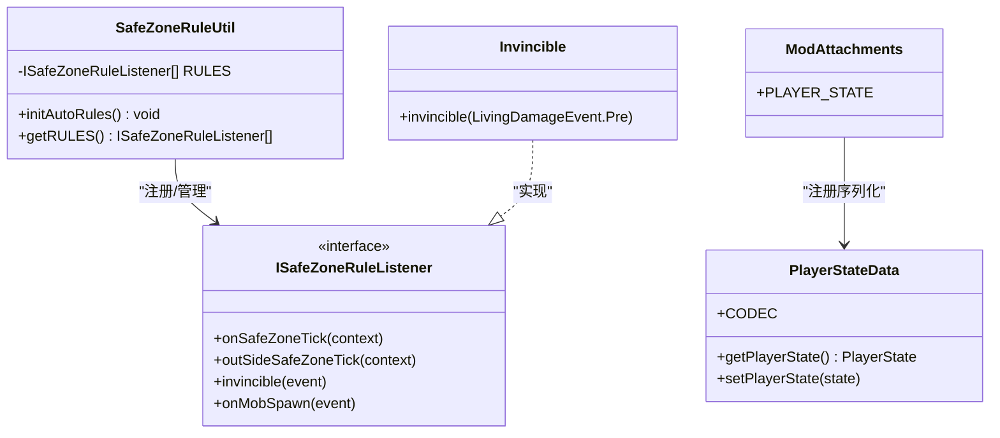
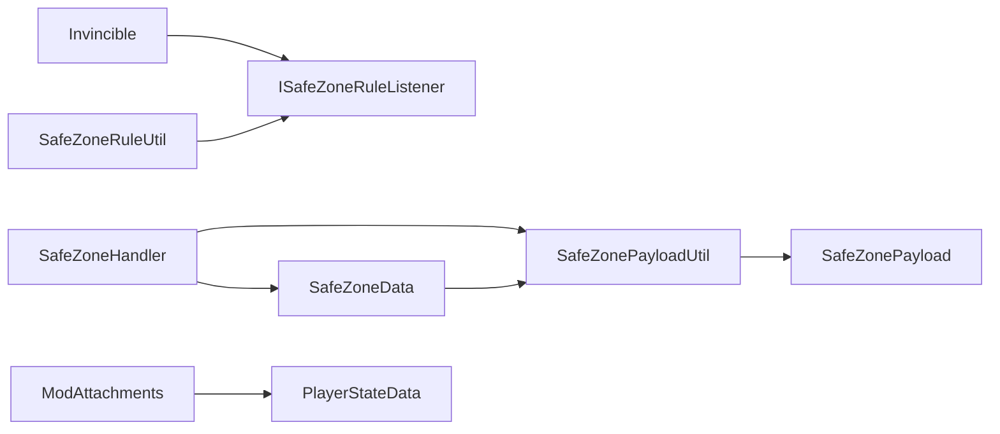

# 安全区数据存储

<cite>
**本文引用的文件**
- [SafeZoneData.java](file://Beyond/src/main/java/com/pz/beyond/data/SafeZoneData.java)
- [SafeZoneClientCache.java](file://Beyond/src/main/java/com/pz/beyond/data/SafeZoneClientCache.java)
- [SafeZonePayloadUtil.java](file://Beyond/src/main/java/com/pz/beyond/util/SafeZonePayloadUtil.java)
- [SafeZonePayload.java](file://Beyond/src/main/java/com/pz/beyond/network/SafeZonePayload.java)
- [SafeZoneHandler.java](file://Beyond/src/main/java/com/pz/beyond/event/SafeZoneHandler.java)
- [PlayerStateData.java](file://Beyond/src/main/java/com/pz/beyond/data/PlayerStateData.java)
- [ISafeZoneRuleListener.java](file://Beyond/src/main/java/com/pz/beyond/safeZoneRule/ISafeZoneRuleListener.java)
- [SafeZoneRuleUtil.java](file://Beyond/src/main/java/com/pz/beyond/util/SafeZoneRuleUtil.java)
- [Invincible.java](file://Beyond/src/main/java/com/pz/beyond/safeZoneRule/impl/Invincible.java)
- [ModAttachments.java](file://Beyond/src/main/java/com/pz/beyond/registry/ModAttachments.java)
- [PlayerStateChangeEvent.java](file://Beyond/src/main/java/com/pz/beyond/event/custom/PlayerStateChangeEvent.java)
- [Config.java](file://Beyond/src/main/java/com/pz/beyond/Config.java)
- [beyond.mixins.json](file://Beyond/src/main/resources/beyond.mixins.json)
</cite>

## 目录
1. [引言](#引言)
2. [项目结构](#项目结构)
3. [核心组件](#核心组件)
4. [架构总览](#架构总览)
5. [详细组件分析](#详细组件分析)
6. [依赖分析](#依赖分析)
7. [性能考虑](#性能考虑)
8. [故障排查指南](#故障排查指南)
9. [结论](#结论)
10. [附录](#附录)

## 引言
本技术文档围绕“安全区数据存储系统”展开，聚焦以下目标：
- 深入解析 SafeZoneData 数据模型的结构设计（几何定义、参数与验证）
- 详述 SafeZoneClientCache 客户端缓存系统的工作原理（同步策略、更新机制、性能优化）
- 解释 SafeZonePayloadUtil 工具类在网络包序列化、反序列化与传输优化方面的职责
- 说明服务端与客户端之间的一致性保障（冲突检测与修复策略）
- 提供数据存储扩展指南（自定义数据格式、存储后端集成）
- 给出数据迁移、备份恢复与故障诊断的实践建议

## 项目结构
本模块位于 Beyond 子模块中，围绕“安全区”概念构建了数据层、网络层、事件层与规则层协同工作：
- 数据层：SafeZoneData（服务端持久化）、SafeZoneClientCache（客户端缓存）
- 网络层：SafeZonePayload（自定义协议载荷）、SafeZonePayloadUtil（广播/单播发送）
- 事件层：SafeZoneHandler（服务器启动、玩家登录、怪物生成等事件驱动）
- 规则层：ISafeZoneRuleListener 接口及其实现（如 Invincible），配合 SafeZoneRuleUtil 自动发现与注册
- 附加数据：ModAttachments 注册 PlayerStateData，用于玩家状态持久化与死亡继承

图表来源
- [SafeZoneData.java:16-100](file://Beyond/src/main/java/com/pz/beyond/data/SafeZoneData.java#L16-L100)
- [SafeZoneHandler.java:36-76](file://Beyond/src/main/java/com/pz/beyond/event/SafeZoneHandler.java#L36-L76)
- [SafeZonePayloadUtil.java:9-31](file://Beyond/src/main/java/com/pz/beyond/util/SafeZonePayloadUtil.java#L9-L31)
- [SafeZonePayload.java:10-30](file://Beyond/src/main/java/com/pz/beyond/network/SafeZonePayload.java#L10-L30)
- [SafeZoneClientCache.java:6-29](file://Beyond/src/main/java/com/pz/beyond/data/SafeZoneClientCache.java#L6-L29)
- [ISafeZoneRuleListener.java:13-41](file://Beyond/src/main/java/com/pz/beyond/safeZoneRule/ISafeZoneRuleListener.java#L13-L41)
- [SafeZoneRuleUtil.java:11-53](file://Beyond/src/main/java/com/pz/beyond/util/SafeZoneRuleUtil.java#L11-L53)
- [Invincible.java:10-22](file://Beyond/src/main/java/com/pz/beyond/safeZoneRule/impl/Invincible.java#L10-L22)
- [ModAttachments.java:11-21](file://Beyond/src/main/java/com/pz/beyond/registry/ModAttachments.java#L11-L21)

章节来源
- [SafeZoneData.java:16-100](file://Beyond/src/main/java/com/pz/beyond/data/SafeZoneData.java#L16-L100)
- [SafeZoneHandler.java:36-76](file://Beyond/src/main/java/com/pz/beyond/event/SafeZoneHandler.java#L36-L76)
- [SafeZonePayloadUtil.java:9-31](file://Beyond/src/main/java/com/pz/beyond/util/SafeZonePayloadUtil.java#L9-L31)
- [SafeZonePayload.java:10-30](file://Beyond/src/main/java/com/pz/beyond/network/SafeZonePayload.java#L10-L30)
- [SafeZoneClientCache.java:6-29](file://Beyond/src/main/java/com/pz/beyond/data/SafeZoneClientCache.java#L6-L29)
- [ISafeZoneRuleListener.java:13-41](file://Beyond/src/main/java/com/pz/beyond/safeZoneRule/ISafeZoneRuleListener.java#L13-L41)
- [SafeZoneRuleUtil.java:11-53](file://Beyond/src/main/java/com/pz/beyond/util/SafeZoneRuleUtil.java#L11-L53)
- [Invincible.java:10-22](file://Beyond/src/main/java/com/pz/beyond/safeZoneRule/impl/Invincible.java#L10-L22)
- [ModAttachments.java:11-21](file://Beyond/src/main/java/com/pz/beyond/registry/ModAttachments.java#L11-L21)

## 核心组件
- SafeZoneData：服务端持久化的安全区中心坐标与半径，支持序列化/反序列化与范围判断；变更后通过工具类广播至所有在线玩家
- SafeZoneClientCache：客户端静态缓存，保存最近一次收到的安全区参数，供渲染与规则判定使用
- SafeZonePayloadUtil：封装网络包发送逻辑，支持单播与广播
- SafeZonePayload：自定义协议载荷，定义字段与序列化流编解码
- SafeZoneHandler：事件驱动的初始化与同步逻辑，负责首次初始化、登录同步与怪物生成拦截
- PlayerStateData 与 ModAttachments：为玩家附加状态数据，支持序列化与死亡继承
- ISafeZoneRuleListener 与 SafeZoneRuleUtil：规则接口与自动发现注册机制，便于扩展安全区内行为

章节来源
- [SafeZoneData.java:16-100](file://Beyond/src/main/java/com/pz/beyond/data/SafeZoneData.java#L16-L100)
- [SafeZoneClientCache.java:6-29](file://Beyond/src/main/java/com/pz/beyond/data/SafeZoneClientCache.java#L6-L29)
- [SafeZonePayloadUtil.java:9-31](file://Beyond/src/main/java/com/pz/beyond/util/SafeZonePayloadUtil.java#L9-L31)
- [SafeZonePayload.java:10-30](file://Beyond/src/main/java/com/pz/beyond/network/SafeZonePayload.java#L10-L30)
- [SafeZoneHandler.java:36-76](file://Beyond/src/main/java/com/pz/beyond/event/SafeZoneHandler.java#L36-L76)
- [PlayerStateData.java:13-64](file://Beyond/src/main/java/com/pz/beyond/data/PlayerStateData.java#L13-L64)
- [ModAttachments.java:11-21](file://Beyond/src/main/java/com/pz/beyond/registry/ModAttachments.java#L11-L21)
- [ISafeZoneRuleListener.java:13-41](file://Beyond/src/main/java/com/pz/beyond/safeZoneRule/ISafeZoneRuleListener.java#L13-L41)
- [SafeZoneRuleUtil.java:11-53](file://Beyond/src/main/java/com/pz/beyond/util/SafeZoneRuleUtil.java#L11-L53)

## 架构总览
下图展示从服务端数据变更到客户端缓存更新的完整流程，以及规则系统对事件的响应路径。

图表来源
- [SafeZoneData.java:60-79](file://Beyond/src/main/java/com/pz/beyond/data/SafeZoneData.java#L60-L79)
- [SafeZonePayloadUtil.java:26-30](file://Beyond/src/main/java/com/pz/beyond/util/SafeZonePayloadUtil.java#L26-L30)
- [SafeZonePayload.java:10-30](file://Beyond/src/main/java/com/pz/beyond/network/SafeZonePayload.java#L10-L30)
- [SafeZoneClientCache.java:12-16](file://Beyond/src/main/java/com/pz/beyond/data/SafeZoneClientCache.java#L12-L16)

## 详细组件分析

### SafeZoneData 数据模型
- 几何定义与参数
  - 中心坐标：centerX、centerZ（整型）
  - 半径：radius（整型，非负）
  - 初始化标记：isFirst（布尔）
- 序列化/反序列化
  - save/load 使用 CompoundTag 存取上述字段
- 几何判断
  - isWithinSafeZone(x, z) 基于绝对差值判断是否在以中心为基准的正方形范围内
- 更新与广播
  - updateCenter(x, z)/addRadius(r) 后调用 SafeZonePayloadUtil 广播给所有在线玩家
  - setDirty() 标记数据已变更，触发保存

图表来源
- [SafeZoneData.java:60-79](file://Beyond/src/main/java/com/pz/beyond/data/SafeZoneData.java#L60-L79)
- [SafeZoneData.java:49-57](file://Beyond/src/main/java/com/pz/beyond/data/SafeZoneData.java#L49-L57)

章节来源
- [SafeZoneData.java:16-100](file://Beyond/src/main/java/com/pz/beyond/data/SafeZoneData.java#L16-L100)

### SafeZoneClientCache 客户端缓存
- 结构
  - 静态字段：centerX、centerZ、radius
- 更新机制
  - update(cx, cz, r) 原子性更新三元组
- 使用场景
  - 渲染与规则判定（例如无敌判定基于当前缓存状态）

图表来源
- [SafeZoneClientCache.java:6-29](file://Beyond/src/main/java/com/pz/beyond/data/SafeZoneClientCache.java#L6-L29)

章节来源
- [SafeZoneClientCache.java:6-29](file://Beyond/src/main/java/com/pz/beyond/data/SafeZoneClientCache.java#L6-L29)

### SafeZonePayloadUtil 工具类
- 单播：safeZoneToPlayer(player, data) 将当前安全区参数发送给指定玩家
- 广播：SafeZoneToAll(level, data) 将安全区参数广播给维度内所有在线玩家
- 传输优化
  - 基于自定义协议 SafeZonePayload，采用 StreamCodec 编解码，字段为三个 int，体积小、开销低

图表来源
- [SafeZonePayloadUtil.java:16-30](file://Beyond/src/main/java/com/pz/beyond/util/SafeZonePayloadUtil.java#L16-L30)
- [SafeZonePayload.java:10-30](file://Beyond/src/main/java/com/pz/beyond/network/SafeZonePayload.java#L10-L30)

章节来源
- [SafeZonePayloadUtil.java:9-31](file://Beyond/src/main/java/com/pz/beyond/util/SafeZonePayloadUtil.java#L9-L31)
- [SafeZonePayload.java:10-30](file://Beyond/src/main/java/com/pz/beyond/network/SafeZonePayload.java#L10-L30)

### SafeZoneHandler 事件驱动与一致性
- 服务器启动时初始化
  - 若未初始化，使用主世界的共享出生点作为初始中心，并设置默认半径，标记 isFirst
- 玩家登录同步
  - 新玩家登录时，向其单播当前安全区参数，确保客户端即时一致
- 怪物生成拦截
  - 将位置检查事件转发给所有已注册的规则监听器

图表来源
- [SafeZoneHandler.java:44-52](file://Beyond/src/main/java/com/pz/beyond/event/SafeZoneHandler.java#L44-L52)
- [SafeZoneHandler.java:61-68](file://Beyond/src/main/java/com/pz/beyond/event/SafeZoneHandler.java#L61-L68)
- [SafeZoneData.java:60-79](file://Beyond/src/main/java/com/pz/beyond/data/SafeZoneData.java#L60-L79)
- [SafeZonePayloadUtil.java:16-19](file://Beyond/src/main/java/com/pz/beyond/util/SafeZonePayloadUtil.java#L16-L19)

章节来源
- [SafeZoneHandler.java:36-76](file://Beyond/src/main/java/com/pz/beyond/event/SafeZoneHandler.java#L36-L76)

### 规则系统与数据一致性
- 规则接口与自动发现
  - ISafeZoneRuleListener 定义统一回调（伤害、生成等）
  - SafeZoneRuleUtil 通过扫描注解 @SafeZoneRule 自动实例化并注册规则
- 典型规则示例
  - Invincible：当玩家处于安全区内时，将伤害置零
- 与玩家状态联动
  - ModAttachments 注册 PlayerStateData，随玩家实体持久化并在死亡后继承
  - PlayerStateChangeEvent 提供状态变更事件（可取消），便于外部监听

图表来源
- [ISafeZoneRuleListener.java:13-41](file://Beyond/src/main/java/com/pz/beyond/safeZoneRule/ISafeZoneRuleListener.java#L13-L41)
- [SafeZoneRuleUtil.java:11-53](file://Beyond/src/main/java/com/pz/beyond/util/SafeZoneRuleUtil.java#L11-L53)
- [Invincible.java:10-22](file://Beyond/src/main/java/com/pz/beyond/safeZoneRule/impl/Invincible.java#L10-L22)
- [PlayerStateData.java:25-28](file://Beyond/src/main/java/com/pz/beyond/data/PlayerStateData.java#L25-L28)
- [ModAttachments.java:16-20](file://Beyond/src/main/java/com/pz/beyond/registry/ModAttachments.java#L16-L20)

章节来源
- [ISafeZoneRuleListener.java:13-41](file://Beyond/src/main/java/com/pz/beyond/safeZoneRule/ISafeZoneRuleListener.java#L13-L41)
- [SafeZoneRuleUtil.java:11-53](file://Beyond/src/main/java/com/pz/beyond/util/SafeZoneRuleUtil.java#L11-L53)
- [Invincible.java:10-22](file://Beyond/src/main/java/com/pz/beyond/safeZoneRule/impl/Invincible.java#L10-L22)
- [PlayerStateData.java:13-64](file://Beyond/src/main/java/com/pz/beyond/data/PlayerStateData.java#L13-L64)
- [ModAttachments.java:11-21](file://Beyond/src/main/java/com/pz/beyond/registry/ModAttachments.java#L11-L21)
- [PlayerStateChangeEvent.java:15-69](file://Beyond/src/main/java/com/pz/beyond/event/custom/PlayerStateChangeEvent.java#L15-L69)

## 依赖分析
- 组件耦合
  - SafeZoneData 依赖 SafeZonePayloadUtil 进行广播
  - SafeZoneHandler 依赖 SafeZoneData 与 SafeZonePayloadUtil 实现初始化与同步
  - SafeZonePayloadUtil 依赖 SafeZonePayload 作为传输载体
  - 规则系统通过 SafeZoneRuleUtil 动态装配 ISafeZoneRuleListener 实现
  - ModAttachments 为 PlayerStateData 提供序列化与生命周期管理
- 外部依赖
  - Minecraft SavedData、CustomPacketPayload、PacketDistributor 等

图表来源
- [SafeZoneData.java:60-79](file://Beyond/src/main/java/com/pz/beyond/data/SafeZoneData.java#L60-L79)
- [SafeZoneHandler.java:44-52](file://Beyond/src/main/java/com/pz/beyond/event/SafeZoneHandler.java#L44-L52)
- [SafeZonePayloadUtil.java:26-30](file://Beyond/src/main/java/com/pz/beyond/util/SafeZonePayloadUtil.java#L26-L30)
- [SafeZonePayload.java:10-30](file://Beyond/src/main/java/com/pz/beyond/network/SafeZonePayload.java#L10-L30)
- [SafeZoneRuleUtil.java:11-53](file://Beyond/src/main/java/com/pz/beyond/util/SafeZoneRuleUtil.java#L11-L53)
- [ISafeZoneRuleListener.java:13-41](file://Beyond/src/main/java/com/pz/beyond/safeZoneRule/ISafeZoneRuleListener.java#L13-L41)
- [Invincible.java:10-22](file://Beyond/src/main/java/com/pz/beyond/safeZoneRule/impl/Invincible.java#L10-L22)
- [ModAttachments.java:16-20](file://Beyond/src/main/java/com/pz/beyond/registry/ModAttachments.java#L16-L20)

章节来源
- [SafeZoneData.java:16-100](file://Beyond/src/main/java/com/pz/beyond/data/SafeZoneData.java#L16-L100)
- [SafeZoneHandler.java:36-76](file://Beyond/src/main/java/com/pz/beyond/event/SafeZoneHandler.java#L36-L76)
- [SafeZonePayloadUtil.java:9-31](file://Beyond/src/main/java/com/pz/beyond/util/SafeZonePayloadUtil.java#L9-L31)
- [SafeZonePayload.java:10-30](file://Beyond/src/main/java/com/pz/beyond/network/SafeZonePayload.java#L10-L30)
- [SafeZoneRuleUtil.java:11-53](file://Beyond/src/main/java/com/pz/beyond/util/SafeZoneRuleUtil.java#L11-L53)
- [ISafeZoneRuleListener.java:13-41](file://Beyond/src/main/java/com/pz/beyond/safeZoneRule/ISafeZoneRuleListener.java#L13-L41)
- [Invincible.java:10-22](file://Beyond/src/main/java/com/pz/beyond/safeZoneRule/impl/Invincible.java#L10-L22)
- [ModAttachments.java:11-21](file://Beyond/src/main/java/com/pz/beyond/registry/ModAttachments.java#L11-L21)

## 性能考虑
- 网络负载
  - SafeZonePayload 字段为三个 int，体积固定且小，适合高频广播
  - 使用 PacketDistributor.sendToPlayersInDimension 针对维度广播，避免逐玩家发送
- 服务端开销
  - SafeZoneData.setDirty() 标记变更，仅在必要时写盘
  - SafeZoneHandler 仅在服务器启动与玩家登录时进行一次性同步
- 客户端缓存
  - SafeZoneClientCache 采用静态字段，读取开销极低
  - 仅在收到新包时更新，避免重复计算
- 规则扩展
  - SafeZoneRuleUtil 通过注解扫描一次性注册，运行期无反射开销

## 故障排查指南
- 客户端显示异常或不同步
  - 检查 SafeZoneHandler 是否正确在 ServerStartedEvent 与 PlayerLoggedInEvent 中执行初始化与单播
  - 确认 SafeZonePayloadUtil 的广播调用是否被执行
- 无敌/禁止生成规则不生效
  - 检查 Invincible 是否被 SafeZoneRuleUtil 成功注册
  - 确认玩家附加数据 PlayerStateData 是否正确序列化与继承
- 数据未落盘或丢失
  - 检查 SafeZoneData.save/load 的 NBT 字段是否完整
  - 确认 setDirty() 是否在关键修改后调用
- 事件未触发
  - 检查 beyond.mixins.json 是否为空或存在覆盖问题
  - 确认事件总线注册与 @EventBusSubscriber 生效

章节来源
- [SafeZoneHandler.java:44-52](file://Beyond/src/main/java/com/pz/beyond/event/SafeZoneHandler.java#L44-L52)
- [SafeZoneHandler.java:61-68](file://Beyond/src/main/java/com/pz/beyond/event/SafeZoneHandler.java#L61-L68)
- [SafeZonePayloadUtil.java:26-30](file://Beyond/src/main/java/com/pz/beyond/util/SafeZonePayloadUtil.java#L26-L30)
- [SafeZoneData.java:40-46](file://Beyond/src/main/java/com/pz/beyond/data/SafeZoneData.java#L40-L46)
- [beyond.mixins.json:1-17](file://Beyond/src/main/resources/beyond.mixins.json#L1-L17)

## 结论
本系统以轻量级数据模型与自定义协议为核心，结合事件驱动与自动规则注册机制，实现了安全区参数的稳定存储与高效分发。通过客户端静态缓存与广播策略，确保了服务端与客户端间的一致性与低延迟响应。扩展方面，可通过注解式规则与附加数据机制灵活增强安全区内行为。

## 附录

### 数据存储扩展指南
- 自定义数据格式
  - 在 SafeZoneData 中新增字段时，需同步更新 save/load 与构造/更新方法，并在广播前 setDirty()
  - 如需更复杂结构，可引入 CompoundTag 嵌套或外部序列化器
- 存储后端集成
  - 当前使用 Minecraft SavedData（NBT）持久化；若需替换为其他后端，需提供兼容的序列化/反序列化实现，并在 SafeZoneHandler 中接管初始化与加载逻辑
- 客户端缓存扩展
  - SafeZoneClientCache 支持多字段缓存；新增字段时需在收到 payload 后统一更新，避免部分字段不一致

章节来源
- [SafeZoneData.java:30-46](file://Beyond/src/main/java/com/pz/beyond/data/SafeZoneData.java#L30-L46)
- [SafeZonePayloadUtil.java:26-30](file://Beyond/src/main/java/com/pz/beyond/util/SafeZonePayloadUtil.java#L26-L30)
- [SafeZoneClientCache.java:12-16](file://Beyond/src/main/java/com/pz/beyond/data/SafeZoneClientCache.java#L12-L16)

### 数据迁移、备份与恢复
- 备份
  - 通过服务端 DataStorage 的 NBT 文件备份 SafeZone 键值对应的数据文件
- 迁移
  - 新版本若字段变更，可在 load 中增加默认值回退与字段映射逻辑，保证旧存档可用
- 恢复
  - 重启服务器后由 SafeZoneHandler 的 ServerStartedEvent 自动加载并初始化
- 故障诊断
  - 关注 SafeZoneRuleUtil 的自动注册日志输出，确认规则类加载成功
  - 检查 PacketDistributor 的维度广播是否到达客户端

章节来源
- [SafeZoneHandler.java:44-52](file://Beyond/src/main/java/com/pz/beyond/event/SafeZoneHandler.java#L44-L52)
- [SafeZoneRuleUtil.java:13-47](file://Beyond/src/main/java/com/pz/beyond/util/SafeZoneRuleUtil.java#L13-L47)
- [Config.java:6-19](file://Beyond/src/main/java/com/pz/beyond/Config.java#L6-L19)