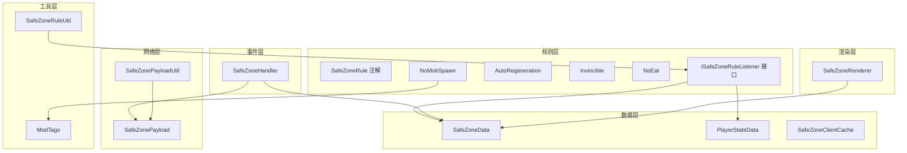
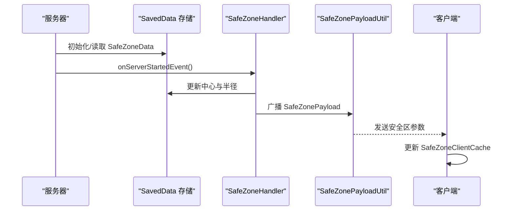
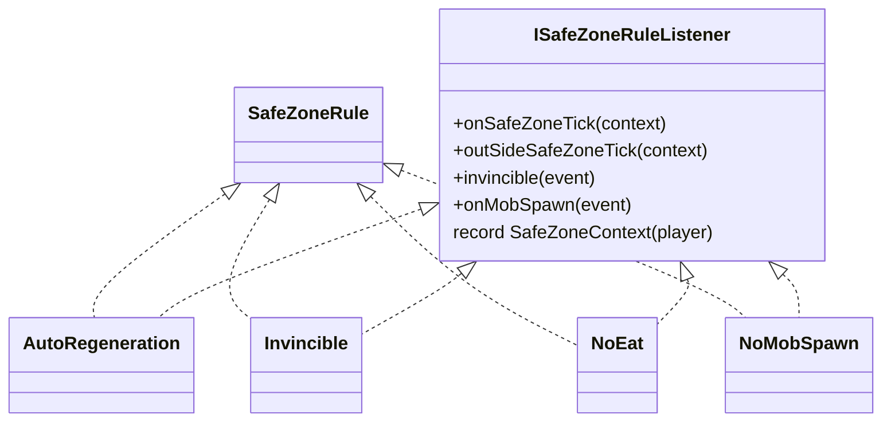
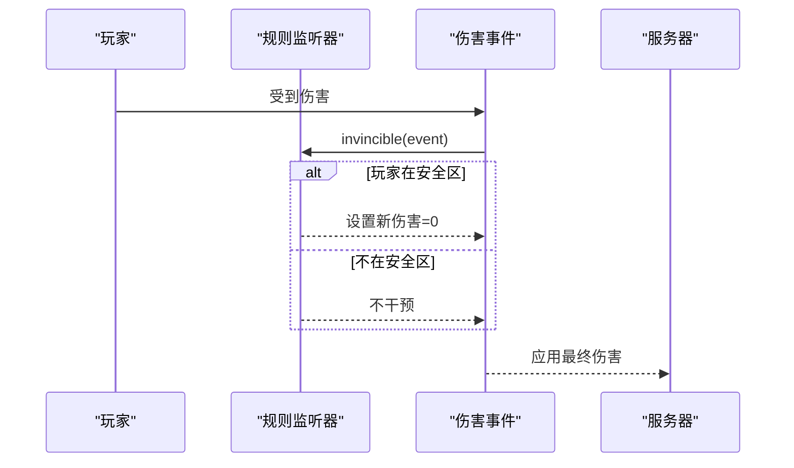
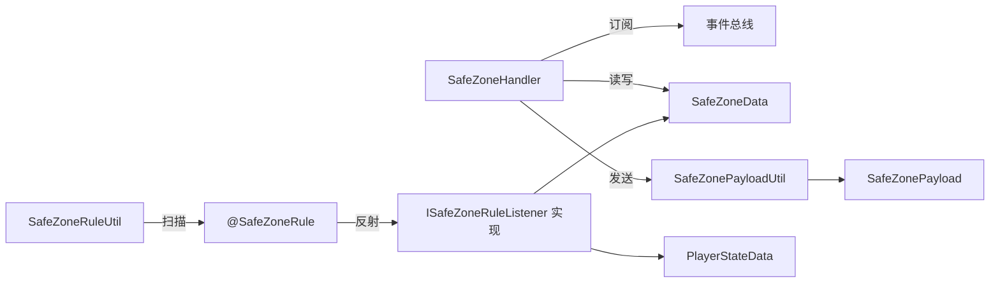

# 安全区系统

<cite>
**本文引用的文件**
- [Beyond/src/main/java/com/pz/beyond/safeZoneRule/SafeZoneRule.java](file://Beyond/src/main/java/com/pz/beyond/safeZoneRule/SafeZoneRule.java)
- [Beyond/src/main/java/com/pz/beyond/safeZoneRule/ISafeZoneRuleListener.java](file://Beyond/src/main/java/com/pz/beyond/safeZoneRule/ISafeZoneRuleListener.java)
- [Beyond/src/main/java/com/pz/beyond/data/SafeZoneData.java](file://Beyond/src/main/java/com/pz/beyond/data/SafeZoneData.java)
- [Beyond/src/main/java/com/pz/beyond/event/SafeZoneHandler.java](file://Beyond/src/main/java/com/pz/beyond/event/SafeZoneHandler.java)
- [Beyond/src/main/java/com/pz/beyond/network/SafeZonePayload.java](file://Beyond/src/main/java/com/pz/beyond/network/SafeZonePayload.java)
- [Beyond/src/main/java/com/pz/beyond/util/SafeZoneRuleUtil.java](file://Beyond/src/main/java/com/pz/beyond/util/SafeZoneRuleUtil.java)
- [Beyond/src/main/java/com/pz/beyond/data/PlayerStateData.java](file://Beyond/src/main/java/com/pz/beyond/data/PlayerStateData.java)
- [Beyond/src/main/java/com/pz/beyond/util/SafeZonePayloadUtil.java](file://Beyond/src/main/java/com/pz/beyond/util/SafeZonePayloadUtil.java)
- [Beyond/src/main/java/com/pz/beyond/renderer/SafeZoneRenderer.java](file://Beyond/src/main/java/com/pz/beyond/renderer/SafeZoneRenderer.java)
- [Beyond/src/main/java/com/pz/beyond/registry/ModTags.java](file://Beyond/src/main/java/com/pz/beyond/registry/ModTags.java)
- [Beyond/src/main/java/com/pz/beyond/data/SafeZoneClientCache.java](file://Beyond/src/main/java/com/pz/beyond/data/SafeZoneClientCache.java)
- [Beyond/src/main/java/com/pz/beyond/safeZoneRule/impl/AutoRegeneration.java](file://Beyond/src/main/java/com/pz/beyond/safeZoneRule/impl/AutoRegeneration.java)
- [Beyond/src/main/java/com/pz/beyond/safeZoneRule/impl/Invincible.java](file://Beyond/src/main/java/com/pz/beyond/safeZoneRule/impl/Invincible.java)
- [Beyond/src/main/java/com/pz/beyond/safeZoneRule/impl/NoEat.java](file://Beyond/src/main/java/com/pz/beyond/safeZoneRule/impl/NoEat.java)
- [Beyond/src/main/java/com/pz/beyond/safeZoneRule/impl/NoMobSpawn.java](file://Beyond/src/main/java/com/pz/beyond/safeZoneRule/impl/NoMobSpawn.java)
</cite>

## 目录
1. [简介](#简介)
2. [项目结构](#项目结构)
3. [核心组件](#核心组件)
4. [架构总览](#架构总览)
5. [详细组件分析](#详细组件分析)
6. [依赖关系分析](#依赖关系分析)
7. [性能考量](#性能考量)
8. [故障排除指南](#故障排除指南)
9. [结论](#结论)
10. [附录](#附录)

## 简介
本文件为“安全区系统”的技术文档，聚焦于安全区规则系统的设计原理、实现机制与扩展接口。系统以“方形安全区”为核心概念，围绕玩家状态管理、数据持久化与网络同步、事件驱动的规则执行以及与生物群系标签系统的集成，构建了可插拔的规则体系。文档同时提供 ISafeZoneRuleListener 接口的使用指南、自定义规则开发示例、与生物群系系统的集成方式及性能优化建议，并给出故障排除与调试技巧。

## 项目结构
安全区系统位于 Beyond 模块中，采用按功能域分层组织：
- 规则层：规则注解与监听器接口、内置规则实现
- 数据层：安全区数据、玩家状态数据、客户端缓存
- 事件层：服务端事件总线订阅者，负责初始化、登录同步、怪物生成拦截等
- 网络层：自定义包类型与广播工具
- 工具层：规则自动发现与注册、包发送工具
- 渲染层：预留渲染入口（当前为空）

图表来源
- [Beyond/src/main/java/com/pz/beyond/safeZoneRule/SafeZoneRule.java:1-12](file://Beyond/src/main/java/com/pz/beyond/safeZoneRule/SafeZoneRule.java#L1-L12)
- [Beyond/src/main/java/com/pz/beyond/safeZoneRule/ISafeZoneRuleListener.java:1-42](file://Beyond/src/main/java/com/pz/beyond/safeZoneRule/ISafeZoneRuleListener.java#L1-L42)
- [Beyond/src/main/java/com/pz/beyond/safeZoneRule/impl/AutoRegeneration.java:1-18](file://Beyond/src/main/java/com/pz/beyond/safeZoneRule/impl/AutoRegeneration.java#L1-L18)
- [Beyond/src/main/java/com/pz/beyond/safeZoneRule/impl/Invincible.java:1-23](file://Beyond/src/main/java/com/pz/beyond/safeZoneRule/impl/Invincible.java#L1-L23)
- [Beyond/src/main/java/com/pz/beyond/safeZoneRule/impl/NoEat.java:1-23](file://Beyond/src/main/java/com/pz/beyond/safeZoneRule/impl/NoEat.java#L1-L23)
- [Beyond/src/main/java/com/pz/beyond/safeZoneRule/impl/NoMobSpawn.java:1-29](file://Beyond/src/main/java/com/pz/beyond/safeZoneRule/impl/NoMobSpawn.java#L1-L29)
- [Beyond/src/main/java/com/pz/beyond/data/SafeZoneData.java:1-101](file://Beyond/src/main/java/com/pz/beyond/data/SafeZoneData.java#L1-L101)
- [Beyond/src/main/java/com/pz/beyond/data/PlayerStateData.java:1-65](file://Beyond/src/main/java/com/pz/beyond/data/PlayerStateData.java#L1-L65)
- [Beyond/src/main/java/com/pz/beyond/data/SafeZoneClientCache.java:1-30](file://Beyond/src/main/java/com/pz/beyond/data/SafeZoneClientCache.java#L1-L30)
- [Beyond/src/main/java/com/pz/beyond/event/SafeZoneHandler.java:1-77](file://Beyond/src/main/java/com/pz/beyond/event/SafeZoneHandler.java#L1-L77)
- [Beyond/src/main/java/com/pz/beyond/network/SafeZonePayload.java:1-31](file://Beyond/src/main/java/com/pz/beyond/network/SafeZonePayload.java#L1-L31)
- [Beyond/src/main/java/com/pz/beyond/util/SafeZonePayloadUtil.java:1-32](file://Beyond/src/main/java/com/pz/beyond/util/SafeZonePayloadUtil.java#L1-L32)
- [Beyond/src/main/java/com/pz/beyond/util/SafeZoneRuleUtil.java:1-54](file://Beyond/src/main/java/com/pz/beyond/util/SafeZoneRuleUtil.java#L1-L54)
- [Beyond/src/main/java/com/pz/beyond/registry/ModTags.java:1-17](file://Beyond/src/main/java/com/pz/beyond/registry/ModTags.java#L1-L17)
- [Beyond/src/main/java/com/pz/beyond/renderer/SafeZoneRenderer.java:1-6](file://Beyond/src/main/java/com/pz/beyond/renderer/SafeZoneRenderer.java#L1-L6)

章节来源
- [Beyond/src/main/java/com/pz/beyond/safeZoneRule/SafeZoneRule.java:1-12](file://Beyond/src/main/java/com/pz/beyond/safeZoneRule/SafeZoneRule.java#L1-L12)
- [Beyond/src/main/java/com/pz/beyond/safeZoneRule/ISafeZoneRuleListener.java:1-42](file://Beyond/src/main/java/com/pz/beyond/safeZoneRule/ISafeZoneRuleListener.java#L1-L42)
- [Beyond/src/main/java/com/pz/beyond/data/SafeZoneData.java:1-101](file://Beyond/src/main/java/com/pz/beyond/data/SafeZoneData.java#L1-L101)
- [Beyond/src/main/java/com/pz/beyond/event/SafeZoneHandler.java:1-77](file://Beyond/src/main/java/com/pz/beyond/event/SafeZoneHandler.java#L1-L77)
- [Beyond/src/main/java/com/pz/beyond/network/SafeZonePayload.java:1-31](file://Beyond/src/main/java/com/pz/beyond/network/SafeZonePayload.java#L1-L31)
- [Beyond/src/main/java/com/pz/beyond/util/SafeZoneRuleUtil.java:1-54](file://Beyond/src/main/java/com/pz/beyond/util/SafeZoneRuleUtil.java#L1-L54)
- [Beyond/src/main/java/com/pz/beyond/data/PlayerStateData.java:1-65](file://Beyond/src/main/java/com/pz/beyond/data/PlayerStateData.java#L1-L65)
- [Beyond/src/main/java/com/pz/beyond/util/SafeZonePayloadUtil.java:1-32](file://Beyond/src/main/java/com/pz/beyond/util/SafeZonePayloadUtil.java#L1-L32)
- [Beyond/src/main/java/com/pz/beyond/renderer/SafeZoneRenderer.java:1-6](file://Beyond/src/main/java/com/pz/beyond/renderer/SafeZoneRenderer.java#L1-L6)
- [Beyond/src/main/java/com/pz/beyond/registry/ModTags.java:1-17](file://Beyond/src/main/java/com/pz/beyond/registry/ModTags.java#L1-L17)
- [Beyond/src/main/java/com/pz/beyond/data/SafeZoneClientCache.java:1-30](file://Beyond/src/main/java/com/pz/beyond/data/SafeZoneClientCache.java#L1-L30)

## 核心组件
- 规则注解与监听器
  - 规则注解：用于标识可被自动发现的规则实现类
  - 监听器接口：定义安全区内/外每刻回调、伤害拦截、怪物生成拦截等扩展点
- 数据模型
  - 安全区数据：中心坐标与半径，支持更新与广播
  - 玩家状态数据：记录玩家当前所处区域状态
  - 客户端缓存：保存最近一次收到的安全区参数，供渲染或UI使用
- 事件处理器
  - 服务器启动时初始化安全区
  - 玩家登录时同步安全区数据
  - 怪物生成位置检查时触发规则
- 网络协议
  - 自定义包类型：携带安全区中心与半径
  - 广播工具：向单个或全体玩家发送安全区数据
- 工具与集成
  - 规则自动发现：基于注解扫描与反射实例化
  - 生物群系标签：通过实体类型标签控制特定生物在安全区不生成

章节来源
- [Beyond/src/main/java/com/pz/beyond/safeZoneRule/SafeZoneRule.java:1-12](file://Beyond/src/main/java/com/pz/beyond/safeZoneRule/SafeZoneRule.java#L1-L12)
- [Beyond/src/main/java/com/pz/beyond/safeZoneRule/ISafeZoneRuleListener.java:1-42](file://Beyond/src/main/java/com/pz/beyond/safeZoneRule/ISafeZoneRuleListener.java#L1-L42)
- [Beyond/src/main/java/com/pz/beyond/data/SafeZoneData.java:1-101](file://Beyond/src/main/java/com/pz/beyond/data/SafeZoneData.java#L1-L101)
- [Beyond/src/main/java/com/pz/beyond/data/PlayerStateData.java:1-65](file://Beyond/src/main/java/com/pz/beyond/data/PlayerStateData.java#L1-L65)
- [Beyond/src/main/java/com/pz/beyond/data/SafeZoneClientCache.java:1-30](file://Beyond/src/main/java/com/pz/beyond/data/SafeZoneClientCache.java#L1-L30)
- [Beyond/src/main/java/com/pz/beyond/event/SafeZoneHandler.java:1-77](file://Beyond/src/main/java/com/pz/beyond/event/SafeZoneHandler.java#L1-L77)
- [Beyond/src/main/java/com/pz/beyond/network/SafeZonePayload.java:1-31](file://Beyond/src/main/java/com/pz/beyond/network/SafeZonePayload.java#L1-L31)
- [Beyond/src/main/java/com/pz/beyond/util/SafeZonePayloadUtil.java:1-32](file://Beyond/src/main/java/com/pz/beyond/util/SafeZonePayloadUtil.java#L1-L32)
- [Beyond/src/main/java/com/pz/beyond/util/SafeZoneRuleUtil.java:1-54](file://Beyond/src/main/java/com/pz/beyond/util/SafeZoneRuleUtil.java#L1-L54)
- [Beyond/src/main/java/com/pz/beyond/registry/ModTags.java:1-17](file://Beyond/src/main/java/com/pz/beyond/registry/ModTags.java#L1-L17)

## 架构总览
系统采用“事件驱动 + 规则插件化”的架构。服务端在启动时加载安全区数据，玩家登录时进行数据同步；每刻根据玩家位置调用规则监听器；怪物生成时进行位置检查；网络层负责将安全区参数广播至客户端。

图表来源
- [Beyond/src/main/java/com/pz/beyond/event/SafeZoneHandler.java:44-52](file://Beyond/src/main/java/com/pz/beyond/event/SafeZoneHandler.java#L44-L52)
- [Beyond/src/main/java/com/pz/beyond/util/SafeZonePayloadUtil.java:26-30](file://Beyond/src/main/java/com/pz/beyond/util/SafeZonePayloadUtil.java#L26-L30)
- [Beyond/src/main/java/com/pz/beyond/network/SafeZonePayload.java:1-31](file://Beyond/src/main/java/com/pz/beyond/network/SafeZonePayload.java#L1-L31)
- [Beyond/src/main/java/com/pz/beyond/data/SafeZoneClientCache.java:1-30](file://Beyond/src/main/java/com/pz/beyond/data/SafeZoneClientCache.java#L1-L30)

## 详细组件分析

### 规则系统设计与扩展接口
- 规则注解与自动发现
  - 使用注解标记规则实现类，系统在启动阶段扫描并实例化，统一纳入规则列表
  - 通过反射确保实现类满足监听器接口约束
- 监听器接口能力
  - 安全区内/外每刻回调：用于周期性效果（如自动回血、强制饱食）
  - 伤害拦截：在伤害事件前将伤害置零，实现“无敌”
  - 怪物生成拦截：在生成位置检查阶段判定是否阻止特定实体类型生成
- 内置规则示例
  - 自动回血：每秒对处于安全区内的玩家进行少量治疗
  - 无敌：将安全区内伤害置零
  - 禁止进食：每秒重置玩家食物等级与饱和度
  - 禁止怪物生成：对特定实体类型在安全区内禁止生成

图表来源
- [Beyond/src/main/java/com/pz/beyond/safeZoneRule/SafeZoneRule.java:1-12](file://Beyond/src/main/java/com/pz/beyond/safeZoneRule/SafeZoneRule.java#L1-L12)
- [Beyond/src/main/java/com/pz/beyond/safeZoneRule/ISafeZoneRuleListener.java:1-42](file://Beyond/src/main/java/com/pz/beyond/safeZoneRule/ISafeZoneRuleListener.java#L1-L42)
- [Beyond/src/main/java/com/pz/beyond/safeZoneRule/impl/AutoRegeneration.java:1-18](file://Beyond/src/main/java/com/pz/beyond/safeZoneRule/impl/AutoRegeneration.java#L1-L18)
- [Beyond/src/main/java/com/pz/beyond/safeZoneRule/impl/Invincible.java:1-23](file://Beyond/src/main/java/com/pz/beyond/safeZoneRule/impl/Invincible.java#L1-L23)
- [Beyond/src/main/java/com/pz/beyond/safeZoneRule/impl/NoEat.java:1-23](file://Beyond/src/main/java/com/pz/beyond/safeZoneRule/impl/NoEat.java#L1-L23)
- [Beyond/src/main/java/com/pz/beyond/safeZoneRule/impl/NoMobSpawn.java:1-29](file://Beyond/src/main/java/com/pz/beyond/safeZoneRule/impl/NoMobSpawn.java#L1-L29)

章节来源
- [Beyond/src/main/java/com/pz/beyond/util/SafeZoneRuleUtil.java:1-54](file://Beyond/src/main/java/com/pz/beyond/util/SafeZoneRuleUtil.java#L1-L54)
- [Beyond/src/main/java/com/pz/beyond/safeZoneRule/ISafeZoneRuleListener.java:1-42](file://Beyond/src/main/java/com/pz/beyond/safeZoneRule/ISafeZoneRuleListener.java#L1-L42)
- [Beyond/src/main/java/com/pz/beyond/safeZoneRule/impl/AutoRegeneration.java:1-18](file://Beyond/src/main/java/com/pz/beyond/safeZoneRule/impl/AutoRegeneration.java#L1-L18)
- [Beyond/src/main/java/com/pz/beyond/safeZoneRule/impl/Invincible.java:1-23](file://Beyond/src/main/java/com/pz/beyond/safeZoneRule/impl/Invincible.java#L1-L23)
- [Beyond/src/main/java/com/pz/beyond/safeZoneRule/impl/NoEat.java:1-23](file://Beyond/src/main/java/com/pz/beyond/safeZoneRule/impl/NoEat.java#L1-L23)
- [Beyond/src/main/java/com/pz/beyond/safeZoneRule/impl/NoMobSpawn.java:1-29](file://Beyond/src/main/java/com/pz/beyond/safeZoneRule/impl/NoMobSpawn.java#L1-L29)

### 圆形安全区的定义方法
- 当前实现为“方形安全区”，由中心坐标与半径构成，判断逻辑为矩形包围
- 若需改为圆形，可在数据层与判定逻辑处替换为欧氏距离判断
- 建议保持接口不变，仅调整 isWithinSafeZone 的几何计算

章节来源
- [Beyond/src/main/java/com/pz/beyond/data/SafeZoneData.java:49-57](file://Beyond/src/main/java/com/pz/beyond/data/SafeZoneData.java#L49-L57)

### 动态规则应用机制
- 无敌（Invincible）
  - 在伤害事件前拦截，若玩家处于安全区则将伤害置零
- 禁止怪物生成（NoMobSpawn）
  - 在生成位置检查阶段，若实体类型带有特定标签且坐标在安全区内，则拒绝生成
- 禁止进食（NoEat）
  - 每秒将玩家食物等级与饱和度重置到上限
- 自动恢复（AutoRegeneration）
  - 每秒对玩家进行少量治疗

图表来源
- [Beyond/src/main/java/com/pz/beyond/safeZoneRule/impl/Invincible.java:14-21](file://Beyond/src/main/java/com/pz/beyond/safeZoneRule/impl/Invincible.java#L14-L21)
- [Beyond/src/main/java/com/pz/beyond/safeZoneRule/ISafeZoneRuleListener.java:31-31](file://Beyond/src/main/java/com/pz/beyond/safeZoneRule/ISafeZoneRuleListener.java#L31-L31)

章节来源
- [Beyond/src/main/java/com/pz/beyond/safeZoneRule/impl/Invincible.java:1-23](file://Beyond/src/main/java/com/pz/beyond/safeZoneRule/impl/Invincible.java#L1-L23)
- [Beyond/src/main/java/com/pz/beyond/safeZoneRule/impl/NoMobSpawn.java:1-29](file://Beyond/src/main/java/com/pz/beyond/safeZoneRule/impl/NoMobSpawn.java#L1-L29)
- [Beyond/src/main/java/com/pz/beyond/safeZoneRule/impl/NoEat.java:1-23](file://Beyond/src/main/java/com/pz/beyond/safeZoneRule/impl/NoEat.java#L1-L23)
- [Beyond/src/main/java/com/pz/beyond/safeZoneRule/impl/AutoRegeneration.java:1-18](file://Beyond/src/main/java/com/pz/beyond/safeZoneRule/impl/AutoRegeneration.java#L1-L18)

### 玩家状态管理
- 状态枚举：安全区内、游戏中
- 附件绑定：通过玩家附件存储状态，便于事件处理与序列化
- 位置判定：结合安全区数据与玩家坐标，决定状态变更

章节来源
- [Beyond/src/main/java/com/pz/beyond/data/PlayerStateData.java:1-65](file://Beyond/src/main/java/com/pz/beyond/data/PlayerStateData.java#L1-L65)

### 数据存储机制
- 安全区数据
  - 使用 Minecraft 的 SavedData 机制持久化中心与半径
  - 提供更新中心与半径的方法，并在变更后标记脏数据
- 客户端缓存
  - 保存最近一次收到的安全区参数，供渲染或UI使用

章节来源
- [Beyond/src/main/java/com/pz/beyond/data/SafeZoneData.java:1-101](file://Beyond/src/main/java/com/pz/beyond/data/SafeZoneData.java#L1-L101)
- [Beyond/src/main/java/com/pz/beyond/data/SafeZoneClientCache.java:1-30](file://Beyond/src/main/java/com/pz/beyond/data/SafeZoneClientCache.java#L1-L30)

### 网络同步协议
- 自定义包类型：包含中心坐标与半径
- 广播策略：支持向单个玩家或整个维度广播
- 同步时机：服务器启动初始化后与安全区参数变更时

章节来源
- [Beyond/src/main/java/com/pz/beyond/network/SafeZonePayload.java:1-31](file://Beyond/src/main/java/com/pz/beyond/network/SafeZonePayload.java#L1-L31)
- [Beyond/src/main/java/com/pz/beyond/util/SafeZonePayloadUtil.java:1-32](file://Beyond/src/main/java/com/pz/beyond/util/SafeZonePayloadUtil.java#L1-L32)
- [Beyond/src/main/java/com/pz/beyond/event/SafeZoneHandler.java:44-52](file://Beyond/src/main/java/com/pz/beyond/event/SafeZoneHandler.java#L44-L52)

### 事件处理系统
- 服务器启动事件：初始化安全区默认参数
- 玩家登录事件：向新玩家同步安全区数据
- 怪物生成事件：遍历规则列表进行拦截判定

章节来源
- [Beyond/src/main/java/com/pz/beyond/event/SafeZoneHandler.java:1-77](file://Beyond/src/main/java/com/pz/beyond/event/SafeZoneHandler.java#L1-L77)

### 与生物群系系统的集成
- 实体类型标签：通过实体类型标签标识“不在安全区生成”的生物
- 生成拦截：在生成位置检查阶段读取安全区数据并结合标签进行判定

章节来源
- [Beyond/src/main/java/com/pz/beyond/registry/ModTags.java:1-17](file://Beyond/src/main/java/com/pz/beyond/registry/ModTags.java#L1-L17)
- [Beyond/src/main/java/com/pz/beyond/safeZoneRule/impl/NoMobSpawn.java:1-29](file://Beyond/src/main/java/com/pz/beyond/safeZoneRule/impl/NoMobSpawn.java#L1-L29)

### ISafeZoneRuleListener 接口使用指南与自定义规则开发示例
- 开发步骤
  - 新建类并实现 ISafeZoneRuleListener
  - 使用规则注解标记类，使其被自动发现
  - 在需要的回调中编写业务逻辑（如每刻处理、伤害拦截、生成拦截）
  - 通过事件总线生效，无需手动注册
- 示例参考
  - 自动回血、无敌、禁止进食、禁止怪物生成均为标准实现，可作为模板

章节来源
- [Beyond/src/main/java/com/pz/beyond/util/SafeZoneRuleUtil.java:1-54](file://Beyond/src/main/java/com/pz/beyond/util/SafeZoneRuleUtil.java#L1-L54)
- [Beyond/src/main/java/com/pz/beyond/safeZoneRule/ISafeZoneRuleListener.java:1-42](file://Beyond/src/main/java/com/pz/beyond/safeZoneRule/ISafeZoneRuleListener.java#L1-L42)
- [Beyond/src/main/java/com/pz/beyond/safeZoneRule/impl/AutoRegeneration.java:1-18](file://Beyond/src/main/java/com/pz/beyond/safeZoneRule/impl/AutoRegeneration.java#L1-L18)
- [Beyond/src/main/java/com/pz/beyond/safeZoneRule/impl/Invincible.java:1-23](file://Beyond/src/main/java/com/pz/beyond/safeZoneRule/impl/Invincible.java#L1-L23)
- [Beyond/src/main/java/com/pz/beyond/safeZoneRule/impl/NoEat.java:1-23](file://Beyond/src/main/java/com/pz/beyond/safeZoneRule/impl/NoEat.java#L1-L23)
- [Beyond/src/main/java/com/pz/beyond/safeZoneRule/impl/NoMobSpawn.java:1-29](file://Beyond/src/main/java/com/pz/beyond/safeZoneRule/impl/NoMobSpawn.java#L1-L29)

## 依赖关系分析
- 规则自动发现依赖于注解扫描与反射，避免硬编码注册
- 监听器接口与具体实现松耦合，便于扩展
- 事件处理器集中管理生命周期事件，降低分散逻辑
- 网络层与数据层解耦，通过包类型传递参数

图表来源
- [Beyond/src/main/java/com/pz/beyond/util/SafeZoneRuleUtil.java:1-54](file://Beyond/src/main/java/com/pz/beyond/util/SafeZoneRuleUtil.java#L1-L54)
- [Beyond/src/main/java/com/pz/beyond/safeZoneRule/SafeZoneRule.java:1-12](file://Beyond/src/main/java/com/pz/beyond/safeZoneRule/SafeZoneRule.java#L1-L12)
- [Beyond/src/main/java/com/pz/beyond/safeZoneRule/ISafeZoneRuleListener.java:1-42](file://Beyond/src/main/java/com/pz/beyond/safeZoneRule/ISafeZoneRuleListener.java#L1-L42)
- [Beyond/src/main/java/com/pz/beyond/event/SafeZoneHandler.java:1-77](file://Beyond/src/main/java/com/pz/beyond/event/SafeZoneHandler.java#L1-L77)
- [Beyond/src/main/java/com/pz/beyond/data/SafeZoneData.java:1-101](file://Beyond/src/main/java/com/pz/beyond/data/SafeZoneData.java#L1-L101)
- [Beyond/src/main/java/com/pz/beyond/util/SafeZonePayloadUtil.java:1-32](file://Beyond/src/main/java/com/pz/beyond/util/SafeZonePayloadUtil.java#L1-L32)
- [Beyond/src/main/java/com/pz/beyond/network/SafeZonePayload.java:1-31](file://Beyond/src/main/java/com/pz/beyond/network/SafeZonePayload.java#L1-L31)
- [Beyond/src/main/java/com/pz/beyond/data/PlayerStateData.java:1-65](file://Beyond/src/main/java/com/pz/beyond/data/PlayerStateData.java#L1-L65)

## 性能考量
- 规则自动发现发生在启动阶段，避免运行时反射开销
- 每刻回调按需触发，注意在回调中避免重型计算
- 怪物生成拦截仅在生成事件发生时触发，影响面有限
- 网络广播仅在参数变更时触发，减少不必要的流量
- 建议将频繁操作（如每tick检查）合并为批量处理或使用更长间隔

## 故障排除指南
- 规则未生效
  - 检查规则类是否标注规则注解
  - 确认类实现监听器接口并通过反射可实例化
- 安全区不显示或不同步
  - 确认服务器启动事件已初始化安全区
  - 检查玩家登录事件是否发送了安全区数据
  - 核对网络包类型与广播目标
- 怪物仍在安全区生成
  - 检查实体类型标签是否正确配置
  - 确认生成拦截逻辑在对应事件中被调用
- 无敌或回血异常
  - 检查监听器回调是否在正确的事件阶段触发
  - 确认玩家状态与位置判定逻辑一致

章节来源
- [Beyond/src/main/java/com/pz/beyond/util/SafeZoneRuleUtil.java:41-44](file://Beyond/src/main/java/com/pz/beyond/util/SafeZoneRuleUtil.java#L41-L44)
- [Beyond/src/main/java/com/pz/beyond/event/SafeZoneHandler.java:44-52](file://Beyond/src/main/java/com/pz/beyond/event/SafeZoneHandler.java#L44-L52)
- [Beyond/src/main/java/com/pz/beyond/util/SafeZonePayloadUtil.java:16-30](file://Beyond/src/main/java/com/pz/beyond/util/SafeZonePayloadUtil.java#L16-L30)
- [Beyond/src/main/java/com/pz/beyond/registry/ModTags.java:1-17](file://Beyond/src/main/java/com/pz/beyond/registry/ModTags.java#L1-L17)

## 结论
安全区系统通过注解驱动的规则发现、事件驱动的执行与网络同步，构建了一个可扩展、低耦合的区域规则框架。当前实现以方形安全区为基础，可通过简单修改几何判定升级为圆形；通过标签系统与事件拦截，能够灵活控制怪物生成；通过附件与数据持久化，保证状态一致性与跨版本兼容。建议在扩展新规则时遵循现有接口与事件模式，确保系统稳定性与性能。

## 附录
- 渲染入口预留：当前为空实现，可在未来接入可视化渲染
- 客户端缓存：用于UI与渲染，避免重复网络请求

章节来源
- [Beyond/src/main/java/com/pz/beyond/renderer/SafeZoneRenderer.java:1-6](file://Beyond/src/main/java/com/pz/beyond/renderer/SafeZoneRenderer.java#L1-L6)
- [Beyond/src/main/java/com/pz/beyond/data/SafeZoneClientCache.java:1-30](file://Beyond/src/main/java/com/pz/beyond/data/SafeZoneClientCache.java#L1-L30)