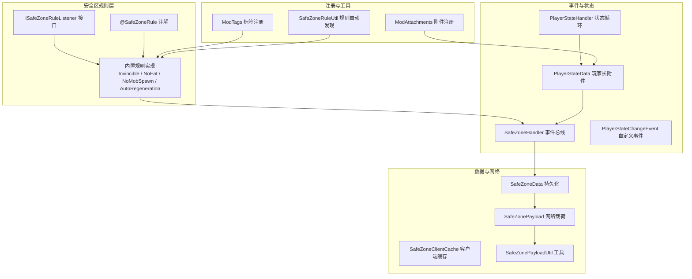
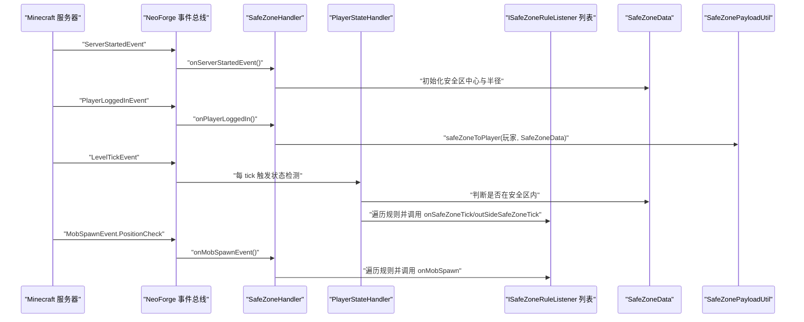
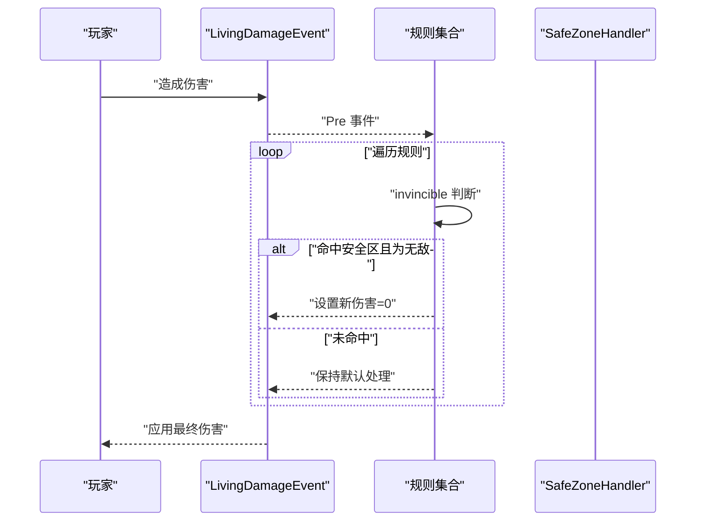
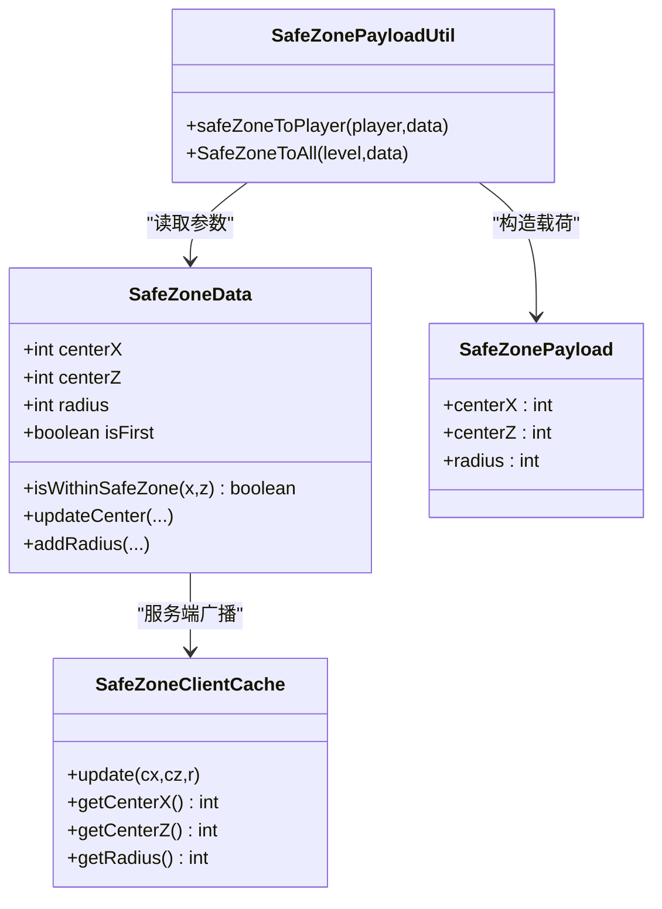
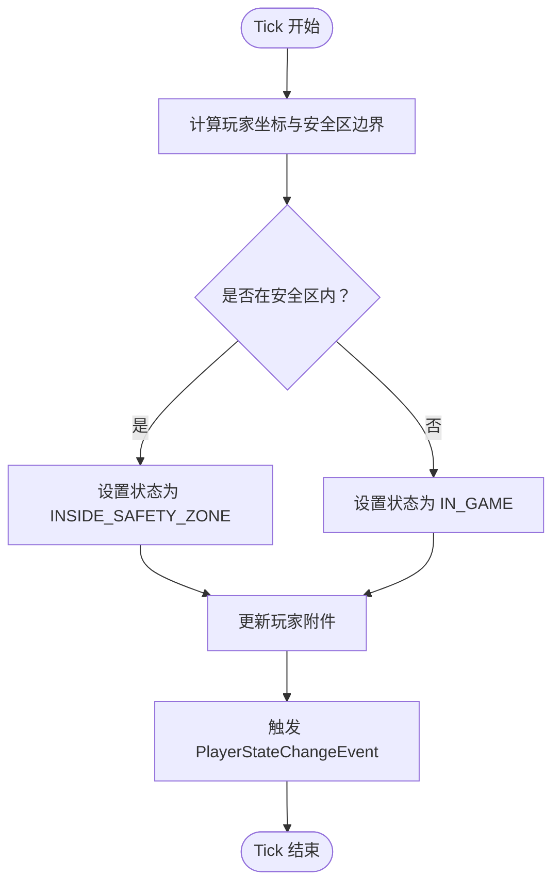
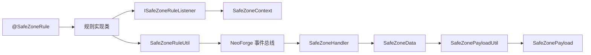

# 安全区规则系统

<cite>
**本文引用的文件**
- [ISafeZoneRuleListener.java](file://Beyond/src/main/java/com/pz/beyond/safeZoneRule/ISafeZoneRuleListener.java)
- [SafeZoneRule.java](file://Beyond/src/main/java/com/pz/beyond/safeZoneRule/SafeZoneRule.java)
- [Invincible.java](file://Beyond/src/main/java/com/pz/beyond/safeZoneRule/impl/Invincible.java)
- [NoEat.java](file://Beyond/src/main/java/com/pz/beyond/safeZoneRule/impl/NoEat.java)
- [NoMobSpawn.java](file://Beyond/src/main/java/com/pz/beyond/safeZoneRule/impl/NoMobSpawn.java)
- [AutoRegeneration.java](file://Beyond/src/main/java/com/pz/beyond/safeZoneRule/impl/AutoRegeneration.java)
- [SafeZoneData.java](file://Beyond/src/main/java/com/pz/beyond/data/SafeZoneData.java)
- [SafeZoneClientCache.java](file://Beyond/src/main/java/com/pz/beyond/data/SafeZoneClientCache.java)
- [PlayerStateData.java](file://Beyond/src/main/java/com/pz/beyond/data/PlayerStateData.java)
- [SafeZoneHandler.java](file://Beyond/src/main/java/com/pz/beyond/event/SafeZoneHandler.java)
- [PlayerStateHandler.java](file://Beyond/src/main/java/com/pz/beyond/event/PlayerStateHandler.java)
- [PlayerStateChangeEvent.java](file://Beyond/src/main/java/com/pz/beyond/event/custom/PlayerStateChangeEvent.java)
- [SafeZonePayload.java](file://Beyond/src/main/java/com/pz/beyond/network/SafeZonePayload.java)
- [SafeZonePayloadUtil.java](file://Beyond/src/main/java/com/pz/beyond/util/SafeZonePayloadUtil.java)
- [ModTags.java](file://Beyond/src/main/java/com/pz/beyond/registry/ModTags.java)
- [ModAttachments.java](file://Beyond/src/main/java/com/pz/beyond/registry/ModAttachments.java)
- [SafeZoneRuleUtil.java](file://Beyond/src/main/java/com/pz/beyond/util/SafeZoneRuleUtil.java)
</cite>

## 目录
1. [简介](#简介)
2. [项目结构](#项目结构)
3. [核心组件](#核心组件)
4. [架构总览](#架构总览)
5. [详细组件分析](#详细组件分析)
6. [依赖分析](#依赖分析)
7. [性能考虑](#性能考虑)
8. [故障排查指南](#故障排查指南)
9. [结论](#结论)
10. [附录](#附录)

## 简介
本文件为“安全区规则系统”的深度技术文档，围绕 ISafeZoneRuleListener 接口设计、SafeZoneContext 上下文作用与生命周期、四大内置规则（无敌、禁止进食、禁止怪物生成、自动恢复）的工作原理与触发条件进行系统性阐述。文档还覆盖规则注册机制、优先级与冲突处理策略、与游戏事件系统的集成（LivingDamageEvent、MobSpawnEvent）、性能优化建议以及常见问题解决方案，并提供自定义安全区规则的开发指南与最佳实践。

## 项目结构
安全区规则系统位于 Beyond 模块中，采用按功能域分层组织：
- safeZoneRule：规则接口与内置实现
- data：持久化与客户端缓存数据
- event：事件总线与状态切换处理
- network：自定义网络载荷
- registry：附件与标签注册
- util：规则自动发现与网络载荷工具

图表来源
- [ISafeZoneRuleListener.java:1-42](file://Beyond/src/main/java/com/pz/beyond/safeZoneRule/ISafeZoneRuleListener.java#L1-L42)
- [SafeZoneRule.java:1-12](file://Beyond/src/main/java/com/pz/beyond/safeZoneRule/SafeZoneRule.java#L1-L12)
- [Invincible.java:1-23](file://Beyond/src/main/java/com/pz/beyond/safeZoneRule/impl/Invincible.java#L1-L23)
- [NoEat.java:1-23](file://Beyond/src/main/java/com/pz/beyond/safeZoneRule/impl/NoEat.java#L1-L23)
- [NoMobSpawn.java:1-29](file://Beyond/src/main/java/com/pz/beyond/safeZoneRule/impl/NoMobSpawn.java#L1-L29)
- [AutoRegeneration.java:1-18](file://Beyond/src/main/java/com/pz/beyond/safeZoneRule/impl/AutoRegeneration.java#L1-L18)
- [SafeZoneData.java:1-101](file://Beyond/src/main/java/com/pz/beyond/data/SafeZoneData.java#L1-L101)
- [SafeZoneClientCache.java:1-30](file://Beyond/src/main/java/com/pz/beyond/data/SafeZoneClientCache.java#L1-L30)
- [SafeZonePayload.java:1-31](file://Beyond/src/main/java/com/pz/beyond/network/SafeZonePayload.java#L1-L31)
- [SafeZonePayloadUtil.java:1-32](file://Beyond/src/main/java/com/pz/beyond/util/SafeZonePayloadUtil.java#L1-L32)
- [SafeZoneHandler.java:1-77](file://Beyond/src/main/java/com/pz/beyond/event/SafeZoneHandler.java#L1-L77)
- [PlayerStateHandler.java](file://Beyond/src/main/java/com/pz/beyond/event/PlayerStateHandler.java)
- [PlayerStateData.java:1-65](file://Beyond/src/main/java/com/pz/beyond/data/PlayerStateData.java#L1-L65)
- [PlayerStateChangeEvent.java:1-70](file://Beyond/src/main/java/com/pz/beyond/event/custom/PlayerStateChangeEvent.java#L1-L70)
- [ModTags.java:1-17](file://Beyond/src/main/java/com/pz/beyond/registry/ModTags.java#L1-L17)
- [ModAttachments.java:1-22](file://Beyond/src/main/java/com/pz/beyond/registry/ModAttachments.java#L1-L22)
- [SafeZoneRuleUtil.java:1-54](file://Beyond/src/main/java/com/pz/beyond/util/SafeZoneRuleUtil.java#L1-L54)

章节来源
- [ISafeZoneRuleListener.java:1-42](file://Beyond/src/main/java/com/pz/beyond/safeZoneRule/ISafeZoneRuleListener.java#L1-L42)
- [SafeZoneRule.java:1-12](file://Beyond/src/main/java/com/pz/beyond/safeZoneRule/SafeZoneRule.java#L1-L12)
- [SafeZoneData.java:1-101](file://Beyond/src/main/java/com/pz/beyond/data/SafeZoneData.java#L1-L101)
- [SafeZoneHandler.java:1-77](file://Beyond/src/main/java/com/pz/beyond/event/SafeZoneHandler.java#L1-L77)
- [PlayerStateHandler.java](file://Beyond/src/main/java/com/pz/beyond/event/PlayerStateHandler.java)

## 核心组件
- ISafeZoneRuleListener：定义安全区内/外每 tick 的回调、无敌与怪物生成拦截等扩展点；提供 SafeZoneContext 上下文封装。
- @SafeZoneRule：规则注解，用于自动发现与实例化。
- 四大内置规则：
  - 无敌：在安全区内将伤害归零。
  - 禁止进食：在安全区内每秒重置饥饿与饱和度。
  - 禁止怪物生成：基于标签过滤，在安全区内阻止特定怪物生成。
  - 自动恢复：在安全区内每秒回血。
- 数据与网络：
  - SafeZoneData：安全区中心与半径的持久化。
  - SafeZoneClientCache：客户端缓存，用于渲染与显示。
  - SafeZonePayload/SafeZonePayloadUtil：服务端向客户端广播安全区参数。
- 事件与状态：
  - SafeZoneHandler：服务器启动、玩家登录、怪物生成位置检查等事件处理。
  - PlayerStateHandler：每 tick 检测玩家是否在安全区内并执行对应规则。
  - PlayerStateData：记录玩家当前状态（在安全区内/游戏中），作为规则执行的依据。
  - PlayerStateChangeEvent：状态变更事件，支持取消。
- 注册与工具：
  - ModTags：注册实体类型标签，用于筛选“不可进入安全区的怪物”。
  - ModAttachments：注册玩家附件，持久化玩家状态。
  - SafeZoneRuleUtil：通过 NeoForge 扫描 SPI 数据自动发现并实例化规则。

章节来源
- [ISafeZoneRuleListener.java:13-41](file://Beyond/src/main/java/com/pz/beyond/safeZoneRule/ISafeZoneRuleListener.java#L13-L41)
- [SafeZoneRule.java:8-11](file://Beyond/src/main/java/com/pz/beyond/safeZoneRule/SafeZoneRule.java#L8-L11)
- [SafeZoneData.java:16-100](file://Beyond/src/main/java/com/pz/beyond/data/SafeZoneData.java#L16-L100)
- [SafeZoneClientCache.java:6-29](file://Beyond/src/main/java/com/pz/beyond/data/SafeZoneClientCache.java#L6-L29)
- [SafeZonePayload.java:10-30](file://Beyond/src/main/java/com/pz/beyond/network/SafeZonePayload.java#L10-L30)
- [SafeZonePayloadUtil.java:9-31](file://Beyond/src/main/java/com/pz/beyond/util/SafeZonePayloadUtil.java#L9-L31)
- [SafeZoneHandler.java:35-76](file://Beyond/src/main/java/com/pz/beyond/event/SafeZoneHandler.java#L35-L76)
- [PlayerStateHandler.java](file://Beyond/src/main/java/com/pz/beyond/event/PlayerStateHandler.java)
- [PlayerStateData.java:13-64](file://Beyond/src/main/java/com/pz/beyond/data/PlayerStateData.java#L13-L64)
- [PlayerStateChangeEvent.java:15-69](file://Beyond/src/main/java/com/pz/beyond/event/custom/PlayerStateChangeEvent.java#L15-L69)
- [ModTags.java:9-16](file://Beyond/src/main/java/com/pz/beyond/registry/ModTags.java#L9-L16)
- [ModAttachments.java:11-21](file://Beyond/src/main/java/com/pz/beyond/registry/ModAttachments.java#L11-L21)
- [SafeZoneRuleUtil.java:11-53](file://Beyond/src/main/java/com/pz/beyond/util/SafeZoneRuleUtil.java#L11-L53)

## 架构总览
安全区规则系统通过事件驱动与附件持久化实现：
- 事件总线负责捕获关键游戏事件（服务器启动、玩家登录、怪物生成位置检查、玩家每 tick 状态检测）。
- PlayerStateData 作为玩家附件保存状态，决定规则在“安全区内/安全区外”的分支执行。
- SafeZoneData 持久化安全区几何信息，SafeZonePayloadUtil 将其广播至客户端。
- @SafeZoneRule 注解与 SafeZoneRuleUtil 实现规则的自动发现与实例化，形成可插拔的规则体系。

图表来源
- [SafeZoneHandler.java:44-75](file://Beyond/src/main/java/com/pz/beyond/event/SafeZoneHandler.java#L44-L75)
- [PlayerStateHandler.java](file://Beyond/src/main/java/com/pz/beyond/event/PlayerStateHandler.java)
- [SafeZoneData.java:49-57](file://Beyond/src/main/java/com/pz/beyond/data/SafeZoneData.java#L49-L57)
- [SafeZonePayloadUtil.java:16-30](file://Beyond/src/main/java/com/pz/beyond/util/SafeZonePayloadUtil.java#L16-L30)
- [SafeZoneRuleUtil.java:13-48](file://Beyond/src/main/java/com/pz/beyond/util/SafeZoneRuleUtil.java#L13-L48)

## 详细组件分析

### ISafeZoneRuleListener 接口与 SafeZoneContext
- 设计理念
  - 通过默认方法提供可选的 tick 回调与事件拦截能力，便于不同规则按需实现。
  - 提供 SafeZoneContext 封装当前玩家，避免规则实现直接依赖具体平台 API。
- 生命周期
  - SafeZoneContext 仅在规则回调时存在，不跨帧持久化。
  - 规则实例由 SafeZoneRuleUtil 在启动阶段自动收集，贯穿整个运行期。
- 关键方法
  - onSafeZoneTick/outSideSafeZoneTick：分别在安全区内/外每 tick 调用。
  - invincible：拦截 LivingDamageEvent.Pre，实现伤害归零。
  - onMobSpawn：拦截 MobSpawnEvent.PositionCheck，实现生成失败判定。

章节来源
- [ISafeZoneRuleListener.java:13-41](file://Beyond/src/main/java/com/pz/beyond/safeZoneRule/ISafeZoneRuleListener.java#L13-L41)
- [SafeZoneRuleUtil.java:11-53](file://Beyond/src/main/java/com/pz/beyond/util/SafeZoneRuleUtil.java#L11-L53)

### 四大内置规则工作原理与触发条件

#### 无敌规则（Invincible）
- 触发条件
  - 玩家处于安全区内（通过 PlayerStateData 判断）。
- 处理逻辑
  - 在 LivingDamageEvent.Pre 中读取玩家附件中的状态，若为安全区内则将新伤害设置为 0。
- 性能要点
  - 仅在伤害事件发生时短路径判断，开销极低。

章节来源
- [Invincible.java:10-22](file://Beyond/src/main/java/com/pz/beyond/safeZoneRule/impl/Invincible.java#L10-L22)
- [PlayerStateData.java:31-37](file://Beyond/src/main/java/com/pz/beyond/data/PlayerStateData.java#L31-L37)

#### 禁止进食规则（NoEat）
- 触发条件
  - 玩家处于安全区内。
- 处理逻辑
  - 每 20 个 tick（约 1 秒）重置玩家饥饿度与饱和度至最大值。
- 性能要点
  - 使用 tick 计数取模，避免每帧重复写入。

章节来源
- [NoEat.java:10-22](file://Beyond/src/main/java/com/pz/beyond/safeZoneRule/impl/NoEat.java#L10-L22)

#### 禁止怪物生成规则（NoMobSpawn）
- 触发条件
  - 生成位置检查事件（PositionCheck）发生。
- 处理逻辑
  - 从世界数据中获取 SafeZoneData，查询实体类型是否在“不可进入安全区”标签内，若是且坐标在安全区内，则拒绝生成。
- 性能要点
  - 仅在生成尝试时检查，避免全局扫描。

章节来源
- [NoMobSpawn.java:12-28](file://Beyond/src/main/java/com/pz/beyond/safeZoneRule/impl/NoMobSpawn.java#L12-L28)
- [ModTags.java:9-16](file://Beyond/src/main/java/com/pz/beyond/registry/ModTags.java#L9-L16)
- [SafeZoneData.java:49-57](file://Beyond/src/main/java/com/pz/beyond/data/SafeZoneData.java#L49-L57)

#### 自动恢复规则（AutoRegeneration）
- 触发条件
  - 玩家处于安全区内。
- 处理逻辑
  - 每 20 个 tick 对玩家进行少量治疗，维持或提升生命值。
- 性能要点
  - 治疗频率与原版自然恢复一致，兼顾体验与性能。

章节来源
- [AutoRegeneration.java:7-17](file://Beyond/src/main/java/com/pz/beyond/safeZoneRule/impl/AutoRegeneration.java#L7-L17)

### 规则注册机制、优先级与冲突解决
- 注册机制
  - 通过 @SafeZoneRule 注解标记规则类，SafeZoneRuleUtil 在启动阶段扫描所有模组的注解数据，使用反射实例化并加入运行时列表。
- 优先级与顺序
  - 当前实现未显式声明优先级，规则遍历顺序即为注册顺序。
- 冲突解决策略
  - 事件拦截型规则（如 invincible、onMobSpawn）采用“首个拒绝即失败”的策略：任一规则返回拒绝结果，即可阻止事件继续传播。
  - 行为叠加型规则（如 NoEat、AutoRegeneration）按各自逻辑独立生效，彼此不互相覆盖，但可能在效果上产生叠加或竞争（例如同时限制饥饿与回血）。

章节来源
- [SafeZoneRuleUtil.java:13-48](file://Beyond/src/main/java/com/pz/beyond/util/SafeZoneRuleUtil.java#L13-L48)
- [SafeZoneHandler.java:70-75](file://Beyond/src/main/java/com/pz/beyond/event/SafeZoneHandler.java#L70-L75)

### 与游戏事件系统的集成
- LivingDamageEvent（伤害事件）
  - 规则通过拦截 Pre 阶段修改伤害值，实现无敌效果。
- MobSpawnEvent.PositionCheck（怪物生成位置检查）
  - 规则在生成尝试阶段根据安全区与标签进行拒绝，实现禁止生成。
- 状态切换与 Tick 循环
  - PlayerStateHandler 每 tick 检查玩家坐标与安全区边界，更新 PlayerStateData，并据此调用 onSafeZoneTick/outSideSafeZoneTick。

图表来源
- [Invincible.java:13-21](file://Beyond/src/main/java/com/pz/beyond/safeZoneRule/impl/Invincible.java#L13-L21)
- [SafeZoneHandler.java:70-75](file://Beyond/src/main/java/com/pz/beyond/event/SafeZoneHandler.java#L70-L75)

章节来源
- [PlayerStateHandler.java](file://Beyond/src/main/java/com/pz/beyond/event/PlayerStateHandler.java)
- [SafeZoneHandler.java:70-75](file://Beyond/src/main/java/com/pz/beyond/event/SafeZoneHandler.java#L70-L75)

### SafeZoneContext 上下文的作用与生命周期
- 作用
  - 将玩家对象封装为 SafeZoneContext，传递给 onSafeZoneTick/outSideSafeZoneTick，避免规则实现直接依赖平台 API。
- 生命周期
  - 仅在回调发生时存在，随事件/Tick 流程短暂存活，不跨帧持久化。

章节来源
- [ISafeZoneRuleListener.java:39-39](file://Beyond/src/main/java/com/pz/beyond/safeZoneRule/ISafeZoneRuleListener.java#L39-L39)

### 数据模型与网络同步
- SafeZoneData
  - 存储安全区中心坐标与半径，提供 isWithinSafeZone 判定。
  - 支持动态更新中心与半径，并通过 SafeZonePayloadUtil 广播给所有在线玩家。
- SafeZoneClientCache
  - 客户端侧缓存安全区参数，用于渲染与 UI 显示。
- SafeZonePayload/SafeZonePayloadUtil
  - 自定义网络载荷，序列化中心与半径，使用 PacketDistributor 广播。

图表来源
- [SafeZoneData.java:16-100](file://Beyond/src/main/java/com/pz/beyond/data/SafeZoneData.java#L16-L100)
- [SafeZoneClientCache.java:6-29](file://Beyond/src/main/java/com/pz/beyond/data/SafeZoneClientCache.java#L6-L29)
- [SafeZonePayload.java:10-30](file://Beyond/src/main/java/com/pz/beyond/network/SafeZonePayload.java#L10-L30)
- [SafeZonePayloadUtil.java:9-31](file://Beyond/src/main/java/com/pz/beyond/util/SafeZonePayloadUtil.java#L9-L31)

章节来源
- [SafeZoneData.java:16-100](file://Beyond/src/main/java/com/pz/beyond/data/SafeZoneData.java#L16-L100)
- [SafeZoneClientCache.java:6-29](file://Beyond/src/main/java/com/pz/beyond/data/SafeZoneClientCache.java#L6-L29)
- [SafeZonePayload.java:10-30](file://Beyond/src/main/java/com/pz/beyond/network/SafeZonePayload.java#L10-L30)
- [SafeZonePayloadUtil.java:9-31](file://Beyond/src/main/java/com/pz/beyond/util/SafeZonePayloadUtil.java#L9-L31)

### 状态管理与事件流
- 状态枚举
  - INSIDE_SAFETY_ZONE：在安全区内
  - IN_GAME：在游戏场景中（非安全区）
- 状态切换流程
  - 每 tick 检查玩家坐标与 SafeZoneData 边界，若状态变化则更新附件并广播事件。
- 事件取消
  - PlayerStateChangeEvent 支持取消，允许外部拦截状态变更。

图表来源
- [PlayerStateHandler.java](file://Beyond/src/main/java/com/pz/beyond/event/PlayerStateHandler.java)
- [PlayerStateData.java:46-61](file://Beyond/src/main/java/com/pz/beyond/data/PlayerStateData.java#L46-L61)
- [PlayerStateChangeEvent.java:15-69](file://Beyond/src/main/java/com/pz/beyond/event/custom/PlayerStateChangeEvent.java#L15-L69)

章节来源
- [PlayerStateData.java:13-64](file://Beyond/src/main/java/com/pz/beyond/data/PlayerStateData.java#L13-L64)
- [PlayerStateChangeEvent.java:15-69](file://Beyond/src/main/java/com/pz/beyond/event/custom/PlayerStateChangeEvent.java#L15-L69)

## 依赖分析
- 组件耦合
  - 规则实现仅依赖 ISafeZoneRuleListener 接口与 SafeZoneContext，耦合度低。
  - SafeZoneHandler 与 SafeZoneRuleUtil 之间为使用关系，无直接继承或组合。
- 外部依赖
  - NeoForge 事件总线与附件系统。
  - Minecraft 服务器与 Level/SavedData 机制。
- 潜在循环依赖
  - 未见直接循环依赖；规则通过事件回调间接交互，属于松耦合。

图表来源
- [SafeZoneRule.java:8-11](file://Beyond/src/main/java/com/pz/beyond/safeZoneRule/SafeZoneRule.java#L8-L11)
- [SafeZoneRuleUtil.java:13-48](file://Beyond/src/main/java/com/pz/beyond/util/SafeZoneRuleUtil.java#L13-L48)
- [ISafeZoneRuleListener.java:13-41](file://Beyond/src/main/java/com/pz/beyond/safeZoneRule/ISafeZoneRuleListener.java#L13-L41)
- [SafeZoneHandler.java:35-76](file://Beyond/src/main/java/com/pz/beyond/event/SafeZoneHandler.java#L35-L76)
- [SafeZoneData.java:16-100](file://Beyond/src/main/java/com/pz/beyond/data/SafeZoneData.java#L16-L100)
- [SafeZonePayloadUtil.java:9-31](file://Beyond/src/main/java/com/pz/beyond/util/SafeZonePayloadUtil.java#L9-L31)
- [SafeZonePayload.java:10-30](file://Beyond/src/main/java/com/pz/beyond/network/SafeZonePayload.java#L10-L30)

章节来源
- [SafeZoneRuleUtil.java:11-53](file://Beyond/src/main/java/com/pz/beyond/util/SafeZoneRuleUtil.java#L11-L53)
- [SafeZoneHandler.java:35-76](file://Beyond/src/main/java/com/pz/beyond/event/SafeZoneHandler.java#L35-L76)

## 性能考虑
- 规则遍历
  - 每 tick 遍历规则列表，建议控制规则数量与复杂度；对高频事件（如伤害、生成）的规则应尽量短路返回。
- 周期性操作
  - NoEat 与 AutoRegeneration 使用 tick 取模，避免每帧写入，降低开销。
- 事件拦截
  - 仅在必要事件发生时进行判断，减少不必要的计算。
- 网络广播
  - SafeZonePayloadUtil 仅在安全区参数变化时广播，避免频繁网络传输。

## 故障排查指南
- 规则未生效
  - 检查是否正确标注 @SafeZoneRule 且类实现 ISafeZoneRuleListener。
  - 确认 SafeZoneRuleUtil 是否在启动阶段完成扫描与实例化。
- 无敌无效
  - 确认玩家状态为 INSIDE_SAFETY_ZONE，且事件确实在 Pre 阶段被拦截。
- 禁止生成未生效
  - 检查实体类型是否正确注册到 ModTags.NO_SAFE_ZONE_SPAWN 标签。
- 客户端显示异常
  - 确认 SafeZonePayloadUtil 已将最新数据广播给客户端，客户端缓存已更新。
- 状态切换异常
  - 检查 PlayerStateHandler 的坐标判定与 SafeZoneData 的边界计算。

章节来源
- [SafeZoneRuleUtil.java:13-48](file://Beyond/src/main/java/com/pz/beyond/util/SafeZoneRuleUtil.java#L13-L48)
- [Invincible.java:13-21](file://Beyond/src/main/java/com/pz/beyond/safeZoneRule/impl/Invincible.java#L13-L21)
- [NoMobSpawn.java:16-26](file://Beyond/src/main/java/com/pz/beyond/safeZoneRule/impl/NoMobSpawn.java#L16-L26)
- [SafeZonePayloadUtil.java:16-30](file://Beyond/src/main/java/com/pz/beyond/util/SafeZonePayloadUtil.java#L16-L30)
- [PlayerStateHandler.java](file://Beyond/src/main/java/com/pz/beyond/event/PlayerStateHandler.java)

## 结论
安全区规则系统通过清晰的接口抽象、事件驱动与附件持久化，构建了可扩展、低耦合的安全区行为框架。四大内置规则覆盖伤害、饥饿、生成与回血等核心玩法需求；通过 @SafeZoneRule 与 SafeZoneRuleUtil 实现规则的自动发现与实例化，具备良好的可维护性与扩展性。建议在自定义规则开发中遵循短路判断、周期性操作与事件拦截的最佳实践，以获得稳定且高性能的行为表现。

## 附录

### 自定义安全区规则开发指南
- 实现步骤
  - 新建类并实现 ISafeZoneRuleListener。
  - 使用 @SafeZoneRule 注解类，确保被 SafeZoneRuleUtil 扫描到。
  - 在需要的回调中实现业务逻辑（如 onSafeZoneTick/outSideSafeZoneTick、invincible、onMobSpawn）。
- 最佳实践
  - 事件拦截类规则应尽早返回，避免多余计算。
  - 周期性操作使用 tick 取模，控制频率。
  - 不要直接依赖平台 API，统一通过 SafeZoneContext 获取上下文信息。
  - 若涉及标签过滤，参考 NoMobSpawn 的方式注册并使用 ModTags。
- 示例参考
  - 无敌规则：[Invincible.java:10-22](file://Beyond/src/main/java/com/pz/beyond/safeZoneRule/impl/Invincible.java#L10-L22)
  - 禁止进食规则：[NoEat.java:12-21](file://Beyond/src/main/java/com/pz/beyond/safeZoneRule/impl/NoEat.java#L12-L21)
  - 禁止怪物生成规则：[NoMobSpawn.java:15-26](file://Beyond/src/main/java/com/pz/beyond/safeZoneRule/impl/NoMobSpawn.java#L15-L26)
  - 自动恢复规则：[AutoRegeneration.java:10-16](file://Beyond/src/main/java/com/pz/beyond/safeZoneRule/impl/AutoRegeneration.java#L10-L16)

章节来源
- [ISafeZoneRuleListener.java:13-41](file://Beyond/src/main/java/com/pz/beyond/safeZoneRule/ISafeZoneRuleListener.java#L13-L41)
- [SafeZoneRule.java:8-11](file://Beyond/src/main/java/com/pz/beyond/safeZoneRule/SafeZoneRule.java#L8-L11)
- [ModTags.java:9-16](file://Beyond/src/main/java/com/pz/beyond/registry/ModTags.java#L9-L16)
- [SafeZoneRuleUtil.java:13-48](file://Beyond/src/main/java/com/pz/beyond/util/SafeZoneRuleUtil.java#L13-L48)