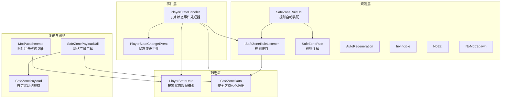
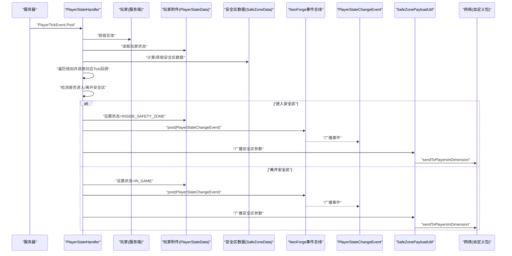
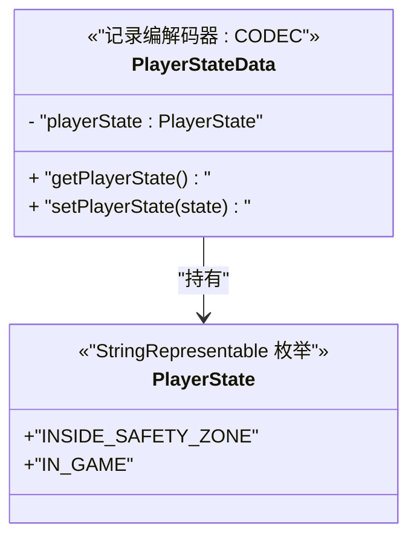
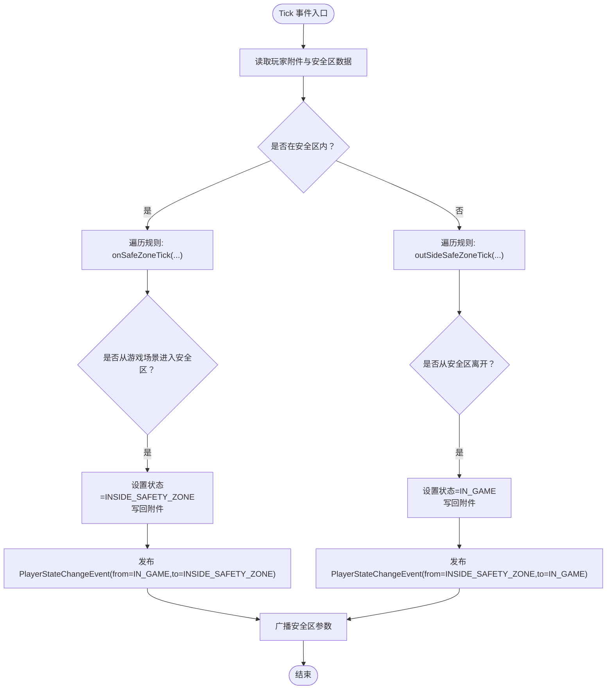
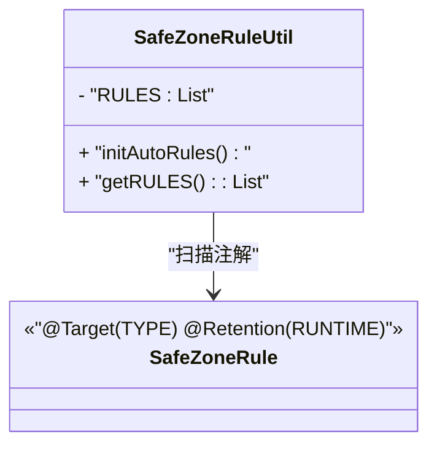
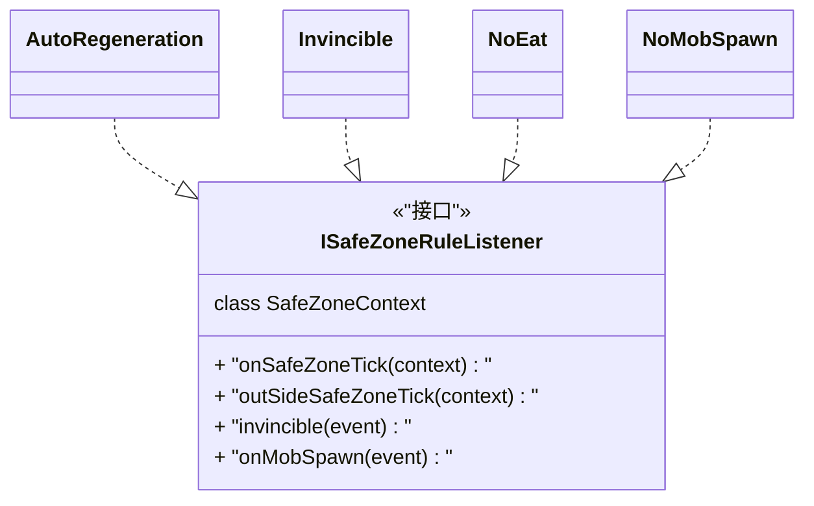
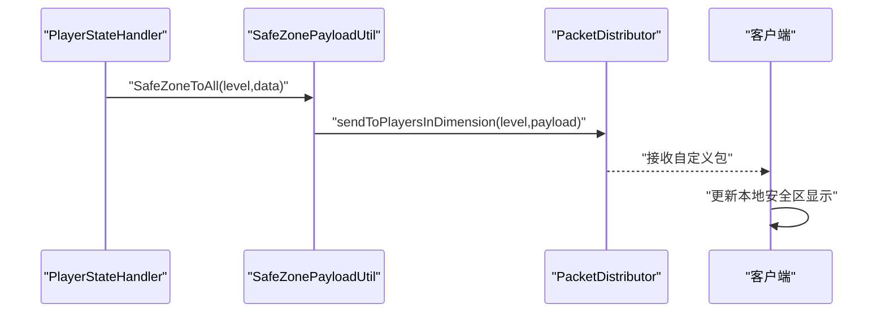
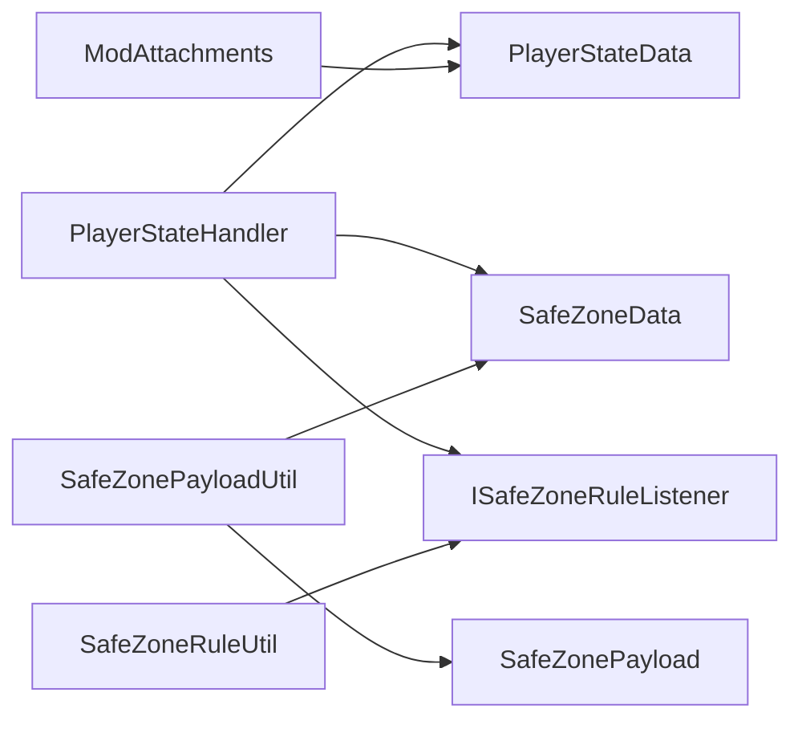

# 玩家状态管理

<cite>
**本文引用的文件**
- [Beyond.java](file://Beyond/Beyond.java)
- [ModAttachments.java](file://Beyond/src/main/java/com/pz/beyond/registry/ModAttachments.java)
- [PlayerStateData.java](file://Beyond/src/main/java/com/pz/beyond/data/PlayerStateData.java)
- [PlayerStateHandler.java](file://Beyond/src/main/java/com/pz/beyond/event/PlayerStateHandler.java)
- [PlayerStateChangeEvent.java](file://Beyond/src/main/java/com/pz/beyond/event/custom/PlayerStateChangeEvent.java)
- [SafeZoneData.java](file://Beyond/src/main/java/com/pz/beyond/data/SafeZoneData.java)
- [SafeZoneRuleUtil.java](file://Beyond/src/main/java/com/pz/beyond/util/SafeZoneRuleUtil.java)
- [ISafeZoneRuleListener.java](file://Beyond/src/main/java/com/pz/beyond/safeZoneRule/ISafeZoneRuleListener.java)
- [SafeZoneRule.java](file://Beyond/src/main/java/com/pz/beyond/safeZoneRule/SafeZoneRule.java)
- [SafeZonePayload.java](file://Beyond/src/main/java/com/pz/beyond/network/SafeZonePayload.java)
- [SafeZonePayloadUtil.java](file://Beyond/src/main/java/com/pz/beyond/util/SafeZonePayloadUtil.java)
- [AutoRegeneration.java](file://Beyond/src/main/java/com/pz/beyond/safeZoneRule/impl/AutoRegeneration.java)
- [Invincible.java](file://Beyond/src/main/java/com/pz/beyond/safeZoneRule/impl/Invincible.java)
- [NoEat.java](file://Beyond/src/main/java/com/pz/beyond/safeZoneRule/impl/NoEat.java)
- [NoMobSpawn.java](file://Beyond/src/main/java/com/pz/beyond/safeZoneRule/impl/NoMobSpawn.java)
</cite>

## 目录
1. [简介](#简介)
2. [项目结构](#项目结构)
3. [核心组件](#核心组件)
4. [架构总览](#架构总览)
5. [详细组件分析](#详细组件分析)
6. [依赖分析](#依赖分析)
7. [性能考虑](#性能考虑)
8. [故障排查指南](#故障排查指南)
9. [结论](#结论)
10. [附录](#附录)

## 简介
本文件面向“Beyond”模块中的玩家状态管理系统，围绕以下目标展开：深入解析 PlayerStateData 数据模型的设计与实现（存储结构、序列化/反序列化、生命周期）、PlayerStateHandler 事件处理器的工作原理（状态变更检测、事件传播与响应）、SafeZoneRuleUtil 工具类的自动发现与装配机制、以及与网络包系统的集成方式。同时提供最佳实践建议（内存优化、性能监控、错误处理）与持久化与迁移思路。

## 项目结构
本模块采用按功能域分层组织：数据层（PlayerStateData、SafeZoneData）、事件层（PlayerStateHandler、自定义事件）、规则层（ISafeZoneRuleListener 及其实现）、注册与网络层（ModAttachments、SafeZonePayloadUtil、SafeZonePayload），并通过注解驱动的自动装配完成规则的动态加载。

图表来源
- [Beyond.java:62-65](file://Beyond/Beyond.java#L62-L65)
- [ModAttachments.java:16-20](file://Beyond/src/main/java/com/pz/beyond/registry/ModAttachments.java#L16-L20)
- [PlayerStateData.java:25-28](file://Beyond/src/main/java/com/pz/beyond/data/PlayerStateData.java#L25-L28)
- [PlayerStateHandler.java:24-66](file://Beyond/src/main/java/com/pz/beyond/event/PlayerStateHandler.java#L24-L66)
- [SafeZoneData.java:39-46](file://Beyond/src/main/java/com/pz/beyond/data/SafeZoneData.java#L39-L46)
- [SafeZoneRuleUtil.java:13-48](file://Beyond/src/main/java/com/pz/beyond/util/SafeZoneRuleUtil.java#L13-L48)
- [ISafeZoneRuleListener.java:13-39](file://Beyond/src/main/java/com/pz/beyond/safeZoneRule/ISafeZoneRuleListener.java#L13-L39)
- [SafeZonePayloadUtil.java:26-30](file://Beyond/src/main/java/com/pz/beyond/util/SafeZonePayloadUtil.java#L26-L30)
- [SafeZonePayload.java:10-29](file://Beyond/src/main/java/com/pz/beyond/network/SafeZonePayload.java#L10-L29)

章节来源
- [Beyond.java:62-65](file://Beyond/Beyond.java#L62-L65)
- [ModAttachments.java:16-20](file://Beyond/src/main/java/com/pz/beyond/registry/ModAttachments.java#L16-L20)
- [PlayerStateData.java:13-64](file://Beyond/src/main/java/com/pz/beyond/data/PlayerStateData.java#L13-L64)
- [PlayerStateHandler.java:21-79](file://Beyond/src/main/java/com/pz/beyond/event/PlayerStateHandler.java#L21-L79)
- [SafeZoneData.java:16-100](file://Beyond/src/main/java/com/pz/beyond/data/SafeZoneData.java#L16-L100)
- [SafeZoneRuleUtil.java:11-53](file://Beyond/src/main/java/com/pz/beyond/util/SafeZoneRuleUtil.java#L11-L53)
- [ISafeZoneRuleListener.java:13-41](file://Beyond/src/main/java/com/pz/beyond/safeZoneRule/ISafeZoneRuleListener.java#L13-L41)
- [SafeZonePayloadUtil.java:9-31](file://Beyond/src/main/java/com/pz/beyond/util/SafeZonePayloadUtil.java#L9-L31)
- [SafeZonePayload.java:10-30](file://Beyond/src/main/java/com/pz/beyond/network/SafeZonePayload.java#L10-L30)

## 核心组件
- PlayerStateData：封装玩家所处状态（在安全区内/在游戏场景中），提供基于 Mojang 编解码器的序列化能力，并作为玩家附件进行跨死亡保留。
- PlayerStateHandler：在服务端每 tick 检测玩家是否进入/离开安全区，驱动规则执行并发布状态变更事件。
- SafeZoneData：保存安全区中心坐标与半径等信息，支持持久化与广播更新。
- SafeZoneRuleUtil：通过扫描已加载模组的注解，自动发现并实例化标注为安全区规则的实现类。
- SafeZonePayload/SafeZonePayloadUtil：定义自定义网络协议载荷并提供广播给客户端的能力。
- 自定义事件 PlayerStateChangeEvent：描述状态变更的来源与去向，支持取消。

章节来源
- [PlayerStateData.java:13-64](file://Beyond/src/main/java/com/pz/beyond/data/PlayerStateData.java#L13-L64)
- [PlayerStateHandler.java:21-79](file://Beyond/src/main/java/com/pz/beyond/event/PlayerStateHandler.java#L21-L79)
- [SafeZoneData.java:16-100](file://Beyond/src/main/java/com/pz/beyond/data/SafeZoneData.java#L16-L100)
- [SafeZoneRuleUtil.java:11-53](file://Beyond/src/main/java/com/pz/beyond/util/SafeZoneRuleUtil.java#L11-L53)
- [SafeZonePayload.java:10-30](file://Beyond/src/main/java/com/pz/beyond/network/SafeZonePayload.java#L10-L30)
- [SafeZonePayloadUtil.java:9-31](file://Beyond/src/main/java/com/pz/beyond/util/SafeZonePayloadUtil.java#L9-L31)
- [PlayerStateChangeEvent.java:15-69](file://Beyond/src/main/java/com/pz/beyond/event/custom/PlayerStateChangeEvent.java#L15-L69)

## 架构总览
下图展示从服务端 Tick 事件到规则执行、状态变更、事件发布与网络广播的整体流程。

图表来源
- [PlayerStateHandler.java:27-66](file://Beyond/src/main/java/com/pz/beyond/event/PlayerStateHandler.java#L27-L66)
- [PlayerStateData.java:31-37](file://Beyond/src/main/java/com/pz/beyond/data/PlayerStateData.java#L31-L37)
- [SafeZoneData.java:49-57](file://Beyond/src/main/java/com/pz/beyond/data/SafeZoneData.java#L49-L57)
- [PlayerStateChangeEvent.java:36-40](file://Beyond/src/main/java/com/pz/beyond/event/custom/PlayerStateChangeEvent.java#L36-L40)
- [SafeZonePayloadUtil.java:26-30](file://Beyond/src/main/java/com/pz/beyond/util/SafeZonePayloadUtil.java#L26-L30)

## 详细组件分析

### PlayerStateData 数据模型
- 存储结构
  - 单一状态字段：枚举类型，仅包含两个值（在安全区内、在游戏场景中）。
  - 提供默认构造与带参构造，便于初始化。
- 序列化与反序列化
  - 使用 Mojang 编解码器对状态枚举进行序列化，整体数据模型通过 RecordCodecBuilder 建模。
- 生命周期管理
  - 通过 ModAttachments 的附件类型注册，启用“死亡时复制”策略，保证玩家重生后状态得以延续。
- 数据同步
  - 作为玩家附件存在于服务端，客户端通过网络包接收安全区参数以保持显示一致。

图表来源
- [PlayerStateData.java:13-64](file://Beyond/src/main/java/com/pz/beyond/data/PlayerStateData.java#L13-L64)

章节来源
- [PlayerStateData.java:13-64](file://Beyond/src/main/java/com/pz/beyond/data/PlayerStateData.java#L13-L64)
- [ModAttachments.java:16-20](file://Beyond/src/main/java/com/pz/beyond/registry/ModAttachments.java#L16-L20)

### PlayerStateHandler 事件处理器
- 触发条件
  - 订阅服务端玩家 Tick 后事件，针对 ServerPlayer 执行逻辑。
- 状态变更检测
  - 读取玩家附件中的当前状态与安全区数据，判断是否进入或离开安全区。
- 规则执行
  - 遍历已加载的安全区规则，根据当前状态调用 onSafeZoneTick 或 outSideSafeZoneTick。
- 事件传播
  - 更新状态后，发布 PlayerStateChangeEvent，携带变更前后状态与玩家实体。
- 响应机制
  - 其他模组可通过监听该事件实现 UI 提示、音效、行为限制等。

图表来源
- [PlayerStateHandler.java:27-66](file://Beyond/src/main/java/com/pz/beyond/event/PlayerStateHandler.java#L27-L66)
- [PlayerStateChangeEvent.java:36-40](file://Beyond/src/main/java/com/pz/beyond/event/custom/PlayerStateChangeEvent.java#L36-L40)

章节来源
- [PlayerStateHandler.java:21-79](file://Beyond/src/main/java/com/pz/beyond/event/PlayerStateHandler.java#L21-L79)
- [PlayerStateChangeEvent.java:15-69](file://Beyond/src/main/java/com/pz/beyond/event/custom/PlayerStateChangeEvent.java#L15-L69)

### SafeZoneRuleUtil 工具类
- 自动发现机制
  - 在通用初始化阶段扫描所有已加载模组的注解元数据，匹配标注了 @SafeZoneRule 的类型。
  - 通过反射实例化实现类并注入规则列表，便于统一调度。
- 实用方法
  - 提供只读访问规则列表的方法，供处理器在 Tick 中使用。

图表来源
- [SafeZoneRuleUtil.java:11-53](file://Beyond/src/main/java/com/pz/beyond/util/SafeZoneRuleUtil.java#L11-L53)
- [SafeZoneRule.java:10-11](file://Beyond/src/main/java/com/pz/beyond/safeZoneRule/SafeZoneRule.java#L10-L11)

章节来源
- [SafeZoneRuleUtil.java:11-53](file://Beyond/src/main/java/com/pz/beyond/util/SafeZoneRuleUtil.java#L11-L53)
- [Beyond.java:62-65](file://Beyond/Beyond.java#L62-L65)

### 规则接口与实现
- 接口职责
  - ISafeZoneRuleListener 定义四类回调：安全区内 Tick、安全区外 Tick、无敌、禁止怪物生成。
- 典型实现
  - AutoRegeneration：周期性恢复生命值。
  - Invincible：在安全区内将伤害置零。
  - NoEat：周期性重置饥饿与饱和度。
  - NoMobSpawn：对特定类型的生物在安全区内阻止生成。

图表来源
- [ISafeZoneRuleListener.java:13-41](file://Beyond/src/main/java/com/pz/beyond/safeZoneRule/ISafeZoneRuleListener.java#L13-L41)
- [AutoRegeneration.java:8-17](file://Beyond/src/main/java/com/pz/beyond/safeZoneRule/impl/AutoRegeneration.java#L8-L17)
- [Invincible.java:11-22](file://Beyond/src/main/java/com/pz/beyond/safeZoneRule/impl/Invincible.java#L11-L22)
- [NoEat.java:11-22](file://Beyond/src/main/java/com/pz/beyond/safeZoneRule/impl/NoEat.java#L11-L22)
- [NoMobSpawn.java:13-28](file://Beyond/src/main/java/com/pz/beyond/safeZoneRule/impl/NoMobSpawn.java#L13-L28)

章节来源
- [ISafeZoneRuleListener.java:13-41](file://Beyond/src/main/java/com/pz/beyond/safeZoneRule/ISafeZoneRuleListener.java#L13-L41)
- [AutoRegeneration.java:1-18](file://Beyond/src/main/java/com/pz/beyond/safeZoneRule/impl/AutoRegeneration.java#L1-L18)
- [Invincible.java:1-23](file://Beyond/src/main/java/com/pz/beyond/safeZoneRule/impl/Invincible.java#L1-L23)
- [NoEat.java:1-23](file://Beyond/src/main/java/com/pz/beyond/safeZoneRule/impl/NoEat.java#L1-L23)
- [NoMobSpawn.java:1-29](file://Beyond/src/main/java/com/pz/beyond/safeZoneRule/impl/NoMobSpawn.java#L1-L29)

### 网络包集成
- 自定义包体
  - SafeZonePayload 以流式编解码器定义，包含中心坐标与半径三个整数字段。
- 广播策略
  - SafeZonePayloadUtil 提供对单个玩家与整个维度的广播方法；当安全区参数变化时，由处理器触发广播。
- 客户端接收
  - 客户端侧可据此更新本地渲染或 UI 显示，保持与服务端一致。

图表来源
- [PlayerStateHandler.java:60-63](file://Beyond/src/main/java/com/pz/beyond/event/PlayerStateHandler.java#L60-L63)
- [SafeZonePayloadUtil.java:26-30](file://Beyond/src/main/java/com/pz/beyond/util/SafeZonePayloadUtil.java#L26-L30)
- [SafeZonePayload.java:10-29](file://Beyond/src/main/java/com/pz/beyond/network/SafeZonePayload.java#L10-L29)

章节来源
- [SafeZonePayloadUtil.java:9-31](file://Beyond/src/main/java/com/pz/beyond/util/SafeZonePayloadUtil.java#L9-L31)
- [SafeZonePayload.java:10-30](file://Beyond/src/main/java/com/pz/beyond/network/SafeZonePayload.java#L10-L30)

### 持久化与迁移
- 持久化位置
  - SafeZoneData 继承 SavedData，通过 level 的数据存储进行读写，保存中心坐标与半径及初始化标记。
- 序列化格式
  - 使用 NBT 格式保存关键字段，便于跨版本兼容与调试。
- 迁移建议
  - 新增字段时需提供默认值并在 load 中兼容旧版；避免破坏性修改字段名或类型。
  - 若需要版本控制，可在 tag 中增加版本号并在 load 中分支处理。

章节来源
- [SafeZoneData.java:26-46](file://Beyond/src/main/java/com/pz/beyond/data/SafeZoneData.java#L26-L46)

## 依赖分析
- 组件耦合
  - PlayerStateHandler 依赖 PlayerStateData、SafeZoneData、ISafeZoneRuleListener 与事件总线。
  - SafeZoneRuleUtil 依赖 SafeZoneRule 注解与模组扫描 SPI。
  - ModAttachments 将 PlayerStateData 与玩家实体绑定，负责序列化与复制。
  - SafeZonePayloadUtil 依赖网络分发器与 SafeZoneData。
- 外部依赖
  - NeoForge 事件总线、附件系统、自定义网络协议与 SavedData 框架。

图表来源
- [PlayerStateHandler.java:24-26](file://Beyond/src/main/java/com/pz/beyond/event/PlayerStateHandler.java#L24-L26)
- [SafeZoneRuleUtil.java:13-48](file://Beyond/src/main/java/com/pz/beyond/util/SafeZoneRuleUtil.java#L13-L48)
- [ModAttachments.java:16-20](file://Beyond/src/main/java/com/pz/beyond/registry/ModAttachments.java#L16-L20)
- [SafeZonePayloadUtil.java:26-30](file://Beyond/src/main/java/com/pz/beyond/util/SafeZonePayloadUtil.java#L26-L30)

章节来源
- [PlayerStateHandler.java:21-79](file://Beyond/src/main/java/com/pz/beyond/event/PlayerStateHandler.java#L21-L79)
- [SafeZoneRuleUtil.java:11-53](file://Beyond/src/main/java/com/pz/beyond/util/SafeZoneRuleUtil.java#L11-L53)
- [ModAttachments.java:11-21](file://Beyond/src/main/java/com/pz/beyond/registry/ModAttachments.java#L11-L21)
- [SafeZonePayloadUtil.java:9-31](file://Beyond/src/main/java/com/pz/beyond/util/SafeZonePayloadUtil.java#L9-L31)

## 性能考虑
- Tick 频率控制
  - 规则内部可使用 tick 计数取模实现节流（如每秒一次），避免高频操作造成开销。
- 规则数量与复杂度
  - 控制规则数量与每次 Tick 的计算量，必要时拆分为多个规则或延迟处理。
- 数据访问路径
  - 将频繁读取的数据缓存于 Tick 内局部变量，减少重复查询。
- 网络广播
  - 仅在安全区参数实际变化时广播，避免无效流量；批量更新合并发送。
- 序列化成本
  - PlayerStateData 使用高效的编解码器；避免在 Tick 中进行大对象序列化。

## 故障排查指南
- 状态未正确切换
  - 检查 SafeZoneData 的 isWithinSafeZone 判定逻辑与安全区参数是否正确更新。
  - 确认 PlayerStateHandler 是否订阅到正确的 Tick 事件且仅对 ServerPlayer 生效。
- 规则未生效
  - 确认 SafeZoneRuleUtil 已在 commonSetup 阶段初始化并成功扫描到注解实现。
  - 检查实现类是否正确实现 ISafeZoneRuleListener 对应方法。
- 无敌/恢复异常
  - 检查 Invincible 与 AutoRegeneration 的触发条件与调用顺序。
- 网络不同步
  - 确认 SafeZoneData 的 setDirty 与 SafeZonePayloadUtil 的广播调用时机。
  - 核实客户端侧是否正确接收并应用自定义包。

章节来源
- [PlayerStateHandler.java:27-79](file://Beyond/src/main/java/com/pz/beyond/event/PlayerStateHandler.java#L27-L79)
- [SafeZoneRuleUtil.java:13-48](file://Beyond/src/main/java/com/pz/beyond/util/SafeZoneRuleUtil.java#L13-L48)
- [Invincible.java:14-21](file://Beyond/src/main/java/com/pz/beyond/safeZoneRule/impl/Invincible.java#L14-L21)
- [AutoRegeneration.java:11-16](file://Beyond/src/main/java/com/pz/beyond/safeZoneRule/impl/AutoRegeneration.java#L11-L16)
- [SafeZonePayloadUtil.java:26-30](file://Beyond/src/main/java/com/pz/beyond/util/SafeZonePayloadUtil.java#L26-L30)

## 结论
本系统通过“玩家附件 + 规则接口 + 注解自动装配 + 自定义网络协议”的组合，实现了可扩展、可维护的玩家状态管理与安全区规则体系。PlayerStateData 提供简洁稳定的存储与序列化，PlayerStateHandler 负责状态判定与事件发布，SafeZoneRuleUtil 支持动态扩展，SafeZonePayloadUtil 则保障客户端与服务端的一致性。遵循本文的性能与故障排查建议，可进一步提升稳定性与可运维性。

## 附录
- 最佳实践清单
  - 内存优化：避免在 Tick 中分配临时对象，复用常量与轻量结构。
  - 性能监控：对 Tick 回调耗时进行采样统计，识别热点规则。
  - 错误处理：捕获规则执行中的异常并记录日志，防止影响主流程。
  - 版本迁移：为 SavedData 与 PlayerStateData 增加版本字段，提供平滑迁移策略。
- 关键路径参考
  - 状态切换与事件发布：[PlayerStateHandler.java:52-65](file://Beyond/src/main/java/com/pz/beyond/event/PlayerStateHandler.java#L52-L65)
  - 规则自动装配：[SafeZoneRuleUtil.java:13-48](file://Beyond/src/main/java/com/pz/beyond/util/SafeZoneRuleUtil.java#L13-L48)
  - 附件注册与序列化：[ModAttachments.java:16-20](file://Beyond/src/main/java/com/pz/beyond/registry/ModAttachments.java#L16-L20)
  - 网络广播：[SafeZonePayloadUtil.java:26-30](file://Beyond/src/main/java/com/pz/beyond/util/SafeZonePayloadUtil.java#L26-L30)