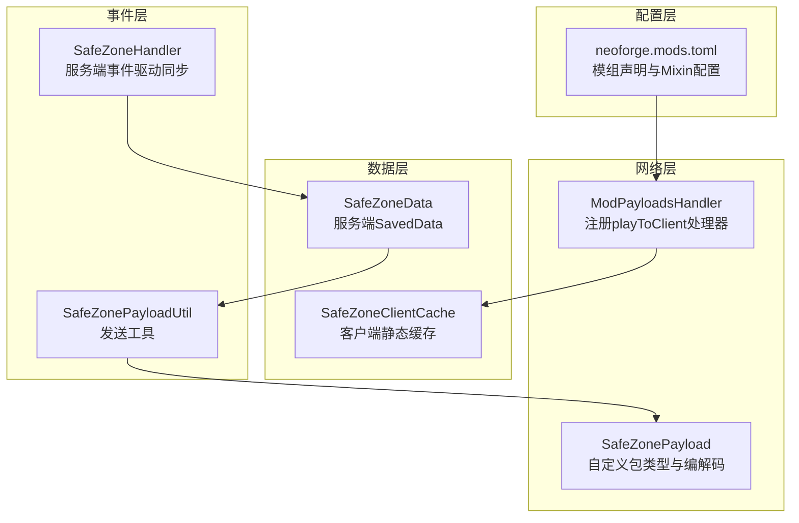
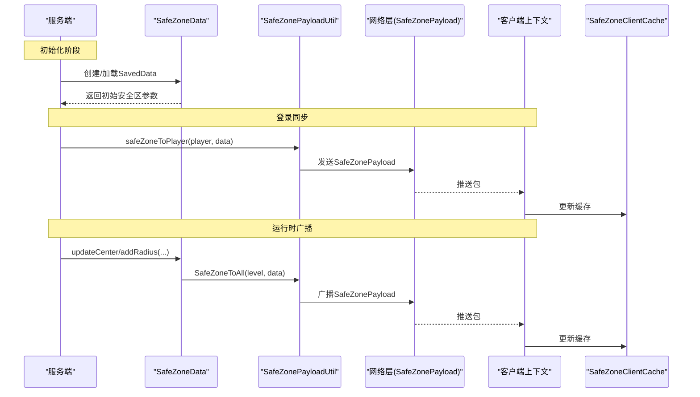
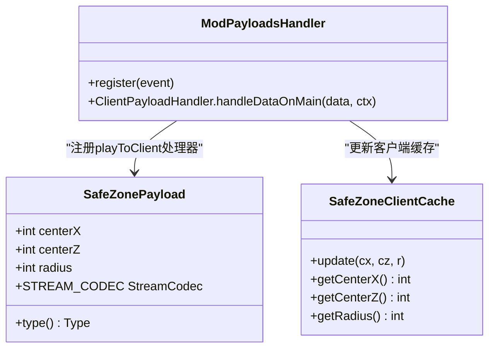
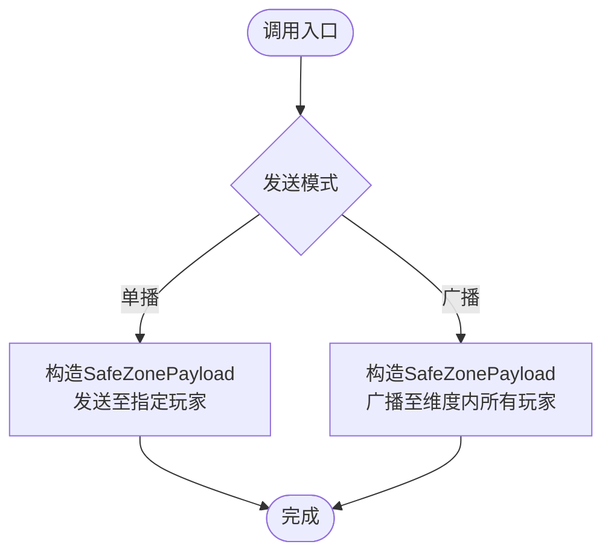
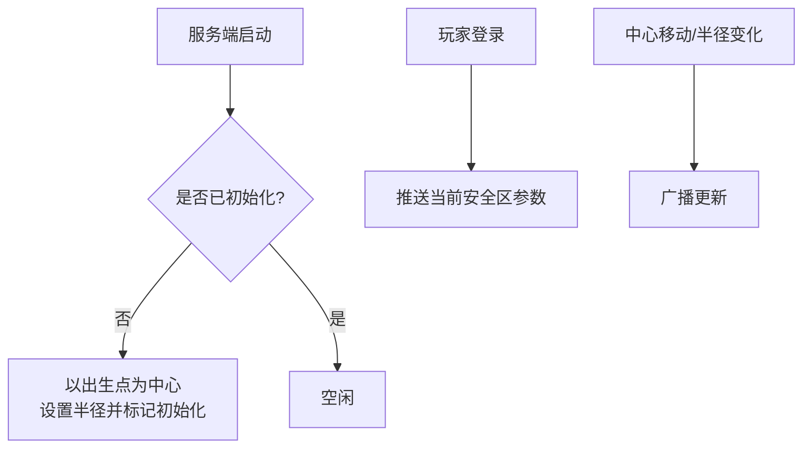
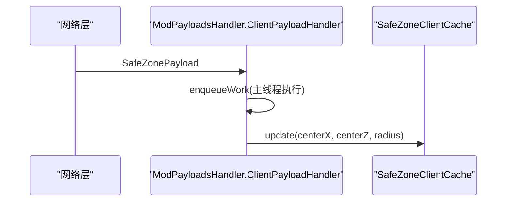
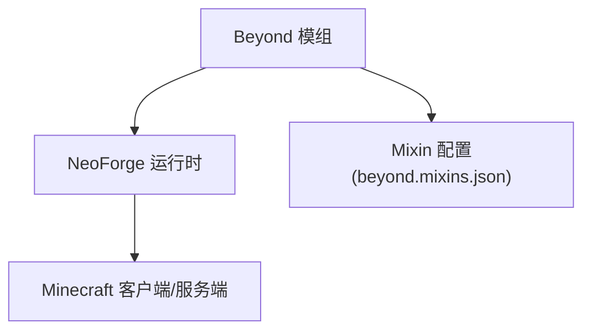

# 网络同步机制

<cite>
**本文引用的文件**
- [SafeZonePayload.java](file://Beyond/src/main/java/com/pz/beyond/network/SafeZonePayload.java)
- [SafeZonePayloadUtil.java](file://Beyond/src/main/java/com/pz/beyond/util/SafeZonePayloadUtil.java)
- [SafeZoneData.java](file://Beyond/src/main/java/com/pz/beyond/data/SafeZoneData.java)
- [SafeZoneClientCache.java](file://Beyond/src/main/java/com/pz/beyond/data/SafeZoneClientCache.java)
- [SafeZoneHandler.java](file://Beyond/src/main/java/com/pz/beyond/event/SafeZoneHandler.java)
- [ModPayloadsHandler.java](file://Beyond/src/main/java/com/pz/beyond/event/ModPayloadsHandler.java)
- [Beyond.java](file://Beyond/src/main/java/com/pz/beyond/Beyond.java)
- [ModAttachments.java](file://Beyond/src/main/java/com/pz/beyond/registry/ModAttachments.java)
- [neoforge.mods.toml](file://Beyond/src/main/templates/META-INF/neoforge.mods.toml)
</cite>

## 目录
1. [引言](#引言)
2. [项目结构](#项目结构)
3. [核心组件](#核心组件)
4. [架构总览](#架构总览)
5. [详细组件分析](#详细组件分析)
6. [依赖分析](#依赖分析)
7. [性能考虑](#性能考虑)
8. [故障排查指南](#故障排查指南)
9. [结论](#结论)
10. [附录](#附录)

## 引言
本文件围绕“安全区”模块的网络同步机制展开，重点阐述 SafeZonePayload 自定义网络包的设计与实现、SafeZonePayloadUtil 工具类的包处理能力（创建、发送、接收、解析）、客户端-服务器之间的同步策略（更新频率、延迟与丢包处理、全量/增量选择），以及性能优化与调试监控建议。目标是帮助开发者在不直接阅读源码的情况下，也能快速理解并扩展该同步机制。

## 项目结构
安全区网络同步相关代码主要位于 Beyond 模块中，采用按职责分层组织：
- 网络层：自定义协议 SafeZonePayload 及其注册与处理
- 数据层：服务端持久化数据 SafeZoneData 与客户端缓存 SafeZoneClientCache
- 事件层：服务端事件驱动的初始化与登录同步 SafeZoneHandler；客户端注册与处理 ModPayloadsHandler
- 工具层：SafeZonePayloadUtil 封装发送逻辑
- 配置层：neoforge.mods.toml 声明模组与 Mixin 配置

图表来源
- [SafeZonePayload.java:1-31](file://Beyond/src/main/java/com/pz/beyond/network/SafeZonePayload.java#L1-L31)
- [ModPayloadsHandler.java:1-34](file://Beyond/src/main/java/com/pz/beyond/event/ModPayloadsHandler.java#L1-L34)
- [SafeZoneData.java:1-101](file://Beyond/src/main/java/com/pz/beyond/data/SafeZoneData.java#L1-L101)
- [SafeZoneClientCache.java:1-30](file://Beyond/src/main/java/com/pz/beyond/data/SafeZoneClientCache.java#L1-L30)
- [SafeZoneHandler.java:1-77](file://Beyond/src/main/java/com/pz/beyond/event/SafeZoneHandler.java#L1-L77)
- [SafeZonePayloadUtil.java:1-32](file://Beyond/src/main/java/com/pz/beyond/util/SafeZonePayloadUtil.java#L1-L32)
- [neoforge.mods.toml:1-80](file://Beyond/src/main/templates/META-INF/neoforge.mods.toml#L1-L80)

章节来源
- [SafeZonePayload.java:1-31](file://Beyond/src/main/java/com/pz/beyond/network/SafeZonePayload.java#L1-L31)
- [SafeZonePayloadUtil.java:1-32](file://Beyond/src/main/java/com/pz/beyond/util/SafeZonePayloadUtil.java#L1-L32)
- [SafeZoneData.java:1-101](file://Beyond/src/main/java/com/pz/beyond/data/SafeZoneData.java#L1-L101)
- [SafeZoneClientCache.java:1-30](file://Beyond/src/main/java/com/pz/beyond/data/SafeZoneClientCache.java#L1-L30)
- [SafeZoneHandler.java:1-77](file://Beyond/src/main/java/com/pz/beyond/event/SafeZoneHandler.java#L1-L77)
- [ModPayloadsHandler.java:1-34](file://Beyond/src/main/java/com/pz/beyond/event/ModPayloadsHandler.java#L1-L34)
- [neoforge.mods.toml:1-80](file://Beyond/src/main/templates/META-INF/neoforge.mods.toml#L1-L80)

## 核心组件
- SafeZonePayload：自定义网络包，承载安全区中心坐标与半径，定义包类型与流式编解码器，确保跨版本稳定传输。
- SafeZonePayloadUtil：封装单播与广播发送逻辑，屏蔽底层 PacketDistributor 使用细节。
- SafeZoneData：服务端持久化数据，提供安全区判定、中心更新与半径变更，并在变更时触发广播。
- SafeZoneClientCache：客户端静态缓存，存储最新安全区参数供渲染或规则判断使用。
- SafeZoneHandler：服务端事件总线订阅者，负责初始化安全区、登录同步与怪物生成规则联动。
- ModPayloadsHandler：客户端网络处理器注册者，将服务端推送的包写入客户端缓存。

章节来源
- [SafeZonePayload.java:10-30](file://Beyond/src/main/java/com/pz/beyond/network/SafeZonePayload.java#L10-L30)
- [SafeZonePayloadUtil.java:9-31](file://Beyond/src/main/java/com/pz/beyond/util/SafeZonePayloadUtil.java#L9-L31)
- [SafeZoneData.java:16-100](file://Beyond/src/main/java/com/pz/beyond/data/SafeZoneData.java#L16-L100)
- [SafeZoneClientCache.java:6-29](file://Beyond/src/main/java/com/pz/beyond/data/SafeZoneClientCache.java#L6-L29)
- [SafeZoneHandler.java:36-77](file://Beyond/src/main/java/com/pz/beyond/event/SafeZoneHandler.java#L36-L77)
- [ModPayloadsHandler.java:12-34](file://Beyond/src/main/java/com/pz/beyond/event/ModPayloadsHandler.java#L12-L34)

## 架构总览
下图展示从服务端数据变更到客户端缓存更新的完整链路，包括事件驱动初始化、登录同步与运行时广播。

图表来源
- [SafeZoneHandler.java:44-68](file://Beyond/src/main/java/com/pz/beyond/event/SafeZoneHandler.java#L44-L68)
- [SafeZoneData.java:60-79](file://Beyond/src/main/java/com/pz/beyond/data/SafeZoneData.java#L60-L79)
- [SafeZonePayloadUtil.java:16-30](file://Beyond/src/main/java/com/pz/beyond/util/SafeZonePayloadUtil.java#L16-L30)
- [SafeZonePayload.java:15-29](file://Beyond/src/main/java/com/pz/beyond/network/SafeZonePayload.java#L15-L29)
- [ModPayloadsHandler.java:18-31](file://Beyond/src/main/java/com/pz/beyond/event/ModPayloadsHandler.java#L18-L31)

## 详细组件分析

### SafeZonePayload 自定义网络包
- 数据结构：包含中心 X、中心 Z、半径三个整型字段，采用记录类（record）定义，不可变且线程安全。
- 类型与编解码：
  - 包类型 TYPE：基于 ResourceLocation 的唯一标识，命名空间为模组 ID。
  - 流式编解码 STREAM_CODEC：使用复合编解码器，顺序编码三个 INT 字段。
- 传输协议：作为自定义包类型通过 NeoForge 网络层进行传输，版本号由注册时指定。

图表来源
- [SafeZonePayload.java:10-30](file://Beyond/src/main/java/com/pz/beyond/network/SafeZonePayload.java#L10-L30)
- [ModPayloadsHandler.java:14-32](file://Beyond/src/main/java/com/pz/beyond/event/ModPayloadsHandler.java#L14-L32)
- [SafeZoneClientCache.java:12-28](file://Beyond/src/main/java/com/pz/beyond/data/SafeZoneClientCache.java#L12-L28)

章节来源
- [SafeZonePayload.java:10-30](file://Beyond/src/main/java/com/pz/beyond/network/SafeZonePayload.java#L10-L30)
- [ModPayloadsHandler.java:14-32](file://Beyond/src/main/java/com/pz/beyond/event/ModPayloadsHandler.java#L14-L32)
- [SafeZoneClientCache.java:6-29](file://Beyond/src/main/java/com/pz/beyond/data/SafeZoneClientCache.java#L6-L29)

### SafeZonePayloadUtil 工具类
- 单播发送：将 SafeZonePayload 发送给指定 ServerPlayer。
- 广播发送：向指定维度内所有在线玩家广播 SafeZonePayload。
- 与 PacketDistributor 解耦，便于后续替换或扩展发送策略。

图表来源
- [SafeZonePayloadUtil.java:16-30](file://Beyond/src/main/java/com/pz/beyond/util/SafeZonePayloadUtil.java#L16-L30)

章节来源
- [SafeZonePayloadUtil.java:9-31](file://Beyond/src/main/java/com/pz/beyond/util/SafeZonePayloadUtil.java#L9-L31)

### SafeZoneData 服务端数据与同步策略
- 存储与加载：继承 SavedData，支持 NBT 序列化，包含中心坐标、半径与首次标记。
- 同步策略：
  - 初始同步：服务端启动时若未初始化，以主世界出生点为中心并设置半径，随后标记已初始化。
  - 登录同步：新玩家加入时，立即推送当前安全区参数。
  - 运行时同步：中心移动或半径变化后，调用工具类广播更新。
- 客户端判定：提供 withinSafeZone 判定方法，用于规则与渲染等场景。

图表来源
- [SafeZoneHandler.java:44-52](file://Beyond/src/main/java/com/pz/beyond/event/SafeZoneHandler.java#L44-L52)
- [SafeZoneHandler.java:61-68](file://Beyond/src/main/java/com/pz/beyond/event/SafeZoneHandler.java#L61-L68)
- [SafeZoneData.java:60-79](file://Beyond/src/main/java/com/pz/beyond/data/SafeZoneData.java#L60-L79)

章节来源
- [SafeZoneData.java:16-100](file://Beyond/src/main/java/com/pz/beyond/data/SafeZoneData.java#L16-L100)
- [SafeZoneHandler.java:44-77](file://Beyond/src/main/java/com/pz/beyond/event/SafeZoneHandler.java#L44-L77)

### 客户端缓存与渲染准备
- SafeZoneClientCache：静态缓存当前安全区参数，供渲染与规则判断使用。
- ModPayloadsHandler：注册 playToClient 处理器，接收服务端推送的 SafeZonePayload，在主线程队列中更新缓存。

图表来源
- [ModPayloadsHandler.java:26-31](file://Beyond/src/main/java/com/pz/beyond/event/ModPayloadsHandler.java#L26-L31)
- [SafeZoneClientCache.java:12-16](file://Beyond/src/main/java/com/pz/beyond/data/SafeZoneClientCache.java#L12-L16)

章节来源
- [SafeZoneClientCache.java:6-29](file://Beyond/src/main/java/com/pz/beyond/data/SafeZoneClientCache.java#L6-L29)
- [ModPayloadsHandler.java:18-32](file://Beyond/src/main/java/com/pz/beyond/event/ModPayloadsHandler.java#L18-L32)

### 安全区状态变化的同步策略
- 全量同步：每次变更均广播完整参数，保证客户端与服务端一致，避免因网络抖动导致的状态漂移。
- 增量更新：当前实现未采用字段级增量，若未来需要降低带宽，可在 SafeZonePayload 中引入版本号与差量字段，并在客户端侧合并。
- 更新频率控制：可通过服务端事件节流（如按 tick 或按距离阈值）减少频繁广播；当前实现为即时广播。
- 丢包与重传：NeoForge 自定义包默认不保证可靠传输；可引入确认机制与定时重传，或在客户端侧增加请求缺失数据的机制。

章节来源
- [SafeZoneData.java:60-79](file://Beyond/src/main/java/com/pz/beyond/data/SafeZoneData.java#L60-L79)
- [SafeZonePayloadUtil.java:26-30](file://Beyond/src/main/java/com/pz/beyond/util/SafeZonePayloadUtil.java#L26-L30)

## 依赖分析
- 模组与依赖：neoforge.mods.toml 声明了 NeoForge 与 Minecraft 的最低版本要求及模组元数据。
- Mixin 配置：声明了 mixin 配置文件路径，当前为空列表，不影响网络同步核心逻辑。
- 附件系统：ModAttachments 定义了玩家状态附件类型，与安全区同步无直接耦合，但体现了模组扩展点。

图表来源
- [neoforge.mods.toml:16-73](file://Beyond/src/main/templates/META-INF/neoforge.mods.toml#L16-L73)
- [Beyond.java:38-60](file://Beyond/src/main/java/com/pz/beyond/Beyond.java#L38-L60)

章节来源
- [neoforge.mods.toml:1-80](file://Beyond/src/main/templates/META-INF/neoforge.mods.toml#L1-L80)
- [Beyond.java:38-79](file://Beyond/src/main/java/com/pz/beyond/Beyond.java#L38-79)
- [ModAttachments.java:11-22](file://Beyond/src/main/java/com/pz/beyond/registry/ModAttachments.java#L11-L22)

## 性能考虑
- 带宽控制
  - 当前包体仅含三个 INT，体积小；若引入更多字段，建议分包或版本化字段，仅传输变更项。
  - 可在服务端按 tick 或按玩家可视距离聚合更新，减少广播次数。
- 压缩算法
  - 若字段增多，可考虑在应用层对包体进行压缩（需评估 CPU 与延迟权衡）。
- 连接池管理
  - 使用 PacketDistributor 的内置分发器即可满足需求；如需自定义网络栈，再考虑连接池与队列策略。
- 编解码优化
  - 使用固定大小字段与紧凑编码；避免频繁分配 ByteBuf，复用缓冲区可进一步降低 GC 压力。
- 丢包与重传
  - 引入序列号与确认机制，客户端请求缺失帧；服务端维护最近若干帧快照，按需重放。

## 故障排查指南
- 客户端未收到安全区更新
  - 检查服务端事件是否正确触发（初始化、登录、运行时变更）。
  - 核对 ModPayloadsHandler 是否注册成功，版本号是否匹配。
- 参数不一致
  - 核对 SafeZoneData 的 NBT 存取逻辑与 SafeZoneClientCache 的更新时机。
- 网络版本冲突
  - 确认注册时使用的版本字符串一致，避免跨版本不兼容。
- 渲染异常
  - 检查 SafeZoneClientCache 的读取位置与渲染刷新频率。

章节来源
- [SafeZoneHandler.java:44-77](file://Beyond/src/main/java/com/pz/beyond/event/SafeZoneHandler.java#L44-L77)
- [ModPayloadsHandler.java:14-23](file://Beyond/src/main/java/com/pz/beyond/event/ModPayloadsHandler.java#L14-L23)
- [SafeZoneClientCache.java:12-28](file://Beyond/src/main/java/com/pz/beyond/data/SafeZoneClientCache.java#L12-L28)

## 结论
本设计以最小包体与事件驱动为核心，实现了安全区参数的高效同步。当前采用全量广播与即时推送，具备良好的一致性与可维护性。未来可在带宽敏感场景引入版本化与增量更新、在可靠性方面引入确认与重传，以进一步提升性能与鲁棒性。

## 附录
- 关键流程路径参考
  - [服务端初始化与登录同步:44-68](file://Beyond/src/main/java/com/pz/beyond/event/SafeZoneHandler.java#L44-L68)
  - [运行时广播更新:60-79](file://Beyond/src/main/java/com/pz/beyond/data/SafeZoneData.java#L60-L79)
  - [客户端接收与缓存更新:26-31](file://Beyond/src/main/java/com/pz/beyond/event/ModPayloadsHandler.java#L26-L31)
  - [包类型与编解码定义:15-29](file://Beyond/src/main/java/com/pz/beyond/network/SafeZonePayload.java#L15-L29)
  - [发送工具封装:16-30](file://Beyond/src/main/java/com/pz/beyond/util/SafeZonePayloadUtil.java#L16-L30)