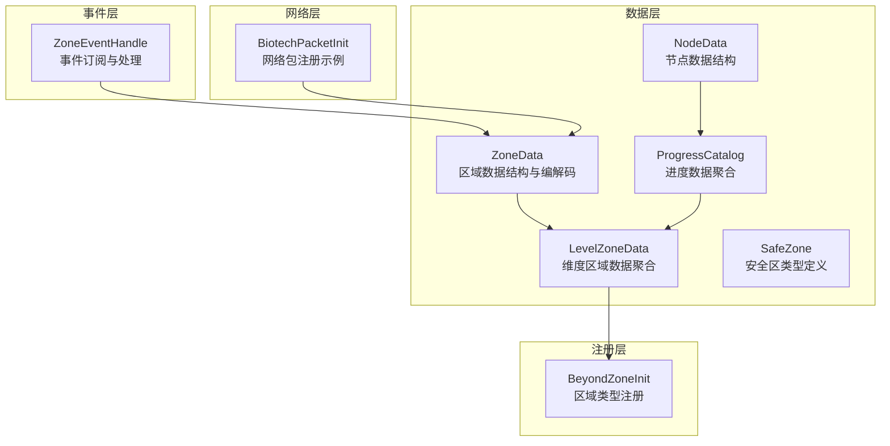
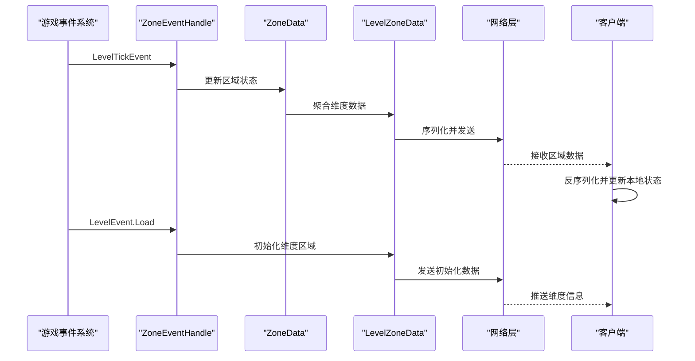
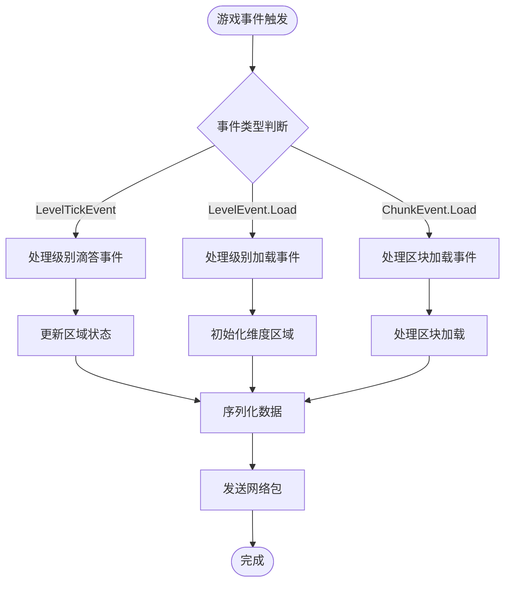
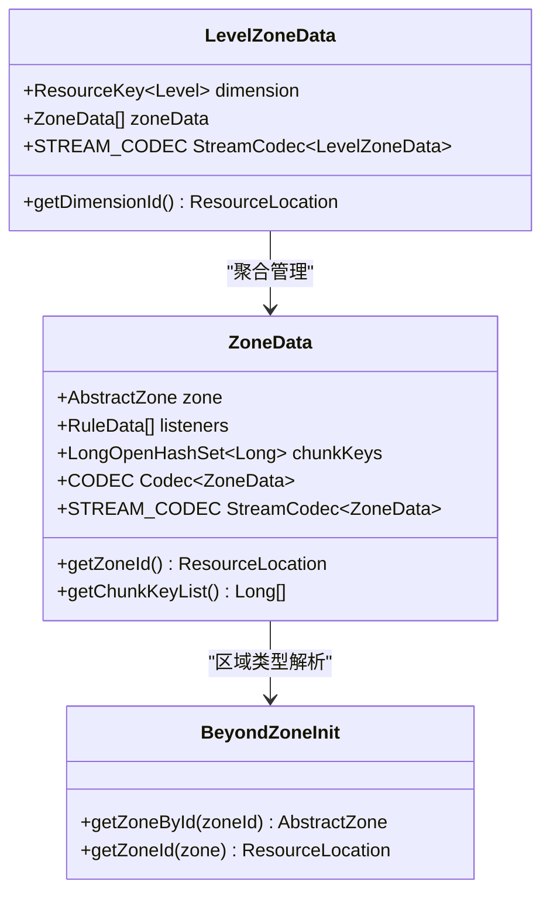
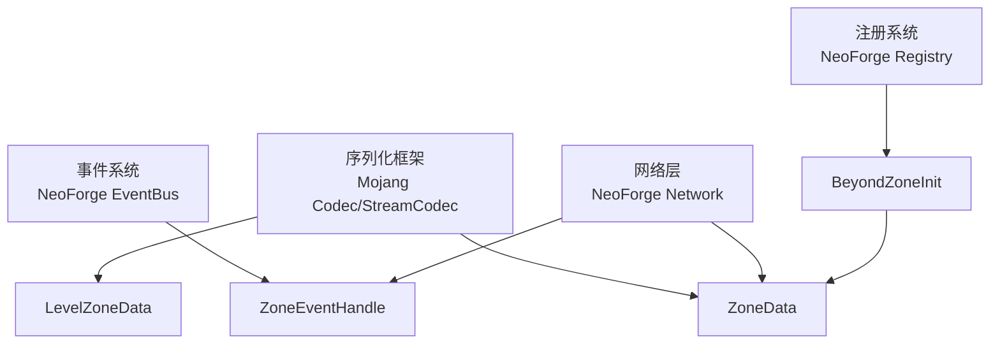

# 网络同步机制

<cite>
**本文引用的文件**
- [ZoneEventHandle.java](file://Beyond/src/main/java/com/pz/beyond/api/event/handle/ZoneEventHandle.java)
- [ZoneData.java](file://Beyond/src/main/java/com/pz/beyond/api/system/zone/ZoneData.java)
- [LevelZoneData.java](file://Beyond/src/main/java/com/pz/beyond/api/system/zone/LevelZoneData.java)
- [SafeZone.java](file://Beyond/src/main/java/com/pz/beyond/api/system/zone/zones/SafeZone.java)
- [BeyondZoneInit.java](file://Beyond/src/main/java/com/pz/beyond/api/init/BeyondZoneInit.java)
- [NodeData.java](file://Beyond/src/main/java/com/pz/beyond/api/system/node/NodeData.java)
- [ProgressCatalog.java](file://Beyond/src/main/java/com/pz/beyond/api/system/progress/ProgressCatalog.java)
- [AllSafeRule.java](file://Beyond/src/main/java/com/pz/beyond/rule/AllSafeRule.java)
- [BiotechPacketInit.java](file://Biotech/src/main/java/org/biotech/api/init/BiotechPacketInit.java)
</cite>

## 更新摘要
**所做更改**
- 更新了安全区网络同步机制的架构描述，反映从旧的SafeZonePayload系统到新的ZoneEventHandle事件驱动架构的迁移
- 新增了ZoneData和LevelZoneData数据结构的详细说明
- 更新了网络包注册和处理机制的描述
- 移除了过时的SafeZonePayload和SafeZonePayloadUtil相关内容
- 新增了基于事件系统的网络同步策略说明

## 目录
1. [引言](#引言)
2. [项目结构](#项目结构)
3. [核心组件](#核心组件)
4. [架构总览](#架构总览)
5. [详细组件分析](#详细组件分析)
6. [依赖分析](#依赖分析)
7. [性能考虑](#性能考虑)
8. [故障排查指南](#故障排查指南)
9. [结论](#结论)
10. [附录](#附录)

## 引言
本文件围绕"安全区"模块的网络同步机制展开，重点阐述新的ZoneEventHandle事件驱动架构的设计与实现。该架构以ZoneData为核心数据结构，通过事件系统实现区域状态的实时同步，包括区域数据的序列化格式、事件驱动的网络包处理机制，以及客户端-服务器间的同步策略。目标是帮助开发者理解基于事件系统的网络同步架构及其优势。

## 项目结构
安全区网络同步相关代码主要位于Beyond模块中，采用事件驱动的分层架构：
- 事件层：ZoneEventHandle订阅游戏事件，驱动区域状态更新
- 数据层：ZoneData和LevelZoneData提供区域数据的序列化与网络传输
- 注册层：BeyondZoneInit管理区域类型的注册与查找
- 系统层：NodeData和ProgressCatalog支持节点区域的复杂数据结构
- 网络层：BiotechPacketInit展示了标准的网络包注册模式

**图表来源**
- [ZoneEventHandle.java:1-43](file://Beyond/src/main/java/com/pz/beyond/api/event/handle/ZoneEventHandle.java#L1-L43)
- [ZoneData.java:1-102](file://Beyond/src/main/java/com/pz/beyond/api/system/zone/ZoneData.java#L1-L102)
- [LevelZoneData.java:1-71](file://Beyond/src/main/java/com/pz/beyond/api/system/zone/LevelZoneData.java#L1-L71)
- [SafeZone.java:1-17](file://Beyond/src/main/java/com/pz/beyond/api/system/zone/zones/SafeZone.java#L1-L17)
- [BeyondZoneInit.java:30-63](file://Beyond/src/main/java/com/pz/beyond/api/init/BeyondZoneInit.java#L30-L63)
- [NodeData.java:29-88](file://Beyond/src/main/java/com/pz/beyond/api/system/node/NodeData.java#L29-L88)
- [ProgressCatalog.java:31-118](file://Beyond/src/main/java/com/pz/beyond/api/system/progress/ProgressCatalog.java#L31-L118)
- [BiotechPacketInit.java:1-18](file://Biotech/src/main/java/org/biotech/api/init/BiotechPacketInit.java#L1-L18)

**章节来源**
- [ZoneEventHandle.java:1-43](file://Beyond/src/main/java/com/pz/beyond/api/event/handle/ZoneEventHandle.java#L1-L43)
- [ZoneData.java:1-102](file://Beyond/src/main/java/com/pz/beyond/api/system/zone/ZoneData.java#L1-L102)
- [LevelZoneData.java:1-71](file://Beyond/src/main/java/com/pz/beyond/api/system/zone/LevelZoneData.java#L1-L71)
- [BeyondZoneInit.java:30-63](file://Beyond/src/main/java/com/pz/beyond/api/init/BeyondZoneInit.java#L30-L63)
- [BiotechPacketInit.java:1-18](file://Biotech/src/main/java/org/biotech/api/init/BiotechPacketInit.java#L1-L18)

## 核心组件
- **ZoneEventHandle**：事件驱动的网络同步核心，订阅LevelTickEvent、LevelEvent.Load、ChunkEvent.Load等事件，驱动区域状态的更新与同步。
- **ZoneData**：区域数据的核心结构，包含区域类型、监听器列表和区块键集合，提供完整的序列化支持。
- **LevelZoneData**：维度级别的区域数据聚合，管理特定维度内的所有区域数据。
- **BeyondZoneInit**：区域类型的注册与管理，提供区域ID与实例之间的双向映射。
- **NodeData**：节点区域的数据结构，支持颜色、区块键和状态的管理。
- **ProgressCatalog**：进度数据的聚合容器，管理多个进度和节点数据的关联关系。

**章节来源**
- [ZoneEventHandle.java:14-42](file://Beyond/src/main/java/com/pz/beyond/api/event/handle/ZoneEventHandle.java#L14-L42)
- [ZoneData.java:21-97](file://Beyond/src/main/java/com/pz/beyond/api/system/zone/ZoneData.java#L21-L97)
- [LevelZoneData.java:23-59](file://Beyond/src/main/java/com/pz/beyond/api/system/zone/LevelZoneData.java#L23-L59)
- [BeyondZoneInit.java:52-62](file://Beyond/src/main/java/com/pz/beyond/api/init/BeyondZoneInit.java#L52-L62)
- [NodeData.java:47-88](file://Beyond/src/main/java/com/pz/beyond/api/system/node/NodeData.java#L47-L88)
- [ProgressCatalog.java:58-95](file://Beyond/src/main/java/com/pz/beyond/api/system/progress/ProgressCatalog.java#L58-L95)

## 架构总览
新的ZoneEventHandle架构采用事件驱动的方式，通过订阅游戏生命周期事件来触发区域状态的更新与网络同步。该架构相比之前的SafeZonePayload系统具有更好的扩展性和维护性。

**图表来源**
- [ZoneEventHandle.java:17-41](file://Beyond/src/main/java/com/pz/beyond/api/event/handle/ZoneEventHandle.java#L17-L41)
- [ZoneData.java:67-75](file://Beyond/src/main/java/com/pz/beyond/api/system/zone/ZoneData.java#L67-L75)
- [LevelZoneData.java:34-40](file://Beyond/src/main/java/com/pz/beyond/api/system/zone/LevelZoneData.java#L34-L40)

## 详细组件分析

### ZoneEventHandle 事件驱动架构
ZoneEventHandle采用注解驱动的事件订阅方式，通过@EventBusSubscriber注解自动注册到NeoForge事件总线。该组件负责：

- **级别滴答事件**：在每个游戏级别滴答时检查并更新区域状态
- **级别加载事件**：当新的服务器级别加载时初始化区域数据
- **区块加载事件**：当新区块加载时处理区域相关的初始化逻辑

**图表来源**
- [ZoneEventHandle.java:17-41](file://Beyond/src/main/java/com/pz/beyond/api/event/handle/ZoneEventHandle.java#L17-L41)

**章节来源**
- [ZoneEventHandle.java:13-42](file://Beyond/src/main/java/com/pz/beyond/api/event/handle/ZoneEventHandle.java#L13-L42)

### ZoneData 数据结构与序列化
ZoneData是区域系统的核心数据结构，提供了完整的序列化支持：

- **数据结构**：包含AbstractZone区域类型、RuleData监听器列表和LongOpenHashSet区块键集合
- **编解码支持**：提供Codec和StreamCodec两种序列化方式，支持Mojang序列化框架和网络传输
- **区域类型管理**：通过BeyondZoneInit实现区域ID与实例的双向映射

**图表来源**
- [ZoneData.java:21-97](file://Beyond/src/main/java/com/pz/beyond/api/system/zone/ZoneData.java#L21-L97)
- [LevelZoneData.java:23-59](file://Beyond/src/main/java/com/pz/beyond/api/system/zone/LevelZoneData.java#L23-L59)
- [BeyondZoneInit.java:52-62](file://Beyond/src/main/java/com/pz/beyond/api/init/BeyondZoneInit.java#L52-L62)

**章节来源**
- [ZoneData.java:18-97](file://Beyond/src/main/java/com/pz/beyond/api/system/zone/ZoneData.java#L18-L97)
- [LevelZoneData.java:20-59](file://Beyond/src/main/java/com/pz/beyond/api/system/zone/LevelZoneData.java#L20-L59)
- [BeyondZoneInit.java:30-63](file://Beyond/src/main/java/com/pz/beyond/api/init/BeyondZoneInit.java#L30-L63)

### LevelZoneData 维度数据聚合
LevelZoneData负责管理特定维度内的所有区域数据，提供维度级别的数据聚合功能：

- **维度标识**：使用ResourceKey<Level>标识管理的维度
- **数据聚合**：维护ZoneData列表，支持按维度组织区域数据
- **序列化支持**：提供完整的StreamCodec支持，便于网络传输

**章节来源**
- [LevelZoneData.java:23-71](file://Beyond/src/main/java/com/pz/beyond/api/system/zone/LevelZoneData.java#L23-L71)

### 安全区类型定义
SafeZone作为AbstractZone的具体实现，定义了安全区的基本属性：

- **标识符**：使用Beyond.asResource("safe_zone")定义唯一的区域标识
- **继承关系**：继承AbstractZone，获得通用的区域功能
- **注册集成**：通过BeyondZoneInit统一管理注册

**章节来源**
- [SafeZone.java:7-17](file://Beyond/src/main/java/com/pz/beyond/api/system/zone/zones/SafeZone.java#L7-L17)

### 节点数据与进度系统
NodeData和ProgressCatalog支持更复杂的区域类型，特别是节点区域：

- **NodeData**：包含节点颜色、区块键和状态信息
- **ProgressCatalog**：管理多个进度和节点数据的关联关系
- **网络支持**：提供完整的序列化支持，便于网络传输

**章节来源**
- [NodeData.java:29-88](file://Beyond/src/main/java/com/pz/beyond/api/system/node/NodeData.java#L29-L88)
- [ProgressCatalog.java:31-118](file://Beyond/src/main/java/com/pz/beyond/api/system/progress/ProgressCatalog.java#L31-L118)

### 网络包注册模式
BiotechPacketInit展示了标准的网络包注册模式，为ZoneEventHandle的网络通信提供参考：

- **事件订阅**：通过RegisterPayloadHandlersEvent订阅网络包注册事件
- **版本管理**：使用registrar("1")设置网络版本
- **双向通信**：支持playToServer和playToClient双向通信

**章节来源**
- [BiotechPacketInit.java:9-18](file://Biotech/src/main/java/org/biotech/api/init/BiotechPacketInit.java#L9-L18)

## 依赖分析
新的ZoneEventHandle架构具有清晰的依赖关系：

- **事件系统**：依赖NeoForge的事件总线系统
- **序列化框架**：使用Mojang的Codec和StreamCodec框架
- **网络通信**：通过标准的NeoForge网络层进行数据传输
- **注册系统**：依赖NeoForge的注册表系统管理区域类型

**图表来源**
- [ZoneEventHandle.java:7-11](file://Beyond/src/main/java/com/pz/beyond/api/event/handle/ZoneEventHandle.java#L7-L11)
- [ZoneData.java:32-75](file://Beyond/src/main/java/com/pz/beyond/api/system/zone/ZoneData.java#L32-L75)
- [BeyondZoneInit.java:40-46](file://Beyond/src/main/java/com/pz/beyond/api/init/BeyondZoneInit.java#L40-L46)

**章节来源**
- [ZoneEventHandle.java:7-11](file://Beyond/src/main/java/com/pz/beyond/api/event/handle/ZoneEventHandle.java#L7-L11)
- [ZoneData.java:32-75](file://Beyond/src/main/java/com/pz/beyond/api/system/zone/ZoneData.java#L32-L75)
- [BeyondZoneInit.java:40-46](file://Beyond/src/main/java/com/pz/beyond/api/init/BeyondZoneInit.java#L40-L46)

## 性能考虑
新的ZoneEventHandle架构在性能方面具有以下优势：

- **事件驱动的按需更新**：只在相关事件发生时才更新区域状态，避免不必要的网络传输
- **高效的序列化**：使用StreamCodec提供高性能的二进制序列化
- **内存优化**：使用LongOpenHashSet存储区块键，提供高效的内存使用
- **网络优化**：通过LevelZoneData聚合维度数据，减少网络包数量
- **延迟处理**：事件驱动的架构天然支持异步处理，提高响应性能

## 故障排查指南
针对新的ZoneEventHandle架构，提供以下故障排查指导：

- **事件未触发**：检查@EventBusSubscriber注解是否正确配置，确认事件类型是否匹配
- **数据不同步**：验证ZoneData的序列化是否正确，检查StreamCodec的编解码逻辑
- **区域类型错误**：确认BeyondZoneInit的注册是否正确，检查区域ID映射关系
- **网络传输问题**：验证网络包注册是否正确，检查版本兼容性
- **内存泄漏**：检查LongOpenHashSet的使用，确保及时清理不再使用的数据

**章节来源**
- [ZoneEventHandle.java:13-42](file://Beyond/src/main/java/com/pz/beyond/api/event/handle/ZoneEventHandle.java#L13-L42)
- [ZoneData.java:39-75](file://Beyond/src/main/java/com/pz/beyond/api/system/zone/ZoneData.java#L39-L75)
- [BeyondZoneInit.java:52-62](file://Beyond/src/main/java/com/pz/beyond/api/init/BeyondZoneInit.java#L52-L62)

## 结论
新的ZoneEventHandle架构通过事件驱动的方式实现了更加灵活和高效的网络同步机制。相比之前的SafeZonePayload系统，新架构具有更好的扩展性、更低的维护成本和更高的性能表现。该架构为未来的功能扩展奠定了坚实的基础。

## 附录
- **关键流程路径参考**
  - [事件处理流程:17-41](file://Beyond/src/main/java/com/pz/beyond/api/event/handle/ZoneEventHandle.java#L17-L41)
  - [数据序列化:39-75](file://Beyond/src/main/java/com/pz/beyond/api/system/zone/ZoneData.java#L39-L75)
  - [维度数据聚合:34-40](file://Beyond/src/main/java/com/pz/beyond/api/system/zone/LevelZoneData.java#L34-L40)
  - [区域类型注册:40-63](file://Beyond/src/main/java/com/pz/beyond/api/init/BeyondZoneInit.java#L40-L63)
  - [网络包注册:12-17](file://Biotech/src/main/java/org/biotech/api/init/BiotechPacketInit.java#L12-L17)