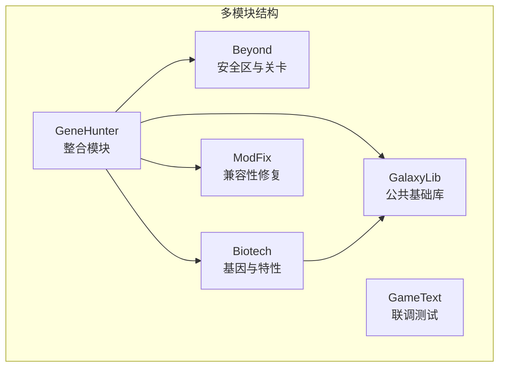
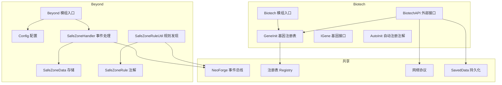
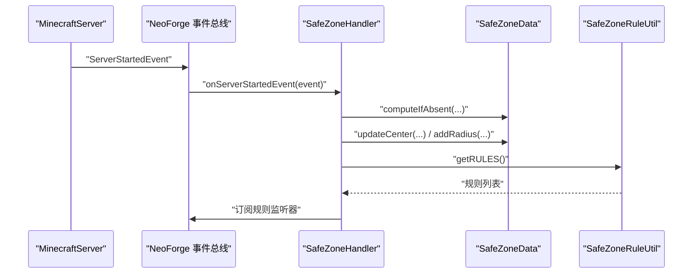
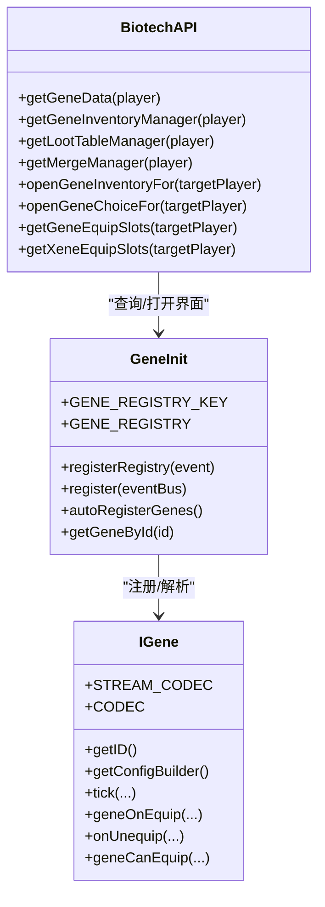
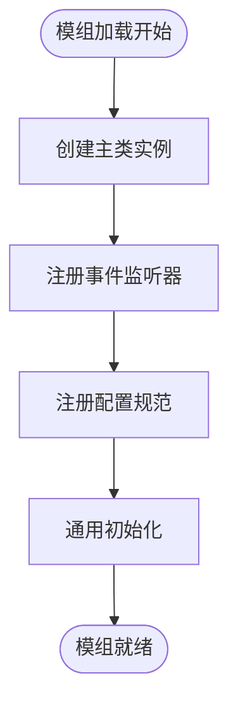
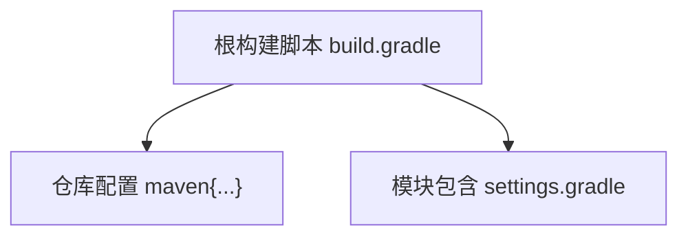

# 代码规范与约定

<cite>
**本文引用的文件**
- [Beyond.java](file://Beyond/src/main/java/com/pz/beyond/Beyond.java)
- [Config.java](file://Beyond/src/main/java/com/pz/beyond/Config.java)
- [SafeZoneHandler.java](file://Beyond/src/main/java/com/pz/beyond/event/SafeZoneHandler.java)
- [SafeZoneData.java](file://Beyond/src/main/java/com/pz/beyond/data/SafeZoneData.java)
- [SafeZoneRuleUtil.java](file://Beyond/src/main/java/com/pz/beyond/util/SafeZoneRuleUtil.java)
- [SafeZoneRule.java](file://Beyond/src/main/java/com/pz/beyond/safeZoneRule/SafeZoneRule.java)
- [Biotech.java](file://Biotech/src/main/java/org/biotech/Biotech.java)
- [BiotechAPI.java](file://Biotech/src/main/java/org/biotech/api/BiotechAPI.java)
- [GeneInit.java](file://Biotech/src/main/java/org/biotech/api/init/GeneInit.java)
- [IGene.java](file://Biotech/src/main/java/org/biotech/api/system/gene/core/IGene.java)
- [AutoInit.java](file://Biotech/src/main/java/org/biotech/api/util/AutoInit.java)
- [settings.gradle](file://settings.gradle)
- [build.gradle](file://build.gradle)
- [README.md](file://README.md)
</cite>

## 目录
1. [引言](#引言)
2. [项目结构](#项目结构)
3. [核心组件](#核心组件)
4. [架构总览](#架构总览)
5. [详细组件分析](#详细组件分析)
6. [依赖分析](#依赖分析)
7. [性能考虑](#性能考虑)
8. [故障排查指南](#故障排查指南)
9. [结论](#结论)
10. [附录](#附录)

## 引言
本文件为 SubmodulesGeneHunter 项目的代码规范与约定，覆盖 Java 编码标准、命名约定、注释规范、文件组织结构；模块间接口设计原则、事件处理模式、网络通信协议与数据存储规范；代码审查检查清单、重构指导原则与性能优化建议；以及 Git 提交消息规范、分支管理策略与版本控制最佳实践。内容基于仓库现有实现进行提炼与扩展，旨在提升团队协作效率与代码质量。

## 项目结构
项目采用多模块 Gradle 结构，按功能拆分，便于并行开发与独立维护：
- GalaxyLib：公共基础库
- Beyond：关卡与安全区相关玩法模块
- Biotech：基因与特性系统模块
- ModFix：兼容性修复与 Mixin 补丁模块
- GeneHunter：主整合模块
- GameText：联调与集成测试模块

模块包含标准的 src/main/java、src/main/resources、build.gradle、gradle.properties 与模板配置文件，遵循 NeoForge 模组开发约定。

**图表来源**
- [settings.gradle:13-18](file://settings.gradle#L13-L18)

**章节来源**
- [settings.gradle:1-19](file://settings.gradle#L1-L19)
- [README.md:7-14](file://README.md#L7-L14)

## 核心组件
本节聚焦于项目关键组件及其职责边界，明确模块内与模块间的交互方式。

- Beyond 模块
  - 模组入口与生命周期：负责注册、配置与通用初始化。
  - 安全区事件处理：监听服务器事件，管理安全区数据与规则广播。
  - 安全区规则自动发现：通过注解扫描实现规则动态加载。
- Biotech 模块
  - 模组入口与注册链路：集中注册注册表、数据组件、物品、属性、菜单等。
  - API 设计：提供统一的外部访问入口，屏蔽内部实现细节。
  - 基因系统：定义基因接口、注册表与序列化协议，支持自动注册与网络同步。

**章节来源**
- [Beyond.java:38-78](file://Beyond/src/main/java/com/pz/beyond/Beyond.java#L38-L78)
- [SafeZoneHandler.java:35-76](file://Beyond/src/main/java/com/pz/beyond/event/SafeZoneHandler.java#L35-L76)
- [SafeZoneRuleUtil.java:11-53](file://Beyond/src/main/java/com/pz/beyond/util/SafeZoneRuleUtil.java#L11-L53)
- [Biotech.java:16-72](file://Biotech/src/main/java/org/biotech/Biotech.java#L16-L72)
- [BiotechAPI.java:21-91](file://Biotech/src/main/java/org/biotech/api/BiotechAPI.java#L21-L91)

## 架构总览
下图展示模块间关系与关键交互路径，包括事件总线、注册表、网络协议与数据存储。

**图表来源**
- [Beyond.java:46-65](file://Beyond/src/main/java/com/pz/beyond/Beyond.java#L46-L65)
- [SafeZoneHandler.java:44-76](file://Beyond/src/main/java/com/pz/beyond/event/SafeZoneHandler.java#L44-L76)
- [SafeZoneData.java:16-100](file://Beyond/src/main/java/com/pz/beyond/data/SafeZoneData.java#L16-L100)
- [SafeZoneRuleUtil.java:13-48](file://Beyond/src/main/java/com/pz/beyond/util/SafeZoneRuleUtil.java#L13-L48)
- [SafeZoneRule.java:8-11](file://Beyond/src/main/java/com/pz/beyond/safeZoneRule/SafeZoneRule.java#L8-L11)
- [Biotech.java:23-61](file://Biotech/src/main/java/org/biotech/Biotech.java#L23-L61)
- [BiotechAPI.java:27-90](file://Biotech/src/main/java/org/biotech/api/BiotechAPI.java#L27-L90)
- [GeneInit.java:22-106](file://Biotech/src/main/java/org/biotech/api/init/GeneInit.java#L22-L106)
- [IGene.java:15-90](file://Biotech/src/main/java/org/biotech/api/system/gene/core/IGene.java#L15-L90)
- [AutoInit.java:15-33](file://Biotech/src/main/java/org/biotech/api/util/AutoInit.java#L15-L33)

## 详细组件分析

### Beyond 模块：安全区系统
- 事件处理模式
  - 使用 NeoForge 事件总线订阅服务器启动、玩家登录、怪物生成等事件。
  - 通过事件处理器集中处理状态同步与规则触发。
- 数据存储规范
  - 使用 SavedData 持久化安全区中心坐标与半径，并提供 NBT 序列化。
  - 变更时标记脏位以触发保存。
- 网络通信协议
  - 通过自定义包载与 PacketDistributor 实现客户端-服务端同步。
- 规则发现机制
  - 基于注解扫描与反射实现规则的自动发现与实例化。

**图表来源**
- [SafeZoneHandler.java:44-76](file://Beyond/src/main/java/com/pz/beyond/event/SafeZoneHandler.java#L44-L76)
- [SafeZoneData.java:26-79](file://Beyond/src/main/java/com/pz/beyond/data/SafeZoneData.java#L26-L79)
- [SafeZoneRuleUtil.java:13-48](file://Beyond/src/main/java/com/pz/beyond/util/SafeZoneRuleUtil.java#L13-L48)

**章节来源**
- [SafeZoneHandler.java:35-76](file://Beyond/src/main/java/com/pz/beyond/event/SafeZoneHandler.java#L35-L76)
- [SafeZoneData.java:16-100](file://Beyond/src/main/java/com/pz/beyond/data/SafeZoneData.java#L16-L100)
- [SafeZoneRuleUtil.java:11-53](file://Beyond/src/main/java/com/pz/beyond/util/SafeZoneRuleUtil.java#L11-L53)
- [SafeZoneRule.java:8-11](file://Beyond/src/main/java/com/pz/beyond/safeZoneRule/SafeZoneRule.java#L8-L11)

### Biotech 模块：基因系统与 API
- 接口设计原则
  - 通过 BiotechAPI 对外暴露统一入口，隐藏内部能力与注册表细节。
  - 能力（Capability）与数据附件（Data Attachment）分离，职责清晰。
- 注册与自动发现
  - 使用 DeferredRegister 与 RegistryBuilder 管理注册表。
  - 通过注解与扫描实现自动注册，降低手工配置成本。
- 网络与序列化
  - IGene 定义了基于 ResourceLocation 的 Codec 与 StreamCodec，支持空值与默认实例。
  - 支持 Curios 协议，实现可穿戴逻辑与槽位管理。

**图表来源**
- [BiotechAPI.java:27-90](file://Biotech/src/main/java/org/biotech/api/BiotechAPI.java#L27-L90)
- [GeneInit.java:22-106](file://Biotech/src/main/java/org/biotech/api/init/GeneInit.java#L22-L106)
- [IGene.java:15-90](file://Biotech/src/main/java/org/biotech/api/system/gene/core/IGene.java#L15-L90)

**章节来源**
- [BiotechAPI.java:21-91](file://Biotech/src/main/java/org/biotech/api/BiotechAPI.java#L21-L91)
- [GeneInit.java:21-106](file://Biotech/src/main/java/org/biotech/api/init/GeneInit.java#L21-L106)
- [IGene.java:15-90](file://Biotech/src/main/java/org/biotech/api/system/gene/core/IGene.java#L15-L90)
- [AutoInit.java:9-33](file://Biotech/src/main/java/org/biotech/api/util/AutoInit.java#L9-L33)

### 模块入口与配置
- 模组入口
  - 使用 @Mod 标注主类，注入 IEventBus 与 ModContainer。
  - 在构造阶段完成注册表注册、配置注册与事件监听器绑定。
- 配置管理
  - 通过 ModConfigSpec 定义配置规范，由容器自动创建与加载。

**图表来源**
- [Beyond.java:46-65](file://Beyond/src/main/java/com/pz/beyond/Beyond.java#L46-L65)
- [Biotech.java:23-39](file://Biotech/src/main/java/org/biotech/Biotech.java#L23-L39)
- [Config.java:6-19](file://Beyond/src/main/java/com/pz/beyond/Config.java#L6-L19)

**章节来源**
- [Beyond.java:38-78](file://Beyond/src/main/java/com/pz/beyond/Beyond.java#L38-L78)
- [Biotech.java:16-72](file://Biotech/src/main/java/org/biotech/Biotech.java#L16-L72)
- [Config.java:6-19](file://Beyond/src/main/java/com/pz/beyond/Config.java#L6-L19)

## 依赖分析
- 仓库依赖
  - Gradle 统一仓库配置，包含 NeoForged Releases、第三方快照与 Curios。
- 模块依赖
  - settings.gradle 明确包含各子模块，GeneHunter 作为整合模块聚合其他模块。
- 版本与构建
  - 使用 Gradle Wrapper 与工具链约定，确保本地与 CI 一致性。

**图表来源**
- [build.gradle:5-16](file://build.gradle#L5-L16)
- [settings.gradle:13-18](file://settings.gradle#L13-L18)

**章节来源**
- [build.gradle:1-17](file://build.gradle#L1-L17)
- [settings.gradle:1-19](file://settings.gradle#L1-L19)

## 性能考虑
- 事件处理
  - 仅在必要事件中执行昂贵操作，避免在高频 Tick 事件中进行复杂计算。
  - 使用 SavedData 的脏位机制减少不必要的持久化。
- 规则发现
  - 注解扫描发生在启动阶段，避免在运行时重复扫描。
- 序列化与网络
  - 使用 StreamCodec 与 ResourceLocation 编解码，降低网络开销。
  - 空值与默认实例处理，减少异常分支判断。
- 自动注册
  - 通过注解与扫描减少手工注册，降低遗漏风险，同时保持启动时一次性开销。

## 故障排查指南
- 事件未触发
  - 检查是否正确订阅事件与事件总线注册顺序。
  - 确认 EventBusSubscriber 注解与事件类型匹配。
- 数据未持久化
  - 确认 SavedData 工厂方法与 NBT 字段一致。
  - 检查 setDirty 是否在修改后调用。
- 规则未生效
  - 检查注解 SafeZoneRule 是否正确标注，类是否实现 ISafeZoneRuleListener。
  - 确认 SafeZoneRuleUtil 初始化流程已执行。
- 网络不同步
  - 检查自定义包载与 PacketDistributor 使用是否正确。
  - 确认 StreamCodec 与 ResourceLocation 编解码一致。

**章节来源**
- [SafeZoneHandler.java:35-76](file://Beyond/src/main/java/com/pz/beyond/event/SafeZoneHandler.java#L35-L76)
- [SafeZoneData.java:26-46](file://Beyond/src/main/java/com/pz/beyond/data/SafeZoneData.java#L26-L46)
- [SafeZoneRuleUtil.java:13-48](file://Beyond/src/main/java/com/pz/beyond/util/SafeZoneRuleUtil.java#L13-L48)
- [IGene.java:77-87](file://Biotech/src/main/java/org/biotech/api/system/gene/core/IGene.java#L77-L87)

## 结论
本规范以项目现有实现为基础，明确了模块边界、事件与网络协议、数据存储与注册机制的设计原则，并提供了性能优化与故障排查建议。建议在后续迭代中持续完善注释与测试，强化接口契约与错误处理，确保多模块协同开发的稳定性与可维护性。

## 附录

### Java 编码标准与命名约定
- 包命名
  - 采用反向域名风格，如 com.pz.beyond、org.biotech。
- 类与接口
  - 类名使用帕斯卡命名法；接口名以 I 前缀或抽象名词形式。
- 方法与字段
  - 私有成员使用驼峰命名，常量使用全大写与下划线分隔。
- 注解与枚举
  - 注解与枚举使用帕斯卡命名法，枚举值全大写。
- 文件组织
  - 按功能域划分 package，如 event、data、network、registry、util。

### 注释规范
- 类与接口
  - 使用简洁描述其职责与边界，必要时说明线程安全性与使用场景。
- 方法
  - 参数与返回值说明清晰，异常抛出与前置条件明确。
- 关键逻辑
  - 对复杂算法与边界条件添加注释说明。
- TODO/FIXME
  - 使用统一格式并在后续迭代中清理。

### 模块间接口设计原则
- 单一职责：每个模块聚焦特定领域，避免交叉侵入。
- 明确契约：通过接口与常量定义稳定契约，避免直接依赖实现。
- 松耦合：通过事件总线与能力系统解耦，减少直接调用。
- 可测试性：对外接口尽量可注入，便于单元测试与模拟。

### 事件处理模式
- 订阅时机：在模组入口或注册阶段完成事件订阅。
- 事件粒度：按功能拆分事件处理器，避免单点过载。
- 错误隔离：捕获并记录异常，不影响其他订阅者。

### 网络通信协议
- 自定义包载：使用 ResourceLocation 识别包载类型，避免硬编码。
- 编解码：统一使用 StreamCodec，支持空值与默认实例。
- 广播策略：根据需求选择广播至特定玩家或全体在线玩家。

### 数据存储规范
- SavedData：使用工厂方法与 NBT 字段映射，确保可序列化。
- 脏位：变更后及时标记，避免遗漏持久化。
- 唯一键：使用 ResourceLocation 或自定义唯一标识符。

### 代码审查检查清单
- 代码风格：命名一致、缩进规范、注释完整。
- 接口契约：参数校验、异常处理、返回值语义明确。
- 性能影响：避免在 Tick 事件中执行重任务，减少反射与 IO。
- 测试覆盖：新增功能配套单元测试与集成测试。
- 文档更新：接口变更同步更新注释与 README。

### 重构指导原则
- 小步快跑：每次改动控制在可验证范围内。
- 保持向后兼容：对外接口变更需提供迁移方案。
- 抽象复用：提取公共逻辑为工具类或基类。
- 渐进替换：逐步替换旧实现，保留兼容层。

### 性能优化建议
- 事件与 Tick：将非必要逻辑移出高频事件，使用延迟队列或批处理。
- 内存占用：避免持有长生命周期引用，及时释放缓存。
- 网络带宽：压缩包载大小，合并多次请求。
- 启动时间：将非关键初始化延迟到首次使用。

### Git 提交消息规范
- 格式
  - <type>(<scope>): <subject>
  - 说明正文（可选）
  - 关联问题（可选）
- 示例
  - feat(beyond): 添加安全区规则自动发现
  - fix(biotech): 修复基因序列化空值异常
  - docs(readme): 更新模块说明与分支规则
- 类型
  - feat：新功能
  - fix：缺陷修复
  - refactor：重构
  - perf：性能优化
  - test：测试相关
  - docs：文档更新
  - chore：构建、依赖等杂项

### 分支管理策略
- 主分支
  - main：主开发分支，合并经审查的功能分支。
- 个人分支
  - member/<name>：个人开发分支，功能完成后合并至 main。
- 版本分支
  - version/neoforge-1.x.y/z.w.k：版本冻结分支，线上修复优先在此处理，再同步回 main。
- 合并与发布
  - 发布从 main 切出版本分支，修复回归后再合并回 main。

### 版本控制最佳实践
- 提交频率：小步提交，信息明确，避免大而全的提交。
- 合并与冲突：解决冲突时保留最小变更，必要时进行 rebase。
- 标签与版本：使用语义化版本，配合标签与发布说明。
- 历史整洁：避免不必要的历史回滚，必要时使用 cherry-pick 合并补丁。