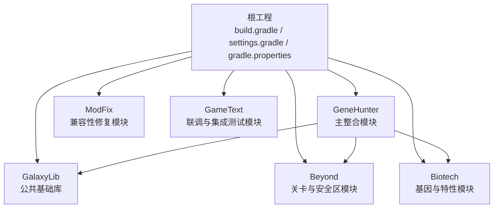
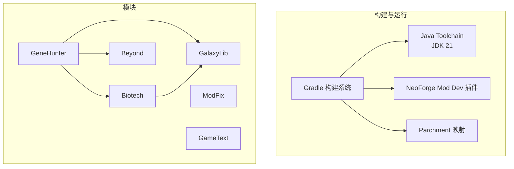
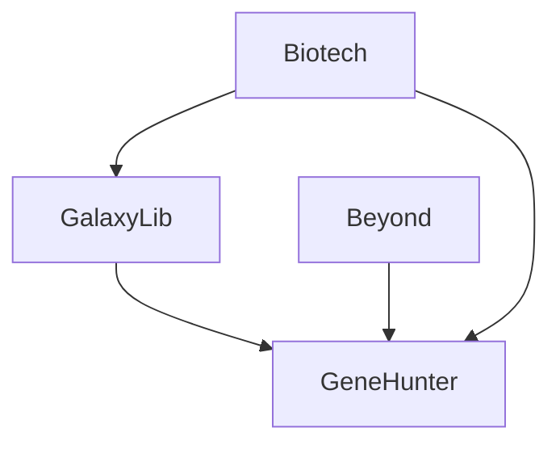

# 开发环境搭建

<cite>
**本文引用的文件**
- [根构建脚本 build.gradle](file://build.gradle)
- [设置文件 settings.gradle](file://settings.gradle)
- [根属性文件 gradle.properties](file://gradle.properties)
- [Gradle 包装器属性 gradle-wrapper.properties](file://gradle/wrapper/gradle-wrapper.properties)
- [Beyond 构建脚本 Beyond/build.gradle](file://Beyond/build.gradle)
- [Beyond 属性文件 Beyond/gradle.properties](file://Beyond/gradle.properties)
- [Beyond 模板 neoforge.mods.toml](file://Beyond/src/main/templates/META-INF/neoforge.mods.toml)
- [Biotech 构建脚本 Biotech/build.gradle](file://Biotech/build.gradle)
- [Biotech 属性文件 Biotech/gradle.properties](file://Biotech/gradle.properties)
- [Biotech 模板 neoforge.mods.toml](file://Biotech/src/main/templates/META-INF/neoforge.mods.toml)
- [GalaxyLib 构建脚本 GalaxyLib/build.gradle](file://GalaxyLib/build.gradle)
- [GeneHunter 构建脚本 GeneHunter/build.gradle](file://GeneHunter/build.gradle)
- [README 文档 README.md](file://README.md)
</cite>

## 目录
1. [引言](#引言)
2. [项目结构](#项目结构)
3. [核心组件](#核心组件)
4. [架构总览](#架构总览)
5. [详细组件分析](#详细组件分析)
6. [依赖关系分析](#依赖关系分析)
7. [性能考虑](#性能考虑)
8. [故障排除指南](#故障排除指南)
9. [结论](#结论)
10. [附录](#附录)

## 引言
本指南面向首次参与本多模块 NeoForge 项目的开发者，目标是帮助你在 Windows、macOS 或 Linux 上快速完成开发环境搭建，涵盖以下内容：
- JDK 21 安装与配置
- IntelliJ IDEA 或 Eclipse 的 IDE 设置
- Minecraft Forge/NeoForge 开发环境准备
- Gradle 构建系统配置、项目导入步骤、依赖下载与模块链接
- 不同操作系统的环境差异与注意事项
- 常见问题与解决方案
- 推荐的开发工具插件、代码格式化配置与调试环境设置

本项目为多模块工程，采用 Gradle + NeoForge Mod Dev 插件，使用 Parchment 映射，版本对齐至 Minecraft 1.21.1。

## 项目结构
项目采用“根工程 + 多子模块”的组织方式，模块间通过 Gradle 依赖进行链接。根工程负责统一插件与工具链管理，子模块各自维护构建脚本与运行配置。

图表来源
- [根构建脚本 build.gradle:1-4](file://build.gradle#L1-L4)
- [设置文件 settings.gradle:13-18](file://settings.gradle#L13-L18)
- [GalaxyLib 构建脚本 GalaxyLib/build.gradle:1-62](file://GalaxyLib/build.gradle#L1-L62)
- [Beyond 构建脚本 Beyond/build.gradle:1-107](file://Beyond/build.gradle#L1-L107)
- [Biotech 构建脚本 Biotech/build.gradle:1-125](file://Biotech/build.gradle#L1-L125)
- [GeneHunter 构建脚本 GeneHunter/build.gradle:1-102](file://GeneHunter/build.gradle#L1-L102)

章节来源
- [README.md: 项目简介与模块说明:3-14](file://README.md#L3-L14)
- [设置文件 settings.gradle:1-19](file://settings.gradle#L1-L19)

## 核心组件
- 工具链与插件
  - Gradle 版本：8.14.4（包装器）
  - 工具链解析器：foojay-resolver-convention
  - NeoForge Mod Dev 插件：用于简化 Forge/NeoForge 开发流程
- 版本与映射
  - Minecraft 版本：1.21.1
  - NeoForge 版本：21.1.223
  - Parchment 映射版本：2024.11.13
- 模块划分
  - GalaxyLib：公共基础库
  - Beyond：关卡与安全区玩法
  - Biotech：基因与特性系统
  - GeneHunter：主整合模块，聚合其他模块
  - ModFix：兼容性修复与 Mixin 补丁
  - GameText：联调与集成测试

章节来源
- [根属性文件 gradle.properties:9-15](file://gradle.properties#L9-L15)
- [Gradle 包装器属性 gradle-wrapper.properties:1-8](file://gradle/wrapper/gradle-wrapper.properties#L1-L8)
- [根构建脚本 build.gradle:1-4](file://build.gradle#L1-L4)
- [设置文件 settings.gradle:9-11](file://settings.gradle#L9-L11)

## 架构总览
下图展示了模块间的依赖关系与构建流程的关键节点。

图表来源
- [根构建脚本 build.gradle:1-4](file://build.gradle#L1-L4)
- [设置文件 settings.gradle:1-11](file://settings.gradle#L1-L11)
- [根属性文件 gradle.properties:9-15](file://gradle.properties#L9-L15)
- [GeneHunter 构建脚本 GeneHunter/build.gradle:71-75](file://GeneHunter/build.gradle#L71-L75)
- [Biotech 构建脚本 Biotech/build.gradle:74-85](file://Biotech/build.gradle#L74-L85)
- [Beyond 构建脚本 Beyond/build.gradle:64-67](file://Beyond/build.gradle#L64-L67)

## 详细组件分析

### JDK 21 安装与配置
- 要求
  - 使用 JDK 21 以匹配工具链语言版本与 Parchment 映射要求
- 配置要点
  - 通过 Java Toolchain 自动解析 JDK 21（在各模块的构建脚本中已声明）
  - 若本地未安装 JDK 21，可借助工具链解析器自动下载所需版本
- 平台差异
  - Windows/macOS/Linux 均可通过工具链解析器获取 JDK 21
  - 如需手动指定，请确保 JAVA_HOME 指向 JDK 21

章节来源
- [Beyond 构建脚本 Beyond/build.gradle](file://Beyond/build.gradle#L17)
- [Biotech 构建脚本 Biotech/build.gradle](file://Biotech/build.gradle#L27)
- [GalaxyLib 构建脚本 GalaxyLib/build.gradle:7-12](file://GalaxyLib/build.gradle#L7-L12)
- [GeneHunter 构建脚本 GeneHunter/build.gradle](file://GeneHunter/build.gradle#L22)

### Gradle 构建系统配置
- 根工程配置
  - 插件管理：本地仓库、Gradle 插件门户、NeoForged 官方仓库
  - 工具链解析器：自动解析可用 JDK
  - 模块包含：GalaxyLib、GeneHunter、GameText、Biotech、Beyond、ModFix
- 性能优化参数
  - 并行构建、缓存、配置缓存等已在根属性中启用
- 包装器
  - 固定 Gradle 版本，便于团队一致性

章节来源
- [设置文件 settings.gradle:1-11](file://settings.gradle#L1-L11)
- [设置文件 settings.gradle:13-18](file://settings.gradle#L13-L18)
- [根属性文件 gradle.properties:1-7](file://gradle.properties#L1-L7)
- [Gradle 包装器属性 gradle-wrapper.properties:1-8](file://gradle/wrapper/gradle-wrapper.properties#L1-L8)

### 模块构建与运行配置
- 公共配置
  - 工具链：JDK 21
  - NeoForge 版本与 Parchment 映射版本
  - 运行任务：client、server、gameTestServer、data
  - 资源目录：指向生成资源目录
  - 日志级别与注册表标记
- 模块特有配置
  - GalaxyLib：作为纯库模块，未启用运行任务
  - Beyond：无额外依赖，保持模块内独立
  - Biotech：引入 LDLib 与 Curios 依赖，并通过 Lombok 插件简化实体定义
  - GeneHunter：聚合 GalaxyLib、Beyond、Biotech

章节来源
- [Beyond 构建脚本 Beyond/build.gradle:17-51](file://Beyond/build.gradle#L17-L51)
- [Beyond 构建脚本 Beyond/build.gradle:59-89](file://Beyond/build.gradle#L59-L89)
- [Biotech 构建脚本 Biotech/build.gradle:27-67](file://Biotech/build.gradle#L27-L67)
- [Biotech 构建脚本 Biotech/build.gradle:69-107](file://Biotech/build.gradle#L69-L107)
- [GalaxyLib 构建脚本 GalaxyLib/build.gradle:7-49](file://GalaxyLib/build.gradle#L7-L49)
- [GeneHunter 构建脚本 GeneHunter/build.gradle:22-64](file://GeneHunter/build.gradle#L22-L64)
- [GeneHunter 构建脚本 GeneHunter/build.gradle:66-75](file://GeneHunter/build.gradle#L66-L75)

### 模板与元数据生成
- 模板位置
  - 各模块的模板位于 src/main/templates/META-INF/neoforge.mods.toml
- 元数据生成
  - 通过 generateModMetadata 任务替换模板中的变量（如版本、范围、作者、描述等）
  - 将生成的元数据加入资源目录，供运行时加载

章节来源
- [Beyond 模板 neoforge.mods.toml:1-80](file://Beyond/src/main/templates/META-INF/neoforge.mods.toml#L1-L80)
- [Biotech 模板 neoforge.mods.toml:1-80](file://Biotech/src/main/templates/META-INF/neoforge.mods.toml#L1-L80)
- [Beyond 构建脚本 Beyond/build.gradle:69-89](file://Beyond/build.gradle#L69-L89)
- [Biotech 构建脚本 Biotech/build.gradle:87-107](file://Biotech/build.gradle#L87-L107)
- [GeneHunter 构建脚本 GeneHunter/build.gradle:77-97](file://GeneHunter/build.gradle#L77-L97)

### 依赖下载与模块链接
- 依赖来源
  - Maven 本地仓库
  - NeoForged 官方仓库（由插件管理）
  - Biotech 专用仓库：LDLib 与 Curios
- 模块链接
  - GeneHunter 通过 implementation 引用 GalaxyLib、Beyond、Biotech
  - Biotech 可选地引用 GalaxyLib（内部依赖）

章节来源
- [Beyond 构建脚本 Beyond/build.gradle:9-11](file://Beyond/build.gradle#L9-L11)
- [Biotech 构建脚本 Biotech/build.gradle:12-21](file://Biotech/build.gradle#L12-L21)
- [Biotech 构建脚本 Biotech/build.gradle:74-85](file://Biotech/build.gradle#L74-L85)
- [GeneHunter 构建脚本 GeneHunter/build.gradle:71-75](file://GeneHunter/build.gradle#L71-L75)

### 调试与运行
- 运行任务
  - client：启动客户端
  - server：启动服务器（禁用 GUI）
  - gameTestServer：游戏测试服务器
  - data：生成数据与资源
- 日志与标记
  - 注册表日志标记：REGISTRIES
  - 默认日志级别：DEBUG

章节来源
- [Beyond 构建脚本 Beyond/build.gradle:25-51](file://Beyond/build.gradle#L25-L51)
- [Biotech 构建脚本 Biotech/build.gradle:35-61](file://Biotech/build.gradle#L35-L61)
- [GalaxyLib 构建脚本 GalaxyLib/build.gradle:14-41](file://GalaxyLib/build.gradle#L14-L41)
- [GeneHunter 构建脚本 GeneHunter/build.gradle:31-57](file://GeneHunter/build.gradle#L31-L57)

## 依赖关系分析
下图展示模块间的依赖关系与构建顺序。

图表来源
- [GeneHunter 构建脚本 GeneHunter/build.gradle:71-75](file://GeneHunter/build.gradle#L71-L75)
- [Biotech 构建脚本 Biotech/build.gradle:74-85](file://Biotech/build.gradle#L74-L85)

章节来源
- [README.md: 依赖管理约定:34-37](file://README.md#L34-L37)

## 性能考虑
- Gradle 性能优化已在根属性中启用：并行构建、缓存、配置缓存
- 建议在首次构建时允许完整下载依赖，后续增量构建将更快
- 若网络不稳定，可先在本地搭建镜像或代理，减少依赖下载失败

章节来源
- [根属性文件 gradle.properties:1-7](file://gradle.properties#L1-L7)

## 故障排除指南
- 找不到 JDK 21
  - 确认工具链解析器可用；若本地无 JDK，工具链会尝试自动下载
  - 可手动安装 JDK 21 并确保 PATH 正确
- 依赖下载失败
  - 检查网络与代理设置
  - 确认 settings.gradle 中的仓库地址可达
  - 清理 Gradle 缓存后重试
- 运行时报错找不到模组元数据
  - 确保 generateModMetadata 任务执行成功
  - 检查模板路径与变量替换是否正确
- 模块链接异常
  - 确认 settings.gradle 中已包含对应模块
  - 确保模块构建脚本中的 mod_id 与模板一致

章节来源
- [设置文件 settings.gradle:1-11](file://settings.gradle#L1-L11)
- [Beyond 构建脚本 Beyond/build.gradle:69-89](file://Beyond/build.gradle#L69-L89)
- [Biotech 构建脚本 Biotech/build.gradle:87-107](file://Biotech/build.gradle#L87-L107)
- [根属性文件 gradle.properties:1-7](file://gradle.properties#L1-L7)

## 结论
本指南提供了基于 Gradle + NeoForge Mod Dev 插件的完整开发环境搭建路径。遵循本文步骤，你可以在不同操作系统上快速完成 JDK 21、IDE 配置、依赖下载与模块链接，并顺利运行与调试项目。建议在团队协作中保持 Gradle 包装器版本一致，以避免环境差异导致的问题。

## 附录

### 开发工具与插件推荐
- IntelliJ IDEA
  - NeoForge/Forge 开发插件（随 Mod Dev 插件生态）
  - Lombok 插件（Biotech 模块已启用）
  - .gitignore 与 Markdown 预览插件
- Eclipse
  - NeoForge/Minecraft 开发支持
  - Buildship Gradle Integration
- 代码格式化
  - 使用 EditorConfig 统一缩进与换行
  - Java 编译选项已设置 UTF-8

章节来源
- [Biotech 构建脚本 Biotech/build.gradle:5-6](file://Biotech/build.gradle#L5-L6)
- [Beyond 构建脚本 Beyond/build.gradle:104-106](file://Beyond/build.gradle#L104-L106)
- [Biotech 构建脚本 Biotech/build.gradle:122-124](file://Biotech/build.gradle#L122-L124)
- [根属性文件 gradle.properties:1-7](file://gradle.properties#L1-L7)

### 项目导入步骤（IntelliJ IDEA）
- 打开项目根目录
- 等待 Gradle 同步完成
- 在 Gradle 视图中展开模块，执行 generateModMetadata 任务
- 配置运行任务：client、server、gameTestServer、data
- 如需调试，选择相应运行配置并添加 JVM 参数（如有需要）

章节来源
- [Beyond 构建脚本 Beyond/build.gradle:25-51](file://Beyond/build.gradle#L25-L51)
- [Biotech 构建脚本 Biotech/build.gradle:35-61](file://Biotech/build.gradle#L35-L61)
- [GalaxyLib 构建脚本 GalaxyLib/build.gradle:14-41](file://GalaxyLib/build.gradle#L14-L41)
- [GeneHunter 构建脚本 GeneHunter/build.gradle:31-57](file://GeneHunter/build.gradle#L31-L57)

### 项目导入步骤（Eclipse）
- 导入为 Gradle 项目（Buildship）
- 同步 Gradle 后执行 generateModMetadata
- 在 Run Configurations 中添加 NeoForge 运行配置（client/server/gametest/data）

章节来源
- [Beyond 构建脚本 Beyond/build.gradle:25-51](file://Beyond/build.gradle#L25-L51)
- [Biotech 构建脚本 Biotech/build.gradle:35-61](file://Biotech/build.gradle#L35-L61)
- [GalaxyLib 构建脚本 GalaxyLib/build.gradle:14-41](file://GalaxyLib/build.gradle#L14-L41)
- [GeneHunter 构建脚本 GeneHunter/build.gradle:31-57](file://GeneHunter/build.gradle#L31-L57)