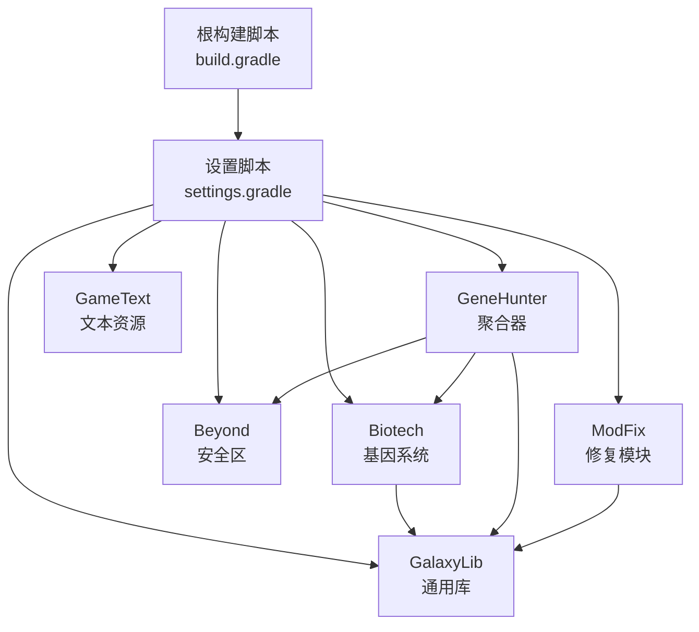
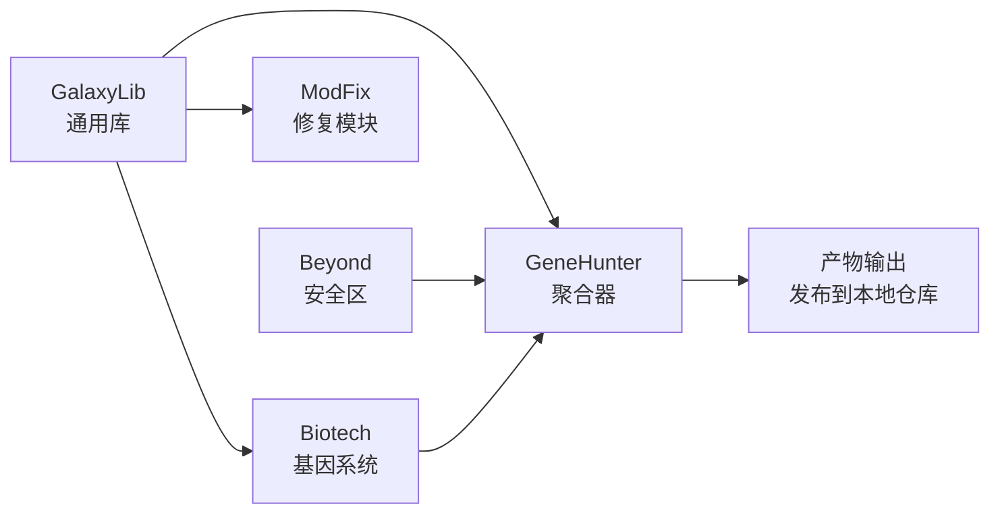
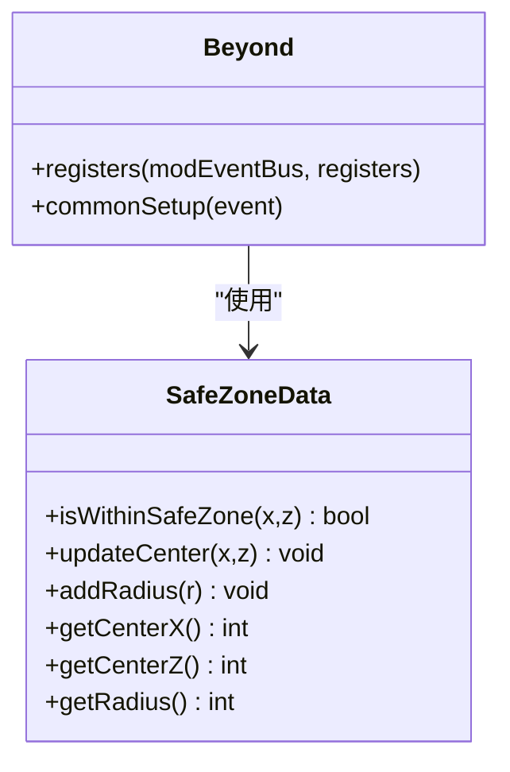
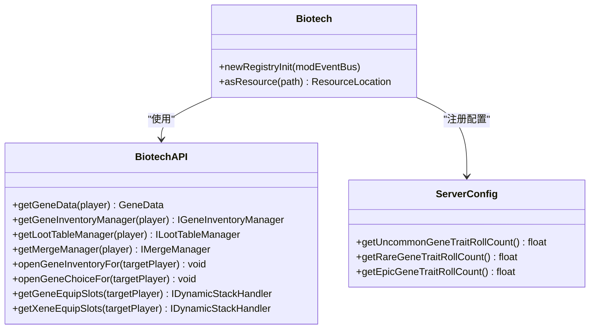
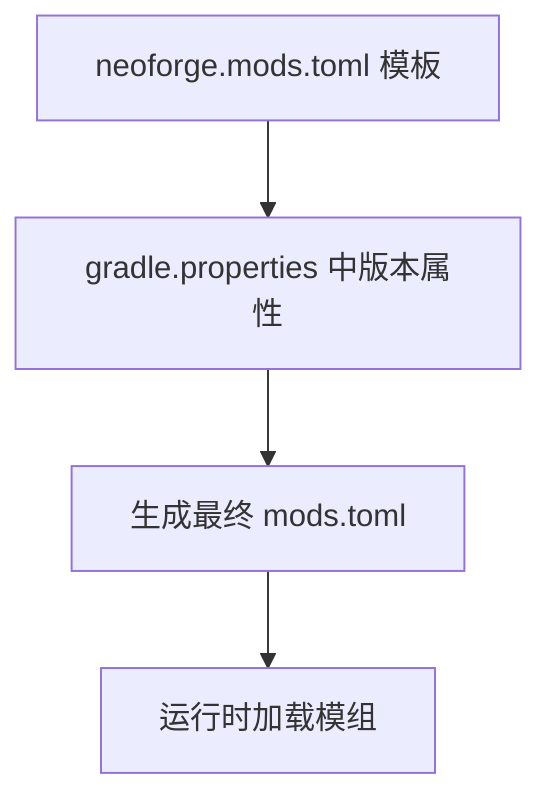
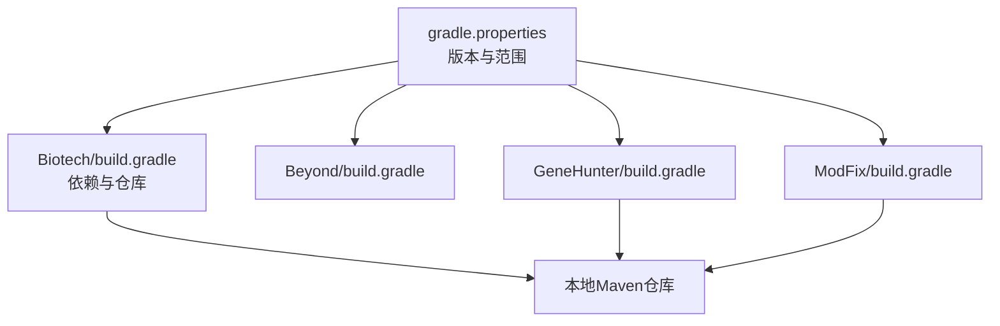

# 开发者指南

<cite>
**本文引用的文件**
- [settings.gradle](file://settings.gradle)
- [build.gradle](file://build.gradle)
- [gradle.properties](file://gradle.properties)
- [.github/workflows/build.yml](file://.github/workflows/build.yml)
- [GalaxyLib/build.gradle](file://GalaxyLib/build.gradle)
- [Biotech/build.gradle](file://Biotech/build.gradle)
- [Beyond/build.gradle](file://Beyond/build.gradle)
- [GeneHunter/build.gradle](file://GeneHunter/build.gradle)
- [ModFix/build.gradle](file://ModFix/build.gradle)
- [Beyond/src/main/java/com/pz/beyond/Beyond.java](file://Beyond/src/main/java/com/pz/beyond/Beyond.java)
- [Biotech/src/main/java/org/biotech/Biotech.java](file://Biotech/src/main/java/org/biotech/Biotech.java)
- [Biotech/src/main/java/org/biotech/api/BiotechAPI.java](file://Biotech/src/main/java/org/biotech/api/BiotechAPI.java)
- [Beyond/src/main/java/com/pz/beyond/data/SafeZoneData.java](file://Beyond/src/main/java/com/pz/beyond/data/SafeZoneData.java)
- [Beyond/src/main/java/com/pz/beyond/Config.java](file://Beyond/src/main/java/com/pz/beyond/Config.java)
- [Biotech/src/main/java/org/biotech/api/config/ServerConfig.java](file://Biotech/src/main/java/org/biotech/api/config/ServerConfig.java)
- [Beyond/src/main/templates/META-INF/neoforge.mods.toml](file://Beyond/src/main/templates/META-INF/neoforge.mods.toml)
- [Biotech/src/main/templates/META-INF/neoforge.mods.toml](file://Biotech/src/main/templates/META-INF/neoforge.mods.toml)
- [GalaxyLib/src/main/java/org/galaxy/gene_hunter/Common.java](file://GalaxyLib/src/main/java/org/galaxy/gene_hunter/Common.java)
</cite>

## 目录
1. [简介](#简介)
2. [项目结构](#项目结构)
3. [核心组件](#核心组件)
4. [架构总览](#架构总览)
5. [详细组件分析](#详细组件分析)
6. [依赖分析](#依赖分析)
7. [性能考虑](#性能考虑)
8. [故障排查指南](#故障排查指南)
9. [结论](#结论)
10. [附录](#附录)

## 简介
本指南面向新加入的开发者，帮助你快速完成开发环境搭建、理解项目结构与模块职责、掌握构建与发布流程、编写符合规范的代码、进行有效调试与性能分析，并制定单元测试、集成测试与UI测试策略。同时提供IDE配置建议、代码风格与注释规范、版本控制最佳实践以及常见问题排查方法。

## 项目结构
本仓库采用多模块Gradle工程组织，包含通用库与多个功能子模组：
- GalaxyLib：通用库模块，提供基础能力与常量。
- Biotech：核心玩法模块，包含基因系统、特性系统、物品与菜单、数据生成与网络包等。
- Beyond：安全区与规则相关模块，包含数据持久化、事件处理与渲染等。
- GeneHunter：聚合模块，整合GalaxyLib、Beyond、Biotech等模块。
- ModFix：修复或适配性模块，可选依赖GalaxyLib。
- GameText：文本资源模块。
- GitHub Actions：自动化构建工作流。

图表来源
- [settings.gradle:13-18](file://settings.gradle#L13-L18)
- [build.gradle:1-4](file://build.gradle#L1-L4)

章节来源
- [settings.gradle:1-19](file://settings.gradle#L1-L19)
- [build.gradle:1-4](file://build.gradle#L1-L4)
- [gradle.properties:1-16](file://gradle.properties#L1-L16)

## 核心组件
- 构建系统与工具链
  - Gradle插件：使用NeoForged Mod Dev插件与工具链解析器约定，统一版本与运行配置。
  - 版本属性：集中于gradle.properties，统一管理Minecraft、NeoForge、Parchment等版本范围。
  - 运行任务：各模块定义client、server、gameTestServer与data生成任务，便于本地调试与资源生成。
- 配置与元数据
  - 模组元数据：通过模板生成neoforge.mods.toml，动态注入版本、名称、描述、依赖范围等。
  - 服务器配置：Biotech提供ServerConfig；Beyond提供空配置示例。
- 事件总线与生命周期
  - Biotech与Beyond均通过IEventBus注册初始化逻辑与配置文件。
- 数据持久化与网络
  - SafeZoneData继承SavedData，支持NBT读写与广播更新。
  - BiotechAPI提供跨模块访问玩家能力与打开UI的入口。

章节来源
- [Biotech/build.gradle:29-66](file://Biotech/build.gradle#L29-L66)
- [Beyond/build.gradle:19-56](file://Beyond/build.gradle#L19-L56)
- [Biotech/src/main/java/org/biotech/api/BiotechAPI.java:1-92](file://Biotech/src/main/java/org/biotech/api/BiotechAPI.java#L1-L92)
- [Beyond/src/main/java/com/pz/beyond/data/SafeZoneData.java:1-101](file://Beyond/src/main/java/com/pz/beyond/data/SafeZoneData.java#L1-L101)
- [Beyond/src/main/java/com/pz/beyond/Config.java:1-20](file://Beyond/src/main/java/com/pz/beyond/Config.java#L1-L20)
- [Biotech/src/main/java/org/biotech/api/config/ServerConfig.java:1-49](file://Biotech/src/main/java/org/biotech/api/config/ServerConfig.java#L1-L49)

## 架构总览
下图展示模块间的依赖关系与职责分工：

图表来源
- [GalaxyLib/build.gradle:1-62](file://GalaxyLib/build.gradle#L1-L62)
- [Biotech/build.gradle:74-84](file://Biotech/build.gradle#L74-L84)
- [Beyond/build.gradle:64-67](file://Beyond/build.gradle#L64-L67)
- [GeneHunter/build.gradle:71-75](file://GeneHunter/build.gradle#L71-L75)

## 详细组件分析

### Beyond 模块
- 职责：安全区规则、数据持久化、事件与注册入口。
- 关键点：
  - 使用IEventBus注册配置与初始化逻辑。
  - SafeZoneData实现SavedData，提供中心点与半径更新与广播。
  - 通过工具类初始化自动规则。

图表来源
- [Beyond/src/main/java/com/pz/beyond/Beyond.java:46-77](file://Beyond/src/main/java/com/pz/beyond/Beyond.java#L46-L77)
- [Beyond/src/main/java/com/pz/beyond/data/SafeZoneData.java:16-100](file://Beyond/src/main/java/com/pz/beyond/data/SafeZoneData.java#L16-L100)

章节来源
- [Beyond/src/main/java/com/pz/beyond/Beyond.java:1-79](file://Beyond/src/main/java/com/pz/beyond/Beyond.java#L1-L79)
- [Beyond/src/main/java/com/pz/beyond/data/SafeZoneData.java:1-101](file://Beyond/src/main/java/com/pz/beyond/data/SafeZoneData.java#L1-L101)
- [Beyond/src/main/java/com/pz/beyond/Config.java:1-20](file://Beyond/src/main/java/com/pz/beyond/Config.java#L1-L20)

### Biotech 模块
- 职责：基因系统、特性系统、物品与菜单、数据生成、Curios集成、API对外暴露。
- 关键点：
  - 通过IEventBus注册Trait、Gene、LootType等注册表。
  - BiotechAPI提供统一入口，访问玩家能力、打开UI、查询Curios槽位。
  - ServerConfig提供服务器端配置项。

图表来源
- [Biotech/src/main/java/org/biotech/Biotech.java:23-61](file://Biotech/src/main/java/org/biotech/Biotech.java#L23-L61)
- [Biotech/src/main/java/org/biotech/api/BiotechAPI.java:21-92](file://Biotech/src/main/java/org/biotech/api/BiotechAPI.java#L21-L92)
- [Biotech/src/main/java/org/biotech/api/config/ServerConfig.java:7-48](file://Biotech/src/main/java/org/biotech/api/config/ServerConfig.java#L7-L48)

章节来源
- [Biotech/src/main/java/org/biotech/Biotech.java:1-73](file://Biotech/src/main/java/org/biotech/Biotech.java#L1-L73)
- [Biotech/src/main/java/org/biotech/api/BiotechAPI.java:1-92](file://Biotech/src/main/java/org/biotech/api/BiotechAPI.java#L1-L92)
- [Biotech/src/main/java/org/biotech/api/config/ServerConfig.java:1-49](file://Biotech/src/main/java/org/biotech/api/config/ServerConfig.java#L1-L49)

### 模组元数据与依赖声明
- 模组元数据由模板生成，包含modid、版本、显示名、作者、描述、Mixins配置与NeoForge/Minecraft依赖范围。
- 各模块在构建脚本中声明对NeoForge与Minecraft版本范围的要求。

图表来源
- [Beyond/src/main/templates/META-INF/neoforge.mods.toml:17-73](file://Beyond/src/main/templates/META-INF/neoforge.mods.toml#L17-L73)
- [Biotech/src/main/templates/META-INF/neoforge.mods.toml:17-73](file://Biotech/src/main/templates/META-INF/neoforge.mods.toml#L17-L73)
- [gradle.properties:9-15](file://gradle.properties#L9-L15)

章节来源
- [Beyond/src/main/templates/META-INF/neoforge.mods.toml:1-80](file://Beyond/src/main/templates/META-INF/neoforge.mods.toml#L1-L80)
- [Biotech/src/main/templates/META-INF/neoforge.mods.toml:1-80](file://Biotech/src/main/templates/META-INF/neoforge.mods.toml#L1-L80)
- [gradle.properties:1-16](file://gradle.properties#L1-L16)

## 依赖分析
- 版本与工具链
  - Minecraft 1.21.1，NeoForge 21.1.x，Parchment 2024.11.13。
  - 工具链使用Java 21。
- 模块依赖
  - Biotech显式依赖GalaxyLib与第三方库（LDLib、Curios）。
  - GeneHunter聚合GalaxyLib、Beyond、Biotech。
  - ModFix可选依赖GalaxyLib。
- 发布与本地仓库
  - 各模块配置了本地Maven仓库发布路径，便于本地联调。

图表来源
- [gradle.properties:9-15](file://gradle.properties#L9-L15)
- [Biotech/build.gradle:14-21](file://Biotech/build.gradle#L14-L21)
- [Biotech/build.gradle:74-84](file://Biotech/build.gradle#L74-L84)
- [GeneHunter/build.gradle:71-75](file://GeneHunter/build.gradle#L71-L75)
- [ModFix/build.gradle:68-72](file://ModFix/build.gradle#L68-L72)

章节来源
- [gradle.properties:1-16](file://gradle.properties#L1-L16)
- [Biotech/build.gradle:1-125](file://Biotech/build.gradle#L1-L125)
- [Beyond/build.gradle:1-107](file://Beyond/build.gradle#L1-L107)
- [GeneHunter/build.gradle:1-102](file://GeneHunter/build.gradle#L1-L102)
- [ModFix/build.gradle:1-113](file://ModFix/build.gradle#L1-L113)

## 性能考虑
- 构建性能
  - 启用并行、缓存与配置缓存，提升增量构建速度。
  - 使用工具链解析器约定，确保依赖解析一致性。
- 运行性能
  - 事件监听与注册尽量集中在生命周期回调中，避免重复注册。
  - 数据持久化与广播需注意频率，避免频繁IO与网络包。
- 资源生成
  - data运行任务仅在需要时执行，减少不必要的资源扫描与生成。

章节来源
- [gradle.properties:2-6](file://gradle.properties#L2-L6)
- [Beyond/build.gradle:47-50](file://Beyond/build.gradle#L47-L50)
- [Biotech/build.gradle:57-60](file://Biotech/build.gradle#L57-L60)

## 故障排查指南
- 构建失败
  - 检查Java版本与工具链是否匹配（Java 21）。
  - 确认仓库可用性与网络代理设置。
  - 清理缓存后重试：删除.gradle/caches与build目录。
- 运行异常
  - 查看运行日志中的注册阶段错误与依赖冲突。
  - 确认模组元数据生成成功且版本范围满足NeoForge/Minecraft要求。
- 配置问题
  - Biotech的ServerConfig未生效时，检查配置文件位置与类型。
  - Beyond的配置为空，确认是否需要扩展配置项。
- 数据同步
  - SafeZoneData更新后需广播，确认广播调用与网络层实现。

章节来源
- [Beyond/src/main/java/com/pz/beyond/data/SafeZoneData.java:60-74](file://Beyond/src/main/java/com/pz/beyond/data/SafeZoneData.java#L60-L74)
- [Beyond/src/main/java/com/pz/beyond/Config.java:1-20](file://Beyond/src/main/java/com/pz/beyond/Config.java#L1-L20)
- [Biotech/src/main/java/org/biotech/api/config/ServerConfig.java:15-32](file://Biotech/src/main/java/org/biotech/api/config/ServerConfig.java#L15-L32)

## 结论
本项目以模块化方式组织，围绕NeoForge生态构建，强调版本与依赖的集中管理、事件驱动的注册机制与清晰的API边界。遵循本文档的开发与测试策略，可显著提升开发效率与质量稳定性。

## 附录

### A. 开发环境搭建
- JDK与工具链
  - 使用Java 21与Gradle Wrapper。
  - 启用并行、缓存与配置缓存。
- IDE导入
  - 建议使用IntelliJ IDEA，启用Gradle与NeoForged插件。
  - 导入settings.gradle后，所有模块应可见。
- 运行与调试
  - 使用client、server、gameTestServer任务启动游戏。
  - data任务生成资源与模型文件。

章节来源
- [gradle.properties:2-6](file://gradle.properties#L2-L6)
- [Beyond/build.gradle:25-50](file://Beyond/build.gradle#L25-L50)
- [Biotech/build.gradle:35-60](file://Biotech/build.gradle#L35-L60)

### B. 代码规范与注释规范
- 包命名与模块边界
  - 严格按模块包名组织，避免跨模块直接依赖。
- 类与方法注释
  - 公共API需提供简明用途说明与参数/返回值含义。
- 日志与错误处理
  - 使用SLF4J记录信息与错误，定位问题时保留上下文。
- 事件与注册
  - 在生命周期回调中注册，避免在构造函数中做重活。

章节来源
- [Biotech/src/main/java/org/biotech/api/BiotechAPI.java:18-21](file://Biotech/src/main/java/org/biotech/api/BiotechAPI.java#L18-L21)
- [Beyond/src/main/java/com/pz/beyond/Beyond.java:62-65](file://Beyond/src/main/java/com/pz/beyond/Beyond.java#L62-L65)

### C. 版本控制最佳实践
- 分支策略
  - 主分支保护，功能在特性分支开发并通过PR合并。
- 提交信息
  - 使用动宾短语，简述变更与影响范围。
- 标签与发布
  - 重要里程碑打标签，配合GitHub Actions自动构建。

章节来源
- [.github/workflows/build.yml:1-25](file://.github/workflows/build.yml#L1-L25)

### D. 测试策略
- 单元测试
  - 针对纯逻辑类（如配置读取、工具类）编写测试。
- 集成测试
  - 使用NeoForge GameTest框架验证交互流程。
- UI测试
  - 通过模拟玩家行为与断言UI状态，结合事件总线验证交互结果。

章节来源
- [Beyond/build.gradle:36-39](file://Beyond/build.gradle#L36-L39)
- [Biotech/build.gradle:46-49](file://Biotech/build.gradle#L46-L49)

### E. 调试与性能分析
- 调试工具
  - 使用IDE断点与日志，关注事件触发顺序与参数。
- 性能分析
  - 关注注册与初始化阶段的耗时，避免重复注册与阻塞主线程。
- 网络与数据
  - 对高频广播与持久化操作进行节流与批处理。

章节来源
- [Beyond/src/main/java/com/pz/beyond/data/SafeZoneData.java:60-79](file://Beyond/src/main/java/com/pz/beyond/data/SafeZoneData.java#L60-L79)

### F. 新人入职清单
- 环境准备：安装JDK 21、IDEA、Git。
- 代码检出与导入：同步仓库，导入Gradle项目。
- 首次构建：执行build任务，查看日志。
- 运行验证：启动client与server，确认无报错。
- 学习资源：阅读Biotech与Beyond模块的API与注册流程。

章节来源
- [settings.gradle:13-18](file://settings.gradle#L13-L18)
- [Biotech/src/main/java/org/biotech/Biotech.java:23-39](file://Biotech/src/main/java/org/biotech/Biotech.java#L23-L39)
- [Beyond/src/main/java/com/pz/beyond/Beyond.java:46-60](file://Beyond/src/main/java/com/pz/beyond/Beyond.java#L46-L60)