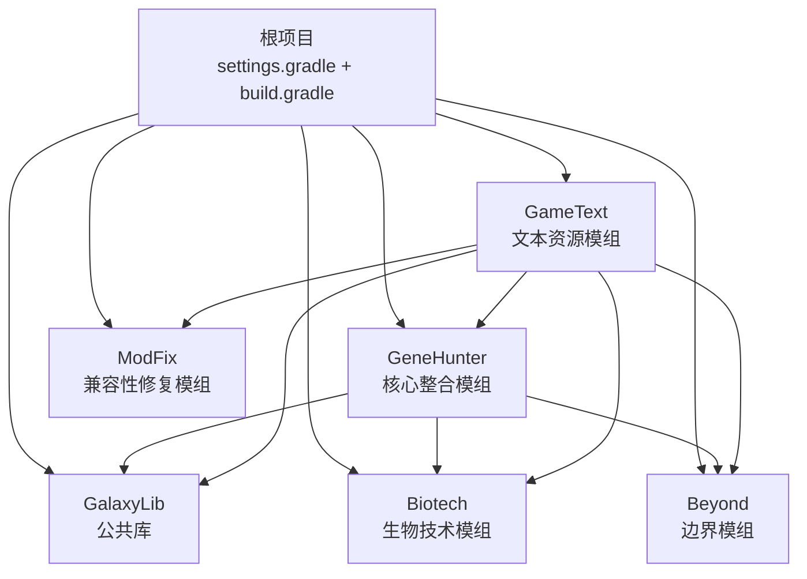
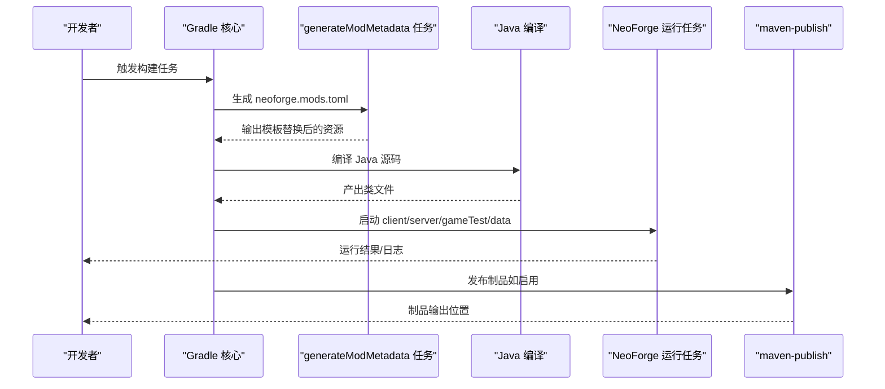
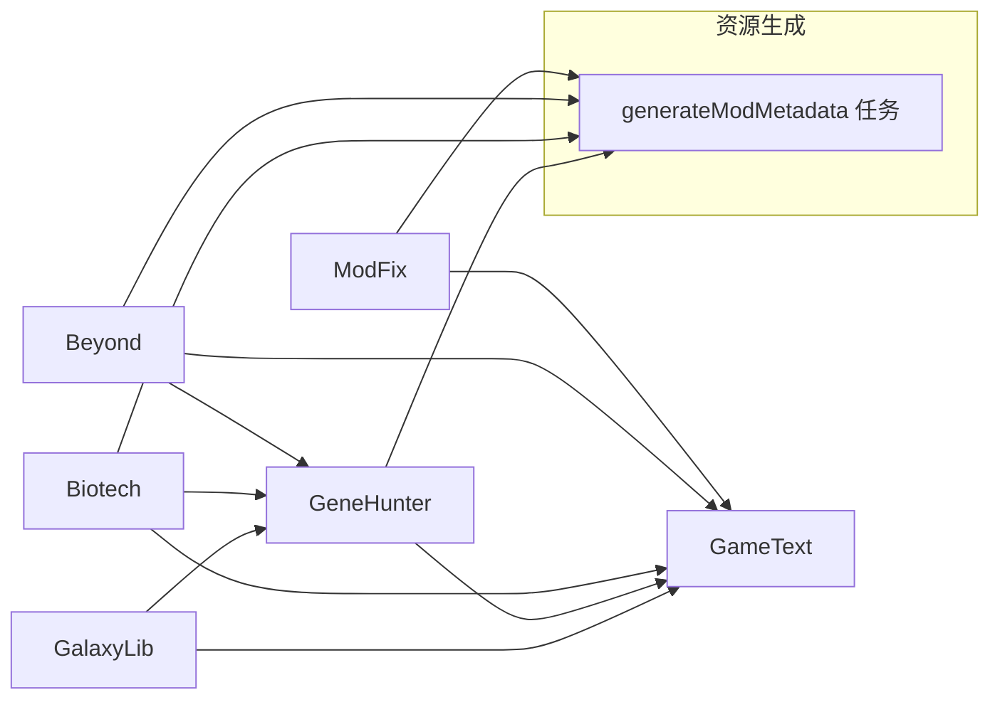

# 构建与部署

<cite>
**本文档引用的文件**
- [build.gradle](file://build.gradle)
- [settings.gradle](file://settings.gradle)
- [gradle.properties](file://gradle.properties)
- [.github/workflows/build.yml](file://.github/workflows/build.yml)
- [Beyond/build.gradle](file://Beyond/build.gradle)
- [Beyond/gradle.properties](file://Beyond/gradle.properties)
- [Biotech/build.gradle](file://Biotech/build.gradle)
- [Biotech/gradle.properties](file://Biotech/gradle.properties)
- [GalaxyLib/build.gradle](file://GalaxyLib/build.gradle)
- [GeneHunter/build.gradle](file://GeneHunter/build.gradle)
- [GameText/build.gradle](file://GameText/build.gradle)
- [ModFix/build.gradle](file://ModFix/build.gradle)
</cite>

## 目录
1. [简介](#简介)
2. [项目结构](#项目结构)
3. [核心组件](#核心组件)
4. [架构总览](#架构总览)
5. [详细组件分析](#详细组件分析)
6. [依赖关系分析](#依赖关系分析)
7. [性能考虑](#性能考虑)
8. [故障排查指南](#故障排查指南)
9. [结论](#结论)
10. [附录](#附录)

## 简介
本指南面向多模块 Minecraft NeoForge 项目，系统性阐述构建与部署流程，涵盖 Gradle 多模块配置、依赖管理策略、打包发布、版本号管理、构建顺序、本地测试环境、CI/CD 流水线与自动化部署建议，以及构建优化、依赖冲突解决与发布前检查清单。目标是帮助团队以一致、可重复的方式交付高质量的模组制品。

## 项目结构
本仓库采用 Gradle 多模块结构，包含一个公共库模块与多个模组模块，通过 settings.gradle 声明模块包含关系；根 build.gradle 提供统一仓库与插件管理；各子模块通过各自的 gradle.properties 定义模组元数据与版本信息；GitHub Actions 提供基础的 CI 构建流水线。

图表来源
- [settings.gradle:13-18](file://settings.gradle#L13-L18)
- [GalaxyLib/build.gradle:1-62](file://GalaxyLib/build.gradle#L1-L62)
- [GeneHunter/build.gradle:10-74](file://GeneHunter/build.gradle#L10-L74)
- [GameText/build.gradle:34-41](file://GameText/build.gradle#L34-L41)

章节来源
- [settings.gradle:1-19](file://settings.gradle#L1-L19)
- [build.gradle:1-17](file://build.gradle#L1-L17)
- [gradle.properties:1-21](file://gradle.properties#L1-L21)

## 核心组件
- 根级构建与仓库
  - 插件与仓库集中配置，确保所有子模块复用统一的仓库源与插件版本，减少重复与漂移。
  - 版本常量集中于根 gradle.properties，便于全局升级与一致性管理。
- 模块化定义
  - 每个子模块拥有独立的 gradle.properties，定义 mod_id、mod_version、mod_group_id 等元数据。
  - 使用 NeoForge Mod Dev 插件，自动注入运行时任务、资源生成与 IDE 同步任务。
- 发布与打包
  - 子模块可选启用 maven-publish 插件，将制品发布到本地仓库或远程仓库。
  - 通过 generateModMetadata 任务动态生成 neoforge.mods.toml，保证元数据与版本一致。

章节来源
- [build.gradle:1-17](file://build.gradle#L1-L17)
- [gradle.properties:9-21](file://gradle.properties#L9-L21)
- [Beyond/build.gradle:69-88](file://Beyond/build.gradle#L69-L88)
- [Biotech/build.gradle:78-98](file://Biotech/build.gradle#L78-L98)
- [ModFix/build.gradle:74-94](file://ModFix/build.gradle#L74-L94)

## 架构总览
下图展示构建与发布的关键路径：从 Gradle 任务执行到资源生成、编译、打包与发布。

图表来源
- [Beyond/build.gradle:69-88](file://Beyond/build.gradle#L69-L88)
- [Biotech/build.gradle:78-98](file://Biotech/build.gradle#L78-L98)
- [ModFix/build.gradle:74-94](file://ModFix/build.gradle#L74-L94)
- [GeneHunter/build.gradle:77-97](file://GeneHunter/build.gradle#L77-L97)

## 详细组件分析

### 根项目与仓库配置
- 作用
  - 统一插件与仓库源，避免子模块重复声明。
  - 在 allprojects 中集中声明仓库，确保依赖解析一致性。
- 关键点
  - NeoForged 官方仓库与第三方仓库（如 Curios、FirstDark）均在此声明。
  - 通过 gradle.properties 统一版本常量，避免硬编码。
- 建议
  - 新增依赖仓库时优先在根 build.gradle 维护，保持一致性。
  - 对于版本号变更，优先修改根 gradle.properties 并同步更新子模块属性文件。

章节来源
- [build.gradle:5-16](file://build.gradle#L5-L16)
- [gradle.properties:9-21](file://gradle.properties#L9-L21)

### 模块包含与构建顺序
- 模块包含
  - settings.gradle 显式 include 所有子模块，确保 Gradle 能正确识别与排序。
- 构建顺序
  - Gradle 将根据模块间依赖关系自动排序；显式声明 implementation(project(":...")) 的模块会先于被依赖模块构建。
- 建议
  - 保持模块间单向依赖，避免循环依赖导致构建失败。
  - 对于公共库 GalaxyLib，确保其无对业务模组的反向依赖。

章节来源
- [settings.gradle:13-18](file://settings.gradle#L13-L18)
- [GeneHunter/build.gradle:72-74](file://GeneHunter/build.gradle#L72-L74)
- [GameText/build.gradle:34-40](file://GameText/build.gradle#L34-L40)

### 版本号管理
- 版本来源
  - 根 gradle.properties 定义 Minecraft、NeoForge、Parchment 等版本范围与共享依赖版本。
  - 各子模块 gradle.properties 定义 mod_version、mod_group_id、mod_id 等。
- 管理策略
  - 使用语义化版本（SemVer），在发布分支上统一提升主/次/补丁版本。
  - 共享依赖版本通过根 gradle.properties 的 dep_* 变量集中维护，子模块按需覆盖。
- 建议
  - 发布前统一校验所有模块的 mod_version 是否一致。
  - 使用 Git 标签配合 CI 触发发布流程，确保版本与发布产物一一对应。

章节来源
- [gradle.properties:9-21](file://gradle.properties#L9-L21)
- [Beyond/gradle.properties:10-11](file://Beyond/gradle.properties#L10-L11)
- [Biotech/gradle.properties:10-11](file://Biotech/gradle.properties#L10-L11)
- [GeneHunter/gradle.properties](file://GeneHunter/gradle.properties#L6)
- [ModFix/gradle.properties](file://ModFix/gradle.properties#L6)

### 依赖管理策略
- 公共库与业务模组
  - GalaxyLib 作为公共库，被 GeneHunter、GameText 等业务模组依赖。
  - Biotech 与 ModFix 通过 implementation 引入 GalaxyLib 与共享依赖（如 ldlib2、Curios）。
- 仓库与版本
  - 仓库由根 build.gradle 统一下发，子模块无需重复声明。
  - 共享依赖版本通过根 gradle.properties 的 dep_* 变量统一管理。
- 冲突解决
  - 若出现依赖冲突，优先在根 gradle.properties 升级共享版本，或在具体模块使用强制版本排除策略。
  - 对于 Mixin 或 API 兼容性问题，优先通过 Parchment 映射与版本范围控制降低风险。

章节来源
- [GalaxyLib/build.gradle:1-62](file://GalaxyLib/build.gradle#L1-L62)
- [Biotech/build.gradle:65-76](file://Biotech/build.gradle#L65-L76)
- [ModFix/build.gradle:68-72](file://ModFix/build.gradle#L68-L72)
- [build.gradle:5-16](file://build.gradle#L5-L16)
- [gradle.properties:17-21](file://gradle.properties#L17-L21)

### 打包与发布流程
- 本地打包
  - 使用 NeoForge Mod Dev 插件提供的 runs 任务启动客户端/服务端进行验证。
  - 可选启用 maven-publish，将制品发布到本地 repo 目录，便于本地集成测试。
- 发布渠道
  - 当前仓库未配置远程仓库地址；如需发布到远端仓库，可在子模块的 publishing.repositories 中添加认证与 URL。
- 自动化发布
  - 建议在 CI 中增加发布步骤，结合 Git 标签与制品上传（如 GitHub Releases）实现自动化发布。

章节来源
- [Beyond/build.gradle:91-102](file://Beyond/build.gradle#L91-L102)
- [Biotech/build.gradle:100-111](file://Biotech/build.gradle#L100-L111)
- [ModFix/build.gradle:96-107](file://ModFix/build.gradle#L96-L107)

### 本地测试环境搭建
- 环境准备
  - JDK 17/21（根据各模块 java.toolchain 设置选择）。
  - 启用 Gradle 并行、缓存与配置缓存，提升构建速度。
- 运行任务
  - 使用 NeoForge runs 任务启动 client/server/gameTest/data，验证模组功能与资源加载。
- 资源生成
  - data 任务用于生成/更新 generated/resources，确保资源与代码同步。

章节来源
- [Beyond/build.gradle:17-51](file://Beyond/build.gradle#L17-L51)
- [Biotech/build.gradle:18-52](file://Biotech/build.gradle#L18-L52)
- [GeneHunter/build.gradle:22-57](file://GeneHunter/build.gradle#L22-L57)
- [GameText/build.gradle:5-31](file://GameText/build.gradle#L5-L31)
- [gradle.properties:2-6](file://gradle.properties#L2-L6)

### CI/CD 流水线配置
- 当前状态
  - GitHub Actions 工作流已配置基础构建步骤，使用 JDK 17 与 Gradle Action。
- 建议增强
  - 添加构建缓存、测试执行、制品归档与发布步骤。
  - 结合 Git 标签触发发布，上传构建产物至 Release。

章节来源
- [.github/workflows/build.yml:1-25](file://.github/workflows/build.yml#L1-L25)

## 依赖关系分析
下图展示模块间的依赖关系与资源生成流程。

图表来源
- [GeneHunter/build.gradle:72-74](file://GeneHunter/build.gradle#L72-L74)
- [GameText/build.gradle:34-40](file://GameText/build.gradle#L34-L40)
- [Beyond/build.gradle:69-88](file://Beyond/build.gradle#L69-L88)
- [Biotech/build.gradle:78-98](file://Biotech/build.gradle#L78-L98)
- [ModFix/build.gradle:74-94](file://ModFix/build.gradle#L74-L94)

章节来源
- [GeneHunter/build.gradle:72-74](file://GeneHunter/build.gradle#L72-L74)
- [GameText/build.gradle:34-40](file://GameText/build.gradle#L34-L40)

## 性能考虑
- 构建性能
  - 启用并行、缓存与配置缓存，显著缩短增量构建时间。
  - 合理拆分模块，避免单模块过大导致编译与测试耗时过长。
- 依赖性能
  - 共享依赖版本集中管理，减少重复依赖与版本碎片。
  - 使用 POM 传递依赖时，注意排除不必要的传递项，降低依赖树深度。
- 资源生成
  - data 任务仅在需要时运行，避免频繁生成资源造成开销。

章节来源
- [gradle.properties:2-6](file://gradle.properties#L2-L6)
- [gradle.properties:17-21](file://gradle.properties#L17-L21)
- [Biotech/build.gradle:65-76](file://Biotech/build.gradle#L65-L76)

## 故障排查指南
- 构建失败
  - 检查 NeoForge/Parchment 版本范围是否与 Minecraft 版本匹配。
  - 确认仓库可用性与网络连通性，必要时使用镜像仓库。
- 依赖冲突
  - 使用 Gradle 的依赖解析报告定位冲突来源，优先在根 gradle.properties 升级共享版本。
- 运行异常
  - 查看 runs 任务的日志输出，确认 mod_id、版本与依赖是否正确。
  - 确保 generateModMetadata 生成的 neoforge.mods.toml 与实际资源一致。
- 发布问题
  - 若启用 maven-publish，请确认仓库 URL 与权限配置正确。
  - 检查 mod_version 与 mod_group_id 是否符合发布规范。

章节来源
- [Beyond/build.gradle:69-88](file://Beyond/build.gradle#L69-L88)
- [Biotech/build.gradle:78-98](file://Biotech/build.gradle#L78-L98)
- [ModFix/build.gradle:74-94](file://ModFix/build.gradle#L74-L94)
- [build.gradle:5-16](file://build.gradle#L5-L16)

## 结论
本项目通过根级统一配置与模块化设计，实现了清晰的依赖关系与可扩展的构建体系。建议在现有基础上完善 CI 发布流程、统一版本管理与冲突处理策略，并持续优化构建性能与测试覆盖，以保障高质量交付。

## 附录

### 发布前检查清单
- 版本核对
  - 所有模块的 mod_version 一致且符合语义化版本。
- 依赖核对
  - 共享依赖版本在根 gradle.properties 中定义并生效。
  - 无循环依赖，依赖范围合理。
- 构建核对
  - 本地成功执行 build、test、runs 任务。
  - generateModMetadata 成功生成并包含预期字段。
- 发布核对
  - 如启用 maven-publish，确认仓库配置与制品命名一致。
  - 准备发布说明与标签，确保可追溯性。

### 本地开发与测试建议
- 使用 runs 任务快速验证功能与资源加载。
- 在 data 任务后同步 generated/resources，避免资源缺失。
- 对于公共库变更，先在 GalaxyLib 上验证再集成到业务模组。