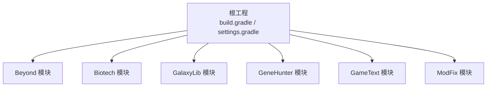
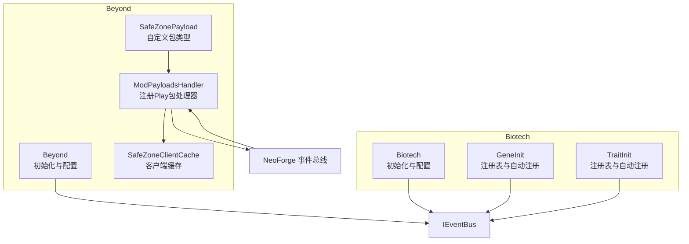
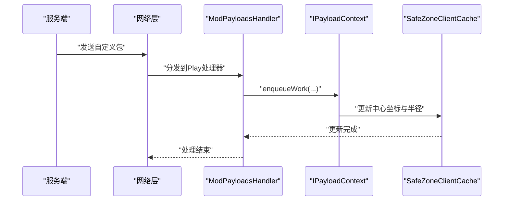
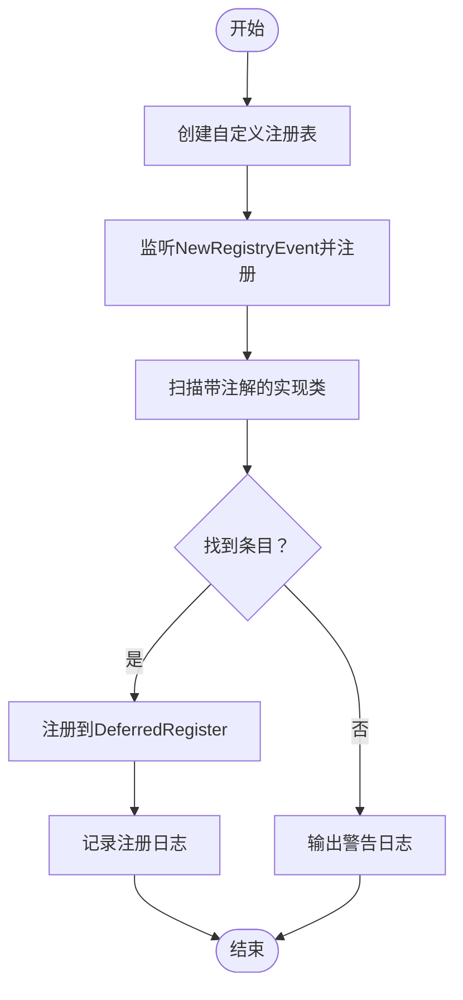
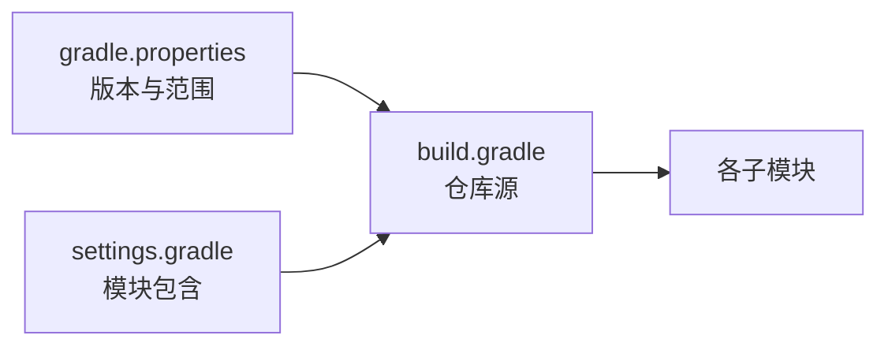

# 调试与测试

<cite>
**本文引用的文件**
- [Beyond.java](file://Beyond/src/main/java/com/pz/beyond/Beyond.java)
- [Config.java](file://Beyond/src/main/java/com/pz/beyond/Config.java)
- [ModPayloadsHandler.java](file://Beyond/src/main/java/com/pz/beyond/event/ModPayloadsHandler.java)
- [SafeZonePayload.java](file://Beyond/src/main/java/com/pz/beyond/network/SafeZonePayload.java)
- [SafeZoneClientCache.java](file://Beyond/src/main/java/com/pz/beyond/data/SafeZoneClientCache.java)
- [SafeZoneRule.java](file://Beyond/src/main/java/com/pz/beyond/safeZoneRule/SafeZoneRule.java)
- [Biotech.java](file://Biotech/src/main/java/org/biotech/Biotech.java)
- [GeneInit.java](file://Biotech/src/main/java/org/biotech/api/init/GeneInit.java)
- [TraitInit.java](file://Biotech/src/main/java/org/biotech/api/init/TraitInit.java)
- [build.gradle](file://build.gradle)
- [settings.gradle](file://settings.gradle)
- [gradle.properties](file://gradle.properties)
</cite>

## 目录
1. [引言](#引言)
2. [项目结构](#项目结构)
3. [核心组件](#核心组件)
4. [架构总览](#架构总览)
5. [详细组件分析](#详细组件分析)
6. [依赖分析](#依赖分析)
7. [性能考虑](#性能考虑)
8. [故障排查指南](#故障排查指南)
9. [结论](#结论)
10. [附录](#附录)

## 引言
本指南面向Minecraft模组开发者与测试工程师，围绕本仓库中的Beyond与Biotech两大子模块，系统性提供调试与测试策略：包括断点调试技巧、日志记录最佳实践、性能分析方法；覆盖单元测试、集成测试与UI测试自动化；并结合模组特性讲解网络包监控与事件流追踪、常见问题诊断流程、内存泄漏检测与崩溃分析技巧。内容以实际源码为依据，确保可操作与可落地。

## 项目结构
本仓库采用多模块Gradle工程组织，包含Beyond（边界区域与网络负载）、Biotech（基因与词条注册体系）等模块。根级构建脚本统一管理仓库源与版本，模块间通过共享依赖版本进行解耦。

**图表来源**
- [settings.gradle:13-19](file://settings.gradle#L13-L19)
- [build.gradle:1-17](file://build.gradle#L1-L17)

**章节来源**
- [settings.gradle:1-19](file://settings.gradle#L1-L19)
- [build.gradle:1-17](file://build.gradle#L1-L17)

## 核心组件
- Beyond模块负责模组初始化、配置注册、事件总线订阅、自定义网络负载的注册与处理，以及客户端缓存更新。
- Biotech模块负责服务器配置注册、注册表创建与注册、基因与词条的自动发现与注册、以及事件总线与NeoForge事件的对接。

关键职责映射如下：
- Beyond
  - 初始化与配置：在构造函数中注册注册表与配置，监听通用生命周期事件。
  - 网络层：注册Play阶段的客户端到服务端自定义包处理器。
  - 客户端缓存：接收网络包后在主线程队列中更新缓存。
- Biotech
  - 注册表：创建自定义Registry并注册到事件总线。
  - 自动注册：基于注解扫描与插件发现机制，自动注册基因与词条。
  - 配置：注册服务器配置规格。

**章节来源**
- [Beyond.java:46-78](file://Beyond/src/main/java/com/pz/beyond/Beyond.java#L46-L78)
- [Config.java:6-19](file://Beyond/src/main/java/com/pz/beyond/Config.java#L6-L19)
- [ModPayloadsHandler.java:14-34](file://Beyond/src/main/java/com/pz/beyond/event/ModPayloadsHandler.java#L14-L34)
- [SafeZonePayload.java:10-30](file://Beyond/src/main/java/com/pz/beyond/network/SafeZonePayload.java#L10-L30)
- [SafeZoneClientCache.java:6-29](file://Beyond/src/main/java/com/pz/beyond/data/SafeZoneClientCache.java#L6-L29)
- [Biotech.java:23-39](file://Biotech/src/main/java/org/biotech/Biotech.java#L23-L39)
- [GeneInit.java:21-106](file://Biotech/src/main/java/org/biotech/api/init/GeneInit.java#L21-L106)
- [TraitInit.java:19-102](file://Biotech/src/main/java/org/biotech/api/init/TraitInit.java#L19-L102)

## 架构总览
下图展示Beyond与Biotech在事件总线与网络层的关键交互，以及客户端缓存更新路径。

**图表来源**
- [Beyond.java:46-78](file://Beyond/src/main/java/com/pz/beyond/Beyond.java#L46-L78)
- [ModPayloadsHandler.java:14-34](file://Beyond/src/main/java/com/pz/beyond/event/ModPayloadsHandler.java#L14-L34)
- [SafeZonePayload.java:10-30](file://Beyond/src/main/java/com/pz/beyond/network/SafeZonePayload.java#L10-L30)
- [SafeZoneClientCache.java:6-29](file://Beyond/src/main/java/com/pz/beyond/data/SafeZoneClientCache.java#L6-L29)
- [Biotech.java:23-39](file://Biotech/src/main/java/org/biotech/Biotech.java#L23-L39)
- [GeneInit.java:21-106](file://Biotech/src/main/java/org/biotech/api/init/GeneInit.java#L21-L106)
- [TraitInit.java:19-102](file://Biotech/src/main/java/org/biotech/api/init/TraitInit.java#L19-L102)

## 详细组件分析

### Beyond：初始化与配置
- 初始化流程
  - 在构造函数中调用统一注册入口，集中注册各DeferredRegister。
  - 注册通用生命周期监听器，执行初始化逻辑。
  - 将配置规格注册到ModContainer，供FML创建与加载配置文件。
- 日志与调试
  - 使用SLF4J Logger输出信息与警告，便于定位初始化与注册问题。
- 断点调试建议
  - 在构造函数与commonSetup监听回调处设置断点，观察注册顺序与时机。
  - 在配置注册处断点，验证配置规格构建与加载。

**章节来源**
- [Beyond.java:46-78](file://Beyond/src/main/java/com/pz/beyond/Beyond.java#L46-L78)
- [Config.java:6-19](file://Beyond/src/main/java/com/pz/beyond/Config.java#L6-L19)

### Beyond：网络包与事件流
- 包处理器注册
  - 在RegisterPayloadHandlersEvent中注册Play阶段的客户端到服务端包处理器。
  - 指定包类型、编解码器与客户端处理回调。
- 客户端处理
  - 在IPayloadContext上下文中使用enqueueWork确保在主线程更新客户端缓存。
- 调试与监控
  - 在注册回调与处理回调中设置断点，验证包到达与处理顺序。
  - 结合客户端缓存读取方法，验证数据一致性。

**图表来源**
- [ModPayloadsHandler.java:14-34](file://Beyond/src/main/java/com/pz/beyond/event/ModPayloadsHandler.java#L14-L34)
- [SafeZonePayload.java:10-30](file://Beyond/src/main/java/com/pz/beyond/network/SafeZonePayload.java#L10-L30)
- [SafeZoneClientCache.java:6-29](file://Beyond/src/main/java/com/pz/beyond/data/SafeZoneClientCache.java#L6-L29)

**章节来源**
- [ModPayloadsHandler.java:14-34](file://Beyond/src/main/java/com/pz/beyond/event/ModPayloadsHandler.java#L14-L34)
- [SafeZonePayload.java:10-30](file://Beyond/src/main/java/com/pz/beyond/network/SafeZonePayload.java#L10-L30)
- [SafeZoneClientCache.java:6-29](file://Beyond/src/main/java/com/pz/beyond/data/SafeZoneClientCache.java#L6-L29)

### Biotech：注册表与自动注册
- 注册表创建
  - 通过RegistryBuilder创建自定义Registry，并在NewRegistryEvent中注册。
  - 通过DeferredRegister在IEventBus上注册条目。
- 自动注册
  - 基于注解扫描与插件发现机制，自动注册基因与词条。
  - 注册过程中输出日志，便于追踪注册状态。
- 断点调试建议
  - 在注册回调与自动注册循环中设置断点，检查扫描结果与注册路径。
  - 在获取条目时断点，验证ID解析与回退逻辑。

**图表来源**
- [GeneInit.java:21-106](file://Biotech/src/main/java/org/biotech/api/init/GeneInit.java#L21-L106)
- [TraitInit.java:19-102](file://Biotech/src/main/java/org/biotech/api/init/TraitInit.java#L19-L102)

**章节来源**
- [GeneInit.java:21-106](file://Biotech/src/main/java/org/biotech/api/init/GeneInit.java#L21-L106)
- [TraitInit.java:19-102](file://Biotech/src/main/java/org/biotech/api/init/TraitInit.java#L19-L102)

### Beyond：安全区规则注解
- 规则注解
  - 提供标记接口，配合运行时规则系统使用。
- 测试建议
  - 单元测试可验证注解的存在性与作用域，集成测试可验证规则生效路径。

**章节来源**
- [SafeZoneRule.java:8-11](file://Beyond/src/main/java/com/pz/beyond/safeZoneRule/SafeZoneRule.java#L8-L11)

## 依赖分析
- 版本与仓库
  - 根构建脚本统一声明NeoForged与第三方仓库，确保依赖解析一致性。
  - Gradle属性定义了Minecraft与NeoForged版本范围，保障兼容性。
- 模块依赖
  - 多模块工程，模块间通过共享依赖版本解耦，减少重复维护。

**图表来源**
- [gradle.properties:9-21](file://gradle.properties#L9-L21)
- [build.gradle:1-17](file://build.gradle#L1-L17)
- [settings.gradle:13-19](file://settings.gradle#L13-L19)

**章节来源**
- [gradle.properties:1-21](file://gradle.properties#L1-L21)
- [build.gradle:1-17](file://build.gradle#L1-L17)
- [settings.gradle:1-19](file://settings.gradle#L1-L19)

## 性能考虑
- 并行与缓存
  - Gradle启用并行、缓存与配置缓存，提升构建效率。
- 运行时优化
  - 网络包处理使用enqueueWork确保主线程安全，避免阻塞。
  - 客户端缓存采用简单静态字段，降低访问开销。
- 建议
  - 对高频事件与网络包处理进行采样与计时，定位热点。
  - 对自动注册扫描过程增加阈值与超时保护，防止启动卡顿。

**章节来源**
- [gradle.properties:2-6](file://gradle.properties#L2-L6)
- [ModPayloadsHandler.java:27-31](file://Beyond/src/main/java/com/pz/beyond/event/ModPayloadsHandler.java#L27-L31)
- [SafeZoneClientCache.java:6-29](file://Beyond/src/main/java/com/pz/beyond/data/SafeZoneClientCache.java#L6-L29)

## 故障排查指南

### 断点调试技巧
- 模块初始化
  - 在Beyond构造函数与commonSetup监听回调设置断点，确认注册顺序与时机。
  - 在Biotech构造函数与注册回调设置断点，验证注册表创建与自动注册流程。
- 网络包
  - 在ModPayloadsHandler注册回调与客户端处理回调设置断点，验证包到达与主线程更新。
- 客户端缓存
  - 在SafeZoneClientCache更新方法设置断点，核对传入参数与缓存一致性。

**章节来源**
- [Beyond.java:46-78](file://Beyond/src/main/java/com/pz/beyond/Beyond.java#L46-L78)
- [Biotech.java:23-39](file://Biotech/src/main/java/org/biotech/Biotech.java#L23-L39)
- [ModPayloadsHandler.java:14-34](file://Beyond/src/main/java/com/pz/beyond/event/ModPayloadsHandler.java#L14-L34)
- [SafeZoneClientCache.java:12-16](file://Beyond/src/main/java/com/pz/beyond/data/SafeZoneClientCache.java#L12-L16)

### 日志记录最佳实践
- 使用SLF4J Logger输出关键路径与状态变更，如注册成功、自动发现结果、未找到条目等。
- 在异常或边界条件处输出警告与错误日志，便于快速定位问题。

**章节来源**
- [Biotech.java:21](file://Biotech/src/main/java/org/biotech/Biotech.java#L21)
- [TraitInit.java:53-58](file://Biotech/src/main/java/org/biotech/api/init/TraitInit.java#L53-L58)
- [TraitInit.java:86-87](file://Biotech/src/main/java/org/biotech/api/init/TraitInit.java#L86-L87)

### 性能分析方法
- 构建性能
  - 利用Gradle并行与缓存能力，缩短构建时间。
- 运行时性能
  - 对高频事件与网络包处理进行采样计时，识别瓶颈。
  - 对自动注册扫描过程增加耗时统计与阈值告警。

**章节来源**
- [gradle.properties:2-6](file://gradle.properties#L2-L6)
- [ModPayloadsHandler.java:27-31](file://Beyond/src/main/java/com/pz/beyond/event/ModPayloadsHandler.java#L27-L31)

### 单元测试编写规范
- 目标
  - 验证注册表创建、自动注册扫描、包编解码与客户端缓存更新等关键逻辑。
- 方法
  - 使用Mockito模拟事件总线与注册表，隔离被测单元。
  - 对返回空值的路径进行断言，确保回退逻辑正确。
- 示例路径
  - [TraitInit.java:50-58](file://Biotech/src/main/java/org/biotech/api/init/TraitInit.java#L50-L58)
  - [GeneInit.java:98-105](file://Biotech/src/main/java/org/biotech/api/init/GeneInit.java#L98-L105)
  - [SafeZonePayload.java:10-30](file://Beyond/src/main/java/com/pz/beyond/network/SafeZonePayload.java#L10-L30)

**章节来源**
- [TraitInit.java:50-58](file://Biotech/src/main/java/org/biotech/api/init/TraitInit.java#L50-L58)
- [GeneInit.java:98-105](file://Biotech/src/main/java/org/biotech/api/init/GeneInit.java#L98-L105)
- [SafeZonePayload.java:10-30](file://Beyond/src/main/java/com/pz/beyond/network/SafeZonePayload.java#L10-L30)

### 集成测试实施策略
- 目标
  - 验证事件总线、注册表、网络包在真实环境下的协同工作。
- 方法
  - 启动最小化测试环境，触发注册与事件，断言最终状态。
  - 对网络包进行端到端测试，从发送到客户端缓存更新全链路校验。
- 示例路径
  - [Beyond.java:46-78](file://Beyond/src/main/java/com/pz/beyond/Beyond.java#L46-L78)
  - [ModPayloadsHandler.java:14-34](file://Beyond/src/main/java/com/pz/beyond/event/ModPayloadsHandler.java#L14-L34)
  - [SafeZoneClientCache.java:12-16](file://Beyond/src/main/java/com/pz/beyond/data/SafeZoneClientCache.java#L12-L16)

**章节来源**
- [Beyond.java:46-78](file://Beyond/src/main/java/com/pz/beyond/Beyond.java#L46-L78)
- [ModPayloadsHandler.java:14-34](file://Beyond/src/main/java/com/pz/beyond/event/ModPayloadsHandler.java#L14-L34)
- [SafeZoneClientCache.java:12-16](file://Beyond/src/main/java/com/pz/beyond/data/SafeZoneClientCache.java#L12-L16)

### UI测试自动化方案
- 目标
  - 验证UI元素渲染、交互与状态同步（如基因背包、合并界面）。
- 方法
  - 使用自动化框架驱动客户端，模拟用户操作并断言UI状态。
  - 对关键UI事件（打开容器、切换页面、点击槽位）进行回归测试。
- 建议
  - 将UI测试与集成测试分离，优先保证核心交互稳定。

[本节为通用指导，不直接分析具体文件，故无“章节来源”]

### Minecraft模组特有调试工具与技术
- 网络包监控
  - 在包处理器注册回调与处理回调设置断点，观察包类型、编解码与主线程调度。
- 事件流追踪
  - 通过事件总线订阅点与处理回调，串联事件生命周期，定位异常分支。
- 客户端缓存验证
  - 在缓存更新与读取路径设置断点，核对数据一致性与时序。

**章节来源**
- [ModPayloadsHandler.java:14-34](file://Beyond/src/main/java/com/pz/beyond/event/ModPayloadsHandler.java#L14-L34)
- [SafeZoneClientCache.java:12-16](file://Beyond/src/main/java/com/pz/beyond/data/SafeZoneClientCache.java#L12-L16)

### 常见问题诊断流程
- 注册失败
  - 检查注册表是否在NewRegistryEvent中注册，DeferredRegister是否在IEventBus上注册。
  - 查看自动注册扫描结果与日志输出。
- 网络包未达
  - 检查包处理器注册、包类型与编解码器配置，确认在Play阶段注册。
  - 在处理回调中断点，验证enqueueWork是否执行。
- 客户端状态不同步
  - 在缓存更新与读取路径断点，核对参数与更新顺序。

**章节来源**
- [GeneInit.java:27-29](file://Biotech/src/main/java/org/biotech/api/init/GeneInit.java#L27-L29)
- [TraitInit.java:26-28](file://Biotech/src/main/java/org/biotech/api/init/TraitInit.java#L26-L28)
- [ModPayloadsHandler.java:14-34](file://Beyond/src/main/java/com/pz/beyond/event/ModPayloadsHandler.java#L14-L34)
- [SafeZoneClientCache.java:12-16](file://Beyond/src/main/java/com/pz/beyond/data/SafeZoneClientCache.java#L12-L16)

### 内存泄漏检测与崩溃分析
- 内存泄漏
  - 关注静态缓存与长生命周期对象，定期清理或弱引用化。
  - 对高频对象分配进行采样，识别异常增长。
- 崩溃分析
  - 收集堆栈与日志，定位异常抛出点与上下文。
  - 对网络包与事件处理中的空指针与越界访问进行防御性编程与断言。

[本节为通用指导，不直接分析具体文件，故无“章节来源”]

## 结论
本指南基于Beyond与Biotech的实际实现，提供了从初始化、网络包处理到注册表与自动注册的全链路调试与测试策略。通过断点调试、日志记录、性能采样与自动化测试相结合，能够有效提升模组开发质量与稳定性。建议在持续集成中引入单元与集成测试，并在发布前进行端到端UI与网络包验证。

## 附录
- 关键实现路径参考
  - [Beyond.java:46-78](file://Beyond/src/main/java/com/pz/beyond/Beyond.java#L46-L78)
  - [ModPayloadsHandler.java:14-34](file://Beyond/src/main/java/com/pz/beyond/event/ModPayloadsHandler.java#L14-L34)
  - [SafeZonePayload.java:10-30](file://Beyond/src/main/java/com/pz/beyond/network/SafeZonePayload.java#L10-L30)
  - [SafeZoneClientCache.java:12-16](file://Beyond/src/main/java/com/pz/beyond/data/SafeZoneClientCache.java#L12-L16)
  - [Biotech.java:23-39](file://Biotech/src/main/java/org/biotech/Biotech.java#L23-L39)
  - [GeneInit.java:21-106](file://Biotech/src/main/java/org/biotech/api/init/GeneInit.java#L21-L106)
  - [TraitInit.java:19-102](file://Biotech/src/main/java/org/biotech/api/init/TraitInit.java#L19-L102)