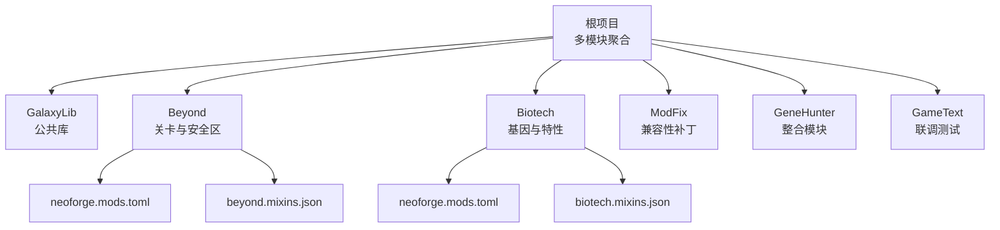
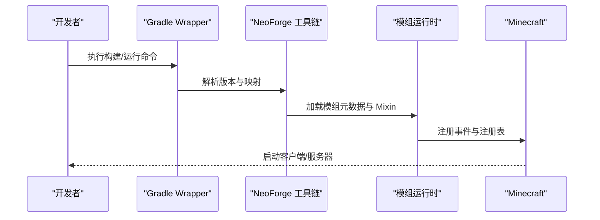
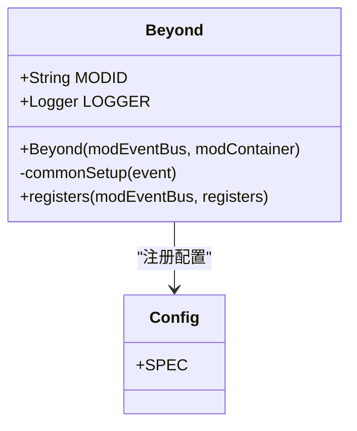
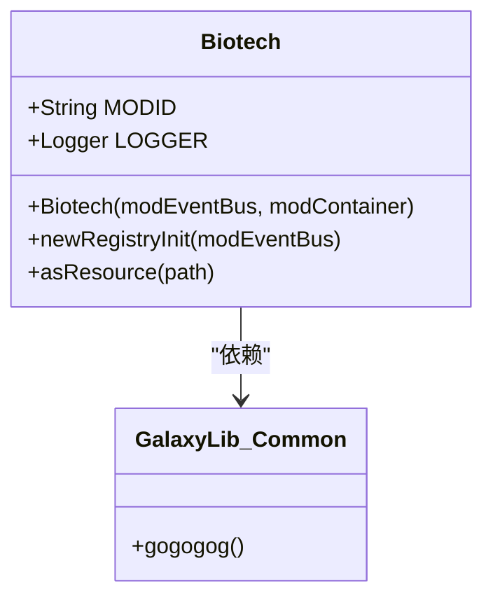
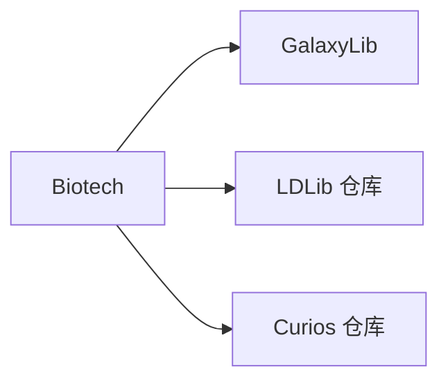

# 快速开始

<cite>
**本文引用的文件**
- [根构建脚本 build.gradle](file://build.gradle)
- [设置脚本 settings.gradle](file://settings.gradle)
- [根属性 gradle.properties](file://gradle.properties)
- [Gradle Wrapper 配置 gradle-wrapper.properties](file://gradle/wrapper/gradle-wrapper.properties)
- [Beyond 构建脚本 Beyond/build.gradle](file://Beyond/build.gradle)
- [Beyond 模组元数据 Beyond/src/main/templates/META-INF/neoforge.mods.toml](file://Beyond/src/main/templates/META-INF/neoforge.mods.toml)
- [Beyond 模组属性 Beyond/gradle.properties](file://Beyond/gradle.properties)
- [Biotech 构建脚本 Biotech/build.gradle](file://Biotech/build.gradle)
- [Biotech 模组元数据 Biotech/src/main/templates/META-INF/neoforge.mods.toml](file://Biotech/src/main/templates/META-INF/neoforge.mods.toml)
- [Biotech 模组属性 Biotech/gradle.properties](file://Biotech/gradle.properties)
- [Beyond 主类 Beyond/src/main/java/com/pz/beyond/Beyond.java](file://Beyond/src/main/java/com/pz/beyond/Beyond.java)
- [Biotech 主类 Biotech/src/main/java/org/biotech/Biotech.java](file://Biotech/src/main/java/org/biotech/Biotech.java)
- [GalaxyLib 公共类 GalaxyLib/src/main/java/org/galaxy/gene_hunter/Common.java](file://GalaxyLib/src/main/java/org/galaxy/gene_hunter/Common.java)
- [Beyond 混合配置 beyond.mixins.json](file://Beyond/src/main/resources/beyond.mixins.json)
- [Biotech 混合配置 biotech.mixins.json](file://Biotech/src/main/resources/biotech.mixins.json)
- [项目总览 README.md](file://README.md)
</cite>

## 目录
1. [简介](#简介)
2. [项目结构](#项目结构)
3. [核心组件](#核心组件)
4. [架构概览](#架构概览)
5. [详细组件分析](#详细组件分析)
6. [依赖分析](#依赖分析)
7. [性能考虑](#性能考虑)
8. [故障排除指南](#故障排除指南)
9. [结论](#结论)
10. [附录](#附录)

## 简介
本指南面向首次接触本 NeoForge 多模块项目的开发者，目标是帮助你在最短时间内完成本地开发环境搭建、构建项目并成功启动 Minecraft 开发服务器。你将学到：
- JDK 21 的安装与验证
- NeoForge 开发环境准备
- Gradle 构建与多模块配置
- IDE 推荐配置（IntelliJ IDEA）
- 完整的构建与运行命令
- 项目结构与关键配置文件的作用
- 常见问题排查与解决方案

## 项目结构
本仓库是一个多模块工程，采用“按功能拆分”的方式组织，便于多人并行开发与独立维护。主要模块如下：
- GalaxyLib：公共基础库，提供通用能力与工具类
- Beyond：关卡与安全区相关玩法模块
- Biotech：基因与特性系统模块
- ModFix：兼容性修复与 Mixin 补丁模块
- GeneHunter：主整合模块（当前仓库未包含源码，仅保留模板）
- GameText：联调与集成测试模块

图表来源
- [设置脚本 settings.gradle:13-18](file://settings.gradle#L13-L18)
- [Beyond 模组元数据:1-80](file://Beyond/src/main/templates/META-INF/neoforge.mods.toml#L1-L80)
- [Biotech 模组元数据:1-80](file://Biotech/src/main/templates/META-INF/neoforge.mods.toml#L1-L80)
- [Beyond 混合配置:1-17](file://Beyond/src/main/resources/beyond.mixins.json#L1-L17)
- [Biotech 混合配置:1-17](file://Biotech/src/main/resources/biotech.mixins.json#L1-L17)

章节来源
- [项目总览 README.md:1-38](file://README.md#L1-L38)
- [设置脚本 settings.gradle:1-19](file://settings.gradle#L1-L19)

## 核心组件
- 版本与工具链
  - 使用 Gradle Wrapper 8.14.4，自动下载与缓存
  - Java Toolchain 指定语言版本为 21
  - Parchment 映射版本与 Minecraft 1.21.1 对应
  - NeoForge 版本 21.1.223 及其版本范围
- 多模块构建
  - 根级 build.gradle 引入 NeoForged Mod Dev 插件
  - settings.gradle 声明包含所有子模块
- 运行配置
  - 提供 client、server、gameTestServer、data 四种运行任务
  - data 任务用于生成资源与模型
- 发布配置
  - Maven 发布到本地仓库目录

章节来源
- [根构建脚本 build.gradle:1-4](file://build.gradle#L1-L4)
- [根属性 gradle.properties:1-16](file://gradle.properties#L1-L16)
- [Gradle Wrapper 配置:1-8](file://gradle/wrapper/gradle-wrapper.properties#L1-L8)
- [Beyond 构建脚本:1-107](file://Beyond/build.gradle#L1-L107)
- [Biotech 构建脚本:1-125](file://Biotech/build.gradle#L1-L125)

## 架构概览
下图展示了从本地开发到启动游戏服务器的关键流程，以及模块间的依赖关系。

图表来源
- [根属性 gradle.properties:9-16](file://gradle.properties#L9-L16)
- [Beyond 构建脚本:19-57](file://Beyond/build.gradle#L19-L57)
- [Biotech 构建脚本:29-67](file://Biotech/build.gradle#L29-L67)
- [Beyond 模组元数据:1-80](file://Beyond/src/main/templates/META-INF/neoforge.mods.toml#L1-L80)
- [Biotech 模组元数据:1-80](file://Biotech/src/main/templates/META-INF/neoforge.mods.toml#L1-L80)

## 详细组件分析

### Beyond 模块
- 主类与事件总线
  - 主类使用 @Mod 标注，注册通用初始化与配置
  - 通过 Event Bus 订阅生命周期事件
- 配置文件
  - 模组配置由 Config 类定义，SPEC 作为 ModConfigSpec
- 运行任务
  - client、server、gameTestServer、data
  - data 任务会扫描资源输出到生成目录

图表来源
- [Beyond 主类:38-79](file://Beyond/src/main/java/com/pz/beyond/Beyond.java#L38-L79)
- [Beyond 配置类:1-20](file://Beyond/src/main/java/com/pz/beyond/Config.java#L1-L20)

章节来源
- [Beyond 主类:1-79](file://Beyond/src/main/java/com/pz/beyond/Beyond.java#L1-L79)
- [Beyond 配置类:1-20](file://Beyond/src/main/java/com/pz/beyond/Config.java#L1-L20)
- [Beyond 构建脚本:25-51](file://Beyond/build.gradle#L25-L51)

### Biotech 模块
- 主类职责
  - 初始化注册表、数据组件、物品、附魔、菜单等
  - 显式监听 Curios 属性事件
- 依赖管理
  - 依赖 GalaxyLib（公共库）
  - 依赖 LDLib 与 Curios（来自外部仓库）
- 运行任务
  - 与 Beyond 类似的四种运行任务

图表来源
- [Biotech 主类:1-73](file://Biotech/src/main/java/org/biotech/Biotech.java#L1-L73)
- [GalaxyLib 公共类:1-9](file://GalaxyLib/src/main/java/org/galaxy/gene_hunter/Common.java#L1-L9)

章节来源
- [Biotech 主类:1-73](file://Biotech/src/main/java/org/biotech/Biotech.java#L1-L73)
- [Biotech 构建脚本:11-85](file://Biotech/build.gradle#L11-L85)

### 模组元数据与 Mixin 配置
- neoforge.mods.toml
  - 定义 modLoader、loaderVersion、license、[[mods]]、[[mixins]]、[[dependencies]]
  - 依赖 NeoForge 与 Minecraft 版本范围
- mixins.json
  - 指定 Mixin 包路径、兼容级别、注入器默认要求等

章节来源
- [Beyond 模组元数据:1-80](file://Beyond/src/main/templates/META-INF/neoforge.mods.toml#L1-L80)
- [Biotech 模组元数据:1-80](file://Biotech/src/main/templates/META-INF/neoforge.mods.toml#L1-L80)
- [Beyond 混合配置:1-17](file://Beyond/src/main/resources/beyond.mixins.json#L1-L17)
- [Biotech 混合配置:1-17](file://Biotech/src/main/resources/biotech.mixins.json#L1-L17)

## 依赖分析
- 版本与映射
  - Minecraft 1.21.1、NeoForge 21.1.223、Parchment 映射版本
- 模块间依赖
  - Biotech 依赖 GalaxyLib（公共库）
  - 各模块各自维护依赖，避免全局统一收敛
- 外部仓库
  - LDLib 来自 firstdark.dev
  - Curios 来自 theillusivec4.top

图表来源
- [Biotech 构建脚本:11-21](file://Biotech/build.gradle#L11-L21)
- [Biotech 构建脚本:74-85](file://Biotech/build.gradle#L74-L85)

章节来源
- [Biotech 构建脚本:11-85](file://Biotech/build.gradle#L11-L85)
- [项目总览 README.md:34-37](file://README.md#L34-L37)

## 性能考虑
- 并行与缓存
  - Gradle 启用并行、配置缓存、构建缓存以提升构建速度
- 资源生成
  - data 任务一次性生成资源，减少重复编译成本
- 工具链
  - 使用 Java Toolchain 指定 JDK 21，保证一致性与性能

章节来源
- [根属性 gradle.properties:1-16](file://gradle.properties#L1-L16)
- [Beyond 构建脚本:47-51](file://Beyond/build.gradle#L47-L51)
- [Biotech 构建脚本:57-61](file://Biotech/build.gradle#L57-L61)

## 故障排除指南
- 构建失败（找不到版本或映射）
  - 检查 gradle.properties 中的版本与映射是否匹配
  - 清理 Gradle 缓存后重试
- 无法解析外部依赖
  - 确认网络可访问 firstdark.dev 与 theillusivec4.top
  - 在企业网络环境下配置代理或使用镜像仓库
- 运行时报错（Mixin 或注册表）
  - 检查 mixins.json 的包路径与注入器配置
  - 确保 neoforge.mods.toml 的 [[mixins]] 配置正确
- 服务器无法启动
  - 查看运行日志中的 DEBUG/ERROR 级别信息
  - 确认 data 任务已执行，生成了必要的资源

章节来源
- [根属性 gradle.properties:9-16](file://gradle.properties#L9-L16)
- [Beyond 构建脚本:19-25](file://Beyond/build.gradle#L19-L25)
- [Biotech 构建脚本:14-21](file://Biotech/build.gradle#L14-L21)
- [Beyond 混合配置:1-17](file://Beyond/src/main/resources/beyond.mixins.json#L1-L17)
- [Biotech 混合配置:1-17](file://Biotech/src/main/resources/biotech.mixins.json#L1-L17)

## 结论
通过本指南，你可以完成从 JDK 21 到 NeoForge 开发环境的全套准备，并基于多模块工程快速构建与运行项目。建议在熟悉基础流程后，逐步探索各模块的业务逻辑与注册机制，结合 data 任务生成资源，完善本地开发体验。

## 附录

### 快速开始步骤
- 环境准备
  - 安装 JDK 21 并确保 JAVA_HOME 指向 JDK 21
  - 确保网络可访问 Gradle、NeoForge 与第三方仓库
- 获取代码
  - 克隆仓库到本地
- 构建与运行
  - 在根目录执行构建命令（如刷新依赖、生成资源、打包）
  - 使用 Gradle 运行任务启动客户端或服务器
- IDE 配置
  - 推荐使用 IntelliJ IDEA
  - 导入项目为 Gradle 项目，启用 Annotation Processing
  - 选择正确的 SDK（JDK 21）

章节来源
- [根构建脚本 build.gradle:1-4](file://build.gradle#L1-L4)
- [设置脚本 settings.gradle:1-19](file://settings.gradle#L1-L19)
- [根属性 gradle.properties:1-16](file://gradle.properties#L1-L16)
- [Gradle Wrapper 配置:1-8](file://gradle/wrapper/gradle-wrapper.properties#L1-L8)
- [Beyond 构建脚本:17-17](file://Beyond/build.gradle#L17-L17)
- [Biotech 构建脚本:27-27](file://Biotech/build.gradle#L27-L27)

### 关键配置文件一览
- 根级
  - build.gradle：引入 NeoForged Mod Dev 插件
  - settings.gradle：声明包含的子模块
  - gradle.properties：版本、映射、工具链与 Gradle 参数
  - gradle-wrapper.properties：Gradle Wrapper 分发地址
- 模块级（以 Beyond 为例）
  - build.gradle：运行任务、依赖、发布配置
  - gradle.properties：模组标识、名称、作者、描述等
  - src/main/templates/META-INF/neoforge.mods.toml：模组元数据
  - src/main/resources/*.mixins.json：Mixin 配置

章节来源
- [根构建脚本 build.gradle:1-4](file://build.gradle#L1-L4)
- [设置脚本 settings.gradle:1-19](file://settings.gradle#L1-L19)
- [根属性 gradle.properties:1-16](file://gradle.properties#L1-L16)
- [Gradle Wrapper 配置:1-8](file://gradle/wrapper/gradle-wrapper.properties#L1-L8)
- [Beyond 构建脚本:1-107](file://Beyond/build.gradle#L1-L107)
- [Beyond 模组属性:1-20](file://Beyond/gradle.properties#L1-L20)
- [Beyond 模组元数据:1-80](file://Beyond/src/main/templates/META-INF/neoforge.mods.toml#L1-L80)
- [Beyond 混合配置:1-17](file://Beyond/src/main/resources/beyond.mixins.json#L1-L17)