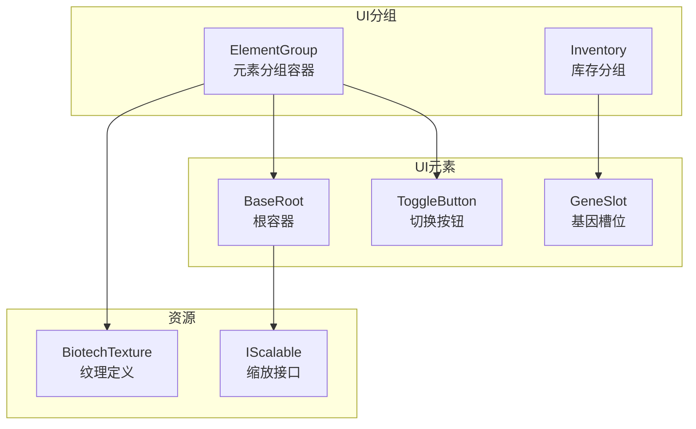
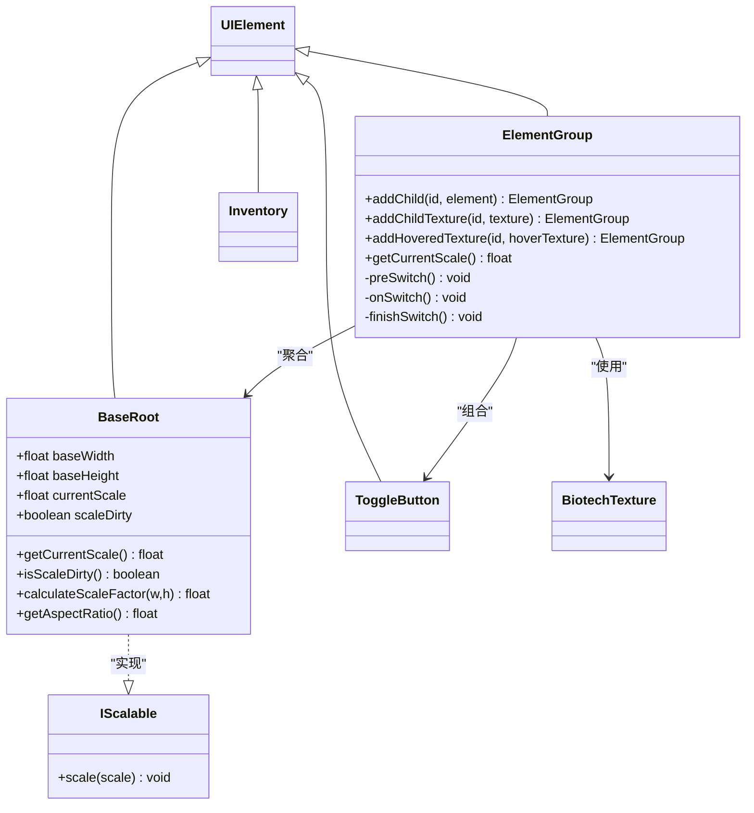
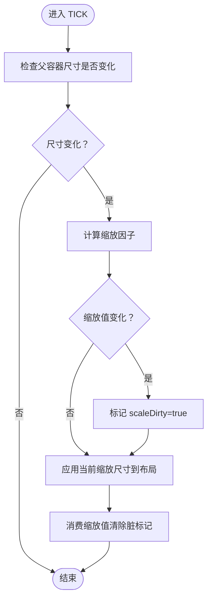
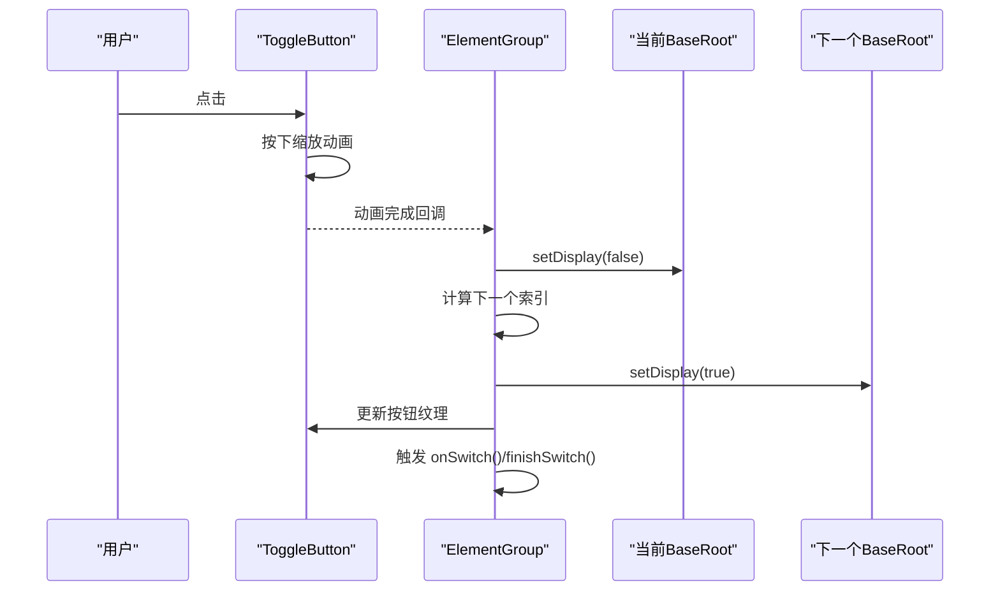
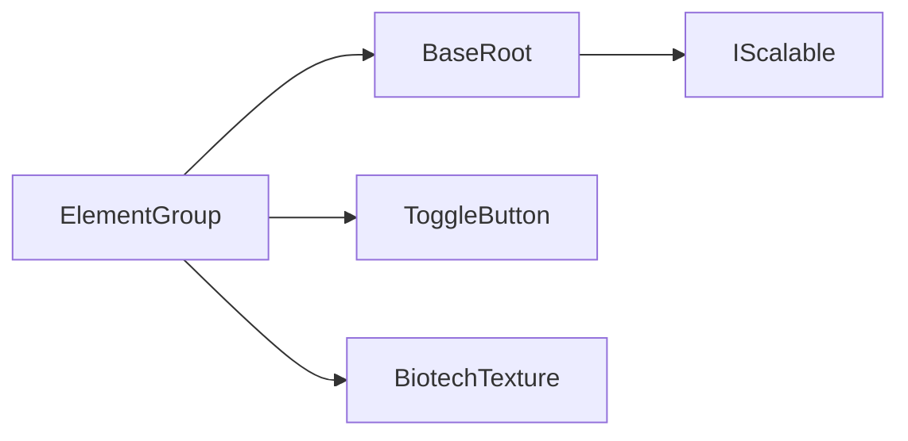

# UI组件定制开发

<cite>
**本文引用的文件**
- [BaseRoot.java](file://Biotech/src/main/java/org/biotech/ui/gene_inventroy/element/BaseRoot.java)
- [ElementGroup.java](file://Biotech/src/main/java/org/biotech/ui/gene_inventroy/group/ElementGroup.java)
- [IScalable.java](file://Biotech/src/main/java/org/biotech/ui/IScalable.java)
- [BiotechTexture.java](file://Biotech/src/main/java/org/biotech/ui/BiotechTexture.java)
- [ToggleButton.java](file://Biotech/src/main/java/org/biotech/ui/gene_inventroy/element/ToggleButton.java)
- [GeneSlot.java](file://Biotech/src/main/java/org/biotech/ui/gene_inventroy/element/inventory/GeneSlot.java)
- [Inventory.java](file://Biotech/src/main/java/org/biotech/ui/gene_inventroy/group/Inventory.java)
</cite>

## 目录
1. [简介](#简介)
2. [项目结构](#项目结构)
3. [核心组件](#核心组件)
4. [架构总览](#架构总览)
5. [详细组件分析](#详细组件分析)
6. [依赖关系分析](#依赖关系分析)
7. [性能考量](#性能考量)
8. [故障排查指南](#故障排查指南)
9. [结论](#结论)
10. [附录](#附录)

## 简介
本指南面向使用 LowDragLib2 框架进行 UI 组件定制开发的工程师与美术/策划同学。文档围绕以下目标展开：
- 如何基于 BaseRoot 继承开发自定义 UI 根节点，结合 ElementGroup 实现多面板切换与统一缩放。
- UI 元素的布局系统、事件处理与动画集成实践。
- 提供完整开发示例：自定义槽位、按钮与容器。
- 解释 IScalable 接口与响应式设计原则。
- UI 纹理管理、样式定制与交互反馈的实现方法。
- UI 组件的测试与调试技巧。

## 项目结构
本项目的 UI 子系统位于 Biotech 模块中，采用“元素 + 分组 + 根容器”的层次化组织方式：
- element：基础 UI 元素与根容器（BaseRoot）
- group：UI 分组容器（ElementGroup、Inventory 等）
- IScalable：缩放接口
- BiotechTexture：纹理资源集中定义

图表来源
- [BaseRoot.java:1-144](file://Biotech/src/main/java/org/biotech/ui/gene_inventroy/element/BaseRoot.java#L1-L144)
- [ElementGroup.java:1-219](file://Biotech/src/main/java/org/biotech/ui/gene_inventroy/group/ElementGroup.java#L1-L219)
- [BiotechTexture.java:1-39](file://Biotech/src/main/java/org/biotech/ui/BiotechTexture.java#L1-L39)
- [IScalable.java:1-9](file://Biotech/src/main/java/org/biotech/ui/IScalable.java#L1-L9)

章节来源
- [BaseRoot.java:1-144](file://Biotech/src/main/java/org/biotech/ui/gene_inventroy/element/BaseRoot.java#L1-L144)
- [ElementGroup.java:1-219](file://Biotech/src/main/java/org/biotech/ui/gene_inventroy/group/ElementGroup.java#L1-L219)
- [BiotechTexture.java:1-39](file://Biotech/src/main/java/org/biotech/ui/BiotechTexture.java#L1-L39)
- [IScalable.java:1-9](file://Biotech/src/main/java/org/biotech/ui/IScalable.java#L1-L9)

## 核心组件
- BaseRoot：继承自 UIElement，负责按固定基线尺寸进行等比缩放、状态机驱动的动画阶段管理，提供 scale 消费与脏标记机制。
- ElementGroup：继承自 UIElement，作为容器聚合多个 BaseRoot 子项，内置切换按钮与动画，支持纹理映射与点击切换。
- IScalable：缩放接口，用于菜单或容器根据全局缩放因子调整内部元素布局与间距。
- BiotechTexture：集中声明 UI 纹理资源路径与切片（9-slice）参数，便于统一风格与复用。

章节来源
- [BaseRoot.java:13-144](file://Biotech/src/main/java/org/biotech/ui/gene_inventroy/element/BaseRoot.java#L13-L144)
- [ElementGroup.java:26-219](file://Biotech/src/main/java/org/biotech/ui/gene_inventroy/group/ElementGroup.java#L26-L219)
- [IScalable.java:5-8](file://Biotech/src/main/java/org/biotech/ui/IScalable.java#L5-L8)
- [BiotechTexture.java:12-39](file://Biotech/src/main/java/org/biotech/ui/BiotechTexture.java#L12-L39)

## 架构总览
下图展示了 UI 组件的继承与组合关系，以及事件与动画的交互流程。

图表来源
- [BaseRoot.java:13-144](file://Biotech/src/main/java/org/biotech/ui/gene_inventroy/element/BaseRoot.java#L13-L144)
- [ElementGroup.java:26-219](file://Biotech/src/main/java/org/biotech/ui/gene_inventroy/group/ElementGroup.java#L26-L219)
- [ToggleButton.java](file://Biotech/src/main/java/org/biotech/ui/gene_inventroy/element/ToggleButton.java)
- [Inventory.java](file://Biotech/src/main/java/org/biotech/ui/gene_inventroy/group/Inventory.java)
- [BiotechTexture.java:12-39](file://Biotech/src/main/java/org/biotech/ui/BiotechTexture.java#L12-L39)
- [IScalable.java:5-8](file://Biotech/src/main/java/org/biotech/ui/IScalable.java#L5-L8)

## 详细组件分析

### BaseRoot：根容器与缩放系统
- 等比缩放策略：通过基线宽高计算容器与内容的纵横比，选择以高度或宽度为准进行缩放，保证全屏填充且不溢出。
- 脏标记机制：当父容器尺寸变化时，BaseRoot 计算新的缩放值并标记 scaleDirty；消费方通过 getCurrentScale 清除脏标记，避免重复计算。
- 动画阶段：提供 UIAnimationState 枚举（PRE/ON/POST），用于驱动入场、静止与退场动画的状态流转。
- 生命周期：在 TICK 事件中检测父容器尺寸变化并更新布局尺寸。

图表来源
- [BaseRoot.java:27-103](file://Biotech/src/main/java/org/biotech/ui/gene_inventroy/element/BaseRoot.java#L27-L103)
- [BaseRoot.java:110-120](file://Biotech/src/main/java/org/biotech/ui/gene_inventroy/element/BaseRoot.java#L110-L120)

章节来源
- [BaseRoot.java:13-144](file://Biotech/src/main/java/org/biotech/ui/gene_inventroy/element/BaseRoot.java#L13-L144)

### ElementGroup：分组容器与切换交互
- 多面板聚合：以 HashMap 存储多个 BaseRoot 子项，支持动态添加与默认隐藏策略（仅首个显示）。
- 切换按钮：内置 ToggleButton，绝对定位在左上角，点击触发动画与面板切换。
- 动画与反馈：按钮按下时缩放动画，完成后再执行切换；同时同步切换按钮图标。
- 缩放联动：监听 TICK 事件，将当前 BaseRoot 的缩放值同步给切换按钮，保证视觉一致性。
- 纹理映射：支持为每个子项绑定普通与悬停纹理，切换时自动更新按钮图标。

图表来源
- [ElementGroup.java:88-121](file://Biotech/src/main/java/org/biotech/ui/gene_inventroy/group/ElementGroup.java#L88-L121)
- [ElementGroup.java:179-216](file://Biotech/src/main/java/org/biotech/ui/gene_inventroy/group/ElementGroup.java#L179-L216)

章节来源
- [ElementGroup.java:26-219](file://Biotech/src/main/java/org/biotech/ui/gene_inventroy/group/ElementGroup.java#L26-L219)

### IScalable：响应式设计与缩放接口
- 设计目的：为菜单或容器提供统一的 scale 回调，以便在不同分辨率或缩放设置下调整内部元素的尺寸、间距与字体大小。
- 使用建议：在 BaseRoot 或具体 UI 元素中实现 scale 方法，将缩放因子应用于布局参数与纹理切片。

章节来源
- [IScalable.java:5-8](file://Biotech/src/main/java/org/biotech/ui/IScalable.java#L5-L8)

### BiotechTexture：纹理管理与样式定制
- 资源路径：集中定义背景、主 UI 图集与动画序列等资源路径。
- 切片与边框：通过 SpriteTexture 的 setSprite 与 setBorder 实现 9-slice 边框，适配不同缩放下的拉伸效果。
- 动画纹理：提供气泡等动画帧序列，便于在 UI 中播放循环动画。

章节来源
- [BiotechTexture.java:12-39](file://Biotech/src/main/java/org/biotech/ui/BiotechTexture.java#L12-L39)

### 自定义槽位、按钮与容器示例
- 自定义槽位（如基因槽位）：可参考现有实现，继承 UIElement 并在构造中设置尺寸、纹理与交互行为；若需跟随全局缩放，可在 scale 方法中调整尺寸与位置。
- 自定义按钮：可参考 ToggleButton 的实现思路，绑定 base/hover/pressed 纹理，注册 onClick 并添加按下/弹回动画。
- 自定义容器：可参考 ElementGroup 的组合模式，聚合多个子元素，提供切换逻辑与动画衔接。

章节来源
- [ToggleButton.java](file://Biotech/src/main/java/org/biotech/ui/gene_inventroy/element/ToggleButton.java)
- [GeneSlot.java](file://Biotech/src/main/java/org/biotech/ui/gene_inventroy/element/inventory/GeneSlot.java)
- [Inventory.java](file://Biotech/src/main/java/org/biotech/ui/gene_inventroy/group/Inventory.java)

## 依赖关系分析
- 组件耦合：ElementGroup 依赖 BaseRoot 与 ToggleButton，同时依赖 BiotechTexture 提供统一的纹理资源；BaseRoot 实现 IScalable 以支持响应式缩放。
- 外部依赖：LowDragLib2 的 UIElement、事件系统、纹理系统与布局引擎（Taffy）。
- 循环依赖：当前结构无明显循环依赖，ElementGroup 与 BaseRoot 为组合关系，职责清晰。

图表来源
- [ElementGroup.java:26-219](file://Biotech/src/main/java/org/biotech/ui/gene_inventroy/group/ElementGroup.java#L26-L219)
- [BaseRoot.java:13-144](file://Biotech/src/main/java/org/biotech/ui/gene_inventroy/element/BaseRoot.java#L13-L144)
- [IScalable.java:5-8](file://Biotech/src/main/java/org/biotech/ui/IScalable.java#L5-L8)
- [BiotechTexture.java:12-39](file://Biotech/src/main/java/org/biotech/ui/BiotechTexture.java#L12-L39)

章节来源
- [ElementGroup.java:26-219](file://Biotech/src/main/java/org/biotech/ui/gene_inventroy/group/ElementGroup.java#L26-L219)
- [BaseRoot.java:13-144](file://Biotech/src/main/java/org/biotech/ui/gene_inventroy/element/BaseRoot.java#L13-L144)
- [IScalable.java:5-8](file://Biotech/src/main/java/org/biotech/ui/IScalable.java#L5-L8)
- [BiotechTexture.java:12-39](file://Biotech/src/main/java/org/biotech/ui/BiotechTexture.java#L12-L39)

## 性能考量
- 缩放计算优化：BaseRoot 在 TICK 中仅在父容器尺寸变化时重新计算缩放，避免每帧重复计算。
- 脏标记：通过 scaleDirty 标记减少不必要的状态传播与重绘。
- 动画链路：ElementGroup 的按钮动画采用短时序与缓动函数，避免卡顿；动画完成后才执行切换，降低视觉抖动。
- 纹理切片：使用 9-slice 边框减少大图拉伸带来的像素化，提升小尺寸缩放质量。

## 故障排查指南
- 缩放异常
  - 症状：界面元素尺寸不随窗口变化或比例失真。
  - 排查：确认父容器存在且尺寸大于 0；检查 BaseRoot 的父容器尺寸变化检测逻辑；验证 getCurrentScale 是否被正确消费。
  - 参考路径：[BaseRoot.java:39-103](file://Biotech/src/main/java/org/biotech/ui/gene_inventroy/element/BaseRoot.java#L39-L103)
- 切换按钮无效
  - 症状：点击按钮无反应或图标不更新。
  - 排查：确认按钮已添加到 ElementGroup 的顶层；检查 preSwitch/onSwitch/finishSwitch 的实现；验证纹理映射是否正确。
  - 参考路径：[ElementGroup.java:88-121](file://Biotech/src/main/java/org/biotech/ui/gene_inventroy/group/ElementGroup.java#L88-L121), [ElementGroup.java:179-216](file://Biotech/src/main/java/org/biotech/ui/gene_inventroy/group/ElementGroup.java#L179-L216)
- 动画卡顿
  - 症状：按钮按下/弹回动画卡顿或不连贯。
  - 排查：缩短动画时长或调整缓动函数；确保动画链路在完成回调中启动下一阶段；避免在动画期间频繁修改布局。
  - 参考路径：[ElementGroup.java:88-107](file://Biotech/src/main/java/org/biotech/ui/gene_inventroy/group/ElementGroup.java#L88-L107)
- 纹理拉伸模糊
  - 症状：小尺寸显示模糊或边缘锯齿。
  - 排查：对可拉伸区域使用 9-slice 边框；优先使用矢量或高分辨率贴图；避免过度缩放。
  - 参考路径：[BiotechTexture.java:26-31](file://Biotech/src/main/java/org/biotech/ui/BiotechTexture.java#L26-L31)

## 结论
通过 BaseRoot 与 ElementGroup 的组合，可以快速构建具备统一缩放、切换与动画能力的 UI 系统。配合 IScalable 接口与 BiotechTexture 的资源管理，能够实现跨分辨率的响应式设计与一致的视觉风格。建议在实际开发中遵循“元素最小化、分组聚合化、状态机驱动”的原则，确保扩展性与可维护性。

## 附录
- 开发步骤建议
  - 新建 UI 元素：继承 UIElement，按需实现 scale 方法。
  - 根容器：继承 BaseRoot，设置基线尺寸与动画阶段。
  - 分组容器：继承 ElementGroup，聚合 BaseRoot 子项并绑定纹理。
  - 事件与动画：在 ElementGroup 中注册按钮点击与动画链路。
  - 纹理与样式：在 BiotechTexture 中集中定义资源与切片。
- 测试与调试
  - 使用 LowDragLib2 的调试工具观察布局与事件流。
  - 逐步注释动画链路，定位问题阶段。
  - 在不同分辨率与缩放设置下验证缩放与对齐。