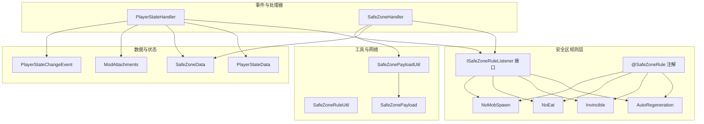
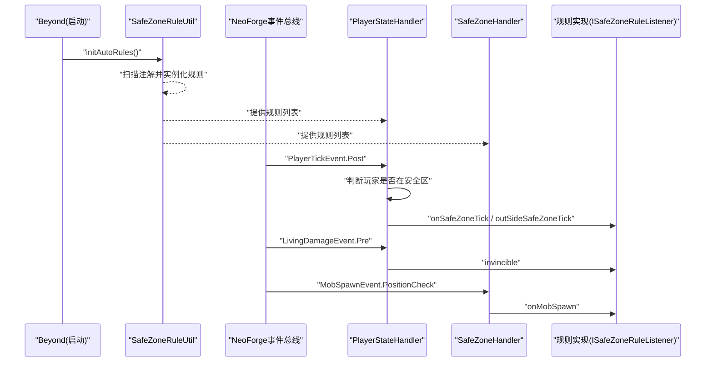
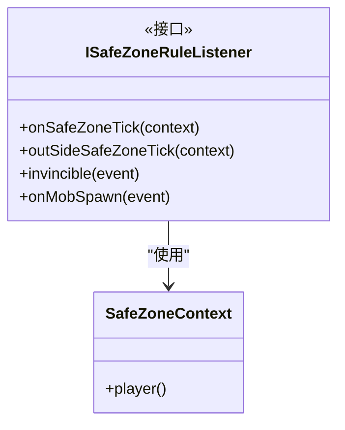
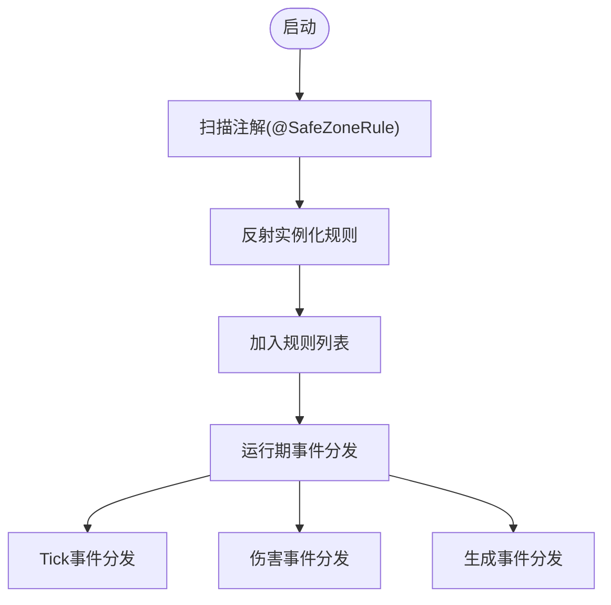
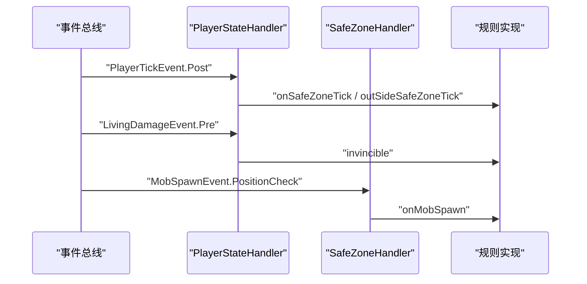
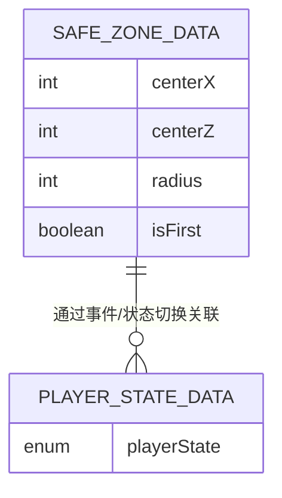
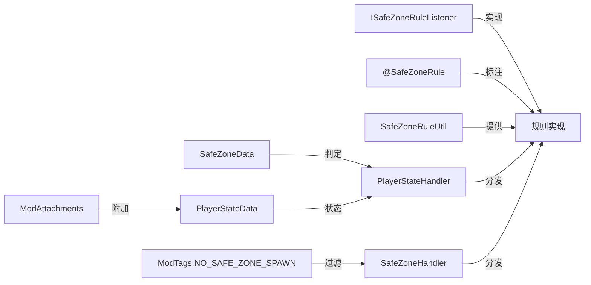

# 安全区规则扩展

<cite>
**本文引用的文件**
- [ISafeZoneRuleListener.java](file://Beyond/src/main/java/com/pz/beyond/safeZoneRule/ISafeZoneRuleListener.java)
- [SafeZoneRule.java](file://Beyond/src/main/java/com/pz/beyond/safeZoneRule/SafeZoneRule.java)
- [AutoRegeneration.java](file://Beyond/src/main/java/com/pz/beyond/safeZoneRule/impl/AutoRegeneration.java)
- [Invincible.java](file://Beyond/src/main/java/com/pz/beyond/safeZoneRule/impl/Invincible.java)
- [NoEat.java](file://Beyond/src/main/java/com/pz/beyond/safeZoneRule/impl/NoEat.java)
- [NoMobSpawn.java](file://Beyond/src/main/java/com/pz/beyond/safeZoneRule/impl/NoMobSpawn.java)
- [SafeZoneData.java](file://Beyond/src/main/java/com/pz/beyond/data/SafeZoneData.java)
- [PlayerStateData.java](file://Beyond/src/main/java/com/pz/beyond/data/PlayerStateData.java)
- [SafeZoneRuleUtil.java](file://Beyond/src/main/java/com/pz/beyond/util/SafeZoneRuleUtil.java)
- [SafeZoneHandler.java](file://Beyond/src/main/java/com/pz/beyond/event/SafeZoneHandler.java)
- [PlayerStateHandler.java](file://Beyond/src/main/java/com/pz/beyond/event/PlayerStateHandler.java)
- [ModTags.java](file://Beyond/src/main/java/com/pz/beyond/registry/ModTags.java)
- [ModAttachments.java](file://Beyond/src/main/java/com/pz/beyond/registry/ModAttachments.java)
- [PlayerStateChangeEvent.java](file://Beyond/src/main/java/com/pz/beyond/event/custom/PlayerStateChangeEvent.java)
- [SafeZonePayload.java](file://Beyond/src/main/java/com/pz/beyond/network/SafeZonePayload.java)
- [SafeZonePayloadUtil.java](file://Beyond/src/main/java/com/pz/beyond/util/SafeZonePayloadUtil.java)
- [Beyond.java](file://Beyond/src/main/java/com/pz/beyond/Beyond.java)
</cite>

## 目录
1. [简介](#简介)
2. [项目结构](#项目结构)
3. [核心组件](#核心组件)
4. [架构总览](#架构总览)
5. [详细组件分析](#详细组件分析)
6. [依赖分析](#依赖分析)
7. [性能考虑](#性能考虑)
8. [故障排查指南](#故障排查指南)
9. [结论](#结论)
10. [附录](#附录)

## 简介
本指南面向希望为“Beyond”模组扩展安全区规则的开发者，系统讲解如何实现 ISafeZoneRuleListener 接口以创建自定义安全区规则，并深入解析规则生命周期方法（onSafeZoneTick、outSideSafeZoneTick、invincible、onMobSpawn）与 SafeZoneContext 的使用方式。文档还涵盖规则注册机制、规则优先级与冲突处理策略、以及性能优化最佳实践，帮助你在不破坏现有系统的情况下稳定扩展功能。

## 项目结构
安全区规则扩展位于 Beyond 模组的 safeZoneRule 包下，配合事件总线、附件系统、网络同步与标签系统共同工作。关键模块如下：
- 规则接口与注解：ISafeZoneRuleListener、SafeZoneRule
- 内置规则实现：AutoRegeneration、Invincible、NoEat、NoMobSpawn
- 数据与状态：SafeZoneData、PlayerStateData、ModAttachments
- 事件与处理器：SafeZoneHandler、PlayerStateHandler、PlayerStateChangeEvent
- 工具与网络：SafeZoneRuleUtil、SafeZonePayloadUtil、SafeZonePayload
- 启动入口：Beyond

图表来源
- [ISafeZoneRuleListener.java:13-39](file://Beyond/src/main/java/com/pz/beyond/safeZoneRule/ISafeZoneRuleListener.java#L13-L39)
- [SafeZoneRule.java:8-11](file://Beyond/src/main/java/com/pz/beyond/safeZoneRule/SafeZoneRule.java#L8-L11)
- [AutoRegeneration.java:7-17](file://Beyond/src/main/java/com/pz/beyond/safeZoneRule/impl/AutoRegeneration.java#L7-L17)
- [Invincible.java:10-22](file://Beyond/src/main/java/com/pz/beyond/safeZoneRule/impl/Invincible.java#L10-L22)
- [NoEat.java:10-22](file://Beyond/src/main/java/com/pz/beyond/safeZoneRule/impl/NoEat.java#L10-L22)
- [NoMobSpawn.java:12-28](file://Beyond/src/main/java/com/pz/beyond/safeZoneRule/impl/NoMobSpawn.java#L12-L28)
- [PlayerStateHandler.java:21-79](file://Beyond/src/main/java/com/pz/beyond/event/PlayerStateHandler.java#L21-L79)
- [SafeZoneHandler.java:35-76](file://Beyond/src/main/java/com/pz/beyond/event/SafeZoneHandler.java#L35-L76)
- [PlayerStateData.java:13-64](file://Beyond/src/main/java/com/pz/beyond/data/PlayerStateData.java#L13-L64)
- [SafeZoneData.java:16-100](file://Beyond/src/main/java/com/pz/beyond/data/SafeZoneData.java#L16-L100)
- [ModAttachments.java:11-21](file://Beyond/src/main/java/com/pz/beyond/registry/ModAttachments.java#L11-L21)
- [PlayerStateChangeEvent.java:15-69](file://Beyond/src/main/java/com/pz/beyond/event/custom/PlayerStateChangeEvent.java#L15-L69)
- [SafeZoneRuleUtil.java:11-53](file://Beyond/src/main/java/com/pz/beyond/util/SafeZoneRuleUtil.java#L11-L53)
- [SafeZonePayloadUtil.java:9-31](file://Beyond/src/main/java/com/pz/beyond/util/SafeZonePayloadUtil.java#L9-L31)
- [SafeZonePayload.java:10-29](file://Beyond/src/main/java/com/pz/beyond/network/SafeZonePayload.java#L10-L29)

章节来源
- [Beyond.java:46-65](file://Beyond/src/main/java/com/pz/beyond/Beyond.java#L46-L65)
- [SafeZoneRuleUtil.java:13-48](file://Beyond/src/main/java/com/pz/beyond/util/SafeZoneRuleUtil.java#L13-L48)

## 核心组件
- ISafeZoneRuleListener：定义安全区规则的生命周期回调，包括在安全区内/外每 tick 的处理、伤害前的免伤处理、以及生物生成位置检查处理。
- SafeZoneRule：规则注解，用于自动发现与实例化规则实现。
- SafeZoneContext：规则上下文，封装当前参与规则计算的玩家实体，便于规则按玩家维度进行状态与行为控制。
- SafeZoneData：安全区几何数据（中心坐标与半径），提供点是否在安全区内的判定。
- PlayerStateData：玩家状态数据，记录玩家当前所处的安全区状态（在安全区内或普通游戏状态），并支持序列化与死亡继承。
- SafeZoneRuleUtil：基于 NeoForge 扫描 SPI 自动发现并实例化带 @SafeZoneRule 注解的规则类，形成规则列表。
- PlayerStateHandler 与 SafeZoneHandler：事件驱动的规则调度器，分别负责玩家状态切换与 Tick 规则执行、伤害前免伤、以及生物生成位置检查。

章节来源
- [ISafeZoneRuleListener.java:13-39](file://Beyond/src/main/java/com/pz/beyond/safeZoneRule/ISafeZoneRuleListener.java#L13-L39)
- [SafeZoneRule.java:8-11](file://Beyond/src/main/java/com/pz/beyond/safeZoneRule/SafeZoneRule.java#L8-L11)
- [SafeZoneData.java:16-100](file://Beyond/src/main/java/com/pz/beyond/data/SafeZoneData.java#L16-L100)
- [PlayerStateData.java:13-64](file://Beyond/src/main/java/com/pz/beyond/data/PlayerStateData.java#L13-L64)
- [SafeZoneRuleUtil.java:11-53](file://Beyond/src/main/java/com/pz/beyond/util/SafeZoneRuleUtil.java#L11-L53)
- [PlayerStateHandler.java:21-79](file://Beyond/src/main/java/com/pz/beyond/event/PlayerStateHandler.java#L21-L79)
- [SafeZoneHandler.java:35-76](file://Beyond/src/main/java/com/pz/beyond/event/SafeZoneHandler.java#L35-L76)

## 架构总览
安全区规则采用“注解 + 反射 + 事件总线”的组合模式：
- 启动阶段：Beyond 在 commonSetup 中调用 SafeZoneRuleUtil.initAutoRules，扫描所有模组的注解，实例化规则并缓存。
- 运行阶段：PlayerStateHandler 基于玩家 Tick 事件判断玩家是否在安全区内，分发到各规则的 onSafeZoneTick 或 outSideSafeZoneTick；同时对 LivingDamageEvent.Pre 分发 invincible；对 MobSpawnEvent.PositionCheck 分发 onMobSpawn。
- 网络与数据：SafeZoneData 作为世界保存数据，SafeZonePayloadUtil 与 SafeZonePayload 负责向客户端广播安全区参数；ModAttachments 为玩家附加 PlayerStateData。

图表来源
- [Beyond.java:62-65](file://Beyond/src/main/java/com/pz/beyond/Beyond.java#L62-L65)
- [SafeZoneRuleUtil.java:13-48](file://Beyond/src/main/java/com/pz/beyond/util/SafeZoneRuleUtil.java#L13-L48)
- [PlayerStateHandler.java:26-77](file://Beyond/src/main/java/com/pz/beyond/event/PlayerStateHandler.java#L26-L77)
- [SafeZoneHandler.java:70-75](file://Beyond/src/main/java/com/pz/beyond/event/SafeZoneHandler.java#L70-L75)
- [ISafeZoneRuleListener.java:19-37](file://Beyond/src/main/java/com/pz/beyond/safeZoneRule/ISafeZoneRuleListener.java#L19-L37)

## 详细组件分析

### ISafeZoneRuleListener 接口与生命周期
- onSafeZoneTick(SafeZoneContext)：当玩家处于安全区内时，每 tick 调用一次。适合做持续性效果（如回血、回饱和）。
- outSideSafeZoneTick(SafeZoneContext)：当玩家不在安全区内时，每 tick 调用一次。适合做惩罚或限制。
- invincible(LivingDamageEvent.Pre)：在伤害生效前拦截，可将伤害设为 0 实现免伤。
- onMobSpawn(MobSpawnEvent.PositionCheck)：在生物尝试生成前检查，可拒绝特定类型在安全区生成。
- SafeZoneContext：封装当前玩家，便于规则读取玩家状态、属性与环境信息。

图表来源
- [ISafeZoneRuleListener.java:13-39](file://Beyond/src/main/java/com/pz/beyond/safeZoneRule/ISafeZoneRuleListener.java#L13-L39)

章节来源
- [ISafeZoneRuleListener.java:13-39](file://Beyond/src/main/java/com/pz/beyond/safeZoneRule/ISafeZoneRuleListener.java#L13-L39)

### 规则注册机制与优先级
- 注解扫描：SafeZoneRuleUtil.initAutoRules 通过 ModList.getAllScanData 遍历注解，筛选 @SafeZoneRule 类，反射实例化并加入规则列表。
- 规则顺序：当前实现按扫描顺序依次调用规则的回调方法。若需要严格优先级，请在单个规则内部实现条件分支，或在规则间通过共享状态协调。
- 冲突处理建议：对同一事件（如伤害）多个规则同时生效时，建议采用“首个生效”或“按权重/优先级选择”的策略，可在单个规则内集中处理，避免跨规则竞态。

图表来源
- [SafeZoneRuleUtil.java:13-48](file://Beyond/src/main/java/com/pz/beyond/util/SafeZoneRuleUtil.java#L13-L48)
- [Beyond.java:62-65](file://Beyond/src/main/java/com/pz/beyond/Beyond.java#L62-L65)

章节来源
- [SafeZoneRuleUtil.java:11-53](file://Beyond/src/main/java/com/pz/beyond/util/SafeZoneRuleUtil.java#L11-L53)
- [Beyond.java:46-65](file://Beyond/src/main/java/com/pz/beyond/Beyond.java#L46-L65)

### 典型规则实现示例（路径指引）
- 回血规则（每秒回血）：参考 [AutoRegeneration.java:10-16](file://Beyond/src/main/java/com/pz/beyond/safeZoneRule/impl/AutoRegeneration.java#L10-L16)
- 免伤规则（安全区内伤害归零）：参考 [Invincible.java:13-21](file://Beyond/src/main/java/com/pz/beyond/safeZoneRule/impl/Invincible.java#L13-L21)
- 禁止饥饿（安全区内强制满饱和）：参考 [NoEat.java:12-21](file://Beyond/src/main/java/com/pz/beyond/safeZoneRule/impl/NoEat.java#L12-L21)
- 禁止生成（安全区内禁止特定生物生成）：参考 [NoMobSpawn.java:15-26](file://Beyond/src/main/java/com/pz/beyond/safeZoneRule/impl/NoMobSpawn.java#L15-L26)

章节来源
- [AutoRegeneration.java:7-17](file://Beyond/src/main/java/com/pz/beyond/safeZoneRule/impl/AutoRegeneration.java#L7-L17)
- [Invincible.java:10-22](file://Beyond/src/main/java/com/pz/beyond/safeZoneRule/impl/Invincible.java#L10-L22)
- [NoEat.java:10-22](file://Beyond/src/main/java/com/pz/beyond/safeZoneRule/impl/NoEat.java#L10-L22)
- [NoMobSpawn.java:12-28](file://Beyond/src/main/java/com/pz/beyond/safeZoneRule/impl/NoMobSpawn.java#L12-L28)

### SafeZoneContext 使用方法
- PlayerStateHandler 在每 tick 创建 SafeZoneContext 并根据玩家状态分发到 onSafeZoneTick 或 outSideSafeZoneTick。
- 规则可通过 SafeZoneContext.player() 获取当前玩家，读取其 tick 计数、食物等级、生命值等信息，实现按玩家维度的差异化逻辑。

章节来源
- [PlayerStateHandler.java:34-45](file://Beyond/src/main/java/com/pz/beyond/event/PlayerStateHandler.java#L34-L45)

### 事件驱动的规则调度
- PlayerStateHandler：在 PlayerTickEvent.Post 中判断玩家是否在安全区内，分发到对应规则；同时维护 PlayerStateData 并发布 PlayerStateChangeEvent。
- SafeZoneHandler：在 MobSpawnEvent.PositionCheck 中分发 onMobSpawn，用于阻止特定生物在安全区生成。

图表来源
- [PlayerStateHandler.java:26-77](file://Beyond/src/main/java/com/pz/beyond/event/PlayerStateHandler.java#L26-L77)
- [SafeZoneHandler.java:70-75](file://Beyond/src/main/java/com/pz/beyond/event/SafeZoneHandler.java#L70-L75)

章节来源
- [PlayerStateHandler.java:21-79](file://Beyond/src/main/java/com/pz/beyond/event/PlayerStateHandler.java#L21-L79)
- [SafeZoneHandler.java:35-76](file://Beyond/src/main/java/com/pz/beyond/event/SafeZoneHandler.java#L35-L76)

### 数据模型与网络同步
- SafeZoneData：保存安全区中心与半径，提供 isWithinSafeZone 判定，并在更新时通过 SafeZonePayloadUtil 广播给客户端。
- SafeZonePayload/SafeZonePayloadUtil：定义网络载荷与广播工具，确保客户端实时获知安全区参数。
- ModAttachments：为玩家附加 PlayerStateData，支持序列化与死亡继承。

图表来源
- [SafeZoneData.java:16-100](file://Beyond/src/main/java/com/pz/beyond/data/SafeZoneData.java#L16-L100)
- [PlayerStateData.java:13-64](file://Beyond/src/main/java/com/pz/beyond/data/PlayerStateData.java#L13-L64)
- [SafeZonePayload.java:10-29](file://Beyond/src/main/java/com/pz/beyond/network/SafeZonePayload.java#L10-L29)
- [SafeZonePayloadUtil.java:9-31](file://Beyond/src/main/java/com/pz/beyond/util/SafeZonePayloadUtil.java#L9-L31)
- [ModAttachments.java:11-21](file://Beyond/src/main/java/com/pz/beyond/registry/ModAttachments.java#L11-L21)

章节来源
- [SafeZoneData.java:16-100](file://Beyond/src/main/java/com/pz/beyond/data/SafeZoneData.java#L16-L100)
- [SafeZonePayloadUtil.java:9-31](file://Beyond/src/main/java/com/pz/beyond/util/SafeZonePayloadUtil.java#L9-L31)
- [ModAttachments.java:11-21](file://Beyond/src/main/java/com/pz/beyond/registry/ModAttachments.java#L11-L21)

## 依赖分析
- 规则实现依赖 ISafeZoneRuleListener 接口与 SafeZoneContext。
- 规则通过 SafeZoneRuleUtil 获取统一的规则列表，事件处理器通过该列表分发事件。
- 安全区判定依赖 SafeZoneData；玩家状态依赖 PlayerStateData 与 ModAttachments。
- 生物生成控制依赖 MobSpawnEvent 与 ModTags.NO_SAFE_ZONE_SPAWN 标签。

图表来源
- [ISafeZoneRuleListener.java:13-39](file://Beyond/src/main/java/com/pz/beyond/safeZoneRule/ISafeZoneRuleListener.java#L13-L39)
- [SafeZoneRule.java:8-11](file://Beyond/src/main/java/com/pz/beyond/safeZoneRule/SafeZoneRule.java#L8-L11)
- [SafeZoneRuleUtil.java:11-53](file://Beyond/src/main/java/com/pz/beyond/util/SafeZoneRuleUtil.java#L11-L53)
- [PlayerStateHandler.java:21-79](file://Beyond/src/main/java/com/pz/beyond/event/PlayerStateHandler.java#L21-L79)
- [SafeZoneHandler.java:35-76](file://Beyond/src/main/java/com/pz/beyond/event/SafeZoneHandler.java#L35-L76)
- [SafeZoneData.java:16-100](file://Beyond/src/main/java/com/pz/beyond/data/SafeZoneData.java#L16-L100)
- [PlayerStateData.java:13-64](file://Beyond/src/main/java/com/pz/beyond/data/PlayerStateData.java#L13-L64)
- [ModAttachments.java:11-21](file://Beyond/src/main/java/com/pz/beyond/registry/ModAttachments.java#L11-L21)
- [ModTags.java:9-16](file://Beyond/src/main/java/com/pz/beyond/registry/ModTags.java#L9-L16)

章节来源
- [SafeZoneRuleUtil.java:11-53](file://Beyond/src/main/java/com/pz/beyond/util/SafeZoneRuleUtil.java#L11-L53)
- [PlayerStateHandler.java:21-79](file://Beyond/src/main/java/com/pz/beyond/event/PlayerStateHandler.java#L21-L79)
- [SafeZoneHandler.java:35-76](file://Beyond/src/main/java/com/pz/beyond/event/SafeZoneHandler.java#L35-L76)

## 性能考虑
- 事件分发顺序：规则列表按扫描顺序遍历，尽量避免在规则内部做重型计算或频繁 IO。
- Tick 频率控制：在规则中使用 tick 计数取模（如每 20 tick）控制频率，减少不必要的更新。
- 条件短路：在 invincible/onMobSpawn 中尽早判断并返回，避免无效计算。
- 数据访问：尽量复用已获取的对象（如 SafeZoneData、PlayerStateData），减少重复查询。
- 网络同步：SafeZonePayloadUtil 广播时仅传递必要字段，避免大包传输。

## 故障排查指南
- 规则未生效
  - 检查是否正确标注 @SafeZoneRule 且类实现 ISafeZoneRuleListener。
  - 确认 Beyond.commonSetup 是否调用 SafeZoneRuleUtil.initAutoRules。
  - 查看控制台输出是否存在“无法自动实例化安全区规则”的错误日志。
- 免伤无效
  - 确认 invincible 是否在 LivingDamageEvent.Pre 中被调用。
  - 检查 PlayerStateData 的状态是否正确切换（进入/离开安全区）。
- 生物仍可生成
  - 确认目标生物类型是否添加至 ModTags.NO_SAFE_ZONE_SPAWN 标签。
  - 检查 SafeZoneData 的 isWithinSafeZone 判定是否正确。
- 状态事件未触发
  - 检查 PlayerStateHandler 是否发布 PlayerStateChangeEvent。
  - 确认事件监听方是否正确订阅并处理。

章节来源
- [SafeZoneRuleUtil.java:41-44](file://Beyond/src/main/java/com/pz/beyond/util/SafeZoneRuleUtil.java#L41-L44)
- [PlayerStateHandler.java:52-64](file://Beyond/src/main/java/com/pz/beyond/event/PlayerStateHandler.java#L52-L64)
- [PlayerStateChangeEvent.java:15-69](file://Beyond/src/main/java/com/pz/beyond/event/custom/PlayerStateChangeEvent.java#L15-L69)
- [NoMobSpawn.java:16-26](file://Beyond/src/main/java/com/pz/beyond/safeZoneRule/impl/NoMobSpawn.java#L16-L26)
- [ModTags.java:9-16](file://Beyond/src/main/java/com/pz/beyond/registry/ModTags.java#L9-L16)

## 结论
通过 ISafeZoneRuleListener 接口与 @SafeZoneRule 注解，开发者可以快速扩展安全区规则。结合 PlayerStateHandler 与 SafeZoneHandler 的事件分发机制，可以在安全区内/外、伤害、生成等多个维度实现灵活的玩法控制。遵循本文的优先级与冲突处理建议及性能优化要点，可确保扩展稳定、可维护且高性能。

## 附录
- 快速实现步骤
  1) 新建类实现 ISafeZoneRuleListener，并标注 @SafeZoneRule。
  2) 在 onSafeZoneTick/outSideSafeZoneTick 中处理玩家状态与行为。
  3) 在 invincible 中拦截伤害，必要时设置新伤害为 0。
  4) 在 onMobSpawn 中根据 SafeZoneData 与 ModTags 判定并拒绝生成。
  5) 在 Beyond.commonSetup 中确保 SafeZoneRuleUtil.initAutoRules 被调用。
  6) 如需网络同步安全区参数，使用 SafeZonePayloadUtil 广播 SafeZonePayload。