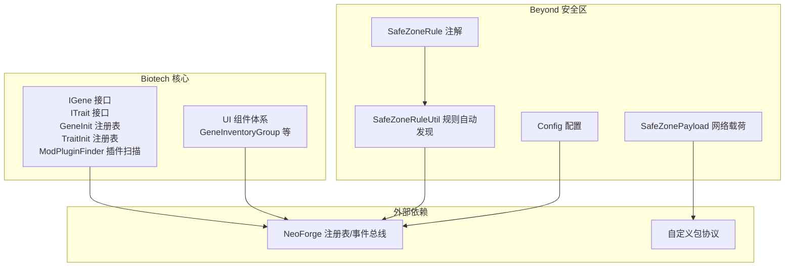
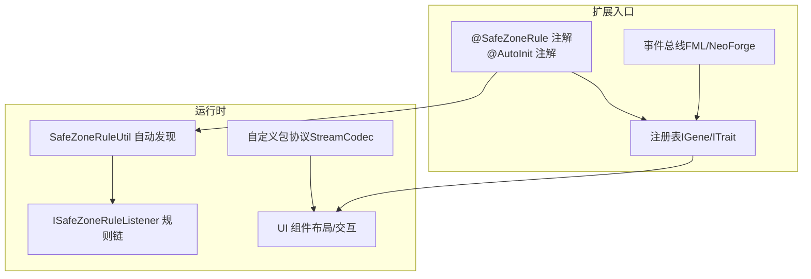
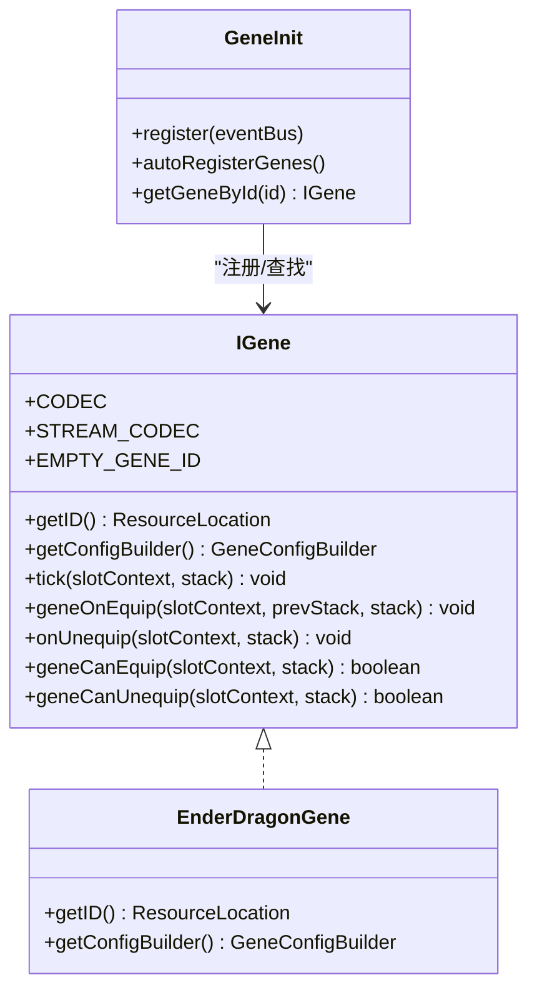
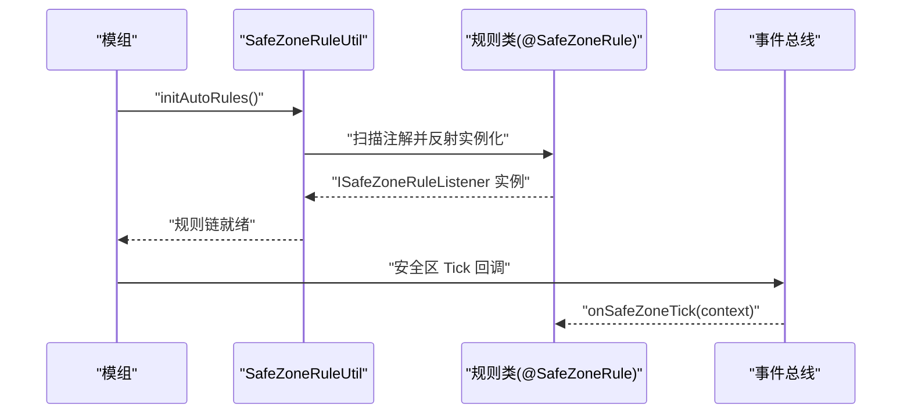
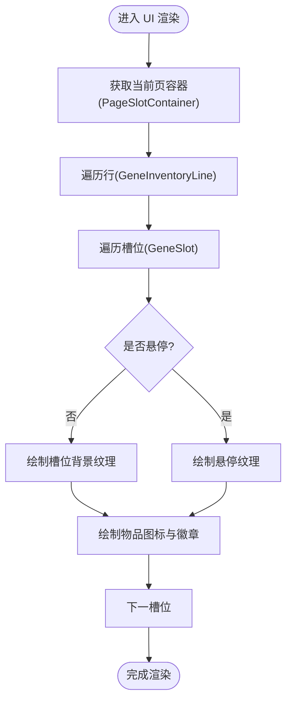
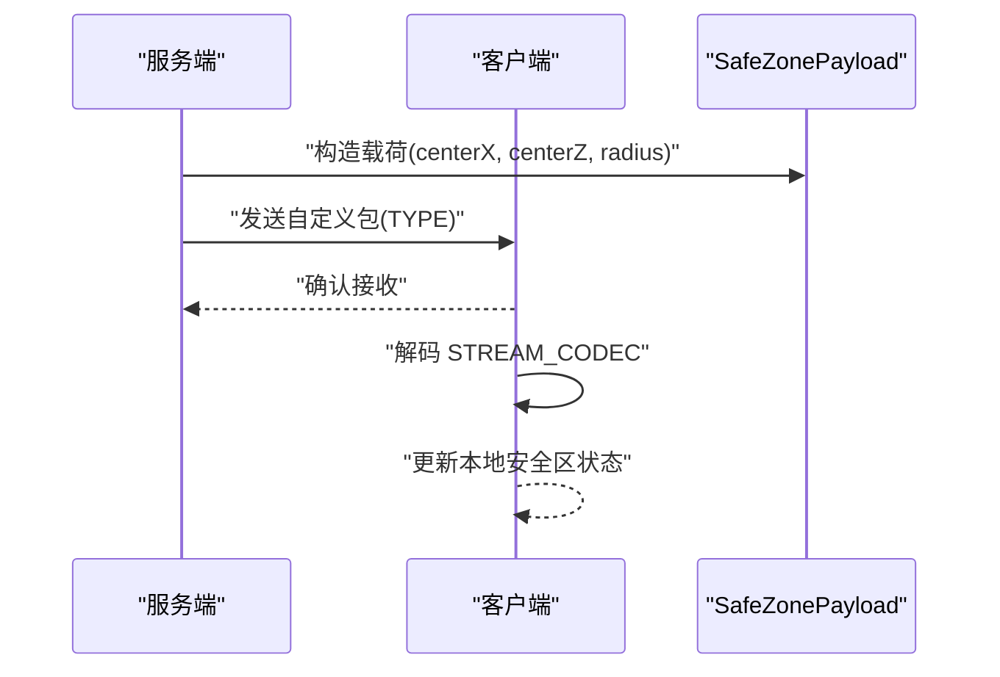
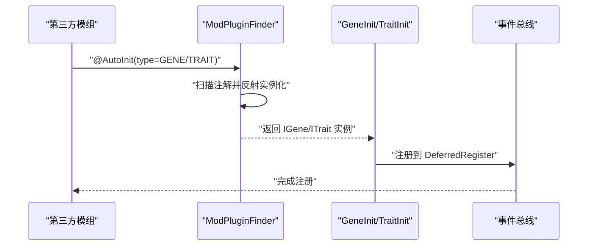
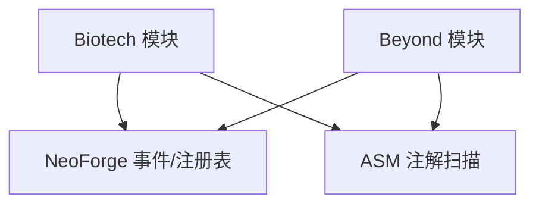

# 扩展开发

<cite>
**本文引用的文件**
- [Beyond.java](file://Beyond/src/main/java/com/pz/beyond/Beyond.java)
- [Config.java](file://Beyond/src/main/java/com/pz/beyond/Config.java)
- [SafeZoneRuleUtil.java](file://Beyond/src/main/java/com/pz/beyond/util/SafeZoneRuleUtil.java)
- [SafeZonePayload.java](file://Beyond/src/main/java/com/pz/beyond/network/SafeZonePayload.java)
- [SafeZoneRule.java](file://Beyond/src/main/java/com/pz/beyond/safeZoneRule/SafeZoneRule.java)
- [ModTags.java](file://Beyond/src/main/java/com/pz/beyond/registry/ModTags.java)
- [AutoRegeneration.java](file://Beyond/src/main/java/com/pz/beyond/safeZoneRule/impl/AutoRegeneration.java)
- [IGene.java](file://Biotech/src/main/java/org/biotech/api/system/gene/core/IGene.java)
- [ITrait.java](file://Biotech/src/main/java/org/biotech/api/system/trait/core/ITrait.java)
- [GeneInit.java](file://Biotech/src/main/java/org/biotech/api/init/GeneInit.java)
- [TraitInit.java](file://Biotech/src/main/java/org/biotech/api/init/TraitInit.java)
- [ModPluginFinder.java](file://Biotech/src/main/java/org/biotech/api/util/ModPluginFinder.java)
- [EnderDragonGene.java](file://Biotech/src/main/java/org/biotech/gene/EnderDragonGene.java)
- [GeneInventoryGroup.java](file://Biotech/src/main/java/org/biotech/ui/gene_inventroy/group/GeneInventoryGroup.java)
- [settings.gradle](file://settings.gradle)
</cite>

## 目录
1. [简介](#简介)
2. [项目结构](#项目结构)
3. [核心组件](#核心组件)
4. [架构总览](#架构总览)
5. [详细组件分析](#详细组件分析)
6. [依赖分析](#依赖分析)
7. [性能考虑](#性能考虑)
8. [故障排查指南](#故障排查指南)
9. [结论](#结论)
10. [附录](#附录)

## 简介
本指南面向希望为项目添加新功能与自定义内容的开发者，涵盖以下扩展方向：
- 自定义基因类型开发：实现 IGene 接口并注册，支持自动发现与注册。
- 安全区规则扩展：通过注解与 SPI 机制自动加载安全区规则监听器。
- UI 组件定制：基于现有 UI 元素体系进行扩展，遵循布局与交互约定。
- 网络包扩展：新增自定义协议载荷并注册编码器，确保客户端与服务端同步。
- 插件系统与第三方集成：利用注解扫描与注册表机制，实现跨模组协作。

## 项目结构
仓库采用多模块结构，核心模块包括：
- Biotech：基因与词条系统的核心实现，包含注册表、初始化流程、UI 组件与网络包。
- Beyond：安全区系统与配置模块，负责安全区规则的自动发现与网络消息。
- GalaxyLib、GeneHunter、GameText、ModFix：辅助与示例模块，便于扩展与集成。

图表来源
- [settings.gradle:13-19](file://settings.gradle#L13-L19)
- [Beyond.java:46-65](file://Beyond/src/main/java/com/pz/beyond/Beyond.java#L46-L65)
- [IGene.java:15-91](file://Biotech/src/main/java/org/biotech/api/system/gene/core/IGene.java#L15-L91)
- [ITrait.java:18-108](file://Biotech/src/main/java/org/biotech/api/system/trait/core/ITrait.java#L18-L108)

章节来源
- [settings.gradle:1-19](file://settings.gradle#L1-L19)
- [Beyond.java:1-79](file://Beyond/src/main/java/com/pz/beyond/Beyond.java#L1-L79)

## 核心组件
- 基因系统（IGene）
  - 提供基因生命周期钩子（装备/卸下、tick、可穿戴性判断）、序列化编解码、空基因标识等。
  - 通过 GeneInit 注册表统一管理，并支持自动发现与注册。
- 词条系统（ITrait）
  - 提供词条的唯一标识、描述、属性值、修饰符 ID 生成与序列化编解码。
  - 通过 TraitInit 注册表统一管理，并支持自动发现与注册。
- 安全区系统（SafeZoneRuleUtil）
  - 通过注解扫描加载所有实现 ISafeZoneRuleListener 的类，形成运行时规则链。
- UI 系统（GeneInventoryGroup）
  - 提供基因槽位组的布局、分页、收藏模式与渲染逻辑，可作为扩展 UI 的参考模板。
- 网络系统（SafeZonePayload）
  - 定义自定义协议载荷与流编解码器，确保跨网络同步。

章节来源
- [IGene.java:15-91](file://Biotech/src/main/java/org/biotech/api/system/gene/core/IGene.java#L15-L91)
- [ITrait.java:18-108](file://Biotech/src/main/java/org/biotech/api/system/trait/core/ITrait.java#L18-L108)
- [GeneInit.java:21-107](file://Biotech/src/main/java/org/biotech/api/init/GeneInit.java#L21-L107)
- [TraitInit.java:19-103](file://Biotech/src/main/java/org/biotech/api/init/TraitInit.java#L19-L103)
- [SafeZoneRuleUtil.java:11-54](file://Beyond/src/main/java/com/pz/beyond/util/SafeZoneRuleUtil.java#L11-L54)
- [SafeZonePayload.java:10-31](file://Beyond/src/main/java/com/pz/beyond/network/SafeZonePayload.java#L10-L31)
- [GeneInventoryGroup.java:48-637](file://Biotech/src/main/java/org/biotech/ui/gene_inventroy/group/GeneInventoryGroup.java#L48-L637)

## 架构总览
下图展示了扩展点与关键交互：

图表来源
- [SafeZoneRule.java:8-12](file://Beyond/src/main/java/com/pz/beyond/safeZoneRule/SafeZoneRule.java#L8-L12)
- [ModPluginFinder.java:36-82](file://Biotech/src/main/java/org/biotech/api/util/ModPluginFinder.java#L36-L82)
- [SafeZoneRuleUtil.java:13-48](file://Beyond/src/main/java/com/pz/beyond/util/SafeZoneRuleUtil.java#L13-L48)
- [IGene.java:67-87](file://Biotech/src/main/java/org/biotech/api/system/gene/core/IGene.java#L67-L87)
- [ITrait.java:86-106](file://Biotech/src/main/java/org/biotech/api/system/trait/core/ITrait.java#L86-L106)

## 详细组件分析

### 自定义基因类型开发（IGene）
- 设计要点
  - 通过 ResourceLocation 唯一标识基因；提供配置构建器以声明稀有度等元信息。
  - 生命周期钩子：tick、onEquip、onUnequip、canEquip/canUnequip。
  - 编解码：Codec 与 StreamCodec 支持序列化与网络同步。
  - 空基因标识：EMPTY_GENE_ID 用于空值场景。
- 开发步骤
  1) 实现 IGene 并标注 @AutoInit(type = AutoInit.InitType.GENE)，确保被自动发现与注册。
  2) 在 GeneInit 中注册或等待自动注册。
  3) 如需网络同步，确保 StreamCodec 正确映射。
- 示例参考
  - [EnderDragonGene.java:11-25](file://Biotech/src/main/java/org/biotech/gene/EnderDragonGene.java#L11-L25)
  - [IGene.java:15-91](file://Biotech/src/main/java/org/biotech/api/system/gene/core/IGene.java#L15-L91)
  - [GeneInit.java:64-80](file://Biotech/src/main/java/org/biotech/api/init/GeneInit.java#L64-L80)

图表来源
- [IGene.java:15-91](file://Biotech/src/main/java/org/biotech/api/system/gene/core/IGene.java#L15-L91)
- [GeneInit.java:21-107](file://Biotech/src/main/java/org/biotech/api/init/GeneInit.java#L21-L107)
- [EnderDragonGene.java:11-25](file://Biotech/src/main/java/org/biotech/gene/EnderDragonGene.java#L11-L25)

章节来源
- [IGene.java:15-91](file://Biotech/src/main/java/org/biotech/api/system/gene/core/IGene.java#L15-L91)
- [GeneInit.java:64-80](file://Biotech/src/main/java/org/biotech/api/init/GeneInit.java#L64-L80)
- [EnderDragonGene.java:11-25](file://Biotech/src/main/java/org/biotech/gene/EnderDragonGene.java#L11-L25)

### 安全区规则扩展机制
- 设计原理
  - 通过 @SafeZoneRule 注解标记规则类，运行时由 SafeZoneRuleUtil 扫描并实例化为 ISafeZoneRuleListener。
  - 每个规则在安全区 Tick 时被依次回调，实现组合式规则链。
- 开发步骤
  1) 新建类实现 ISafeZoneRuleListener，并标注 @SafeZoneRule。
  2) 在 Beyond.commonSetup 中初始化自动规则（或在你的模组中自行调用）。
  3) 在规则中读取 SafeZoneContext，按需修改玩家状态。
- 示例参考
  - [AutoRegeneration.java:7-18](file://Beyond/src/main/java/com/pz/beyond/safeZoneRule/impl/AutoRegeneration.java#L7-L18)
  - [SafeZoneRuleUtil.java:13-48](file://Beyond/src/main/java/com/pz/beyond/util/SafeZoneRuleUtil.java#L13-L48)
  - [SafeZoneRule.java:8-12](file://Beyond/src/main/java/com/pz/beyond/safeZoneRule/SafeZoneRule.java#L8-L12)

图表来源
- [SafeZoneRuleUtil.java:13-48](file://Beyond/src/main/java/com/pz/beyond/util/SafeZoneRuleUtil.java#L13-L48)
- [SafeZoneRule.java:8-12](file://Beyond/src/main/java/com/pz/beyond/safeZoneRule/SafeZoneRule.java#L8-L12)

章节来源
- [SafeZoneRuleUtil.java:11-54](file://Beyond/src/main/java/com/pz/beyond/util/SafeZoneRuleUtil.java#L11-L54)
- [AutoRegeneration.java:7-18](file://Beyond/src/main/java/com/pz/beyond/safeZoneRule/impl/AutoRegeneration.java#L7-L18)

### UI 组件定制开发
- 设计原则
  - 基于现有的 UI 元素体系（如 GeneInventoryGroup），遵循布局、缩放、分页与渲染约定。
  - 通过 PageManager 管理普通与收藏模式的页码状态，保证两种模式独立维护。
  - 使用 SlotContext 与数据组件驱动渲染细节（如词条数量的罗马数字徽章）。
- 扩展建议
  - 复用 PageSlotContainer 与 GeneInventoryLine 的组织方式，保持层级清晰。
  - 通过 scale 接口适配不同缩放比例，确保 UI 在不同分辨率下一致。
  - 在 drawBackgroundAdditional 中绘制背景与悬停效果，注意层级顺序与坐标转换。
- 示例参考
  - [GeneInventoryGroup.java:48-637](file://Biotech/src/main/java/org/biotech/ui/gene_inventroy/group/GeneInventoryGroup.java#L48-L637)

图表来源
- [GeneInventoryGroup.java:260-491](file://Biotech/src/main/java/org/biotech/ui/gene_inventroy/group/GeneInventoryGroup.java#L260-L491)

章节来源
- [GeneInventoryGroup.java:48-637](file://Biotech/src/main/java/org/biotech/ui/gene_inventroy/group/GeneInventoryGroup.java#L48-L637)

### 网络包扩展方案
- 设计要点
  - 使用 CustomPacketPayload 定义协议类型与 StreamCodec 编解码器。
  - 通过 ByteBufCodecs 定义字段的读写顺序与类型。
  - 在服务端/客户端分别注册与处理，确保双方协议一致。
- 开发步骤
  1) 定义记录类承载数据字段。
  2) 实现 TYPE 与 STREAM_CODEC。
  3) 在事件总线上注册并发送/接收。
- 示例参考
  - [SafeZonePayload.java:10-31](file://Beyond/src/main/java/com/pz/beyond/network/SafeZonePayload.java#L10-L31)

图表来源
- [SafeZonePayload.java:10-31](file://Beyond/src/main/java/com/pz/beyond/network/SafeZonePayload.java#L10-L31)

章节来源
- [SafeZonePayload.java:10-31](file://Beyond/src/main/java/com/pz/beyond/network/SafeZonePayload.java#L10-L31)

### 插件系统与第三方集成
- 插件扫描
  - 通过 ModPluginFinder 扫描 @AutoInit 注解，按 InitType 过滤并反射实例化。
  - 支持 IGene 与 ITrait 的自动注册，减少样板代码。
- 第三方集成
  - 在其他模组中实现 IGene/ITrait 并标注 @AutoInit(type=GENE/TRAIT)，即可被扫描并注册。
  - 通过注册表键（ResourceKey）与 DeferredRegister 统一管理资源。
- 示例参考
  - [ModPluginFinder.java:36-82](file://Biotech/src/main/java/org/biotech/api/util/ModPluginFinder.java#L36-L82)
  - [GeneInit.java:72-80](file://Biotech/src/main/java/org/biotech/api/init/GeneInit.java#L72-L80)
  - [TraitInit.java:82-93](file://Biotech/src/main/java/org/biotech/api/init/TraitInit.java#L82-L93)

图表来源
- [ModPluginFinder.java:36-82](file://Biotech/src/main/java/org/biotech/api/util/ModPluginFinder.java#L36-L82)
- [GeneInit.java:72-80](file://Biotech/src/main/java/org/biotech/api/init/GeneInit.java#L72-L80)
- [TraitInit.java:82-93](file://Biotech/src/main/java/org/biotech/api/init/TraitInit.java#L82-L93)

章节来源
- [ModPluginFinder.java:1-182](file://Biotech/src/main/java/org/biotech/api/util/ModPluginFinder.java#L1-L182)
- [GeneInit.java:72-80](file://Biotech/src/main/java/org/biotech/api/init/GeneInit.java#L72-L80)
- [TraitInit.java:82-93](file://Biotech/src/main/java/org/biotech/api/init/TraitInit.java#L82-L93)

## 依赖分析
- 模块耦合
  - Biotech 与 Beyond 分别承担“系统核心”与“安全区扩展”的职责，通过注解与注册表实现松耦合。
  - UI 组件依赖注册表与数据组件，渲染逻辑与布局系统解耦。
- 外部依赖
  - NeoForge 注册表与事件总线：用于注册与生命周期管理。
  - ASM 类型解析：用于注解扫描与反射实例化。
- 循环依赖
  - 当前结构未见直接循环依赖；规则自动发现与 UI 组件之间通过接口解耦。

图表来源
- [settings.gradle:13-19](file://settings.gradle#L13-L19)
- [ModPluginFinder.java:93-114](file://Biotech/src/main/java/org/biotech/api/util/ModPluginFinder.java#L93-L114)

章节来源
- [settings.gradle:13-19](file://settings.gradle#L13-L19)
- [ModPluginFinder.java:93-114](file://Biotech/src/main/java/org/biotech/api/util/ModPluginFinder.java#L93-L114)

## 性能考虑
- 注解扫描
  - SafeZoneRuleUtil 与 ModPluginFinder 在启动阶段执行扫描，应避免在热路径重复扫描。
  - 建议将扫描结果缓存至静态集合，减少反射开销。
- 网络编解码
  - StreamCodec 与 ByteBufCodecs 的顺序与类型需严格匹配，避免额外的序列化/反序列化成本。
- UI 渲染
  - 使用 PageManager 控制页面可见性，仅渲染当前页，降低绘制压力。
  - 合理使用缩放与层级，避免过度的 pose 变换。

## 故障排查指南
- 安全区规则未生效
  - 检查类是否标注 @SafeZoneRule 且实现 ISafeZoneRuleListener。
  - 确认 Beyond.commonSetup 中调用了 SafeZoneRuleUtil.initAutoRules。
  - 参考：[SafeZoneRuleUtil.java:13-48](file://Beyond/src/main/java/com/pz/beyond/util/SafeZoneRuleUtil.java#L13-L48)
- 基因/词条未注册
  - 确保实现类标注 @AutoInit(type=GENE/TRAIT)。
  - 检查 GeneInit/TraitInit 的自动注册流程是否执行。
  - 参考：[ModPluginFinder.java:36-82](file://Biotech/src/main/java/org/biotech/api/util/ModPluginFinder.java#L36-L82)
- 网络包解析异常
  - 确认 STREAM_CODEC 字段顺序与 SafeZonePayload 字段一一对应。
  - 参考：[SafeZonePayload.java:21-29](file://Beyond/src/main/java/com/pz/beyond/network/SafeZonePayload.java#L21-L29)
- UI 显示异常
  - 检查 PageManager 的页码切换逻辑与容器可见性设置。
  - 参考：[GeneInventoryGroup.java:542-634](file://Biotech/src/main/java/org/biotech/ui/gene_inventroy/group/GeneInventoryGroup.java#L542-L634)

章节来源
- [SafeZoneRuleUtil.java:13-48](file://Beyond/src/main/java/com/pz/beyond/util/SafeZoneRuleUtil.java#L13-L48)
- [ModPluginFinder.java:36-82](file://Biotech/src/main/java/org/biotech/api/util/ModPluginFinder.java#L36-L82)
- [SafeZonePayload.java:21-29](file://Beyond/src/main/java/com/pz/beyond/network/SafeZonePayload.java#L21-L29)
- [GeneInventoryGroup.java:542-634](file://Biotech/src/main/java/org/biotech/ui/gene_inventroy/group/GeneInventoryGroup.java#L542-L634)

## 结论
本指南提供了从接口实现、注解扫描、注册表管理到 UI 与网络扩展的完整开发路径。通过遵循现有设计原则与最佳实践，开发者可以快速、稳定地为项目添加新功能，并与现有系统无缝集成。

## 附录
- 配置系统
  - Beyond 提供了基础配置规范占位，可在需要时扩展配置项并注册到 ModContainer。
  - 参考：[Config.java:6-19](file://Beyond/src/main/java/com/pz/beyond/Config.java#L6-L19)
- 标签系统
  - ModTags 提供实体标签示例，可用于安全区影响范围控制等场景。
  - 参考：[ModTags.java:10-16](file://Beyond/src/main/java/com/pz/beyond/registry/ModTags.java#L10-L16)

章节来源
- [Config.java:6-19](file://Beyond/src/main/java/com/pz/beyond/Config.java#L6-L19)
- [ModTags.java:10-16](file://Beyond/src/main/java/com/pz/beyond/registry/ModTags.java#L10-L16)