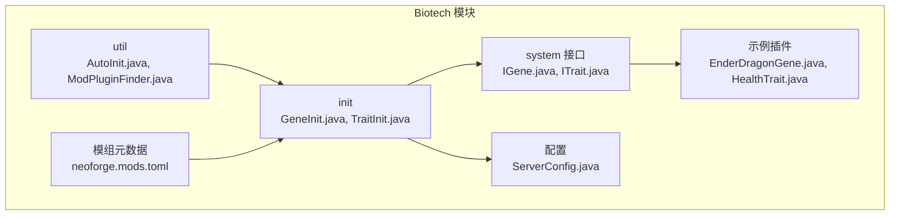
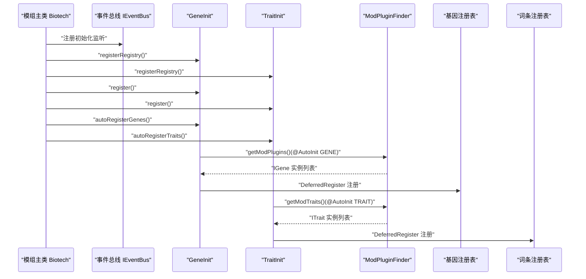
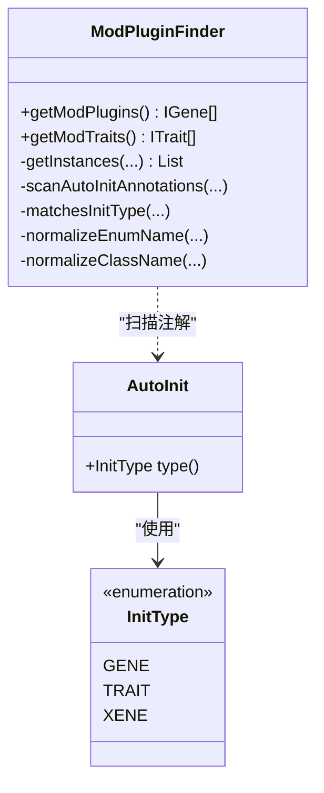
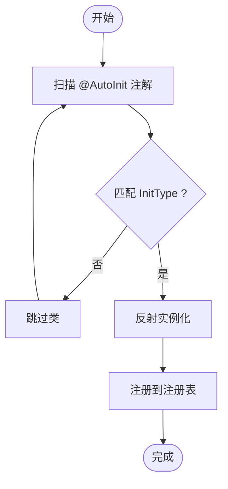
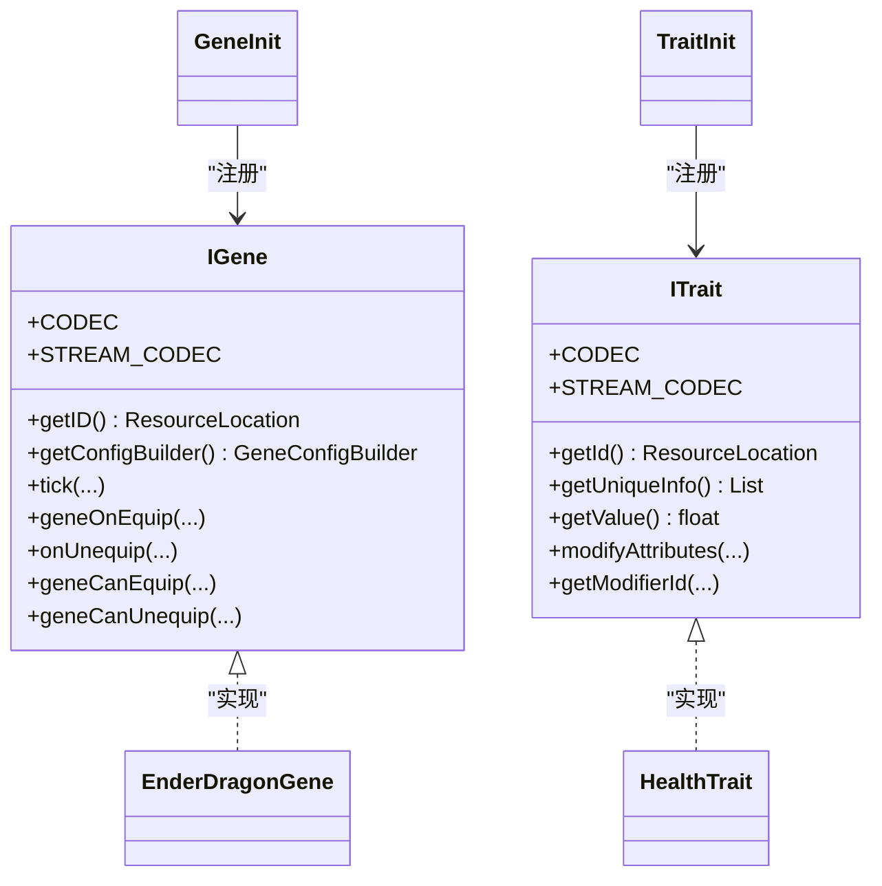
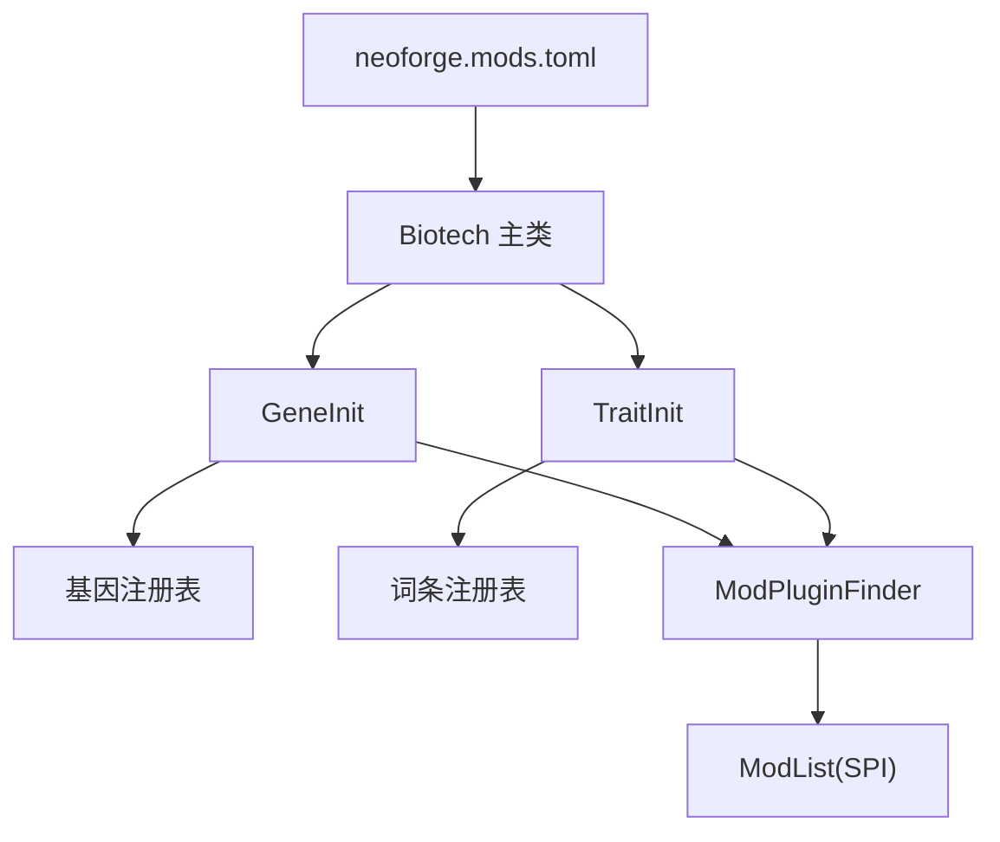

# 插件系统集成

<cite>
**本文引用的文件**
- [AutoInit.java](file://Biotech/src/main/java/org/biotech/api/util/AutoInit.java)
- [ModPluginFinder.java](file://Biotech/src/main/java/org/biotech/api/util/ModPluginFinder.java)
- [Biotech.java](file://Biotech/src/main/java/org/biotech/Biotech.java)
- [GeneInit.java](file://Biotech/src/main/java/org/biotech/api/init/GeneInit.java)
- [TraitInit.java](file://Biotech/src/main/java/org/biotech/api/init/TraitInit.java)
- [IGene.java](file://Biotech/src/main/java/org/biotech/api/system/gene/core/IGene.java)
- [ITrait.java](file://Biotech/src/main/java/org/biotech/api/system/trait/core/ITrait.java)
- [EnderDragonGene.java](file://Biotech/src/main/java/org/biotech/gene/EnderDragonGene.java)
- [HealthTrait.java](file://Biotech/src/main/java/org/biotech/trait/HealthTrait.java)
- [ServerConfig.java](file://Biotech/src/main/java/org/biotech/api/config/ServerConfig.java)
- [neoforge.mods.toml](file://Biotech/src/main/templates/META-INF/neoforge.mods.toml)
</cite>

## 目录
1. [简介](#简介)
2. [项目结构](#项目结构)
3. [核心组件](#核心组件)
4. [架构总览](#架构总览)
5. [详细组件分析](#详细组件分析)
6. [依赖分析](#依赖分析)
7. [性能考虑](#性能考虑)
8. [故障排查指南](#故障排查指南)
9. [结论](#结论)
10. [附录](#附录)

## 简介
本指南围绕插件系统在模组中的集成与使用，重点讲解以下内容：
- 如何使用 ModPluginFinder 实现插件发现机制；
- 如何通过 AutoInit 注解驱动自动初始化；
- 插件加载流程、依赖管理与生命周期控制；
- 完整的插件开发示例：创建可插拔的功能模块；
- 插件间通信、资源共享与冲突处理策略；
- 配置管理、热重载支持与调试工具使用；
- 发布、版本管理与向后兼容的最佳实践。

## 项目结构
本仓库采用多模块结构，其中 Biotech 模块提供了插件系统的核心能力：
- util 包：提供 AutoInit 注解与 ModPluginFinder 插件扫描器；
- init 包：提供注册表初始化与自动注册逻辑；
- system 接口层：定义 IGene、ITrait 等扩展点；
- 示例插件：EnderDragonGene（基因）、HealthTrait（词条）等；
- 配置：ServerConfig 提供服务端配置；
- 模组元数据：neoforge.mods.toml 定义模组信息与依赖。

**图表来源**
- [Biotech.java:16-72](file://Biotech/src/main/java/org/biotech/Biotech.java#L16-L72)
- [ModPluginFinder.java:25-181](file://Biotech/src/main/java/org/biotech/api/util/ModPluginFinder.java#L25-L181)
- [AutoInit.java:15-33](file://Biotech/src/main/java/org/biotech/api/util/AutoInit.java#L15-L33)
- [GeneInit.java:21-106](file://Biotech/src/main/java/org/biotech/api/init/GeneInit.java#L21-L106)
- [TraitInit.java:19-102](file://Biotech/src/main/java/org/biotech/api/init/TraitInit.java#L19-L102)
- [IGene.java:15-90](file://Biotech/src/main/java/org/biotech/api/system/gene/core/IGene.java#L15-L90)
- [ITrait.java:18-107](file://Biotech/src/main/java/org/biotech/api/system/trait/core/ITrait.java#L18-L107)
- [EnderDragonGene.java:11-24](file://Biotech/src/main/java/org/biotech/gene/EnderDragonGene.java#L11-L24)
- [HealthTrait.java:18-55](file://Biotech/src/main/java/org/biotech/trait/HealthTrait.java#L18-L55)
- [ServerConfig.java:5-48](file://Biotech/src/main/java/org/biotech/api/config/ServerConfig.java#L5-L48)
- [neoforge.mods.toml:16-80](file://Biotech/src/main/templates/META-INF/neoforge.mods.toml#L16-L80)

**章节来源**
- [Biotech.java:16-72](file://Biotech/src/main/java/org/biotech/Biotech.java#L16-L72)
- [neoforge.mods.toml:16-80](file://Biotech/src/main/templates/META-INF/neoforge.mods.toml#L16-L80)

## 核心组件
- AutoInit 注解：用于标记需要自动注册的类，并指定注册类型（基因、词条、异种）。
- ModPluginFinder：扫描所有模组中带有 AutoInit 注解的类，按类型过滤并实例化，返回可注册对象列表。
- GeneInit / TraitInit：负责注册表的创建与注册，调用 ModPluginFinder 进行自动发现与注册。
- IGene / ITrait：插件扩展点接口，定义插件行为与序列化协议。
- 示例插件：EnderDragonGene（基因）、HealthTrait（词条）展示了如何标注与实现插件。

**章节来源**
- [AutoInit.java:15-33](file://Biotech/src/main/java/org/biotech/api/util/AutoInit.java#L15-L33)
- [ModPluginFinder.java:36-181](file://Biotech/src/main/java/org/biotech/api/util/ModPluginFinder.java#L36-L181)
- [GeneInit.java:72-106](file://Biotech/src/main/java/org/biotech/api/init/GeneInit.java#L72-L106)
- [TraitInit.java:82-102](file://Biotech/src/main/java/org/biotech/api/init/TraitInit.java#L82-L102)
- [IGene.java:15-90](file://Biotech/src/main/java/org/biotech/api/system/gene/core/IGene.java#L15-L90)
- [ITrait.java:18-107](file://Biotech/src/main/java/org/biotech/api/system/trait/core/ITrait.java#L18-L107)
- [EnderDragonGene.java:11-24](file://Biotech/src/main/java/org/biotech/gene/EnderDragonGene.java#L11-L24)
- [HealthTrait.java:18-55](file://Biotech/src/main/java/org/biotech/trait/HealthTrait.java#L18-L55)

## 架构总览
下图展示了插件系统从扫描到注册的完整流程，以及与模组主类、注册表和接口扩展点的关系。

**图表来源**
- [Biotech.java:49-61](file://Biotech/src/main/java/org/biotech/Biotech.java#L49-L61)
- [GeneInit.java:72-80](file://Biotech/src/main/java/org/biotech/api/init/GeneInit.java#L72-L80)
- [TraitInit.java:82-93](file://Biotech/src/main/java/org/biotech/api/init/TraitInit.java#L82-L93)
- [ModPluginFinder.java:36-82](file://Biotech/src/main/java/org/biotech/api/util/ModPluginFinder.java#L36-L82)
- [IGene.java:67-87](file://Biotech/src/main/java/org/biotech/api/system/gene/core/IGene.java#L67-L87)
- [ITrait.java:73-106](file://Biotech/src/main/java/org/biotech/api/system/trait/core/ITrait.java#L73-L106)

## 详细组件分析

### AutoInit 注解与 ModPluginFinder
- AutoInit 注解通过运行时保留策略，允许在运行期反射读取其元数据；InitType 指定插件类型（基因、词条、异种）。
- ModPluginFinder 使用 NeoForge SPI 的 ModList 扫描所有模组的注解数据，过滤出目标类型，再通过反射实例化类，最终返回实例列表。
- 该机制确保插件可在不修改主注册逻辑的情况下被自动发现与注册。

**图表来源**
- [AutoInit.java:15-33](file://Biotech/src/main/java/org/biotech/api/util/AutoInit.java#L15-L33)
- [ModPluginFinder.java:36-181](file://Biotech/src/main/java/org/biotech/api/util/ModPluginFinder.java#L36-L181)

**章节来源**
- [AutoInit.java:15-33](file://Biotech/src/main/java/org/biotech/api/util/AutoInit.java#L15-L33)
- [ModPluginFinder.java:36-181](file://Biotech/src/main/java/org/biotech/api/util/ModPluginFinder.java#L36-L181)

### 基因与词条的自动注册流程
- GeneInit 与 TraitInit 分别维护各自的注册表与自动注册逻辑。
- autoRegisterGenes 与 autoRegisterTraits 调用 ModPluginFinder 对应方法，获取实例后通过 DeferredRegister 注册到注册表。
- 注册完成后，可通过 ResourceLocation 快速检索实例，实现序列化与网络同步。

**图表来源**
- [GeneInit.java:72-80](file://Biotech/src/main/java/org/biotech/api/init/GeneInit.java#L72-L80)
- [TraitInit.java:82-93](file://Biotech/src/main/java/org/biotech/api/init/TraitInit.java#L82-L93)
- [ModPluginFinder.java:56-82](file://Biotech/src/main/java/org/biotech/api/util/ModPluginFinder.java#L56-L82)

**章节来源**
- [GeneInit.java:72-106](file://Biotech/src/main/java/org/biotech/api/init/GeneInit.java#L72-L106)
- [TraitInit.java:82-102](file://Biotech/src/main/java/org/biotech/api/init/TraitInit.java#L82-L102)

### 接口扩展点：IGene 与 ITrait
- IGene 与 ITrait 定义了插件的基本行为与序列化协议，包括显示名、配置构建器、装备/卸下回调、属性修改钩子等。
- 两者均提供基于 ResourceLocation 的 Codec 与 StreamCodec，便于在数据包与网络中传输与解析。

**图表来源**
- [IGene.java:15-90](file://Biotech/src/main/java/org/biotech/api/system/gene/core/IGene.java#L15-L90)
- [ITrait.java:18-107](file://Biotech/src/main/java/org/biotech/api/system/trait/core/ITrait.java#L18-L107)
- [EnderDragonGene.java:11-24](file://Biotech/src/main/java/org/biotech/gene/EnderDragonGene.java#L11-L24)
- [HealthTrait.java:18-55](file://Biotech/src/main/java/org/biotech/trait/HealthTrait.java#L18-L55)
- [GeneInit.java:21-29](file://Biotech/src/main/java/org/biotech/api/init/GeneInit.java#L21-L29)
- [TraitInit.java:19-28](file://Biotech/src/main/java/org/biotech/api/init/TraitInit.java#L19-L28)

**章节来源**
- [IGene.java:15-90](file://Biotech/src/main/java/org/biotech/api/system/gene/core/IGene.java#L15-L90)
- [ITrait.java:18-107](file://Biotech/src/main/java/org/biotech/api/system/trait/core/ITrait.java#L18-L107)

### 示例插件：EnderDragonGene 与 HealthTrait
- EnderDragonGene 通过 @AutoInit(type = GENE) 标记，实现 IGene 并提供稀有度与配置构建器。
- HealthTrait 通过 @AutoInit(type = TRAIT) 标记，实现 ITrait 并在属性事件中添加最大生命值修正。

**章节来源**
- [EnderDragonGene.java:11-24](file://Biotech/src/main/java/org/biotech/gene/EnderDragonGene.java#L11-L24)
- [HealthTrait.java:18-55](file://Biotech/src/main/java/org/biotech/trait/HealthTrait.java#L18-L55)

## 依赖分析
- 模组依赖：neoforge 与 minecraft 版本范围由 toml 文件声明，确保运行环境满足要求。
- 插件系统依赖：ModPluginFinder 依赖 NeoForge 的 ModList 与 ASM 类型表示，以扫描注解并实例化类。
- 注册表依赖：GeneInit 与 TraitInit 依赖 NeoForge DeferredRegister 与 RegistryBuilder，实现注册表创建与注册。

**图表来源**
- [neoforge.mods.toml:48-80](file://Biotech/src/main/templates/META-INF/neoforge.mods.toml#L48-L80)
- [Biotech.java:49-61](file://Biotech/src/main/java/org/biotech/Biotech.java#L49-L61)
- [GeneInit.java:21-32](file://Biotech/src/main/java/org/biotech/api/init/GeneInit.java#L21-L32)
- [TraitInit.java:19-28](file://Biotech/src/main/java/org/biotech/api/init/TraitInit.java#L19-L28)
- [ModPluginFinder.java:93-114](file://Biotech/src/main/java/org/biotech/api/util/ModPluginFinder.java#L93-L114)

**章节来源**
- [neoforge.mods.toml:48-80](file://Biotech/src/main/templates/META-INF/neoforge.mods.toml#L48-L80)
- [ModPluginFinder.java:93-114](file://Biotech/src/main/java/org/biotech/api/util/ModPluginFinder.java#L93-L114)

## 性能考虑
- 扫描与反射：ModPluginFinder 在启动阶段进行注解扫描与反射实例化，建议控制插件数量与构造开销，避免在主线程造成卡顿。
- 注册表延迟：使用 DeferredRegister 延迟注册，减少不必要的初始化成本。
- 序列化优化：IGene/ITrait 的 StreamCodec 基于 ResourceLocation，序列化开销低，适合频繁网络同步场景。
- 日志与可观测性：扫描过程会记录匹配统计，便于定位问题与评估规模。

[本节为通用指导，无需特定文件来源]

## 故障排查指南
- 未发现插件：
  - 检查插件类是否正确标注 @AutoInit(type=...) 且 InitType 与注册表一致。
  - 确认插件类实现了对应接口（IGene/ITrait），并具备无参构造函数。
  - 查看日志中扫描统计，确认注解扫描与类型匹配结果。
- 注册失败：
  - 检查注册表是否已创建并注册到事件总线。
  - 确认 ResourceLocation 路径唯一，避免重复注册导致异常。
- 反射错误：
  - 若实例化抛出异常，检查类加载器与依赖是否完整，避免 LinkageError。
- 配置问题：
  - 使用 ServerConfig 读取配置值，确认配置文件存在且键名正确。

**章节来源**
- [ModPluginFinder.java:77-80](file://Biotech/src/main/java/org/biotech/api/util/ModPluginFinder.java#L77-L80)
- [TraitInit.java:86-87](file://Biotech/src/main/java/org/biotech/api/init/TraitInit.java#L86-L87)
- [ServerConfig.java:37-47](file://Biotech/src/main/java/org/biotech/api/config/ServerConfig.java#L37-L47)

## 结论
通过 AutoInit 注解与 ModPluginFinder 的组合，插件系统实现了“零样板”的自动发现与注册。结合 DeferredRegister 与接口扩展点，开发者可以快速构建可插拔的功能模块，并在不破坏主流程的前提下扩展系统能力。配合配置管理与序列化协议，插件系统具备良好的可维护性与可扩展性。

[本节为总结，无需特定文件来源]

## 附录

### 插件开发步骤（示例）
- 定义插件接口：实现 IGene 或 ITrait。
- 标注注解：在类上添加 @AutoInit(type = ...)。
- 实现行为：提供 ID、配置、属性修改等逻辑。
- 注册入口：在 Biotech 的初始化流程中调用相应 autoRegister 方法。
- 验证：查看日志与注册表，确认插件被正确加载与注册。

**章节来源**
- [IGene.java:15-90](file://Biotech/src/main/java/org/biotech/api/system/gene/core/IGene.java#L15-L90)
- [ITrait.java:18-107](file://Biotech/src/main/java/org/biotech/api/system/trait/core/ITrait.java#L18-L107)
- [EnderDragonGene.java:11-24](file://Biotech/src/main/java/org/biotech/gene/EnderDragonGene.java#L11-L24)
- [HealthTrait.java:18-55](file://Biotech/src/main/java/org/biotech/trait/HealthTrait.java#L18-L55)
- [Biotech.java:49-61](file://Biotech/src/main/java/org/biotech/Biotech.java#L49-L61)

### 插件间通信与资源共享
- 通过共享接口（如 ITrait 的属性事件）实现跨插件协作。
- 使用统一的 ResourceLocation 作为资源标识，避免硬编码路径引发冲突。
- 在注册前进行冲突检测（例如 ID 唯一性校验），并在日志中提示潜在冲突。

[本节为通用指导，无需特定文件来源]

### 冲突解决策略
- ID 冲突：确保每个插件的 ResourceLocation 唯一；若发生冲突，优先采用命名空间区分或版本化路径。
- 初始化顺序：通过事件总线监听与注册顺序控制，必要时引入依赖声明。
- 回退策略：为插件提供默认实现（如空实例），保证系统稳定性。

[本节为通用指导，无需特定文件来源]

### 配置管理与热重载
- 服务器配置：使用 ServerConfig 管理可调整参数，避免重启生效。
- 数据包与运行时：通过注册表与序列化协议支持运行时变更，但需注意缓存与状态一致性。

**章节来源**
- [ServerConfig.java:5-48](file://Biotech/src/main/java/org/biotech/api/config/ServerConfig.java#L5-L48)

### 调试工具与日志
- 启动日志：关注 ModPluginFinder 的扫描统计与实例化错误日志。
- 事件日志：在插件中记录关键事件（如装配/卸下、属性修改）以便追踪行为。
- 断点调试：在插件构造与注册回调处设置断点，验证生命周期。

[本节为通用指导，无需特定文件来源]

### 发布、版本管理与向后兼容
- 版本声明：在 neoforge.mods.toml 中声明最低依赖版本范围，确保兼容性。
- 接口演进：对新字段使用可选配置，旧版插件可忽略新增能力。
- 发布策略：提供独立的插件模组，通过依赖声明与版本范围约束，降低耦合度。

**章节来源**
- [neoforge.mods.toml:48-80](file://Biotech/src/main/templates/META-INF/neoforge.mods.toml#L48-L80)