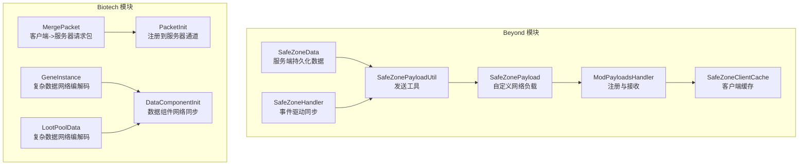
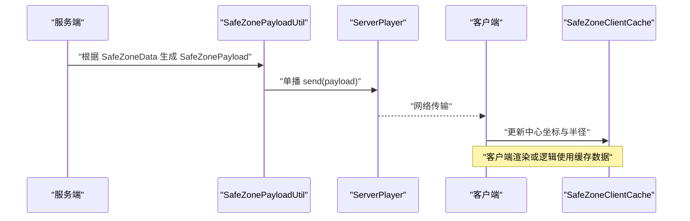
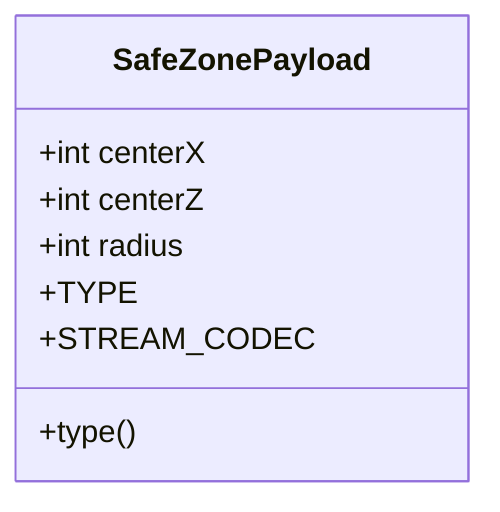
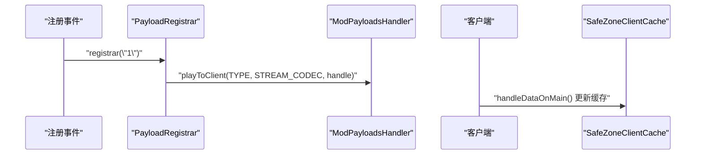
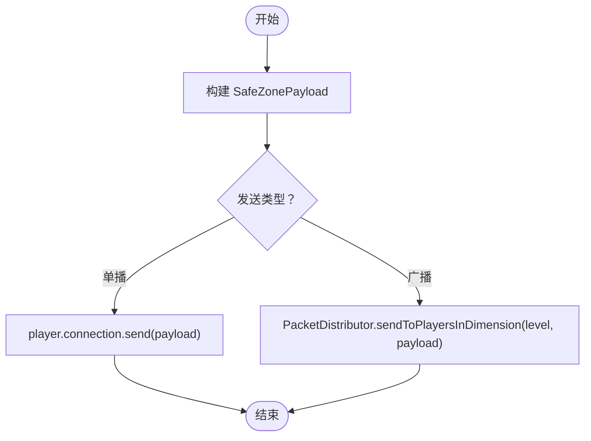
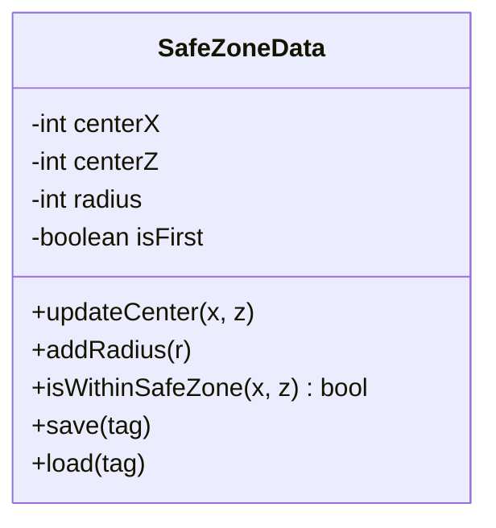
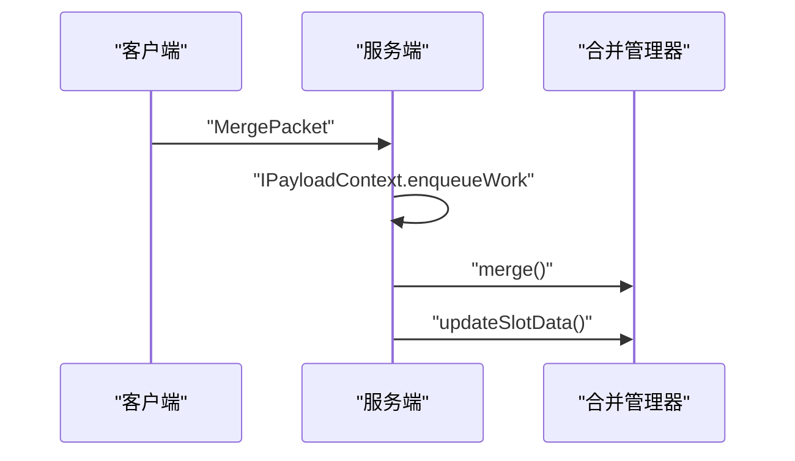
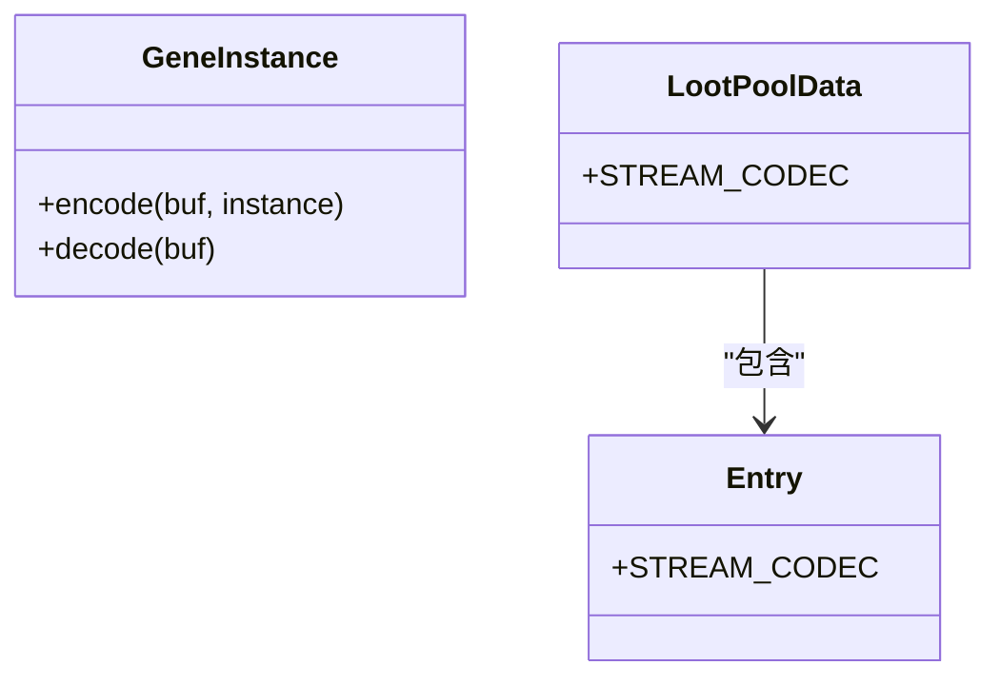
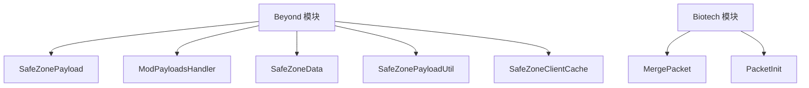

# 网络包扩展开发

<cite>
**本文档引用的文件**
- [Beyond/src/main/java/com/pz/beyond/network/SafeZonePayload.java](file://Beyond/src/main/java/com/pz/beyond/network/SafeZonePayload.java)
- [Beyond/src/main/java/com/pz/beyond/event/ModPayloadsHandler.java](file://Beyond/src/main/java/com/pz/beyond/event/ModPayloadsHandler.java)
- [Beyond/src/main/java/com/pz/beyond/util/SafeZonePayloadUtil.java](file://Beyond/src/main/java/com/pz/beyond/util/SafeZonePayloadUtil.java)
- [Beyond/src/main/java/com/pz/beyond/data/SafeZoneData.java](file://Beyond/src/main/java/com/pz/beyond/data/SafeZoneData.java)
- [Beyond/src/main/java/com/pz/beyond/data/SafeZoneClientCache.java](file://Beyond/src/main/java/com/pz/beyond/data/SafeZoneClientCache.java)
- [Beyond/src/main/java/com/pz/beyond/Beyond.java](file://Beyond/src/main/java/com/pz/beyond/Beyond.java)
- [Biotech/src/main/java/org/biotech/network/MergePacket.java](file://Biotech/src/main/java/org/biotech/network/MergePacket.java)
- [Biotech/src/main/java/org/biotech/api/init/PacketInit.java](file://Biotech/src/main/java/org/biotech/api/init/PacketInit.java)
- [Biotech/src/main/java/org/biotech/Biotech.java](file://Biotech/src/main/java/org/biotech/Biotech.java)
- [Biotech/src/main/java/org/biotech/api/system/gene/GeneInstance.java](file://Biotech/src/main/java/org/biotech/api/system/gene/GeneInstance.java)
- [Biotech/src/main/java/org/biotech/api/system/loot/data/LootPoolData.java](file://Biotech/src/main/java/org/biotech/api/system/loot/data/LootPoolData.java)
- [Biotech/src/main/java/org/biotech/api/init/DataComponentInit.java](file://Biotech/src/main/java/org/biotech/api/init/DataComponentInit.java)
- [Beyond/src/main/java/com/pz/beyond/event/SafeZoneHandler.java](file://Beyond/src/main/java/com/pz/beyond/event/SafeZoneHandler.java)
</cite>

## 目录
1. [简介](#简介)
2. [项目结构](#项目结构)
3. [核心组件](#核心组件)
4. [架构总览](#架构总览)
5. [详细组件分析](#详细组件分析)
6. [依赖关系分析](#依赖关系分析)
7. [性能考量](#性能考量)
8. [故障排除指南](#故障排除指南)
9. [结论](#结论)
10. [附录](#附录)

## 简介
本指南面向需要在客户端与服务器之间扩展自定义网络包的开发者，基于仓库中的现有实现，系统讲解如何实现自定义网络包以支持客户端-服务器通信。内容涵盖：
- 自定义网络负载接口 CustomPacketPayload 的实现方式
- 网络消息的序列化与反序列化（StreamCodec）
- 合并包与安全区包的实现模式
- 包类型定义、数据封装与接收处理流程
- 网络包注册机制、版本兼容性与错误处理
- 网络性能优化、数据压缩与安全最佳实践

## 项目结构
本仓库包含两个主要模块：Beyond 和 Biotech。两者均展示了现代 NeoForge 网络层的使用方式：
- Beyond 模块演示了自定义 CustomPacketPayload 的完整实现与客户端广播/单播发送
- Biotech 模块展示了客户端向服务器发送请求包的典型流程，并包含复杂数据类型的网络编解码示例

**图表来源**
- [Beyond/src/main/java/com/pz/beyond/network/SafeZonePayload.java:1-31](file://Beyond/src/main/java/com/pz/beyond/network/SafeZonePayload.java#L1-L31)
- [Beyond/src/main/java/com/pz/beyond/event/ModPayloadsHandler.java:1-34](file://Beyond/src/main/java/com/pz/beyond/event/ModPayloadsHandler.java#L1-L34)
- [Beyond/src/main/java/com/pz/beyond/util/SafeZonePayloadUtil.java:1-32](file://Beyond/src/main/java/com/pz/beyond/util/SafeZonePayloadUtil.java#L1-L32)
- [Beyond/src/main/java/com/pz/beyond/data/SafeZoneData.java:1-101](file://Beyond/src/main/java/com/pz/beyond/data/SafeZoneData.java#L1-L101)
- [Beyond/src/main/java/com/pz/beyond/data/SafeZoneClientCache.java:1-30](file://Beyond/src/main/java/com/pz/beyond/data/SafeZoneClientCache.java#L1-L30)
- [Beyond/src/main/java/com/pz/beyond/event/SafeZoneHandler.java:1-77](file://Beyond/src/main/java/com/pz/beyond/event/SafeZoneHandler.java#L1-L77)
- [Biotech/src/main/java/org/biotech/network/MergePacket.java:1-35](file://Biotech/src/main/java/org/biotech/network/MergePacket.java#L1-L35)
- [Biotech/src/main/java/org/biotech/api/init/PacketInit.java:1-19](file://Biotech/src/main/java/org/biotech/api/init/PacketInit.java#L1-L19)
- [Biotech/src/main/java/org/biotech/api/system/gene/GeneInstance.java:35-64](file://Biotech/src/main/java/org/biotech/api/system/gene/GeneInstance.java#L35-L64)
- [Biotech/src/main/java/org/biotech/api/system/loot/data/LootPoolData.java:1-80](file://Biotech/src/main/java/org/biotech/api/system/loot/data/LootPoolData.java#L1-L80)
- [Biotech/src/main/java/org/biotech/api/init/DataComponentInit.java:35-46](file://Biotech/src/main/java/org/biotech/api/init/DataComponentInit.java#L35-L46)

**章节来源**
- [Beyond/src/main/java/com/pz/beyond/network/SafeZonePayload.java:1-31](file://Beyond/src/main/java/com/pz/beyond/network/SafeZonePayload.java#L1-L31)
- [Biotech/src/main/java/org/biotech/network/MergePacket.java:1-35](file://Biotech/src/main/java/org/biotech/network/MergePacket.java#L1-L35)

## 核心组件
本节聚焦于网络包开发的关键构件与职责划分：

- 自定义网络负载（CustomPacketPayload）
  - 在 Beyond 中，SafeZonePayload 作为记录类实现了 CustomPacketPayload，包含 TYPE、STREAM_CODEC 以及必要的字段访问器
  - 在 Biotech 中，MergePacket 也实现了 CustomPacketPayload，但采用无参构造并通过 StreamCodec.unit 表示“零负载”请求包

- 网络注册与接收（PayloadRegistrar）
  - Beyond 通过 ModPayloadsHandler 在注册事件中将 playToClient 通道绑定到 SafeZonePayload 的 TYPE、STREAM_CODEC 与客户端处理函数
  - Biotech 通过 PacketInit 将 playToServer 通道绑定到 MergePacket 的 TYPE、STREAM_CODEC 与服务端处理函数

- 数据封装与发送（PacketDistributor 与 ServerPlayer.connection）
  - SafeZonePayloadUtil 提供两种发送方式：单播给指定玩家与广播到维度内所有玩家
  - SafeZoneData 在变更时调用工具类进行广播，确保状态一致性

- 客户端缓存与渲染（SafeZoneClientCache）
  - 客户端接收到包后更新 SafeZoneClientCache，供渲染或逻辑使用

- 复杂数据类型网络编解码（Biotech 示例）
  - GeneInstance 展示了如何为可空字段与复合结构编写 StreamCodec 编解码
  - LootPoolData 展示了嵌套结构与资源定位符在网络中的序列化

**章节来源**
- [Beyond/src/main/java/com/pz/beyond/network/SafeZonePayload.java:10-30](file://Beyond/src/main/java/com/pz/beyond/network/SafeZonePayload.java#L10-L30)
- [Beyond/src/main/java/com/pz/beyond/event/ModPayloadsHandler.java:14-23](file://Beyond/src/main/java/com/pz/beyond/event/ModPayloadsHandler.java#L14-L23)
- [Beyond/src/main/java/com/pz/beyond/util/SafeZonePayloadUtil.java:16-30](file://Beyond/src/main/java/com/pz/beyond/util/SafeZonePayloadUtil.java#L16-L30)
- [Beyond/src/main/java/com/pz/beyond/data/SafeZoneData.java:60-79](file://Beyond/src/main/java/com/pz/beyond/data/SafeZoneData.java#L60-L79)
- [Beyond/src/main/java/com/pz/beyond/data/SafeZoneClientCache.java:12-28](file://Beyond/src/main/java/com/pz/beyond/data/SafeZoneClientCache.java#L12-L28)
- [Biotech/src/main/java/org/biotech/network/MergePacket.java:13-34](file://Biotech/src/main/java/org/biotech/network/MergePacket.java#L13-L34)
- [Biotech/src/main/java/org/biotech/api/init/PacketInit.java:12-17](file://Biotech/src/main/java/org/biotech/api/init/PacketInit.java#L12-L17)
- [Biotech/src/main/java/org/biotech/api/system/gene/GeneInstance.java:54-64](file://Biotech/src/main/java/org/biotech/api/system/gene/GeneInstance.java#L54-L64)
- [Biotech/src/main/java/org/biotech/api/system/loot/data/LootPoolData.java:70-78](file://Biotech/src/main/java/org/biotech/api/system/loot/data/LootPoolData.java#L70-L78)

## 架构总览
下图展示了从服务端数据变更到客户端渲染的整体流程，以及双向通信的注册与处理路径。

**图表来源**
- [Beyond/src/main/java/com/pz/beyond/util/SafeZonePayloadUtil.java:16-19](file://Beyond/src/main/java/com/pz/beyond/util/SafeZonePayloadUtil.java#L16-L19)
- [Beyond/src/main/java/com/pz/beyond/data/SafeZoneData.java:60-79](file://Beyond/src/main/java/com/pz/beyond/data/SafeZoneData.java#L60-L79)
- [Beyond/src/main/java/com/pz/beyond/data/SafeZoneClientCache.java:12-16](file://Beyond/src/main/java/com/pz/beyond/data/SafeZoneClientCache.java#L12-L16)

## 详细组件分析

### SafeZonePayload（安全区网络负载）
SafeZonePayload 是一个典型的 CustomPacketPayload 实现，用于在客户端与服务端之间传递安全区的几何信息。其核心要点：
- 类型标识 TYPE 使用 ResourceLocation，确保唯一性
- STREAM_CODEC 使用 composite 方式对字段进行序列化与反序列化
- 该包属于 playToClient 通道，由 ModPayloadsHandler 注册

**图表来源**
- [Beyond/src/main/java/com/pz/beyond/network/SafeZonePayload.java:10-30](file://Beyond/src/main/java/com/pz/beyond/network/SafeZonePayload.java#L10-L30)

**章节来源**
- [Beyond/src/main/java/com/pz/beyond/network/SafeZonePayload.java:10-30](file://Beyond/src/main/java/com/pz/beyond/network/SafeZonePayload.java#L10-L30)

### ModPayloadsHandler（安全区包注册与接收）
该处理器负责在注册事件中将安全区包注册到 playToClient 通道，并在客户端主线程中更新缓存。关键点：
- 使用 registrar("1") 设置网络协议版本
- 将 TYPE、STREAM_CODEC 与客户端处理函数绑定
- 客户端处理函数通过 context.enqueueWork 将工作放入主线程队列

**图表来源**
- [Beyond/src/main/java/com/pz/beyond/event/ModPayloadsHandler.java:14-23](file://Beyond/src/main/java/com/pz/beyond/event/ModPayloadsHandler.java#L14-L23)
- [Beyond/src/main/java/com/pz/beyond/data/SafeZoneClientCache.java:12-16](file://Beyond/src/main/java/com/pz/beyond/data/SafeZoneClientCache.java#L12-L16)

**章节来源**
- [Beyond/src/main/java/com/pz/beyond/event/ModPayloadsHandler.java:14-34](file://Beyond/src/main/java/com/pz/beyond/event/ModPayloadsHandler.java#L14-L34)

### SafeZonePayloadUtil（安全区包发送工具）
该工具类提供两类发送方式：
- 单播：针对特定 ServerPlayer 发送
- 广播：针对当前维度的所有在线玩家广播

**图表来源**
- [Beyond/src/main/java/com/pz/beyond/util/SafeZonePayloadUtil.java:16-30](file://Beyond/src/main/java/com/pz/beyond/util/SafeZonePayloadUtil.java#L16-L30)

**章节来源**
- [Beyond/src/main/java/com/pz/beyond/util/SafeZonePayloadUtil.java:1-32](file://Beyond/src/main/java/com/pz/beyond/util/SafeZonePayloadUtil.java#L1-L32)

### SafeZoneData（服务端持久化数据）
SafeZoneData 负责存储安全区的几何参数与初始化标记，并在数据变更时触发广播。其方法包括：
- 更新中心坐标并广播
- 扩展半径并广播
- NBT 序列化与反序列化

**图表来源**
- [Beyond/src/main/java/com/pz/beyond/data/SafeZoneData.java:16-46](file://Beyond/src/main/java/com/pz/beyond/data/SafeZoneData.java#L16-L46)

**章节来源**
- [Beyond/src/main/java/com/pz/beyond/data/SafeZoneData.java:16-101](file://Beyond/src/main/java/com/pz/beyond/data/SafeZoneData.java#L16-L101)

### MergePacket（合并请求包）
MergePacket 展示了客户端向服务器发送请求包的典型模式：
- 无负载的请求包（使用 StreamCodec.unit）
- 通过 PacketInit 注册到 playToServer 通道
- 服务端在 IPayloadContext 上下文中执行业务逻辑

**图表来源**
- [Biotech/src/main/java/org/biotech/network/MergePacket.java:23-33](file://Biotech/src/main/java/org/biotech/network/MergePacket.java#L23-L33)
- [Biotech/src/main/java/org/biotech/api/init/PacketInit.java:12-17](file://Biotech/src/main/java/org/biotech/api/init/PacketInit.java#L12-L17)

**章节来源**
- [Biotech/src/main/java/org/biotech/network/MergePacket.java:13-35](file://Biotech/src/main/java/org/biotech/network/MergePacket.java#L13-L35)
- [Biotech/src/main/java/org/biotech/api/init/PacketInit.java:10-18](file://Biotech/src/main/java/org/biotech/api/init/PacketInit.java#L10-L18)

### 复杂数据类型网络编解码（GeneInstance 与 LootPoolData）
这两个示例展示了如何为复杂数据结构编写高效的网络编解码：
- GeneInstance：支持可空字段与变长整数，使用自定义 StreamCodec.encode/decode
- LootPoolData：嵌套结构与资源定位符的组合，使用 composite 编解码

**图表来源**
- [Biotech/src/main/java/org/biotech/api/system/gene/GeneInstance.java:54-64](file://Biotech/src/main/java/org/biotech/api/system/gene/GeneInstance.java#L54-L64)
- [Biotech/src/main/java/org/biotech/api/system/loot/data/LootPoolData.java:70-78](file://Biotech/src/main/java/org/biotech/api/system/loot/data/LootPoolData.java#L70-L78)

**章节来源**
- [Biotech/src/main/java/org/biotech/api/system/gene/GeneInstance.java:35-64](file://Biotech/src/main/java/org/biotech/api/system/gene/GeneInstance.java#L35-L64)
- [Biotech/src/main/java/org/biotech/api/system/loot/data/LootPoolData.java:1-80](file://Biotech/src/main/java/org/biotech/api/system/loot/data/LootPoolData.java#L1-L80)

## 依赖关系分析
下图展示了模块间与网络层的关键依赖关系：

**图表来源**
- [Beyond/src/main/java/com/pz/beyond/network/SafeZonePayload.java:1-31](file://Beyond/src/main/java/com/pz/beyond/network/SafeZonePayload.java#L1-L31)
- [Beyond/src/main/java/com/pz/beyond/event/ModPayloadsHandler.java:1-34](file://Beyond/src/main/java/com/pz/beyond/event/ModPayloadsHandler.java#L1-L34)
- [Beyond/src/main/java/com/pz/beyond/util/SafeZonePayloadUtil.java:1-32](file://Beyond/src/main/java/com/pz/beyond/util/SafeZonePayloadUtil.java#L1-L32)
- [Beyond/src/main/java/com/pz/beyond/data/SafeZoneData.java:1-101](file://Beyond/src/main/java/com/pz/beyond/data/SafeZoneData.java#L1-L101)
- [Beyond/src/main/java/com/pz/beyond/data/SafeZoneClientCache.java:1-30](file://Beyond/src/main/java/com/pz/beyond/data/SafeZoneClientCache.java#L1-L30)
- [Biotech/src/main/java/org/biotech/network/MergePacket.java:1-35](file://Biotech/src/main/java/org/biotech/network/MergePacket.java#L1-L35)
- [Biotech/src/main/java/org/biotech/api/init/PacketInit.java:1-19](file://Biotech/src/main/java/org/biotech/api/init/PacketInit.java#L1-L19)

**章节来源**
- [Beyond/src/main/java/com/pz/beyond/Beyond.java:46-60](file://Beyond/src/main/java/com/pz/beyond/Beyond.java#L46-L60)
- [Biotech/src/main/java/org/biotech/Biotech.java:23-39](file://Biotech/src/main/java/org/biotech/Biotech.java#L23-L39)

## 性能考量
- 选择合适的字段类型与编码方式
  - 使用 VAR_INT/VAR_LONG 代替固定长度整数以节省带宽
  - 对布尔值与小范围枚举使用紧凑编码
- 减少不必要的包体大小
  - 仅传输变化的数据（如只传输键集合，数据从服务端重载）
  - 使用 composite 编解码减少样板代码与解析开销
- 广播策略
  - 避免每帧广播高频状态；采用增量更新或阈值触发
  - 使用维度级广播而非逐玩家发送
- 数据组件网络同步
  - 利用数据组件的 persistent 与 networkSynchronized 配置，按需同步
- 压缩与分片
  - 对超大数据包考虑启用压缩（例如 zlib/snappy），并在客户端/服务端统一处理
  - 对超大数组采用分片传输并合并
- 主线程与异步处理
  - 在 IPayloadContext 上使用 enqueueWork 将耗时操作移出网络线程
  - 对渲染或 UI 更新使用主线程回调

## 故障排除指南
- 版本不匹配导致的包丢失
  - 确保双方使用相同的版本字符串（Registrar 使用的版本号）
  - 若需要协议升级，采用向后兼容策略或迁移脚本
- 包未到达客户端
  - 检查 TYPE 是否正确注册到 playToClient 通道
  - 确认客户端已订阅对应类型
- 客户端未更新缓存
  - 检查客户端处理函数是否正确调用 enqueueWork
  - 确认 SafeZoneClientCache 的更新逻辑
- 复杂数据编解码失败
  - 核对 StreamCodec 的字段顺序与类型是否与编码一致
  - 对可空字段增加判空与默认值处理
- 性能问题
  - 分析广播频率与包体大小，必要时引入差分更新
  - 使用计时器与日志定位高开销操作

**章节来源**
- [Beyond/src/main/java/com/pz/beyond/event/ModPayloadsHandler.java:14-23](file://Beyond/src/main/java/com/pz/beyond/event/ModPayloadsHandler.java#L14-L23)
- [Beyond/src/main/java/com/pz/beyond/data/SafeZoneClientCache.java:12-16](file://Beyond/src/main/java/com/pz/beyond/data/SafeZoneClientCache.java#L12-L16)
- [Biotech/src/main/java/org/biotech/api/system/gene/GeneInstance.java:54-64](file://Biotech/src/main/java/org/biotech/api/system/gene/GeneInstance.java#L54-L64)

## 结论
通过以上示例，可以总结出一套可靠的网络包扩展开发流程：
- 明确包类型与用途，选择合适的 CustomPacketPayload 实现
- 使用 StreamCodec 编写高效且可维护的序列化逻辑
- 在注册事件中正确绑定通道与处理函数，并设置版本号
- 采用工具类封装发送逻辑，区分单播与广播场景
- 对复杂数据结构提供稳定的编解码方案
- 关注性能与安全，合理使用压缩、分片与权限校验

## 附录
- 版本兼容性建议
  - 使用字符串版本号（如 "1"）在注册时声明
  - 新增字段时保持向后兼容，旧客户端忽略未知字段
- 错误处理建议
  - 在处理函数中捕获异常并记录日志
  - 对非法输入进行快速拒绝，避免无效广播
- 安全考虑
  - 对客户端输入进行严格校验
  - 限制请求频率与批量大小，防止滥用
  - 对敏感数据进行最小化传输与加密（如需要）