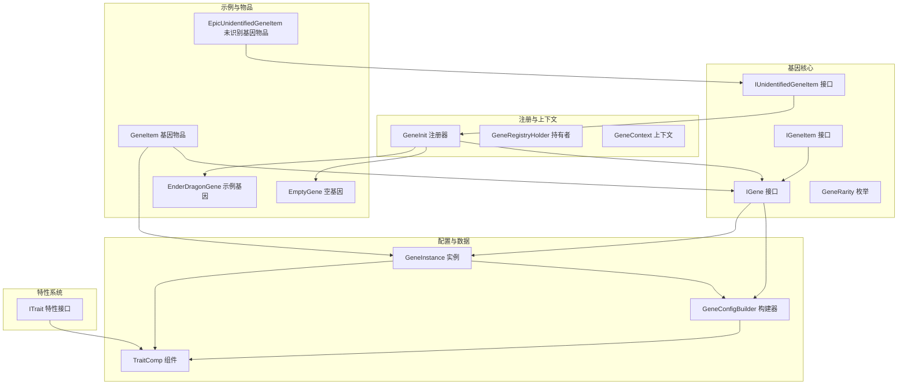
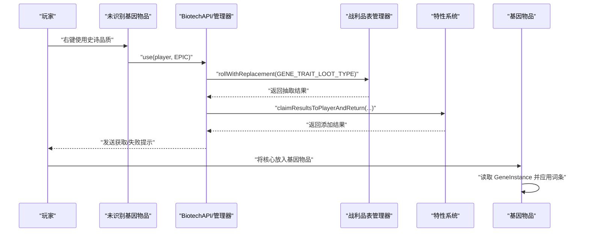
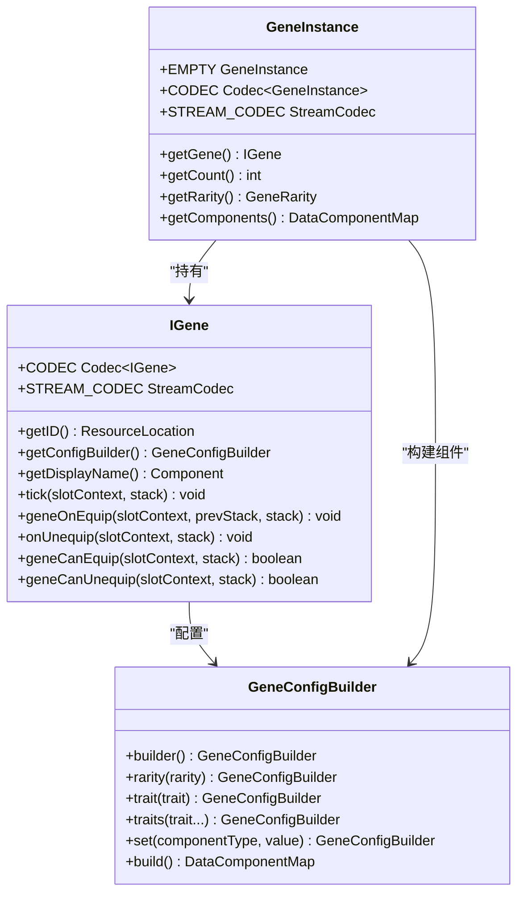
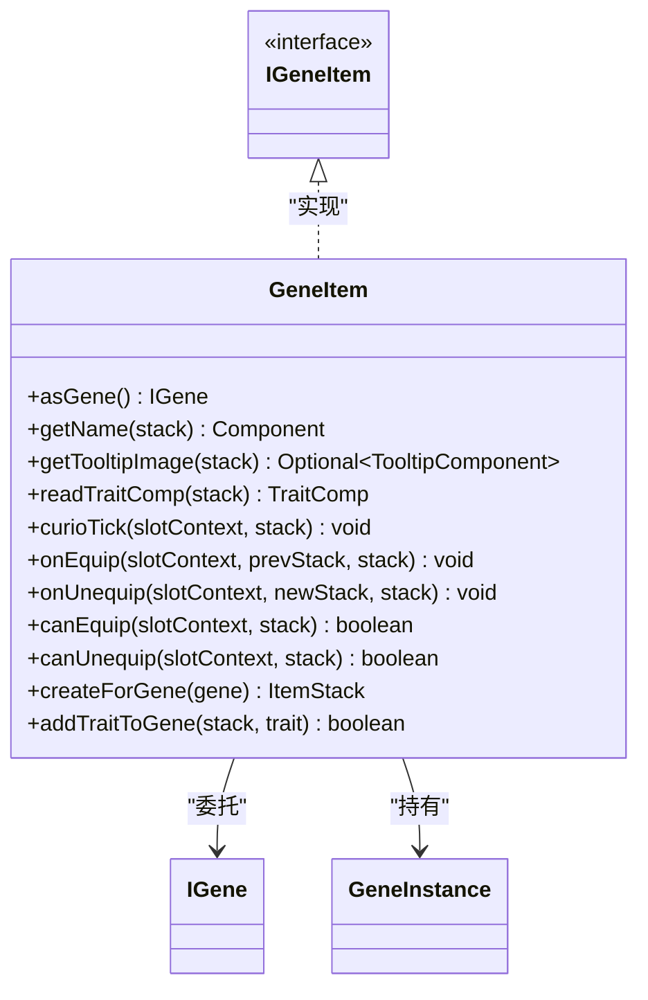
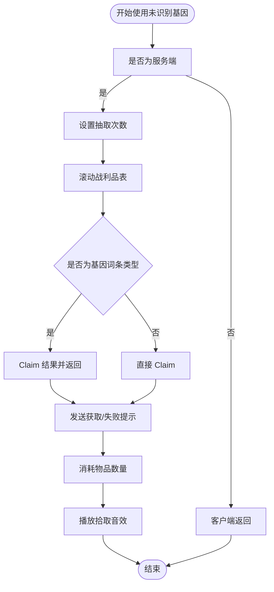
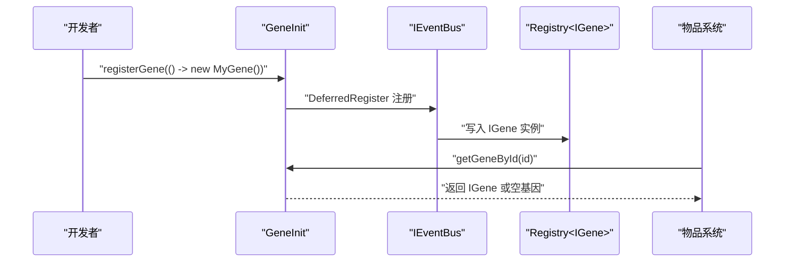
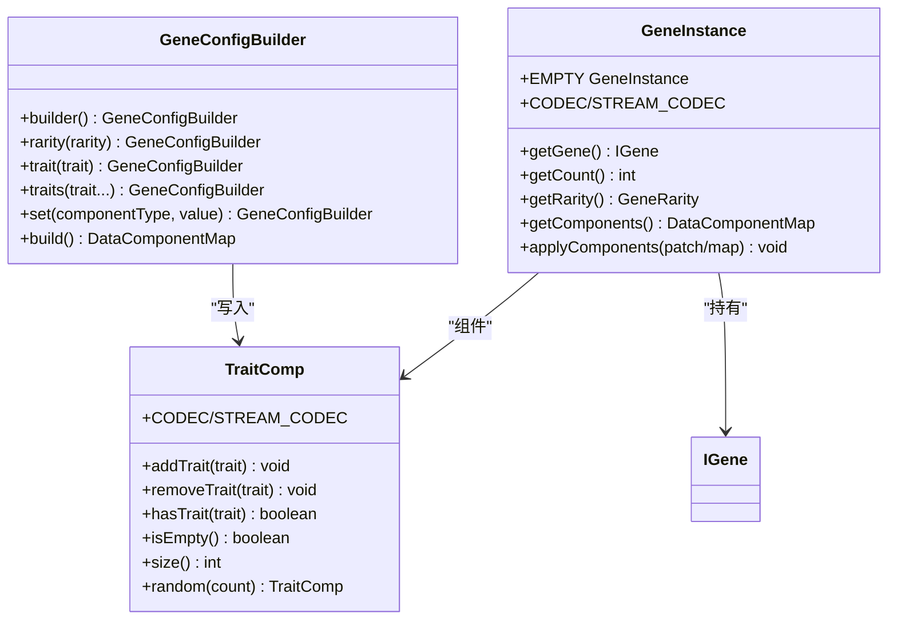
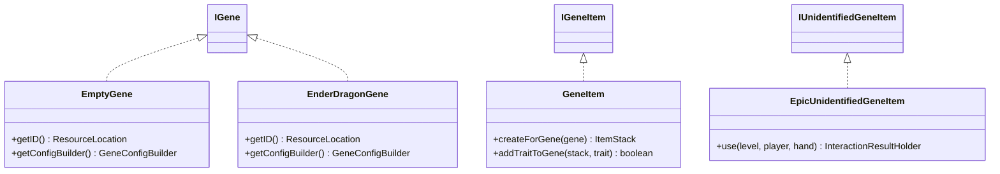
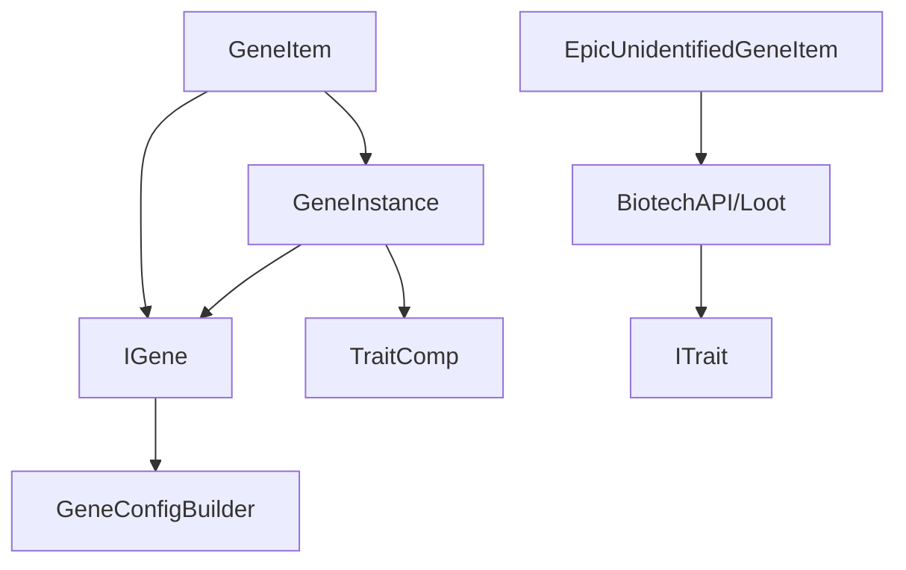

# 自定义基因类型开发

<cite>
**本文档引用的文件**
- [IGene.java](file://Biotech/src/main/java/org/biotech/api/system/gene/core/IGene.java)
- [IGeneItem.java](file://Biotech/src/main/java/org/biotech/api/system/gene/core/IGeneItem.java)
- [IUnidentifiedGeneItem.java](file://Biotech/src/main/java/org/biotech/api/system/gene/core/IUnidentifiedGeneItem.java)
- [GeneConfigBuilder.java](file://Biotech/src/main/java/org/biotech/api/system/gene/GeneConfigBuilder.java)
- [GeneContext.java](file://Biotech/src/main/java/org/biotech/api/system/gene/GeneContext.java)
- [GeneInstance.java](file://Biotech/src/main/java/org/biotech/api/system/gene/GeneInstance.java)
- [GeneRegistryHolder.java](file://Biotech/src/main/java/org/biotech/api/system/gene/GeneRegistryHolder.java)
- [GeneRarity.java](file://Biotech/src/main/java/org/biotech/api/system/gene/core/GeneRarity.java)
- [GeneInit.java](file://Biotech/src/main/java/org/biotech/api/init/GeneInit.java)
- [EmptyGene.java](file://Biotech/src/main/java/org/biotech/gene/EmptyGene.java)
- [EnderDragonGene.java](file://Biotech/src/main/java/org/biotech/gene/EnderDragonGene.java)
- [GeneItem.java](file://Biotech/src/main/java/org/biotech/item/GeneItem.java)
- [EpicUnidentifiedGeneItem.java](file://Biotech/src/main/java/org/biotech/item/EpicUnidentifiedGeneItem.java)
- [ITrait.java](file://Biotech/src/main/java/org/biotech/api/system/trait/core/ITrait.java)
- [TraitComp.java](file://Biotech/src/main/java/org/biotech/component/TraitComp.java)
</cite>

## 目录
1. [简介](#简介)
2. [项目结构](#项目结构)
3. [核心组件](#核心组件)
4. [架构总览](#架构总览)
5. [详细组件分析](#详细组件分析)
6. [依赖关系分析](#依赖关系分析)
7. [性能考虑](#性能考虑)
8. [故障排除指南](#故障排除指南)
9. [结论](#结论)
10. [附录](#附录)

## 简介
本指南面向希望在 Biotech 基因系统中创建自定义基因类型的开发者。文档将详细说明如何实现 IGene 接口以创建新的基因类型，涵盖基因属性定义、效果实现与数据存储；解释 IGeneItem 与 IUnidentifiedGeneItem 接口的实现方法，展示如何创建对应的物品系统；提供完整的开发示例，包括基因数据结构、物品模型与标签定义；说明基因注册机制、配置构建器的使用以及基因上下文的处理；最后总结基因特性的实现模式与最佳实践。

## 项目结构
Biotech 模块提供了完整的基因系统基础设施，包括：
- 基因核心接口与实现：IGene、IGeneItem、IUnidentifiedGeneItem
- 配置与数据：GeneConfigBuilder、GeneInstance、TraitComp
- 注册与上下文：GeneInit、GeneRegistryHolder、GeneContext
- 示例与物品：EmptyGene、EnderDragonGene、GeneItem、EpicUnidentifiedGeneItem
- 特性系统：ITrait、TraitComp

**图表来源**
- [IGene.java:15-91](file://Biotech/src/main/java/org/biotech/api/system/gene/core/IGene.java#L15-L91)
- [IGeneItem.java:5-7](file://Biotech/src/main/java/org/biotech/api/system/gene/core/IGeneItem.java#L5-L7)
- [IUnidentifiedGeneItem.java:23-138](file://Biotech/src/main/java/org/biotech/api/system/gene/core/IUnidentifiedGeneItem.java#L23-L138)
- [GeneConfigBuilder.java:17-109](file://Biotech/src/main/java/org/biotech/api/system/gene/GeneConfigBuilder.java#L17-L109)
- [GeneInstance.java:19-119](file://Biotech/src/main/java/org/biotech/api/system/gene/GeneInstance.java#L19-L119)
- [TraitComp.java:18-102](file://Biotech/src/main/java/org/biotech/component/TraitComp.java#L18-L102)
- [GeneInit.java:21-107](file://Biotech/src/main/java/org/biotech/api/init/GeneInit.java#L21-L107)
- [EmptyGene.java:22-38](file://Biotech/src/main/java/org/biotech/gene/EmptyGene.java#L22-L38)
- [EnderDragonGene.java:12-25](file://Biotech/src/main/java/org/biotech/gene/EnderDragonGene.java#L12-L25)
- [GeneItem.java:31-209](file://Biotech/src/main/java/org/biotech/item/GeneItem.java#L31-L209)
- [EpicUnidentifiedGeneItem.java:15-31](file://Biotech/src/main/java/org/biotech/item/EpicUnidentifiedGeneItem.java#L15-L31)
- [ITrait.java:18-108](file://Biotech/src/main/java/org/biotech/api/system/trait/core/ITrait.java#L18-L108)

**章节来源**
- [GeneInit.java:21-107](file://Biotech/src/main/java/org/biotech/api/init/GeneInit.java#L21-L107)
- [IGene.java:15-91](file://Biotech/src/main/java/org/biotech/api/system/gene/core/IGene.java#L15-L91)

## 核心组件
本节概述关键组件及其职责：
- IGene：基因行为契约，继承 Curios ICurioItem，提供 tick、装备/卸下回调、可装备性判断等默认实现，并内置序列化编解码器。
- IGeneItem：基因物品接口，扩展 IGeneLike 与 ICurioItem，作为可装备的基因物品。
- IUnidentifiedGeneItem：未识别基因物品接口，提供抽取词条的核心交互流程与提示消息。
- GeneConfigBuilder：基于数据组件的基因配置构建器，支持设置稀有度、添加/覆盖词条、设置自定义组件。
- GeneInstance：基因实例，封装 IGene、计数与数据组件补丁，提供序列化与网络编解码。
- TraitComp：多词条组件，支持添加、去重、随机生成词条，提供序列化编解码。
- GeneInit：基因注册器，负责注册基因、自动发现与检索基因、提供空基因占位。
- GeneRegistryHolder：为外部（如武器、生物）提供基因实例持有者。
- GeneContext：基因操作上下文，封装玩家信息。
- EmptyGene：空基因实现，仅作为词条容器，不执行任何基因逻辑。
- EnderDragonGene：示例基因实现，演示 @AutoInit 注解与稀有度配置。
- GeneItem：局内可装备的基因物品，桥接 IGene 与 Curios 装备生命周期。
- EpicUnidentifiedGeneItem：史诗品质未识别基因物品，提供抽取词条的交互。

**章节来源**
- [IGene.java:15-91](file://Biotech/src/main/java/org/biotech/api/system/gene/core/IGene.java#L15-L91)
- [IGeneItem.java:5-7](file://Biotech/src/main/java/org/biotech/api/system/gene/core/IGeneItem.java#L5-L7)
- [IUnidentifiedGeneItem.java:23-138](file://Biotech/src/main/java/org/biotech/api/system/gene/core/IUnidentifiedGeneItem.java#L23-L138)
- [GeneConfigBuilder.java:17-109](file://Biotech/src/main/java/org/biotech/api/system/gene/GeneConfigBuilder.java#L17-L109)
- [GeneInstance.java:19-119](file://Biotech/src/main/java/org/biotech/api/system/gene/GeneInstance.java#L19-L119)
- [TraitComp.java:18-102](file://Biotech/src/main/java/org/biotech/component/TraitComp.java#L18-L102)
- [GeneInit.java:21-107](file://Biotech/src/main/java/org/biotech/api/init/GeneInit.java#L21-L107)
- [GeneRegistryHolder.java:10-25](file://Biotech/src/main/java/org/biotech/api/system/gene/GeneRegistryHolder.java#L10-L25)
- [GeneContext.java:11-12](file://Biotech/src/main/java/org/biotech/api/system/gene/GeneContext.java#L11-L12)
- [EmptyGene.java:22-38](file://Biotech/src/main/java/org/biotech/gene/EmptyGene.java#L22-L38)
- [EnderDragonGene.java:12-25](file://Biotech/src/main/java/org/biotech/gene/EnderDragonGene.java#L12-L25)
- [GeneItem.java:31-209](file://Biotech/src/main/java/org/biotech/item/GeneItem.java#L31-L209)
- [EpicUnidentifiedGeneItem.java:15-31](file://Biotech/src/main/java/org/biotech/item/EpicUnidentifiedGeneItem.java#L15-L31)

## 架构总览
下图展示了基因系统的核心交互：物品层（GeneItem、未识别基因物品）与基因层（IGene、GeneInstance）通过数据组件连接；注册器负责基因发现与注册；特性系统通过 TraitComp 为基因提供词条增强。

**图表来源**
- [IUnidentifiedGeneItem.java:30-46](file://Biotech/src/main/java/org/biotech/api/system/gene/core/IUnidentifiedGeneItem.java#L30-L46)
- [ITrait.java:18-108](file://Biotech/src/main/java/org/biotech/api/system/trait/core/ITrait.java#L18-L108)
- [GeneItem.java:178-206](file://Biotech/src/main/java/org/biotech/item/GeneItem.java#L178-L206)

## 详细组件分析

### IGene 接口实现指南
- 基本要求
  - 提供唯一 ResourceLocation ID，用于注册与序列化。
  - 提供 GeneConfigBuilder，用于配置稀有度与词条等。
- 生命周期钩子
  - tick：每刻调用，适合持续效果。
  - geneOnEquip / onUnequip：装备/卸下时触发。
  - geneCanEquip / geneCanUnequip：决定是否可装备/卸下。
- 序列化与网络
  - IGene 内置 Codec 与 StreamCodec，通过 ResourceLocation 进行序列化与网络传输。
- 最佳实践
  - 将稀有度与词条通过 GeneConfigBuilder 统一配置。
  - 在 tick 中避免重型计算，必要时使用条件判断。
  - 对于空逻辑的基因，可参考 EmptyGene 的空实现思路。

**图表来源**
- [IGene.java:15-91](file://Biotech/src/main/java/org/biotech/api/system/gene/core/IGene.java#L15-L91)
- [GeneConfigBuilder.java:17-109](file://Biotech/src/main/java/org/biotech/api/system/gene/GeneConfigBuilder.java#L17-L109)
- [GeneInstance.java:19-119](file://Biotech/src/main/java/org/biotech/api/system/gene/GeneInstance.java#L19-L119)

**章节来源**
- [IGene.java:15-91](file://Biotech/src/main/java/org/biotech/api/system/gene/core/IGene.java#L15-L91)
- [GeneConfigBuilder.java:17-109](file://Biotech/src/main/java/org/biotech/api/system/gene/GeneConfigBuilder.java#L17-L109)
- [GeneInstance.java:19-119](file://Biotech/src/main/java/org/biotech/api/system/gene/GeneInstance.java#L19-L119)

### IGeneItem 与 IUnidentifiedGeneItem 实现指南

#### IGeneItem 实现要点
- 继承 IGeneItem<T extends ICurioItem>，确保与 Curios 的 ICurioItem 协同。
- 通过数据组件 DataComponentInit.GENE_INSTANCE 持有 GeneInstance。
- 在 curioTick、onEquip、onUnequip、canEquip、canUnequip 中转发到 IGene 实例。
- 提供工具方法：
  - createForGene：根据 IGene 创建带稀有度与词条的 ItemStack。
  - addTraitToGene：向 GeneItem 添加词条并更新组件。

**图表来源**
- [IGeneItem.java:5-7](file://Biotech/src/main/java/org/biotech/api/system/gene/core/IGeneItem.java#L5-L7)
- [GeneItem.java:31-209](file://Biotech/src/main/java/org/biotech/item/GeneItem.java#L31-L209)

**章节来源**
- [IGeneItem.java:5-7](file://Biotech/src/main/java/org/biotech/api/system/gene/core/IGeneItem.java#L5-L7)
- [GeneItem.java:31-209](file://Biotech/src/main/java/org/biotech/item/GeneItem.java#L31-L209)

#### IUnidentifiedGeneItem 实现要点
- use 方法族：提供按稀有度抽取词条的统一流程。
- use(player, rarity)：在服务端执行抽取，设置抽取次数，滚动战利品表，处理 Claim 结果并发送消息。
- use(level, player, hand)：客户端侧返回，调用上述服务端流程并播放音效。
- 工具方法：
  - getCountFromRarity：根据稀有度映射抽取次数。
  - getSoundPitchFromRarity / getRarityColor：根据稀有度设置音效与颜色。
  - sendGeneTraitObtainMessage：统一发送获取/失败提示。

**图表来源**
- [IUnidentifiedGeneItem.java:30-94](file://Biotech/src/main/java/org/biotech/api/system/gene/core/IUnidentifiedGeneItem.java#L30-L94)

**章节来源**
- [IUnidentifiedGeneItem.java:23-138](file://Biotech/src/main/java/org/biotech/api/system/gene/core/IUnidentifiedGeneItem.java#L23-L138)

### 基因注册机制与上下文
- 注册器 GeneInit
  - 定义 GENE_REGISTRY_KEY 与 Registry<IGene>。
  - 提供 register、registerGene、autoRegisterGenes 等注册方法。
  - 提供 getGeneById 搜索代码与数据包基因，回退至空基因。
- 空基因与占位
  - EMPTY_GENE 与 EMPTY 用于网络传输与空值安全。
- 上下文 GeneContext
  - 记录执行基因操作的玩家上下文，便于事件与 UI 使用。

**图表来源**
- [GeneInit.java:21-107](file://Biotech/src/main/java/org/biotech/api/init/GeneInit.java#L21-L107)

**章节来源**
- [GeneInit.java:21-107](file://Biotech/src/main/java/org/biotech/api/init/GeneInit.java#L21-L107)
- [GeneContext.java:11-12](file://Biotech/src/main/java/org/biotech/api/system/gene/GeneContext.java#L11-L12)

### 配置构建器与数据存储
- GeneConfigBuilder
  - 提供 rarity、trait、traits、set 等链式配置方法。
  - build 时校验必需组件（如稀有度），并将 TraitComp 写入数据组件。
- GeneInstance
  - 封装 IGene、count 与 DataComponentPatch。
  - 提供 CODEC 与 STREAM_CODEC，支持序列化与网络传输。
  - 通过 applyComponents 合并组件补丁，暴露 getComponents 读取。
- TraitComp
  - 列表式词条容器，支持去重、随机生成、序列化编解码。
  - 与 ITrait 协作，提供唯一 modifier id 生成。

**图表来源**
- [GeneConfigBuilder.java:17-109](file://Biotech/src/main/java/org/biotech/api/system/gene/GeneConfigBuilder.java#L17-L109)
- [GeneInstance.java:19-119](file://Biotech/src/main/java/org/biotech/api/system/gene/GeneInstance.java#L19-L119)
- [TraitComp.java:18-102](file://Biotech/src/main/java/org/biotech/component/TraitComp.java#L18-L102)

**章节来源**
- [GeneConfigBuilder.java:17-109](file://Biotech/src/main/java/org/biotech/api/system/gene/GeneConfigBuilder.java#L17-L109)
- [GeneInstance.java:19-119](file://Biotech/src/main/java/org/biotech/api/system/gene/GeneInstance.java#L19-L119)
- [TraitComp.java:18-102](file://Biotech/src/main/java/org/biotech/component/TraitComp.java#L18-L102)

### 示例：创建自定义基因类型
- 步骤
  - 实现 IGene，提供 ID 与 GeneConfigBuilder（建议使用 builder.rarity(...)）。
  - 如需自动注册，使用 @AutoInit(type = AutoInit.InitType.GENE) 注解。
  - 在物品层，使用 GeneItem.createForGene 或 addTraitToGene 为物品注入基因与词条。
  - 未识别基因物品可参考 EpicUnidentifiedGeneItem 的实现，提供 use(...) 交互。
- 参考实现
  - EmptyGene：空基因示例，仅承载词条。
  - EnderDragonGene：@AutoInit 示例，展示稀有度配置。
  - GeneItem：基因物品桥接 IGene 与 Curios 生命周期。
  - EpicUnidentifiedGeneItem：史诗品质未识别基因物品。

**图表来源**
- [EmptyGene.java:22-38](file://Biotech/src/main/java/org/biotech/gene/EmptyGene.java#L22-L38)
- [EnderDragonGene.java:12-25](file://Biotech/src/main/java/org/biotech/gene/EnderDragonGene.java#L12-L25)
- [GeneItem.java:157-206](file://Biotech/src/main/java/org/biotech/item/GeneItem.java#L157-L206)
- [EpicUnidentifiedGeneItem.java:15-31](file://Biotech/src/main/java/org/biotech/item/EpicUnidentifiedGeneItem.java#L15-L31)

**章节来源**
- [EmptyGene.java:22-38](file://Biotech/src/main/java/org/biotech/gene/EmptyGene.java#L22-L38)
- [EnderDragonGene.java:12-25](file://Biotech/src/main/java/org/biotech/gene/EnderDragonGene.java#L12-L25)
- [GeneItem.java:157-206](file://Biotech/src/main/java/org/biotech/item/GeneItem.java#L157-L206)
- [EpicUnidentifiedGeneItem.java:15-31](file://Biotech/src/main/java/org/biotech/item/EpicUnidentifiedGeneItem.java#L15-L31)

## 依赖关系分析
- 组件耦合
  - IGene 与 GeneConfigBuilder 强耦合，后者负责前者的数据配置。
  - GeneItem 依赖 IGene 与 GeneInstance，作为物品层与基因层的桥梁。
  - IUnidentifiedGeneItem 依赖 BiotechAPI/Loot 管理器与 ITrait 系统。
- 外部依赖
  - Curios API：IGene 继承 ICurioItem，依赖 SlotContext 与装备生命周期。
  - NeoForge 数据组件：通过 DataComponentMap/StreamCodec 实现序列化与网络同步。
- 循环依赖
  - 未发现循环依赖；注册器与物品系统通过接口解耦。

**图表来源**
- [IGene.java:15-91](file://Biotech/src/main/java/org/biotech/api/system/gene/core/IGene.java#L15-L91)
- [GeneConfigBuilder.java:17-109](file://Biotech/src/main/java/org/biotech/api/system/gene/GeneConfigBuilder.java#L17-L109)
- [GeneInstance.java:19-119](file://Biotech/src/main/java/org/biotech/api/system/gene/GeneInstance.java#L19-L119)
- [GeneItem.java:31-209](file://Biotech/src/main/java/org/biotech/item/GeneItem.java#L31-L209)
- [IUnidentifiedGeneItem.java:30-46](file://Biotech/src/main/java/org/biotech/api/system/gene/core/IUnidentifiedGeneItem.java#L30-L46)
- [ITrait.java:18-108](file://Biotech/src/main/java/org/biotech/api/system/trait/core/ITrait.java#L18-L108)

**章节来源**
- [IGene.java:15-91](file://Biotech/src/main/java/org/biotech/api/system/gene/core/IGene.java#L15-L91)
- [GeneItem.java:31-209](file://Biotech/src/main/java/org/biotech/item/GeneItem.java#L31-L209)
- [IUnidentifiedGeneItem.java:23-138](file://Biotech/src/main/java/org/biotech/api/system/gene/core/IUnidentifiedGeneItem.java#L23-L138)

## 性能考虑
- 序列化与网络
  - 使用 IGene/ITrait 的 StreamCodec 与 CODEC，减少自定义序列化开销。
  - GeneInstance 的 DataComponentPatch 仅传输变更，降低带宽。
- Tick 效率
  - 在 IGene.tick 中避免复杂逻辑，尽量使用条件短路与缓存。
- 组件访问
  - 通过 DataComponentMap/StreamCodec 访问组件，避免频繁反射。
- 抽取流程
  - IUnidentifiedGeneItem.use 在服务端执行，客户端仅做反馈，减少同步压力。

## 故障排除指南
- 稀有度缺失
  - 现象：构建 GeneConfigBuilder 时报错“必须设置稀有度”。
  - 处理：确保 builder.rarity(...) 被调用。
- 空基因实例
  - 现象：装备 GeneItem 时无效果或报空指针。
  - 处理：确保 GeneItem 持有的 GeneInstance 非空，必要时使用 GeneItem.createForGene。
- 抽取失败
  - 现象：使用未识别基因物品后提示“背包已满/无空间”。
  - 处理：检查玩家背包容量与 GeneInventoryManager.AddResult 原因映射。
- 自动注册未生效
  - 现象：@AutoInit 注解未注册新基因。
  - 处理：确认 ModPluginFinder 扫描路径与注解参数正确。

**章节来源**
- [GeneConfigBuilder.java:88-104](file://Biotech/src/main/java/org/biotech/api/system/gene/GeneConfigBuilder.java#L88-L104)
- [GeneItem.java:157-206](file://Biotech/src/main/java/org/biotech/item/GeneItem.java#L157-L206)
- [IUnidentifiedGeneItem.java:128-136](file://Biotech/src/main/java/org/biotech/api/system/gene/core/IUnidentifiedGeneItem.java#L128-L136)
- [GeneInit.java:72-80](file://Biotech/src/main/java/org/biotech/api/init/GeneInit.java#L72-L80)

## 结论
通过实现 IGene 接口并结合 GeneConfigBuilder、GeneInstance 与 TraitComp，开发者可以高效地创建具备稀有度与词条的自定义基因类型。IGeneItem 与 IUnidentifiedGeneItem 则分别承担了局内装备与抽取交互的职责。借助 GeneInit 的注册机制与 GeneContext 的上下文支持，基因系统在功能与可维护性上达到平衡。遵循本文的最佳实践，可确保新基因类型在性能与兼容性方面表现稳定。

## 附录
- 开发清单
  - 实现 IGene，提供 ID 与 GeneConfigBuilder。
  - 选择是否使用 @AutoInit 自动注册。
  - 在物品层使用 GeneItem.createForGene 或 addTraitToGene。
  - 为未识别基因物品实现 IUnidentifiedGeneItem 的 use(...) 流程。
  - 使用 GeneRarity 与 GeneConfigBuilder.rarity(...) 管理稀有度。
  - 通过 TraitComp 为基因添加/管理词条。
- 参考文件
  - [IGene.java:15-91](file://Biotech/src/main/java/org/biotech/api/system/gene/core/IGene.java#L15-L91)
  - [GeneConfigBuilder.java:17-109](file://Biotech/src/main/java/org/biotech/api/system/gene/GeneConfigBuilder.java#L17-L109)
  - [GeneInstance.java:19-119](file://Biotech/src/main/java/org/biotech/api/system/gene/GeneInstance.java#L19-L119)
  - [TraitComp.java:18-102](file://Biotech/src/main/java/org/biotech/component/TraitComp.java#L18-L102)
  - [GeneInit.java:21-107](file://Biotech/src/main/java/org/biotech/api/init/GeneInit.java#L21-L107)
  - [GeneItem.java:31-209](file://Biotech/src/main/java/org/biotech/item/GeneItem.java#L31-L209)
  - [IUnidentifiedGeneItem.java:23-138](file://Biotech/src/main/java/org/biotech/api/system/gene/core/IUnidentifiedGeneItem.java#L23-L138)
  - [ITrait.java:18-108](file://Biotech/src/main/java/org/biotech/api/system/trait/core/ITrait.java#L18-L108)
  - [EmptyGene.java:22-38](file://Biotech/src/main/java/org/biotech/gene/EmptyGene.java#L22-L38)
  - [EnderDragonGene.java:12-25](file://Biotech/src/main/java/org/biotech/gene/EnderDragonGene.java#L12-L25)
  - [EpicUnidentifiedGeneItem.java:15-31](file://Biotech/src/main/java/org/biotech/item/EpicUnidentifiedGeneItem.java#L15-L31)