# Beyond安全区模块

<cite>
**本文档引用的文件**
- [Beyond.java](file://Beyond/src/main/java/com/pz/beyond/Beyond.java)
- [Config.java](file://Beyond/src/main/java/com/pz/beyond/Config.java)
- [SafeZoneHandler.java](file://Beyond/src/main/java/com/pz/beyond/event/SafeZoneHandler.java)
- [PlayerStateHandler.java](file://Beyond/src/main/java/com/pz/beyond/event/PlayerStateHandler.java)
- [PlayerStateChangeEvent.java](file://Beyond/src/main/java/com/pz/beyond/event/custom/PlayerStateChangeEvent.java)
- [ModAttachments.java](file://Beyond/src/main/java/com/pz/beyond/registry/ModAttachments.java)
- [ModTags.java](file://Beyond/src/main/java/com/pz/beyond/registry/ModTags.java)
- [SafeZoneData.java](file://Beyond/src/main/java/com/pz/beyond/data/SafeZoneData.java)
- [PlayerStateData.java](file://Beyond/src/main/java/com/pz/beyond/data/PlayerStateData.java)
- [SafeZoneClientCache.java](file://Beyond/src/main/java/com/pz/beyond/data/SafeZoneClientCache.java)
- [ISafeZoneRuleListener.java](file://Beyond/src/main/java/com/pz/beyond/safeZoneRule/ISafeZoneRuleListener.java)
- [SafeZoneRule.java](file://Beyond/src/main/java/com/pz/beyond/safeZoneRule/SafeZoneRule.java)
- [Invincible.java](file://Beyond/src/main/java/com/pz/beyond/safeZoneRule/impl/Invincible.java)
- [AutoRegeneration.java](file://Beyond/src/main/java/com/pz/beyond/safeZoneRule/impl/AutoRegeneration.java)
- [NoEat.java](file://Beyond/src/main/java/com/pz/beyond/safeZoneRule/impl/NoEat.java)
- [NoMobSpawn.java](file://Beyond/src/main/java/com/pz/beyond/safeZoneRule/impl/NoMobSpawn.java)
- [SafeZonePayload.java](file://Beyond/src/main/java/com/pz/beyond/network/SafeZonePayload.java)
- [SafeZonePayloadUtil.java](file://Beyond/src/main/java/com/pz/beyond/util/SafeZonePayloadUtil.java)
- [SafeZoneRuleUtil.java](file://Beyond/src/main/java/com/pz/beyond/util/SafeZoneRuleUtil.java)
- [SafeZoneRenderer.java](file://Beyond/src/main/java/com/pz/beyond/renderer/SafeZoneRenderer.java)
- [README.md](file://Beyond/README.md)
</cite>

## 目录
1. [简介](#简介)
2. [项目结构](#项目结构)
3. [核心组件](#核心组件)
4. [架构总览](#架构总览)
5. [详细组件分析](#详细组件分析)
6. [依赖关系分析](#依赖关系分析)
7. [性能考虑](#性能考虑)
8. [故障排除指南](#故障排除指南)
9. [结论](#结论)
10. [附录](#附录)

## 简介
Beyond安全区模块旨在为游戏提供一个可配置、可扩展的“安全区”系统，围绕玩家在特定区域内的特殊状态与行为进行统一管理。其设计目标包括：
- 明确的安全区边界与动态更新能力
- 基于规则监听器的可插拔安全区规则体系
- 玩家状态管理与网络同步
- 与Biotech模块的协作与数据交互

本模块通过注解驱动的规则发现、基于事件的规则执行、以及自定义网络载荷实现跨端同步，形成从服务端到客户端的完整闭环。

## 项目结构
Beyond模块采用按功能域分层的组织方式：
- data：持久化与缓存数据模型
- event：NeoForge事件总线处理器
- network：自定义网络协议载荷
- registry：注册表与标签定义
- safeZoneRule：规则系统与监听器接口
- util：工具类（规则发现、网络载荷编解码）
- renderer：客户端渲染辅助

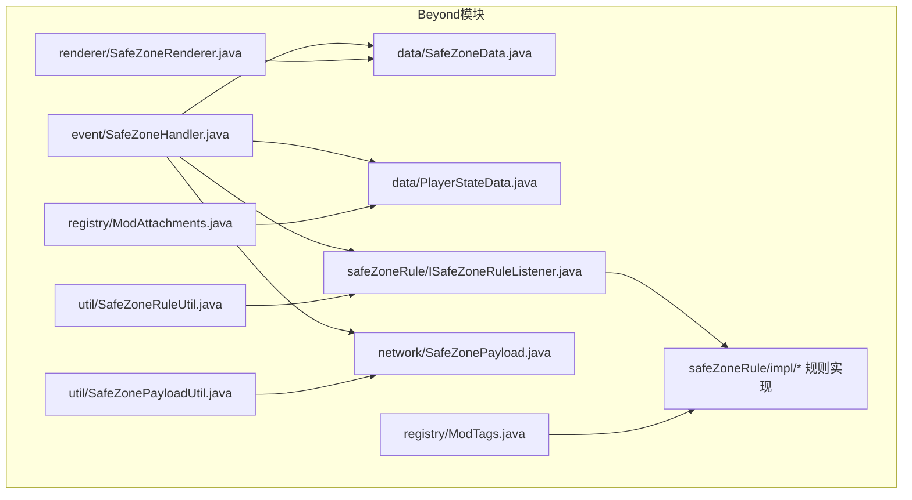

图表来源
- [SafeZoneHandler.java:35-77](file://Beyond/src/main/java/com/pz/beyond/event/SafeZoneHandler.java#L35-L77)
- [SafeZoneData.java:16-101](file://Beyond/src/main/java/com/pz/beyond/data/SafeZoneData.java#L16-L101)
- [PlayerStateData.java:13-65](file://Beyond/src/main/java/com/pz/beyond/data/PlayerStateData.java#L13-L65)
- [ISafeZoneRuleListener.java:13-41](file://Beyond/src/main/java/com/pz/beyond/safeZoneRule/ISafeZoneRuleListener.java#L13-L41)
- [SafeZonePayload.java:10-31](file://Beyond/src/main/java/com/pz/beyond/network/SafeZonePayload.java#L10-L31)
- [SafeZonePayloadUtil.java:9-32](file://Beyond/src/main/java/com/pz/beyond/util/SafeZonePayloadUtil.java#L9-L32)
- [SafeZoneRuleUtil.java:11-54](file://Beyond/src/main/java/com/pz/beyond/util/SafeZoneRuleUtil.java#L11-L54)
- [ModAttachments.java:11-22](file://Beyond/src/main/java/com/pz/beyond/registry/ModAttachments.java#L11-L22)
- [ModTags.java:9-17](file://Beyond/src/main/java/com/pz/beyond/registry/ModTags.java#L9-L17)
- [SafeZoneRenderer.java](file://Beyond/src/main/java/com/pz/beyond/renderer/SafeZoneRenderer.java)

章节来源
- [Beyond.java:38-79](file://Beyond/src/main/java/com/pz/beyond/Beyond.java#L38-L79)

## 核心组件
- 安全区数据模型：以正方形范围表示安全区，支持中心点与半径的持久化与广播。
- 玩家状态数据：记录玩家是否处于安全区内，支持序列化与死亡继承。
- 规则监听器接口：定义安全区内/外每tick回调、伤害拦截、怪物生成限制等扩展点。
- 规则实现：包含无敌、禁止怪物生成、禁止进食、自动恢复等内置规则。
- 网络同步：自定义协议载荷与分发工具，实现服务端到客户端的实时同步。
- 注册与标签：玩家附件注册、实体类型标签，支撑规则判定。
- 渲染辅助：客户端可视化安全区边界。

章节来源
- [SafeZoneData.java:16-101](file://Beyond/src/main/java/com/pz/beyond/data/SafeZoneData.java#L16-L101)
- [PlayerStateData.java:13-65](file://Beyond/src/main/java/com/pz/beyond/data/PlayerStateData.java#L13-L65)
- [ISafeZoneRuleListener.java:13-41](file://Beyond/src/main/java/com/pz/beyond/safeZoneRule/ISafeZoneRuleListener.java#L13-L41)
- [SafeZonePayload.java:10-31](file://Beyond/src/main/java/com/pz/beyond/network/SafeZonePayload.java#L10-L31)
- [SafeZonePayloadUtil.java:9-32](file://Beyond/src/main/java/com/pz/beyond/util/SafeZonePayloadUtil.java#L9-L32)
- [ModAttachments.java:11-22](file://Beyond/src/main/java/com/pz/beyond/registry/ModAttachments.java#L11-L22)
- [ModTags.java:9-17](file://Beyond/src/main/java/com/pz/beyond/registry/ModTags.java#L9-L17)

## 架构总览
安全区系统遵循“服务端持有数据，客户端接收同步”的架构模式。服务端在启动时初始化安全区数据，并在变更时广播；事件处理器根据规则监听器集合对各类事件进行裁决；网络层负责将安全区参数编码为自定义载荷并分发至客户端；客户端渲染器依据缓存数据进行可视化。

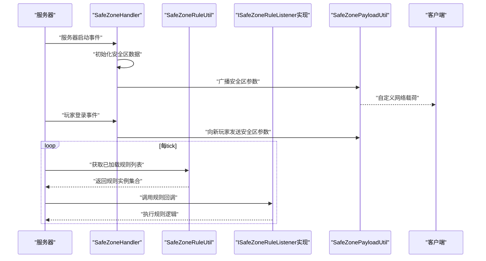

图表来源
- [SafeZoneHandler.java:44-52](file://Beyond/src/main/java/com/pz/beyond/event/SafeZoneHandler.java#L44-L52)
- [SafeZoneHandler.java:61-68](file://Beyond/src/main/java/com/pz/beyond/event/SafeZoneHandler.java#L61-L68)
- [SafeZoneRuleUtil.java:13-48](file://Beyond/src/main/java/com/pz/beyond/util/SafeZoneRuleUtil.java#L13-L48)
- [SafeZonePayloadUtil.java:26-30](file://Beyond/src/main/java/com/pz/beyond/util/SafeZonePayloadUtil.java#L26-L30)

## 详细组件分析

### ISafeZoneRuleListener接口设计
- 设计目标：为安全区规则提供统一的生命周期回调与事件拦截点，便于扩展不同类型的规则。
- 关键回调：
  - 安全区内每tick：onSafeZoneTick
  - 安全区外每tick：outSideSafeZoneTick
  - 无敌状态处理：invincible（拦截伤害）
  - 禁止怪物生成：onMobSpawn（限制特定实体类型在安全区内生成）
- 上下文：SafeZoneContext携带当前玩家信息，供规则按需使用。

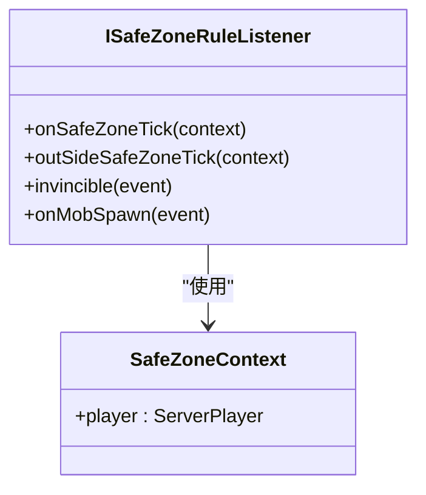

图表来源
- [ISafeZoneRuleListener.java:13-41](file://Beyond/src/main/java/com/pz/beyond/safeZoneRule/ISafeZoneRuleListener.java#L13-L41)

章节来源
- [ISafeZoneRuleListener.java:13-41](file://Beyond/src/main/java/com/pz/beyond/safeZoneRule/ISafeZoneRuleListener.java#L13-L41)

### 安全区数据模型
- 数据结构：中心坐标与半径，布尔标记是否首次初始化。
- 计算方法：基于绝对差值判断点是否在正方形范围内。
- 更新策略：提供中心更新与半径调整方法，并在变更后标记脏数据并广播。
- 持久化：实现SavedData的读写，支持NBT序列化。

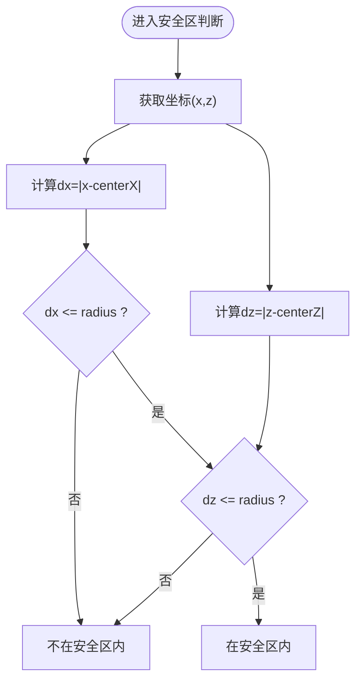

图表来源
- [SafeZoneData.java:49-57](file://Beyond/src/main/java/com/pz/beyond/data/SafeZoneData.java#L49-L57)

章节来源
- [SafeZoneData.java:16-101](file://Beyond/src/main/java/com/pz/beyond/data/SafeZoneData.java#L16-L101)

### 玩家状态管理
- 状态枚举：INSIDE_SAFETY_ZONE、IN_GAME
- 序列化：使用RecordCodecBuilder定义CODEC，支持数据持久化与网络传输
- 附件注册：通过ModAttachments注册PlayerStateData附件，支持死亡继承

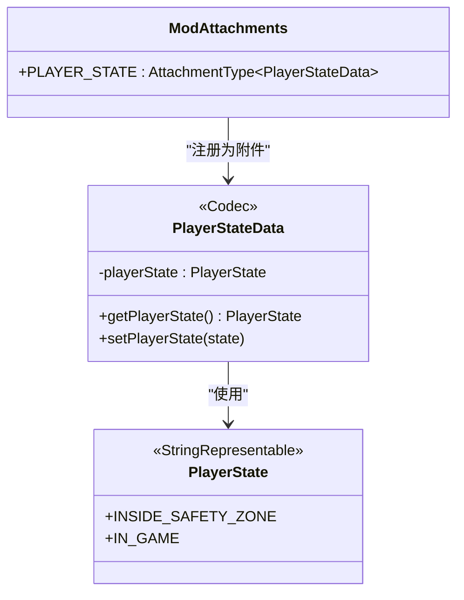

图表来源
- [PlayerStateData.java:13-65](file://Beyond/src/main/java/com/pz/beyond/data/PlayerStateData.java#L13-L65)
- [ModAttachments.java:11-22](file://Beyond/src/main/java/com/pz/beyond/registry/ModAttachments.java#L11-L22)

章节来源
- [PlayerStateData.java:13-65](file://Beyond/src/main/java/com/pz/beyond/data/PlayerStateData.java#L13-L65)
- [ModAttachments.java:11-22](file://Beyond/src/main/java/com/pz/beyond/registry/ModAttachments.java#L11-L22)

### 网络同步机制
- 自定义载荷：SafeZonePayload封装centerX、centerZ、radius，提供StreamCodec编解码
- 分发工具：SafeZonePayloadUtil支持单个玩家推送与全服广播
- 同步时机：服务器启动时初始化并广播；玩家登录时单独推送；数据变更时广播

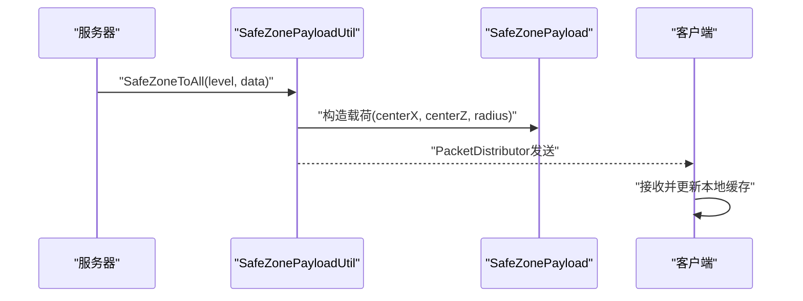

图表来源
- [SafeZonePayload.java:10-31](file://Beyond/src/main/java/com/pz/beyond/network/SafeZonePayload.java#L10-L31)
- [SafeZonePayloadUtil.java:26-30](file://Beyond/src/main/java/com/pz/beyond/util/SafeZonePayloadUtil.java#L26-L30)

章节来源
- [SafeZonePayload.java:10-31](file://Beyond/src/main/java/com/pz/beyond/network/SafeZonePayload.java#L10-L31)
- [SafeZonePayloadUtil.java:9-32](file://Beyond/src/main/java/com/pz/beyond/util/SafeZonePayloadUtil.java#L9-L32)

### 安全区规则系统
- 规则注解：@SafeZoneRule用于标记可自动发现的规则实现
- 规则发现：SafeZoneRuleUtil在commonSetup阶段扫描所有模组，通过反射实例化并收集规则
- 规则执行：SafeZoneHandler在事件总线上分发规则回调

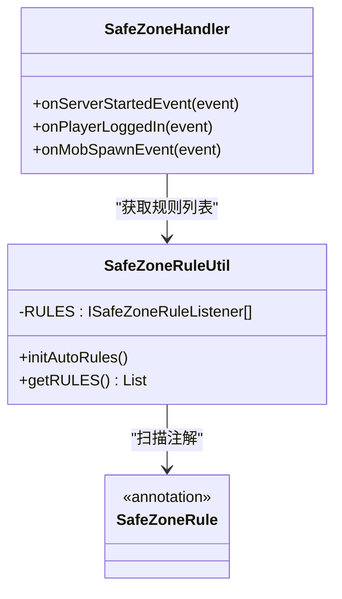

图表来源
- [SafeZoneRule.java:8-11](file://Beyond/src/main/java/com/pz/beyond/safeZoneRule/SafeZoneRule.java#L8-L11)
- [SafeZoneRuleUtil.java:11-54](file://Beyond/src/main/java/com/pz/beyond/util/SafeZoneRuleUtil.java#L11-L54)
- [SafeZoneHandler.java:35-77](file://Beyond/src/main/java/com/pz/beyond/event/SafeZoneHandler.java#L35-L77)

章节来源
- [SafeZoneRule.java:8-11](file://Beyond/src/main/java/com/pz/beyond/safeZoneRule/SafeZoneRule.java#L8-L11)
- [SafeZoneRuleUtil.java:11-54](file://Beyond/src/main/java/com/pz/beyond/util/SafeZoneRuleUtil.java#L11-L54)
- [SafeZoneHandler.java:35-77](file://Beyond/src/main/java/com/pz/beyond/event/SafeZoneHandler.java#L35-L77)

### 具体规则实现与工作原理

#### 无敌规则（Invincible）
- 触发条件：当玩家位于安全区内且受到伤害时
- 执行逻辑：拦截伤害事件，将新伤害设为0
- 适用场景：保护新手或重生区域

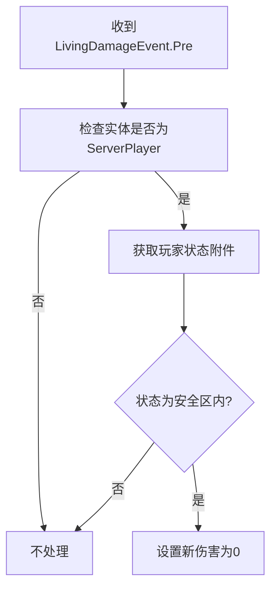

图表来源
- [Invincible.java:14-21](file://Beyond/src/main/java/com/pz/beyond/safeZoneRule/impl/Invincible.java#L14-L21)

章节来源
- [Invincible.java:10-23](file://Beyond/src/main/java/com/pz/beyond/safeZoneRule/impl/Invincible.java#L10-L23)

#### 禁止怪物生成（NoMobSpawn）
- 触发条件：实体生成位置检查事件
- 执行逻辑：若实体类型带有特定标签且位置在安全区内，则阻止生成
- 适用场景：避免危险生物入侵安全区

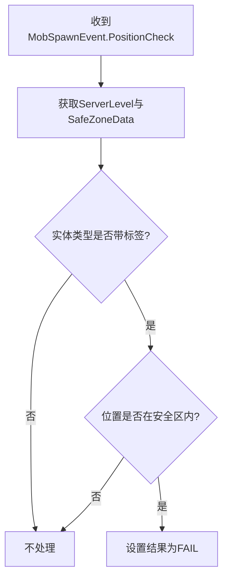

图表来源
- [NoMobSpawn.java:16-26](file://Beyond/src/main/java/com/pz/beyond/safeZoneRule/impl/NoMobSpawn.java#L16-L26)

章节来源
- [NoMobSpawn.java:12-29](file://Beyond/src/main/java/com/pz/beyond/safeZoneRule/impl/NoMobSpawn.java#L12-L29)
- [ModTags.java:9-17](file://Beyond/src/main/java/com/pz/beyond/registry/ModTags.java#L9-L17)

#### 禁止进食（NoEat）
- 触发条件：安全区内每tick
- 执行逻辑：定时将饥饿度与饱和度重置为最大值
- 适用场景：强制玩家在安全区内保持最佳状态

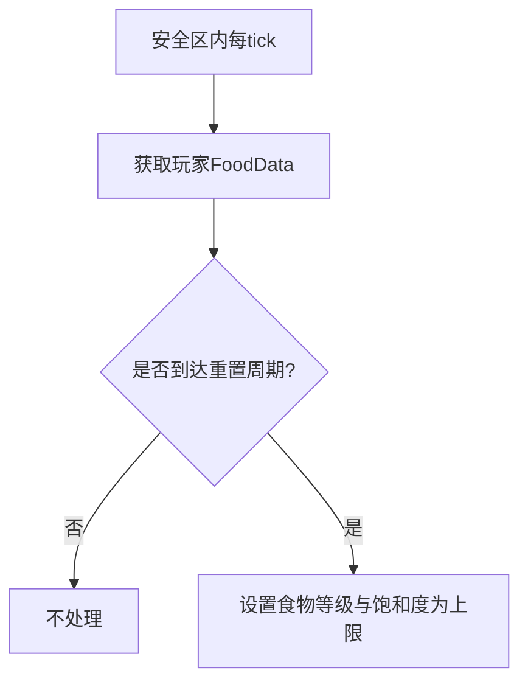

图表来源
- [NoEat.java:13-21](file://Beyond/src/main/java/com/pz/beyond/safeZoneRule/impl/NoEat.java#L13-L21)

章节来源
- [NoEat.java:10-23](file://Beyond/src/main/java/com/pz/beyond/safeZoneRule/impl/NoEat.java#L10-L23)

#### 自动恢复（AutoRegeneration）
- 触发条件：安全区内每tick
- 执行逻辑：定时为玩家回血
- 适用场景：提供被动恢复，增强安全区体验

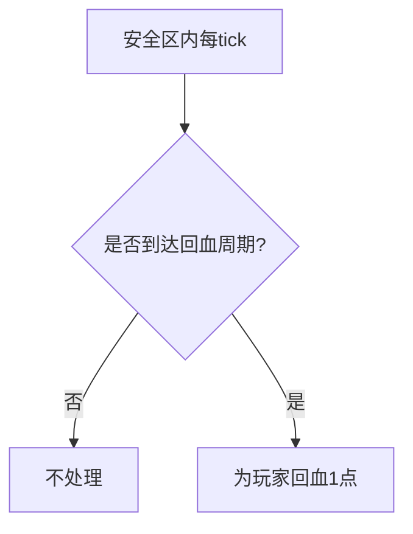

图表来源
- [AutoRegeneration.java:11-16](file://Beyond/src/main/java/com/pz/beyond/safeZoneRule/impl/AutoRegeneration.java#L11-L16)

章节来源
- [AutoRegeneration.java:7-18](file://Beyond/src/main/java/com/pz/beyond/safeZoneRule/impl/AutoRegeneration.java#L7-L18)

### 事件处理与状态切换
- 服务器启动：初始化安全区中心与半径，仅首次生效
- 玩家登录：向新玩家推送当前安全区参数
- 怪物生成：遍历规则列表，对符合条件的实体类型执行生成限制
- 玩家状态：通过事件总线触发状态变更事件，便于外部模块感知

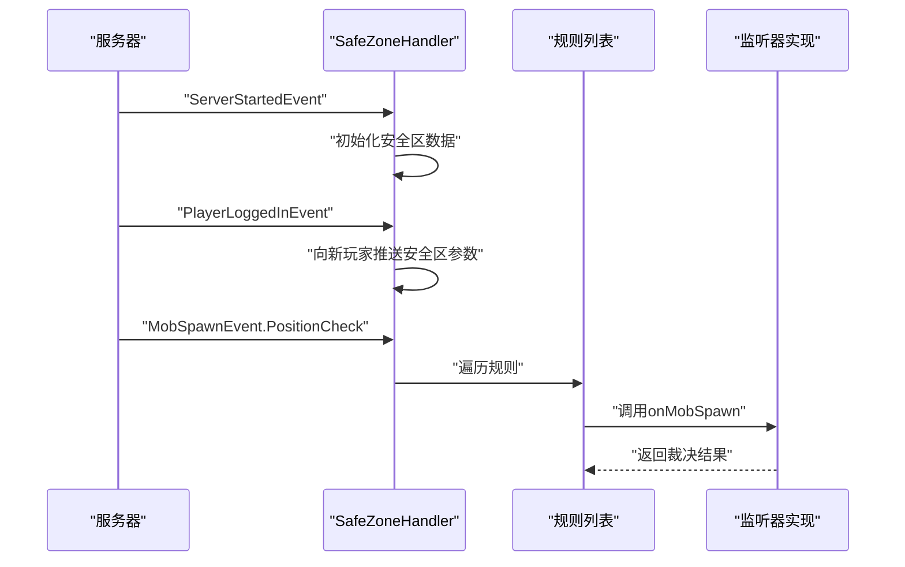

图表来源
- [SafeZoneHandler.java:44-52](file://Beyond/src/main/java/com/pz/beyond/event/SafeZoneHandler.java#L44-L52)
- [SafeZoneHandler.java:61-68](file://Beyond/src/main/java/com/pz/beyond/event/SafeZoneHandler.java#L61-L68)
- [SafeZoneHandler.java:70-75](file://Beyond/src/main/java/com/pz/beyond/event/SafeZoneHandler.java#L70-L75)

章节来源
- [SafeZoneHandler.java:35-77](file://Beyond/src/main/java/com/pz/beyond/event/SafeZoneHandler.java#L35-L77)

### 与Biotech模块的协作关系
- 协作点：安全区规则可能需要与Biotech的基因系统交互，例如在安全区内限制某些与基因相关的生成或效果。
- 数据交互方式：通过事件总线与标签系统进行协作，规则实现可读取Biotech定义的标签或事件，从而影响安全区内的行为。
- 建议：在规则实现中使用Biotech提供的API接口与事件，确保兼容性与稳定性。

[本节为概念性说明，未直接分析具体文件，故不附加章节来源]

## 依赖关系分析
- 模块入口：Beyond作为主入口，注册附件与配置，并在commonSetup阶段初始化规则发现。
- 事件耦合：SafeZoneHandler高度依赖NeoForge事件总线，贯穿服务器生命周期与玩家行为。
- 规则发现：通过注解扫描实现低耦合扩展，规则实现无需修改核心逻辑。
- 网络耦合：网络层与数据层松耦合，通过payload抽象屏蔽底层协议细节。

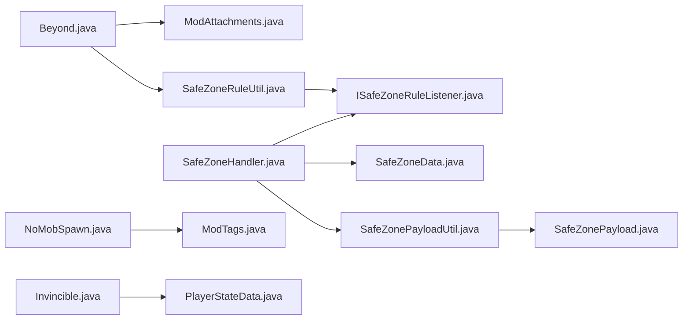

图表来源
- [Beyond.java:46-65](file://Beyond/src/main/java/com/pz/beyond/Beyond.java#L46-L65)
- [SafeZoneHandler.java:35-77](file://Beyond/src/main/java/com/pz/beyond/event/SafeZoneHandler.java#L35-L77)
- [SafeZoneRuleUtil.java:11-54](file://Beyond/src/main/java/com/pz/beyond/util/SafeZoneRuleUtil.java#L11-L54)
- [SafeZonePayloadUtil.java:9-32](file://Beyond/src/main/java/com/pz/beyond/util/SafeZonePayloadUtil.java#L9-L32)
- [SafeZonePayload.java:10-31](file://Beyond/src/main/java/com/pz/beyond/network/SafeZonePayload.java#L10-L31)
- [ModTags.java:9-17](file://Beyond/src/main/java/com/pz/beyond/registry/ModTags.java#L9-L17)
- [PlayerStateData.java:13-65](file://Beyond/src/main/java/com/pz/beyond/data/PlayerStateData.java#L13-L65)

章节来源
- [Beyond.java:46-65](file://Beyond/src/main/java/com/pz/beyond/Beyond.java#L46-L65)
- [SafeZoneHandler.java:35-77](file://Beyond/src/main/java/com/pz/beyond/event/SafeZoneHandler.java#L35-L77)
- [SafeZoneRuleUtil.java:11-54](file://Beyond/src/main/java/com/pz/beyond/util/SafeZoneRuleUtil.java#L11-L54)

## 性能考虑
- 规则发现：在commonSetup阶段一次性完成，避免运行时反射开销。
- 事件过滤：规则内部应尽量快速判断，减少不必要的计算。
- 网络广播：仅在安全区参数发生变更时广播，避免频繁发送。
- 客户端缓存：客户端维护安全区缓存，减少重复解析与绘制成本。

[本节为通用建议，不涉及具体文件分析]

## 故障排除指南
- 规则未生效
  - 检查规则类是否标注@SafeZoneRule且实现ISafeZoneRuleListener
  - 确认commonSetup已调用SafeZoneRuleUtil.initAutoRules
- 安全区参数不同步
  - 确认SafeZoneData变更后调用了广播方法
  - 检查客户端是否正确接收并更新缓存
- 怪物仍可在安全区内生成
  - 检查实体类型是否正确添加到ModTags.NO_SAFE_ZONE_SPAWN标签
  - 确认事件触发路径与规则执行顺序

章节来源
- [SafeZoneRuleUtil.java:13-48](file://Beyond/src/main/java/com/pz/beyond/util/SafeZoneRuleUtil.java#L13-L48)
- [SafeZonePayloadUtil.java:26-30](file://Beyond/src/main/java/com/pz/beyond/util/SafeZonePayloadUtil.java#L26-L30)
- [ModTags.java:9-17](file://Beyond/src/main/java/com/pz/beyond/registry/ModTags.java#L9-L17)

## 结论
Beyond安全区模块通过清晰的职责分离与事件驱动机制，构建了一个可扩展、可配置的安全区系统。其注解驱动的规则发现、稳定的网络同步与简洁的数据模型，使得模块既易于维护又便于扩展。结合Biotech模块的协作，可进一步丰富安全区内的玩法与交互。

[本节为总结性内容，不涉及具体文件分析]

## 附录

### 配置方法
- 模块配置：通过Beyond注册ModConfig，可在COMMON配置中添加安全区相关参数（如默认半径、首次初始化范围等）。
- 规则扩展：新增规则类只需实现ISafeZoneRuleListener并标注@SafeZoneRule，系统将自动发现并加载。

章节来源
- [Beyond.java:58-65](file://Beyond/src/main/java/com/pz/beyond/Beyond.java#L58-L65)
- [SafeZoneRule.java:8-11](file://Beyond/src/main/java/com/pz/beyond/safeZoneRule/SafeZoneRule.java#L8-L11)

### 客户端渲染与缓存
- 客户端缓存：SafeZoneClientCache用于存储从网络接收到的安全区参数，供渲染器使用。
- 渲染器：SafeZoneRenderer基于缓存数据绘制安全区边界，提升视觉反馈。

章节来源
- [SafeZoneClientCache.java](file://Beyond/src/main/java/com/pz/beyond/data/SafeZoneClientCache.java)
- [SafeZoneRenderer.java](file://Beyond/src/main/java/com/pz/beyond/renderer/SafeZoneRenderer.java)